# Morgan Stanley｜China DRAM Going Mainstream; Initiate CXMT at OW

**券商**：Morgan Stanley  
**分析師**：Charlie Chan（Morgan Stanley Taiwan Limited）  
**日期**：2026-08-26  
**主題**：China DRAM Going Mainstream; 首次覆蓋 CXMT (688825.SS) 給予 Overweight  
**評級**：Industry View: Attractive（亞太科技）  
<a href="https://layx.uk/dl?g=產業&b=MS&d=20260826&h=CXMT-DRAM-Initiation">📎 下載 PDF</a>

---

## 報告總結

MS 首次覆蓋長鑫存儲（CXMT，688825.SS）給予 OW，目標價 Rmb88（RI model，隱含 18.5x 2027e P/E），本報告的時機在於 CXMT 完成 A 股 IPO、全球 DRAM 緊缺格局形成，以及 HBM3E 量產路徑首次可見。報告核心主張：CXMT 已從低端消費 DRAM 升級為中國 AI 基礎設施的主力本土記憶體供應商，2026E 全球 DRAM 產能份額達 13%，且中國 AI/伺服器需求（大模型、Alibaba/ByteDance/Tencent CSP）在供應管制下只能靠本土解決，提供結構性需求護城河。

報告最大爭議在三個辯題：一、CXMT 能否在 2027 量產 HBM3E？MS 認為可（低良率、3-4mn 封裝），足以支撐 ~0.8-1mn 顆中國 AI GPU 出貨；二、CXMT 何時衝擊全球 DRAM 定價？MS 認為 2028 前無實質影響，2027 DRAM 定價維持樂觀（AI 驅動需求＋HBM 排擠效應）；三、估值如何？18.5x 2027e P/E 遠高於全球同業 4.4x，反映 140% 收入 CAGR 與中國戰略政策資本的確定性溢價。

---

## MS 完整投資邏輯鏈

| 論點層次 | Exhibit | 內容 |
|---|---|---|
| 全球 DRAM 結構性短缺已確認 | 7, 22 | 總 DRAM+HBM 供給缺口 -17%(2026e)，HBM 排擠效應持續至 2028e |
| 中國本土需求無法依賴進口 | 8, 13, 14 | 中國 AI GPU CoWoS 2027e 達 40kwpm，需本土 HBM/DDR5；美出口管制卡住全球品牌 |
| CXMT 產能快速擴張，具技術追趕軌跡 | 6, 26, 59 | 2024→2031 年每年增 100kwpm，G4b(16nm) 量產，HBM3E 2027 量產路徑可見 |
| 競爭地位現實：全球 HBM/Server DRAM 仍落後 | 15, 43 | HBM3E 2027 才量產（SK Hynix 已 HBM4E），Server DDR5 未規模化認證；近期衝擊有限 |
| 財務拐點陡峭 | 4, 5, 31 | 2025→2028e 收入 CAGR 140%，OpM 從虧損翻正至 70-72%，EPS CAGR 480% |
| 估值溢價有所依據 | 報告封面 | RI model Rmb88，18.5x 2027e P/E；戰略資產稀缺性（中國唯一規模 DRAM IDM）支撐溢價 |
| **結論** | 封面 | **OW；PT Rmb88；中國 AI 基礎設施本土化受益者，2027 是 HBM 與估值催化劑關鍵年** |

> **報告最大邏輯缺口**：HBM3E 良率假設對 2027 EPS 有非線性影響（低良率 = 更高單位成本），MS 未提供敏感度分析；另外 18.5x P/E 溢價的隱含假設（無出口管制升級）是最大不可控風險。

---

## 報告核心觀點

| 主題 | MS 觀點 | 市場共識 | 是否 Contra-Consensus |
|---|---|---|---|
| 全球 DRAM 2027 定價 | 樂觀；AI 需求＋HBM 排擠，缺口 -15% | 普遍擔憂 CXMT 壓價 | ✅ 是（更樂觀） |
| CXMT HBM3E 量產時間 | 2027 1H，低良率但可達 3-4mn stacks | 市場更保守，多數認為 2027 下半或 2028 | ✅ 是（更早） |
| CXMT 對全球定價的衝擊時間 | 2028 前無實質影響 | 部分投資人已擔憂 2026-27 影響 | ✅ 是（更晚影響） |
| CXMT 在 PC/Consumer DRAM | 已獲 HP/Dell/海外 OEM 採用（ASEAN/China 機型） | 市場多低估全球市場滲透速度 | ✅ 是（更樂觀） |
| CXMT 估值 | RI model 18.5x 2027e P/E vs 全球同業 4.4x | 市場無統一框架，本次 IPO 為首次定價 | — 首次覆蓋 |

**核心偏好**：CXMT OW；中國 AI GPU 供應鏈（需本土 HBM 的中國 Fabless/CSP）為間接受益者

---

## Exhibit 2｜DDR5 規格比較：CXMT vs 全球同業

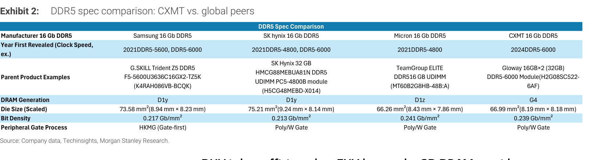

### 解讀摘要
CXMT G4 製程的 66.99mm² die 面積顯示其密度已與 Micron 相當，但時脈起跑點（DDR5-6000，2024 年才揭露）比 Samsung/SK Hynix 晚三年。「晚揭露但規格類似」這個現象意味 CXMT 是技術追趕者而非仿製者——達到相近密度但良率/量產能力仍是黑盒子，全球品牌採用時需要自行認證而非依靠品牌背書。

> **原文補充**：原文指出 CXMT DDR5 目前可達 5600MHz，roadmap 到 6400MHz，後者達到主流 Server DRAM（DDR5-6400）標準，是更廣泛 hyperscaler 採用的前提。

### 表格
| 廠商 | 製程 | Die 面積 (mm²) | 密度 (Gb/mm²) | 首揭露時脈 | 首揭露年份 |
|---|---|---|---|---|---|
| Samsung | E6P | 53.98 | 0.296 | DDR5-6000 | 2021 |
| SK Hynix | 1bnm | 52.19 | 0.307 | DDR5-6000 | 2021 |
| Micron | 1β | 68.16 | 0.235 | DDR5-4800 | 2021 |
| CXMT | G4 | 66.99 | 0.239 | DDR5-6000 | 2024 |

> **洞察一**：CXMT 密度(0.239 Gb/mm²)接近 Micron 1β(0.235)，遠低於 SK Hynix 1bnm(0.307)。SK Hynix 單位面積可多產 29% 位元，這是 CXMT 在同等晶圓面積下成本競爭力的最大技術短板。
> **值得驗證**：CXMT G4 良率（報告未揭露）。若良率僅 60-70% vs Samsung/SK Hynix 的 80-90%，則有效成本差距比 die 面積差距更大。

---

## Exhibit 3｜全球 DRAM 產能預測（2019-2028E）

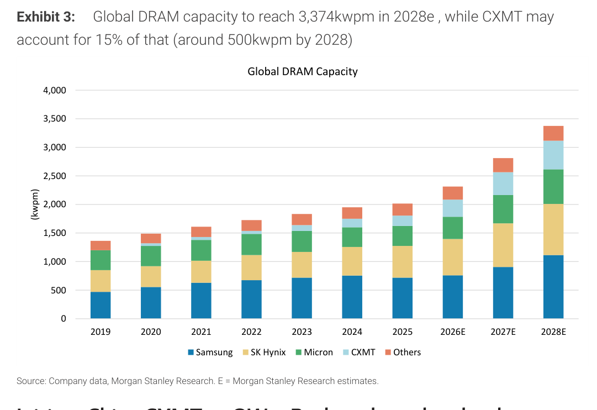

### 解讀摘要
2026-2028E 全球 DRAM 產能大幅擴張（2,313→3,374kwpm），但重心移向 CXMT：同期 CXMT 佔增量約 200kwpm / 總增量 ~1,061kwpm = 19%。這意味全球 DRAM 新增供給中，近五分之一來自一個在美出口管制下仍在擴張的中國廠商，這是 DRAM 產業格局的結構性轉變，也是本報告的主要論題。

### 表格（估算值，kwpm）
| 廠商 | 2025 | 2026E | 2027E | 2028E |
|---|---|---|---|---|
| Samsung | ~750 | ~800 | ~950 | ~1,100 |
| SK Hynix | ~600 | ~700 | ~800 | ~1,000 |
| Micron | ~450 | ~500 | ~550 | ~600 |
| CXMT | ~180 | ~300 | ~400 | ~500 |
| Others | ~40 | ~13 | ~15 | ~20 |
| **合計** | **~2,020** | **~2,313** | **~2,715** | **~3,374** |

> **洞察一**：CXMT 2025→2028E 增加 ~320kwpm，三大廠合計增加 ~740kwpm；CXMT 貢獻全球新增的 30%，但其產品多為國內 AI/消費 DRAM，不與全球超大型資料中心 Server DRAM 直接競爭，2027 前對全球定價壓力有限。

---

## Exhibit 4｜CXMT 收入 CAGR 140%（2022-2028E）

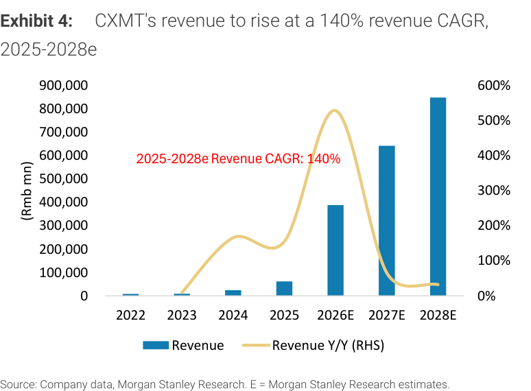

### 解讀摘要
CXMT 收入從 2025 約 Rmb70bn 爆發至 2026E 約 Rmb380bn（+443% YoY），增速主要來自：1）產能從 180kwpm 擴至 300kwpm（+67%）、2）HBM/DDR5 等高 ASP 產品佔比提升、3）良率改善。2027-28E YoY 增速回落至 +67%/+34%，反映基期墊高後成長趨緩但仍高。

### 表格（估算，Rmb mn）
| 年份 | 收入 | YoY% |
|---|---|---|
| 2022 | ~5,000 | — |
| 2023 | ~8,000 | +60% |
| 2024 | ~25,000 | +213% |
| 2025 | ~70,000 | +180% |
| 2026E | ~380,000 | ~+443% |
| 2027E | ~640,000 | ~+68% |
| 2028E | ~860,000 | ~+34% |

> **值得驗證**：2026E +443% YoY 假設產能利用率幾乎滿載（300kwpm × 接近 100% 利用率）。若中國 AI GPU 採購在 2H26 放緩，利用率可能低於預期，收入向下彈性很大。

---

## Exhibit 5｜CXMT 毛利率與營業利潤率軌跡（2022-2028E）

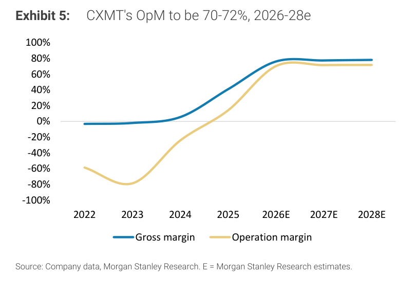

### 解讀摘要
CXMT 從 2022-23 年的深度虧損（GM -5%，OpM -80%）到 2026E 達到 GM ~80%、OpM ~70%，速度之快令人驚嘆。這種「V 形翻轉」的機制是：折舊已大量計提（固定成本高峰期已過）+ 量產良率改善（每片晶圓可售比例上升）+ ASP 維持（DRAM 緊缺定價保護）。OpM 比 GM 低約 10ppt 反映 R&D 費用高（半導體廠常態）。

> **洞察一**：2026E GM 接近 80% 意味 CXMT 每片晶圓的變動成本已非常低——這是 IDM 規模效應（固定折舊分攤）的典型體現。在 DRAM 下行週期，GM 可能快速壓縮至 40-50%，但 OpM 仍可維持正值（vs 2023 年 -80%），本質上是截然不同的財務風險檔位。

---

## Exhibit 6｜CXMT 總 DRAM 產能擴張路徑（2024-2031e）

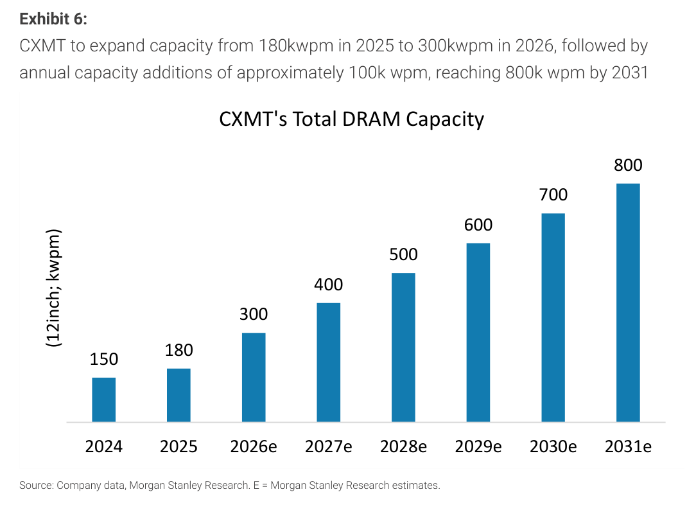

### 解讀摘要
每年 +100kwpm 的線性擴張計畫（2026e 起）預設 ASML DUV 設備供應不受進一步限制，且廠房建設（合肥新廠）如期進行。此路徑並非保守情境：150→800kwpm 在 7 年間增長 5.3 倍，隱含資本支出的持續投入與政策資金的持續挹注（Big Fund II/Anhui SASAC）。

### 表格（kwpm）
| 年份 | 產能 |
|---|---|
| 2024 | 150 |
| 2025 | 180 |
| 2026e | 300 |
| 2027e | 400 |
| 2028e | 500 |
| 2029e | 600 |
| 2030e | 700 |
| 2031e | 800 |

> **洞察一**：2025→2026e 的單年 +120kwpm（+67%）是整個擴張計畫最大的一步，是基礎案例的關鍵驗證點。若 2026 實際產能僅達 250kwpm，整個 2026-28E 財務模型均需下修。

---

## Exhibit 7｜全球 DRAM 供需缺口（2023-2027e）

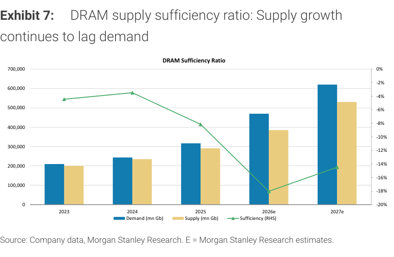

### 解讀摘要
總 DRAM+HBM 供給缺口從 2025 年 -8% 惡化至 2026e -17%，2027e 小幅收窄至 -15%。這個缺口的機制是 HBM 的兩重排擠：1）HBM 每單位佔用 2.5-3x 前沿晶圓面積（die penalty），2）AI 伺服器需求爆發導致 HBM 需求量加速。CXMT 進入 HBM（從 0 到 ~1,382 mn Gb in 2026e）雖是正面，但僅減少缺口約 1-2ppt（見 Exhibit 22），不足以填補。

### 表格（mn Gb）
| 年份 | 需求 | 供給 | 缺口% |
|---|---|---|---|
| 2023 | ~211,393 | ~203,364 | -4% |
| 2024 | ~252,481 | ~239,523 | -5% |
| 2025 | ~336,156 | ~324,022 | -4% |
| 2026e | ~503,879 | ~418,486 | **-17%** |
| 2027e | ~676,055 | ~575,965 | **-15%** |

> **洞察一**：2025→2026e 缺口從 -4% 到 -17% 的跳躍，幾乎完全對應 AI 伺服器需求爆發（exhibit_46 中 Server 佔比 2025→2026E 從 38%→47%）。這是 DRAM 緊缺的主因，不是供給端縮減。

---

## Exhibit 8｜中國 DRAM 本土化：需求遠超供給

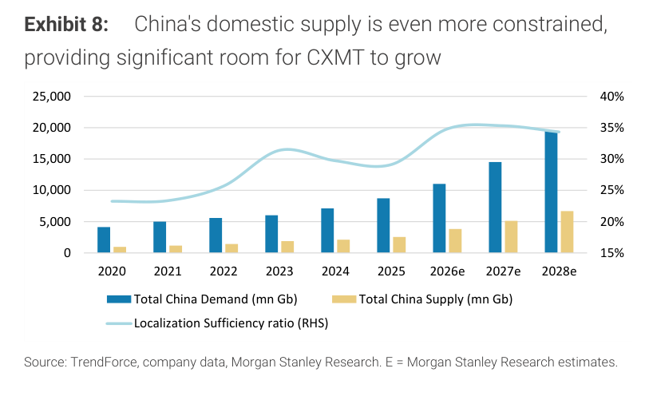

### 解讀摘要
中國 DRAM 需求從 2020 年 4,130 mn Gb 成長至 2028e 19,494 mn Gb（5年 CAGR ~21%），但本土供給僅從 960 mn Gb 成長至 6,690 mn Gb。本土化比率（Localization Sufficiency Ratio）在 2026-27e 達到峰值 ~35%，意味中國 65% 的 DRAM 需求仍需進口——這個缺口正是 CXMT 的戰略護城河：中國 CSP（Alibaba/ByteDance/Tencent）在出口管制下必須採用 CXMT，或面臨供給斷鏈風險。

> **洞察一**：比率上限 ~35% 的原因是 CXMT 自身良率/產能限制，而非需求飽和。即使 CXMT 2028e 達 500kwpm，其供給仍只能支撐中國需求的 34%，為長期確定性需求提供背景。

---

## Exhibit 9｜ASML Low NA EUV 出貨量（FY25-FY27e）

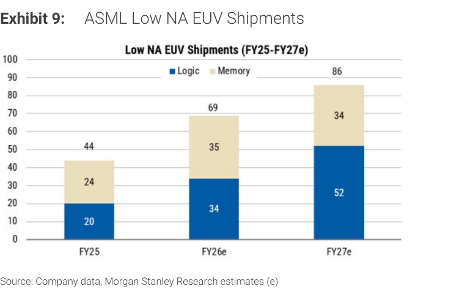

### 解讀摘要
全球 Low NA EUV 出貨量從 FY25 44 台（其中 24 台 Memory）增至 FY27e 86 台（34 台 Memory），Memory 設備比例相當穩定（55%-40%）。CXMT 無法取得 EUV（US 出口管制），意味其製程升級（G4→G5）需依賴更多 DUV 多重曝光，成本效率比 SK Hynix/Micron 差，但報告認為這是已知變數，不是增量風險。

### 表格（台）
| 年份 | 總出貨 | Logic | Memory |
|---|---|---|---|
| FY25 | 44 | 20 | 24 |
| FY26e | 69 | 34 | 35 |
| FY27e | 86 | 52 | 34 |

> **洞察一**：Memory EUV 設備從 FY26e 開始略減（35→34 台），與 FY27 Memory 投資放緩一致（HBM4 良率建立期進入尾聲）。但 Logic EUV（FY26e→FY27e +53%）顯示 AI 晶片投資持續加速，間接拉動記憶體需求。

---

## Exhibit 10｜ASML 訂單簿與積壓訂單

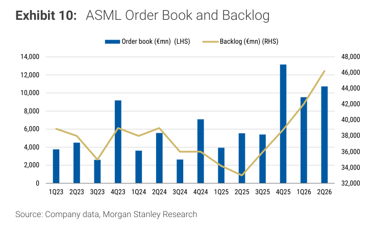

### 解讀摘要
ASML 積壓訂單（backlog）在 2Q26 達到 €46bn+ 的歷史新高，訂單簿在 Q4-25 峰值 ~€13bn 後小幅回落。高 backlog 是「設備廠商的多年收入能見度」，也是整個 DRAM 產業資本支出週期仍在進行中的最強確認訊號。

> **洞察一（配合 Exhibit 51）**：全球 DRAM spending 2026E 達 US$53bn（接近 2021 年的 US$21bn 的 2.5 倍），ASML backlog 積累正是這場 spending 週期的前置指標。CXMT 的設備使用以 DUV 為主，不直接貢獻 ASML backlog，但全球同業的 EUV 設備積壓確保了 2026-28 年的供給擴張受限（良率需要時間建立），有利於 DRAM 定價。

---

## Exhibit 11｜各終端市場 DRAM 庫存週數（2019-2Q26）

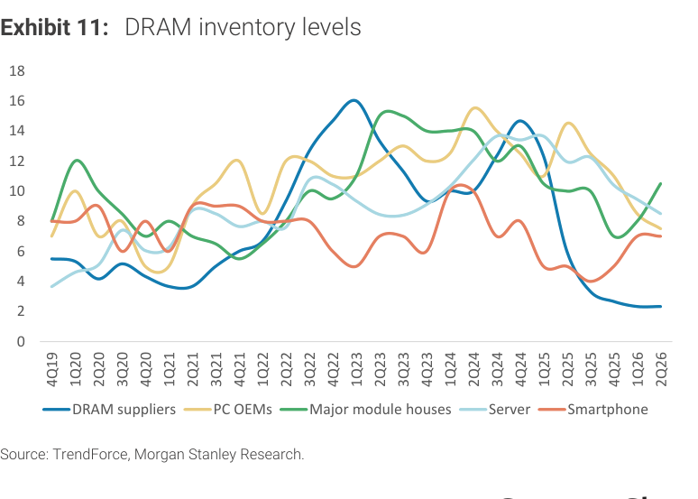

### 解讀摘要
DRAM 供應商自身庫存在 2Q26 跌至 ~2-3 週（接近歷史最低），PC OEM 和伺服器終端仍在 10-14 週。供應商庫存極低代表「手上沒有現貨」，若需求突然拉高，供應商沒有安全墊，有利於 ASP 維持。

---

## Exhibit 12｜DRAM 各終端市場庫存彙整（stacked bar，2019-2Q26）

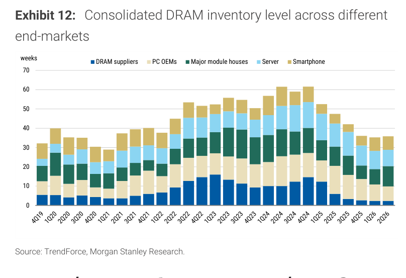

### 解讀摘要
整體庫存（各終端合計，週）從 2024 年峰值 ~60 週下降至 2Q26 約 35 週，方向向好但仍高於 2020-21 年的低點（~30 週）。未來 12 個月若 AI 伺服器需求持續強勁，整體庫存可降至 25-28 週的緊缺水平。

---

## Exhibit 13｜中國 CoWoS 產能→本土 AI GPU 記憶體需求

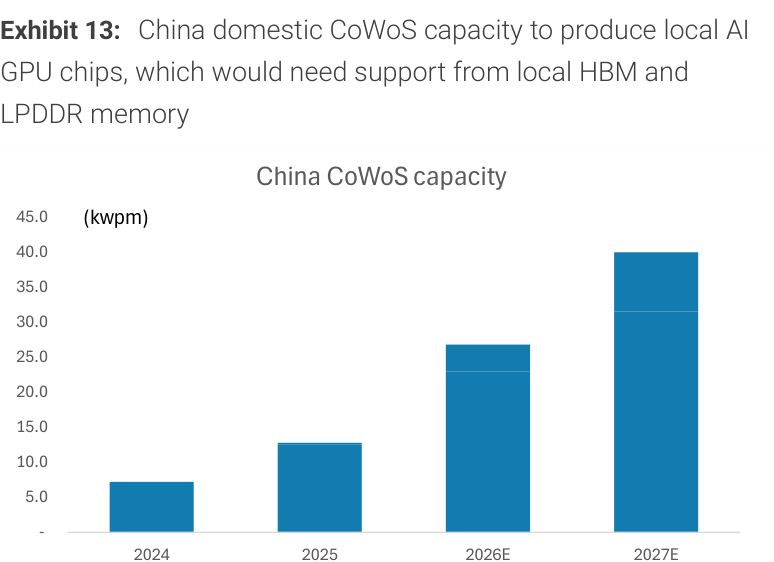

### 解讀摘要
中國 CoWoS 產能（中信科/華天等）從 2024 年 7kwpm 快速增至 2027E 40kwpm，每 kwpm CoWoS 產能對應一批需要 HBM 或 LPDDR6 的本土 AI 晶片（華為昇騰、百度昆侖等）。這條需求鏈是 CXMT HBM 市場的最直接受益路徑，且完全規避美國出口管制。

### 表格（kwpm）
| 年份 | 中國 CoWoS 產能 |
|---|---|
| 2024 | ~7 |
| 2025 | ~13 |
| 2026E | ~27 |
| 2027E | ~40 |

---

## Exhibit 14｜中國 CPU TAM 預測 → DRAM 需求驅動（2025-2030e）

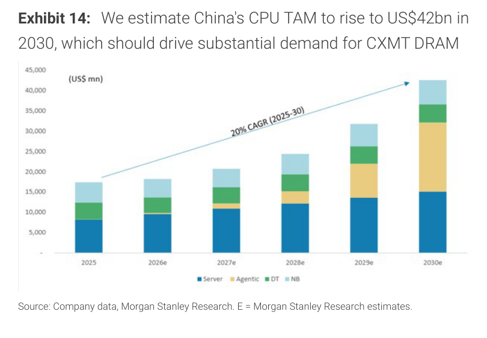

### 解讀摘要
中國 CPU TAM 從 US$17bn(2025) 成長至 US$42bn(2030e)（20% CAGR），其中 Server 市場佔比最大且成長最快（2025 US$8bn→2030 US$15bn）。每台 AI 伺服器配置 1.5-3TB DDR5，中國 CSP 在不能進口美國/韓國 DRAM 的情境下，CXMT DDR5 DDR5 是唯一大規模本土選項。

---

## Exhibit 15｜HBM 技術路線圖（各廠商 2020-2028E）

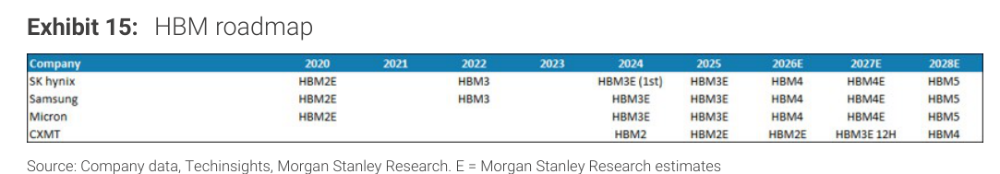

### 解讀摘要
CXMT 的 HBM 路線落後同業約 2 個世代：SK Hynix 在 2025 年已量產 HBM3E 並開發 HBM4E，CXMT 在 2025 年才完成 HBM2E，HBM3E 12H（12 層堆疊）預計 2027E 才量產。這個時間差很重要：HBM4 是 2027-28 年 Blackwell/Rubin 的標配，CXMT HBM3E 只能服務中國本土 AI 晶片市場，**不是**全球 Nvidia/AMD GPU 的 HBM 選項。

### 表格
| 廠商 | 2024 | 2025 | 2026E | 2027E | 2028E |
|---|---|---|---|---|---|
| SK Hynix | HBM3E (1st) | HBM3E | HBM4 | HBM4E | HBM5 |
| Samsung | HBM3E | HBM3E | HBM4 | HBM4E | HBM5 |
| Micron | HBM3E | HBM3E | HBM4 | HBM4E | HBM5 |
| **CXMT** | **HBM2** | **HBM2E** | **HBM2E** | **HBM3E 12H** | **HBM4** |

> **洞察一**：CXMT 的 HBM 代差（vs SK Hynix）在 2027 仍有 2 代（HBM3E vs HBM4E/HBM5）。這意味即使 CXMT HBM3E 成功量產，性能仍顯著落後，只能用於「對帶寬容忍度較高的中國 AI 訓練任務」而非最前沿推論應用。

---

## Exhibit 16｜全球 HBM TSV 產能估算（含 CXMT，2023e-2027e）

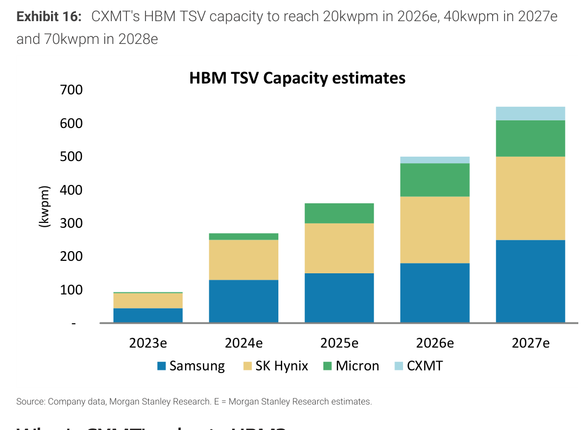

### 解讀摘要
CXMT HBM TSV 產能（2026e 20kwpm，2027e 40kwpm）在全球總量（2026e ~500kwpm，2027e ~650kwpm）中佔比僅 4%/6%，確認其在 HBM 供應中是邊際而非主流角色，但 40kwpm 已足以支援 3-4mn 個 HBM3E stacks（MS 估算）。

### 表格（kwpm）
| 廠商 | 2023e | 2024e | 2025e | 2026e | 2027e |
|---|---|---|---|---|---|
| Samsung | 45 | 130 | 150 | 180 | 250 |
| SK Hynix | 45 | 120 | 150 | 200 | 250 |
| Micron | 3 | 20 | 60 | 100 | 110 |
| CXMT | — | — | — | 20 | 40 |
| **合計** | **93** | **270** | **360** | **500** | **650** |

---

## Exhibit 17｜全球 HBM 產能（mn Gb，2023e-2027e）

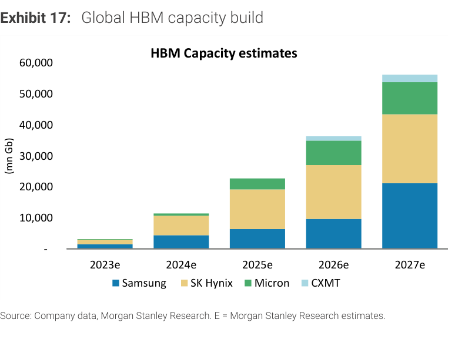

### 解讀摘要
全球 HBM 產能以 mn Gb 計，從 2023e 3,150 成長至 2027e 56,300 mn Gb（18x）。CXMT 佔 2026e 36,379 中的 1,382（3.8%）、2027e 56,300 中的 2,462（4.4%），與 Exhibit 18 的市佔率數字吻合。

---

## Exhibit 18｜HBM 市場份額（位元出貨 %，2023-2027）

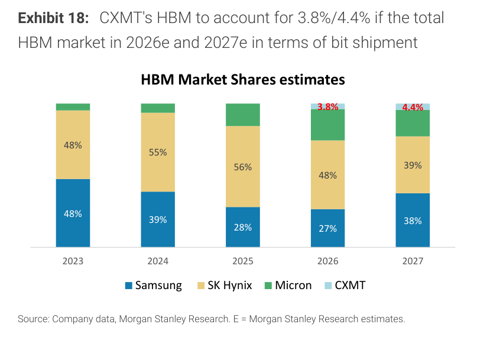

### 解讀摘要
SK Hynix 主導 HBM（2025 年 56% 份額），Samsung 在 2024-25 因 HBM3E 良率問題跌至 28%（2025），目前正在 HBM4 recovery。Micron 從 2025 年起取得 ~15% 份額（HBM3E 已過 Nvidia 認證）。CXMT 2027E 僅 4.4%，是結構性小玩家但已進入全球 HBM 市場。

### 表格（%）
| 廠商 | 2023 | 2024 | 2025 | 2026E | 2027E |
|---|---|---|---|---|---|
| Samsung | 48 | 39 | 28 | 27 | 38 |
| SK Hynix | 48 | 55 | 56 | 48 | 39 |
| Micron | — | — | ~13 | ~20 | ~17 |
| CXMT | — | — | — | 3.8 | 4.4 |

> **洞察一（配合 Exhibit 15）**：Samsung 在 2027e 份額回升至 38%（recovery from HBM3E yield issues），而 SK Hynix 降至 39%——兩者幾乎打平，反映 HBM4 競爭格局趨於均衡。CXMT 4.4% 份額雖小，其客戶（中國 AI GPU）是封閉生態系，不直接競爭全球 Nvidia GPU HBM 份額。

---

## Exhibit 19｜HBM Die Penalty（2021-2028E）

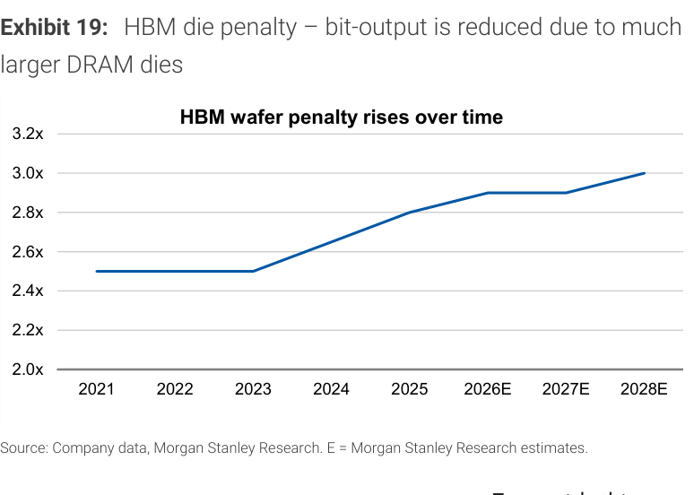

### 解讀摘要
HBM wafer penalty（每位元所需晶圓面積的倍數）從 2021-23 的穩定 2.5x 上升至 2028E 的 3.0x。這個「penalty 上升」代表每片晶圓的 HBM 位元產出比常規 DRAM 少——換言之，把晶圓面積轉移給 HBM 的機會成本更高，進一步壓縮 DDR5/LPDDR5 的可用產能，解釋了為何 exhibit_20 顯示 HBM 排擠效應加劇。

> **洞察一（配合 Exhibit 20）**：Exhibit 20 顯示 HBM 佔前沿晶圓面積 2028E 達 34%，乘以 exhibit_19 的 3.0x die penalty = 等效於佔用 102% 的前沿記憶體位元產能中的 34%×3.0=102%... 實際意味 HBM 需求消耗了超過三分之一的全球前沿 DRAM 晶圓，且這個比例的「代價」年年升高，是 conventional DRAM 結構性緊缺的核心機制。

---

## Exhibit 20｜HBM 排擠效應：佔前沿晶圓比例（2023-2028E）

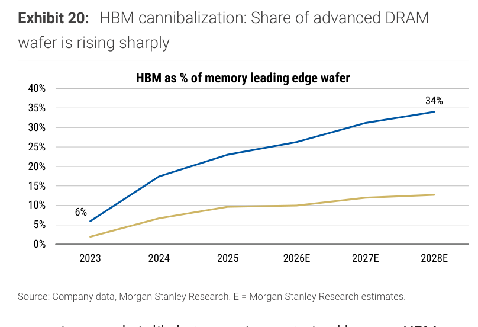

### 解讀摘要
HBM 作為前沿記憶體晶圓面積的比例從 2023 年 6% 急升至 2028E 34%（藍線），第二條線（黃線，疑為包含 HBM 的全部高性能記憶體）升至 13%。「排擠效應」的邏輯是：不同於傳統 DRAM 晶片使用同一生產線，HBM 需要最前沿製程（接近 Samsung/SK Hynix 最先進設備），所以 HBM 需求的快速增長直接與 Server DDR5、LPDDR5 競爭同一批最佳產線。

---

## Exhibit 21｜HBM TAM 基礎案例（2023-2027e）

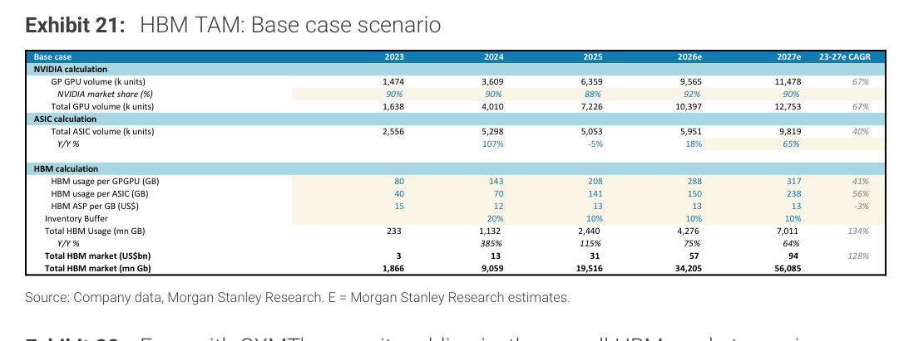

### 解讀摘要
全球 HBM 市場（US$bn）從 2023 年 US$3bn 爆發至 2027e US$94bn（5年 31x），驅動力是 NVIDIA GPU 出貨量（+67% CAGR）× 每 GPU HBM 用量（288GB in 2026e，+41% CAGR）。HBM ASP 下滑（US$15→US$13/GB，-3%）被用量成長完全壓過。HBM TAM 成長 31 倍 vs DRAM 總市場約 10 倍，說明 HBM 是整個記憶體投資論點的核心引擎。

### 表格
| 指標 | 2023 | 2024 | 2025 | 2026e | 2027e | CAGR |
|---|---|---|---|---|---|---|
| NVIDIA GPU (k units) | 1,474 | 3,609 | 6,359 | 9,565 | 11,478 | 67% |
| NVIDIA 市占 (%) | 90 | 90 | 88 | 92 | 90 | — |
| Total GPU (k units) | 1,638 | 4,010 | 7,226 | 10,397 | 12,753 | 67% |
| Total ASIC (k units) | 2,556 | 5,298 | 5,053 | 5,951 | 9,819 | 40% |
| HBM per GPU (GB) | 80 | 143 | 208 | 288 | 317 | 41% |
| HBM per ASIC (GB) | 40 | 70 | 141 | 150 | 238 | 56% |
| HBM ASP (US$/GB) | 15 | 12 | 13 | 13 | 13 | -3% |
| Total HBM (mn GB) | 233 | 1,132 | 2,440 | 4,276 | 7,011 | 134% |
| **HBM 市場 (US$bn)** | **3** | **13** | **31** | **57** | **94** | **128%** |

> **洞察一**：HBM per GPU 從 2024 年 143GB（H100×8）到 2026e 288GB（接近 Rubin/Blackwell NVL72 配置），單一 GPU 用量翻倍，這是比 GPU 出貨量成長（本身已 67% CAGR）更重要的乘數效應。
> **值得驗證**：HBM ASP 維持 US$13/GB 的假設——若中國自製 HBM（CXMT）大量滲入中國市場並引發本土殺價，可能壓低中國本土市場 ASP（但全球市場 HBM ASP 受 LTA 保護，短期免疫）。

---

## Exhibit 22｜HBM 供需平衡：CXMT 加入後仍是缺口

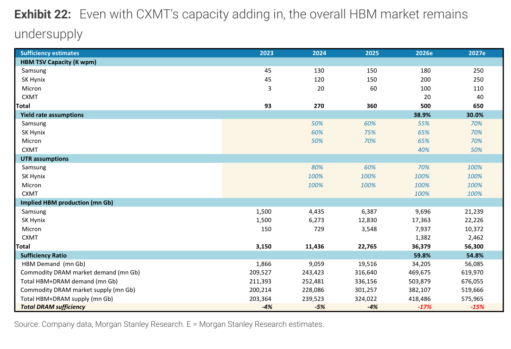

### 解讀摘要
最關鍵的供需模型表格。CXMT 在 2026e 貢獻 1,382 mn Gb、2027e 2,462 mn Gb 的 HBM 供給，加入後**全球 Total DRAM sufficiency 仍為 -17%(2026e)、-15%(2027e)**，確認 CXMT 是「正面增量」但不是「供給過剩的觸發器」。CXMT HBM 良率（40%→50%，vs SK Hynix 65%→70%）是表中最謹慎的假設。

### 表格（精簡）
| 指標 | 2025 | 2026e | 2027e |
|---|---|---|---|
| HBM TSV 總產能（k wpm） | 360 | 500 | 650 |
| CXMT TSV 產能（k wpm） | — | 20 | 40 |
| CXMT 良率（%） | — | 40 | 50 |
| CXMT Implied HBM（mn Gb） | — | 1,382 | 2,462 |
| 全球 HBM supply（mn Gb） | 22,765 | 36,379 | 56,300 |
| **Total DRAM sufficiency** | **-4%** | **-17%** | **-15%** |

> **洞察一**：Total DRAM sufficiency = (Total HBM+DRAM supply - Total HBM+DRAM demand) / demand。即使把 CXMT 的 HBM 完全排除，缺口只會從 -17% 惡化至 -18%，表示 CXMT 2026e HBM 的邊際影響僅 ~1ppt——這反過來說明 DRAM 緊缺的主因是全球 AI 需求，不是缺少 CXMT。

---

## Exhibit 25｜CXMT 總位元出貨量（2024-2028e）

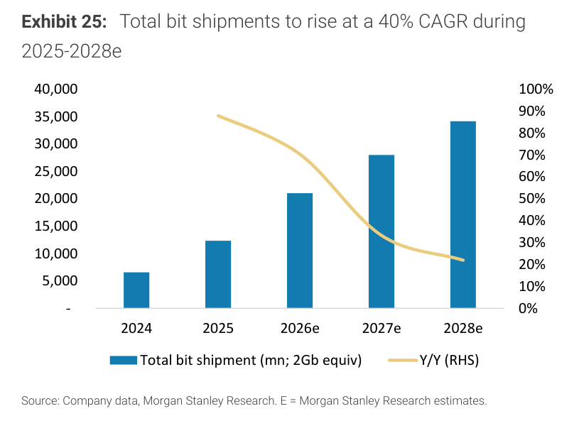

### 解讀摘要
位元出貨量（mn, 2Gb equiv）從 2024 年 ~6,300 到 2028e ~34,000（2025-28e CAGR 40%），YoY 增速從 ~90%(2025) 平滑降至 ~25%(2028e)，反映「基期墊高後的自然減速」而非需求走弱。

### 表格
| 年份 | 出貨量（mn, 2Gb equiv）| YoY% |
|---|---|---|
| 2024 | ~6,300 | — |
| 2025 | ~12,500 | ~+98% |
| 2026e | ~21,000 | ~+68% |
| 2027e | ~28,000 | ~+33% |
| 2028e | ~34,000 | ~+21% |

---

## Exhibit 26｜CXMT 晶圓生產節點組合（產能，2024-2029e）

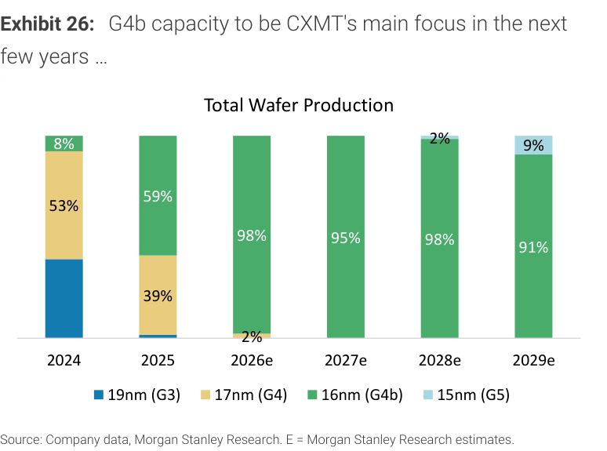

### 解讀摘要
G4b（16nm）製程從 2026e 起佔 CXMT 晶圓生產的 98%，完全取代 G4（17nm）和 G3（19nm）。G5（15nm）預計 2028-29e 開始佔 2-9%，代表 CXMT 量產節點升級開始。

### 表格（製程節點佔比%，產能）
| 節點 | 2024 | 2025 | 2026e | 2027e | 2028e | 2029e |
|---|---|---|---|---|---|---|
| 19nm (G3) | ~39% | ~2% | — | — | — | — |
| 17nm (G4) | ~53% | ~39% | 2% | — | — | — |
| 16nm (G4b) | — | ~59% | 98% | 95% | 98% | 91% |
| 15nm (G5) | — | — | — | — | 2% | 9% |

---

## Exhibit 27｜CXMT 位元出貨節點組合（%）

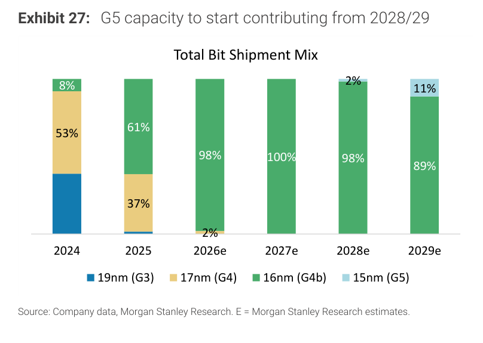

### 解讀摘要
位元出貨組合與產能組合（Exhibit 26）高度一致，G4b（16nm）從 2026e 起達 98-100%。G5（15nm）在 2029e 才貢獻 11%，意味 CXMT 的位元組合在 2026-28e 非常穩定——風險集中在 G4b 良率，而非多節點並行管理的複雜度。

---

## Exhibit 28｜CXMT HBM TSV 產能（2026e-2028e）

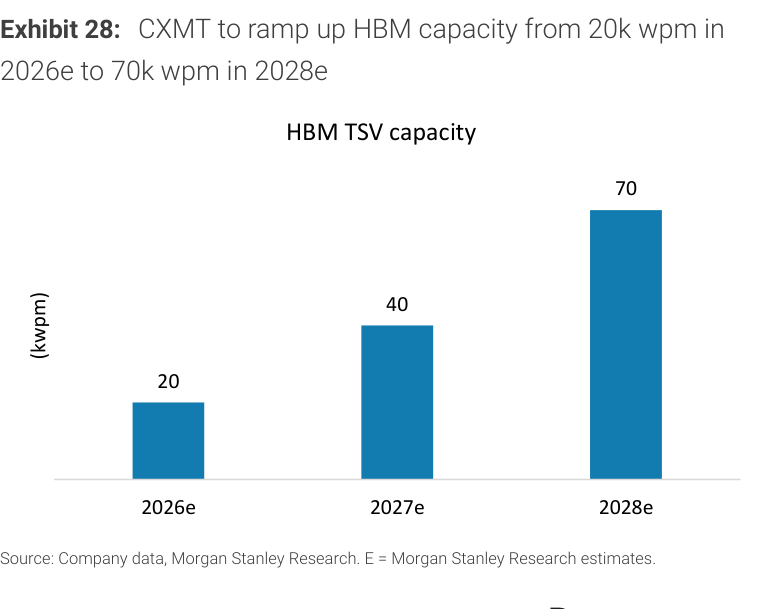

### 解讀摘要
CXMT 專屬 HBM TSV 產能：20kwpm(2026e) → 40kwpm(2027e) → 70kwpm(2028e)，每年倍增。這個擴張速度若實現，到 2028e CXMT HBM 供給可達 ~8,000 mn Gb（按 exhibit_22 良率假設提升後），約達 2027e 全球 HBM 市場的 14%。

### 表格（kwpm）
| 年份 | CXMT HBM TSV 產能 |
|---|---|
| 2026e | 20 |
| 2027e | 40 |
| 2028e | 70 |

> **洞察一（配合 Exhibit 16）**：CXMT 2028e TSV 產能 70kwpm 約為 SK Hynix 2027e 250kwpm 的 28%——從量而言仍是小玩家，但 70kwpm 在中國本土 AI GPU 需求下已是「供過於求」的警示線（中國 CoWoS 2027e 40kwpm，每 kwpm 需要約 2-4kwpm HBM TSV）。

---

## Exhibit 31｜CXMT EPS CAGR 480%（2022-2028E）

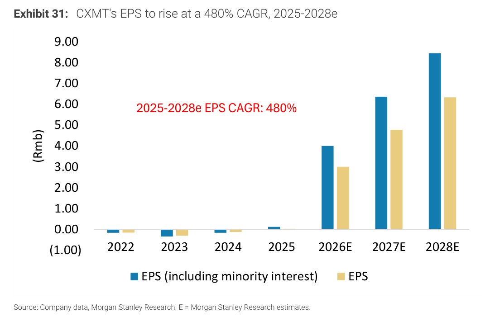

### 解讀摘要
EPS（含少數股東）從 2022-25 的幾乎為零/負（略負於 0）到 2026E Rmb4.0、2027E 6.3、2028E 8.5。「含少數股東」（blue bar）vs「EPS」（yellow bar，Rmb3.0/4.7/6.3）的差距反映 minority interest 調整（CXMT 非百分之百持有子公司，部分利潤歸少數股東）。PT Rmb88 基於 RI model，用 2027e EPS 看隱含 P/E = 88/6.3 = 14x（非含 minority interest）或 88/4.7 = 18.7x（EPS），接近報告聲稱的 18.5x 2027e P/E。

### 表格（Rmb）
| 年份 | EPS（含少數） | EPS |
|---|---|---|
| 2026E | ~4.0 | ~3.0 |
| 2027E | ~6.3 | ~4.7 |
| 2028E | ~8.5 | ~6.3 |

> **值得驗證**：MS PT Rmb88 基於 RI model（不是單純 P/E），所以 2027e P/E 18.5x 是結果而非輸入。RI model 的關鍵假設（CoE、長期 ROE、terminal growth）若 CXMT 面臨出口管制升級，可能需重新設定，但報告未提供 RI model 參數細節。

---

## Exhibit 35｜IPO 後股東結構（2026-07-27）

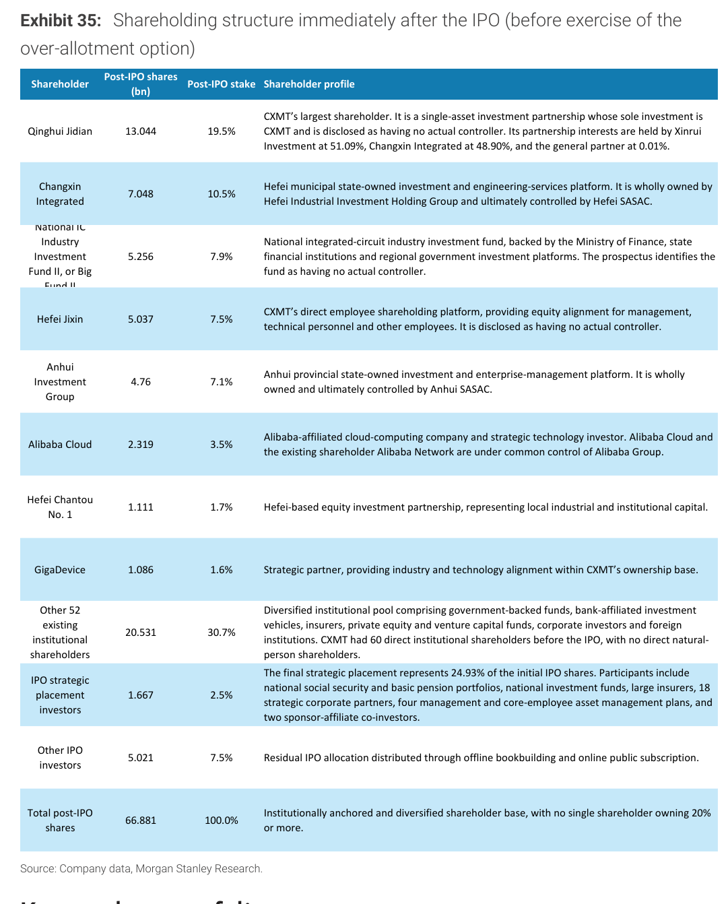

### 解讀摘要
沒有任何單一股東持有超過 20%，政策資本（Qinghui Jidian 19.5% + Changxin Integrated 10.5% + Big Fund II 7.9% + Anhui Investment 7.1%）合計持有約 45%，加上 Hefei Jixin（員工持股）7.5% = 政策/管理層合計約 52.5%，實際控制 CXMT 的方向。Alibaba Cloud 3.5% 是少數外部商業股東，代表「策略客戶轉股東」的典型中國科技股結構。

### 表格（精簡）
| 股東 | 持股% | 性質 |
|---|---|---|
| Qinghui Jidian | 19.5 | 合肥政策投資（Xinrui/Changxin 51/49%合夥） |
| Changxin Integrated | 10.5 | 合肥市 SASAC 旗下 |
| Big Fund II | 7.9 | 財政部/國家 IC 基金 |
| Hefei Jixin | 7.5 | 員工持股平台 |
| Anhui Investment | 7.1 | 安徽省 SASAC |
| Alibaba Cloud | 3.5 | 策略雲端客戶 |
| 其他 52 機構股東 | 30.7 | 政府基金/銀行/保險/VC |
| IPO 策略配售 | 2.5 | 社保/基金/保險 |
| IPO 其他投資人 | 7.5 | 線上/線下發行 |

> **洞察一**：Yiming Zhu（董事長，新加坡永久居民，GigaDevice 創辦人）是 CXMT 的技術核心；其持股透過 Qinghui Jidian 的合夥結構持有，實際個人持股比例需進一步追蹤。Big Fund II 7.9% 持股確保中央政策支持。

---

## Exhibit 36｜CXMT 收入按產品拆解（Rmb mn，2023-2025）

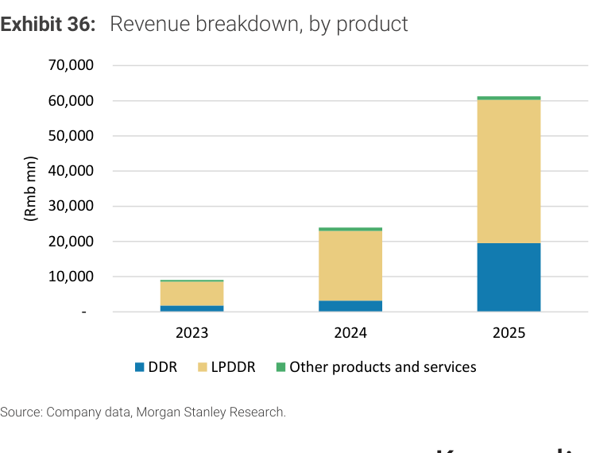

### 解讀摘要
2025 年收入 ~Rmb61bn 中，DDR（藍，~Rmb19.5bn = 32%）vs LPDDR（黃，~Rmb40bn = 66%），DDR 份額從 2024 年的 13% 大幅跳升，反映中國 AI 伺服器/高效能運算對 DDR5 的需求已在 2025 年開始實質成長。Other（綠，~2%）保持不變。

### 表格（Rmb mn）
| 年份 | DDR | LPDDR | Other | 合計 |
|---|---|---|---|---|
| 2023 | ~1,800 | ~6,750 | ~450 | ~9,000 |
| 2024 | ~3,120 | ~19,920 | ~960 | ~24,000 |
| 2025 | ~19,500 | ~40,000 | ~1,220 | ~60,720 |

> **洞察一（配合 Exhibit 37）**：DDR 份額從 13%(2024)→32%(2025) 的躍升（+19ppt）是 CXMT 從消費品 DRAM 廠轉型為 AI 基礎設施供應商的具體財務印記。這比所有定性描述更有說服力。

---

## Exhibit 37｜CXMT 收入產品組合（%，2023-2025）

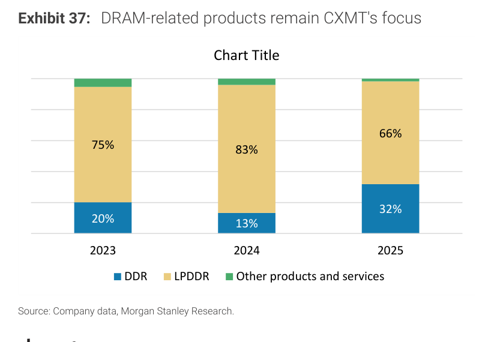

### 解讀摘要
DDR（藍）份額 20%(2023)→13%(2024)→32%(2025)：2024 年 DDR 份額暫時下降是因 LPDDR5（Huawei 手機大訂單）在 2024 年大幅成長，2025 年 AI 伺服器 DDR5 需求接力。LPDDR 仍佔多數（66%），但 DDR 的相對成長趨勢是 CXMT 產品組合向高 ASP 移動的訊號。

---

## Exhibit 39｜CXMT 半導體材料供應商清單

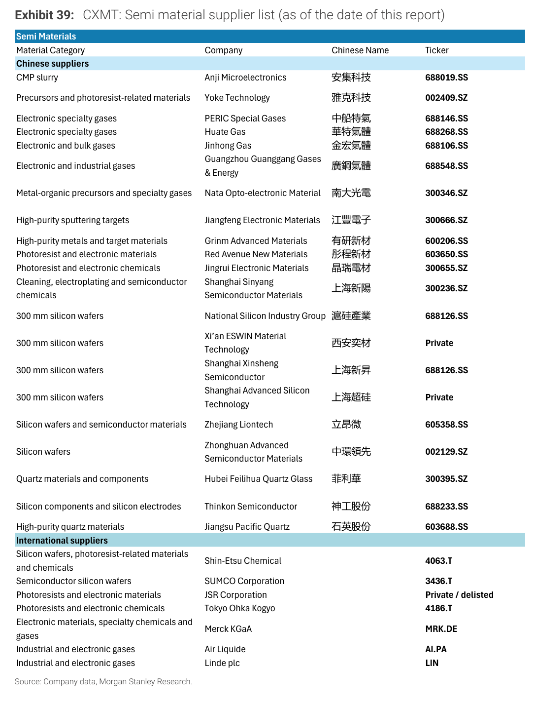

### 解讀摘要
材料供應鏈以中國廠商為主（CMP 漿料、光阻、特氣、矽晶圓），但仍有幾個關鍵品項依賴國際供應（Shin-Etsu/SUMCO 矽晶圓、JSR/Tokyo Ohka 光阻、Merck/Air Liquide/Linde 特氣）。這份清單是出口管制風險評估的重要依據：材料端（vs 設備端 ASML）目前管制較少，但若擴大至 Merck 電子材料或 Air Liquide 工業氣體，CXMT 量產可能受衝擊。

> **原文補充**：報告特別指出 ASML DUV 工具是目前的主要設備瓶頸，材料端的中國本土替代進展比設備端快（本土廠商在多個製程步驟已替換美國供應商）。

---

## Exhibit 40｜CXMT 封測與記憶體模組供應商清單

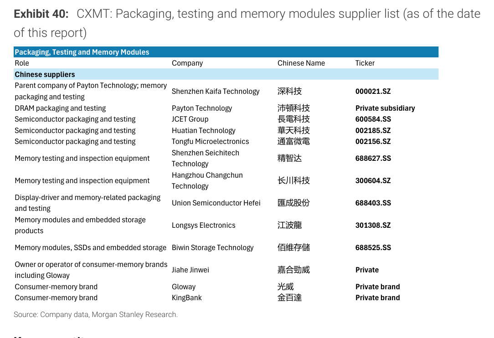

### 解讀摘要
封測端（Payton Technology/長電/華天/通富微）全為中國廠商，測試設備（精智達/長川科技）亦為本土供應。HBM 封裝（TSV、CoW bonding）是技術關鍵，Payton Technology（Shenzhen Kaifa 子公司）是 CXMT 的主要封測合作夥伴。品牌端（Gloway/KingBank）是下游消費者 DRAM 品牌，依賴 CXMT DRAM 芯片。整條封測價值鏈的本土化程度高，出口管制衝擊有限。

---

## Exhibit 41｜CXMT 管理層詳情（截至 2026-07-27）

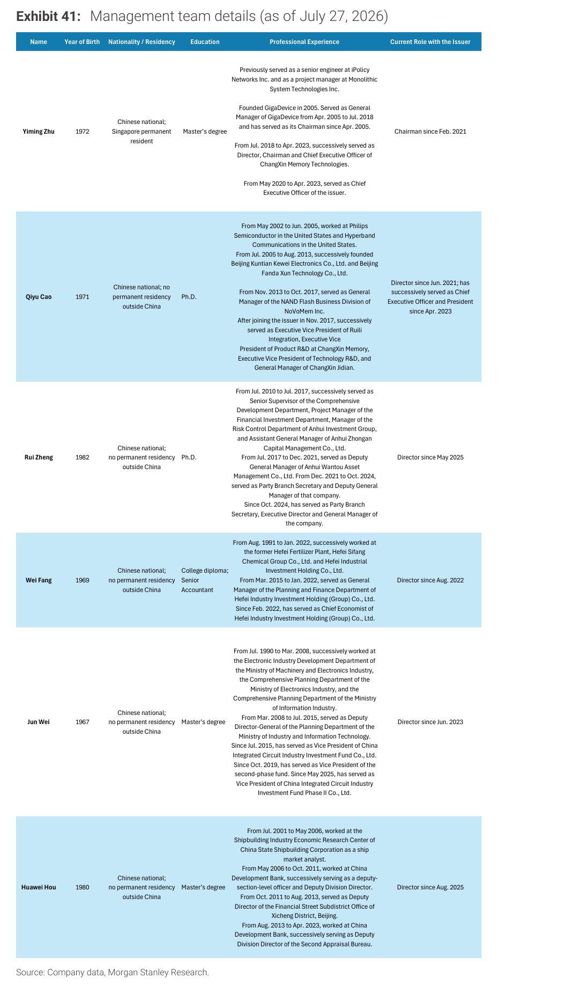

### 解讀摘要
管理層結構透露兩個關鍵訊息：1）技術核心是「歸國半導體人才」——CEO Qiyu Cao（Ph.D.，ex-NoVoMem NAND、前 Rulli Integration EV President）和 Chairman Yiming Zhu（前 iPolicy/Monolithic，GigaDevice 創辦人，新加坡 PR）均有深厚國際半導體業背景；2）董事會 = 政策資本代表（Anhui Investment 的 Rui Zheng、Hefei Industrial 的 Wei Fang、Big Fund II VP Jun Wei、CDB 的 Huawei Hou），確保國家戰略方向與公司決策高度對齊。

---

## Exhibit 42｜AI 伺服器成為記憶體系統（記憶體層次金字塔）

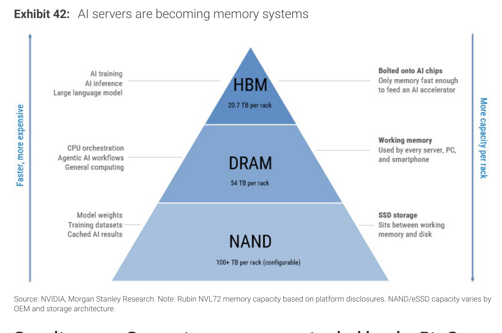

### 解讀摘要
Rubin NVL72 平台每機架配備 HBM 20.7TB、DRAM 54TB、NAND 100+TB，展示了三層記憶體在 AI 伺服器中的角色分工：HBM 是速度瓶頸（緊貼 AI 加速器）、DRAM 是工作記憶體（CPU 協調）、NAND 是模型權重存儲。每機架 20.7TB HBM 的數字隱含：Rubin 一台 rack 需要的 HBM 是 2024 年 DGX H100（80GB×8=640GB）的 32 倍，這是 HBM 需求爆炸的具體體現。

---

## Exhibit 43｜各廠商競爭地位矩陣（按記憶體類型）

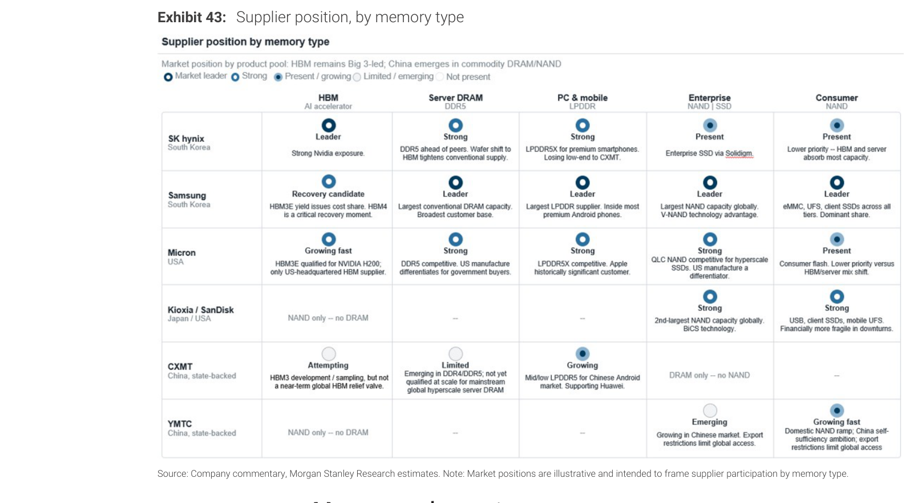

### 解讀摘要
最全面的競爭地圖。CXMT 的位置：HBM="Attempting"（HBM3 開發/sampling，非近期全球緩解）、Server DRAM DDR5="Limited"（DDR4/5 出現，未達主流全球 hyperscaler 認證門檻）、PC&Mobile LPDDR="Growing"（中低端 LPDDR5，Huawei/Android 中低階手機）、Enterprise/Consumer NAND=不存在。

這個矩陣說明 CXMT 在 2026 年仍是「局部性中國市場供應商」，全球多市場認證（hyperscaler/Apple/Nvidia GPU）仍需時間，但「Growing LPDDR + Attempting HBM」是朝正確方向的移動。

---

## Exhibit 44｜過去 30 年 DRAM 週期回顧（1990-2024）

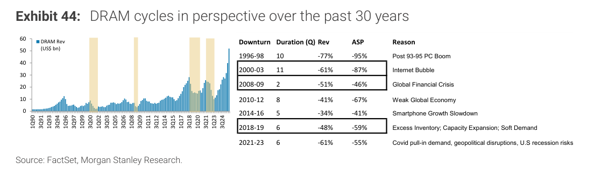

### 解讀摘要
2021-23 週期（6 季、Rev -61%、ASP -55%）是近 30 年第二嚴重的衰退（僅次於 2000-03 網路泡沫 -61%Rev/-87%ASP）。從 2024 年開始的復甦是在歷史性深衰之後反彈，加上 AI 帶來的全新需求結構，使本次復甦週期比 2017-18 或 2010-12 類型更具結構支撐。

### 表格（歷史衰退）
| 衰退期 | 時長（季） | Rev降幅 | ASP降幅 | 原因 |
|---|---|---|---|---|
| 1996-98 | 10 | -77% | -95% | PC 泡沫後 |
| 2000-03 | 11 | -61% | -87% | 網路泡沫 |
| 2008-09 | 2 | -51% | -46% | 全球金融危機 |
| 2010-12 | 8 | -41% | -67% | 全球經濟疲軟 |
| 2014-16 | 5 | -34% | -41% | 智慧型手機成長放緩 |
| 2018-19 | 6 | -48% | -59% | 過剩庫存＋擴產 |
| 2021-23 | 6 | -61% | -55% | COVID 拉貨後庫存＋美方制裁 |

---

## Exhibit 45｜各記憶體類型週期條件（2023→今→Forward）

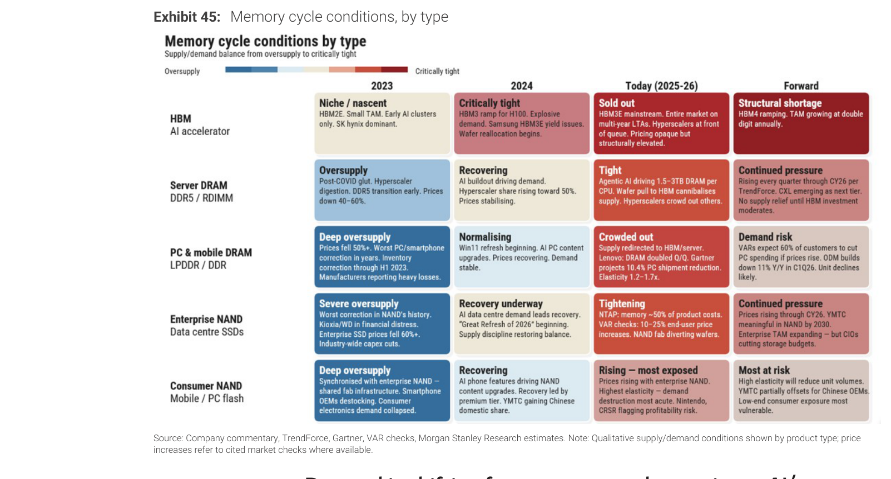

### 解讀摘要
最一目了然的週期評估框架：HBM 從「Sold out」（今）走向「Structural shortage」（Forward）；Server DRAM 維持「Tight」，但 CXL 新層次帶來持續壓力；PC DRAM 面臨「Crowded out」（資源被 HBM/Server DRAM 搶走）＋「Demand risk」（VARs 預期 60% 客戶若漲價就切 PC 支出）；Enterprise NAND「Tightening」；Consumer NAND「Most at risk」（高彈性＋YMTC 擴張）。

這個圖是判斷「哪些記憶體子市場值得加碼」的直覺工具：HBM > Server DRAM > Enterprise NAND > PC DRAM > Consumer NAND。

---

## Exhibit 46｜DRAM 需求結構：AI 伺服器從 38% 升至 59%（2019-2028E）

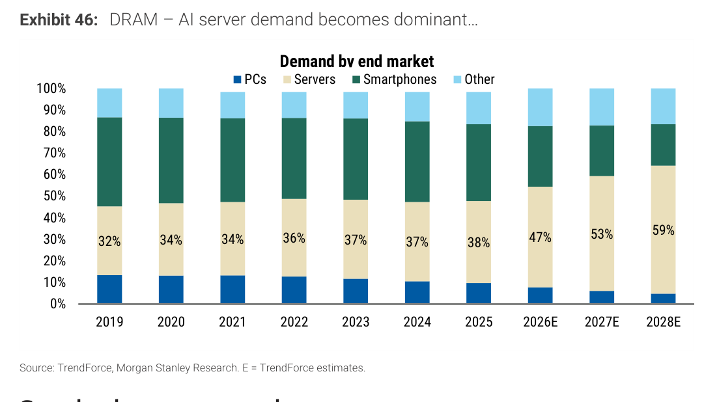

### 解讀摘要
Server（含 AI Server）DRAM 需求比例從 2025 年 38% 急升至 2028E 59%，PC 需求比例降至 ~4-5%，Smartphone 相對穩定 ~30%。這個結構轉移意味 DRAM 的需求引擎已從「週期性消費 → 結構性資本支出」，使 DRAM 週期的下行幅度比 2018-19 或 2021-23 更有緩衝（超大型雲端商的 capex 週期比消費者購買週期長且穩定）。

---

## Exhibit 49｜CXMT 全球 DRAM 產能份額（%，2019-2028E）

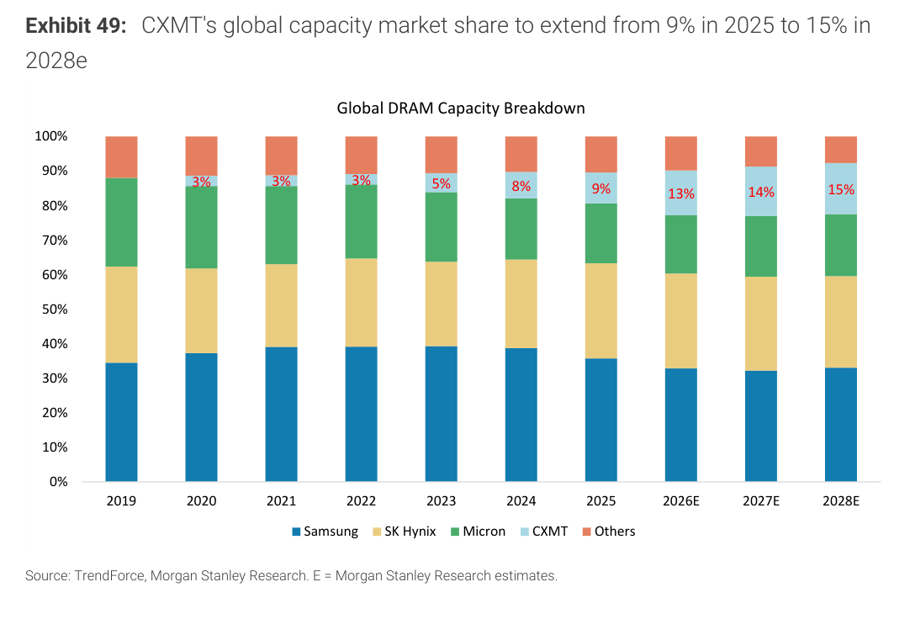

### 解讀摘要
CXMT 全球 DRAM 產能份額從 2019-22 年約 3% 快速攀升至 2026E 13%、2028E 15%。同期 Samsung 份額從 ~35% 微降至 ~33%（仍最大），SK Hynix ~26%（穩定），Micron ~18%（微降）。份額的移動速度超乎預期的原因：其他廠商在 2022-23 年衰退期縮減資本支出，而 CXMT 靠政策資本繼續擴產，逆週期增加份額。

> **洞察一**：CXMT 份額從 2024 年 8% 到 2025 年 9%（+1ppt）到 2026E 13%（+4ppt）的加速，與 exhibit_6 的產能跳增（180→300kwpm）完全一致。份額的可信度建立在具體的 kwpm 數字上，不是市場估算。

---

## Exhibit 50｜全球 DRAM 年度晶圓產能新增量（2020-2028E）

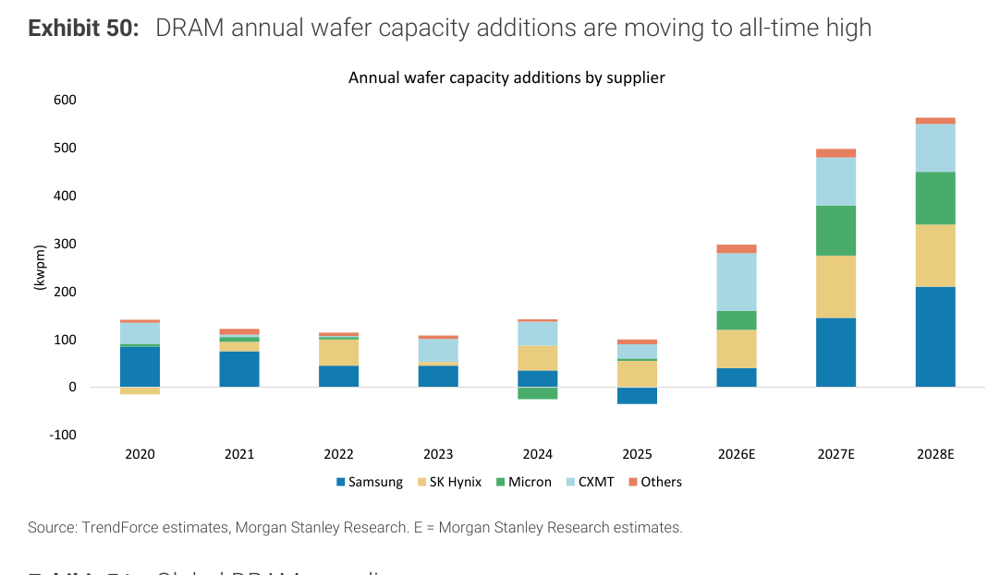

### 解讀摘要
2026-28E 全球年度新增 DRAM 產能達 ~300-550kwpm，遠超 2020-25 年的 ~100-140kwpm。這波大幅擴張主要來自 Samsung、SK Hynix 的 HBM4 投資，加上 CXMT 的激進擴產。2025 年 Samsung 甚至出現負數（減產/去化庫存）。新增量的激增正是未來 DRAM 供需緊缺終將緩解的長期訊號，MS 認為這主要在 2028+ 才顯現。

---

## Exhibit 51｜全球 DRAM 資本支出（US$mn，2020-2028E）

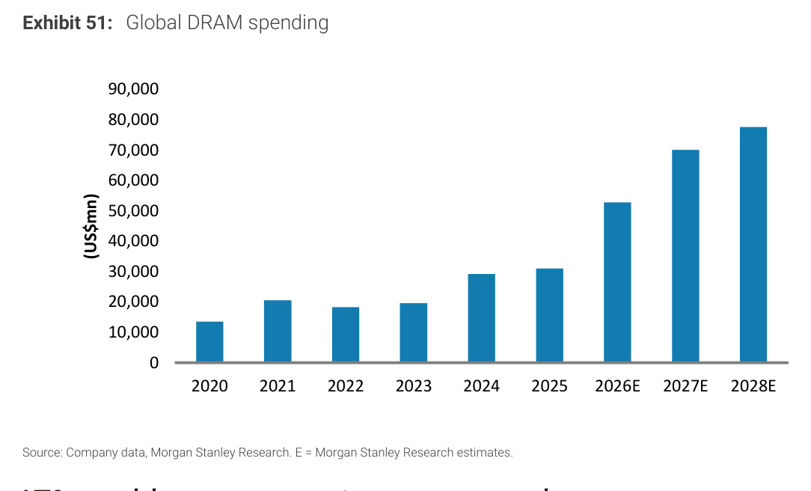

### 解讀摘要
全球 DRAM spending 從 2025 年 US$31bn 爆升至 2026E US$53bn（+71%），2027E US$70bn、2028E US$77bn。這個規模（2028E US$77bn）約為 2020-23 年均值（~US$17bn）的 4.5 倍，是半導體史上最大規模的單一記憶體資本支出週期。CXMT 不在這個 spending 數字裡（人民幣計、未揭露），但受益於此 spending 所創造的供給緊缺環境。

---

## Exhibit 52｜記憶體充足性框架：PC 和手機 2027 缺口 12-15%

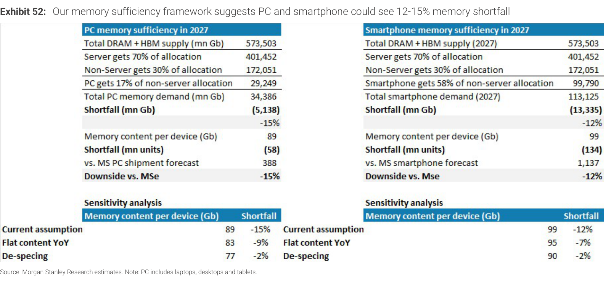

### 解讀摘要
MS 建立了一個「AI 優先分配」框架：假設 2027 年 Server 取得 70% 供給，非 Server 只剩 30%（172,051 mn Gb），其中 PC 分到 17%（29,249 mn Gb vs 需求 34,386 mn Gb = -15% shortfall / 58mn PC units）、Smartphone 分到 58%（99,790 mn Gb vs 需求 113,125 mn Gb = -12% shortfall / 134mn phones）。

> **值得驗證**：「Server 取得 70% 供給」是最關鍵假設。若 Server 需求低於預期（hyperscaler capex 轉向推理/減少訓練），則分配給 PC/Smartphone 的比例提升，缺口縮小甚至消失。敏感度分析顯示若 PC content 不升級（flat YoY，83Gb），缺口從 -15% 降至 -9%。

---

## Exhibit 53｜AI 優先導致 2027 PC/手機 DRAM 殘差缺口（瀑布圖）

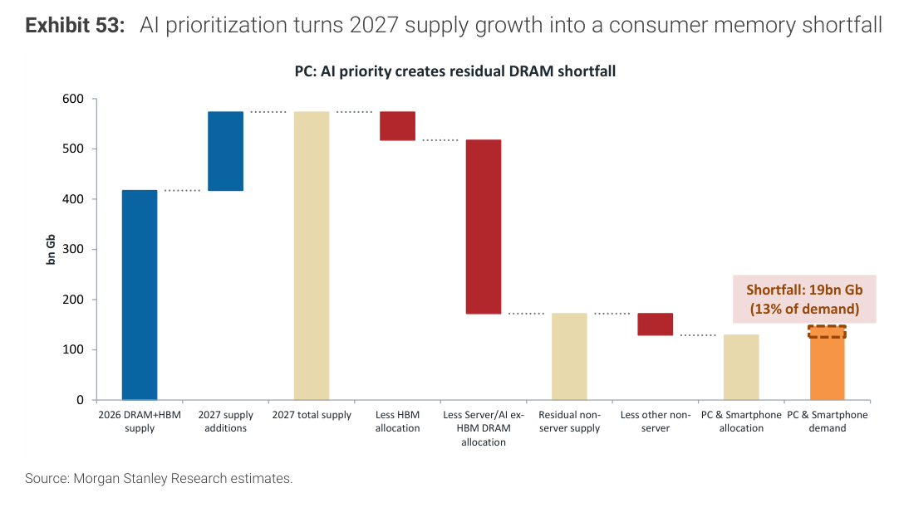

### 解讀摘要
視覺化「AI 優先分配」的路徑：從 2026 供給 ~420bn Gb 出發，加上 2027 新增產能 ~150bn Gb = 總供給 575bn Gb；扣 HBM 分配（~55bn Gb）、Server/AI ex-HBM DRAM（~360bn Gb）、剩餘非 Server（~175bn Gb）、其他非 Server 分配（~32bn Gb）= PC+Smartphone 可用 ~133bn Gb，而實際需求 ~152bn Gb，**缺口 19bn Gb（需求的 13%）**。

> **洞察一**：缺口 19bn Gb 相當於 ~1.3 億台 PC 的 DRAM 用量（假設 average 150GB/PC），或 ~2 億支手機。這些設備不是「無 DRAM」，而是廠商需要降規（更少 LPDDR 容量）或漲價轉嫁消費者——後者直接支撐 DRAM ASP 不崩。

---

## Exhibit 54｜DRAM 微縮路徑：電晶體架構轉型（Samsung 投影片）

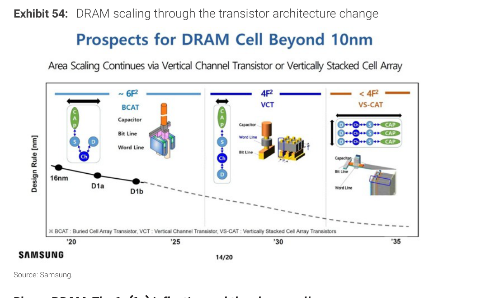

### 解讀摘要
Samsung 展示 DRAM beyond 10nm 的三代架構：BCAT（~6F²，現行 16nm D1a/D1b）→ VCT（4F²，垂直通道電晶體，~2025-30）→ VS-CAT（<4F²，垂直堆疊，~2030-35）。CXMT 目前在 BCAT（G4b = 16nm），下一代 G5（15nm）仍是 BCAT 架構的延伸，與 Samsung 的 VCT（2025+ 已在開發）有本質代差。這個架構差距是 CXMT 長期技術瓶頸的具體說明。

---

## Exhibit 55｜1B 製程各廠規格比較（Samsung/SK Hynix/Micron）

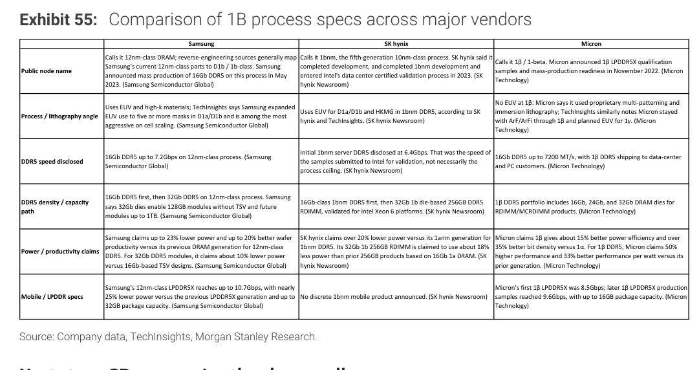

### 解讀摘要
三家廠商的「1bnm 製程」命名各異（Samsung 12nm-class，SK Hynix 1bnm，Micron 1β），技術路徑差距顯著：SK Hynix 和 Samsung 均使用 EUV（HKMG）；Micron 堅持 ArF/ArFi 多重曝光（無 EUV），聲稱良率更高（不依賴 EUV 複雜工程）。CXMT 不在比較之列，因其尚未到 1bnm 等級（G4b = 16nm，相當於三大廠 2021-22 年的水準）。

> **洞察一**：Micron 不用 EUV 的策略是市場爭議點——若成立，代表 EUV 不是 DRAM 製程節點推進的硬性門檻，而這也間接支持 CXMT（沒有 EUV 的情況下）可以透過更多 DUV 光罩來繼續推進節點。

---

## Exhibit 56｜記憶體設計創新（PLC NAND、3D DRAM、ZAM、zHBM）

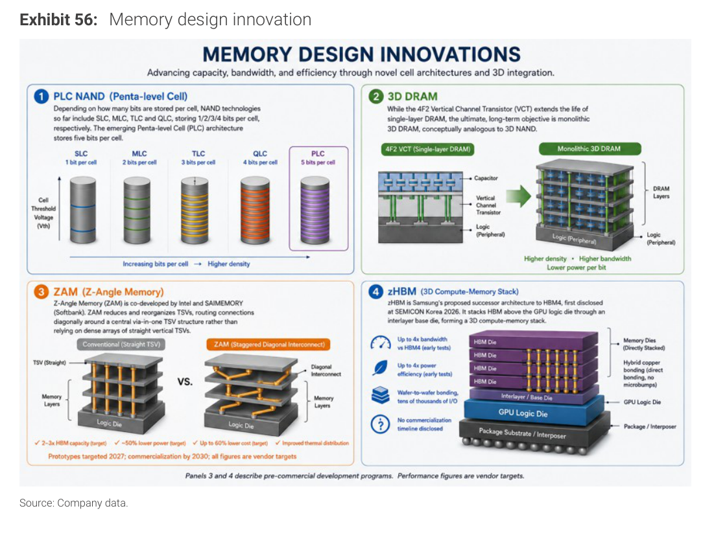

### 解讀摘要
四項前沿記憶體創新：1）PLC NAND（5位元/cell，更高密度但速度/可靠性降低）；2）3D DRAM（VCT→Monolithic 3D，Samsung/SK Hynix 的 2030+ 長期路線）；3）ZAM（Z-Angle Memory，Intel/SAIMEMORY，對角互連 TSV，2027 prototype/2030 商用目標，聲稱 2-3x HBM 容量＋50% 低功耗）；4）zHBM（Samsung 的 3D Compute-Memory Stack，HBM dies 堆疊在 GPU Logic Die 上，早期測試 4x bandwidth vs HBM4，無商業化時程）。

> **洞察一**：ZAM（Intel/SAIMEMORY）若如期 2027 prototype、2030 商用，將是 CXMT HBM 路線最危險的顛覆性技術——完全繞過 CXMT 的 HBM TSV 優勢，且不需要 SK Hynix 的 HBM 供應。但「2030 商用」仍是長期風險，2027 前影響有限。

---

## Exhibit 57｜中國 DRAM 供需對照表（2020-2028e）

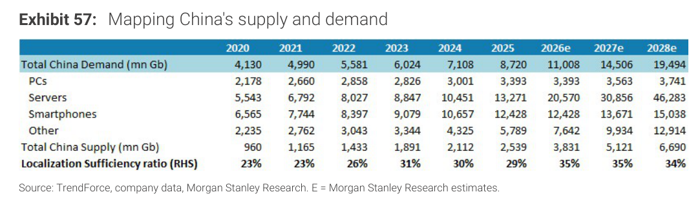

### 解讀摘要
中國 Server DRAM 需求從 2025 年 13,271 mn Gb 到 2028e 46,283 mn Gb（3.5x），是需求成長最快的細項（AI 伺服器爆發）。同期中國 Total Supply 僅從 2,539 到 6,690 mn Gb（+2.6x），遠遠追不上需求。本土化比率在 35% 附近徘徊，意味中國 65% DRAM 需求需靠進口或美出口管制下的特殊供應。

### 表格（mn Gb，精簡）
| 年份 | 中國需求 | 　其中 Server | 中國供給 | 本土化率 |
|---|---|---|---|---|
| 2020 | 4,130 | 5,543 | 960 | 23% |
| 2023 | 6,024 | 8,847 | 1,891 | 31% |
| 2025 | 8,720 | 13,271 | 2,539 | 29% |
| 2026e | 11,008 | 20,570 | 3,831 | 35% |
| 2027e | 14,506 | 30,856 | 5,121 | 35% |
| 2028e | 19,494 | 46,283 | 6,690 | 34% |

> **洞察一**：中國 Server DRAM 需求 2027e 達 30,856 mn Gb，但中國 Total DRAM Supply 僅 5,121 mn Gb——Server 單項需求就是本土供給的 6 倍，這個缺口根本無法靠 CXMT 一家填補，必須靠進口（南韓廠商）或接受供給不足。

---

## Exhibit 59｜CXMT 發展歷程：產能、技術、市場定位

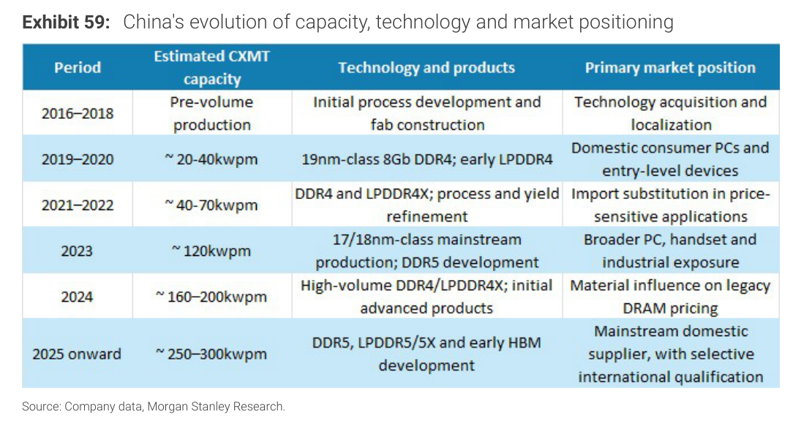

### 解讀摘要
從 2016 年建廠到 2025 年進入 250-300kwpm 量產，CXMT 用 9 年走完三大廠花 20 年建立的規模。「2025 onward: DDR5, LPDDR5/5X 和早期 HBM 開發」標誌著 CXMT 從 Import Substitution（進口替代）轉型為 Mainstream Domestic Supplier with Selective International Qualification。

### 表格
| 時期 | 估計產能（kwpm） | 技術與產品 | 主要市場定位 |
|---|---|---|---|
| 2016-18 | 前量產 | 製程開發，廠房建設 | 技術取得與本土化 |
| 2019-20 | ~20-40 | 19nm DDR4；早期 LPDDR4 | 國內消費 PC、低端設備 |
| 2021-22 | ~40-70 | DDR4 和 LPDDR4X；製程優化 | 進口替代，價格敏感應用 |
| 2023 | ~120 | 17/18nm 主流量產；DDR5 開發 | 更廣泛 PC、手機、工業 |
| 2024 | ~160-200 | 大量 DDR4/LPDDR4X；早期先進品 | 中國遺留 DRAM 定價實質影響力 |
| 2025+ | ~250-300 | DDR5, LPDDR5/5X，早期 HBM | 主流本土供應商，選擇性國際認證 |

---

## 跨 Exhibit 彙整表

### 彙整一｜CXMT 能力矩陣：產能 × 技術 × 市場地位

| 維度 | 2025（今） | 2027e（目標） | 缺口/挑戰 |
|---|---|---|---|
| 總產能 | 180kwpm（Exhibit 6） | 400kwpm | +120% |
| HBM TSV 產能 | ~0kwpm | 40kwpm（Exhibit 28） | 從零到低量 |
| HBM 代數 | HBM2E（Exhibit 15） | HBM3E 12H | 仍落後 SK Hynix 2 代 |
| DRAM 製程 | G4b 16nm（Exhibit 26） | G4b 16nm + G5 初始 | 仍落後三大廠 2-3 代 |
| 全球產能份額 | 9%（Exhibit 49） | 14% | 追趕中 |
| Server DRAM 認證 | Limited（Exhibit 43） | 部分國際 OEM 採用 | 未達全球 hyperscaler 認證 |
| 收入（Rmb bn） | ~70（Exhibit 4） | ~640（Exhibit 4） | 9x 擴張 |

> **彙整洞察**：CXMT 在 2025-27 的「故事」核心是「收入爆發但技術代差未縮短」——財務指標飛速追趕，技術代差縮短速度慢得多（HBM 仍 2 代差、製程仍 2-3 代差）。投資人需分清楚「財務勝負場」和「技術勝負場」的時間尺度差異。

---

## 相關個股清單

| 類別 | 公司 | Ticker | MS 評等 | 備註 |
|---|---|---|---|---|
| 主題公司 | 長鑫存儲（CXMT） | 688825.SS | OW | PT Rmb88，RI model，18.5x 2027e P/E |
| 中國 HBM 競品 | YMTC（長江存儲） | Private | — | NAND 主力，有 DRAM 計畫，非主要競爭者 |
| 全球 HBM 龍頭 | SK Hynix | 000660.KS | — | HBM Leader，48-56% 市占 |
| 全球 HBM 復甦 | Samsung | 005930.KS | — | HBM Recovery Candidate（HBM4） |
| 美國 HBM | Micron | MU | — | HBM3E 過 Nvidia 認證 |
| 設備設備 | ASML | ASML | — | EUV 壟斷，backlog 記錄高 |
| 中國 CoWoS（AI GPU 需求鏈） | 通富微電 | 002156.SZ | — | CXMT HBM 封測合作 |
| 中國矽晶圓 | 中環領先 | 002129.SZ | — | CXMT 矽晶圓供應商 |
| 中國特氣 | 中船特氣 | 688146.SS | — | CXMT 電子氣體供應商 |
