# MS｜Taiwan Tech's exposure to Nvidia and results read-across

**券商**：Morgan Stanley  
**分析師**：Charlie Chan、Daniel Yen、Derrick Yang、Howard Kao、Tiffany Yeh  
**日期**：2026-08-27  
**主題**：台灣科技股 Nvidia 曝險與法說讀後感  
**評級**：正面（整體供應鏈 Overweight 為主）  
<a href="https://layx.uk/dl?g=產業&b=MS&d=20260827&h=NVDA-Implication">📎 下載 PDF</a>

---

## 報告總結

Nvidia 法說後 MS 發布台灣科技供應鏈讀後感。核心論點：Nvidia 引導 CY27 營收 ~70% YoY 成長，管理層稱真實需求「遠超過」這個數字；TSMC CoWoS 與 ABF substrate 仍是主要瓶頸，Rubin 從 3Q26 開始 ramp、4Q26 進入機架出貨。本報告首次系統整理各供應鏈公司的 Nvidia 曝險比率（40-67% 的 ODM）與估值（多數 2027 PEG <1x），認為現在是合理的佈局時機。台灣半導體股中 KYEC（GPU/CPU 測試）與 Winway（test socket）被強調將受益於 4Q26 Rubin ramp；ODM 端 Quanta、Hon Hai、Wistron 均為 Overweight，其中 Hon Hai 有最高伺服器曝險（56%）。

---

## MS 完整投資邏輯鏈

| 論點層次 | Exhibit | 內容 |
|---|---|---|
| 需求信號確認 | 12 | Nvidia CY27 ~70% YoY 指引；管理層稱真實需求「遠超過」此數字 |
| 供給瓶頸定位 | 3, 5 | CoWoS 仍供不應求，2027e 總需求 2,682k wafer vs. 產能 280kwpm |
| 曝險排序 | 2 | ODM 曝險最高（Giga-Byte 67%、Quanta 62%、Hon Hai 56%），半導體 40% 為主 |
| 估值便宜 | 2 | 大多數股票 2027 PEG <0.7x；Wistron PEG 0.2x 最低 |
| Rubin 出貨確認 | 9 | Rubin 從 2Q26e 起 ramp，1Q27e 可達 12-13k NVL72，4Q27e 25k |
| 電力需求催化劑 | 10 | GPU/ASIC 全球總用電 2025→2027 從 10GW 跳升至 37GW+ |
| **結論** | 封面 | **整體正面，高 Nvidia 曝險股 PEG 便宜，KYEC + Winway 為 4Q26 催化劑** |

> **報告最大邏輯缺口**：供需均衡分析（Exhibit 3 需求 vs. Exhibit 5 產能）顯示 2027e 需求 2,682k wafers，但年底產能 280kwpm = 3,360k 年產能，似乎供需接近均衡，報告未正面討論這個差距。

---

## 報告核心觀點

| 主題 | MS 觀點 | 市場共識 | 是否 Contra-Consensus |
|---|---|---|---|
| Nvidia CY27 成長 | ~70%+ YoY，真實需求更高 | 市場已有高預期 | 否，確認 |
| CoWoS 瓶頸 | TSMC 3nm + ABF substrate 仍是主約束 | 主流認為 CoWoS 瓶頸在緩解 | 輕度 Contra（強調仍緊張） |
| KYEC 4Q26 | GPU+CPU 測試量 4Q26 強勁反彈（被 Rubin ramp 補位） | 市場知道但未特別強調 | 輕度 Contra |
| Rubin ramp 時間 | 3Q26 開始，4Q26 機架出貨，1Q27 達 12-13k NVL72 | 市場預期接近 | 一致 |
| 台灣 ODM 曝險 | Giga-Byte 67%、Quanta 62%、Hon Hai 56% 曝險但 PEG 低 | 市場知道曝險，但對估值不如 MS 樂觀 | 輕度 Contra（估值面） |

**偏好排序（依曝險 × PEG）**：Wistron（49%/0.2x）> KYEC（40%/0.4x）> Winway（40%/0.3x）> Quanta（62%/1.2x）> Hon Hai（56%/0.9x）

---

## Exhibit 1｜Revenue exposure related to Nvidia（文字版）

Exhibit 1 為封面頁純文字表格，涵蓋 6 半導體股 + 11 科技硬體股的 Nvidia 曝險概覽。完整資料詳見 Exhibit 2（含估值）。

| 類別 | Ticker | 公司 | 評等 | Nvidia 曝險（2026） | 業務 |
|---|---|---|---|---|---|
| 半導體 | 2449 | KYEC | OW | 40% | Final test |
| 半導體 | 6515 | Winway | OW | 40% | Test Socket |
| 半導體 | 2330 | TSMC | OW | 25% | Wafer foundry |
| 半導體 | 5274 | Aspeed | OW | 20% | BMC |
| 半導體 | 7769 | Hon Precision | OW | 20% | Handler |
| 半導體 | 3711 | ASE | OW | <10% | CP, oS packaging |
| 科技硬體 | 2376 | Giga-Byte | EW | 67% | Server/rack assembly |
| 科技硬體 | 2382 | Quanta | OW | 62% | Server/rack assembly |
| 科技硬體 | 2317 | Hon Hai | OW | 56% | L6/L10/L11 server assembly |
| 科技硬體 | 3231 | Wistron | OW | 49% | L6/L10 server assembly |
| 科技硬體 | 2360 | Chroma | OW | 40% | Testing equipments |
| 科技硬體 | 8210 | Chenbro | OW | 40% | Chassis |
| 科技硬體 | 2357 | Asustek | UW | 31% | Server/rack assembly |
| 科技硬體 | 3665 | Bizlink | OW | 30% | Interconnects |
| 科技硬體 | 2059 | King Slide | OW | 20% | Rail kits |
| 科技硬體 | 3037 | Unimicron | OW | 16% | ABF substrate & PCB |
| 科技硬體 | 2327 | Yageo | OW | 10% | Passive components |

---

## Exhibit 2｜Revenue exposure + 估值比較表

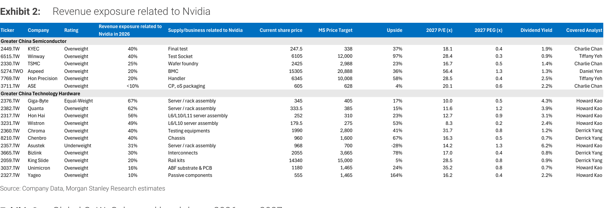

### 解讀摘要
Exhibit 2 在 Exhibit 1 的基礎上加入股價、目標價、上漲空間、2027E P/E、PEG 與殖利率，揭示供應鏈曝險與估值的交叉視角。Wistron PEG 0.2x 最低（49% 曝險），KYEC 和 Winway 分別 0.4x 和 0.3x，顯示半導體測試族群在高 Nvidia 曝險下仍被低估；對比 Aspeed PEG 1.3x（偏高）與 Asustek UW（-28% 下行空間）。整體看，14/17 覆蓋股評等為 OW，平均 PEG 0.6x，報告認為現在是佈局視窗。

### 表格

| Ticker | 公司 | 評等 | Nvidia 曝險 | 現價（NT\$） | 目標價（NT\$） | 上行 | 2027E P/E | 2027 PEG | 殖利率 |
|---|---|---|---|---|---|---|---|---|---|
| 2449 | KYEC | OW | 40% | 247.5 | 338 | +37% | 18.1x | 0.4 | 1.9% |
| 6515 | Winway | OW | 40% | 6,105 | 12,000 | +97% | 28.4x | 0.3 | 0.9% |
| 2330 | TSMC | OW | 25% | 2,425 | 2,988 | +23% | 16.7x | 0.5 | 1.4% |
| 5274 | Aspeed | OW | 20% | 15,305 | 20,888 | +36% | 56.4x | 1.3 | 1.3% |
| 7769 | Hon Precision | OW | 20% | 6,345 | 10,008 | +58% | 28.5x | 0.4 | 2.5% |
| 3711 | ASE | OW | <10% | 605 | 628 | +4% | 20.1x | 0.6 | 2.2% |
| 2376 | Giga-Byte | EW | 67% | 345 | 405 | +17% | 10.0x | 0.5 | 4.3% |
| 2382 | Quanta | OW | 62% | 333.5 | 385 | +15% | 11.6x | 1.2 | 3.9% |
| 2317 | Hon Hai | OW | 56% | 252 | 310 | +23% | 12.7x | 0.9 | 3.1% |
| 3231 | Wistron | OW | 49% | 179.5 | 275 | +53% | 8.3x | 0.2 | 2.4% |
| 2360 | Chroma | OW | 40% | 1,990 | 2,800 | +41% | 31.7x | 0.8 | 1.2% |
| 8210 | Chenbro | OW | 40% | 960 | 1,600 | +67% | 16.3x | 0.5 | 0.7% |
| 2357 | Asustek | UW | 31% | 968 | 700 | -28% | 14.2x | 1.3 | 6.2% |
| 3665 | Bizlink | OW | 30% | 2,055 | 3,665 | +78% | 17.0x | 0.4 | 0.8% |
| 2059 | King Slide | OW | 20% | 14,340 | 15,000 | +5% | 28.5x | 0.8 | 0.9% |
| 3037 | Unimicron | OW | 16% | 1,180 | 1,465 | +24% | 35.2x | 0.8 | 0.7% |
| 2327 | Yageo | OW | 10% | 555 | 1,465 | +164% | 16.2x | 0.4 | 2.2% |

> **洞察一**：Wistron PEG 0.2x 是整個台灣科技供應鏈中最低的，49% Nvidia 曝險配上 8.3x P/E 顯示市場對其 AI server 轉型定價明顯落後；若 Rubin ramp 如期進行，估值重估空間最大。

> **洞察二**：Yageo 上行空間 164%，但 Nvidia 曝險僅 10%（被動元件）、P/E 16.2x/PEG 0.4x，這一異常高的上行空間暗示市場對 Yageo 的定價比 Nvidia 供應鏈論點更加保守，實際上是非 AI 業務的折價所致。

---

## Exhibit 3｜Global CoWoS demand breakdown: 2026e vs. 2027e

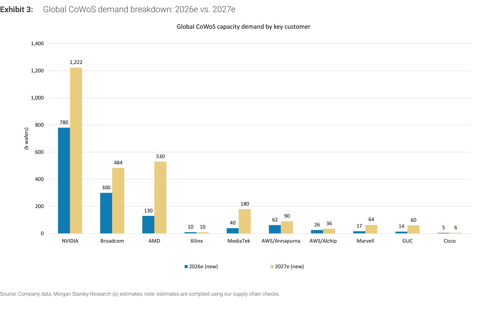

### 解讀摘要
Nvidia 佔全球 CoWoS 需求最大宗，從 2026e 780k 跳升至 2027e 1,222k（+57% YoY）。更值得注意的是 AMD 從 130k 到 530k（+308%）、MediaTek 從 40k 到 180k（+350%）、GUC 從 14k 到 60k（+329%）——ASIC 設計公司的 CoWoS 需求增速遠超 Nvidia，反映客製化晶片崛起的速度比市場預期更快，Alchip/GUC 的代工量爆發是結構性而非週期性的。

### 表格（單位：k wafers）

| 客戶 | 2026e | 2027e | YoY 增速 |
|---|---|---|---|
| NVIDIA | 780 | 1,222 | +57% |
| Broadcom | 300 | 484 | +61% |
| AMD | 130 | 530 | +308% |
| MediaTek | 40 | 180 | +350% |
| AWS/Annapurna | 62 | 90 | +45% |
| AWS/Alchip | 26 | 36 | +38% |
| Marvell | 17 | 64 | +276% |
| GUC | 14 | 60 | +329% |
| Xilinx | 10 | 10 | 0% |
| Cisco | 5 | 6 | +20% |
| **合計** | **~1,384** | **~2,682** | **+94%** |

> **洞察一**：AMD + ASIC 設計商（MediaTek、Marvell、GUC）合計 2027e 需求 1,424k wafers，佔總需求 53%，首次超過 Nvidia（1,222k）；這表示 CoWoS 緊俏程度不只取決於 Nvidia 的需求，即便 Nvidia 需求走弱，ASIC 客戶的需求增速也足以維持 TSMC 滿載。

---

## Exhibit 4｜Global CoWoS demand Y/Y growth profile

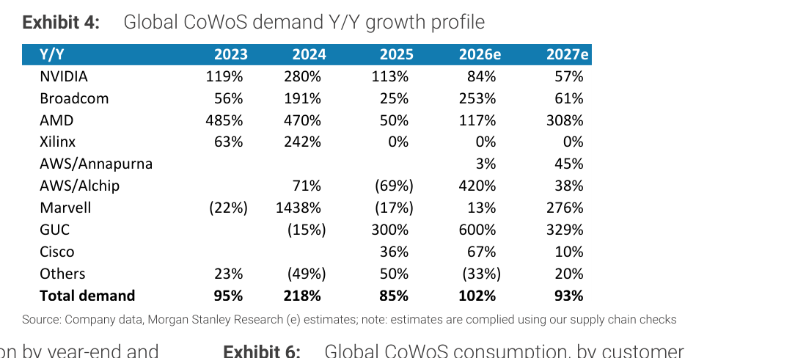

### 解讀摘要
AWS/Alchip 的 2026e YoY 成長 +420% 是所有客戶中最高，這反映 Alchip 在 Trainium/NVLink fusion 的份額急速拉升；同期 GUC 成長 600%（雖然基期小）。Nvidia 本身 2027e 成長降至 +57%，成為「基石」需求，真正的彈性增量來自 ASIC 設計公司。

### 表格（YoY%）

| 客戶 | 2023 | 2024 | 2025 | 2026e | 2027e |
|---|---|---|---|---|---|
| NVIDIA | +119% | +280% | +113% | +84% | +57% |
| Broadcom | +56% | +191% | +25% | +253% | +61% |
| AMD | +485% | +470% | +50% | +117% | +308% |
| AWS/Alchip | — | +71% | -69% | +420% | +38% |
| Marvell | -22% | +1,438% | -17% | +13% | +276% |
| GUC | — | -15% | +300% | +600% | +329% |
| **Total demand** | **+95%** | **+218%** | **+85%** | **+102%** | **+93%** |

---

## Exhibit 5｜Global CoWoS capacity expansion by year-end and by vendor

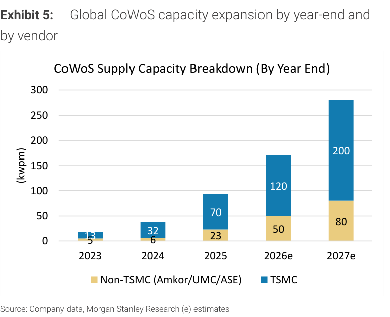

### 解讀摘要
TSMC 主導 CoWoS 擴產，從 2025 年底 70kwpm 擴至 2027e 年底 200kwpm（+186%），非 TSMC（Amkor/UMC/ASE）從 23kwpm 擴至 80kwpm，佔比維持約 29%。這意味著 2027 年全年底產能達 280kwpm = 年化約 3,360k wafers，相比需求 2,682k，表面上看供給有望跟上，但年底才達到 280kwpm 意味著全年平均利用率仍緊張。

### 表格（kwpm，年底產能）

| 年份 | TSMC | 非 TSMC | 合計 |
|---|---|---|---|
| 2023 | 13 | 5 | 18 |
| 2024 | 32 | 6 | 38 |
| 2025 | 70 | 23 | 93 |
| 2026e | 120 | 50 | 170 |
| 2027e | 200 | 80 | 280 |

---

## Exhibit 6｜Global CoWoS consumption, by customer

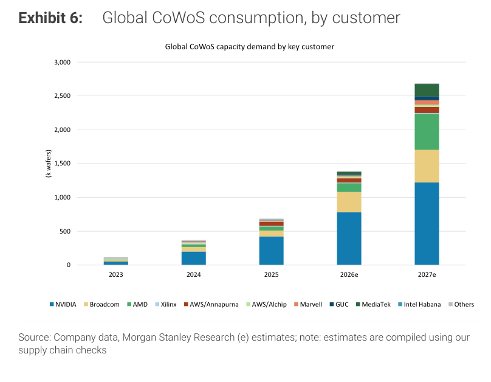

### 解讀摘要
累計 CoWoS 消耗量的長期趨勢圖，顯示 2026e-2027e 需求為結構性躍升而非週期性回歸。Nvidia 始終是最大客戶（藍色主體），但 2027e 非 Nvidia 客戶（Broadcom、AMD、AWS、MediaTek 等）合計佔比明顯提升，需求多樣化降低了 CoWoS 需求對單一 AI 客戶的過度依賴風險。

---

## Exhibit 7｜(Old) Blackwell chip vs. GB NVL72 rack shipments

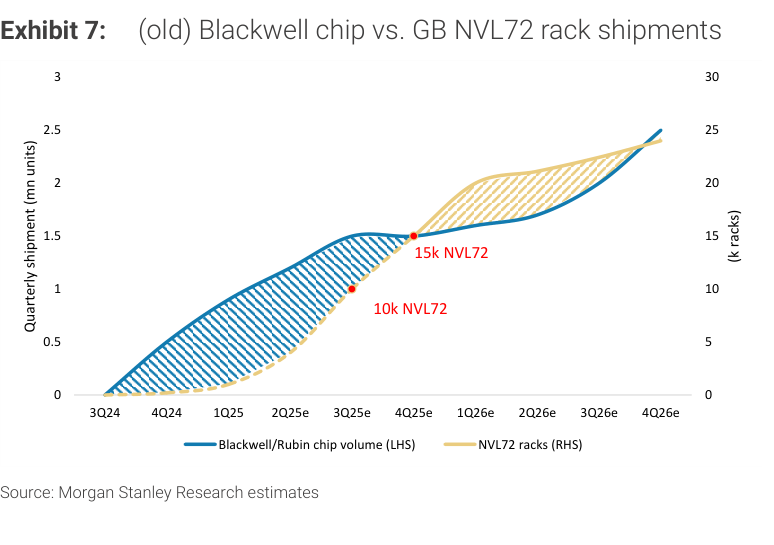

### 解讀摘要
舊模型（不含 HGX）顯示 Blackwell 晶片供給量在 3Q25e-4Q25e 明顯超過 NVL72 機架數量（差距以斜線區域表示），MS 解釋此為「供應鏈緩衝庫存」而非真實庫存積累，預期 2026 年底前完全吸收。峰值差距對應 10k-15k NVL72 的緩衝量。

---

## Exhibit 8｜(New) Blackwell chip vs. GB NVL72 and HGX equivalent rack shipments

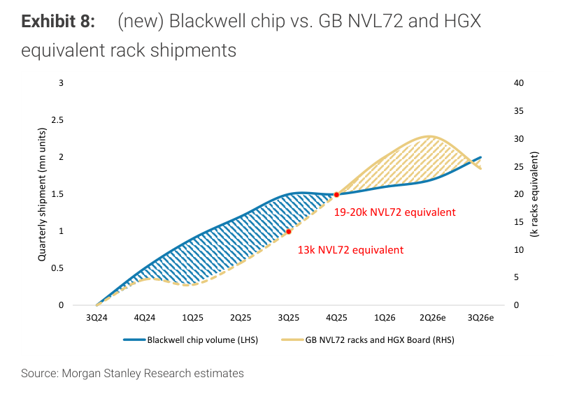

### 解讀摘要
新模型納入 HGX 系統（8 GPU/server，9 HGX = 1 NVL72 等值），修正後的等值機架數量更高（13k → 19-20k NVL72 equivalent），說明之前用 NVL72 衡量的「晶片庫存」其實是已出貨成 HGX board 的正常產品；修正後晶片供給與需求的差距縮小。Rubin 晶片從圖右端開始 ramp（3Q26e），接棒 Blackwell 的機架增量。

> **洞察一（配合 Exhibit 7）**：從舊模型到新模型，「看似多餘」的 4-5k NVL72 差距完全被 HGX 解釋掉，這意味著 Blackwell 庫存疑慮是模型缺口造成的誤解，不是真實的供給過剩訊號。

---

## Exhibit 9｜Rubin chip shipments vs. VR NVL72 rack shipments

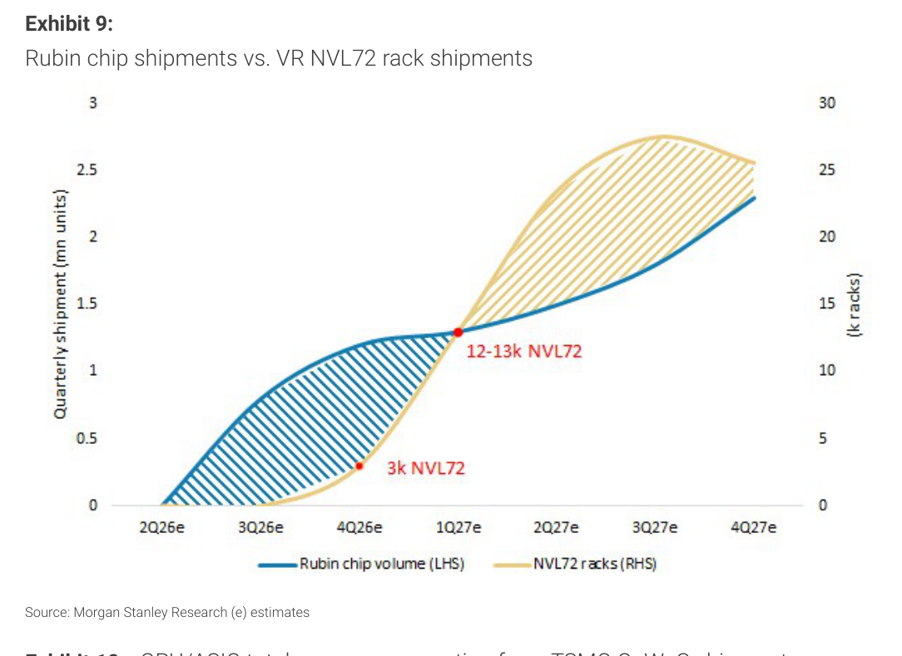

### 解讀摘要
Rubin 機架出貨從 4Q26e 以約 3k NVL72 起步，至 1Q27e 加速至 12-13k，2Q27e-3Q27e 達峰值約 27k，之後隨下一世代接棒而下滑。2027 年全年 Rubin NVL72 機架出貨量約 90k，是 MS 版本的供應鏈關鍵節點校準數字，台灣 ODM（Hon Hai、Wistron、Quanta）的伺服器收入可見度基本鎖定。

---

## Exhibit 10｜GPU/ASIC total power consumption from TSMC CoWoS shipment

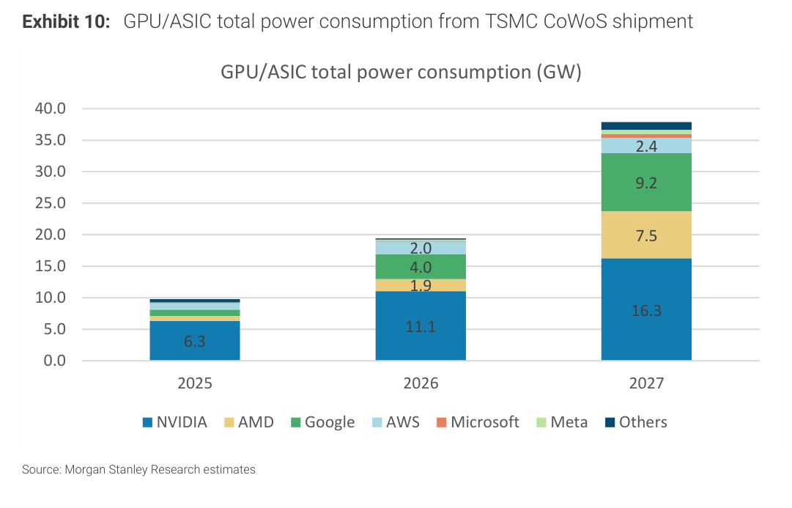

### 解讀摘要
全球 GPU/ASIC 用電量從 2025 年 ~10 GW 跳升至 2026 年 ~19.7 GW，再到 2027 年 ~37 GW，兩年幾乎翻四倍。Nvidia 獨大（2027e 佔 ~16.3 GW，44%），但 Google（9.2 GW）和 AMD（7.5 GW）快速追近。這份電力需求預測是 Citi 對電力基礎建設正面看法（台達電）的供給側依據。

### 表格（GW）

| 客戶 | 2025 | 2026 | 2027 |
|---|---|---|---|
| NVIDIA | 6.3 | 11.1 | 16.3 |
| AMD | — | 1.9 | 7.5 |
| Google | — | 4.0 | 9.2 |
| AWS | — | 2.0 | 2.4 |
| Microsoft + Meta + Others | ~3.7 | ~0.7 | ~1.9 |
| **合計（估）** | **~10** | **~19.7** | **~37.3** |

> **洞察一**：從 2025 到 2027，GPU/ASIC 用電量增加 ~27 GW，相當於新增約 27 個 1GW 超大型資料中心（或 270 個 100MW 中型 DC）；電力稀缺性已從「可能的長期問題」升級為「當前週期的首要瓶頸」，這直接支撐了電力管理、液冷和 DC 電力基礎建設供應商的訂單能見度。

---

## Exhibit 11｜P/E multiple trend of AI semis

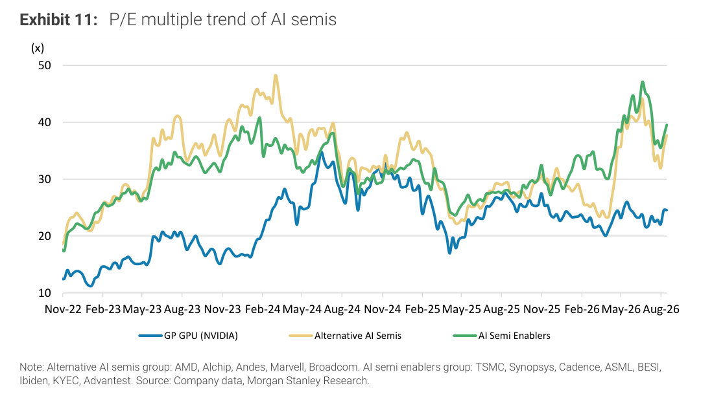

### 解讀摘要
三條線（Nvidia/GP GPU、Alternative AI Semis、AI Semi Enablers）的 P/E 走勢圖，時間跨越 2022-2026 年 8 月。Nvidia 目前 P/E 約 23-24x，明顯低於 Alternative AI Semis（~40x）和 AI Semi Enablers（~39x）。從 Feb-24 的高峰回落（Nvidia 曾到 ~29x），目前估值已回到相對合理區間，MS 以此支持「估值不貴」的論點，鼓勵投資者在 Rubin ramp 前佈局。

---

## Exhibit 12｜We still expect AI chip revenue to rise QoQ

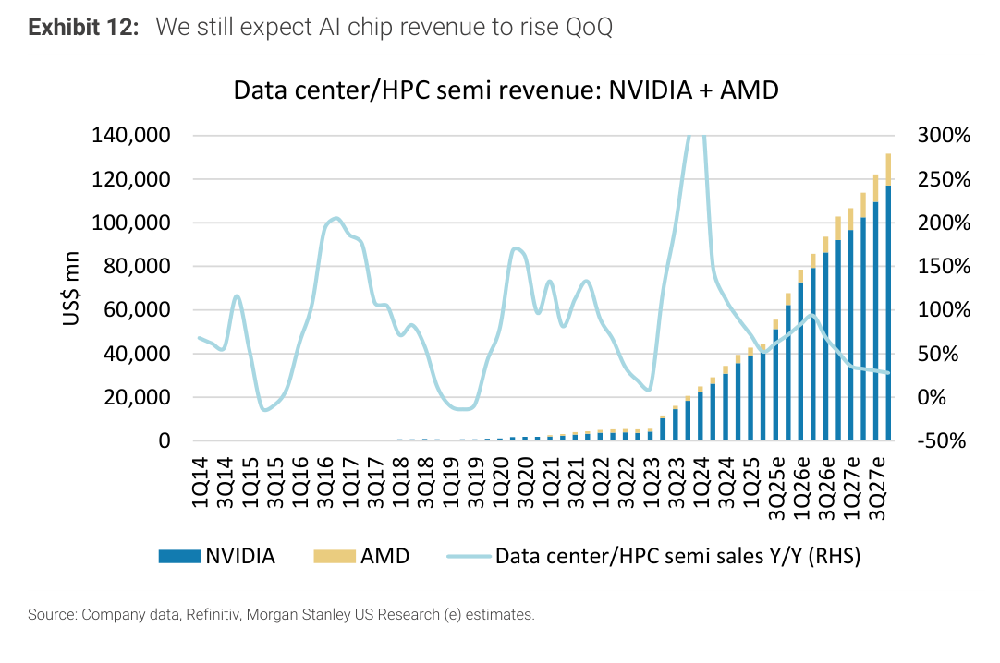

### 解讀摘要
以 1Q14 起的 Nvidia + AMD 資料中心/HPC 半導體長期季度收入圖，呈現 YoY 成長率（右軸）。3Q24 是 YoY 成長峰值（~300%），之後基期效應拉低 YoY，但 MS 預估 2026-27 年仍有 QoQ 正成長。這張圖的意義在於：把 YoY 減速（從 300% 降至 50-60%）框定為「高基期的自然現象」，而非需求衰退訊號。

---

## Exhibit 13｜TSMC's AI-related revenue 2024-29e CAGR could reach 60%

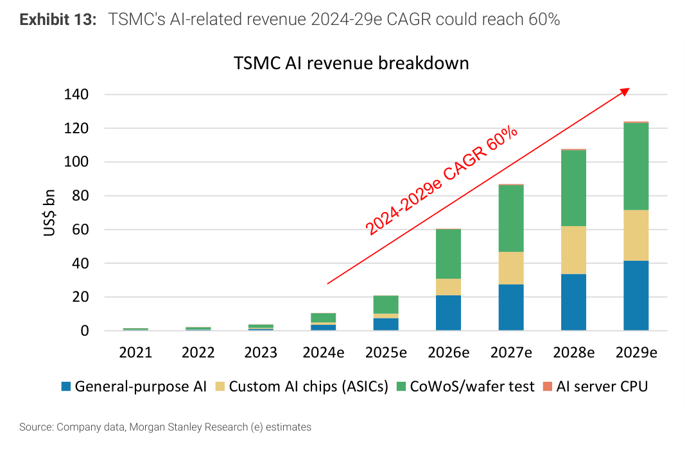

### 解讀摘要
TSMC AI 相關收入（General-purpose AI + Custom AI chips/ASICs + CoWoS/wafer test + AI server CPU）拆解圖，從 2024e ~\$10bn 成長至 2029e ~\$125bn，CAGR 60%。CoWoS/wafer test（綠色）是 2026-27 最大增量，之後 Custom AI chips（ASICs，黃色）佔比持續提升，佐證 ASIC 的中長期結構性增長。這份 TSMC 獨立業務拆分是 MS 少數在公開報告中量化 TSMC AI 各子業務的估計。

### 表格（US\$ bn）

| 年份 | General AI | ASICs | CoWoS/wafer test | AI CPU | 合計（估） |
|---|---|---|---|---|---|
| 2024e | ~4 | <1 | ~5 | <1 | ~10 |
| 2025e | ~8 | ~2 | ~10 | ~1 | ~21 |
| 2026e | ~20 | ~8 | ~30 | ~2 | ~60 |
| 2027e | ~27 | ~15 | ~40 | ~3 | ~85 |
| 2028e | ~33 | ~20 | ~50 | ~2 | ~105 |
| 2029e | ~42 | ~27 | ~54 | ~2 | ~125 |

> **洞察一**：2026e TSMC AI 收入 ~\$60bn 中，CoWoS/wafer test 佔 ~\$30bn（50%）；但到 2029e，CoWoS 佔比降至 43%，ASICs 佔比從 13% 升至 22%——這表示 TSMC 長期混合毛利率將因 ASICs 比重提升而改善（ASIC 設計服務 + 先進封裝加值較高）。

---

## 相關個股清單

| 類別 | 公司 | Ticker | 評等 | Nvidia 曝險 | 備註 |
|---|---|---|---|---|---|
| 半導體測試 | KYEC 京元電 | 2449 | OW | 40% | GPU/CPU final test；4Q26 Rubin ramp 受益 |
| 半導體測試 | Winway 穎崴 | 6515 | OW | 40% | Test socket；PEG 0.3x |
| 晶圓代工 | TSMC 台積電 | 2330 | OW | 25% | CoWoS-L/R 主供；2027 晶片漲價預期 |
| 半導體 | Aspeed 信驊 | 5274 | OW | 20% | BMC 晶片 |
| 半導體 | Hon Precision 鴻勁 | 7769 | OW | 20% | Handler |
| 封測 | ASE 日月光 | 3711 | OW | <10% | CP, oS packaging |
| ODM | Giga-Byte 技嘉 | 2376 | EW | 67% | Server/rack assembly；最高曝險但評等 EW |
| ODM | Quanta 廣達 | 2382 | OW | 62% | Server/rack assembly |
| ODM | Hon Hai 鴻海 | 2317 | OW | 56% | L6/L10/L11 server assembly |
| ODM | Wistron 緯創 | 3231 | OW | 49% | L6/L10；PEG 0.2x 最低 |
| 測試設備 | Chroma 致茂 | 2360 | OW | 40% | Testing equipments |
| 機殼 | Chenbro 勤誠 | 8210 | OW | 40% | Chassis |
| ODM | Asustek 華碩 | 2357 | UW | 31% | Server assembly；UW，-28% 下行 |
| 連接器 | Bizlink 貿聯 | 3665 | OW | 30% | Interconnects |
| 滑軌 | King Slide 川湖 | 2059 | OW | 20% | Rail kits |
| 基板 | Unimicron 欣興 | 3037 | OW | 16% | ABF substrate & PCB |
| 被動元件 | Yageo 國巨 | 2327 | OW | 10% | Passive components；上行空間 164% |
