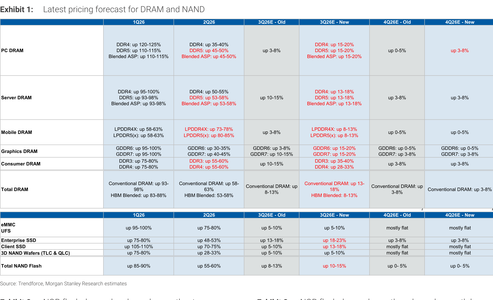
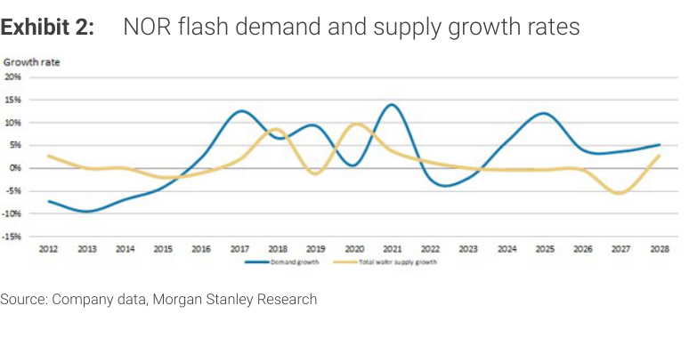
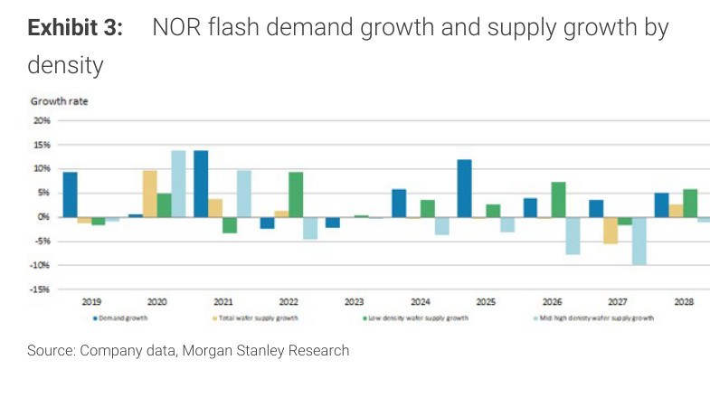
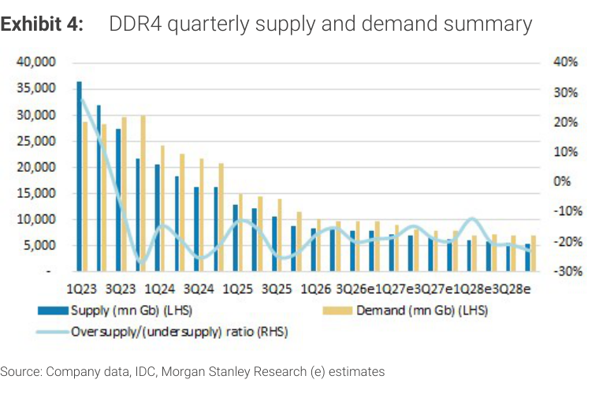
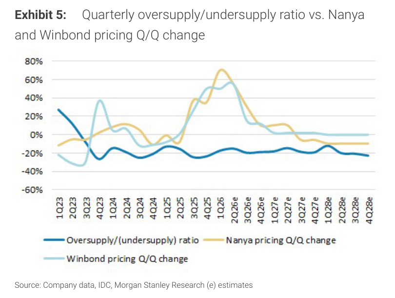
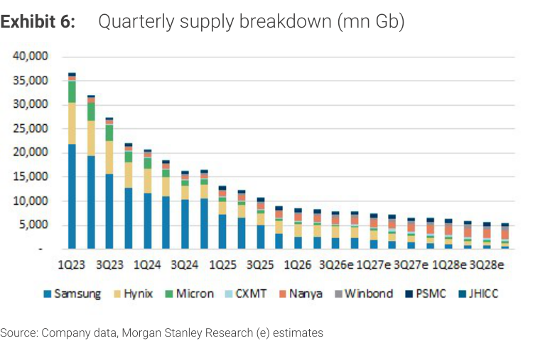
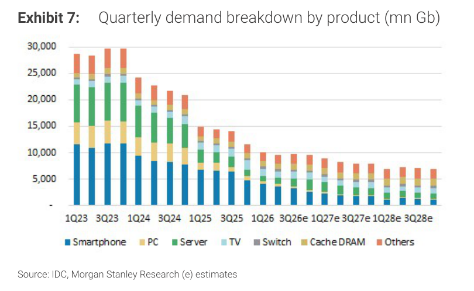
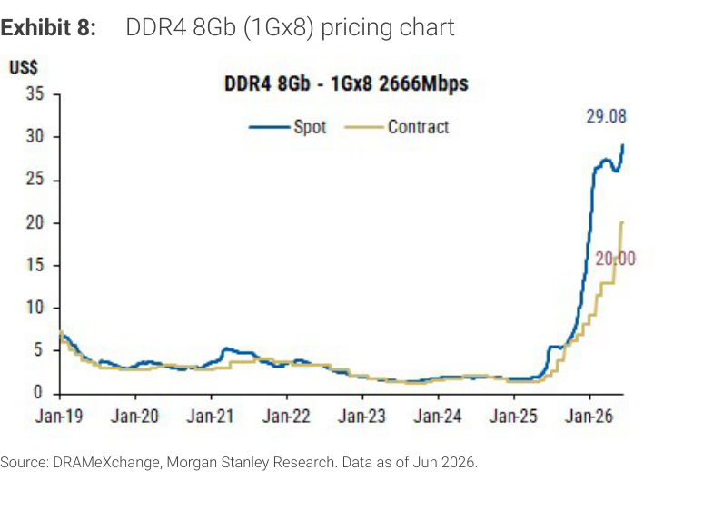
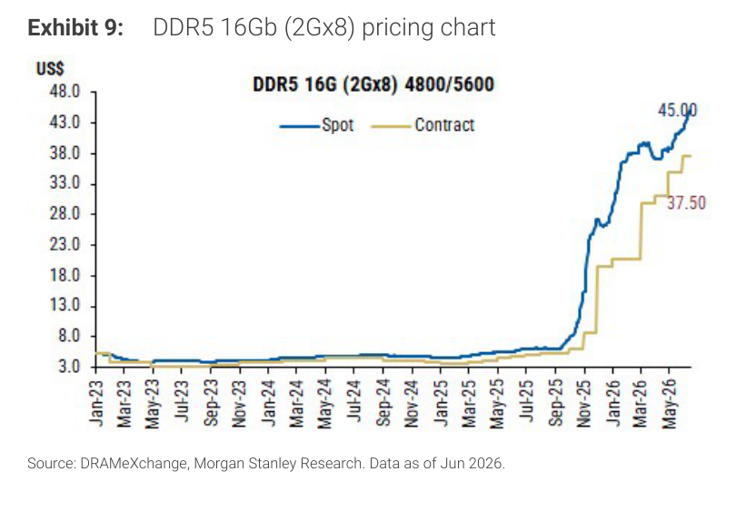

# MS｜Memory Innovation – SEMICON Taiwan 聚焦

**券商**：Morgan Stanley  
**分析師**：Daniel Yen, CFA、Charlie Chan、Daisy Dai, CFA、Ethan Jia  
**日期**：2026-09-01  
**主題**：Memory Innovation – The Focus from SEMICON Taiwan  
**評級**：Attractive（Greater China Semiconductors Industry View）  
<a href="https://layx.uk/dl?g=產業&b=MS&d=20260901&h=Memory-Innovation">📎 下載 PDF</a>

---

## 報告總結

SEMICON Taiwan 2026 強化了 MS 的核心論點：記憶體的價值創造正從 bit 密度擴展轉向**架構層級創新**，驅動因素包括 AI 推理對頻寬/容量/延遲的需求激增、3D WoW 堆疊的結構性演進、以及 NAND 在推理工作負載中扮演更主動角色。

本報告同步更新 DRAM/NAND 定價預測，3Q26E Server DRAM 上調至 +13-18% QoQ（舊預測 +10-15%）；DDR4 現貨價已達 US\$29.08，自 2025 年初谷底上漲約 29 倍。投資首選為 AP Memory（WoW 堆疊受益）、Montage（記憶體介面升級）、Macronix（SLC NAND 短缺），三者均維持 OW。

---

## MS 完整投資邏輯鏈

| 論點層次 | Exhibit | 內容 |
|---|---|---|
| AI 推理瓶頸確認 | 封面 | AI 性能受限於記憶體（而非算力），tokens/\$ 與 tokens/W 成為關鍵指標 |
| 架構創新催化 | 封面 | 3D WoW 堆疊、記憶體介面、NAND 主動化三條路線同步演進 |
| 定價趨勢上修 | Exhibit 1, 8, 9 | 3Q26E DRAM/NAND 全面上修，DDR4/DDR5 現貨大幅飆升 |
| 供需結構支撐 | Exhibit 4, 5 | DDR4 持續 undersupply（約 -15 至 -20%），Nanya/Winbond 定價仍正向 |
| 受益標的排序 | 封面 | AP Memory（OW）→ Montage（OW）→ Macronix（OW） |
| **結論** | 封面 | **記憶體架構創新使其成為 AI 系統層差異化因子，個股選擇聚焦三條創新路線** |

> **報告最大邏輯缺口**：3D WoW 量產時程高度依賴混合鍵合（hybrid bonding）良率，MS 未提供具體量產日期與產能爬坡節奏假設。

---

## 報告核心觀點

| 主題 | MS 觀點 | 市場共識 | 是否 Contra-Consensus |
|---|---|---|---|
| 記憶體地位 | 記憶體成為 AI 系統的系統層差異化因子 | 記憶體為 AI 週期彈性受益者 | ✅ 是（定性升格） |
| 3D WoW 堆疊 | Samsung zHBM 代表記憶體向垂直整合架構演進，AP Memory 為最直接受益者 | 2.5D HBM 仍是主流至 2027+ | ✅ 是（更早看好 3D） |
| NAND 角色 | Fast NAND/HBF 移向推理工作負載（KV cache、模型權重） | NAND 以儲存為主 | ✅ 是 |
| DDR4 定價 | 3Q26E Server DRAM 上修至 +13-18% QoQ | 市場預期 3Q26 較為溫和 | ✅ 是（3Q26 上修） |

**偏好排序**：AP Memory > Montage > Macronix  
**個股評等**：AP Memory (6531) OW、Montage (6809 HK / 688008 SS) OW、Macronix (2337) OW

---

## Exhibit 1｜Latest pricing forecast for DRAM and NAND

### 解讀摘要

MS 對 3Q26E DRAM 定價全面上修：PC DRAM 從舊預測 +3-8% 大幅上調至 +15-20% QoQ，Server DRAM 從 +10-15% 調高至 +13-18%。NAND 方面，3Q26E Total NAND Flash 從 +8-13% 上修至 +10-15%，Enterprise SSD 更從 +13-18% 升至 +18-23%，顯示供需收緊比原先預期更快。4Q26E 全線維持溫和正成長（+3-8%）。

> **原文補充**：定價上修的背景是 SEMICON Taiwan 廠商法說後供應鏈訊號趨緊；MS 同步調高 Nanya/Winbond 定價敏感度。

### 表格

| 品項 | 1Q26 YoY | 2Q26 YoY | 3Q26E 舊 | 3Q26E 新 | 4Q26E 舊 | 4Q26E 新 |
|---|---|---|---|---|---|---|
| PC DRAM（Blended） | +110-115% | +45-50% | +3-8% | **+15-20%** | +0-5% | **+3-8%** |
| Server DRAM（Blended） | +93-98% | +53-58% | +10-15% | **+13-18%** | +3-8% | +3-8% |
| Mobile DRAM（LPDDR5） | +58-63% | +80-85% | +3-8% | **+8-13%** | +0-5% | +0-5% |
| HBM Blended | +83-88% | +53-58% | — | **+8-13%** | — | — |
| Enterprise SSD | +75-80% | +48-53% | +13-18% | **+18-23%** | +3-8% | +3-8% |
| Total NAND Flash | +85-90% | +55-60% | +8-13% | **+10-15%** | +0-5% | +0-5% |

（粗體 = 本次上修後的新預測）

> **洞察一**：PC DRAM 3Q26E 上修幅度（+3-8% → +15-20%，上調 12 ppt）遠大於 Server DRAM（+10-15% → +13-18%，上調 3 ppt），顯示消費型 DRAM 供需收緊速度超越伺服器端，與過去 AI 主導的週期（伺服器先漲）相反——暗示本輪漲價已擴散至更廣泛的終端需求。

---

## Exhibit 2｜NOR flash demand and supply growth rates

### 解讀摘要

NOR flash 自 2022 年供給過剩後，2026-2028 年需求（約 +5%）與供給成長率（約 +2-5%）趨向收斂，整體動能遠低於 2017-2021 年高峰（供需各達 +12-15%）。供需雖趨平衡但無明顯過剩，支持 Macronix 維持定價的中期條件。

### 表格

| 時期 | 需求成長（估） | 供給成長（估） |
|---|---|---|
| 2017 高峰 | ~+12% | ~+13% |
| 2022 谷底 | ~-3% | ~+0% |
| 2026E | ~+5% | ~+2% |
| 2028E | ~+5% | ~+5% |

（視覺估算）

> **洞察二**：2028 年供需成長率趨近相等，代表 NOR flash 超額報酬窗口集中在 2026-2027，Macronix 受益期間有限但清晰。

---

## Exhibit 3｜NOR flash demand growth and supply growth by density

### 解讀摘要

按密度拆分，2027 年低密度（low density）NOR flash 供給成長轉為負值（約 -10%），而中高密度（mid-high density）供給維持微幅正成長；需求端仍維持正成長。低密度 NOR 短缺結構是 Macronix 定價護城河的核心，也是 MLC/SLC NAND legacy 短缺論點的補充佐證。

> **洞察三**：低密度 NOR 供給 2027 年大幅收縮，與 Exhibit 2 整體 NOR 正成長形成對比——供給資源向中高密度集中，低密度形成分化式短缺，Macronix 在此利基的議價能力顯著強於整體 NOR 市場。

---

## Exhibit 4｜DDR4 quarterly supply and demand summary

### 解讀摘要

DDR4 市場從 2023 年高峰（~36,000 mn Gb）到 2028E 縮減至 ~5,000 mn Gb，是半導體史上最快速的世代退場之一。關鍵在於超額供給率（Oversupply ratio，右軸藍線）：2026 年已跌入 -10% 至 -20% 的持續 undersupply 區間，預計延伸至 2028 年底，支撐 Nanya、Winbond 等 legacy DRAM 廠獲利的結構性底座。

### 表格

| 期間 | 供給（mn Gb 估） | 需求（mn Gb 估） | 超額供給率（估） |
|---|---|---|---|
| 1Q23 | ~21,000 | ~29,000 | +25% ❓ |
| 3Q23 | ~27,000 | ~28,000 | ~0% ❓ |
| 1Q26 | ~8,500 | ~7,500 | ~-15% ❓ |
| 3Q28e | ~5,000 | ~6,500 | ~-20% ❓ |

（視覺估算；❓ = 無標籤 bar，格線目測）

> **值得驗證**：DDR4 產能收縮速度（三星/海力士/Micron 轉 DDR5）若快於預期，undersupply 更深，Nanya/Winbond 漲幅更大；反之若轉換延遲，風險上升。此假設為 legacy DRAM 論點的最關鍵變數。

---

## Exhibit 5｜Quarterly oversupply/undersupply ratio vs. Nanya and Winbond pricing Q/Q change

### 解讀摘要

DDR4 超額供給比率自 2025 年中持續維持負值（undersupply），Nanya 定價 QoQ 漲幅在 1Q26 達到高峰（~+65%），之後逐季收斂但仍維持正值。Winbond 走勢類似但幅度略小。預估至 2028 年底超額供給率仍在 -20% 附近，代表 Nanya/Winbond 的正向 ASP 環境可能延續至 2027-2028 年。

> **洞察四**：Nanya 定價從 1Q26 峰值（+65%）收斂至預估 2027 的 +5-10%，可解讀為漲幅「正常化」而非供需逆轉——供給缺口仍在，但基期效應已大幅縮小。這與 Exhibit 1 的 4Q26E 定價 +3-8% 預測完全一致，是上修量級的合理尺標。

---

## Exhibit 6｜Quarterly supply breakdown (mn Gb)

### 解讀摘要

DDR4 供給由三星（Samsung）、海力士（Hynix）、Micron 主導，三者合計高峰期佔比超過 85%。隨三大廠轉移 DDR5 產能，Nanya/Winbond/PSMC/JHICC 等二線廠在總量大幅萎縮的同時，市佔份額反而上升至 2028e 的約 30-35%——形成「市場退場中的份額集中」。

> **洞察五（配合 Exhibit 4）**：三大廠退出 DDR4 市場的速度，決定了 Nanya/Winbond 同時享有份額成長與定價上升的窗口長度。2026-2028 年兩者同步走高，是 legacy DRAM 獲利擴張的結構性底座。

---

## Exhibit 7｜Quarterly demand breakdown by product (mn Gb)

### 解讀摘要

DDR4 需求以 Smartphone（深藍，歷史最大終端，峰值佔比 ~40%）、PC（黃）、Server（綠）為主。2025-2028 年隨各終端遷移至 DDR5/LPDDR5，各類別需求均呈下滑，總需求從峰值 ~29,000 mn Gb 降至 2028e ~6,500 mn Gb。Server DDR4 需求能見度較佳（企業換機週期長），但降速不可免。

> **洞察六（配合 Exhibit 5）**：需求雖在下滑，但 Exhibit 5 顯示供給收縮速度更快，因此 undersupply 比率仍在持續擴大——這是「市場萎縮但廠商獲利」的少見組合，Nanya/Winbond 的獲利改善是市場退場的結構性紅利。

---

## Exhibit 8｜DDR4 8Gb (1Gx8) pricing chart

### 解讀摘要

DDR4 8Gb 現貨（Spot）從 2025 年初谷底約 US\$1 飆升至 Jun-2026 的 US\$29.08，漲幅約 29 倍；合約價（Contract）亦升至 US\$20.00（約 20 倍）。此漲幅遠超 2017-2018 記憶體超級週期（約 3-5 倍），反映本次 legacy DRAM 供給收縮的劇烈程度與短期需求彈性的同步上升。

> **洞察七**：Spot/Contract 溢價達 +45%（US\$29.08 vs US\$20.00）——代表合約客戶尚未完全承受現貨漲幅，3Q/4Q26 合約重簽時合約價仍有顯著上修空間，這是 Exhibit 1 Server DRAM +13-18% 3Q26E 預測的市場機制解釋。

---

## Exhibit 9｜DDR5 16Gb (2Gx8) pricing chart

### 解讀摘要

DDR5 16Gb 現貨從 Jan-23 谷底 ~US\$3 升至 Jun-2026 的 US\$45，漲幅約 15 倍；合約價 US\$37.50。與 DDR4 的 29 倍相比，DDR5 漲幅較低，反映三大廠主力轉 DDR5 致供給相對充裕，但仍是歷史罕見的強勁定價週期。

> **洞察八（配合 Exhibit 8）**：DDR4（+29x）vs DDR5（+15x）的漲幅差距，定量支持本報告對 legacy DRAM 廠商定價超額收益的論點：DDR4 供給愈稀缺、漲幅愈大。Nanya/Winbond 深耕 legacy DRAM，為稀缺供給的最直接受益者。

---

## 相關個股清單

| 類別 | 公司 | Ticker | 評等 | 備註 |
|---|---|---|---|---|
| 記憶體 IC 設計 | AP Memory | 6531 | OW | 3D WoW 堆疊首選；RI model 估值，CoE 9.2% |
| 記憶體介面 | Montage Technology | 6809 / 688008 | OW | CXL/DRAM 介面升級；中國資料中心本土化 |
| NAND/SLC | 旺宏電子 | 2337 | OW | SLC/MLC NAND 短缺；Switch 硬體/遊戲需求 |
| Legacy DRAM | 南亞科技 | 2408 | N/A | DDR4 undersupply 最直接受益 |
| Legacy DRAM | 華邦電子 | 2344 | N/A | DDR4 定價上修受益 |
