# Goldman Sachs｜Taiwan ODM/Brands：3-month Revenue Preview

**券商**：Goldman Sachs  
**分析師**：Allen Chang、Verena Jeng、Ting Song、Yifan Hu  
**日期**：2026-09-03  
**主題**：台灣 ODM/品牌 3 個月營收預覽；Jul -4% MoM 平均；次代 AI 伺服器 Rack 驅動 2H26E 成長  
**評級**：覆蓋 10 家公司（Buy: 鴻海、緯穎、緯創、奇鋐；Neutral: 技嘉、廣達、英業達、仁寶、華碩；Sell: 和碩）  
<a href="https://layx.uk/dl?g=產業&b=GS&d=20260903&h=Taiwan-ODM">📎 下載 PDF</a>

---

## 報告總結

本報告為 GS 對台灣 AI 伺服器/PC 供應鏈 10 家公司的 3 個月（8-10 月）營收預覽，並同步更新和碩（Pegatron）預估。核心結論：MoM 增速 8/9/10 月平均 -2%/-3%/+3%（圖一），YoY 則維持 +50%/+25%/+27% 的強勁增長（圖二）；consumer electronics 在 1H26 需求提前消費後進入淡季，而次代 Rack 級 AI 伺服器的快速出貨擔任對沖角色。GS 在 ODM 板塊正面看待三大主題：①蘋果供應鏈（2026 可折疊手機 + 2027 iPhone 20）、②AI 伺服器元件的規格升級紅利、③ASIC AI 伺服器滲透率持續上升。Buy 建議集中在 AI 伺服器布局深的鴻海、緯穎、緯創與奇鋐；廣達、仁寶等傳統 PC ODM 承受 AI 強勁 YoY 高基期與 CE 季節性雙重壓力，評等 Neutral。

---

## GS 完整投資邏輯鏈

| 論點層次 | Exhibit | 內容 |
|---|---|---|
| 總體 MoM 動能 | 1 | 8 月平均 MoM -2%；CE 季節性弱勢由 AI 伺服器出貨上升部分抵銷 |
| 總體 YoY 動能 | 2 | 8 月平均 YoY +50%；AI 伺服器持續量產 + PC 規格升級 + 記憶體高單價 |
| 出貨結構切換 | 4 | 筆電 7 月出貨 8.2m 台（MoM 下滑）；1H26 需求提前消費後 PC 進入淡季 |
| AI 伺服器主力 | 5, 6, 13, 14 | 鴻海 8 月 +73% YoY/+11% MoM；緯創 8 月 +80% YoY；AI Rack 出貨加速 |
| AI 散熱/基礎設施 | 9, 10 | 奇鋐 8 月 +53% YoY/+4% MoM；4Q26E +98% YoY，受惠 AI 散熱需求 |
| AI 服器先行、CE 承壓 | 7, 8, 21, 22 | 廣達 8 月 -20% MoM（PC 拖累）；英業達 Aug-Sep 各 -12%/-20% MoM（最弱） |
| **結論** | 報告封面 | **維持 Buy 鴻海、緯穎、緯創、奇鋐；AI 布局深度是關鍵分化因子** |

---

## 報告核心觀點

| 主題 | GS 觀點 | 市場共識 | 是否 Contra-Consensus |
|---|---|---|---|
| 8月MoM平均 | -2%（CE淡季 vs AI上升折衝） | 月度波動屬正常 | 否 |
| 廣達8月 | -20% MoM / +92% YoY（AI基期）| PC拖累已知 | 否（確認弱勢） |
| 緯創8月 | +80% YoY / 幾近平 MoM（AI主導） | AI持續強 | 否 |
| 技嘉8月 | +100% YoY（10家中最強YoY） | AI伺服器顯卡需求強 | 否 |
| 英業達 | 3Q26E -13% QoQ（最弱季度）| CE比重高承壓 | 否 |

**偏好排序**：Buy（鴻海 > 緯創 > 緯穎 ≈ 奇鋐）> Neutral（技嘉、廣達）> Sell（和碩）

---

## Exhibit 1｜Aug 2026E Revenue MoM

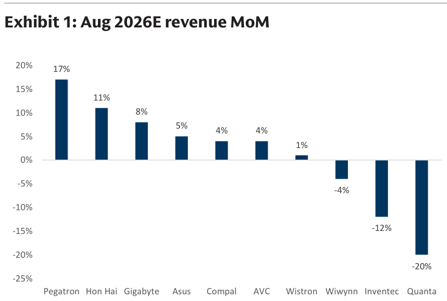

### 解讀摘要
10 家公司 8 月 MoM 增速平均 -2%，但分布極度分化：和碩 +17%、鴻海 +11%、技嘉 +8% 居前，廣達 -20%、英業達 -12%、緯穎 -4% 殿後。這種分化直接反映 AI 伺服器佔比：廣達 Jul-26 衝上 +131% YoY 後 AI 機架出貨節奏進入整理；英業達 CE 比重高、AI 伺服器貢獻有限；反之鴻海/技嘉 AI 帶動 MoM 繼續為正。

### 表格

| 公司 | Aug MoM |
|---|---|
| 和碩 Pegatron | +17% |
| 鴻海 Hon Hai | +11% |
| 技嘉 Gigabyte | +8% |
| 華碩 ASUS | +5% |
| 仁寶 Compal | +4% |
| 奇鋐 AVC | +4% |
| 緯創 Wistron | +1% |
| 緯穎 Wiwynn | -4% |
| 英業達 Inventec | -12% |
| 廣達 Quanta | -20% |

---

## Exhibit 2｜Aug 2026E Revenue YoY

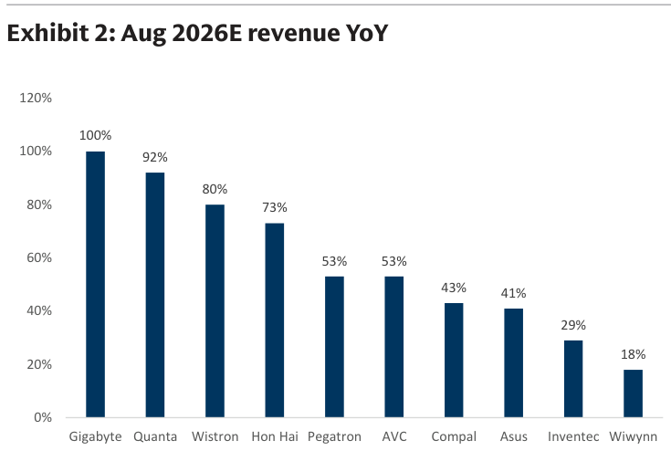

### 解讀摘要
YoY 層面，技嘉以 +100% 稱冠（AI 顯卡伺服器需求爆發＋低基期），廣達 +92%、緯創 +80%、鴻海 +73% 緊隨；緯穎 +18% 最低，係因 2025 年緯穎已率先放量（基期高）。即使 MoM 最弱的廣達，YoY 仍達 +92%，顯示整體供應鏈仍受 AI 伺服器強勁需求支撐。

### 表格

| 公司 | Aug YoY |
|---|---|
| 技嘉 Gigabyte | +100% |
| 廣達 Quanta | +92% |
| 緯創 Wistron | +80% |
| 鴻海 Hon Hai | +73% |
| 和碩 Pegatron | +53% |
| 奇鋐 AVC | +53% |
| 仁寶 Compal | +43% |
| 華碩 ASUS | +41% |
| 英業達 Inventec | +29% |
| 緯穎 Wiwynn | +18% |

> **洞察一**：緯穎 YoY +18% 表面看最弱，但絕對金額 Aug-26E NT\$113,567mn 仍創近期新高（見 Exhibit 11），係高基期效應而非需求回落——是相對 YoY 被誤讀的典型案例。

---

## Exhibit 3｜Taiwan PC/Server Names Monthly Revenue Summary

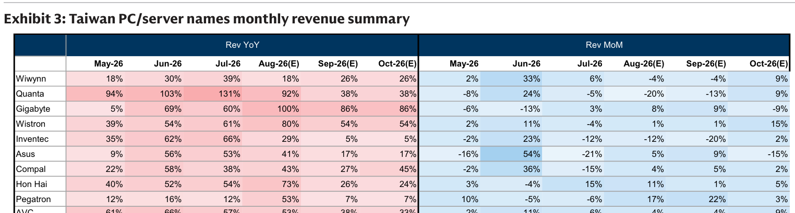

### 解讀摘要
May-Oct 2026E 完整 YoY/MoM 矩陣，一張圖完整呈現 CE 淡季（PC ODM 的 Aug-Sep MoM 普遍為負）與 AI 驅動力（鴻海/緯創 Oct YoY 仍達 24%/95%）的交叉影響。Oct 轉正是整個預覽期的重要拐點，代表 CE 季節性最弱時間點過去。

### 表格

| 公司 | Aug-26E YoY | Sep-26E YoY | Oct-26E YoY | Aug MoM | Sep MoM | Oct MoM |
|---|---|---|---|---|---|---|
| 緯穎 Wiwynn | 18% | 26% | 26% | -4% | -4% | 9% |
| 廣達 Quanta | 92% | 38% | 60% | -20% | -13% | 9% |
| 技嘉 Gigabyte | 100% | 86% | 67% | 8% | 9% | -9% |
| 緯創 Wistron | 80% | 54% | 95% | 1% | 1% | 15% |
| 英業達 Inventec | 29% | 5% | 19% | -12% | -20% | 2% |
| 華碩 ASUS | 41% | 17% | 23% | 5% | 9% | -15% |
| 仁寶 Compal | 43% | 27% | 45% | 4% | 5% | 2% |
| 鴻海 Hon Hai | 73% | 26% | 24% | 11% | 1% | 5% |
| 和碩 Pegatron | 53% | 7% | 7% | 17% | 22% | 3% |
| 奇鋐 AVC | 53% | 38% | 33% | 4% | 4% | 9% |

---

## Exhibit 4｜Taiwan ODM Notebook Monthly Shipment

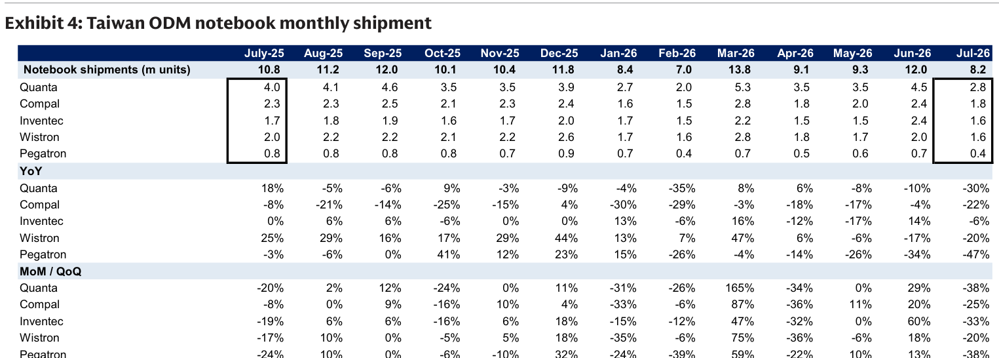

### 解讀摘要
7月筆電出貨降至 8.2m 台（上月 12.0m，-32% MoM），符合 1H26 需求提前消費後的季節性回落。廣達（2.8m）、仁寶（1.8m）、英業達（1.6m）、緯創（1.6m）全線 MoM 下滑 20-38%；和碩（0.4m）跌幅最深（-47% YoY）。PC 端需求弱勢是 Q3 MoM 普遍偏低的主因，但 YoY 仍有基期效應支撐。

### 表格

| 廠商 | Jul-26 出貨（mn） | YoY | MoM |
|---|---|---|---|
| 總計 | 8.2 | -30% | -32% |
| 廣達 Quanta | 2.8 | -30% | -38% |
| 仁寶 Compal | 1.8 | -22% | -25% |
| 英業達 Inventec | 1.6 | -6% | -33% |
| 緯創 Wistron | 1.6 | -20% | -20% |
| 和碩 Pegatron | 0.4 | -47% | -43% |

---

## Exhibit 5｜Hon Hai Aug 2026E Revenue Model

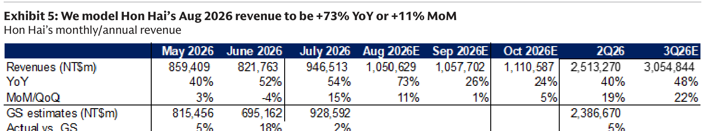

### 解讀摘要
鴻海 8 月 GS 預估 NT\$1,050,629mn（+73% YoY/+11% MoM），為本批 10 家中 MoM 第二強（次於和碩），主要受 AI 伺服器 Rack 出貨加速驅動。3Q26E 合計 NT\$3,054,844mn（+48% YoY），AI 伺服器貢獻佔比持續提升中。

### 表格

| | Jul-26 | Aug-26E | Sep-26E | Oct-26E | 3Q26E | 4Q26E |
|---|---|---|---|---|---|---|
| 營收（NT\$mn） | 946,513 | 1,050,629 | 1,057,702 | 1,110,587 | 3,054,844 | — |
| YoY | 54% | 73% | 26% | 24% | 48% | — |
| MoM/QoQ | 15% | 11% | 1% | 5% | 22% | — |

---

## Exhibit 6｜Hon Hai Monthly Revenues

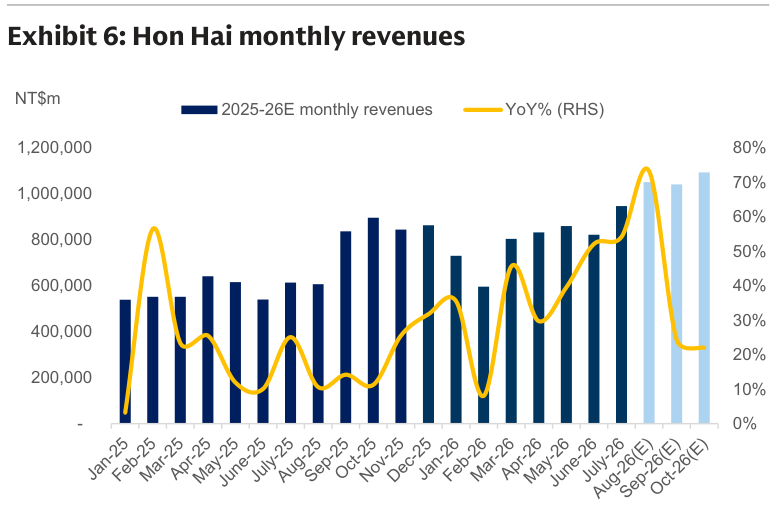

### 解讀摘要
鴻海月營收 2025-26E 趨勢圖，確認 2H26E 突破 NT\$1.0tn 門檻（月均），且 YoY 加速至 70%+（8 月）後 Sep/Oct 和緩至 24-26%（高基期效應）。長期上升趨勢完整，顯示 AI 伺服器訂單可見度高。

---

## Exhibit 7｜Quanta Aug 2026E Revenue Model

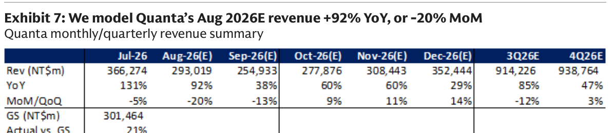

### 解讀摘要
廣達 8 月 GS 預估 NT\$293,019mn（+92% YoY/-20% MoM），MoM 跌幅全場最大，與 Exhibit 4 筆電出貨大幅下滑一致。但 3Q26E NT\$914,226mn（+85% YoY/-12% QoQ）的 YoY 仍高——這代表廣達 PC ODM 週期性很強，不是需求崩塌，而是 1H26 超額出貨後的動態回調。

### 表格

| | Jul-26 | Aug-26E | Sep-26E | Oct-26E | 3Q26E | 4Q26E |
|---|---|---|---|---|---|---|
| 營收（NT\$mn） | 366,274 | 293,019 | 254,933 | 277,876 | 914,226 | 938,764 |
| YoY | 131% | 92% | 38% | 60% | 85% | 47% |
| MoM/QoQ | -5% | -20% | -13% | 9% | -12% | 3% |

> **洞察二**：廣達 Jul-26 YoY +131%（因 Jul-25 低基期）後 Aug 驟降至 +92%，Sep 更降至 +38%——YoY 落差完全來自基期走升，絕對金額仍在正常季節性範圍。4Q26E +47% YoY 的回升則需關注 AI 伺服器是否接力 PC 淡季缺口。

---

## Exhibit 8｜Quanta Monthly Revenues

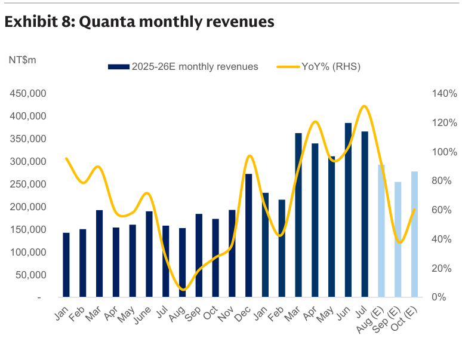

### 解讀摘要
廣達月營收趨勢，3-4 月因 AI 伺服器拉貨一度達 NT\$370,000mn 高點，7 月已回落 1% 至 NT\$366,274mn，8 月預計再跌 -20% MoM 至 NT\$293,019mn，顯示 PC+AI 季節性導致 3Q26E 絕對額 QoQ 下滑 -12%。4Q26E 的反彈幅度需觀察 AI Rack 訂單接棒速度。

---

## Exhibit 9｜AVC Monthly/Quarterly Revenue Summary

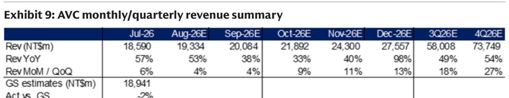

### 解讀摘要
奇鋐（AVC）是本批中唯一持續 MoM 正增長的非 ODM 廠：Aug/Sep/Oct 各 +4%/+4%/+9%，YoY 維持 +53%/+38%/+33%。4Q26E 更爆衝至 +98% YoY（NT\$73,749mn），直接映射 AI 伺服器機架液冷/氣冷散熱元件在年末需求的加速。

### 表格

| | Jul-26 | Aug-26E | Sep-26E | Oct-26E | 3Q26E | 4Q26E |
|---|---|---|---|---|---|---|
| 營收（NT\$mn） | 18,590 | 19,334 | 20,084 | 21,892 | 58,008 | 73,749 |
| YoY | 57% | 53% | 38% | 33% | 49% | 54% |
| MoM/QoQ | 6% | 4% | 4% | 9% | 18% | 27% |

> **洞察三（配合 Exhibit 1）**：奇鋐是 Exhibit 1 MoM 排第六（+4%），但 4Q26E QoQ +27% 是所有公司中最強的，暗示 GS 認為 AI 散熱需求的峰值在 4Q26，不在 3Q。

---

## Exhibit 10｜AVC Monthly Revenues

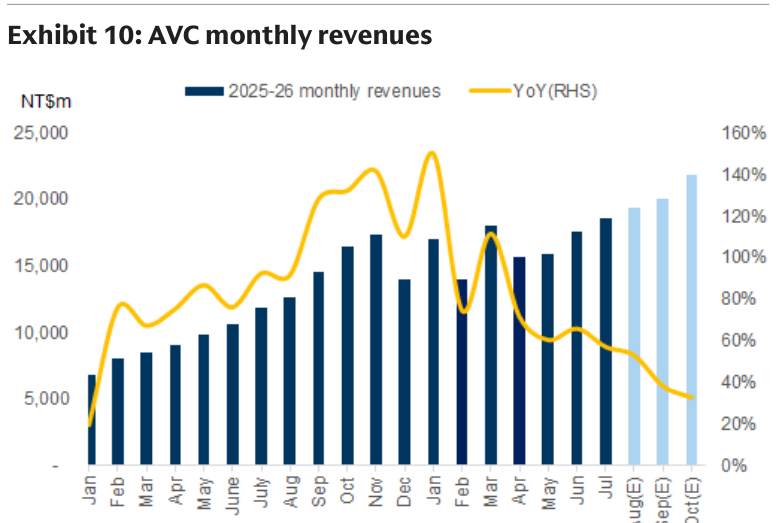

### 解讀摘要
奇鋐月營收長期上升趨勢完整，Jan-25 到 Jul-26 幾乎單向攀升（YoY 從 60% 逐步降至 40% 左右係基期走升，非需求減速）；4Q26E NT\$73,749mn 的預估確認 GS 對 AI 散熱元件需求的長期看好。

---

## Exhibit 11｜Wiwynn Monthly Revenues Preview

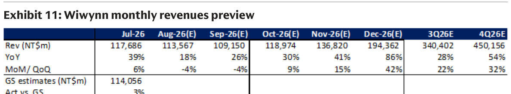

### 解讀摘要
緯穎 Aug-Sep 各 -4% MoM 是因 Jul-26 衝至 NT\$117,686mn（+39% YoY）後的 AI 伺服器出貨節奏整理，而非需求疑慮。Oct-Dec 強力回升（各 +9%/+15%/+42% MoM），4Q26E NT\$450,156mn（+54% YoY/+32% QoQ）代表次代 AI Rack 正式放量。緯穎的 Aug YoY 僅 +18%（Exhibit 2 最低）完全是因 2025 年出貨量高，非基本面惡化。

### 表格

| | Jul-26 | Aug-26E | Sep-26E | Oct-26E | 3Q26E | 4Q26E |
|---|---|---|---|---|---|---|
| 營收（NT\$mn） | 117,686 | 113,567 | 109,150 | 118,974 | 340,402 | 450,156 |
| YoY | 39% | 18% | 26% | 30% | 28% | 54% |
| MoM/QoQ | 6% | -4% | -4% | 9% | 22% | 32% |

---

## Exhibit 12｜Wiwynn Monthly Revenues

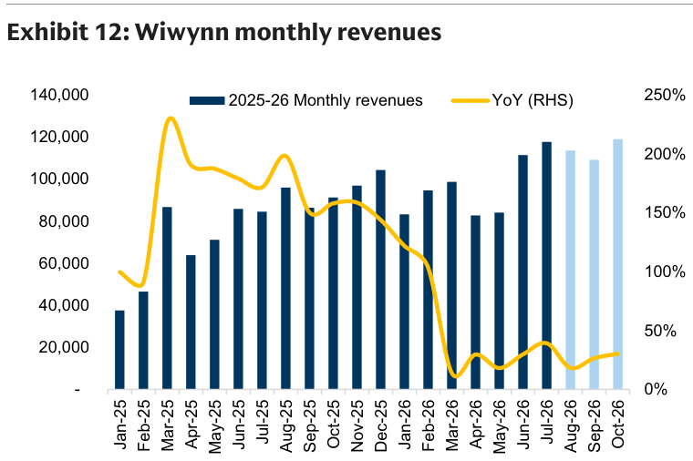

### 解讀摘要
緯穎月營收在 2025 年已完成第一波上升（YoY 200%+ 的基期壓制現在 2026 年 YoY）；2026 年 Aug-Sep 的暫停（NT\$110,000-117,000mn 平台整理）後，4Q26E 將再起爬坡至 NT\$150,000mn+ 月均值，對應次代 Rack 機種（GB300 系列等）開始出貨。

---

## Exhibit 13｜Wistron 3-Month Revenue Preview

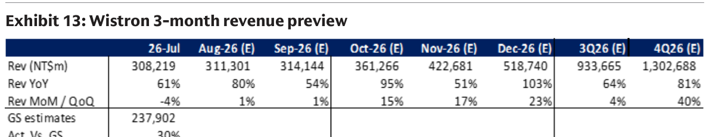

### 解讀摘要
緯創是本批最強的整季 AI 驅動標的之一：Aug +80% YoY/+1% MoM，Oct +95% YoY/+15% MoM，4Q26E +81% YoY/+40% QoQ。緯創相對廣達的差異在於 AI 伺服器業務佔比更高，PC 業務拖累相對輕，因此 3Q26E MoM 整體仍能接近持平（+4% QoQ）。

### 表格

| | Jul-26 | Aug-26E | Sep-26E | Oct-26E | 3Q26E | 4Q26E |
|---|---|---|---|---|---|---|
| 營收（NT\$mn） | 308,219 | 311,301 | 314,144 | 361,266 | 933,665 | 1,302,688 |
| YoY | 61% | 80% | 54% | 95% | 64% | 81% |
| MoM/QoQ | -4% | 1% | 1% | 15% | 4% | 40% |

---

## Exhibit 14｜Wistron Monthly Revenues

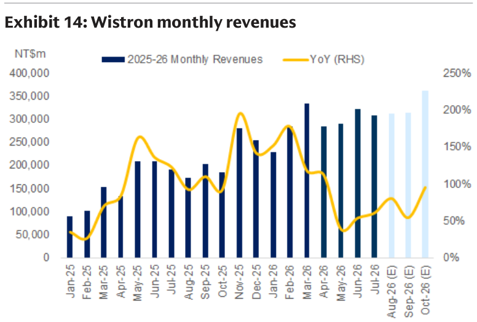

### 解讀摘要
緯創月營收 4Q26E 預估每月 NT\$360,000-520,000mn（高點 Dec-26E NT\$518,740mn），確認 GS 對緯創 AI 伺服器機架出貨放量的高度信心。本批 10 家公司中，4Q26E 緯創 QoQ 增速 +40% 是除和碩以外最強的（和碩是 CE 季節性因素，緯創是 AI 結構性成長）。

---

## Exhibit 15｜Gigabyte Aug/Sep Revenue Preview

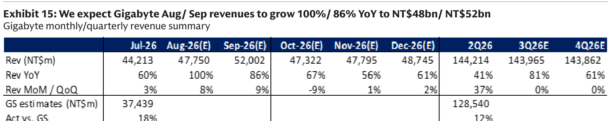

### 解讀摘要
技嘉 8 月 NT\$47,750mn（+100% YoY/+8% MoM）登頂 YoY 榜首，GS 預估絕對值創歷史新高。驅動力是 AI GPU 伺服器（H100/H200/B200 系列）的顯卡板卡需求，以及 ODM AI 伺服器機殼組裝。3Q26E NT\$143,965mn（+81% YoY）顯示全季維持強勁，Oct-26E -9% MoM 係季節性，全年 YoY 仍達 61%。

### 表格

| | Jul-26 | Aug-26E | Sep-26E | Oct-26E | 3Q26E | 4Q26E |
|---|---|---|---|---|---|---|
| 營收（NT\$mn） | 44,213 | 47,750 | 52,002 | 47,322 | 143,965 | 143,862 |
| YoY | 60% | 100% | 86% | 67% | 81% | 61% |
| MoM/QoQ | 3% | 8% | 9% | -9% | 0% | 0% |

---

## Exhibit 16｜Gigabyte Monthly Revenues

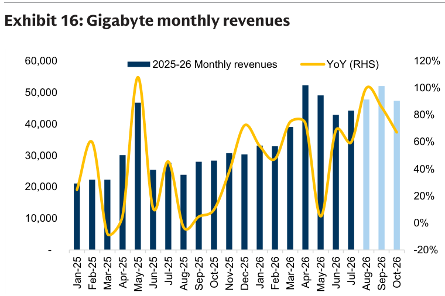

### 解讀摘要
技嘉月營收長期趨勢顯示 2026 年各月均明顯高於 2025 年同期（AI GPU 板卡需求持續擴張），且無明顯 V 型波動，顯示訂單能見度較高。4Q26E 幾乎持平 3Q26E（NT\$143,862mn）暗示 AI 伺服器顯卡需求季間較穩定，CE 季節性干擾小。

---

## Exhibit 17｜ASUS Aug Revenue Preview

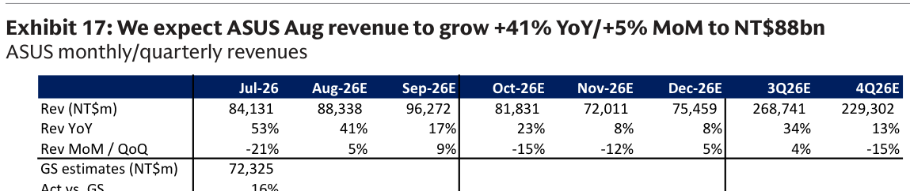

### 解讀摘要
華碩 8 月 NT\$88,338mn（+41% YoY/+5% MoM），GS 預估較 Jul-26 GS estimate 高 16%（Jul 實際 NT\$84,131mn 超 GSe 16%）。4Q26E -15% QoQ（NT\$229,302mn vs 3Q26E NT\$268,741mn）反映 PC 需求季節性疲弱。整體而言，華碩 AI PC 升級與記憶體高單價對 ASP 的貢獻是維持 YoY 增長的主因。

### 表格

| | Jul-26 | Aug-26E | Sep-26E | Oct-26E | 3Q26E | 4Q26E |
|---|---|---|---|---|---|---|
| 營收（NT\$mn） | 84,131 | 88,338 | 96,272 | 81,831 | 268,741 | 229,302 |
| YoY | 53% | 41% | 17% | 23% | 34% | 13% |
| MoM/QoQ | -21% | 5% | 9% | -15% | 4% | -15% |

---

## Exhibit 18｜ASUS Monthly Revenue Trend

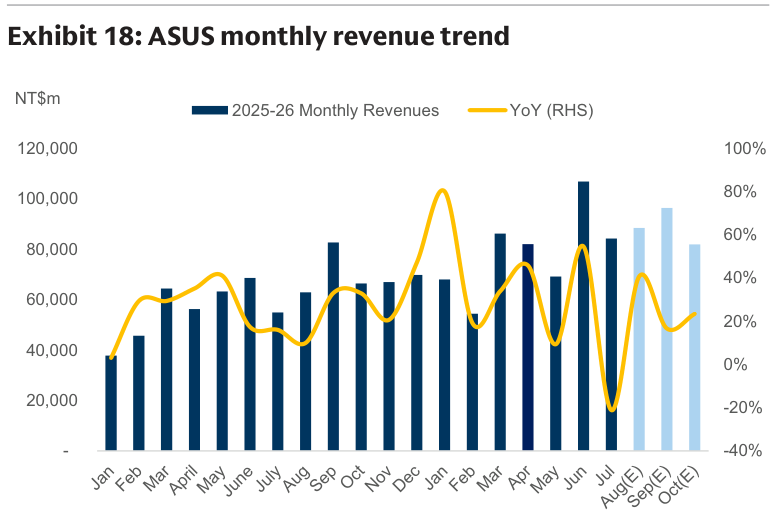

### 解讀摘要
華碩月營收 2026 全年明顯高於 2025 同期，YoY 從 Jan-26 +50% 後逐步回落（基期走升），Sep-Oct 預估 YoY 降至 17-23%，4Q26E +13% YoY 為 2026 年全年最低。顯示華碩 PC/品牌業務的 AI 升級效益有限，難抵 CE 季節性下行壓力。

---

## Exhibit 19｜Compal 3-Month Revenue Preview

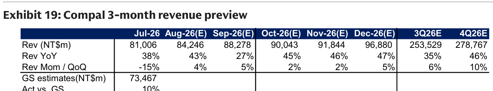

### 解讀摘要
仁寶 3Q26E 相對穩健：Aug/Sep 各 +43%/+27% YoY，MoM 小幅回升（+4%/+5%）；4Q26E +46% YoY/+10% QoQ 受惠於筆電新機種量產與蘋果供應鏈（可折疊設備？）準備。仁寶是 PC ODM 中受 AI 伺服器影響最小的，穩健性來自分散化客戶結構。

### 表格

| | Jul-26 | Aug-26E | Sep-26E | Oct-26E | 3Q26E | 4Q26E |
|---|---|---|---|---|---|---|
| 營收（NT\$mn） | 81,006 | 84,246 | 88,278 | 90,043 | 253,529 | 278,767 |
| YoY | 38% | 43% | 27% | 45% | 35% | 46% |
| MoM/QoQ | -15% | 4% | 5% | 2% | 6% | 10% |

---

## Exhibit 20｜Compal Monthly Revenues

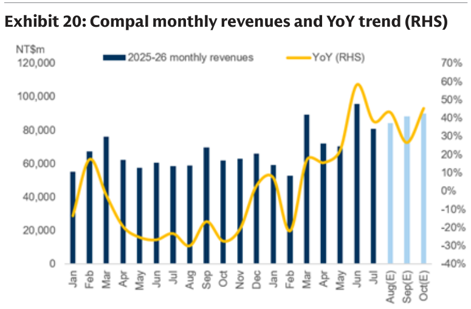

### 解讀摘要
仁寶月營收 Jun-Jul-26 達波段高點（NT\$97,000-81,000mn）後 3Q26E 小幅整理（NT\$84,000-88,000mn），整體走勢相對平穩。YoY 維持 35-46%，是 CE ODM 中結構最穩的。

---

## Exhibit 21｜Inventec Monthly Revenue Preview

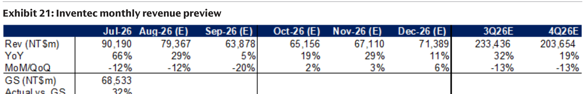

### 解讀摘要
英業達是本批最弱的公司：3Q26E MoM -13%（QoQ，僅次廣達-12%），且 Sep-26E 僅 +5% YoY，接近零增長。英業達 CE（PC/伺服器）比重高、AI 伺服器佈局有限，在 CE 下行週期中承受雙重壓力；Jul 超 GSe +32%（NT\$90,190mn vs GS NT\$68,533mn）或有一次性因素，後續回落更快。

### 表格

| | Jul-26 | Aug-26E | Sep-26E | Oct-26E | 3Q26E | 4Q26E |
|---|---|---|---|---|---|---|
| 營收（NT\$mn） | 90,190 | 79,367 | 63,878 | 65,156 | 233,436 | 203,654 |
| YoY | 66% | 29% | 5% | 19% | 32% | 19% |
| MoM/QoQ | -12% | -12% | -20% | 2% | -13% | -13% |

> **洞察四**：英業達 Jul-26 超 GSe +32%（NT\$90,190mn），但 Aug-Sep 各連降 -12%/-20% MoM，代表 Jul 超額出貨很可能是訂單集中配送（可能有部分是 AI 伺服器訂單提前入帳），之後的回落更加陡峭。

---

## Exhibit 22｜Inventec Monthly Revenues

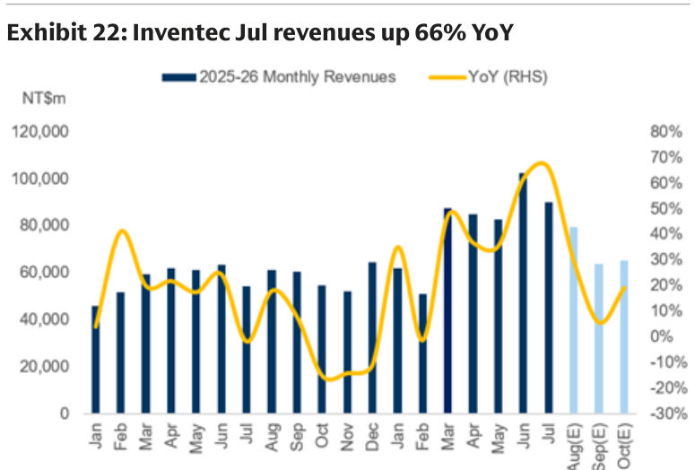

### 解讀摘要
英業達月營收 Jul-26 達 NT\$90,190mn（+66% YoY）為近期高峰，但圖表顯示 Aug-Sep-26E 預估大幅下跌（NT\$63,000-79,000mn），回到 2025 年下半年水準，YoY 優勢幾乎消失（Sep +5%）。這與仁寶的溫和回調形成對比，反映英業達 CE 集中度更高。

---

## Exhibit 23｜Pegatron 3-Month Revenue Preview

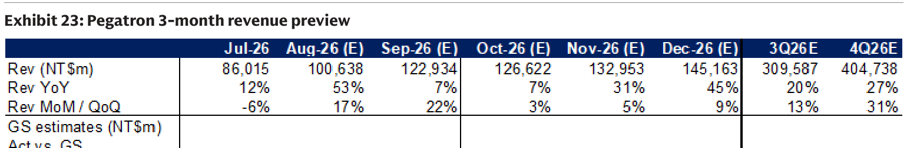

### 解讀摘要
和碩預估同步更新（本報告唯一調整預估的公司）：Aug-26E NT\$100,638mn（+53% YoY/+17% MoM）是本批 MoM 最強，但這是 Jul 的低基期（-6% MoM）反彈；Sep/Oct 僅 +7% YoY，代表 2H26 基本面不佳、Apple 供應鏈需求能見度低，對應 GS 的 Sell 評等。4Q26E +27% YoY 高於 3Q 但仍是評等中最弱的。

### 表格

| | Jul-26 | Aug-26E | Sep-26E | Oct-26E | 3Q26E | 4Q26E |
|---|---|---|---|---|---|---|
| 營收（NT\$mn） | 86,015 | 100,638 | 122,934 | 126,622 | 309,587 | 404,738 |
| YoY | 12% | 53% | 7% | 7% | 20% | 27% |
| MoM/QoQ | -6% | 17% | 22% | 3% | 13% | 31% |

---

## Exhibit 24｜Pegatron Monthly Revenues

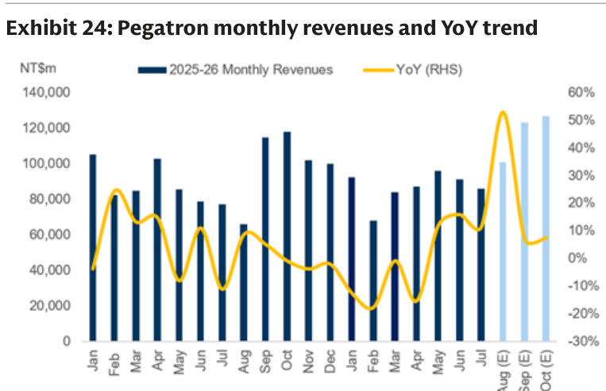

### 解讀摘要
和碩月營收長期走勢圖顯示 2025 年已有一波急速成長後於 2026 年底部整理（Jan-Jul 26 平均 NT\$60,000-86,000mn），GS 預估 Aug-Oct 大幅跳升至 NT\$100,000-127,000mn，係基於蘋果 iPhone 新機種拉貨（Apple 供應鏈季節性旺季）。全年 YoY 偏低（3Q +20%、4Q +27%）是 GS 給 Sell 的關鍵——相對其他 Buy 標的，和碩的 AI 伺服器佔比與成長動能均落後。

---

## 相關個股清單

| 類別 | 公司 | Ticker | GS 評等 | 備註 |
|---|---|---|---|---|
| ODM/EMS | 鴻海 | 2317 TW | Buy | AI 伺服器 Rack 核心受益，8月+73% YoY |
| 伺服器 ODM | 緯穎 | 6669 TW | Buy | 次代 Rack 4Q26E 放量+32% QoQ |
| ODM/EMS | 緯創 | 3231 TW | Buy | AI 主導，4Q26E +81% YoY/+40% QoQ |
| 散熱 | 奇鋐 | 3017 TW | Buy | 4Q26E +98% YoY，AI散熱需求加速 |
| 品牌 | 技嘉 | 2376 TW | Neutral | Aug YoY +100%（最強），但評等受限 |
| ODM/EMS | 廣達 | 2382 TW | Neutral | Aug -20% MoM，PC拖累 |
| ODM/EMS | 英業達 | 2356 TW | Neutral | 全批最弱，Sep +5% YoY |
| ODM/EMS | 仁寶 | 2324 TW | Neutral | 穩健，CE分散 |
| 品牌 | 華碩 | 2357 TW | Neutral | PC升級但AI伺服器佔比低 |
| ODM/EMS | 和碩 | 4938 TW | Sell | AI伺服器佔比低，成長落後 |
