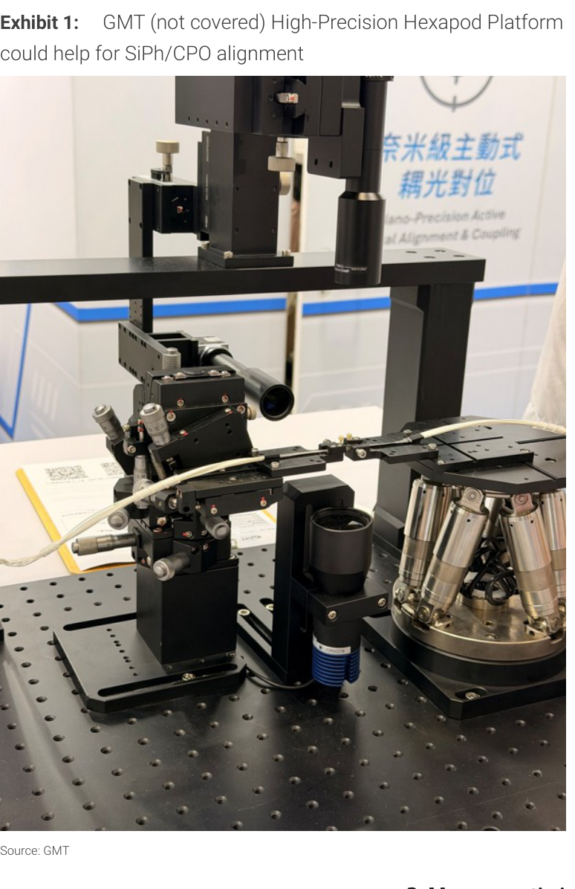
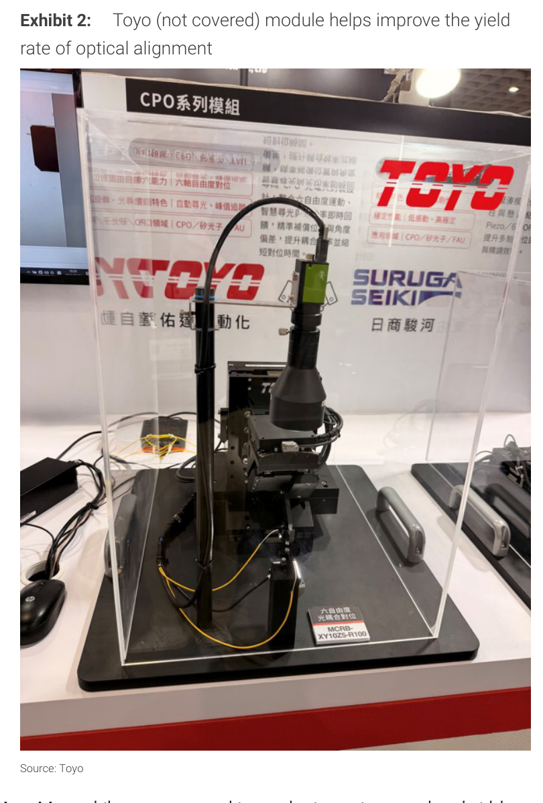
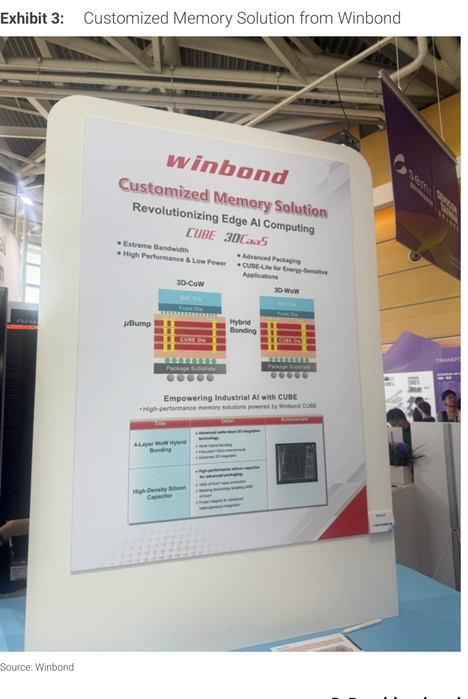
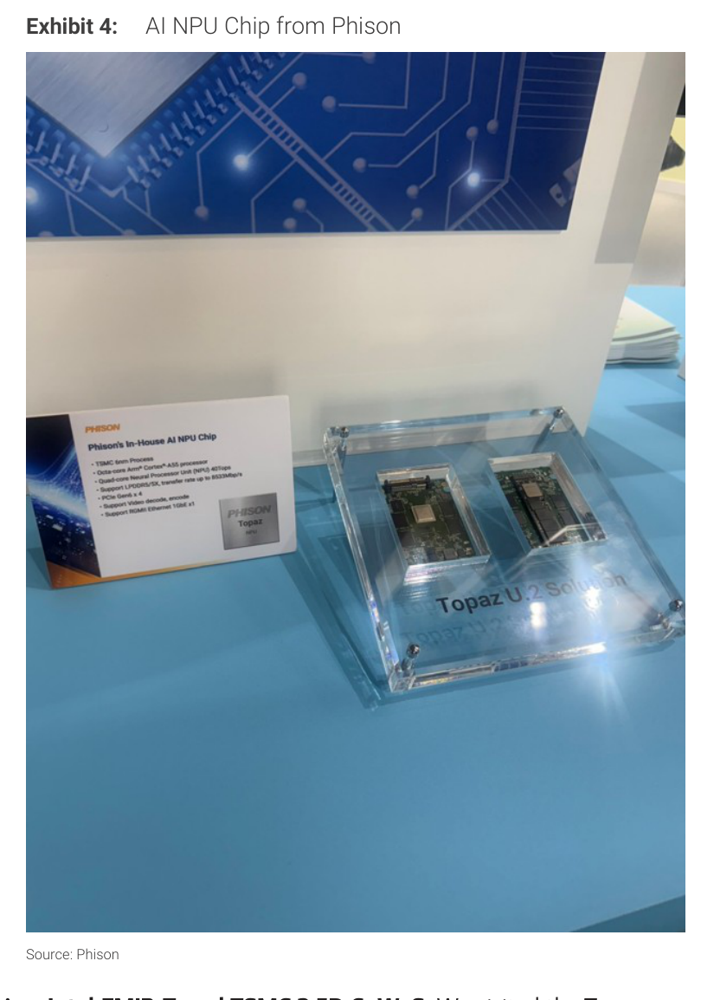
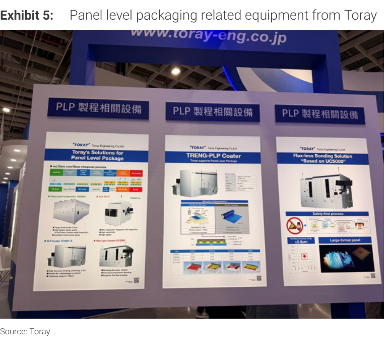
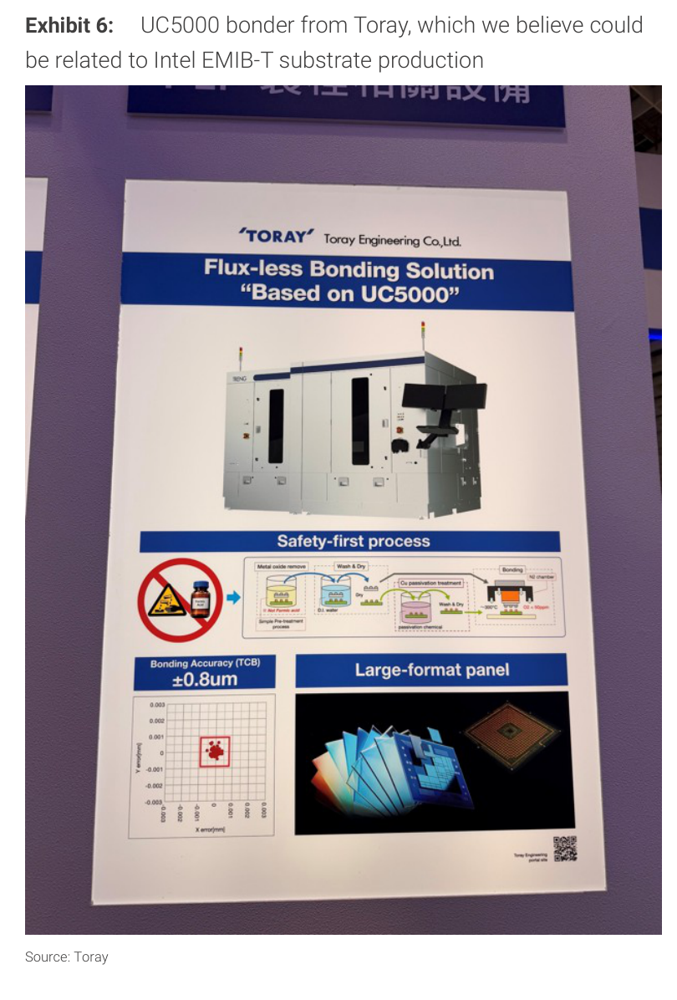

# MS｜SEMICON Taiwan 2026 重點摘要：我們需要更多產能

**券商**：Morgan Stanley  
**分析師**：Charlie Chan、Daniel Yen CFA、Daisy Dai CFA、Tiffany Yeh、Henry Zhao  
**日期**：2026-09-06  
**主題**：SEMICON Taiwan 2026 key takeaways - we need more  
**評級**：Attractive（產業觀點）  
<a href="https://layx.uk/dl?g=產業&b=MS&d=20260906&h=SEMICON-Taiwan-2026">📎 下載 PDF</a>

---

## 報告總結

SEMICON Taiwan 2026 展示台灣 AI 半導體供應鏈仍是全球 AI 基礎建設的核心瓶頸。TSMC Deputy Co-COO 侯先生表示「過去六個月需求成長與變化之快前所未見，而設備交付仍不足」；MediaTek CEO 蔡明介向 ASE、台積電、欣興求助產能。MS 維持 TSMC、聯發科、鴻勁、全環、旺矽、穎崴等多股 OW。展覽聚焦四大主題：SiPh/CPO 測試仍是量產瓶頸（多家公司搶進）、記憶體從增密轉向提升頻寬效率（Rubin Ultra 可能用 8-Hi HBM4 減少層數）、Panel-level packaging 與 Intel EMIB-T（Toray UC5000 精度 ±0.8μm；MediaTek TPU v9 HumuFish 2028 年可望拿到足夠 EMIB-T 基板）、台積電 Moore's Law 節能遷移與聯發科 ASIC 設計服務使 AI 算力開支更永續。

---

## MS 完整投資邏輯鏈

| 論點層次 | Exhibit | 內容 |
|---|---|---|
| 需求信號明確 | CEO Forum | TSMC/MediaTek CEO 公開確認 AI 需求遠超現有產能，供需緊俏延伸至 2027 |
| CPO 測試瓶頸 | Ex.1, Ex.2 | SiPh/CPO 量產良率與測試尚未標準化；GMT Hexapod、Toyo 6-axis 模組搶進對位設備市場 |
| 記憶體效率升級 | Ex.3, Ex.4 | Rubin Ultra 轉向 8-Hi HBM4（比 12-Hi 少 1/3），配合 HBM4e + 軟體優化；Winbond 3D WoW Hybrid Bonding 展示 |
| Panel-level packaging | Ex.5, Ex.6 | Toray UC5000 Flux-less 精度 ±0.8μm，Intel EMIB-T 主要挑戰在客戶知識，而非設備精度 |
| **結論** | 報告封面 | **維持 TSMC、聯發科、鴻勁、全環、旺矽、穎崴 OW；台灣仍是 AI 硬體最關鍵瓶頸** |

---

## 報告核心觀點

| 主題 | MS 觀點 | 市場關注 | 是否 Contra-Consensus |
|---|---|---|---|
| SiPh/CPO 測試 | 尚未標準化；多家公司搶進但仍在 qualification 階段；對位速度與精度是良率關鍵 | CPO 何時量產 | 偏保守（強調仍在早期） |
| 記憶體優化路徑 | 轉向頻寬效率而非增加密度；Rubin Ultra 8-Hi HBM4 + HBM4e + 軟體 | 記憶體需求量 | 需注意（8-Hi 比 12-Hi 少 1/3 層，unitcount 下降） |
| EMIB-T 瓶頸 | 設備精度（±0.8μm）已 OK；主要挑戰在矽橋接合對齊的客戶 know-how | EMIB-T 良率問題 | 偏樂觀（瓶頸已轉移至 know-how） |
| AI 算力永續性 | TSMC 節能製程遷移 + 聯發科 ASIC 服務雙驅動，降低 per-token cost | AI capex 是否持續 | 建設性（找到兩個可持續路徑） |

**偏好排序**：TSMC（2330）> 聯發科（2454）> 鴻勁（7769）、全環（Allring）、旺矽（MPI 6223）、穎崴（Winway 6515）

---

## Exhibit 1｜GMT High-Precision Hexapod Platform（SiPh/CPO 對位）

### 解讀摘要
GMT（未覆蓋）展示的六軸奈米精度主動對位耦合平台，專為 SiPh/CPO 光學對準設計。CPO 量產的核心難題是「對位速度 vs. 精度」的取捨——目前多家公司展示方案，但均尚未通過主要客戶 qualification，顯示市場仍處商機確認而非放量初期。

---

## Exhibit 2｜Toyo CPO 系列模組（光學對位良率提升）

### 解讀摘要
Toyo（未覆蓋）的 MCRB-XY10Z5-R100 六自由度光耦合對位模組，與 Suruga Seiki（日商駿河）合作。模組強調智慧光學追蹤、角度誤差補償。市場上多家公司提供類似方案，但皆在 qualification 階段，CPO 測試協議尚未統一是量產規模化的前置條件。

---

## Exhibit 3｜Winbond Customized Memory Solution（3D 記憶體堆疊）

### 解讀摘要
華邦電（2344）展示 CUBE 3DCaaS 方案：3D-CoW（μBump）與 3D-WoW（Hybrid Bonding）兩種架構，目標工業 AI Edge 應用。4-Layer WoW Hybrid Bonding + 高密度矽電容（1000 nF/mm²）為差異化技術。這與 Rubin Ultra 轉向頻寬效率（8-Hi HBM4 + 軟體優化）的大趨勢一致——記憶體業者競爭點從「堆更多 DRAM」轉向「同等容量下提升帶寬與整合密度」。

---

## Exhibit 4｜Phison AI NPU Chip「Topaz」

### 解讀摘要
群聯電子（Phison，未在本報告覆蓋）展示 In-House AI NPU 晶片「Topaz」：TSMC 8nm、Arm Cortex-A55、NPU 48 TOPs、PCIe Gen4 x4，Topaz U.2 模組形態。此為聯發科 ASIC 設計服務生態系的側面印證——台灣晶片客戶有能力將 AI NPU 內化，而非單純採用 Nvidia GPU，有助降低 AI capex per-token cost。

---

## Exhibit 5｜Toray 面板級封裝（PLP）相關設備

### 解讀摘要
Toray Engineering 展示三類 PLP 設備：玻璃面板檢測（AIX-QA-9）、TRENG-PLP Coater、以及 UC5000 Flux-less Bonding。面板級封裝代表 Moore's Law 後段封裝的下一波降本路徑，Toray 設備矩陣覆蓋 PLP 製程全環節，有機會隨 Intel EMIB-T 及 MediaTek TPU v9 等先進封裝放量而受益。

---

## Exhibit 6｜Toray UC5000 Bonder（Intel EMIB-T 基板生產）

### 解讀摘要
Toray UC5000 Flux-less Bonding Solution：TCB 精度 ±0.8μm（無助焊劑酸性製程，改用金屬氧化物去除 + DI 水 + 銅鈍化流程），支援大尺寸面板。MS 調查發現 EMIB-T 良率的主要障礙不是設備精度（±0.8μm 已足夠），而是矽橋鍵合對齊的客戶 know-how。預計 Intel 將提供技術支援，MediaTek TPU v9（HumuFish）2028 年可望取得充足 EMIB-T 基板供應。

> **洞察一**：UC5000 精度達 ±0.8μm 代表 Toray 已解除設備端瓶頸，EMIB-T 時程風險主要在客戶良率學習曲線（Intel 提供 know-how），而非設備供應——這縮短了量產的不確定性時間軸。

---

## 相關個股清單

| 類別 | 公司 | Ticker | 評等 | 備註 |
|---|---|---|---|---|
| 首選 OW | 台積電 | 2330.TW | OW | AI 最先進晶圓代工龍頭 |
| 首選 OW | 聯發科 | 2454.TW | OW | ASIC 設計服務 Top Pick |
| 持續 OW | 鴻勁精密 | 7769.TW | OW | CoWoS、CoPoS 擴產 |
| 持續 OW | 旺矽科技 | 6223.TW | OW | CoPoS/CPO 測試介面 |
| 持續 OW | 穎崴科技 | 6515.TW | OW | 測試介面 |
| 持續 OW | 全環科技 | Allring | OW | CPO 光學對位相關 |
| 相關提及 | 日月光 | 3711.TW | — | MediaTek 向其要求更多產能 |
| 相關提及 | 欣興 | 3037.TW | — | MediaTek 向其要求更多產能 |
| 未覆蓋 | Toray Engineering | — | — | PLP/EMIB-T 設備 UC5000 |
| 未覆蓋 | GMT | — | — | Hexapod 光學對位平台 |
| 未覆蓋 | Toyo | — | — | CPO 6-axis 對位模組 |
