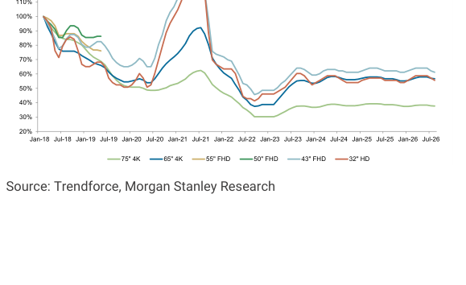
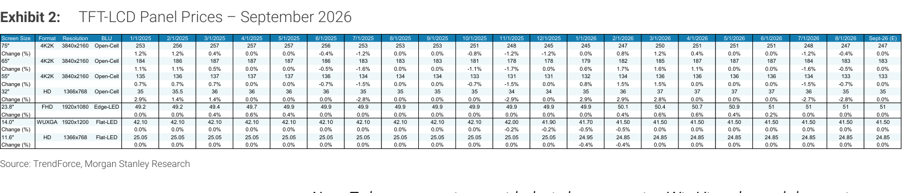
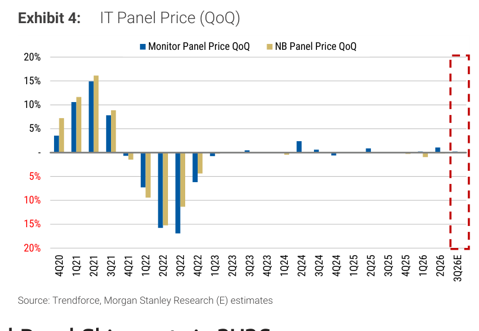
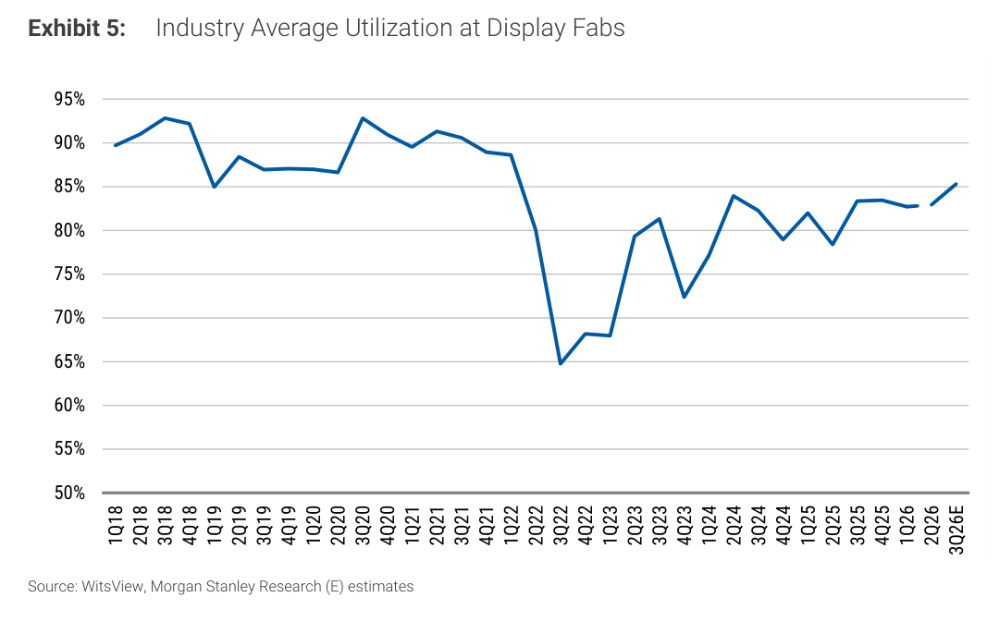
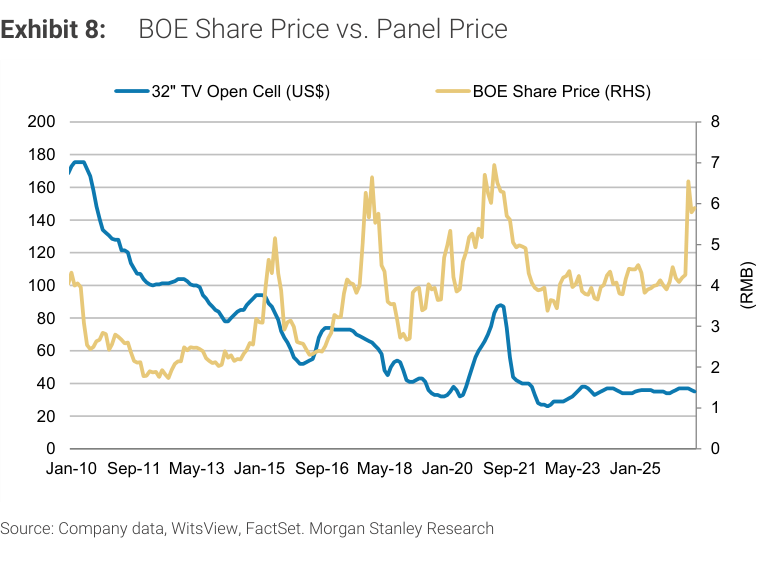

# Morgan Stanley｜TFT-LCD 面板價格月報（Sep 2026）— 玻璃封裝題材溢價已充分反映，面板股基本面催化劑不足

**券商**：Morgan Stanley  
**分析師**：Derrick Yang、Shawn Kim、Ryan Kim、Vivi Huang、Andy Meng, CFA  
**日期**：2026-09-08  
**主題**：September 2026 TFT-LCD 面板價格月更新（TV + IT 全面持平 MoM）；台灣面板股股價急漲後風險/報酬比惡化；中國 BOE 優於 TCL  
**評級**：In-Line（Greater China Technology Hardware）；Attractive（S. Korea Technology）  
<a href="https://layx.uk/dl?g=產業&b=MS&d=20260908&h=TFT-LCD-Panel-Price-Sep">📎 下載 PDF</a>

---

## 報告總結

September 2026 TV 與 IT 面板價格全面持平 MoM，MS 預估 3Q26 TV 面板 QoQ -低個位數%，IT（Monitor + NB）QoQ 持平——基本面並無特別亮點。然而 2026 年以來，AUO（2409）與 Innolux（3481）股價分別急漲至 NT\$27-28 與 NT\$65 附近，遠遠偏離面板價格走勢，市場顯然已將玻璃基板先進封裝（glass-in-advanced-packaging，預估 2028 年才開始貢獻）的長線題材提前計入。MS 認為此溢價已充分反映，目前 AUO 1.5x P/B、Innolux 1.7x P/B，時程與競爭風險皆不容忽視。中國端，BOE（000725，1.4x P/B）優於 TCL（000100，1.7x P/B），因 BOE 規模更大且玻璃核心基板進度較領先。

---

## Morgan Stanley 完整投資邏輯鏈

| 論點層次 | Exhibit | 內容 |
|---|---|---|
| 現況：面板價格持平 | Exhibit 1/2 | Sep 2026 TV 及 IT 面板 MoM 持平；TV 價格從 2018 峰值下滑後維持低位（35-65%） |
| 短期展望：謹慎 | Exhibit 3/4 | 3Q26E TV -低個位數% QoQ，IT 持平；無明顯需求拉動催化劑 |
| 產能利用率回升 | Exhibit 5 | 面板廠利用率回升至 ~85%，但仍在 2021 高峰（~97%）以下，供需未到緊繃 |
| 股價已提前反映長線題材 | Exhibit 6/7/8/9 | AUO/Innolux 股價急漲至多年高點，與平穩的面板價格嚴重背離，市場計入玻璃封裝 2028 貢獻 |
| 估值溢價已充分 | 正文 | AUO 1.5x P/B、Innolux 1.7x P/B；時程延遲與競爭（Samsung、Schott）是主要下行風險 |
| 中國：BOE 優於 TCL | 正文 | BOE 1.4x P/B（低）+ 玻璃核心基板進度領先；TCL 1.7x P/B（偏貴）且技術差距更大 |
| **結論** | 正文 | **面板基本面平淡；台股面板玻璃封裝溢價過高，報酬/風險偏差；中國 BOE 是相對較佳選擇** |

> **報告最大邏輯缺口**：MS 並未揭示玻璃核心基板的 TAM 量化估算，也未提供 AUO/Innolux 在玻璃封裝的市占預估；「已充分反映」的判斷主要依賴 P/B 比較，缺乏 DCF 或情境分析支撐。

---

## 報告核心觀點

| 主題 | MS 觀點 | 市場共識 | 是否 Contra-Consensus |
|---|---|---|---|
| 面板價格 Sep | TV + IT 全面持平 MoM | 市場多預期 IT 小幅下跌 | ≈ 持平略優於部分預期 |
| 3Q26 展望 | TV -低個位數% QoQ；IT 持平 | 共識方向類似 | ≈ 符合共識方向 |
| 台股面板估值 | 玻璃封裝溢價已充分反映，下行風險上升 | 市場對玻璃封裝題材仍偏樂觀 | ✅ MS 偏保守，認為溢價過高 |
| 中國偏好 | BOE > TCL（P/B 低 + 技術較領先） | 不明確 | ≈ BOE 偏好符合多數觀點 |

**個股偏好**：中國 BOE（000725）> TCL（000100）；台灣 AUO/Innolux 估值溢價已充分反映

---

## Exhibit 1｜TFT-LCD TV 面板價格長期走勢（2018–Jul 2026）

### 解讀摘要

此為 2018 年以來各尺寸 TV 面板價格指數（以 2018 高點為基準正規化）的長期趨勢圖。所有主要尺寸（75"/65"/55"/32"）目前均在 2018 峰值的 35-65% 區間盤整，自 2022-2023 年庫存去化後雖有回升，但遠未恢復至週期高峰。這張圖是報告的「大背景」，顯示面板價格長期仍低迷，任何股價急漲都必須用非面板本業邏輯（玻璃封裝）來解釋。

---

## Exhibit 2｜Sep 2026 面板現貨報價表

### 解讀摘要

Sep 2026 全面板品類報價持平 MoM，反映當前供需均衡但無上行動能。TV 面板價格長期低迷（32" 僅 US\$35）；IT 面板價格相對穩定（14" NB US\$41.50，28" Monitor US\$51）。所有尺寸 MoM 變化為 0%，是面板產業景氣平淡的直接佐證，與 AUO/Innolux 股價急漲形成強烈對比。

### 表格

| 品類 | 尺寸 | Sep 2026 報價 | MoM 變化 |
|---|---|---|---|
| **TV Open Cell** | 75" | US\$247 | 持平 |
| | 65" | US\$183 | 持平 |
| | 55" | US\$133 | 持平 |
| | 32" | US\$35 | 持平 |
| **Monitor** | 28" | US\$51 | 持平 |
| **Notebook** | 14" | US\$41.50 | 持平 |
| | 11.6" | US\$24.85 | 持平 |

> **洞察一**：32" TV 面板僅 US\$35，約為 2020-2021 週期高峰時的 25-30%，說明面板景氣即使「回穩」，價格絕對水準仍極低。在此背景下，AUO/Innolux 的股價急漲完全不是由面板本業驅動，市場定價的是 2028 年以後的玻璃核心基板新業務。

---

## Exhibit 3｜TV 面板價格 QoQ 變化（4Q20–3Q26E）

### 解讀摘要

TV 面板季度環比走勢圖顯示，2020-2021 年 COVID 需求爆發帶來的超級漲價週期（+20-30% QoQ 多季）已完全結束，2022 年暴跌後此後維持在低個位數正負幅度盤整。3Q26E MS 預估為略負（低個位數%），顯示短期無上行催化劑。這個格局下，面板廠純靠本業難以驅動估值擴張。

---

## Exhibit 4｜IT 面板價格 QoQ 變化（4Q20–3Q26E）

### 解讀摘要

IT 面板（Monitor + NB）季度環比走勢與 TV 面板類似——2021 年高峰後大幅修正，現已趨於穩定。3Q26E MS 預估 QoQ 持平，略優於 TV（TV 預估 -低個位數%）。IT 面板客戶結構相對集中（Apple、Dell、HP），需求波動性略低，但同樣無明顯上行動能。

---

## Exhibit 5｜顯示器面板廠平均產能利用率（1Q18–3Q26E）

### 解讀摘要

面板廠利用率從 2022 年 3Q 的 ~65% 低谷持續回升，3Q26E 預估達 ~85%，接近 2019 年前的正常水準（約 85-90%），但仍低於 2021 年超周期高峰（~95-97%）。利用率回升代表供給紀律改善，是面板價格能夠維持（而非繼續下跌）的基礎——但要推動面板價格顯著上漲，可能需要利用率突破 90% 並出現需求意外。

> **洞察一**：~85% 利用率在歷史上對應「供需均衡、面板價格溫和/持平」的環境，而不是「漲價週期」——這與 Exhibit 2/3/4 的平穩報價一致，也說明 AUO/Innolux 的股價上漲來自題材重估（玻璃封裝），而非本業利用率帶動。

---

## Exhibit 6｜AUO 股價 vs. 面板價格（2010–Jul 2026）

### 解讀摘要

雙軸圖呈現 AUO 股價（RHS，NT\$）與 32" TV 面板開放格 Open Cell 美元報價（LHS）自 2010 年以來的走勢。2026 年 AUO 股價急升至 ~NT\$27-28，創近十年新高，而 32" TV 面板價格幾乎沒有動，維持在 ~US\$35 的低位。這是 16 年圖中出現最明顯的股價/面板價格背離——過去所有 AUO 股價高峰（2010-2011 年 ~NT\$23、2021 年 ~NT\$24）都有面板價格大幅上漲配合，此次完全不同。

> **洞察一**：2026 年 AUO 股價急漲 vs. 面板價格持平的背離，是市場重新定義 AUO 的公司屬性——從「面板週期股」轉向「玻璃封裝新材料股」。MS 認為 1.5x P/B 的估值已充分（甚至過度）反映了這個轉型預期，而轉型能否落地（2028 年才開始貢獻）仍有高度不確定性。

---

## Exhibit 7｜Innolux 股價 vs. 面板價格（2010–Jul 2026）

### 解讀摘要

Innolux（群創，3481）股價在 2026 年急漲至 ~NT\$65，是 15 年圖中的歷史極高點（超過 2010-2011 年的 NT\$35 峰值，更超過 2021 年的 NT\$27-28 峰值）；32" TV 面板報價同樣持平在 US\$35 附近。Innolux 的股價漲幅（至 NT\$65）甚至比 AUO（至 NT\$27-28）的相對幅度更大，反映市場給予 Innolux 更大的玻璃封裝題材想像空間（或更高的 Beta 屬性）。MS 認為 1.7x P/B 估值中已充分反映這個預期。

> **洞察一（配合 Exhibit 6）**：AUO 1.5x P/B vs. Innolux 1.7x P/B，但 Innolux 在技術路線和客戶基礎上並不比 AUO 更領先——更高的 P/B 意味著 Innolux 面臨更大的估值修正風險（若玻璃封裝時程延遲或市場 sentiment 轉向）。

---

## Exhibit 8｜BOE 股價 vs. 面板價格（2010–Jan 2026）

### 解讀摘要

BOE（京東方，000725）股價目前約 RMB\$6，相對於 2021 年高峰（~RMB\$7.5）仍低，且整體波動幅度比 AUO/Innolux 的 2026 急漲更為溫和。BOE 的估值（1.4x P/B）低於台灣同業，MS 認為這反映的是投資機會而非折價——BOE 在玻璃核心基板的技術進度比 TCL 更領先，且規模優勢明顯。

> **洞察一（配合 Exhibit 9）**：BOE（1.4x P/B，~RMB\$6）vs. TCL（1.7x P/B，~RMB\$5）——後者估值反而更貴，且技術落後、規模較小。MS 的 BOE > TCL 偏好在 P/B 和技術進度兩個維度都有數字支撐。

---

## Exhibit 9｜TCL Share Price vs. 面板價格（2010–Jan 2026）

### 解讀摘要

TCL（000100）股價目前約 RMB\$5，顯著低於 2021 年高峰（~RMB\$8.5），本身並未出現 AUO/Innolux 式的玻璃封裝題材急漲。然而 TCL 目前的 1.7x P/B 估值高於 BOE 的 1.4x，形成明顯矛盾——技術更落後、規模更小的公司，反而以更高的 P/B 交易，是 MS 偏好 BOE 而非 TCL 的核心理由。

---

## 跨 Exhibit 彙整表

### 彙整 1｜四大面板股估值 vs. 股價位置對比（來源：Exhibit 6-9 + 正文）

| 公司 | Ticker | 市場 | 估值（P/B） | 股價近況 | 相對 2021 高峰 | 玻璃封裝技術 | MS 評價 |
|---|---|---|---|---|---|---|---|
| AUO | 2409 | 台灣 | 1.5x | ~NT\$27-28，近十年新高 | 略超過 | 有進展 | 溢價已充分 |
| Innolux | 3481 | 台灣 | 1.7x | ~NT\$65，15 年歷史新高 | 大幅超過 | 有進展 | 溢價已充分（更貴） |
| BOE | 000725 | 中國 | 1.4x | ~RMB\$6，低於 2021 高峰 | 低於 | 領先同業 | 相對合理，首選 |
| TCL | 000100 | 中國 | 1.7x | ~RMB\$5，遠低於 2021 | 低於 | 落後 | 估值偏貴，不首選 |

> **洞察**：台灣面板股（AUO/Innolux）因玻璃封裝題材重估而股價創新高，但 P/B 估值已比中國同業（BOE）高出 7-21%。若玻璃封裝 2028 前無明顯進展，台股面板股面臨估值向中國同業收斂的壓力；反之，若 BOE 在玻璃核心基板取得突破，其低 P/B 反而是上行空間。

---

## 相關個股清單

| 類別 | 公司 | Ticker | 評等 | 估值 | 備註 |
|---|---|---|---|---|---|
| 台灣面板 | AUO | 2409.TW | N/A | 1.5x P/B | 玻璃封裝溢價已充分；時程風險（2028 才貢獻） |
| 台灣面板 | Innolux | 3481.TW | N/A | 1.7x P/B | 估值更貴；股價衝 15 年新高，下行風險最大 |
| 中國面板 | BOE | 000725.SZ | 相對偏好 | 1.4x P/B | 規模最大；玻璃核心基板進度最領先；P/B 相對低 |
| 中國面板 | TCL | 000100.SZ | 相對不偏好 | 1.7x P/B | 技術落後；P/B 偏貴；股價遠低於 2021 高峰 |
