# Daiwa｜欣銓 (3264) Initiation — 從車用測試到 AI/HPC 測試強權

**券商**：Daiwa Capital Markets  
**分析師**：Leon Chen、Stacy Lin  
**日期**：2026-09-09  
**主題**：欣銓 (Ardentec, 3264 TT) 啟動覆蓋 — 純測試廠的 AI/HPC 轉型  
**評等**：Buy (1)，TP TWD340，upside +45.9%（報告日股價 TWD233）  
<a href="https://layx.uk/dl?g=產業&b=Daiwa&d=20260909&h=Ardentec-Initiation">📎 下載 PDF</a>

---

## 報告總結

Daiwa 首次覆蓋欣銓 (3264 TT)，以「Buy (1)、TP TWD340」啟動。欣銓是台灣純晶圓測試廠，服務晶圓廠、IDM 與 Fabless，現正從汽車/工業測試廠轉型為 AI/HPC ASIC 晶圓測試強權。催化劑時機：龍潭 7 層新廠逐季開層（每層每季貢獻 TWD450m+），加上同業（KYEC 等）將產能優先服務 AI GPU 後，傳統 AP/RF 訂單大量外溢至欣銓；兩力相加驅動 2025-28E 營收 CAGR 34.8%、EPS CAGR 48%、毛利率從 36% 升至 45%。

欣銓估值 25x 4Q-forward EPS，處歷史 10-25x 上緣，但有 48% EPS CAGR 撐腰。Daiwa 預估高於共識 8.1%（2026E）與 14.9%（2027E），認為市場低估了龍潭後半段的加速彎道與訂單外溢的量。CPO/光電測試雖近期佔比不到 5%，但已與 Raytek、Fabrinet、TSMC COUPE 生態系深度綁定，是長期護城河。

---

## Daiwa 完整投資邏輯鏈

| 論點層次 | Exhibit | 內容 |
|---|---|---|
| 市場擴張持續 | 09 | 全球 OSAT 市場 7-12% 年增，測試增速領先封裝 |
| 同業外溢創需求缺口 | 12, 13 | 競爭對手全力服務 AI GPU，舊製程 AP/RF 訂單外溢欣銓 |
| Longtan 量增架構化 | 04, 03 | 7 層廠每季開 1 層，每層 TWD450m+/季；2028E 佔比 36% |
| ASP 結構升價 | 01, 05 | AI ASIC 時薪近翻倍（95-100% premium）；晶圓測試佔比升至 79% |
| 毛利率槓桿顯著 | 15, 05 | 固定成本佔 COGS 40-45%；GM 36%→45%，UTR 63%→82% |
| CPO 光電先佔位 | 06, 08 | <5% 近期收入，卡位 SiPh/CPO 測試生態，3Q26 龜山新廠量產 |
| 估值合理有上行 | cover | 25x 4Q forward EPS；Daiwa EPS 高共識 8-15%，上修空間尚未充分反映 |
| **結論** | 封面 | **Buy (1)，TP TWD340（25x）；upside +45.9%** |

> **報告最大邏輯缺口**：龍潭後半段（4-7 層）開層是否按每季一層的節奏推進是關鍵假設；任何延遲將使 2027-28E 收入顯著低估。同業外溢訂單若競爭對手擴產後縮減，也會壓縮 mature 線的 UTR。

---

## 報告核心觀點

| 主題 | Daiwa 觀點 | 市場共識 | 是否 Contra-Consensus |
|---|---|---|---|
| 龍潭貢獻速度 | 每層 TWD450m+/季，2028E 佔比 36% | 市場尚未充分建模後半段 | ✅ 是，Daiwa 高共識 15%（2027E） |
| AI ASIC 時薪溢價 | 比傳統測試高 95-100%，帶動 GM 擴張 | 普遍知道有溢價，但幅度估低 | ✅ 是 |
| UTR 上行 | 固定成本比重高，UTR 63%→82% = GM 大槓桿 | 市場對 UTR 回升速度保守 | ✅ 是 |
| CPO 近中期貢獻 | <5% 近期，但戰略卡位有價值 | 多數未納入模型 | ～ 方向一致，時機分歧 |
| 同業訂單外溢 | 結構性持續（KYEC 全押 AI GPU） | 視為週期性、不可持續 | ✅ 是 |

**個股偏好**：純測試廠（欣銓 vs KYEC、穎崴）中，欣銓的純晶圓測試定位 + 龍潭新廠 + 低封裝佔比是最接近 AI ASIC 測試量價齊升的組合。

---

## Exhibit 1｜Ardentec: Revenue by Product（2021–2028E）

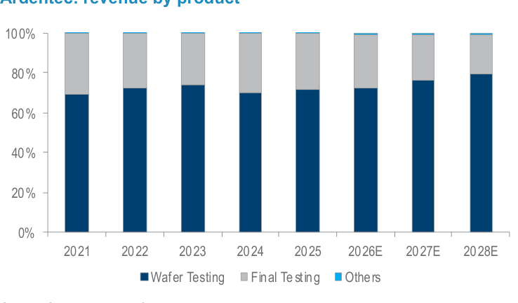

### 解讀摘要
晶圓測試（Wafer Testing）佔比從 2021 年 69% 持續爬升至 2028E 的 79%，絕對金額從 TWD8.3bn 增至 TWD27.3bn（3.3x）。最終測試（Final Testing）的佔比因為分母成長比自己快而稀釋，但金額仍從 TWD3.6bn 增至 TWD6.9bn；欣銓不是犧牲 Final Testing，而是 Wafer Testing 的增速遠快於 Final Testing。這告訴投資人：欣銓的成長故事幾乎純粹是晶圓測試（ASIC/HPC 的測試時間密集型業務），不受 Final Testing 產能制約。

### 表格

| 年度 | 晶圓測試（TWDm） | 最終測試（TWDm） | 其他（TWDm） | 合計（TWDm） | 晶圓測試佔比 |
|---|---|---|---|---|---|
| 2021 | 8,253 | 3,614 | 60 | 11,926 | 69% |
| 2022 | 10,555 | 3,871 | 72 | 14,499 | 73% |
| 2023 | 10,371 | 3,625 | 56 | 14,052 | 74% |
| 2024 | 9,157 | 3,878 | 66 | 13,101 | 70% |
| 2025 | 10,030 | 3,956 | 42 | 14,028 | 71% |
| 2026E | 14,047 | 5,331 | 125 | 19,503 | 72% |
| 2027E | 20,468 | 6,157 | 192 | 26,817 | 76% |
| 2028E | 27,271 | 6,898 | 223 | 34,392 | 79% |

> **洞察一**：晶圓測試 2025→2028E 增量 TWD17.2bn，Final Testing 增量僅 TWD2.9bn——整個投資論點的 86% 來自晶圓測試這一條線，而這正是 AI ASIC 時薪溢價最直接的受益者。

---

## Exhibit 2｜Ardentec: Revenue by Application（2021–2025）

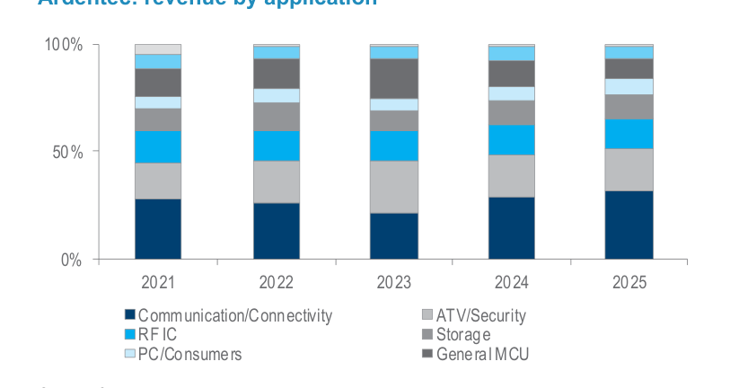

### 解讀摘要
通訊/連網（Communication/Connectivity）一直是最大應用約 25-35%，RF IC 佔 30%+，PC/消費約 10-15%。這份應用分布圖說明了「外溢效應」的結構基礎：欣銓的主力客戶是 MediaTek（RF IC/AP）、Marvell（通訊）等 Fabless，這些公司的 AP/RF 訂單量龐大但測試複雜度低於 AI ASIC——當 KYEC 等競爭對手拒絕低毛利訂單轉向 AI GPU，這些單自然流向欣銓的既有設備線。

### 表格

| 應用類別 | 2021 | 2022 | 2023 | 2024 | 2025 |
|---|---|---|---|---|---|
| Communication/Connectivity | ~28% | ~25% | ~20% | ~35% | ~36% |
| RF IC | ~30% | ~30% | ~35% | ~25% | ~30% |
| PC/Consumers | ~15% | ~10% | ~10% | ~10% | ~10% |
| ATV/Security | ~15% | ~18% | ~15% | ~15% | ~10% |
| Storage | ~8% | ~10% | ~15% | ~10% | ~8% |
| General MCU | ~4% | ~7% | ~5% | ~5% | ~6% |

> **洞察二**：欣銓的通訊/RF 客戶群（MediaTek、Marvell、TI、Infineon、NXP）既是外溢訂單的來源，也是 AI ASIC 測試訂單的潛在共同技術基礎（相同的 SoC 封裝設計流程）——二者並非互斥而是相互強化。

---

## Exhibit 3｜Ardentec: Capacity Expansion（測試設備數量）

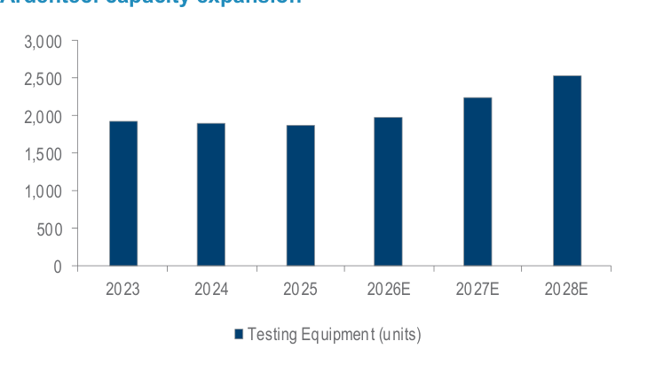

### 解讀摘要
測試設備數量 2023-25 幾乎持平（約 1,900 台），2026E 才開始隨龍潭新廠逐步增至 2028E 的 2,523 台（+34%）。這說明 Daiwa 的 2025-26 業績改善**並非主要靠新設備**，而是靠舊設備 UTR 提升（訂單外溢 + ASIC 測試時間拉長）。新設備真正出力要等 2027-28E 龍潭後半段開層。

### 表格

| 年度 | 測試設備數量（台） | YoY 增量 |
|---|---|---|
| 2023 | 1,921 | — |
| 2024 | 1,894 | -27 |
| 2025 | 1,879 | -15 |
| 2026E | 1,989 | +110 |
| 2027E | 2,245 | +256 |
| 2028E | 2,523 | +278 |

---

## Exhibit 4｜Ardentec: 龍潭廠收入貢獻（TWDm）

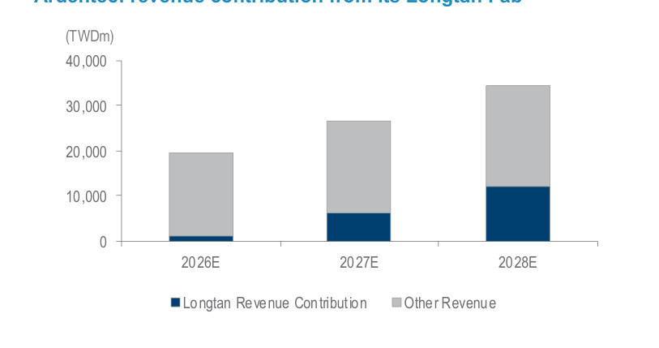

### 解讀摘要
龍潭廠收入貢獻從 2026E ~TWD1,000m（約 5%）急升至 2028E 約 TWD12,500m（約 36%）。這個成長軌跡反映 7 層廠的「每季一層」爬坡節奏：2026 年主要是前 2-3 層投入，2027 年加入 4-5 層，2028 年完整 7 層運轉。每層每季貢獻 TWD450m+ 的假設若成立，7 層全開後年化貢獻可達 TWD12,600m+，高度匹配 Daiwa 的 TWD12,500m 估算。

### 表格

| 年度 | 龍潭貢獻（TWDm） | 其他收入（TWDm） | 合計（TWDm） | 龍潭佔比 |
|---|---|---|---|---|
| 2026E | ~1,000 | ~18,500 | ~19,503 | ~5% |
| 2027E | ~6,000 | ~20,817 | ~26,817 | ~22% |
| 2028E | ~12,500 | ~21,892 | ~34,392 | ~36% |

> **值得驗證**：「每層 TWD450m+/季」是整個 Longtan 論點的單一最大假設。若 ASIC 客戶資格認證（QA）拖延或樓層裝修延遲，2027-28E 收入將大幅下修。Daiwa 的 +14.9% 高共識差距有一半以上源自這個假設。

---

## Exhibit 5｜Ardentec: Historical UTR and Gross Margin（2019–2028E）

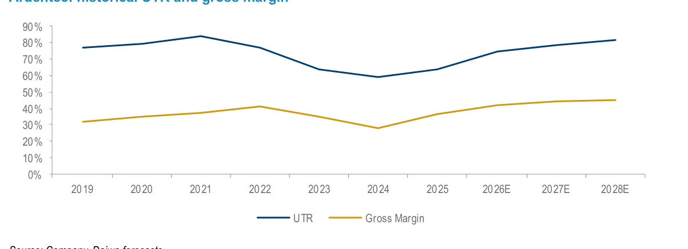

### 解讀摘要
UTR（設備使用率）與毛利率的強相關性清晰：2021-22 UTR 高峰 84-77% 對應 GM 38-43%；2023-24 UTR 跌至 64-59% 對應 GM 34-29%；現在進入新上行循環，UTR 2025=63% → 2026E=75% → 2028E=82%，帶動 GM 2025=36% → 2028E=45%。關鍵在固定成本占 COGS 的 40-45%——這意味每個 UTR 點的提升對 GM 的邊際貢獻非常大（類似晶圓廠的槓桿機制）。

### 表格

| 年度 | UTR（%） | 毛利率（%） |
|---|---|---|
| 2019 | 78 | 33 |
| 2020 | 80 | 35 |
| 2021 | 84 | 38 |
| 2022 | 77 | 43 |
| 2023 | 64 | 34 |
| 2024 | 59 | 29 |
| 2025 | 63 | 36 |
| 2026E | 75 | 42 |
| 2027E | 79 | 45 |
| 2028E | 82 | 46 |

> **洞察三**：2022 的特殊案例（UTR 77% 但 GM 43%，高於 UTR 84% 的 2021 年 GM 38%）說明 ASP 混合效果也很重要——2022 年通訊/RF 客戶的高單價測試拉高了整體 blended hourly rate，這正是 2026-28E AI ASIC 時薪溢價論點的歷史先例。

---

## Exhibit 6｜欣銓 CPO 能力對照表（Ardentec vs Fabrinet）

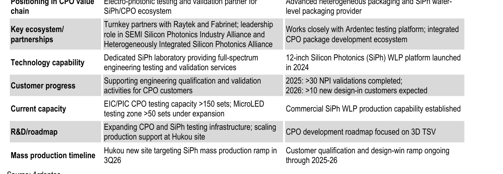

### 解讀摘要
這張表呈現欣銓（中間欄）與 Fabrinet（右欄）在 CPO 生態系的定位分工：欣銓是 SiPh/EIC/PIC 的電光測試和驗證中心，Fabrinet 是 SiPh WLP（晶圓級封裝）的製造夥伴。兩者是互補關係——欣銓測試確保良率，Fabrinet 封裝生產出貨。EIC/PIC CPO 測試容量已超過 150 套，龜山新廠 3Q26 目標量產 SiPh，2026 年已完成 >30 個 NPI 驗證。即使 CPO 2026-27E 貢獻 <5%，這套能力基礎建設的成本已近尾聲，後續任何 CPO 規模放量都是純增量利潤。

### 表格

| 維度 | 欣銓 (Ardentec) | Fabrinet |
|---|---|---|
| CPO 定位 | 電光測試與驗證夥伴 | 先進異質封裝 + SiPh WLP 製造商 |
| 生態系夥伴 | Raytek + Fabrinet；SEMI SiPh 聯盟理事 | 配合欣銓測試平台；CPO 封裝開發生態 |
| 技術能力 | SiPh 全方位測試實驗室 | 12吋 SiPh WLP 平台（2024啟動） |
| 客戶進度 | 支援 CPO 客戶工程認證與驗證 | 2025: >30 NPI完成；2026: >10 新 design-in |
| 現有產能 | EIC/PIC CPO >150 套；MicroLED 測試區 >50 套 | SiPh WLP 商業量產能力已建立 |
| R&D 路線圖 | 龜山新廠持續擴建 CPO + SiPh 基礎設施 | CPO 路線圖聚焦 3D TSV |
| 量產時程 | 龜山新廠 3Q26 目標 SiPh 量產爬坡 | 客戶資格認證與 design-win 爬坡 2025-26 |

---

## Exhibit 8｜Ardentec: CPO Landscape Flow Diagram

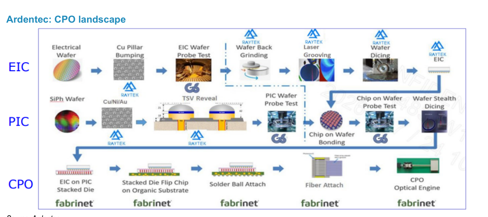

### 解讀摘要
這張流程圖呈現 CPO 製造的完整供應鏈分工：EIC 路線（上方）從電性晶圓探針測試 → Cu Pillar Bump → EIC 晶圓探針測試 → 晶背研磨 → 雷射開槽 → 晶圓切割，多個步驟由 Raytek 承包；PIC 路線（中間）則從 SiPh 晶圓 → Cu/Ni/Au → TSV Reveal → PIC 晶圓探針測試 → 晶片上測試 → 晶圓切割，部分步驟由 GS（光焱科技，7728）承包；CPO 最終封裝（下方）由 fabrinet 貫穿所有步驟。欣銓作為 EIC 晶圓探針測試的核心，加上 PIC 路線的晶片上測試，是整個 CPO 供應鏈中最不可或缺的測試節點。

> **原文補充**：這套電光測試流程緊密對接 TSMC COUPE（compact universal photonic engine）平台，TSMC 是 CPO 生態系的制定者，與 TSMC 技術路線綁定等同在生態系中拿到早期門票。

---

## Exhibit 9｜Global: OSAT Market Size and Growth（2023–2029E）

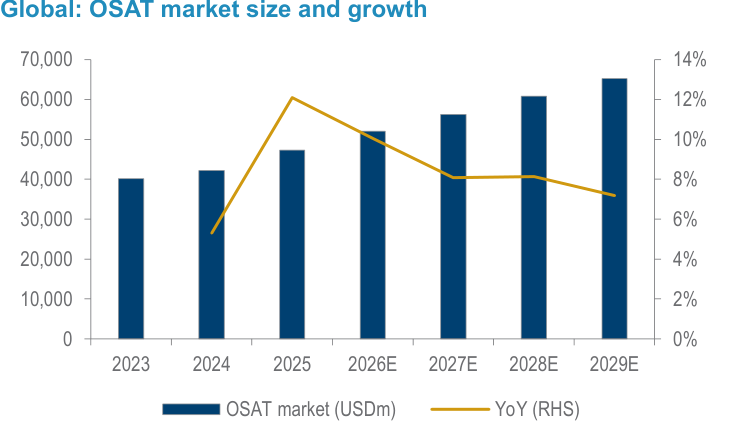

### 解讀摘要
全球 OSAT 市場規模 2023=USD40bn，2025=USD47bn，2029E=USD65bn。YoY 增速在 2025 達到約 12% 的近期高峰（由 AI 伺服器採購週期拉動），之後趨緩至 7-8% 穩定增長。這說明 OSAT 的市場擴張是結構性的（AI 驅動），而非單純週期反彈——對欣銓的估值而言，可以用更長期的成長率計算 terminal value。

### 表格

| 年度 | OSAT 市場規模（USDm） | YoY（%） |
|---|---|---|
| 2023 | ~40,000 | — |
| 2024 | ~42,000 | ~5% |
| 2025 | ~47,000 | ~12% |
| 2026E | ~51,000 | ~8% |
| 2027E | ~56,000 | ~8% |
| 2028E | ~61,000 | ~8% |
| 2029E | ~65,000 | ~7% |

---

## Exhibit 10｜Global: OSAT Market Share

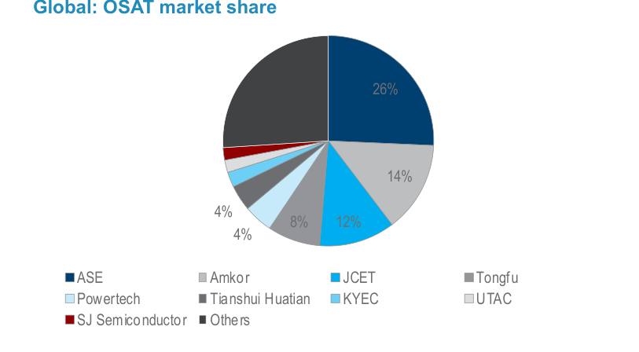

### 解讀摘要
ASE 以 26% 市占一枝獨秀；Amkor 14%、JCET 12%、Tongfu 8%。欣銓未出現在前幾名（因為它是純測試廠，規模無法與封測整合廠競爭）。重要的市場結構洞察是：頭部 OSAT（ASE、Amkor）整合封裝+測試兩條線，而欣銓作為純測試廠是市場的補充而非正面競爭者——欣銓更精確的市場定位是在「獨立晶圓測試」這個更窄的細分市場，對應的市場份額遠高於 OSAT 整體。

---

## Exhibit 11｜Global OSAT Revenue Growth（Major TW Players）

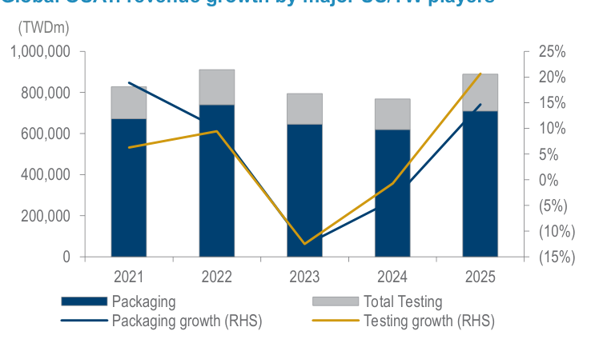

### 解讀摘要
主要台灣 OSAT 業者（含韓廠）2021-25 年整體封裝+測試總收入走勢：2022 為高峰約 TWD900bn，2023-24 明顯回落（PC/消費電子砍單），2025 開始V型反彈。關鍵是右側 Y 軸的測試成長率（黃線）在 2025 飆升至 20%+，顯著領先封裝成長（藍線）——這印證了「AI ASIC 測試時間比封裝成長快」的論點，也是欣銓純測試廠定位溢價的市場基礎。

---

## Exhibit 12｜Global OSAT Revenue Breakdown（Major Players by Business Mix）

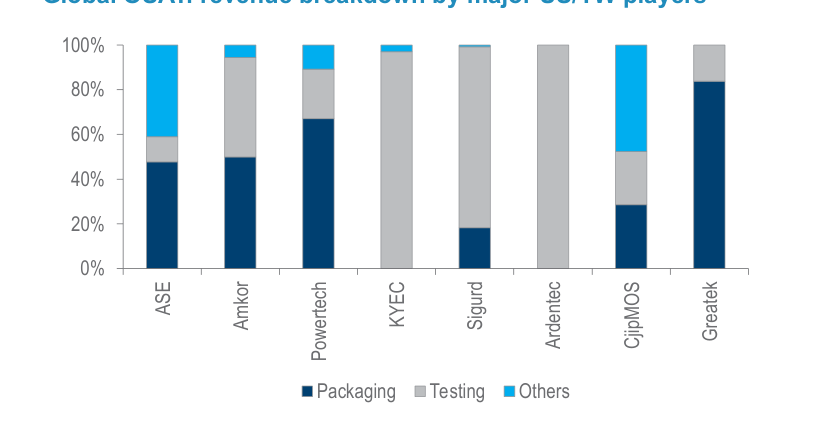

### 解讀摘要
欣銓是圖中唯一接近 100% 純測試的業者（灰色柱幾乎滿格），其他主要業者（ASE、Amkor、Powertech、KYEC）都有 25-65% 的封裝業務。這張圖直接支持「同業訂單外溢」論點：當 KYEC 把封裝+測試產能優先分配給 AI GPU，傳統測試需求只能外包給欣銓——欣銓的純測試定位讓它成為接收這些訂單的天然目標。

> **洞察四（配合 Exhibit 11）**：測試成長 2025 飆升至 20%+，加上欣銓是純測試廠，幾乎保證欣銓 2025-26 的成長率高於 OSAT 整體市場。這是「結構性外溢」而非偶發事件的市場結構性支撐。

---

## Exhibit 13｜Global OSAT: Capex Intensity（%）

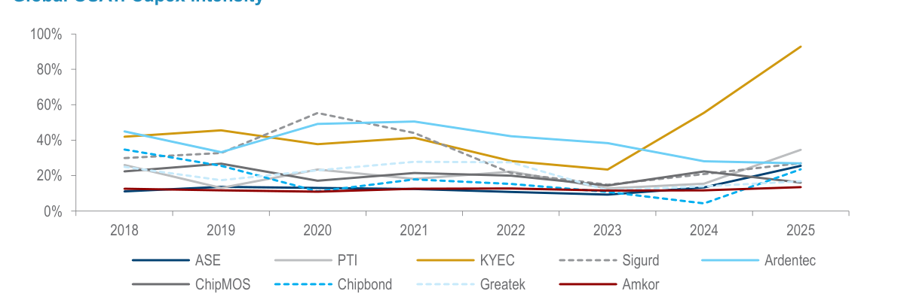

### 解讀摘要
KYEC（黃線）2025 capex intensity 飆升至 95%，是各家之冠，反映其全力押注 AI GPU 測試的擴產。欣銓（青線）歷年 capex intensity 在 20-50% 相對平穩——但 Daiwa 預測 2026-27E 會升至 75-70%（對應龍潭建設高峰），2028E 後隨龍潭完工大幅降至 21%。KYEC 的重砲擴產意味著 2027-28E 後 AI GPU 測試產能競爭將加劇，但欣銓的 ASIC 客戶與 KYEC 的 GPU 客戶群重疊度有限。

---

## Exhibit 15｜Ardentec: Gross Profit and Gross Margin Trend

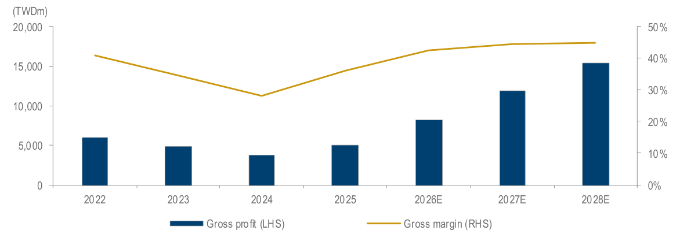

### 解讀摘要
毛利潤從 2024 的 TWD3.7bn 谷底快速彈升至 2028E 的 TWD15.5bn（4.2x），同期 GM 從 28% 升至 46%。整個過程中 GM 擴張的速度比毛利潤的倍數增長更誇張——這正是固定成本槓桿的體現：分子（毛利潤）隨收入等比增長，而分母（COGS）中有 40-45% 是固定成本，不隨收入等比增長。

### 表格

| 年度 | 毛利潤（TWDm） | 毛利率（%） |
|---|---|---|
| 2022 | ~5,920 | ~41% |
| 2023 | ~4,875 | ~35% |
| 2024 | ~3,675 | ~28% |
| 2025 | 5,091 | 36% |
| 2026E | 8,252 | 42% |
| 2027E | 11,940 | 45% |
| 2028E | 15,473 | 45% |

---

## Exhibit 16｜Ardentec: Operating Profit and Operating Margin Trend

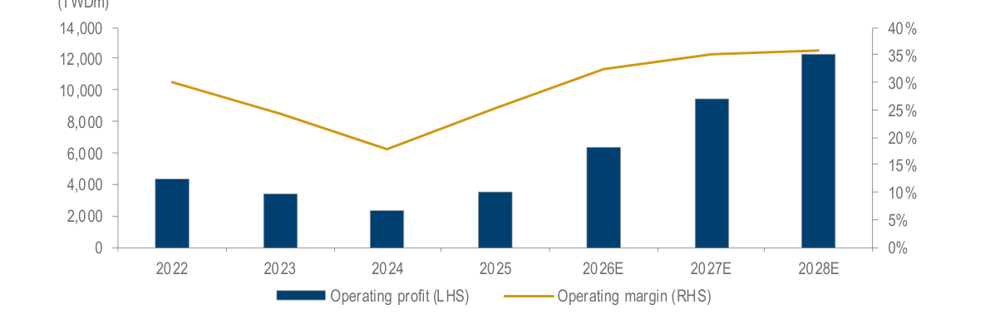

### 解讀摘要
營業利益從 2024 谷底 TWD2.4bn 恢復至 2028E 的 TWD12.4bn（5.2x）；OPM 從 18% 升至 36%。相較 GM 擴張（28%→45%，+17ppt），OPM 擴張（18%→36%，+18ppt）幅度幾乎相同——意味 SG&A 佔比幾乎沒有正向槓桿（Daiwa 估 OpEx 維持在銷售額的 9-10%，與收入同步增長），這是相對保守的假設。

### 表格

| 年度 | 營業利益（TWDm） | 營業利益率（%） |
|---|---|---|
| 2022 | 4,353 | ~30% |
| 2023 | 3,405 | ~24% |
| 2024 | 2,354 | ~18% |
| 2025 | 3,565 | 25% |
| 2026E | 6,317 | 32% |
| 2027E | 9,453 | 35% |
| 2028E | 12,350 | 36% |

---

## Exhibit 17｜Ardentec: Capex Intensity（%）

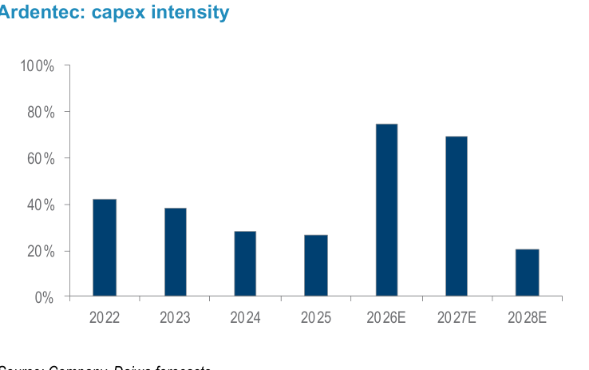

### 解讀摘要
欣銓 capex intensity 在 2026-27E 急升至 75-70%（龍潭建設高峰），是 2024-25 年 28-29% 的 2.5x。這說明 2026-27 年的 FCF 將明顯受壓（高 capex + 折舊尚未充分開始），真正的 FCF 轉佳要等 2028E 龍潭完工、capex intensity 大降至 21%。這是一個典型的「建設期 → 收穫期」週期，投資人需要有 2-3 年視野。

### 表格

| 年度 | Capex Intensity（%） |
|---|---|
| 2022 | 43% |
| 2023 | 39% |
| 2024 | 29% |
| 2025 | 28% |
| 2026E | 75% |
| 2027E | 70% |
| 2028E | 21% |

> **洞察五（配合 Exhibit 4）**：2026-27E capex 高峰與 Longtan 貢獻快速成長同期發生，股價在這段期間將同時反映「FCF 受壓」（bearish）與「Longtan 爬坡超預期」（bullish）兩個相反力量——催化劑的時程確認（每層開層里程碑）將主導股價。

---

## Exhibit 18｜Ardentec: ROE Trend（2022–2028E）

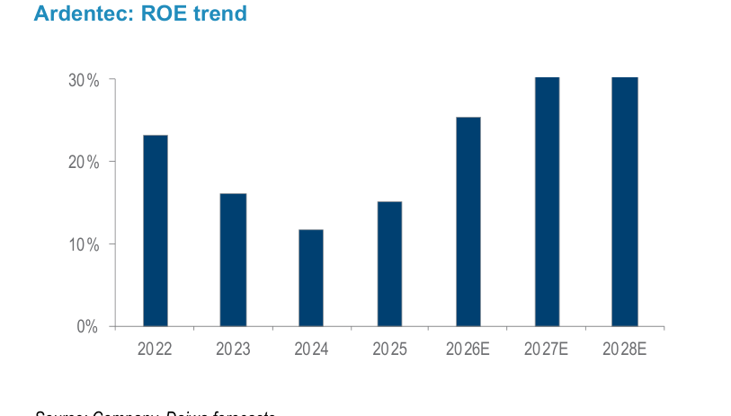

### 解讀摘要
ROE 從 2024 谷底 12% 恢復至 2028E 的 30%，且 2027-28E 的 30% 超越了 2022 年的歷史高峰（23%）。Daiwa 以此作為估值切入點：ROE 超越歷史高峰，且靠的是結構性改善（而非週期），支持估值站上歷史高端（25x P/E 在 10-25x 歷史區間的上緣）。

### 表格

| 年度 | ROE（%） |
|---|---|
| 2022 | 23% |
| 2023 | 16% |
| 2024 | 12% |
| 2025 | 15% |
| 2026E | 26% |
| 2027E | 30% |
| 2028E | 30% |

---

## Exhibit 21｜Company Introduction & Shareholder Structure

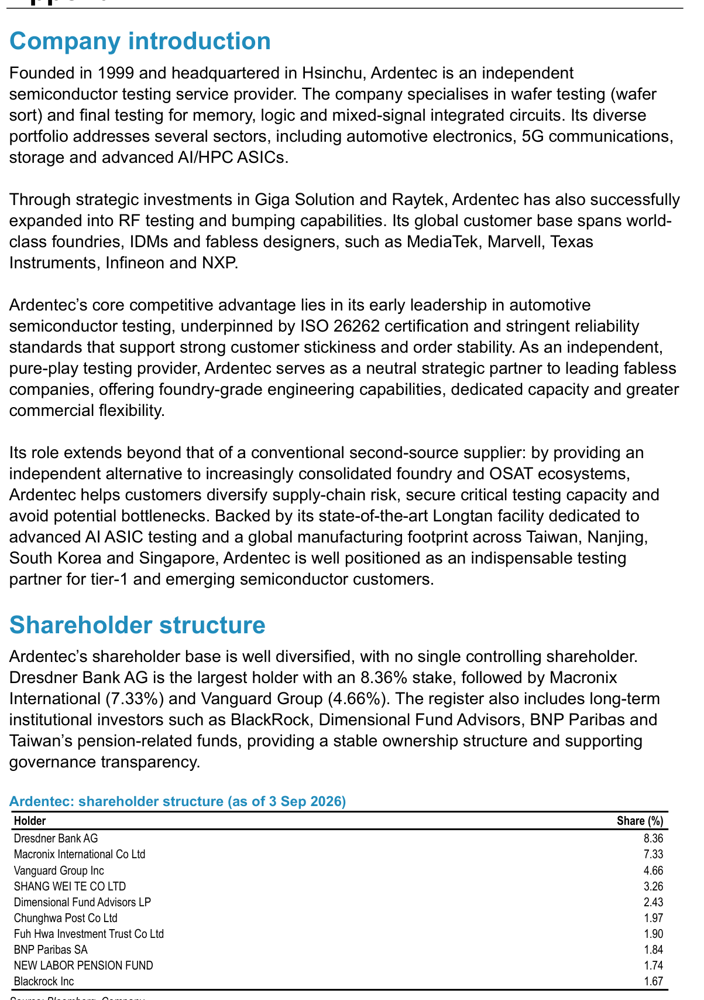

### 解讀摘要
欣銓 1999 年成立，核心競爭力在汽車 IC 測試（ISO 26262 認證）形成的高客戶黏性與訂單穩定性。股權分散，無控股大股東：Dresdner Bank AG 8.36%、Macronix International 7.33%、Vanguard Group 4.66%、BlackRock 1.67%。分散的股東結構意味無大股東賣壓風險，但也沒有策略性大股東背書（vs. 有大型 IC 設計公司持股的測試廠）。Macronix 持股 7.33% 是個微妙細節——Macronix 是 NOR Flash 廠，與欣銓有業務往來，可能反映雙方的策略關係。

---

## Exhibit 22｜ESG Governance Assessment

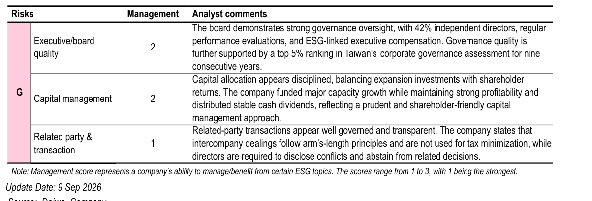

### 解讀摘要
Daiwa ESG 評估：42% 獨立董事，連續 9 年台灣公司治理評鑑前 5%。資本配置評分 2（1=最強）：在大規模擴產的同時維持穩定現金股利。相關人交易評分 1（最強）：遵循公平市價原則，不用於稅務規劃。治理透明度高，對外資法人持倉比例高的股票而言是正面訊號。

---

## 相關個股清單

| 類別 | 公司 | Ticker | 評等 | 備註 |
|---|---|---|---|---|
| 主角 | 欣銓 | 3264 TT | Buy (1), TP TWD340 | 純晶圓測試廠；龍潭 7 層廠爬坡中 |
| 策略夥伴 | Raytek 台灣雷科 | 7873 TT | NR | 欣銓持股 25%；CPO EIC 測試流程合作 |
| 策略夥伴 | Fabrinet | FN US | NR | SiPh WLP 封裝夥伴；CPO 測試生態 |
| CPO 檢測 | 光焱科技 | 7728 TT | NC | CPO PIC 晶圓測試（NightJar 系統）；GS booth visit |
| 同業對比 | KYEC 京元電子 | 2449 TT | — | AI GPU 測試為主；capex intensity 95%；訂單外溢來源 |
| 母廠聯動 | Giga-Solution | — | — | 欣銓子公司；整合 CPO 測試解決方案 |
