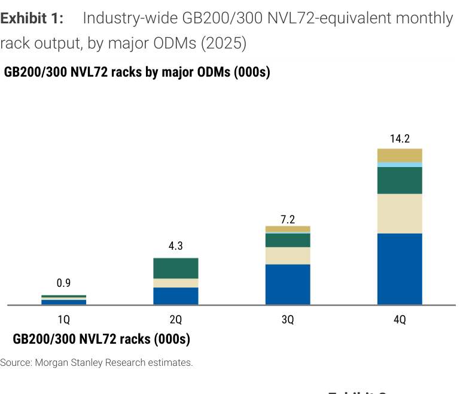
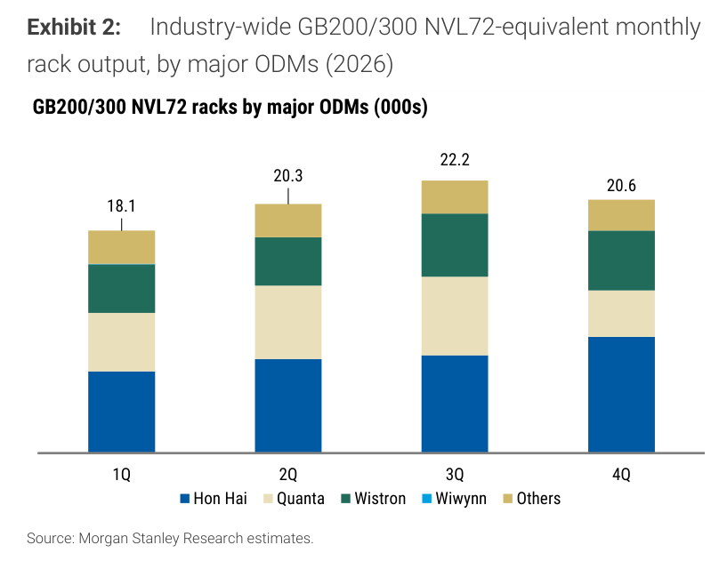
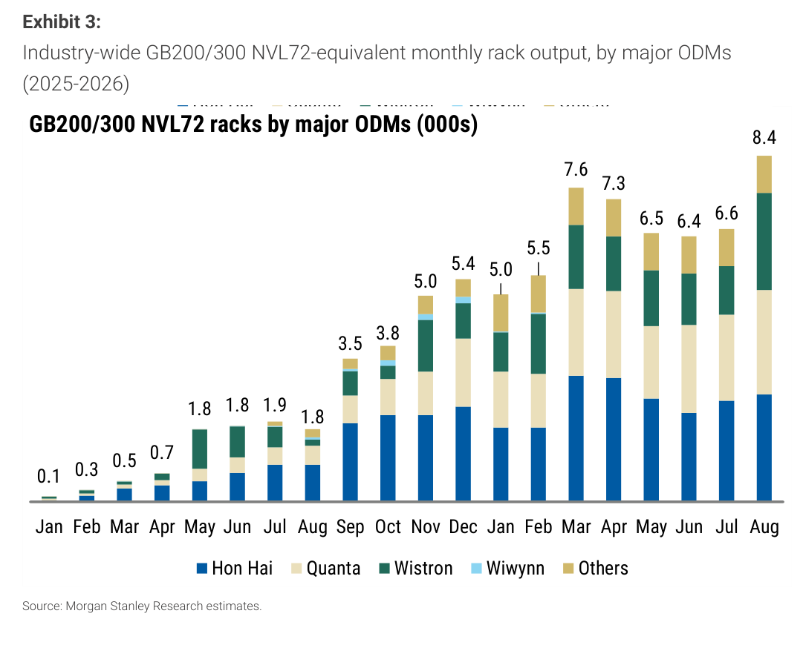
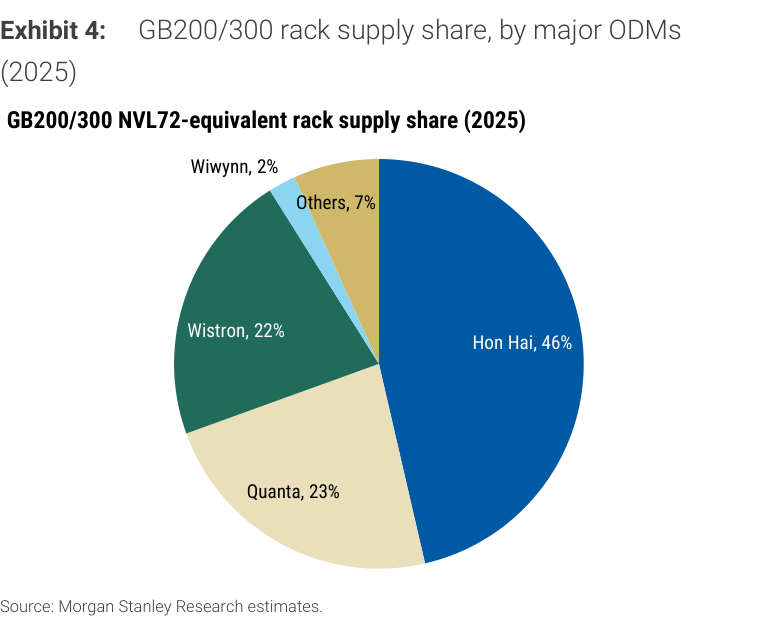
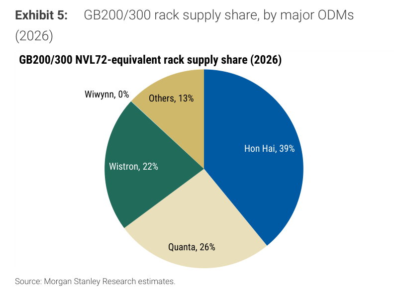

# Morgan Stanley｜GB200/GB300 NVL72 機架 8 月出貨 — 行業月產量 8.4K 創新高，全年展望 80-85K

**券商**：Morgan Stanley  
**分析師**：Howard Kao、Irene Yen、Andy Meng, CFA  
**日期**：2026-09-09  
**主題**：GB200/GB300 NVL72 機架月度出貨追蹤（廣達 2382、緯創 3231、鴻海 2317）  
**評級**：Industry In-Line  
<a href="https://layx.uk/dl?g=產業&b=MS&d=20260909&h=GB200-GB300-NVL72-Racks">📎 下載 PDF</a>

---

## 報告總結

Morgan Stanley 月度機架追蹤顯示，2026 年 8 月 GB200/GB300 NVL72-equivalent 行業總產量約 8.4K（+27% MoM），創 2025-2026 月度新高。廣達 Jul+Aug 累計 ~4.6K 已達 MS 3Q26E 6.4K 的 72%，緯創同期收入達 MS 3Q26E 的 74%，雙雙隱含 3Q 業績上行風險；鴻海全年預測維持不變（~31.7K 機架）。MS 上調全年產業展望至 80-85K 機架（>100% YoY，對比 2025 年 26.6K），ODM 偏好排序為 **Wistron > Hon Hai > Quanta**（依距目標價上行空間）。

---

## Morgan Stanley 完整投資邏輯鏈

| 論點層次 | Exhibit | 內容 |
|---|---|---|
| 月量創高確認動能 | Exhibit 3 | 8 月 8.4K racks（+27% MoM），為 20 個月追蹤期最高月產 |
| 全年量級三倍跳升 | Exhibit 1/2 | 2025 全年 26.6K → 2026E 81.2K（+205% YoY），前三季動能均等 |
| 3Q 進度超前 | 正文 | 廣達 Jul+Aug = 3Q MSe 72%；緯創 Jul+Aug 收入 = 3Q MSe 74% |
| 份額結構重配 | Exhibit 4/5 | 鴻海 46%→39%（-7ppt），Others 7%→13%（+6ppt），廣達 +3ppt |
| **偏好排序** | 報告封面 | **Wistron > Hon Hai > Quanta（依距目標價上行空間）** |

---

## 報告核心觀點

| 主題 | MS 觀點 | 市場共識 | 是否 Contra-Consensus |
|---|---|---|---|
| CY26 全年機架 | 80-85K（>100% YoY） | 廣達 Jul+Aug 已達共識 3Q 估計 71%，暗示共識偏保守 | ✅ 共識低估全年量 |
| 緯創 3Q 業績 | 月收入強勁，74% of MSe 達成，隱含上行 | 共識 3Q 達成度略保守 | ✅ 緯創 8 月 +49% MoM 超預期 |
| 鴻海份額 | 全年份額 39%（2025 年 46%），量仍 YoY +160% | 份額讓出易被誤讀為業績轉差 | ✅ 份額下降是競爭擴散，非量縮 |

**偏好排序**：Wistron（3231）> Hon Hai（2317）> Quanta（2382）

---

## Exhibit 1｜2025 年各季機架產量（依 ODM）

### 解讀摘要

2025 年全年 GB200/GB300 機架產量呈現陡峭 S 型成長，4Q 單季 14.2K 等於前三季合計 12.4K 的 114%——成長動能高度集中在年末，代表 Blackwell 供應鏈在 4Q25 才真正進入量產爬坡。1Q→2Q 跳升 +378% 是量產啟動的一次性跳躍，不反映後期線性成長斜率；3Q→4Q 再度加速 +97%，顯示爬坡曲線呈指數型而非線性。

### 表格

| 季度 | 機架產量（千架） | QoQ 增量 | QoQ 增幅 |
|---|---|---|---|
| 1Q 2025 | 0.9 | — | — |
| 2Q 2025 | 4.3 | +3.4 | +378% |
| 3Q 2025 | 7.2 | +2.9 | +67% |
| 4Q 2025 | 14.2 | +7.0 | +97% |
| **2025 全年** | **26.6** | — | — |

> **洞察一**：4Q25 14.2K 成為 2026 年的基準起跳點，而 2026 年 1Q 預測 18.1K（+27% QoQ）代表爬坡曲線在跨年後仍維持正向斜率，並未在高基期後走平。

---

## Exhibit 2｜2026 年各季機架產量預測（依 ODM）

### 解讀摘要

2026 年全年 MS 預測四季合計 81.2K（1Q=18.1K、2Q=20.3K、3Q=22.2K、4Q=20.6K），形態呈「前高後略降」——3Q 達峰後 4Q 小降。這與 2025 年的「後重前輕」形成對比，意味著 2026 年全年業績能見度更高，ODM 的 3Q/4Q 業績差距不會像 2025 年那麼懸殊。截至 8 月末，3Q26 已有 Jul+Aug 兩個月數據（合計約 15.0K），達成 3Q26E 22.2K 的 67.6%。

### 表格

| 季度 | 機架預測（千架） | QoQ 增量 | YoY（vs 2025） |
|---|---|---|---|
| 1Q 2026E | 18.1 | — | +1,911%（vs 0.9） |
| 2Q 2026E | 20.3 | +2.2 | +372%（vs 4.3） |
| 3Q 2026E | 22.2 | +1.9 | +208%（vs 7.2） |
| 4Q 2026E | 20.6 | -1.6 | +45%（vs 14.2） |
| **2026E 全年** | **81.2** | — | **+205%（vs 26.6）** |

> **洞察一**：4Q26E YoY 降至 +45%（vs 前三季 200%-1900%），主因 4Q25 基期已高（14.2K）。4Q26 的 20.6K 絕對量仍創 2026 年各季最低，代表季節性有所回調——關注 GB300 新平台是否有提前出貨效應影響 4Q。

---

## Exhibit 3｜月度機架產量時序（2025 年 1 月 — 2026 年 8 月）

### 解讀摘要

20 個月完整月度時序揭示兩個結構：（1）2025 年是單調向上的爬坡，無任何月份下滑；（2）2026 年出現 May-Jun 低谷（6.5K/6.4K），之後 Jul 小幅反彈（6.6K），Aug 大跳至 8.4K 創新高。低谷期間恰逢 2Q 季末，可能是客戶驗收節奏或組裝測試 queue 的周期性波動。8 月的大幅反彈（+1.8K）確認低谷已過，進入新的月度高點平台。

> **原文補充**：MS 特別說明，Wistron 的數字包含「computing tray（L10）rack equivalent」，並未計入完整機架組裝與測試時間（L11），故實際交付終端客戶的機架數量可能低於 Wistron 的回報數字。

### 表格

| 月份 | 總產量（千架） | MoM |
|---|---|---|
| 2025-01 | 0.1 | — |
| 2025-02 | 0.3 | +0.2 |
| 2025-03 | 0.5 | +0.2 |
| 2025-04 | 0.7 | +0.2 |
| 2025-05 | 1.8 | +1.1 |
| 2025-06 | 1.8 | 0 |
| 2025-07 | 1.9 | +0.1 |
| 2025-08 | 1.8 | -0.1 |
| 2025-09 | 3.5 | +1.7 |
| 2025-10 | 3.8 | +0.3 |
| 2025-11 | 5.0 | +1.2 |
| 2025-12 | 5.4 | +0.4 |
| 2026-01 | 5.0 | -0.4 |
| 2026-02 | 5.5 | +0.5 |
| 2026-03 | 7.6 | +2.1 |
| 2026-04 | 7.3 | -0.3 |
| 2026-05 | 6.5 | -0.8 |
| 2026-06 | 6.4 | -0.1 |
| 2026-07 | 6.6 | +0.2 |
| **2026-08** | **8.4** | **+1.8** |

> **洞察一**：2026 年 1-8 月累計約 53.3K，距全年 MSe 81.2K 尚餘 27.9K，須 9-11 月（3 個月）平均出貨 9.3K/月——高於 8 月的 8.4K；但若 Sep 沿 8 月動能維持 8-9K，月均門檻可達。

---

## Exhibit 4｜2025 年各 ODM 機架供應份額

### 解讀摘要

2025 年鴻海以 46% 主導 GB200/GB300 機架組裝市場，廣達（23%）與緯創（22%）緊隨其後且份額相近，威聯通（Wiwynn）佔 2%，其他廠商 7%。鴻海的主導地位來自其在 Nvidia 高端伺服器組裝的長期資本投入與優先分配地位。

### 表格

| ODM | 2025 年供應份額 |
|---|---|
| 鴻海 Hon Hai（2317） | 46% |
| 廣達 Quanta（2382） | 23% |
| 緯創 Wistron（3231） | 22% |
| 威聯通 Wiwynn（6669） | 2% |
| Others | 7% |

---

## Exhibit 5｜2026 年各 ODM 機架供應份額預測

### 解讀摘要

2026 年鴻海份額預計降至 39%（-7ppt），廣達升至 26%（+3ppt），緯創維持 22%，威聯通歸零，Others 大幅升至 13%（+6ppt）。份額重分配並非鴻海量縮，而是整體市場大幅擴張後，新進入者和第二梯隊廠商取得更多配額的結果——鴻海全年絕對量 ~31.7K 仍是最大單一供應商，且 YoY +160%。

### 表格

| ODM | 2025 年份額 | 2026E 份額 | 變化 |
|---|---|---|---|
| 鴻海 Hon Hai | 46% | 39% | -7ppt |
| 廣達 Quanta | 23% | 26% | +3ppt |
| 緯創 Wistron | 22% | 22% | 0ppt |
| 威聯通 Wiwynn | 2% | 0% | -2ppt |
| Others | 7% | 13% | +6ppt |

> **洞察一（配合 Exhibit 2）**：以 81.2K 全年總量換算各 ODM 絕對量：鴻海 31.7K、廣達 21.1K、緯創 17.9K。廣達 MS 正文確認全年預測 ~18.7K（低於份額倒推 21.1K），暗示廣達若份額維持 26% 且產業量達 81K+，廣達有最大上修空間。

> **洞察二**：威聯通（Wiwynn）份額 2%→0% 不代表業務萎縮——正文揭示緯創 8 月收入中 Wiwynn 貢獻 ~NT\$144.3B（+23% MoM/+50% YoY），Wiwynn 業務可能已統計入緯創或 Others，而非實際退出市場。

---

## 跨 Exhibit 彙整表

### 彙整 1｜2026E 各 ODM 機架量估算

來源：Exhibit 2（全年 81.2K）× Exhibit 5（2026E 份額）對比 MS 正文確認數字

| ODM | 份額倒推（千架） | MS 正文確認（千架） | 差異 |
|---|---|---|---|
| 鴻海 Hon Hai | 31.7 | 31.7 | 一致 |
| 廣達 Quanta | 21.1 | 18.7 | +2.4K 潛在上修空間 |
| 緯創 Wistron | 17.9 | 17.9 | 一致 |
| Others | 10.6 | — | — |

> 廣達的份額倒推量（21.1K）高於 MS 正文預測（18.7K），差距 2.4K，對應若廣達市佔比假設向上修正、或全年總量超 81K，廣達的上修幅度最大。

---

## 相關個股清單

| 類別 | 公司 | Ticker | 評等 | 8 月業績 | 關鍵數據 |
|---|---|---|---|---|---|
| 台灣 ODM | 廣達 Quanta | 2382 TT | OW | NT\$424.0B (+16%/+177%) | 2.5-2.55K 機架；Jul+Aug = 3Q MSe 72% |
| 台灣 ODM | 緯創 Wistron | 3231 TT | OW | NT\$460.1B (+49%/+166%) | 2.3-2.4K 機架（L10）；Jul+Aug 收入 = 3Q MSe 74% |
| 台灣 ODM | 鴻海 Hon Hai | 2317 TT | OW | NT\$921.8B (-3%/+52%) | ~2.6K 機架；全年預測維持 31.7K |
| 雲端 ODM | 威聯通 Wiwynn | 6669 TT | OW | NT\$144.3B (+23%/+50%) | 含於緯創月營收中 |
