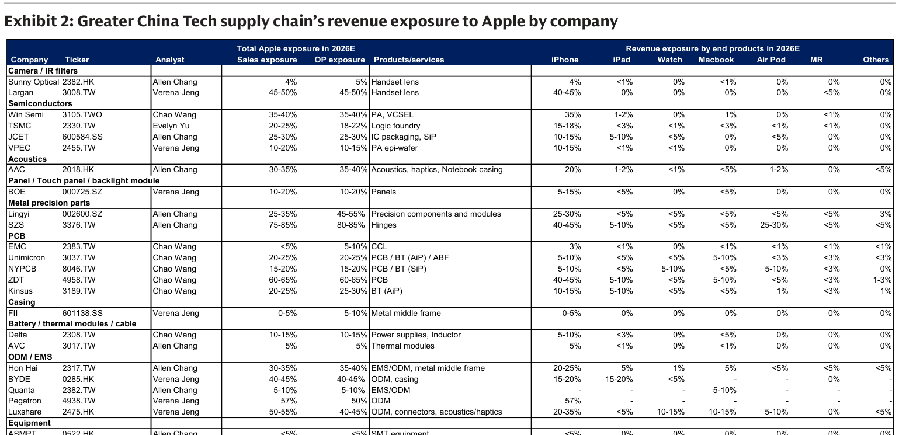
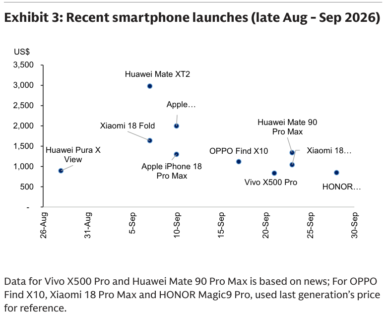
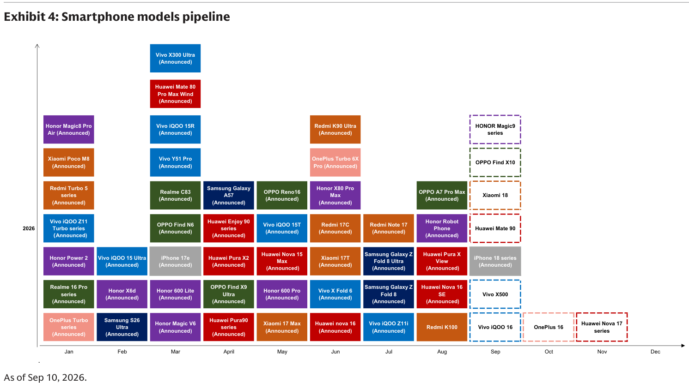

# Goldman Sachs｜GC Tech：摺疊 iPhone（Duo）發布 — 平價切入拓展滲透，供應鏈廣受益

**券商**：Goldman Sachs  
**分析師**：Allen Chang、Verena Jeng、Michael Ng, CFA、Chao Wang、Evelyn Yu、Ting Song、Yifan Hu  
**日期**：2026-09-10  
**主題**：Apple iPhone Duo（首款摺疊 iPhone）及 iPhone 18 系列發布，大中華科技供應鏈影響評估  
**評級**：N/A（個股主題報告）  
<a href="https://layx.uk/dl?g=產業&b=GS&d=20260910&h=GC-Tech-Foldable">📎 下載 PDF</a>

---

## 報告總結

Apple 發布首款摺疊 iPhone「iPhone Duo」，定價 US\$1,999 起（低於 Samsung Galaxy Z Fold8 Ultra 的 US\$2,099.99），主打輕薄（史上最薄 iPhone）與易攜（可單手持握、放口袋）的寬眾定位，支援 Apple Pencil。GS 維持 2026E 出貨量預測：基本情境 1,400 萬台、樂觀情境 3,500 萬台。與此同時，iPhone 18 Pro/Pro Max 導入 A20 Pro 晶片、Next-gen Vapor Chamber 及變光圈鏡頭，售價較 iPhone 17 Pro 系列上調 US\$100（高個位數 %）。GS 推薦廣泛台灣/大中華供應鏈，買進：Hon Hai（CL）、SZS、AVC、Lingyi、Luxshare、VPEC、FII、Largan、NYPCB（CL）、EMC、ZDT、Kinsus、Delta、TSMC。

---

## Goldman Sachs 完整投資邏輯鏈

| 論點層次 | Exhibit | 內容 |
|---|---|---|
| 催化劑：首款摺疊 iPhone 發布 | 正文 | iPhone Duo，5.4/7.6"（folded/unfolded），US\$1,999 起，支援 Apple Pencil |
| 平價策略擴大市場 | 正文 | 低於 Samsung Fold8 Ultra US\$100；Huawei 全球摺疊機 50% 市占（2Q26），blended ASP US\$1,600 |
| 新 content：精密零件全面升級 | 正文 | 鉸鏈 100+ 精密零件（SZS）、under-display 前鏡（Largan）、Next-gen Vapor Chamber（AVC/AAC） |
| iPhone 18 Pro 亦帶動 content 升值 | 正文 | 售價 +US\$100；變光圈（Largan）；A20 Pro 需更強散熱（AVC/AAC） |
| 競品景觀密集 | Exhibit 3/4 | Huawei Mate XT2（~US\$3K）、Samsung Fold8、Xiaomi Fold 等集中 Sep 2026 上市 |
| **結論** | 正文 | **買進供應鏈：Hon Hai (CL)、SZS、AVC、Lingyi、Luxshare、VPEC、FII、Largan、NYPCB (CL)、EMC、ZDT、Kinsus、Delta、TSMC** |

> **報告最大邏輯缺口**：GS 未揭示 iPhone Duo 初期 BOM 內各零件 content 金額，供應商受益幅度須自行估算；摺疊機良率與初期出貨進度亦為主要不確定性。

---

## 報告核心觀點

| 主題 | GS 觀點 | 市場共識 | 是否 Contra-Consensus |
|---|---|---|---|
| Foldable 定價策略 | US\$1,999 平價出擊，低於 Samsung，拓展非 niche 受眾 | 市場曾預期 foldable 定位高端（US\$2,200+） | ✅ 定價比多數預期低，利好滲透率 |
| 2026E 出貨 | 基本情境 14m / 樂觀 35m | 未說明共識，但 14m 為 GS 自身基本情境 | ≈ 維持不變（見 Aug 2024 舊報告） |
| iPhone 18 Pro 漲價 | +US\$100（+高個位數%）vs iPhone 17 Pro | 市場已有部分預期漲價 | ≈ 漲幅符合市場預期範圍 |

**主要受益排序（依 GS 強調程度）**：SZS（鉸鏈，75-85% Apple 收入曝險）> AVC（散熱）、Largan（鏡頭）> Hon Hai (CL)、Luxshare（EMS）

---

## Exhibit 2｜大中華科技供應鏈對 Apple 的收入曝險

### 解讀摘要

此表呈現 32 家大中華科技公司對 Apple 各終端產品的收入曝險（2026E），是評估 iPhone Duo 新機週期中哪些供應商受益最直接的核心參考。SZS（鉸鏈）整體 Apple 收入曝險高達 75-85%（其中 iPhone 40-45%、Watch 25-30%），是曝險比率最高且最集中的供應商。

> **原文補充**：GS 特別點名 iPhone Duo 新 content 最直接受益者：SZS（鉸鏈 100+ 精密零件）、Largan（under-display 前鏡）、AVC（Next-gen Vapor Chamber）；Lingyi 的精密零件模組亦為直接受益商。Pegatron（57% iPhone 曝險）是以 iPhone 最高曝險比率的 ODM，若 foldable 訂單分配至 Pegatron，將是最大驚喜。

### 表格

| 類別 | 公司 | Ticker | 整體 Apple 銷售曝險 | iPhone 曝險 | 主要產品/服務 |
|---|---|---|---|---|---|
| **Camera/IR** | Largan | 3008.TW | 45-50% | 40-45% | 手機鏡頭（含 under-display） |
| **Camera/IR** | Sunny Optical | 2382.HK | 4% | 4% | 手機鏡頭 |
| **半導體** | Win Semi | 3105.TWO | 35-40% | 35% | PA, VCSEL |
| **半導體** | TSMC | 2330.TW | 20-25% | 15-18% | Logic foundry |
| **半導體** | VPEC | 2455.TW | 10-20% | 10-15% | PA epi-wafer |
| **半導體** | JCET | 600584.SS | 25-30% | 10-15% | IC packaging, SiP |
| **Acoustics** | AAC | 2018.HK | 30-35% | 20% | 聲學、觸覺、NB casing |
| **Panel** | BOE | 000725.SZ | 10-20% | 5-15% | 面板 |
| **Metal Precision** | **SZS** | 3376.TW | **75-85%** | 40-45% | **鉸鏈（核心）** |
| **Metal Precision** | Lingyi | 002600.SZ | 25-35% | 25-30% | 精密零件模組 |
| **PCB** | ZDT (Zhen Ding) | 4958.TW | 60-65% | 40-45% | PCB |
| **PCB** | NYPCB | 8046.TW | 15-20% | 5-10% | PCB/BT (SiP) |
| **PCB** | Kinsus | 3189.TW | 20-25% | 10-15% | BT (AiP) |
| **PCB** | Unimicron | 3037.TW | 20-25% | 5-10% | PCB/BT/ABF |
| **PCB** | EMC | 2383.TW | <5% | 3% | CCL |
| **Casing** | FII | 601138.SS | 0-5% | 0-5% | 金屬中框 |
| **散熱/電源** | **AVC** | 3017.TW | 5% | 5% | **Thermal modules（VC）** |
| **散熱/電源** | Delta | 2308.TW | 10-15% | 5-10% | 電源供應器、電感 |
| **ODM/EMS** | Hon Hai | 2317.TW | 30-35% | 20-25% | EMS/ODM + 金屬中框 |
| **ODM/EMS** | Pegatron | 4938.TW | 57% | 57% | ODM |
| **ODM/EMS** | Luxshare | 2475.HK | 50-55% | 20-35% | ODM + 連接器 + 聲學 |
| **ODM/EMS** | BYDE | 0285.HK | 40-45% | 15-20% | ODM + casing |
| **Equipment** | ASMPT | 0522.HK | <5% | <5% | SMT 設備 |

> **洞察一**：SZS 75-85% 的整體 Apple 曝險中，iPhone 40-45% + Watch 25-30% = 65-75%，幾乎等於全部 Apple 業務——iPhone Duo 新鉸鏈設計帶來結構性 content 增加，是報告中唯一由新產品形態直接驅動的 content 提升標的，差異化最高。

> **洞察二**：ZDT（振鼎，4958）Apple 銷售曝險 60-65%，iPhone 40-45%，是 PCB 族群中曝險最高者，加上 foldable 的多層 rigid-flex PCB 需求，受益程度超過 Unimicron（5-10% iPhone 曝險）。

---

## Exhibit 3｜近期智慧型手機發布時程（2026 年 8 月底—9 月）

### 解讀摘要

2026 年 9 月是智慧型手機新品密度最高的時段：Apple iPhone Duo（摺疊）約 US\$2,000、iPhone 18 Pro Max 約 US\$1,300 同時在 9 月 10 日前後發布，面對 Huawei Mate XT2（~US\$3,000）、Xiaomi 18 Fold（~US\$1,650）、Samsung Fold8 系列的競品圍攻。Apple 的 US\$1,999 定價正好落在 Huawei（US\$3,000）以下、Xiaomi（US\$1,650）以上，做出差異化定位。

### 表格

| 機型 | 品牌 | 發布日期 | 價格（US\$） | 備註 |
|---|---|---|---|---|
| Huawei Pura X View | Huawei | 26-Aug | ~900 | — |
| Xiaomi 18 Fold | Xiaomi | 31-Aug | ~1,650 | 摺疊機 |
| Huawei Mate XT2 | Huawei | 5-Sep | ~3,000 | 摺疊機 |
| Apple iPhone Duo | Apple | ~10-Sep | ~2,000 | **摺疊機（首款）** |
| Apple iPhone 18 Pro Max | Apple | ~10-Sep | ~1,300 | — |
| OPPO Find X10 | OPPO | ~15-Sep | ~1,100 | 參考上代售價 |
| Vivo X500 Pro | Vivo | ~20-Sep | ~800 | 依新聞估計 |
| Huawei Mate 90 Pro Max | Huawei | ~23-Sep | ~1,350 | 依新聞估計 |
| Xiaomi 18（系列） | Xiaomi | ~25-Sep | ~1,200 | 參考上代 |
| HONOR Magic9 Pro | HONOR | ~30-Sep | ~850 | 參考上代 |

> **洞察一**：Apple iPhone Duo 以 US\$1,999 切入「高端但可接受」的摺疊機甜蜜點，比 Huawei XT2 便宜 US\$1,000+，但仍比旗艦直板機（iPhone 18 Pro Max ~US\$1,300）貴 ~US\$700——定價策略明顯在追求滲透率最大化，而非利潤率最大化。

---

## Exhibit 4｜2026 年全年智慧型手機機型 Pipeline

### 解讀摘要

全年 pipeline 圖顯示，2026 年手機新品數量龐大且密集，摺疊機（Xiaomi 18 Fold、Samsung Galaxy Z Fold 8/Ultra、Vivo X Fold 6、OPPO Find N6、HONOR Magic V6 等）集中在 3-8 月間宣佈，iPhone 18 系列（含 iPhone Duo）在 Sep 宣佈為全年新品密度最高窗口的壓軸。這反映 Apple 在摺疊機品類正式加入後，2026 年的全球摺疊機競爭格局從兩強（Huawei + Samsung）正式演變為三足鼎立。

> **原文補充**：Exhibit 4 的時間軸截至 2026-09-10（報告發布當天），Sep 之後尚有 iQOO 16、OnePlus 16、Huawei Nova 17 系列、HONOR Magic9 等機型待上市——4Q26 新品密度持續，對零組件庫存去化節奏影響需持續關注。

> **洞察一**：Samsung 在 2026 年宣佈了 Galaxy Z Fold 8 和 Fold 8 Ultra 兩款摺疊機，對比過去一款/年的步調加快，顯示摺疊機品類已從小眾擴展至主流競爭——Apple 入場時機未必晚，市場蛋糕正在擴大而非固定分配。

---

## 相關個股清單

| 類別 | 公司 | Ticker | 評等 | Apple 曝險 | 關鍵角色 |
|---|---|---|---|---|---|
| Metal Precision | SZS | 3376.TW | Buy | 75-85% | iPhone Duo 鉸鏈（最直接受益） |
| 散熱 | AVC | 3017.TW | Buy | 5% | Next-gen Vapor Chamber（Duo + Pro） |
| 光學 | Largan | 3008.TW | Buy | 45-50% | under-display 前鏡（Duo）+ 變光圈（Pro） |
| ODM/EMS | Hon Hai | 2317.TW | *Buy (CL) | 30-35% | EMS/ODM + 金屬中框 |
| ODM/EMS | Luxshare | 2475.HK | Buy | 50-55% | ODM + 連接器 + 聲學 |
| ODM/EMS | FII | 601138.SS | Buy | 0-5% | 金屬中框 |
| Metal Precision | Lingyi | 002600.SZ | Buy | 25-35% | 精密零件模組 |
| 半導體 | VPEC | 2455.TW | Buy | 10-20% | PA epi-wafer |
| PCB | NYPCB | 8046.TW | *Buy (CL) | 15-20% | PCB/BT (SiP) |
| PCB | EMC | 2383.TW | Buy | <5% | CCL |
| PCB | ZDT (Zhen Ding) | 4958.TW | Buy | 60-65% | PCB（高 Apple 曝險） |
| PCB | Kinsus | 3189.TW | Buy | 20-25% | BT (AiP) |
| 電源 | Delta | 2308.TW | Buy | 10-15% | 電源供應器、電感 |
| 晶圓代工 | TSMC | 2330.TW | Buy | 20-25% | A20 Pro + Logic foundry |
