# Morgan Stanley｜AI Supply Chain：2028 年 AI 晶片營收仍將超越整體雲端資本支出成長

**券商**：Morgan Stanley  
**分析師**：Charlie Chan、Daniel Yen CFA、Daisy Dai CFA、Lucas Wang、Ethan Jia、Henry Zhao  
**日期**：2026-09-10  
**主題**：首次引入 2028 年 CoWoS/CoPoS/EMIB-T 初步產能假設；AVGO 法說後 ASIC 動態更新；Qualcomm/AWS ASIC 合作衝擊評估  
**評級**：Industry View — Attractive  
<a href="https://layx.uk/dl?g=產業&b=MS&d=20260910&h=AI-Supply-Chain">📎 下載 PDF</a>

---

## 報告總結

本報告觸發點是 MS 美國網路分析師 Brian Nowak 發布「AI Guidebook：Navigating the Age of Inference」，其中預估 2028 年 CSP 資本支出僅成長 12%，引發市場對 AI 晶片需求是否能維持高增速的疑慮。Charlie Chan 團隊以供應鏈訪查回應：2.5D 封裝（CoWoS/CoPoS/EMIB-T）合計 2028 年產能較 2027 年仍有 50% 成長，原因是晶片尺寸持續增大（更多 reticle 組合）且應用延伸至 CPU 與網路晶片——即使整體機房基礎建設（外殼、冷卻）支出趨緩，AI 晶片的封裝密度仍推動半導體含量上升。

ASIC 面向，AVGO FY27 收入指引達 US\$115bn（可能再翻倍至 FY28 US\$230bn）；Qualcomm/AWS 合作為推論端 ASIC、與 Alchip 的 Trainium 4（涵蓋訓練+推論）重疊有限。MediaTek 有機會在 4Q26 贏得第二家 AI CSP 或 AI Lab 客戶（透過 NVLink Fusion），是潛在重要催化劑。

---

## Morgan Stanley 完整投資邏輯鏈

| 論點層次 | Exhibit | 內容 |
|---|---|---|
| CSP Capex 疑慮浮現 | 2、3 | MS 預估 2027 CSP capex 較共識高 17%；2028 年僅成長 12%，市場憂慮 AI 半導體成長放緩 |
| 2.5D 封裝需求持續擴張 | 1、4 | 2028 2.5D 產能 374kwpm（平均），較 2027 仍有 50% 成長；驅動力是更大晶片尺寸與 CPU/網路晶片擴張 |
| CoWoS 供需仍然緊繃 | 8、9、10 | 2027e 需求 2,509k wafers；NVIDIA+Broadcom+AMD 三強合計佔 82%；GUC/Marvell/MediaTek 增速最快 |
| HBM 需求量化 | 11、12、13、14 | 2027e AI HBM 需求 44.9bn Gb；AI 晶圓 revenue TAM US\$55bn；Rubin R200 獨佔 38% HBM demand |
| Rubin 爬坡可見度確立 | 15、16、17、18 | GB200/300 月產 8.4k racks（2026 年 8 月）；Rubin 4Q26e 僅 3k NVL72，1Q27e 加速至 12-13k |
| TSMC AI 長期複利效應 | 21 | TSMC AI 相關收入 2024-2029e CAGR 60%；2029e 達 US\$124bn |
| ASIC 格局更新 | 封面論點 | AVGO FY27 US\$115bn→FY28 可能再翻倍；Qualcomm/AWS 推論 ASIC 對 Alchip Trainium 4 衝擊有限 |
| **結論** | 報告封面 | **AI 晶片含量提升抵銷基礎建設支出放緩；MediaTek 贏得第二客戶是 4Q26 關鍵催化劑** |

> **報告最大邏輯缺口**：2028 年 CoPoS 只有 3.75kwpm（初步），但 Feynman Ultra GPU 的量產時程與 CoPoS 良率尚無具體數字，若 CoPoS 良率不及預期，2028 年 374kwpm 目標將高估。

---

## 報告核心觀點

| 主題 | MS 觀點 | 市場共識 | 是否 Contra-Consensus |
|---|---|---|---|
| 2028 AI 半導體需求 | 2.5D 封裝 50% 成長，AI 晶片超越整體 CSP capex 成長 | 市場依 Brian Nowak 12% CSP capex 推論 AI 晶片增速放緩 | ✅ Contra：MS 以晶片尺寸增大、應用擴張反駁 |
| CoWoS 供需 | 2027e 需求 2,509k wafers；OSAT 爬坡慢於預期 | 市場可能低估 AMD Venice 被 OSAT 產能限制的影響 | ✅ MS 下修 Venice CPU 至 4.4mn 單位（原 5.6mn） |
| Rubin 2026 出貨 | 4Q26e 僅 3k NVL72 racks；爬坡在 1Q27 後才加速 | 市場可能期望 Rubin 更快爬坡 | △ 偏保守，但供應鏈可見度支撐 |
| Qualcomm/AWS ASIC | 推論端，與 Alchip Trainium 4 重疊有限 | 市場可能誤解為正面衝擊 Alchip | ✅ MS 釐清邊界：Trainium 4 涵蓋訓練+推論 |
| TSMC AI 收入 | 2024-29e CAGR 60%，2029e ~US\$124bn | 市場對 TSMC AI 收入可能偏保守 | ✅ 量化了 CoWoS + ASIC + CPU 的全鏈收入 |

**個股偏好排序**：MediaTek（NVLink Fusion 催化劑）＞ TSMC（AI 收入複利）＞ Alchip（Qualcomm/AWS 影響有限，但需觀察）

---

## Exhibit 1｜Total 2.5D packaging capacity 2026-2028e（excluding EMIB-M）

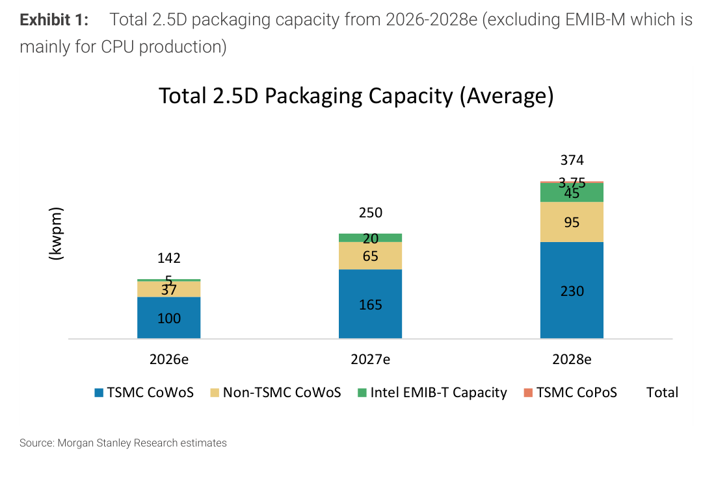

### 解讀摘要

2.5D 封裝合計平均產能從 2026e 142kwpm 成長至 2027e 250kwpm（+76%），再至 2028e 374kwpm（+50%）。成長驅動力不是單一技術，而是三條路線並行擴張：TSMC CoWoS 從 100→165→230kwpm 仍是主幹，但非 TSMC CoWoS（Amkor/ASE）從 37→65→95kwpm 佔比升高，Intel EMIB-T 從 5→20→45kwpm 快速從邊緣走向核心。即使 2028 年 CSP capex 成長僅 12%，封裝密度提升使每美元 capex 能承載更多晶片，這就是 AI 半導體能超越整體支出增速的結構性依據。

### 表格

| 2.5D 封裝技術 | 2026e (kwpm) | 2027e (kwpm) | 2028e (kwpm) |
|---|---|---|---|
| TSMC CoWoS | 100 | 165 | 230 |
| Non-TSMC CoWoS | 37 | 65 | 95 |
| Intel EMIB-T | 5 | 20 | 45 |
| TSMC CoPoS | — | — | 3.75 |
| **合計（平均）** | **142** | **250** | **374** |

> **洞察一**：EMIB-T 增速最快（5→20→45，+300%→+125%），2028 年佔 2.5D 產能 12%（45/374）。按 MS 假設每個 EMIB-T substrate 可出 16 片 9× reticle 晶片（vs CoWoS 約 4 片），40-45kwpm 相當於實際晶片產出能力是 CoWoS 的 4 倍——這意味著 Intel 在 MediaTek Humufish 量產的貢獻被傳統 kwpm 比較嚴重低估。

---

## Exhibit 2｜MS Cloud Capex Tracker：AI server mix 2028 年超越基礎建設

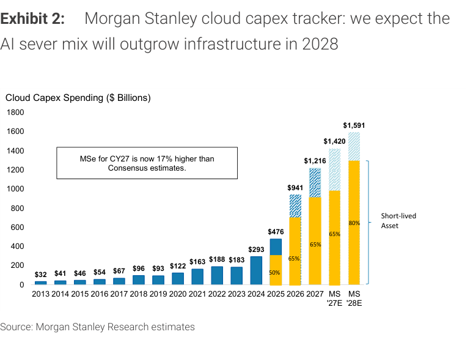

### 解讀摘要

全球雲端資本支出從 2024 年 \$293bn 急速攀升至 2025 年 \$476bn（+63%）、2026 年 \$941bn（+98%）、2027 年 \$1,216bn（+29%）、MS 2027E \$1,420bn（高於共識 17%）、MS 2028E \$1,591bn（+12%）。短壽資產（Short-lived Asset，即伺服器/GPU 等）佔比從 2025 年 50% 升至 MS 2028E 80%，代表機房外殼比重下降而算力本身比重上升——這是 AI 晶片含量提升的財務體現，解釋了為何即使 capex 總量成長 12%，AI 晶片需求仍可維持更高成長。

### 表格

| 年份 | 雲端 Capex (\$bn) | YoY | Short-lived Asset % |
|---|---|---|---|
| 2024 | 293 | +60% | — |
| 2025 | 476 | +63% | 50% |
| 2026 | 941 | +98% | 65% |
| 2027e（市場共識） | 1,216 | +29% | 65% |
| MS 2027E | 1,420 | +51% | 65% |
| MS 2028E | 1,591 | +12% | 80% |

> **洞察一**：MS 2027E 比共識高 17%（\$1,420bn vs \$1,216bn），意味著即使共識是對的，AI 晶片需求仍受到短壽資產佔比提升的加持；若共識低估，則 AI 晶片更是受益。

---

## Exhibit 3｜Hyperscaler Capex Forecast — MS US Research

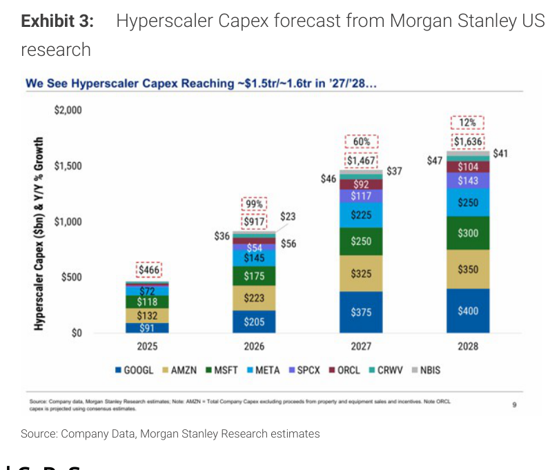

### 解讀摘要

MS 美國網路分析師預估超大規模資料中心（Hyperscaler）資本支出：2025 年 \$466bn，2026 年 \$917bn（+99%），2027 年 \$1,467bn（+60%），2028 年 \$1,636bn（+12%）。增速從 99% 急降至 12% 是引發市場疑慮的根源。各家公司中，AMZN（含 total company capex）是最大支出方，GOOGL、MSFT 緊隨。ORCL 以共識估計，並非 MS 直接預測。

### 表格

| 年份 | 合計 (\$bn) | YoY | GOOGL | AMZN | MSFT | META | SPCX | ORCL | CRWV | NBIS |
|---|---|---|---|---|---|---|---|---|---|---|
| 2025 | 466 | — | 91 | 132 | 118 | 72 | 37 | 23 | 56 | — |
| 2026 | 917 | +99% | 205 | 223 | 175 | 145 | 54 | 56 | 36 | — |
| 2027 | 1,467 | +60% | 375 | 325 | 250 | 225 | 117 | 92 | 46 | 37 |
| 2028 | 1,636 | +12% | 400 | 350 | 300 | 250 | 143 | 104 | 47 | 41 |

> **值得驗證**：ORCL 2027-28 capex 係依共識估計，並非 MS 模型數字。若 ORCL 持續超預期（近年趨勢），2028 合計將高於 \$1,636bn，12% 的成長假設就是低估。

---

## Exhibit 4｜TSMC CoWoS 產能細分（By Year End）

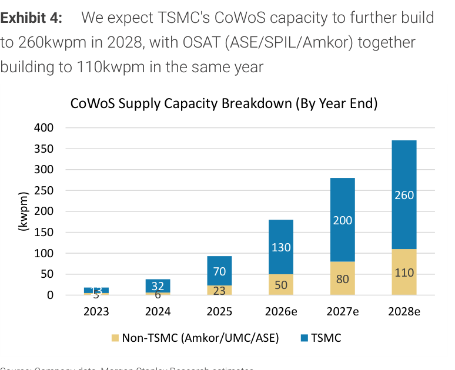

### 解讀摘要

以年底產能（非平均）計算，TSMC CoWoS 從 2025 年底 70kwpm 擴至 2026 年底 130kwpm（+86%）、2027 年底 200kwpm（+54%）、2028 年底 260kwpm（+30%）。非 TSMC（Amkor/UMC/ASE）同步從 23→50→80→110kwpm。值得注意的是，OSAT 爬坡速度已慢於 MS 的初始預期——這導致 AMD Venice CPU 的 2027 年 CoWoS 預訂量被 MS 下修（見 Exhibit 10 細節）。

### 表格

| 年份 | TSMC (kwpm) | Non-TSMC (kwpm) | 合計 (kwpm) |
|---|---|---|---|
| 2023 | 13 | 5 | 18 |
| 2024 | 32 | 6 | 38 |
| 2025 | 70 | 23 | 93 |
| 2026e | 130 | 50 | 180 |
| 2027e | 200 | 80 | 280 |
| 2028e | 260 | 110 | 370 |

> **洞察一（配合 Exhibit 1）**：Exhibit 1 的「平均」與 Exhibit 4 的「年底」差異反映了擴產主要集中在下半年：2027e 年底 280kwpm 但全年平均僅 250kwpm，隱含 2027 年上半年產能明顯低於年底，供應緊張期延伸至 2027H1。

---

## Exhibit 5｜TSMC CoPoS 產能（2028e-2029e）

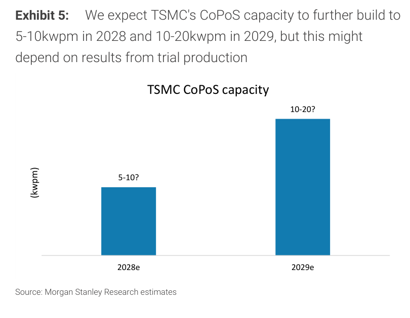

### 解讀摘要

TSMC CoPoS 仍處於試量產（Taoyuan 廠），2028e 目標僅 5-10kwpm（問號代表高度不確定），2029e 擴至 10-20kwpm。首批目標客戶為 NVIDIA Feynman Ultra GPU。相對於 CoWoS 的 230kwpm（2028e），CoPoS 即使達到 10kwpm，佔 2.5D 總產能也僅約 3%，目前仍是補充角色而非替代。

### 表格

| 年份 | TSMC CoPoS (kwpm) |
|---|---|
| 2028e | 5–10？ |
| 2029e | 10–20？ |

> **值得驗證**：CoPoS 量產時程高度依賴試量產良率結果。若 2027 年試量產良率不如預期，2028 年 5-10kwpm 目標將難以實現，Feynman Ultra GPU 的供應鏈規劃需有 fallback。

---

## Exhibit 6｜Intel EMIB 產能（平均，2026e-2028e）

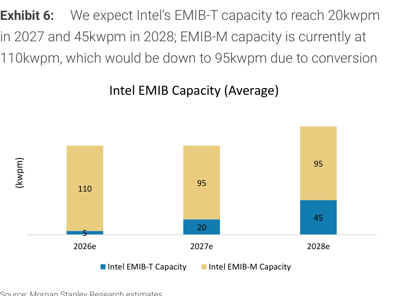

### 解讀摘要

Intel EMIB 現有產能以 EMIB-M 為主（為 CPU 使用），目前平均 110kwpm，2027 年因部分轉換為 EMIB-T 而降至 95kwpm（維持至 2028）。EMIB-T 則快速從 2026e 5kwpm 爬升至 2027e 20kwpm、2028e 45kwpm。以每個 EMIB-T substrate 可出 4-5 片 Humufish 計算，45kwpm × 12 個月 = 540k 晶圓當量，可生產約 2mn+ Humufish 單位（2027-28 合計）。EMIB-M 主要客戶：AWS Trainium 3、未來 Trainium 4 及 Intel 自用伺服器 CPU。

### 表格

| 年份 | EMIB-T (kwpm) | EMIB-M (kwpm) | 合計 (kwpm) |
|---|---|---|---|
| 2026e | 5 | 110 | 115 |
| 2027e | 20 | 95 | 115 |
| 2028e | 45 | 95 | 140 |

> **洞察一**：EMIB-T 40-45kwpm 的「wafer-equivalent」換算基準是：1 個 EMIB-T substrate = 16 片 9× reticle 晶片 ≈ 4 個 CoWoS wafer 產出。因此 45kwpm EMIB-T ≈ 180kwpm CoWoS-equivalent，佔 2028 年 2.5D 有效產能比 Exhibit 1 所示的 12% 還要高得多（實質接近 40%）。

---

## Exhibit 7｜Intel EMIB 可支援的晶片尺寸擴展路線圖

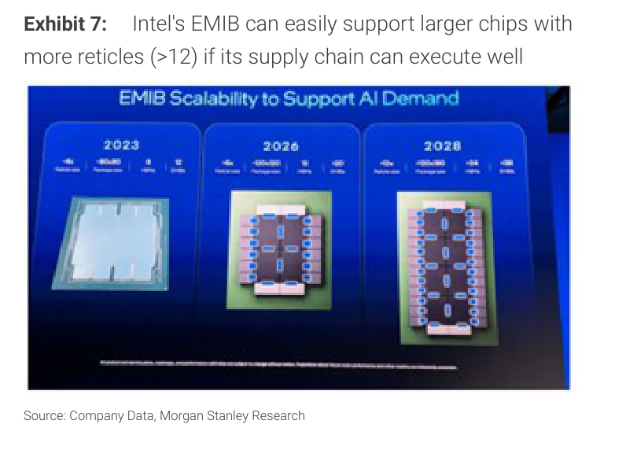

### 解讀摘要

Intel 展示的 EMIB 擴展路線：2023 年僅支援數個 reticle 組合的晶片，2026 年已大幅增加 dies 配置密度（可見更多矽橋連接點），2028 年預計支援 >12 個 reticle 的超大尺寸晶片。這是 EMIB-T 技術路線的核心競爭力——在不依賴 TSMC CoWoS 的前提下，透過 Intel 自建基板技術提供給 Google/MediaTek 的 Humufish TPU 等超大晶片使用。執行風險在於供應鏈能否跟上（如良率、基板鍵合精度）。

> **原文補充**：MS 特別指出「if its supply chain can execute well」為關鍵前提，供應鏈執行力是 EMIB-T 2027-28 爬坡的最大風險，而非技術本身的物理限制。

---

## Exhibit 8｜Global CoWoS demand breakdown：2026e vs. 2027e

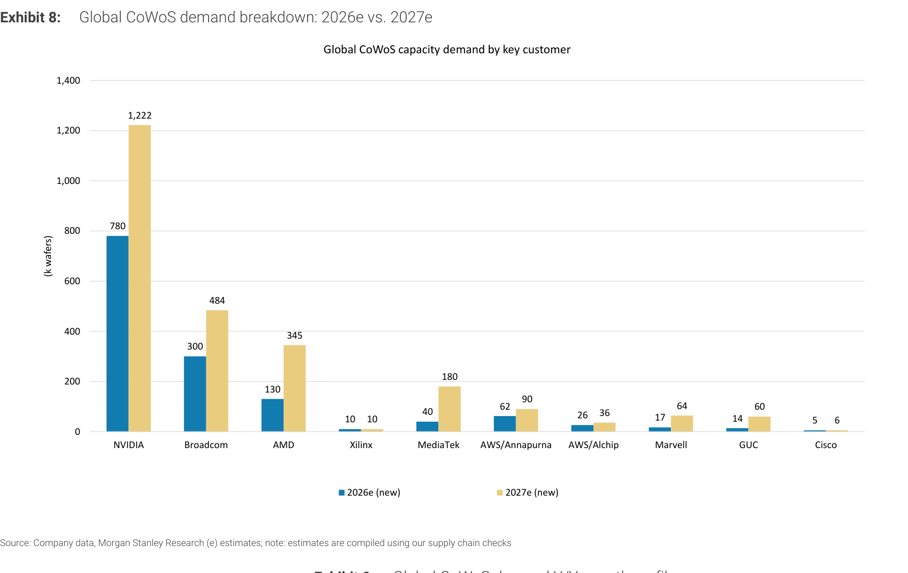

### 解讀摘要

全球 CoWoS 需求從 2026e 1,394k wafers 成長至 2027e 2,509k wafers（+80% YoY）。NVIDIA 雖仍是最大需求方（780→1,222k），但市佔從 56% 降至 49%，反映 ASIC 生態系統的多元化。增速最快的客戶：GUC（+329%，14→60k）、Marvell（+276%，17→64k）、MediaTek（+350%，40→180k）——這三家都是 ASIC 設計服務商，清楚指向 AI ASIC 需求快速擴張。

### 表格

| 客戶 | 2026e (k wafers) | 2027e (k wafers) | YoY | 2026e 佔比 | 2027e 佔比 |
|---|---|---|---|---|---|
| NVIDIA | 780 | 1,222 | +57% | 56% | 49% |
| Broadcom | 300 | 484 | +61% | 22% | 19% |
| AMD | 130 | 345 | +165% | 9% | 14% |
| MediaTek | 40 | 180 | +350% | 3% | 7% |
| AWS/Annapurna | 62 | 90 | +45% | 4% | 4% |
| AWS/Alchip | 26 | 36 | +38% | 2% | 1% |
| Marvell | 17 | 64 | +276% | 1% | 3% |
| GUC | 14 | 60 | +329% | 1% | 2% |
| Xilinx | 10 | 10 | 0% | 1% | 0% |
| Cisco | 5 | 6 | +10% | 0% | 0% |
| **合計** | **1,394** | **2,509** | **+80%** | **100%** | **100%** |

> **洞察一**：MediaTek 2027e 佔比從 3% 升至 7%（180k wafers）——這是 TPU v8t（Zebrafish）與 v9（Humufish）的合計，若贏得第二個 AI CSP 客戶，2027-28 年 CoWoS 需求可能再上修。這是 4Q26 決策的前置訊號。

---

## Exhibit 9｜Global CoWoS demand Y/Y growth profile

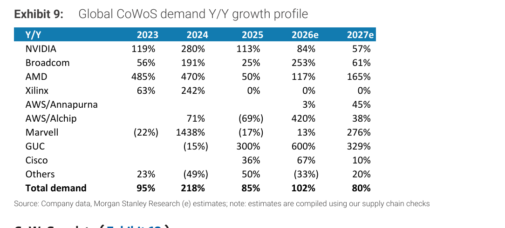

### 解讀摘要

整體 CoWoS 需求 YoY 成長：2023 95%、2024 218%、2025 85%、2026e 102%、2027e 80%——在高基期上維持兩位數高增速。NVIDIA 成長率持續放緩（84%→57%），但 AMD 反向加速（117%→165%），主因 Venice CPU 上量。Broadcom 2026e 飆升 253%（AVGO AI lab 客戶預訂 15-30k）後 2027e 降回 61%。最值得注意的異常值：AWS/Alchip 2025 年下滑 69% 後 2026e 暴增 420%，反映 Trainium 3 大量爬坡。

### 表格

| 客戶 | 2023 | 2024 | 2025 | 2026e | 2027e |
|---|---|---|---|---|---|
| NVIDIA | 119% | 280% | 113% | 84% | 57% |
| Broadcom | 56% | 191% | 25% | 253% | 61% |
| AMD | 485% | 470% | 50% | 117% | 165% |
| Xilinx | 63% | 242% | 0% | 0% | 0% |
| AWS/Annapurna | — | — | — | 3% | 45% |
| AWS/Alchip | — | 71% | (69%) | 420% | 38% |
| Marvell | (22%) | 1,438% | (17%) | 13% | 276% |
| GUC | — | (15%) | 300% | 600% | 329% |
| Cisco | — | — | 36% | 67% | 10% |
| Others | 23% | (49%) | 50% | (33%) | 20% |
| **Total demand** | **95%** | **218%** | **85%** | **102%** | **80%** |

> **洞察一**：GUC 2026e +600% 是本表最大驚喜——代表某家大型 AI 實驗室客戶（US AI Lab）透過 GUC 設計服務在 2026 年首次大量投片，14k→60k wafers（+46k），是 MediaTek 以外另一個 ASIC 爆發點。

---

## Exhibit 10｜Global CoWoS demand breakdown 全明細

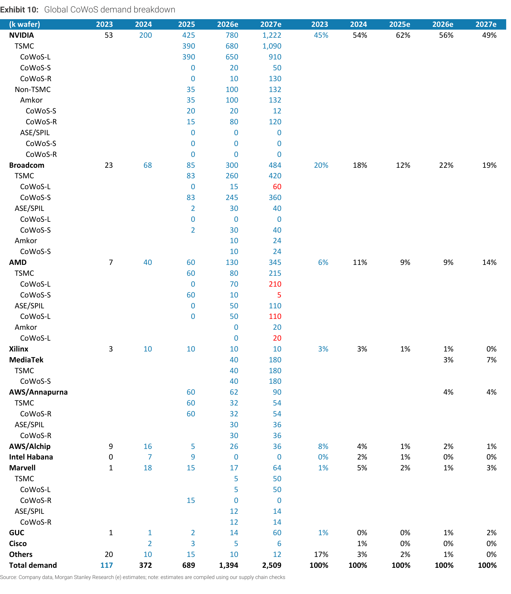

### 解讀摘要

這是本報告最核心的供應鏈資料表，逐一拆解每家客戶的 CoWoS 需求至 TSMC/OSAT 層級與技術類別（CoWoS-L/S/R）。幾個關鍵發現：AMD 的 Venice CPU 2027e 佔用 TSMC CoWoS-L 達 210k wafers（原預估 280k），因 OSAT 爬坡慢導致 MS 下修，且這 210k 會擠壓同一 CoWoS-L 台積電 AI GPU 產能；Microsoft Maia 200 上修至 5k（2027e），Maia 300 首次出現 50k；US AI Lab 預訂 15-30k（TSMC CoWoS-L）。

### 表格（摘要層）

| 客戶 | 2025 (k) | 2026e (k) | 2027e (k) | 主要供應商 |
|---|---|---|---|---|
| NVIDIA | 425 | 780 | 1,222 | TSMC（1,090）、Amkor（132） |
| 　CoWoS-L (TSMC) | — | 650 | 910 | TSMC |
| 　CoWoS-S (TSMC) | — | 20 | 50 | TSMC |
| 　CoWoS-R (TSMC) | — | 10 | 130 | TSMC |
| Broadcom | 85 | 300 | 484 | TSMC（420）、ASE/SPIL（40）、Amkor（24） |
| AMD | 60 | 130 | 345 | TSMC（215）、ASE/SPIL（110）、Amkor（20） |
| 　CoWoS-L (TSMC) | — | 70 | 210 | TSMC |
| 　CoWoS-L (ASE/SPIL) | — | 50 | 110 | ASE/SPIL |
| Xilinx | 10 | 10 | 10 | — |
| MediaTek | — | 40 | 180 | TSMC CoWoS-S |
| AWS/Annapurna | 60 | 62 | 90 | TSMC（54）、ASE/SPIL（36） |
| AWS/Alchip | 5 | 26 | 36 | — |
| Intel Habana | 9 | 0 | 0 | — |
| Marvell | 15 | 17 | 64 | TSMC（50）、ASE/SPIL（14） |
| GUC | 2 | 14 | 60 | — |
| Microsoft | — | — | 55 | TSMC（29+5=~34）、ASE/SPIL（~14） |
| 　Maia 200 | — | 1 | 5 | TSMC CoWoS-L |
| 　Maia 300 | — | 5 | 50 | TSMC CoWoS-L |
| Cisco | 3 | 5 | 6 | — |
| Others | 15 | 10 | 12 | — |
| US AI Lab | — | — | 15–30 | TSMC CoWoS-L |
| **Total** | **689** | **1,394** | **2,509** | — |

> **洞察一**：AMD Venice CPU 是本輪 OSAT 產能利用的最大受害者——MS 下修 2027e Venice 至 4.4mn 單位（CoWoS 210k），較原始預估 5.6mn 少 21%。受益方是 TSMC：原本預計由 ASE/SPIL 承接的 Venice 產能（50k→110k CoWoS-L）因良率低部分回流 TSMC（80k CoWoS-L）。  
> **洞察二**：US AI Lab（GUC 客戶）2027e 預訂 15-30k wafers 採 TSMC CoWoS-L，支援方為 Broadcom——這指向某家 AI 實驗室（可能是 OpenAI 或 Apple Intelligence?）開始大規模投入客製晶片。

---

## Exhibit 11｜AI HBM consumption：2027e 達 44.9bn Gb

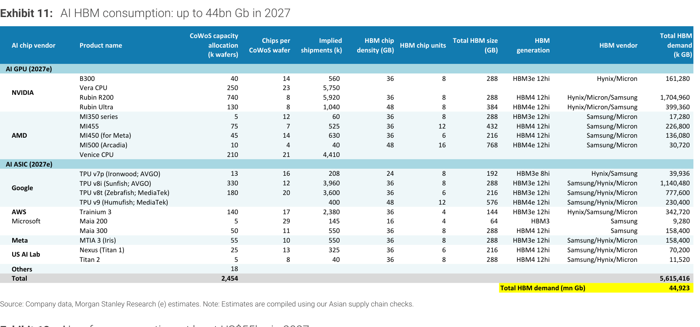

### 解讀摘要

2027e AI HBM 需求合計 44,923mn Gb（44.9bn Gb），相比 2026e 29.9bn Gb 成長 50%。NVIDIA Rubin R200 單品獨佔 38%（1,704,960k GB）——其 740k CoWoS wafers × 8 chips/wafer × 5,920k 出貨量，每顆 chip 配 8 枚 HBM4 12hi（36GB）= 1.7bn Gb。Google TPU v8i（Sunfish）以 330k wafers、3,960k 出貨量貢獻 25%（1,140,480k GB）。新進入者：Maia 300（Microsoft，HBM4 12hi）、MTIA 3 Iris（Meta，HBM3e 12hi）、Nexus Titan 1（US AI Lab，HBM4 12hi）首次大量出現。

### 表格（2027e 主要品項）

| 廠商 | 產品 | CoWoS (k waf) | 出貨 (k) | HBM GB/chip | HBM 世代 | HBM 需求 (k GB) |
|---|---|---|---|---|---|---|
| **NVIDIA** | B300 | 40 | 560 | 288 | HBM3e 12hi | 161,280 |
| | Vera CPU | 250 | 5,750 | — | — | — |
| | Rubin R200 | **740** | 5,920 | 288 | HBM4 12hi | **1,704,960** |
| | Rubin Ultra | 130 | 1,040 | 384 | HBM4e 12hi | 399,360 |
| **AMD** | MI455 | 75 | 525 | 432 | HBM4 12hi | 226,800 |
| | MI450 for Meta | 45 | 630 | 216 | HBM4 12hi | 136,080 |
| | MI500 (Arcadia) | 10 | 40 | 768 | HBM4e 12hi | 30,720 |
| **Google** | TPU v8i (Sunfish) | **330** | 3,960 | 288 | HBM3e 12hi | **1,140,480** |
| | TPU v8t (Zebrafish) | 180 | 3,600 | 216 | HBM3e 12hi | 777,600 |
| | TPU v9 (Humufish) | — | 400 | 576 | HBM4e 12hi | 230,400 |
| **AWS** | Trainium 3 | 140 | 2,380 | 144 | HBM3e 12hi | 342,720 |
| **Microsoft** | Maia 300 | 50 | 550 | 288 | HBM4 12hi | 158,400 |
| **Meta** | MTIA 3 (Iris) | 55 | 550 | 288 | HBM3e 12hi | 158,400 |
| **US AI Lab** | Nexus (Titan 1) | 25 | 325 | 216 | HBM4 12hi | 70,200 |
| **Total** | | **2,454** | | | | **44,923 mn Gb** |

> **洞察一**：NVIDIA Rubin R200 + Ultra 合計 1,704,960 + 399,360 = 2,104,320k GB，佔 2027e 全部 AI HBM 需求的 47%——這是單一 GPU 家族對 HBM4 供應商（SK Hynix、Micron、Samsung）的絕對定價權來源。  
> **洞察二**：Vera CPU（NVIDIA，250k wafers，23 chips/wafer = 5,750k 單位）無 HBM 需求，是 2027 年 CoWoS-L 需求中對 HBM 零貢獻的大客戶，代表純 CPU 算力擴張不拉動 HBM 供需。

---

## Exhibit 12｜AI wafer consumption：2027e TAM 達 US\$55bn

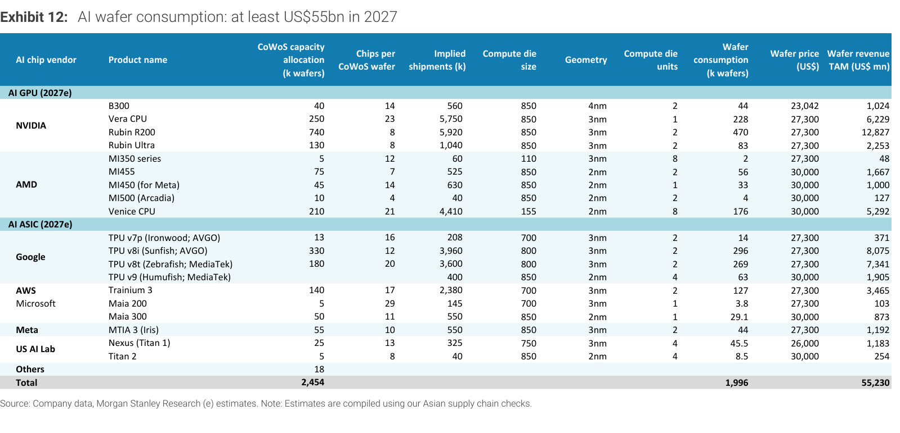

### 解讀摘要

2027e AI 晶圓消耗量 1,996k wafers，收入 TAM US\$55,230mn（55.2bn）。Rubin R200（N3、\$27,300/waf）是最大貢獻者，470k wafers = US\$12,827mn（23%）。Google TPU v8i（Sunfish，N3，296k waf × \$27,300）= US\$8,075mn（15%）。AMD Venice CPU（N2，176k waf × \$30,000）= US\$5,292mn（10%）。2nm 製程（\$30,000/waf）的客戶逐漸增多：AMD MI455/450、Venice CPU、Rubin Ultra、Maia 300、Humufish TPU v9。

### 表格（2027e 前十大品項）

| 廠商 | 產品 | Geometry | Wafers (k) | 晶圓單價 (US\$) | Revenue TAM (US\$ mn) |
|---|---|---|---|---|---|
| NVIDIA | Rubin R200 | 3nm | 470 | 27,300 | 12,827 |
| NVIDIA | Vera CPU | 3nm | 228 | 27,300 | 6,229 |
| AMD | Venice CPU | 2nm | 176 | 30,000 | 5,292 |
| Google | TPU v8i (Sunfish) | 3nm | 296 | 27,300 | 8,075 |
| Google | TPU v8t (Zebrafish) | 3nm | 269 | 27,300 | 7,341 |
| AWS | Trainium 3 | 3nm | 127 | 27,300 | 3,465 |
| Google | TPU v9 (Humufish) | 2nm | 63 | 30,000 | 1,905 |
| AMD | MI455 | 2nm | 56 | 30,000 | 1,667 |
| NVIDIA | Rubin Ultra | 3nm | 83 | 27,300 | 2,253 |
| **Total** | | | **1,996** | | **55,230** |

> **洞察一**：Google 三款 TPU 合計 296+269+63 = 628k wafers，Revenue TAM = US\$17,321mn（31%），幾乎與 NVIDIA 的 Rubin R200+Ultra+Vera（470+83+228 = 781k，US\$21,309mn）相當。Google 的 ASIC 策略已在晶圓消耗量上形成對 NVIDIA 的實質牽制。

---

## Exhibit 13｜AI HBM consumption：2026e 達 29.9bn Gb

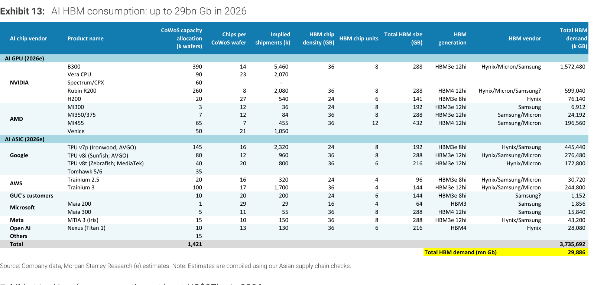

### 解讀摘要

2026e AI HBM 需求合計 29,886mn Gb（29.9bn Gb），YoY 2025→2026 成長約 50%（估算）。最大需求方為 NVIDIA B300（390k CoWoS wafers × 14 chips × 8 HBM × 36GB = 1,572,480k GB，佔 2026e 總量約 53%）。Rubin R200 也在 2026e 已達 260k wafers、599,040k GB（20%）。Google TPU v7p（Ironwood，AVGO）在 2026e 仍以 HBM3e 8hi 為主，但 v8i（Sunfish）開始大量——330k wafers 出現則是 2026→2027 的接棒。AWS Trainium 2.5（20k）→ Trainium 3（100k）的世代交接在 2026 年完成。

### 表格（2026e 主要品項）

| 廠商 | 產品 | CoWoS (k waf) | HBM GB/chip | HBM 世代 | HBM 需求 (k GB) |
|---|---|---|---|---|---|
| NVIDIA | B300 | 390 | 288 | HBM3e 12hi | 1,572,480 |
| NVIDIA | Rubin R200 | 260 | 288 | HBM4 12hi | 599,040 |
| NVIDIA | H200 | 20 | 141 | HBM3e 8hi | 76,140 |
| Google | TPU v7p (Ironwood) | 145 | 192 | HBM3e 8hi | 445,440 |
| Google | TPU v8i (Sunfish) | 80 | 288 | HBM3e 12hi | 276,480 |
| Google | TPU v8t (Zebrafish) | 40 | 216 | HBM3e 12hi | 172,800 |
| AWS | Trainium 3 | 100 | 144 | HBM3e 12hi | 244,800 |
| Meta | MTIA 3 (Iris) | 15 | 288 | HBM3e 12hi | 43,200 |
| OpenAI | Nexus (Titan 1) | 10 | 216 | HBM4 | 28,080 |
| **Total** | | **1,421** | | | **29,886 mn Gb** |

> **洞察一（配合 Exhibit 11）**：2026e→2027e HBM 需求從 29.9bn Gb 升至 44.9bn Gb（+50%），但 CoWoS 需求從 1,394k 升至 2,509k wafers（+80%）。HBM 成長落後 CoWoS 成長，原因是 Vera CPU（250k waf）、Venice CPU（210k waf）等不含 HBM 的 AI CPU 在 2027e 大量增加。

---

## Exhibit 14｜AI wafer consumption：2026e TAM 達 US\$27bn

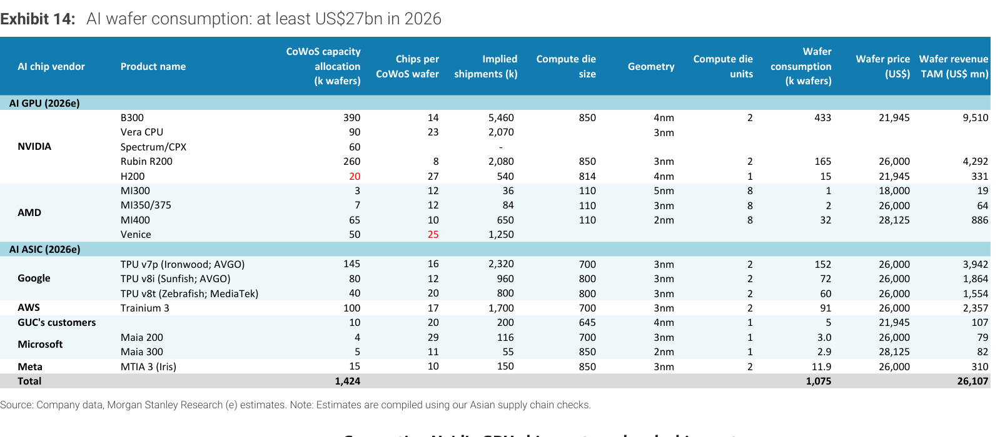

### 解讀摘要

2026e AI 晶圓消耗量 1,075k wafers，Revenue TAM US\$26,107mn（26.1bn），2027e 至 US\$55.2bn 代表翻倍成長。最大貢獻：NVIDIA B300（4nm，433k waf × \$21,945 = US\$9,510mn，36%）。值得注意的異常：Rubin R200 在 2026e 使用 \$26,000/waf（4nm?），但 2027e 改用 \$27,300（3nm）——反映 Rubin R200 在 2026 年可能仍有部分 N4 產能、2027 年全面移至 N3。AMD MI400（65k waf，2nm，\$28,125）是 2026e 才出現的新產品。

### 表格（2026e 前八大品項）

| 廠商 | 產品 | Geometry | Wafers (k) | 晶圓單價 (US\$) | Revenue TAM (US\$ mn) |
|---|---|---|---|---|---|
| NVIDIA | B300 | 4nm | 433 | 21,945 | 9,510 |
| Google | TPU v7p (Ironwood) | 3nm | 152 | 26,000 | 3,942 |
| NVIDIA | Rubin R200 | 4nm | 165 | 26,000 | 4,292 |
| Google | TPU v8i (Sunfish) | 3nm | 72 | 26,000 | 1,864 |
| Google | TPU v8t (Zebrafish) | 3nm | 60 | 26,000 | 1,554 |
| AWS | Trainium 3 | 3nm | 91 | 26,000 | 2,357 |
| AMD | MI400 | 2nm | 32 | 28,125 | 886 |
| **Total** | | | **1,075** | | **26,107** |

> **洞察一（配合 Exhibit 12）**：從 2026e US\$26.1bn 到 2027e US\$55.2bn（+112%），晶圓收入翻倍，主要驅動：①晶片數量增加（1,075→1,996k waf，+86%）；②平均晶圓單價提升（\$26,107mn/1,075k = US\$24,286 → \$55,230mn/1,996k = US\$27,671，+14%）。單價提升反映 N3/N2 製程比重上升。

---

## Exhibit 15｜Industry-wide GB200/300 NVL72 monthly rack output，by ODM（2025-2026）

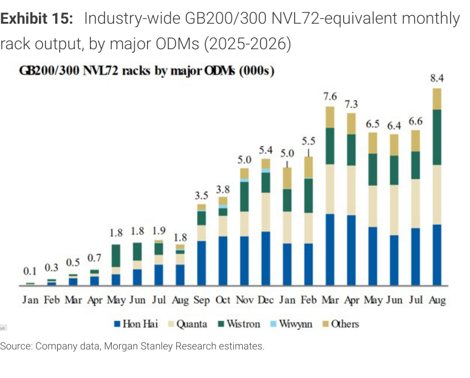

### 解讀摘要

GB200/300 NVL72-equivalent 月產量從 2025 年 1 月 0.1k racks，緩慢爬坡至 2025 年底約 6-7k，再加速至 2026 年 8 月 8.4k racks/月。主要 ODM：Hon Hai（鴻海）為最大供應商（深藍），Quanta（廣達，米色）第二，Wistron（緯創，墨綠）第三，Wiwynn（緯穎，淡藍）和其他廠商貢獻其餘。月度數據顯示 2026H1 平均約 6.5k/月，進入 3Q26 後升至 8k+ 水準。

### 表格（月產量重點節點）

| 月份 | 月產量 (k racks) |
|---|---|
| 2025-01 | 0.1 |
| 2025-04 | 0.7 |
| 2025-07 | 1.8 |
| 2025-09 | 3.5 |
| 2025-10 | 5.0 |
| 2025-12 | 5.0 |
| 2026-01 | 5.5 |
| 2026-02 | 7.6 |
| 2026-03 | 7.3 |
| 2026-05 | 6.5 |
| 2026-07 | 6.6 |
| 2026-08 | 8.4 |

> **洞察一（配合 Exhibit 16）**：Exhibit 15 的月度數據（Aug 2026 = 8.4k/月）與 Exhibit 16 的 3Q26 季度數據（22.2k/quarter = 7.4k/月平均）一致，驗證了 MS 的模型自洽性。8.4k 是截至報告日的最新數據點，代表目前 GB200/300 月產已達穩定高點。

---

## Exhibit 16｜Industry-wide GB200/300 NVL72 quarterly rack output，by ODM（2026）

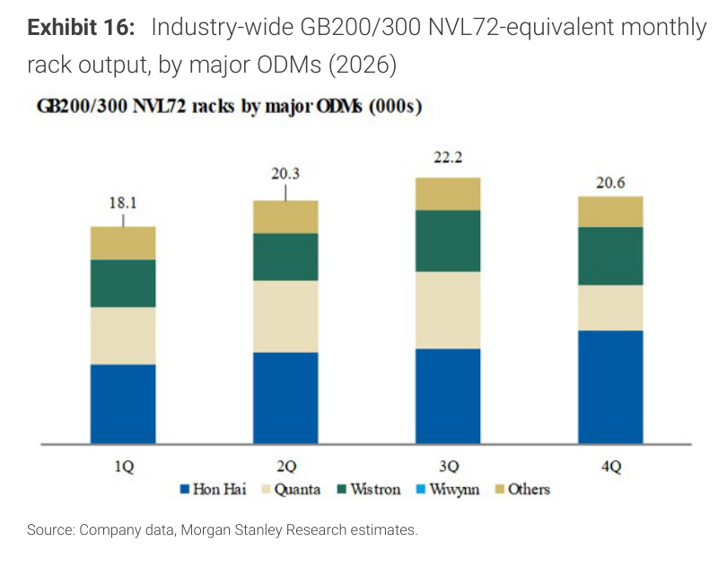

### 解讀摘要

2026 年全年 GB200/300 NVL72-equivalent 季度出貨：1Q26 18.1k、2Q26 20.3k、3Q26 22.2k（季度高點）、4Q26 20.6k（微降）。全年合計約 81.2k NVL72-equivalent racks。4Q26 的季度微降可能反映 Rubin 世代切換期間的 Blackwell 尾聲出貨放緩。主要 ODM 配置同 Exhibit 15，但顯示 Wistron 在 2026Q3 佔比明顯上升（深綠色）。

### 表格

| 季度 | 出貨量 (k racks) |
|---|---|
| 1Q26 | 18.1 |
| 2Q26 | 20.3 |
| 3Q26 | 22.2 |
| 4Q26 | 20.6 |
| **2026 全年** | **81.2** |

> **洞察一（配合 Exhibit 18）**：4Q26 GB200/300 出貨微降（22.2→20.6k）與 Rubin R200 4Q26e 僅 3k NVL72 equivalent（尚在量產初期）重疊，意味著 4Q26 的 AI GPU rack 供應可能出現缺口——Blackwell 在退潮、Rubin 尚未接棒，ODMs 如何填補這個空窗值得追蹤。

---

## Exhibit 17｜Blackwell chip vs. rack shipment

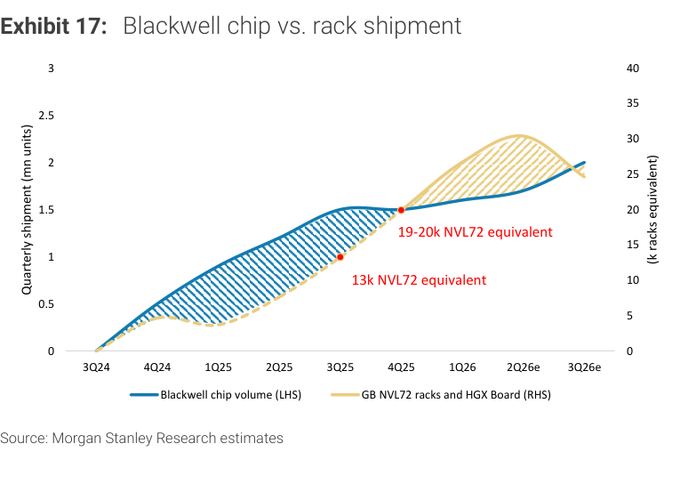

### 解讀摘要

Blackwell（B100/B200/B300 系列）晶片出貨量（左軸，mn units）與 GB NVL72 等效 racks 出貨量（右軸，k racks）的時間差：3Q25 晶片出貨已達 1.5mn 單位，但同期 rack 等效僅 13k（3Q25 底部）；4Q25 rack 攀升至 19-20k，才逐漸縮短落差。這個晶片→rack 的轉換時間差（約 1-2 季）反映了 CoWoS 到 NVL72 組裝的整個供應鏈產出週期。到 2Q26e-3Q26e，兩條線的差距縮至最小，代表供應鏈效率達到穩態。

> **洞察一**：紅點標示：3Q25 chip 1.5mn 單位→ rack 僅 13k；4Q25 chip 1.5mn→rack 19-20k NVL72 equivalent。換算：1 NVL72 rack = 72 GPU → 19k racks = 1.37mn GPUs。3Q25 晶片出貨 1.5mn 中有相當比例仍在組裝中，約有 3-4 個月的積壓庫存，這正是 4Q25 rack 出貨跳升的動能來源。

---

## Exhibit 18｜Rubin chip vs. rack shipment

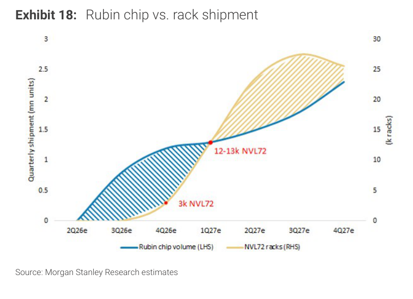

### 解讀摘要

Rubin（R200/NVL72 等效）的晶片出貨（左軸）與 rack 出貨（右軸）預估：2Q26e 開始有少量晶片出貨，4Q26e 累積到 3k NVL72 equivalent racks，但 rack 出貨明顯滯後晶片。1Q27e 加速至 12-13k racks，2Q27e-3Q27e 達到 25-28k 高點，4Q27e 略降至 ~25k。MS 的陰影面積（chip volume 線與 rack 線之間的差距）代表在途/積壓中的 Rubin 晶片，峰值在 1Q27e-2Q27e，之後收斂。

### 表格（Rubin NVL72 rack 出貨估算）

| 季度 | Rubin NVL72 等效 (k racks) |
|---|---|
| 4Q26e | ~3 |
| 1Q27e | ~12–13 |
| 2Q27e | ~25 |
| 3Q27e | ~27–28 |
| 4Q27e | ~25 |

> **洞察一（配合 Exhibit 17）**：Blackwell 的晶片→rack 轉換期約 1-2 季（3Q25 chip peak → 4Q25 rack peak），若 Rubin 同樣有 1-2 季轉換延遲，1Q27e 的 chip peak 對應 2Q27e-3Q27e 的 rack peak，與 MS 預估一致。這個轉換週期是 NVL72 rack 製造商（鴻海、廣達等）訂單能見度的關鍵假設。

---

## Exhibit 19｜P/E multiple trend of AI semis（2022-2026）

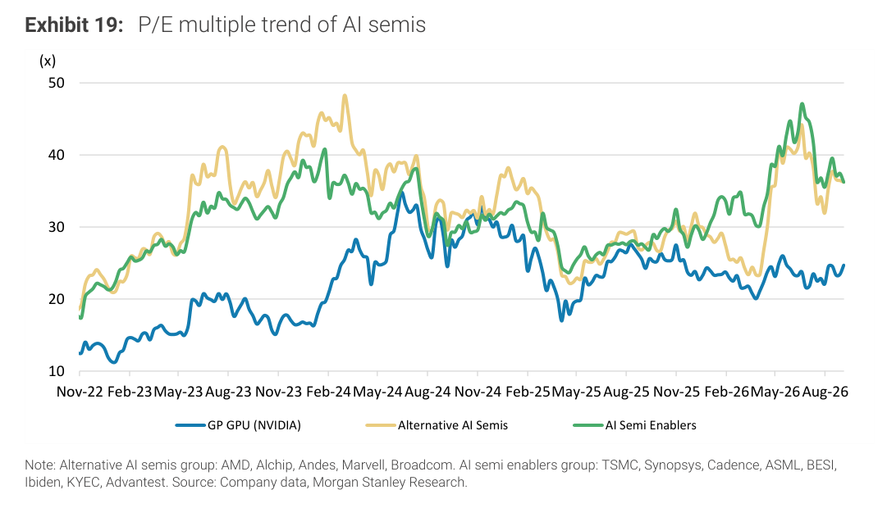

### 解讀摘要

三組 AI 半導體的 P/E 走勢（Nov 2022 至 Aug 2026）：GP GPU（NVIDIA）P/E 目前約 24x，長期保持最低但最穩定；Alternative AI Semis（AMD、Alchip、Andes、Marvell、Broadcom）目前約 37x，波動最大；AI Semi Enablers（TSMC、Synopsys、Cadence、ASML、BESI、Ibiden、KYEC、Advantest）目前約 38x。2026 年 5-6 月，AI Semi Enablers 的 P/E 出現飆升至近 47x，隨後回落——可能對應 SEMICON Taiwan 展會題材炒作與 CoWoS 擴產新聞。NVIDIA 的低 P/E 反映其龐大的絕對盈利基數，不代表市場不看好。

> **洞察一**：AI Semi Enablers（台灣供應鏈：TSMC、旺矽、穎崴等）P/E 長期高於 NVIDIA，但這是成長期的合理現象——Enabler 的 EPS 基數較低但成長斜率陡峭，而 NVIDIA 的 EPS 已極大。2026 年至今 Enablers 維持 35-47x 區間，相對穩定，意味著市場並未對供應鏈的估值有顯著折讓。

---

## Exhibit 20｜AI chip revenue（NVIDIA + AMD datacenter）QoQ 持續成長

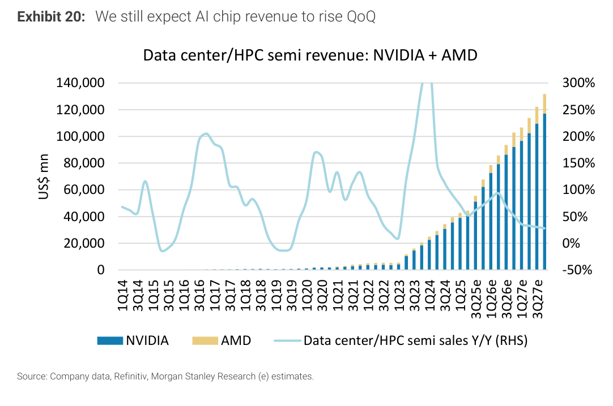

### 解讀摘要

NVIDIA + AMD 資料中心/HPC 半導體合計季度收入（US\$ mn）：從 2023 年前的幾乎為零快速拉升，3Q24 開始加速（Y/Y 成長約 300%），目前 2Q26e-3Q26e 季度收入接近 US\$100,000mn（100bn），2027e 全年持續成長至 ~US\$120bn/季。Y/Y 成長率從 3Q24 的 300%+ 逐漸降回到 2027e 的 30%+ 左右，但絕對金額仍在增加。

> **洞察一**：即使 Y/Y 成長率從 300% 降至 30%，以 US\$100bn/季的基數計算，每成長 1ppt = US\$10bn 絕對增量。這解釋了為何 MS 強調「AI 晶片收入 QoQ 仍在成長」——絕對增量的規模遠大於成長率數字給人的感覺。

---

## Exhibit 21｜TSMC AI-related revenue 2024-2029e CAGR 60%

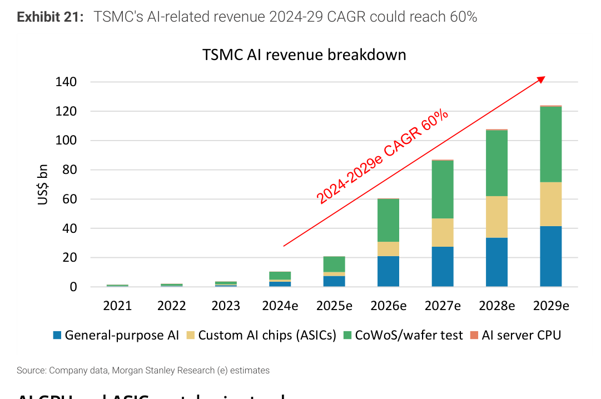

### 解讀摘要

TSMC AI 相關收入從 2024e 約 US\$10bn 成長至 2029e 約 US\$124bn，CAGR 60%。組成分四塊：General-purpose AI（NVIDIA GPU，藍色，最大）、Custom AI chips（ASICs，AVGO/Google TPU 等，米色）、CoWoS/wafer test（封裝/測試，綠色）、AI server CPU（橘紅，極小）。2026e 起 ASIC（米色）佔比明顯擴大，反映 Google/AWS/MediaTek TPU 快速上量；CoWoS 封裝（綠色）也同步放大，因為 ASIC 全部需要 CoWoS 服務。

### 表格

| 年份 | TSMC AI revenue (US\$ bn) | YoY 估算 |
|---|---|---|
| 2021 | ~1 | — |
| 2022 | ~1.5 | — |
| 2023 | ~4 | — |
| 2024e | ~10 | — |
| 2025e | ~21 | +110% |
| 2026e | ~61 | +190% |
| 2027e | ~87 | +43% |
| 2028e | ~106 | +22% |
| 2029e | ~124 | +17% |

> **洞察一**：2026e 年 TSMC AI 收入飆升 190%（US\$21→61bn），是整個成長曲線的拐點——這一年 B300 + Rubin R200 雙線量產、Google TPU v8i 大量投片，三個大客戶同時爆發。2027e 以後成長率趨緩但仍達 43%，確認 AI 需求的持久性而非一次性。

---

## Exhibit 22｜AI GPU H100 per GPU per hour pricing（至 2026 年 3 月底）

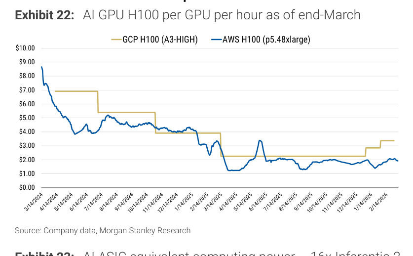

### 解讀摘要

H100 雲端租用定價（per GPU per hour）：GCP A3-HIGH 從 2024 年初的約 \$7/hr 下降至 2026 年 2-3 月的約 \$3.5/hr（-50%）；AWS p5.48xlarge 從 2024 年中的 \$8.5/hr 跌至 2025 年 4 月的 \$1.1/hr 的低谷，後反彈至 \$2/hr 左右（-77% peak to trough）。H100 定價下跌反映 Blackwell 大量供給後 H100 相對競爭力下降，也是 AI 推論端成本結構改善的直接訊號。

> **洞察一**：H100 定價腰斬（GCP -50%；AWS -77%），但 NVIDIA 的 B300 在同期 CoWoS 需求中仍佔 390k wafers（2026e），代表市場選擇用 B300 而非更便宜的 H100。舊型號定價下跌並不影響新型號的需求，反而是 AI 算力需求持續膨脹（更便宜的舊型號被用於推論、新型號用於訓練）的徵兆。

---

## Exhibit 23｜AI ASIC equivalent computing power — 16x Trainium pricing

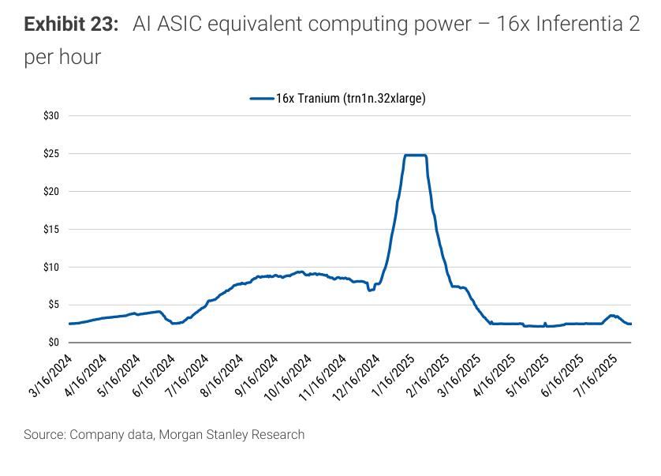

### 解讀摘要

AWS Trainium（16x Trainium = 16x Inferentia 2 per hour）雲端定價趨勢：2024 年 3 月約 \$2.5/hr，緩慢升至 2024 年底 \$9/hr，急速飆升至 2025 年 1-2 月峰值 \$25/hr，隨後崩跌至 2025 年 4 月 \$2-3/hr 並維持至此後（資料截至 2025 年 7 月）。\$25/hr 的短暫價格峰值是 Trainium 2 換代期間的需求缺口引發的結構性短缺，快速解決後定價回歸正常。目前穩定在 \$3/hr 附近，代表 Trainium 3 的供給已充足。

> **洞察一**：Trainium 的短缺峰值（\$25/hr）持續不到 2 個月（2025 年 1-2 月），之後快速回落，印證 ASIC 的一個核心特性：當需求超過供給時，定價可以極度短暫飆升，但 ASIC 的客製化供給鏈相對靈活，不像 GPU 需要多年 CoWoS 擴產週期。Qualcomm/AWS 的新合作目標為推論 ASIC，其定價參考系正是這條 Trainium 定價曲線。

---

## 跨 Exhibit 彙整表

### 彙整一｜2.5D 封裝供需平衡（2026e-2027e）

| 指標 | 2026e | 2027e | 來源 |
|---|---|---|---|
| 2.5D 平均產能 (kwpm) | 142 | 250 | Exhibit 1 |
| 年化供給（× 12，k wafers） | 1,704 | 3,000 | 計算 |
| CoWoS 需求 (k wafers) | 1,394 | 2,509 | Exhibit 10 |
| 供給利用率（需求/供給） | **82%** | **84%** | 計算 |

> 2026e-2027e 供給利用率均約 82-84%，說明 CoWoS 並非嚴重供不應求，但也無明顯過剩——這個區間對供應商最有利：有足夠緊張維持定價，不至於到搶不到產能的程度。

### 彙整二｜AI 晶圓 revenue TAM vs HBM 需求 2026e vs 2027e 對照

| 指標 | 2026e | 2027e | YoY |
|---|---|---|---|
| AI 晶圓 Revenue TAM (US\$ bn) | 26.1 | 55.2 | +112% | 
| AI HBM 需求 (bn Gb) | 29.9 | 44.9 | +50% |
| CoWoS 需求 (k wafers) | 1,394 | 2,509 | +80% |

> HBM 需求成長（+50%）落後 CoWoS 需求成長（+80%）與晶圓 TAM 成長（+112%），因為大量無 HBM 的 CPU/networking 晶片（Vera CPU、Venice CPU）在 2027e 快速上量，拉高 CoWoS 與晶圓 TAM 但不貢獻 HBM 需求。晶圓 TAM 成長超過 CoWoS 需求成長，反映 N3→N2 製程升級帶來的單價提升（+14%）。

---

## 相關個股清單

| 公司 | Ticker | 評等 | 核心角色 |
|---|---|---|---|
| 台積電（TSMC） | 2330.TW | OW | CoWoS 最大供應商；AI 收入 2024-29e CAGR 60% |
| 聯發科（MediaTek） | 2454.TW | OW | Google TPU v8t/v9 設計服務；NVLink Fusion 潛在第二 CSP 客戶 4Q26 |
| 日月光（ASE） | 3711.TW | OW | 非 TSMC CoWoS 主要擴產方（CoWoS-L/R 爬坡但慢於預期） |
| Amkor Technology | AMKR | OW | 另一非 TSMC CoWoS 供應商（2026e 100k wafers） |
| 旺矽科技（MPI） | 6223.TW | OW | CoPoS 相關測試介面 |
| Alchip Technologies | 3661.TW | OW | AWS Trainium 3 設計；Qualcomm/AWS 合作影響有限（推論 vs 訓練+推論） |
| Broadcom | AVGO.US | OW | Google TPU v7p/v8i 設計服務；FY27 US\$115bn，FY28 可能再翻倍 |
| AMD | AMD.US | EW | MI455/450 爬坡；Venice CPU 受 OSAT 產能拖累（MS 下修至 4.4mn 單位） |
| NVIDIA | NVDA.US | OW | Rubin R200 主導 CoWoS 需求（49%，2027e）及 HBM 需求（38%） |
| SK Hynix | 000660.KS | OW | HBM4 主要供應商（Rubin R200 指定） |
| GUC（創意電子） | 6770.TW | — | US AI Lab 客戶 CoWoS 從 14k→60k（+329%，2026e-2027e） |
