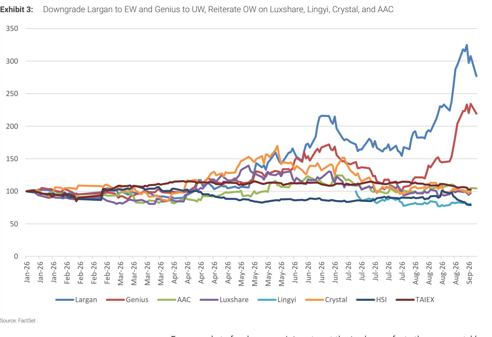
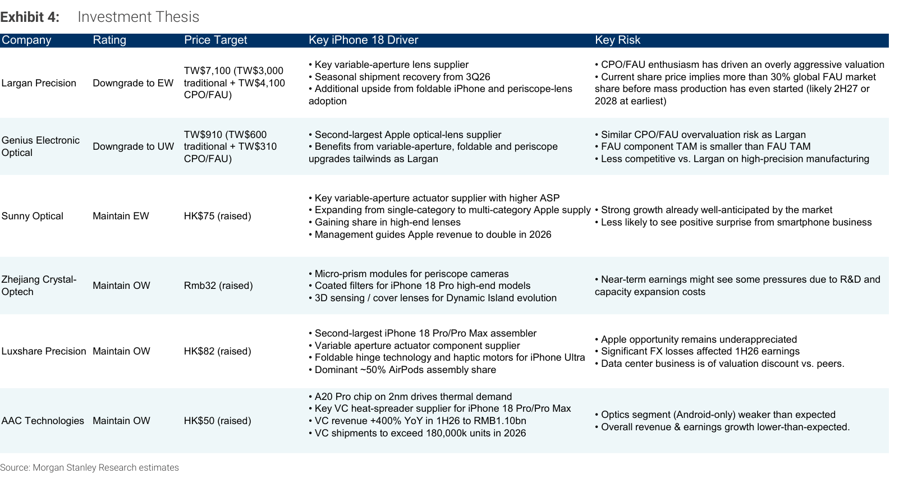
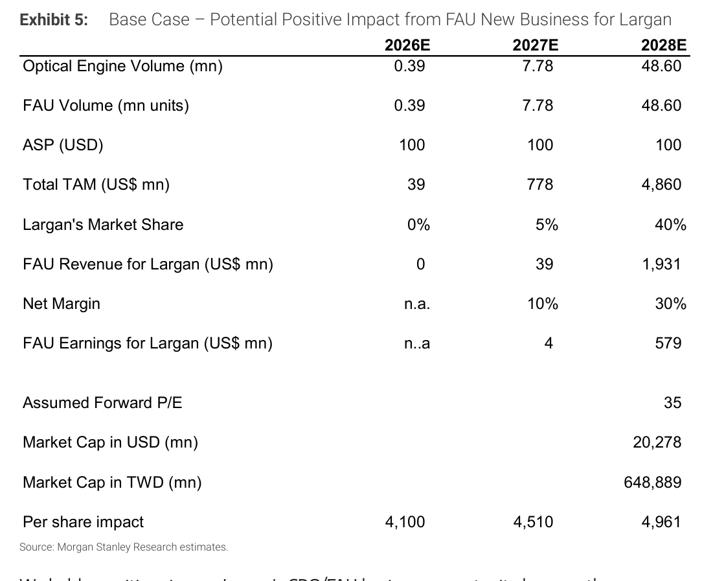
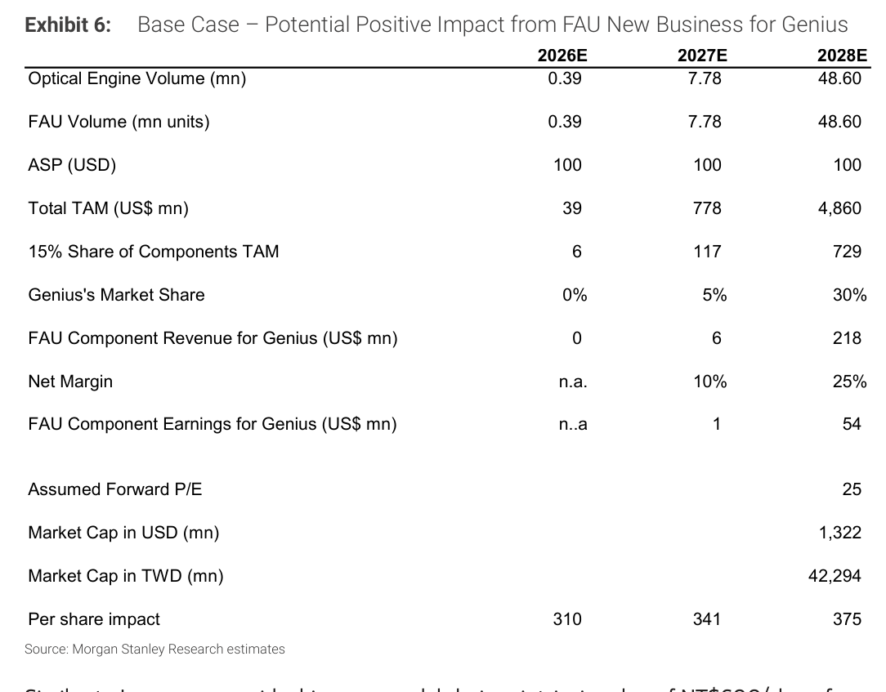
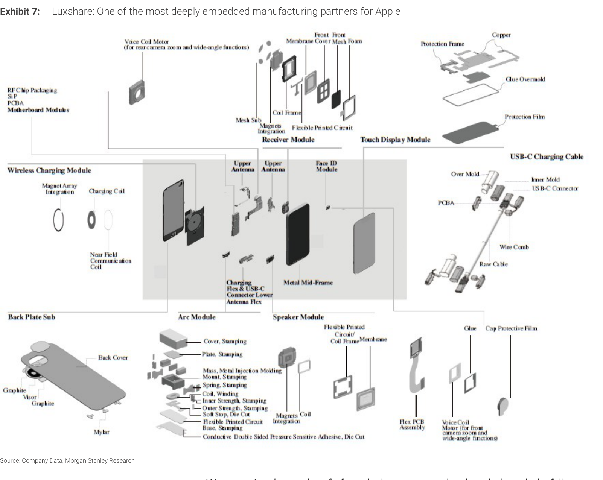
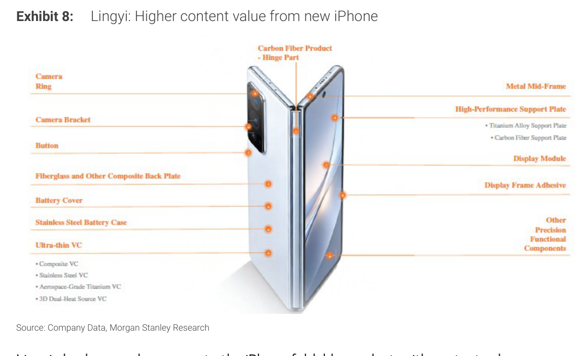
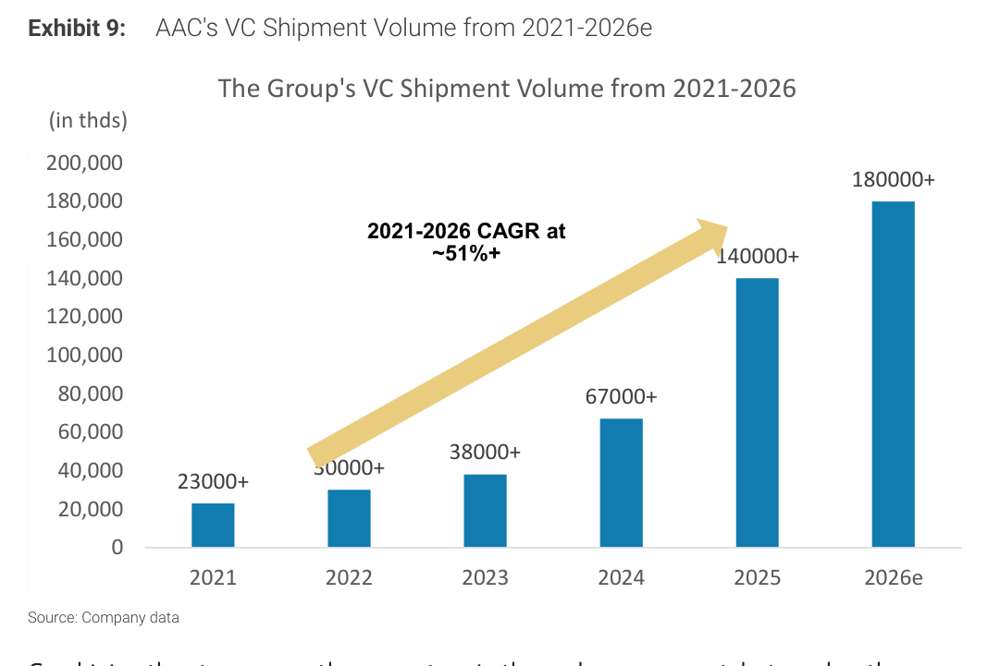
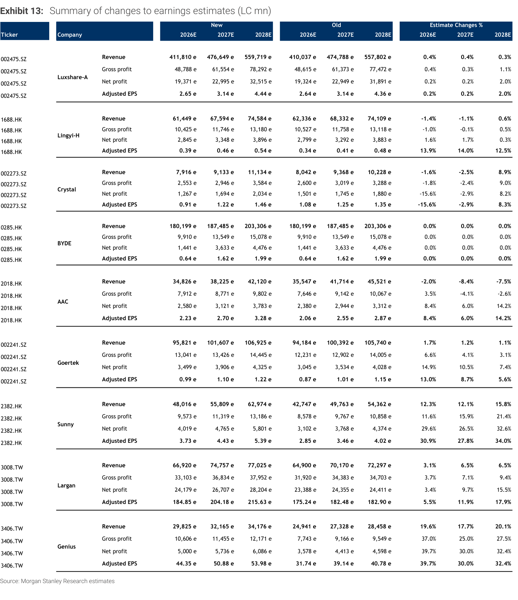
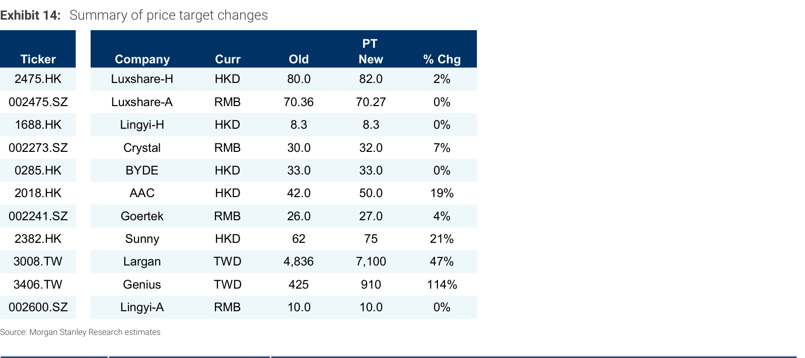
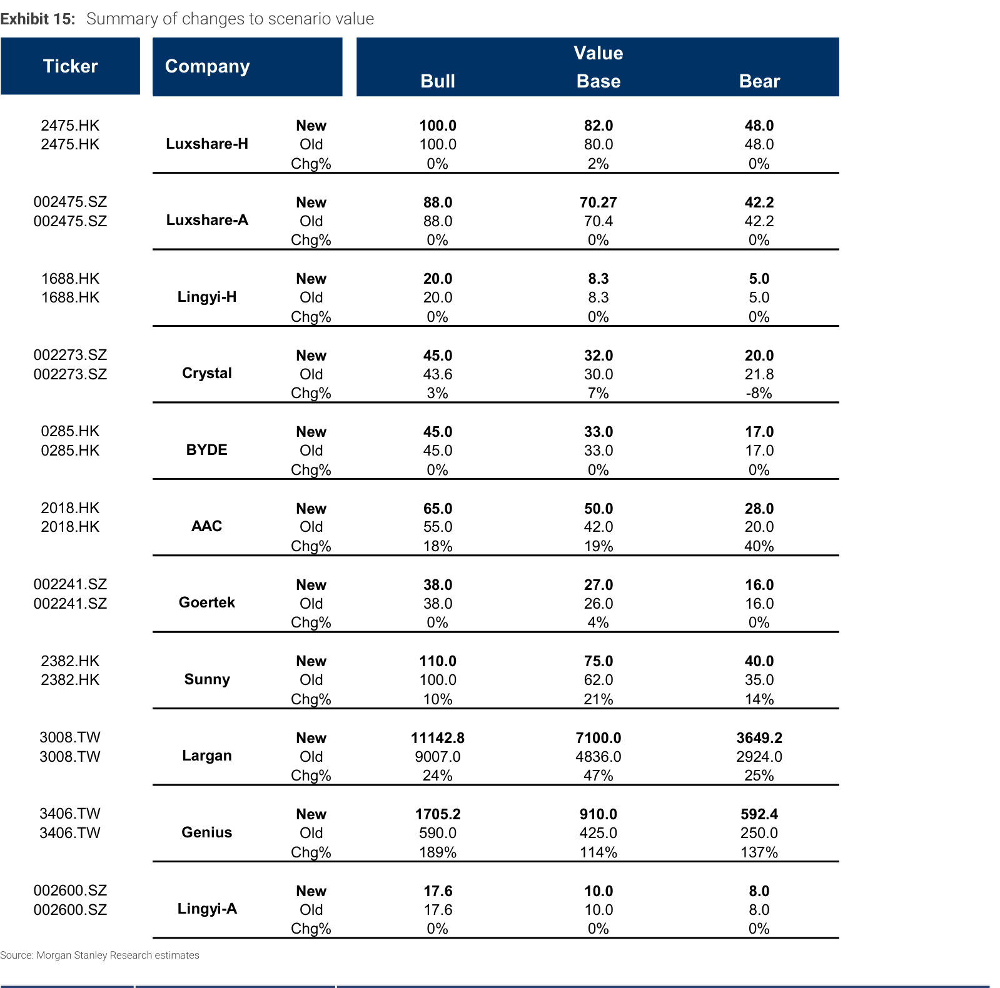

# Morgan Stanley｜iPhone 18 光學供應鏈

**券商**：Morgan Stanley  
**分析師**：Andy Meng CFA、Betty Chen  
**日期**：2026-09-10  
**主題**：iPhone 18: Real Upgrade Cycle, but Select Optical Valuations Look Stretched  
**評級**：Industry View In-Line  
<a href="https://layx.uk/dl?g=產業&b=MS&d=20260910&h=iPhone-18-Optical">📎 下載 PDF</a>

---

## 報告總結

iPhone 18 啟動了 2016 年以來最顯著的相機硬體升級週期（首次搭載可變光圈主鏡頭、Apple 首款折疊 iPhone），光學供應鏈需求改善為真實訊號。然而，Largan 與 Genius 過去一個月分別暴漲 48% 與 85%（同期 TAIEX 僅漲 5%），市場對 CPO/FAU 題材的追捧已令兩股估值超越基本面可支撐的水準：Largan 當前股價隱含其在 FAU 領域量產前即取得逾 30% 全球市佔，MS 因此雙降至 EW/UW。相對而言，受惠 iPhone 18 的 Luxshare、Lingyi、Crystal 與 AAC 股價尚未大幅反應，估值仍具吸引力，維持 OW。

---

## Morgan Stanley 完整投資邏輯鏈

| 論點層次 | Exhibit | 內容 |
|---|---|---|
| 升級週期確認 | Exhibit 3 | iPhone 18 Pro/Pro Max 首次採用可變光圈鏡頭（ASP 更高）；Apple 史上第一款折疊 iPhone（複材鉸鏈、鈦支撐板）；折疊手機訂單增至 1,000 萬台 |
| 估值泡沫偵測 | Exhibit 3 | Largan/Genius 一個月漲 48%/85%，遠超 TAIEX +5%；市場定價已超越 iPhone 18 的純光學貢獻，進入 CPO/FAU 憧憬區間 |
| FAU 公允價值拆解 | Exhibit 5、6 | Largan 傳統業務 NT\$3,000 + FAU NT\$4,100（假設 2028E 40% 市佔）= NT\$7,100；Genius NT\$600 + FAU 零件 NT\$310 = NT\$910；但當前股價已隱含比這更高的 FAU 市佔預期 |
| 受益排序 | Exhibit 4、14 | OW：Luxshare（組裝龍頭＋可變光圈零件）、Lingyi（折疊 iPhone 高含量）、Crystal（微稜鏡＋鍍膜濾鏡）、AAC（VC 散熱 +400% YoY）；EW：Sunny（成長已知）、GoerTek（越南勞工成本壓力）；EW：Largan；UW：Genius |
| 估計修正 | Exhibit 13 | Sunny NP 上修 +29.6%/+26.5%；Genius NP 上修 +39.7%/+30.0%；Crystal NP 下修 -15.6%（2Q26 R&D 成本拖累），2028E 上修 +8.2% |
| **結論** | 報告封面 | **降評 Largan OW→EW（PT NT\$7,100，↑47%）、Genius EW→UW（PT NT\$910，↑114%）；維持 OW：Luxshare（HK\$82）、Lingyi（HK\$8.30）、Crystal（RMB32）、AAC（HK\$50）** |

> **報告最大邏輯缺口**：Largan FAU 市佔假設 2028E 達 40% 是關鍵假設，若量產延遲至 2029 或市佔僅達 20%，PT 將從 NT\$7,100 大幅下修；FAU ASP US\$100 亦是估算敏感點，MS 未提供 ASP 壓縮情境。

---

## 報告核心觀點

| 主題 | MS 觀點 | 市場共識 | 是否 Contra-Consensus |
|---|---|---|---|
| Largan 評等 | EW（從 OW 降評） | 75% Buy/OW | ✅ 是，MS 明顯偏空 |
| Genius 評等 | UW（從 EW 降評） | 50% Buy/OW | ✅ 是，MS 最悲觀 |
| iPhone 18 光學升級幅度 | 實質升級（可變光圈＋折疊）需求真實 | 一致看多 | ❌ 否 |
| CPO/FAU 基本面時間表 | 量產最早 2H27，2028 才有規模 | 市場搶跑更早 | ✅ 是，MS 提醒過度樂觀 |
| Sunny 成長可持續性 | 成長真實但已 priced in，EW | 72% Buy | 略偏空 |
| GoerTek 越南成本 | 結構性壓力，毛利率難大幅反彈 | 一致 EW | ❌ 否 |

**偏好排序**：Luxshare-H > Luxshare-A > Lingyi-H > Crystal > BYDE > AAC > GoerTek > Sunny > Largan > Genius > Lingyi-A

---

## Exhibit 3｜Largan 與 Genius 一個月暴漲 48%/85%，遠超其他標的

### 解讀摘要

Largan 與 Genius 在過去一個月（截至 2026 年 9 月初）分別上漲 48% 與 85%，而同期 TAIEX 僅漲 5%，Luxshare、Lingyi、Crystal、AAC 等製造型供應商漲幅也遠遜於此。這種分化說明市場對 Largan 和 Genius 的定價已遠超 iPhone 18 純光學組件需求的貢獻，而是在為 CPO/FAU 長期市佔題材定價。MS 以此作為降評的直接觸發點。

> **原文補充**：股價以 2026 年 9 月 7 日收盤價為基準；1 個月期間定義為 8 月初至 9 月初。YTD 數據：Largan +161%，Genius +125%，均遠超大盤。

> **洞察一**：Largan YTD 漲幅 161%、1 年期 +170%，單靠 iPhone 18 相機升級無法支撐此漲幅——必須同時有 CPO 敘事才能解釋。MS 的降評本質上是在說「CPO 敘事定價過度」，而非否定 iPhone 18 基本面。

---

## Exhibit 4｜iPhone 18 供應鏈各公司投資論點彙整

### 解讀摘要

MS 以一張表格濃縮各公司對 iPhone 18 的受惠路徑與關鍵風險，評等從 OW 到 UW 的排序邏輯清晰：受惠路徑越直接、估值越低者排越前，CPO/FAU 溢價越高者排越後。Largan 和 Genius 的核心風險都指向「CPO/FAU 量產時程晚於股價隱含預期」。

### 表格

| 公司 | 評等 | 目標價 | iPhone 18 主要受惠點 | 主要風險 |
|---|---|---|---|---|
| Largan | 降至 EW | TW\$7,100 | 可變光圈鏡頭主供；3Q26 季節性出貨回升；折疊＋潛望鏡上行 | CPO/FAU 熱情驅動估值過高；股價隱含量產前即取得 >30% 全球 FAU 市佔 |
| Genius | 降至 UW | TW\$910 | Apple 第二大光學鏡頭供應商；同享可變光圈、折疊、潛望鏡趨勢 | CPO/FAU 高估風險與 Largan 類似；FAU 零件 TAM 小於 FAU TAM；高精密製造競爭力弱於 Largan |
| Sunny | 維持 EW | HK\$75（↑） | 可變光圈致動器關鍵供應商（ASP 更高）；從單品類擴展至多品類蘋果供應 | 強成長已充分預期；手機業務正向意外空間有限 |
| Crystal | 維持 OW | RMB32（↑） | 潛望鏡微稜鏡模組；iPhone 18 Pro 鍍膜濾鏡；3D 感測/蓋板鏡片 | 近期因 R&D 及產能擴張成本，獲利可能面臨壓力 |
| Luxshare | 維持 OW | HK\$82（↑） | iPhone 18 Pro/Pro Max 第二大組裝廠；可變光圈致動器零件；折疊鉸鏈＋觸覺馬達；AirPods 組裝約 50% 市佔 | Apple 機會被低估；1H26 匯兌損失影響獲利 |
| AAC | 維持 OW | HK\$50（↑） | A20 Pro 2nm 晶片驅動散熱需求；VC 散熱片關鍵供應商；1H26 VC 收入 YoY +400% 至 RMB11億 | 光學業務（僅供 Android）弱於預期 |

> **洞察一**：MS 對 Crystal 同時下修 2026E NP -15.6% 卻維持 OW 並上調 PT 7% — 理由是 2Q26 的 R&D 成本是前期投資，2028E NP 上修 +8.2%，MS 在用跨期視角定價，而非用近期獲利。這是一個值得追蹤的假設：若 Crystal 2H26-2027 的產能利用率不如預期，長期論點就需要修正。

---

## Exhibit 5｜Largan FAU 新業務潛在每股影響：TAM 分析

### 解讀摘要

MS 建構了一個三年 FAU 市場 TAM 模型，以此推導 Largan CPO/FAU 業務的每股貢獻。關鍵假設是 Largan 在 2028E 取得 40% 全球 FAU 市佔（MS 之前的假設為 20%），搭配 35x 2028E P/E 折現回 2026，得出每股 NT\$4,100 的 CPO/FAU 增值。這個數字加上傳統業務 NT\$3,000，構成 NT\$7,100 目標價。MS 明確表示，當前股價（2026/9/7 收盤 NT\$6,660）「已隱含超過 30% 的全球 FAU 市佔在量產啟動前」，因此下調至 EW。

### 表格

| 指標 | 2026E | 2027E | 2028E |
|---|---|---|---|
| 光學引擎出貨量（百萬台） | 0.39 | 7.78 | 48.60 |
| FAU 出貨量（百萬單位） | 0.39 | 7.78 | 48.60 |
| FAU ASP（USD） | 100 | 100 | 100 |
| 整體 TAM（US\$ mn） | 39 | 778 | 4,860 |
| Largan 市佔 | 0% | 5% | 40% |
| Largan FAU 收入（US\$ mn） | 0 | 39 | 1,931 |
| 淨利率 | n/a | 10% | 30% |
| Largan FAU 獲利（US\$ mn） | n/a | 4 | 579 |
| 假設 Forward P/E | — | — | 35x |
| 對應市值（US\$ mn） | — | — | 20,278 |
| 每股影響（NT\$） | — | 4,510 | 4,961（2027 基準）→ **4,100**（折現至 2026） |

> **原文補充**：MS 以 10% 折現率將 2028E 估值折現回 2026；業界同業 P/E 為 40-50x，MS 對 Largan 用 35x 是因為「第一個可規模化量產年」的保守折扣。FAU 量產最早預計 2H27，更可能是 2028，任何時程延誤都構成顯著下行風險。

> **洞察一**：2028E TAM US\$4,860mn 的推算來自 48.60mn 台 FAU × US\$100 ASP，但 CPO 市場的定價壓力（供應商增加後 ASP 降至 US\$70-80）未被納入情境分析。若 ASP 下降 20%，TAM 縮至 US\$3,888mn，Largan 貢獻相應打折。

> **洞察二**：Largan 2028E 若取得 40% 市佔（= 19.44mn FAU），相當於目前全球 FAU 市場基本上由一家台灣鏡頭廠主導。考量大陸競爭對手（舜宇等）也在布局 FAU，40% 是較激進的假設，是本分析的最大不確定性來源。

---

## Exhibit 6｜Genius FAU 零件業務潛在每股影響

### 解讀摘要

Genius 在 FAU 供應鏈中定位為**零件供應商**，而非完整 FAU 模組解決方案商，因此 MS 以「15% 零件 TAM」取代全額 FAU TAM 進行計算。Genius 的 FAU 零件 TAM 最大為 US\$729mn（2028E），對應每股貢獻 NT\$310，但 MS 強調兩點折扣：(1) 零件 TAM 僅是 FAU TAM 的 15%；(2) 高精密製造競爭力弱於 Largan。組合估值 NT\$600（傳統）+ NT\$310（FAU 零件）= NT\$910，比當時股價 NT\$987 低 8%，因此降至 UW。

### 表格

| 指標 | 2026E | 2027E | 2028E |
|---|---|---|---|
| 光學引擎出貨量（百萬台） | 0.39 | 7.78 | 48.60 |
| FAU 出貨量（百萬單位） | 0.39 | 7.78 | 48.60 |
| ASP（USD） | 100 | 100 | 100 |
| 整體 FAU TAM（US\$ mn） | 39 | 778 | 4,860 |
| 零件 TAM（15%） | 6 | 117 | 729 |
| Genius 市佔 | 0% | 5% | 30% |
| Genius FAU 零件收入（US\$ mn） | 0 | 6 | 218 |
| 淨利率 | n/a | 10% | 25% |
| Genius FAU 零件獲利（US\$ mn） | n/a | 1 | 54 |
| 假設 Forward P/E | — | — | 25x |
| 對應市值（US\$ mn） | — | — | 1,322 |
| 每股影響（NT\$） | — | — | **310**（折現至 2026） |

> **洞察一（配合 Exhibit 5）**：Genius 的 FAU 相關市值（US\$1,322mn）僅是 Largan（US\$20,278mn）的 6.5%，差距反映兩個因素：(1) 零件 vs. 完整模組的 TAM 差（15% vs. 100%）；(2) 市佔假設差（30% vs. 40%）；(3) 淨利率差（25% vs. 30%）；(4) P/E 倍數差（25x vs. 35x）。四個差異乘數疊加，最終估值差達 15 倍以上。

> **值得驗證**：Genius 被定位為「零件供應商」的前提是否正確？若 Genius 跨入完整 FAU 模組組裝，NT\$310 的估值貢獻將大幅提升。這是 Genius 是否有上行驚喜的關鍵假設，MS 目前未納入此情境。

---

## Exhibit 7｜Luxshare：Apple 最深度嵌入的製造合作夥伴

### 解讀摘要

此圖以爆炸圖形式呈現 Luxshare 在 Apple 供應鏈中的多品類覆蓋範圍，涵蓋音圈馬達、RF 晶片模組、無線充電、弧形模組等組件，以及整機組裝、AirPods、其他穿戴裝置等。多元布局使 Luxshare 在任一單品類受挫時仍能靠其他品類維持整體 Apple 收入成長，也是 MS 認為「Apple 機會被低估」的核心支撐。

> **原文補充**：Luxshare 是 iPhone 18 Pro/Pro Max 第二大組裝廠（僅次於鴻海）；在可變光圈升級中，除了組裝整機外，還供應致動器機構零件，這是毛利率較組裝業務更高的組件生意。AirPods 組裝市佔約 50%（GoerTek 為第二大供應商）。

> **洞察一**：Luxshare 的 FX 損失（1H26 顯著影響獲利）是近期股價落後同業的主因，但 MS 上修 2028E NP +2%，認為 FX 為一次性影響，不改長期結構性增長。這是一個值得追蹤的觀察點：若人民幣匯率在 3Q26 持續不利，獲利能見度仍可能受壓。

---

## Exhibit 8｜Lingyi：從折疊 iPhone 獲得的更高含量價值

### 解讀摘要

Lingyi 供應的零件以精密結構件為主（鉸鏈精密結構件、屏幕支撐板、法蘭型超薄不鏽鋼電池殼模組等），折疊 iPhone（iPhone Ultra）是其最重要的增量催化劑：每台折疊裝置 Lingyi 的零件含量預期達 US\$80-90，包括鈦材質內鉸鏈、鉸鏈零件、中框支撐結構，遠高於一般智慧手機的含量價值。

> **原文補充**：iPhone 18 Pro/Pro Max 也帶來標準機型的增量（更高含量價值），3Q26 QoQ 獲利大幅改善可望成為重新定價催化劑。MS 小幅上修 2026E NP +1.6%，Lingyi H-share 和 A-share 目標價皆維持不變（修正幅度太小，長期 RI 模型假設未調整）。

> **洞察一**：Lingyi 在折疊 iPhone 的含量（US\$80-90/台）比 iPhone 18 標準版高出幾倍，但折疊 iPhone 訂單從 800 萬台增至 1,000 萬台，量仍遠小於標準 iPhone（數千萬台）。增量 =（含量差異）×（折疊出貨量）的計算結果，仍需觀察折疊實際銷量才能確認對 Lingyi 的絕對貢獻。

---

## Exhibit 9｜AAC 汽化室（VC）出貨量 2021-2026e

### 解讀摘要

AAC 的 VC 出貨量從 2021 年的 23,000k 台增至 2026E 的 180,000k+ 台，5 年 CAGR 達 51%+。加速點出現在 2025-2026：2025 年從 67,000k 跳至 140,000k（+109%），2026E 再增至 180,000k+（+29%），這個加速對應的是 Apple 在 iPhone 17 Pro 首次引入 VC 液體冷卻（2025），AAC 為主要供應商，并持续供应 iPhone 18 Pro/Pro Max。

### 表格

| 年份 | VC 出貨量（千台） | YoY 增速 |
|---|---|---|
| 2021 | 23,000+ | — |
| 2022 | 30,000+ | +30% |
| 2023 | 38,000+ | +27% |
| 2024 | 67,000+ | +76% |
| 2025 | 140,000+ | +109% |
| 2026E | 180,000+ | +29% |

> **原文補充**：AAC 1H26 散熱業務收入 YoY +400% 至 RMB11億，遠超光學業務（Android only，偏弱）。iPhone 18 Pro A20 Pro 採用 2nm 製程 + WMCM 先進封裝，熱耗散需求上升是 VC 含量增加的直接驅動力。MS 因此上修 AAC 2026E NP +8.4%、2027E +6.0%，目標價從 HK\$42 提升至 HK\$50（+19%）。

> **洞察一**：VC 業務 +400% 的收入增速與 +29% 的出貨量增速之間的落差（即每台 ASP 大幅提升），反映的是 VC「散熱面積擴大」驅動的單台含量價值提升，而非單純的出貨量遊戲。這是 AAC 在 iPhone 18 周期中的差異化增長邏輯，也是 MS 給出 19% PT 上調的根本理由。

---

## Exhibit 13｜各公司整體獲利預估修正彙總

### 解讀摘要

此為 MS 本次報告對覆蓋 9 家公司的完整獲利預估修正表，涵蓋 Revenue、毛利、淨利、EPS 等財務科目 2026-2028E 的新舊對比與差異百分比。修正幅度最大的是 Genius（NP 2026E +39.7%）和 Sunny（NP 2026E +29.6%），Crystal 2026E NP 則下修 -15.6%。

### 表格

| 公司 | 指標 | 2026E 新→舊（差異%） | 2027E 新→舊（差異%） | 2028E 新→舊（差異%） |
|---|---|---|---|---|
| Luxshare-A | 淨利（RMB mn） | 19,371→19,324（+0.2%） | 22,995→22,949（+0.2%） | 32,515→31,891（+2.0%） |
| | EPS | 2.65→2.64（+0.2%） | 3.14→3.14（+0.2%） | 4.44→4.36（+2.0%） |
| Lingyi-H | 淨利（RMB mn） | 2,845→2,799（+1.6%） | 3,348→3,292（+1.7%） | 3,896→3,883（+0.3%） |
| | EPS | 0.39→0.34（+13.9%） | 0.46→0.41（+14.0%） | 0.54→0.48（+12.5%） |
| Crystal | 淨利（RMB mn） | 1,267→1,501（**-15.6%**） | 1,694→1,745（-2.9%） | 2,034→1,880（+8.2%） |
| | EPS | 0.91→1.08（-15.6%） | 1.22→1.25（-2.9%） | 1.46→1.35（+8.3%） |
| BYDE | 淨利（HKD mn） | 1,441→1,441（0.0%） | 3,633→3,633（0.0%） | 4,476→4,476（0.0%） |
| AAC | 淨利（HKD mn） | 2,580→2,380（+8.4%） | 3,121→2,944（+6.0%） | 3,783→3,312（+14.2%） |
| Goertek | 淨利（CNY mn） | 3,499→3,045（+14.9%） | 3,906→3,534（+10.5%） | 4,325→4,028（+7.4%） |
| Sunny | 淨利（HKD mn） | 4,019→3,102（**+29.6%**） | 4,765→3,768（+26.5%） | 5,801→4,374（+32.6%） |
| | EPS | 3.73→2.85（+30.9%） | 4.43→3.46（+27.8%） | 5.39→4.02（+34.0%） |
| Largan | 淨利（TWD mn） | 24,179→23,388（+3.4%） | 26,707→24,355（+9.7%） | 28,204→24,411（+15.5%） |
| Genius | 淨利（TWD mn） | 5,000→3,578（**+39.7%**） | 5,736→4,413（+30.0%） | 6,086→4,598（+32.4%） |
| | EPS | 44.35→31.74（+39.7%） | 50.88→39.14（+30.0%） | 53.98→40.78（+32.4%） |

> **洞察一**：MS 大幅上修 Genius NP（+39.7%）同時給出 UW 評等，說明這份報告的降評邏輯不在基本面轉差，而純粹是估值問題——獲利確實改善了，但股價漲得更多（+85%），使 MS 的上修後預估仍支撐不了當前估值。

> **洞察二（配合 Exhibit 14）**：Crystal 是本次修正中唯一 2026E 獲利下修的 OW 標的（-15.6%），對應的是 2Q26 R&D 與產能擴充費用超出預期，MS 在維持 OW 的同時，實際上是在賭 2028E 的反彈（+8.2%）。

---

## Exhibit 14｜各公司目標價調整彙總

### 解讀摘要

此表呈現本次報告對 11 個股的目標價新舊對比及調整幅度。Genius 目標價上調幅度最大（+114%，NT\$425 → NT\$910），Largan 其次（+47%，NT\$4,836 → NT\$7,100）——但這兩家均為降評，說明目標價提升只是為了納入 FAU 估值，並非看多信號。AAC（+19%）與 Sunny（+21%）反映獲利上修，Lingyi 和 BYDE 維持不變。

### 表格

| Ticker | 公司 | 幣別 | 舊目標價 | 新目標價 | 變化% |
|---|---|---|---|---|---|
| 2475.HK | Luxshare-H | HKD | 80.0 | 82.0 | +2% |
| 002475.SZ | Luxshare-A | CNY | 70.36 | 70.27 | 0% |
| 1688.HK | Lingyi-H | HKD | 8.3 | 8.3 | 0% |
| 002273.SZ | Crystal | CNY | 30.0 | 32.0 | +7% |
| 0285.HK | BYDE | HKD | 33.0 | 33.0 | 0% |
| 2018.HK | AAC | HKD | 42.0 | 50.0 | **+19%** |
| 002241.SZ | Goertek | CNY | 26.0 | 27.0 | +4% |
| 2382.HK | Sunny | HKD | 62.0 | 75.0 | **+21%** |
| 3008.TW | Largan | TWD | 4,836 | 7,100 | **+47%** |
| 3406.TW | Genius | TWD | 425 | 910 | **+114%** |
| 002600.SZ | Lingyi-A | CNY | 10.0 | 10.0 | 0% |

> **洞察一**：Genius 目標價翻倍（+114%）看似強力上調，但從現股價 NT\$987 計算仍有 -8% 下行空間，是 11 家覆蓋股中唯一目標價低於現價的降評案例，也是 UW 的直接定量依據。

---

## Exhibit 15｜各公司情境估值彙整（牛市/基本/熊市）

### 解讀摘要

MS 為每家公司提供了 Bull/Base/Bear 三情境的估值，本次主要更新了 Largan、Genius、AAC 和 Sunny 的情境值。Genius 的 Bull Case 調整幅度最大（+189%，NT\$590 → NT\$1,705），反映的是 FAU 充分發展情境；Bear Case 亦同步上調（+137%，NT\$250 → NT\$592），說明即使在悲觀情境下，FAU 零件業務仍有一定支撐。

### 表格

| 公司 | Bull 新（舊）| 差異% | Base 新（舊）| 差異% | Bear 新（舊）| 差異% |
|---|---|---|---|---|---|---|
| Luxshare-H（HKD） | 100.0（100.0） | 0% | 82.0（80.0） | +2% | 48.0（48.0） | 0% |
| Lingyi-H（HKD） | 20.0（20.0） | 0% | 8.3（8.3） | 0% | 5.0（5.0） | 0% |
| Crystal（CNY） | 45.0（43.6） | +3% | 32.0（30.0） | +7% | 20.0（21.8） | **-8%** |
| BYDE（HKD） | 45.0（45.0） | 0% | 33.0（33.0） | 0% | 17.0（17.0） | 0% |
| AAC（HKD） | 65.0（55.0） | +18% | 50.0（42.0） | +19% | 28.0（20.0） | **+40%** |
| Goertek（CNY） | 38.0（38.0） | 0% | 27.0（26.0） | +4% | 16.0（16.0） | 0% |
| Sunny（HKD） | 110.0（100.0） | +10% | 75.0（62.0） | +21% | 40.0（35.0） | +14% |
| Largan（TWD） | 11,142.8（9,007.0） | +24% | 7,100.0（4,836.0） | +47% | 3,649.2（2,924.0） | +25% |
| Genius（TWD） | 1,705.2（590.0） | **+189%** | 910.0（425.0） | **+114%** | 592.4（250.0） | **+137%** |

> **洞察一（配合 Exhibit 5、6）**：Genius 的 Bull Case（NT\$1,705）對應的是 CPO/FAU 業務充分兌現（30% 市佔）+ 傳統業務的最優情境；Bear Case（NT\$592）相較當前股價（NT\$987）仍有 -40% 的下行空間，這是 UW 評等下熊市情境的風險敞口，MS 認為此風險不對稱。

> **洞察二**：Crystal 的 Bear Case 從 CNY21.8 下調至 CNY20.0（-8%），是 11 家中唯一 Bear Case 被下調的標的，對應的是 2026-2027E 獲利下修後悲觀情境更差的可能性。

---

## 跨 Exhibit 彙整表

### 彙整 1｜各公司相對 MS 目標價的上行/下行空間（配合 Exhibit 14、15）

| 公司 | 評等 | 現價 | 目標價 | 上行空間 | Bear Case 下行 |
|---|---|---|---|---|---|
| Luxshare-H | OW | HK\$61.40 | HK\$82.0 | **+34%** | HK\$48（-22%） |
| Lingyi-H | OW | HK\$6.63 | HK\$8.3 | **+25%** | HK\$5.0（-25%） |
| Crystal | OW | CNY25.79 | CNY32.0 | **+24%** | CNY20（-22%） |
| BYDE | OW | HK\$26.88 | HK\$33.0 | **+23%** | HK\$17（-37%） |
| AAC | OW | HK\$43.50 | HK\$50.0 | **+15%** | HK\$28（-36%） |
| Goertek | EW | CNY23.60 | CNY27.0 | +14% | CNY16（-32%） |
| Sunny | EW | HK\$69.55 | HK\$75.0 | +8% | HK\$40（-42%） |
| Largan | EW | TW\$6,660 | TW\$7,100 | +7% | TW\$3,649（-45%） |
| Genius | **UW** | TW\$987 | TW\$910 | **-8%** | TW\$592（-40%） |

> 從 risk/reward 視角，Luxshare-H 的非對稱性最佳（上行 +34%，Bear -22%），Largan 最差（上行僅 +7%，Bear -45%）——這正是 MS 把 Largan 從 OW 降至 EW 的核心量化依據。

---

## 相關個股清單

| 類別 | 公司 | Ticker | 評等 | 目標價 |
|---|---|---|---|---|
| OW（推薦買入） | 立訊精密（Luxshare）H 股 | 2475.HK | OW | HK\$82 |
| OW | 立訊精密（Luxshare）A 股 | 002475.SZ | OW | CNY70.27 |
| OW | 領益智造（Lingyi）H 股 | 1688.HK | OW | HK\$8.30 |
| OW | 水晶光電（Crystal） | 002273.SZ | OW | CNY32 |
| OW | 比亞迪電子（BYDE） | 0285.HK | OW | HK\$33 |
| OW | 瑞聲科技（AAC） | 2018.HK | OW | HK\$50 |
| EW（中立） | 舜宇光學（Sunny） | 2382.HK | EW | HK\$75 |
| EW | 歌爾股份（GoerTek） | 002241.SZ | EW | CNY27 |
| EW（降評） | 大立光（Largan） | 3008.TW | EW（↓OW） | TW\$7,100 |
| UW（降評/減持） | 玉晶光電（Genius） | 3406.TW | UW（↓EW） | TW\$910 |
| UW | 領益智造（Lingyi）A 股 | 002600.SZ | UW | CNY10 |
