# MS｜AI's Hidden Backbone

**券商**：Morgan Stanley  
**分析師**：Howard Kao、Irene Yen（MS Taiwan）；Kazuo Yoshikawa CFA、Yoshihito Hasegawa、Ryoichi Watanabe、Yu Shirakawa、Shoji Sato、Sota Harashima、Tomonobu Tsunoyama（MS MUFG）；Ryan Kim（MS Seoul）；Rachel L Zhang、Andy Meng CFA（MS Asia）  
**日期**：2026-09-13  
**主題**：AI 資料中心供應鏈核心基材全覆蓋 Foundation Report（CCL、銅箔、玻纖布、PCB）  
**評級**：Industry View In-Line  
<a href="https://layx.uk/dl?g=產業&b=MS&d=20260913&h=AI-Hidden-Backbone">📎 下載 PDF</a>

---

## 報告總結

這份 115 頁的 Foundation Report 是 MS 對 AI 資料中心材料供應鏈的系統性建倉報告，同步啟動對 EMC（Elite Material）、TUC、Co-Tech、KB Laminates 的覆蓋（均為 Overweight）。核心論點：全球 CCL TAM 從 US\$19B（2025）→ US\$47.5B（2030E），20% CAGR，但 84% 增量來自材料規格升級（content per rack 爆增），而非出貨數量成長——這是一個「選擇性規格週期」，只有具備 M8+ CCL、HVLP4+ 銅箔、高性能玻纖布認證的供應商才能受益。

HVLP4+ 銅箔是最緊迫的供需瓶頸：MS 預估供需比在 2027E 達到 131%（嚴重短缺），Mitsui Kinzoku（33% 份額）和 Co-Tech（21%，成長最快）是最直接受益者。玻纖布方面，E-glass yarn 從 Sep-25 到 Sep-26E 漲價 4.1 倍，LowDK2/Low-CTE 特殊規格價格是 E-glass 的 8-10.7 倍，KB Laminates 是全球唯一同時布局 CCL + 電子玻纖布的整合型廠商，盈利能力急速改善。

---

## MS 完整投資邏輯鏈

| 論點層次 | Exhibit | 內容 |
|---|---|---|
| 需求規模確立 | 2、3 | CCL TAM \$19B→\$47.5B（20% CAGR），84% 增量來自 content intensity，非出貨量 |
| 規格門檻提升 | 5、9、35 | 供應商池隨 CCL 等級急劇收縮：M9+ 僅 5 家；CCL ASP M2=1.0x 到 M10=17.3x |
| 銅箔結構短缺 | 6、43、44、45 | HVLP4+ 供需比 2027E=131%（嚴重短缺），供給增速持續落後需求增速 |
| 玻纖布漲價拐點 | 82、83 | E-glass yarn 12 個月漲 4.1 倍；LowDK2=8.0x、Low-CTE=10.7x 溢價 |
| 受益排序 | 25 | Ibiden/Unimicron/Resonac/EMC/Co-Tech/TUC/KB Laminates 各有量化評分 |
| **結論** | 報告封面 | **啟動覆蓋 EMC、TUC、Co-Tech、KB Laminates 全部 Overweight；規格升級受益最純粹** |

> **報告最大邏輯缺口**：MS 假設 HVLP4+ 供給在 2028E 落後需求 20%，但供給預測高度依賴各廠產能爬坡時程——任何廠商延遲都會讓短缺更嚴重；同理若 AI 伺服器出貨不如預期，短缺可能消失。

---

## 報告核心觀點

| 主題 | MS 觀點 | 市場共識 | 是否 Contra-Consensus |
|---|---|---|---|
| CCL 週期性質 | 規格驅動的「選擇性」週期，非廣泛商品牛市 | 視為傳統材料景氣回升 | Contra |
| 銅箔供需 | 2027E HVLP4+ 嚴重短缺（131%），2028E 仍偏緊（120%） | 多數人預期 2027 供給即追上 | Contra（更悲觀） |
| CCL 成長驅動 | 84% 來自 content intensity，非出貨量 | 以出貨量評估成長 | Contra（結構不同） |
| 玻纖布 | E-glass yarn 4 倍漲幅、特殊規格 8-10x 溢價 | 視玻纖布為低關注輔材 | 正向催化劑 |
| 中國替代風險 | M8+ CCL 供給仍高度集中於 EMC/TUC/Panasonic/Doosan | 中國廠商（Shengyi）被高估 | 部分 Contra |

**偏好排序（CCL）**：EMC（M9 率先量產）> TUC（Switch PCB 主要供應商）> Shengyi（EW，M8 尚未驗證）  
**偏好排序（銅箔）**：Co-Tech（上市、份額從 13%→21%）> Mitsui Kinzoku（主導地位但未上市）  
**偏好排序（玻纖布/整合型）**：KB Laminates（OW，CCL + 電子玻纖布雙受益）

---

## Exhibit 2｜CCL TAM 歷史與預測：AI 改變軌跡

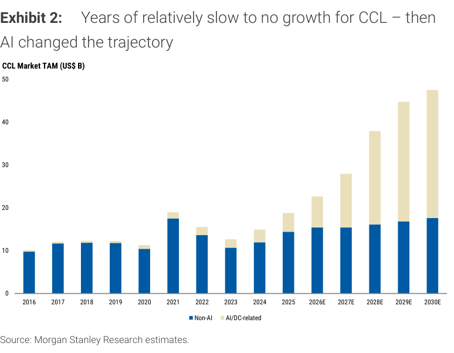

### 解讀摘要
全球 CCL TAM 從 2016 至 2024 年長期在 US\$10-19B 區間震盪（7 段不同週期），AI 資料中心的出現徹底改變了斜率。MS 預估 2025=\$19B，到 2030E=\$47B，其中 AI/DC 相關由 \$4B 增至 \$30B（貝米色段落），Non-AI CCL 僅從 \$15B 微幅增至 \$17B——整個市場成長幾乎完全由 AI 端驅動。

> **洞察一**：Non-AI CCL 到 2030E 僅從 \$15B 增至 \$17B（+13%，5 年），等於年化不到 3%——這代表「傳統 CCL 景氣」根本沒有回來，所有 TAM 成長都是 AI 純增量，不是既有市場景氣修復。買 CCL 股就是押注 AI 資料中心，沒有傳統景氣護墊。

---

## Exhibit 3｜CCL 成長拆解：84% 來自 Content Intensity

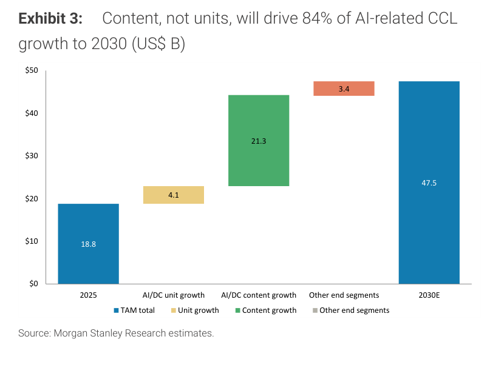

### 解讀摘要
這是整份報告最關鍵的橋接圖：CCL TAM 從 US\$18.8B（2025）→ US\$47.5B（2030E）的 \$28.7B 淨增量中，AI/DC 出貨量成長貢獻 +\$4.1B（14%），AI/DC 材料規格升級（更高等級 CCL、更多層數）貢獻 +\$21.3B（74%），其他終端市場貢獻 +\$3.4B（12%）。換言之，84% 的增量（21.3/28.7）來自每台伺服器用的 CCL 更貴、更多，不是伺服器出貨數量增加。

> **洞察二**：Content intensity 驅動的週期在買方分析中最容易低估——股票市場習慣用出貨量分析估值，但若每台 VR300 伺服器的 CCL content 比 GB300 多 90%，光是機種升級就能帶動超過一倍的材料需求，與伺服器出貨量無關。這也是為什麼即使 AI 伺服器出貨量增長趨緩，CCL 增量也不會同比縮減。

---

## Exhibit 4｜未來平台 CCL 含量預測

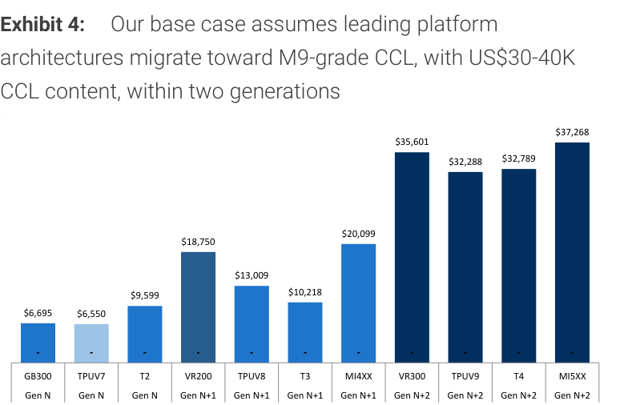

### 解讀摘要
MS 繪製現在到 Gen N+2 的各平台 CCL content per rack 預測：從 GB300（\$6,695）→ VR200（\$18,750）→ VR300（\$35,601），再到 Gen N+1 的 TPUV8（\$13,009）、T3（\$10,218）、MI4XX（\$20,099），以及 Gen N+2 的 VR300（\$35,601）→ TPUV9（\$32,288）→ T4（\$32,789）→ MI5XX（\$37,268）。MS 基本假設是兩代內主流平台將升至 M9 等級 CCL，對應每 rack CCL 含量 \$30-40K。

### 表格

| 平台 | 世代 | CCL content/rack |
|---|---|---|
| GB300 | Gen N | \$6,695 |
| TPUv7 | Gen N | \$6,550 |
| T2 | Gen N | \$9,599 |
| VR200 | Gen N+1 | \$18,750 |
| TPUv8 | Gen N+1 | \$13,009 |
| T3 | Gen N+1 | \$10,218 |
| MI4XX | Gen N+1 | \$20,099 |
| VR300 | Gen N+1 | \$35,601 |
| TPUv9 | Gen N+2 | \$32,288 |
| T4 | Gen N+2 | \$32,789 |
| MI5XX | Gen N+2 | \$37,268 |

---

## Exhibit 5｜供應商數量隨 CCL 等級遞減

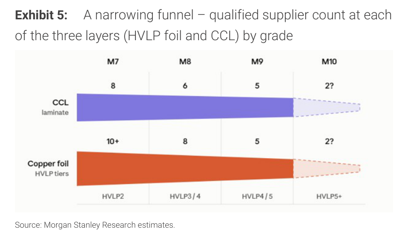

### 解讀摘要
CCL 和 HVLP 銅箔隨規格提升，能進入的供應商數量急劇縮減，形成漏斗效應。CCL 供應商：M7 等 8 家 → M8 等 6 家 → M9 等 5 家 → M10 等 2 家（尚不確定）；HVLP 銅箔供應商：HVLP2 等 10+ 家 → HVLP3/4 等 8 家 → HVLP4/5 等 5 家 → HVLP5+ 等 2 家（尚不確定）。

> **洞察三**：兩個漏斗同步收窄，但 HVLP5+ 與 M10 的供應商重疊更少——這意味著即使有其他 CCL 廠商進入，若找不到配套的 HVLP5+ 銅箔，CCL 量產仍受限。瓶頸在「配對」而非單一材料。

---

## Exhibit 6｜HVLP4 供需嚴重失衡將在 2027 達頂

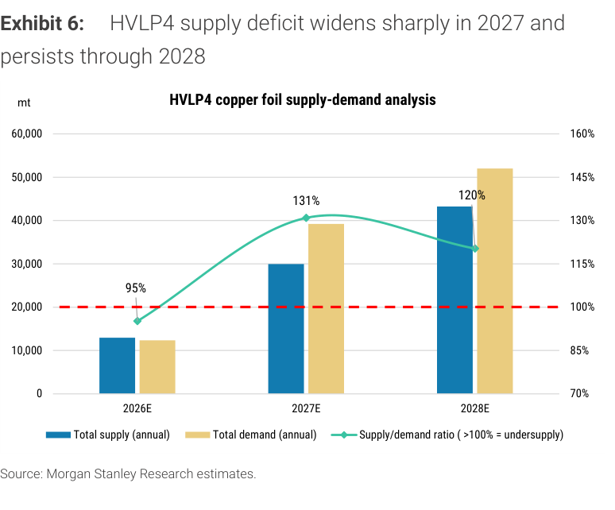

### 解讀摘要
HVLP4+ 銅箔供需分析（年度量，mt）：供給從 13,200mt（2026E）→ 30,000mt（2027E）→ 44,000mt（2028E），需求從 12,600mt → 40,000mt → 52,000mt。供需比在 2026E=95%（略有餘裕）→ 2027E=131%（嚴重短缺，超過 100% = 需求超過供給）→ 2028E=120%（仍短缺）。紅色虛線為 100% 均衡線。

> **洞察四**：2027E 需求年增 218%（12,600→40,000mt）vs 供給年增 127%（13,200→30,000mt）——即使假設所有供給計畫按時落地，缺口仍達 10,000mt。若任何廠商產能爬坡延遲，缺口更大。這個供需結構是 Co-Tech 和 Mitsui 定價權的直接依據。

---

## Exhibit 7｜KB Laminates 淨利因 E-glass 漲價急增

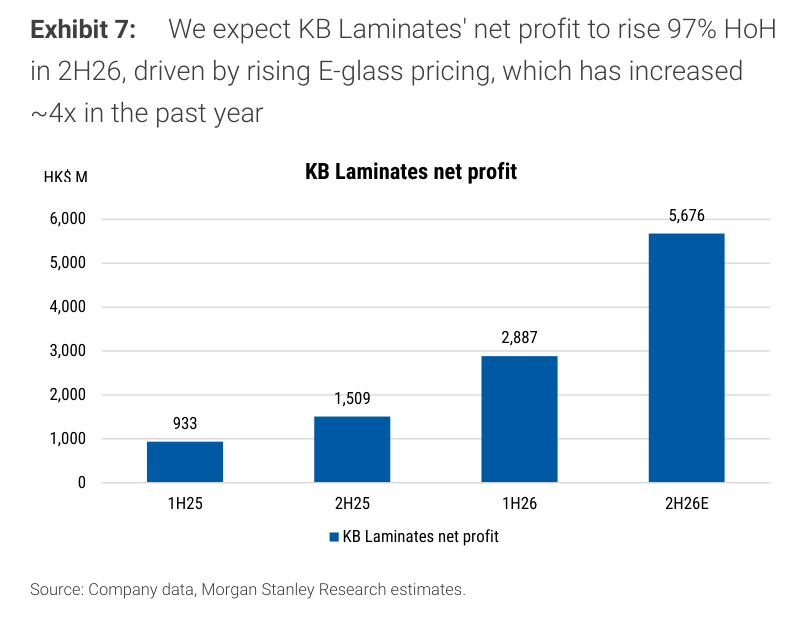

### 解讀摘要
KB Laminates 淨利趨勢：HK\$933M（1H25）→ HK\$1,509M（2H25）→ HK\$2,887M（1H26）→ HK\$5,676M（2H26E），上半年到下半年增幅 +97%。驅動因子是 E-glass yarn 在過去一年漲約 4 倍，KB Laminates 作為全球主要電子玻纖布生產商，是這波漲價最直接的受益者。

> **洞察五**：從 1H25 的 HK\$933M 到 2H26E 的 HK\$5,676M，8 個月內淨利增長 508%——若 E-glass 漲價持續，KB Laminates 的獲利彈性極其巨大。MS 將其列為啟動覆蓋的 Overweight 股之一，玻纖布漲價是核心催化劑。

---

## Exhibit 9｜CCL 等級對應供應商能力表

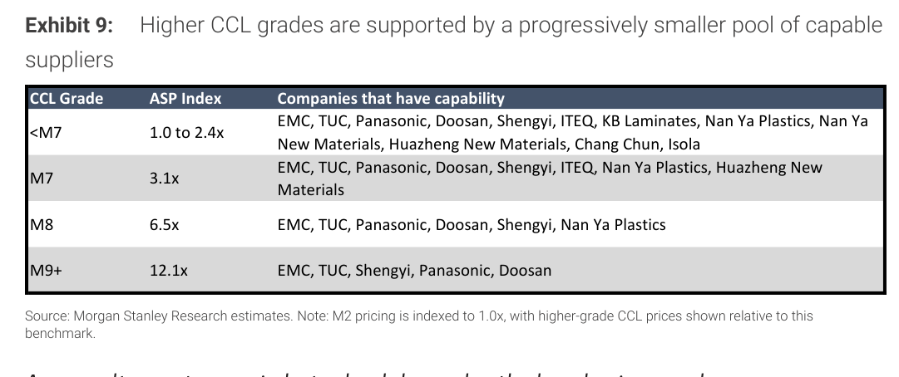

### 解讀摘要
CCL 等級（以信號損耗為標準，M2-M9+）對應 ASP 指數與有能力供貨的廠商清單。

### 表格

| CCL 等級 | ASP 指數 | 具備能力的廠商 |
|---|---|---|
| <M7 | 1.0–2.4x | EMC, TUC, Panasonic, Doosan, Shengyi, ITEQ, KB Laminates, Nan Ya Plastics, Nan Ya New Materials, Huazheng, Chang Chun, Isola |
| M7 | 3.1x | EMC, TUC, Panasonic, Doosan, Shengyi, ITEQ, Nan Ya Plastics, Huazheng |
| M8 | 6.5x | EMC, TUC, Panasonic, Doosan, Shengyi, Nan Ya Plastics |
| M9+ | 12.1x | EMC, TUC, Shengyi, Panasonic, Doosan |

> **洞察六**：每升一個等級，供應商就少 1-3 家。M8 以上 Shengyi 和 Nan Ya Plastics 就掉出；M9+ 只剩 EMC、TUC、Shengyi、Panasonic、Doosan 五家——而 MS 認為 Shengyi 的 M9 資格尚不確定，有效供應商可能更少。

---

## Exhibit 11｜科技產業週期定位圖

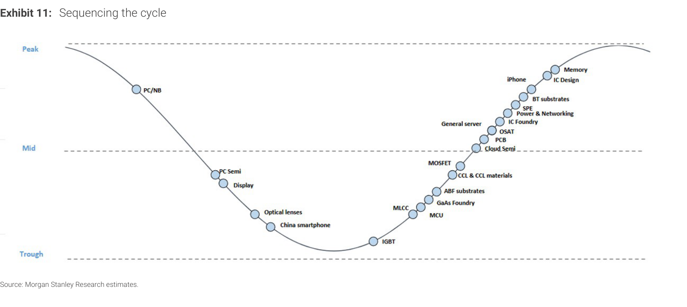

### 解讀摘要
MS 以「週期定位圖」（Peak → Mid → Trough）呈現各科技子產業的當前位置。PC/NB 在接近 Peak，即將下行；Memory、IC Design、iPhone 仍在 Peak 附近；PCB、Cloud Semi 位於 Mid（中段）；CCL & CCL materials 和 ABF substrates 略低於 Mid，仍在上行段；IGBT、MCU 接近 Trough。整體訊號：CCL/PCB 材料仍在週期上行的中後段，不是 Peak。

> **洞察七**：CCL & CCL materials 被定位在「低於 Mid」——這表示 MS 認為材料週期還沒到高點，仍有上行空間。這個定位支持 foundation report 在此刻發佈的時機：趁供需緊張惡化之前，為客戶建立系統性認識。

---

## Exhibit 12｜MS 估算 Nvidia 各平台 CF/CCL/PCB 含量

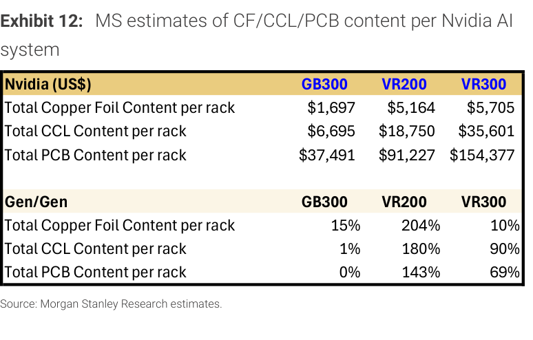

### 解讀摘要
每 rack 銅箔、CCL、PCB 含量（US\$）及世代增幅：

### 表格

| 項目 | GB300 | VR200 | VR300 |
|---|---|---|---|
| **銅箔含量/rack** | \$1,697 | \$5,164 | \$5,705 |
| **CCL 含量/rack** | \$6,695 | \$18,750 | \$35,601 |
| **PCB 含量/rack** | \$37,491 | \$91,227 | \$154,377 |
| Gen/Gen 銅箔增幅 | — | +204% | +10% |
| Gen/Gen CCL 增幅 | — | +180% | +90% |
| Gen/Gen PCB 增幅 | — | +143% | +69% |

> **洞察八**：VR200 是關鍵升級——PCB +143%、CCL +180%、銅箔 +204%，這一代的 content 爆增是因為導入了全新的 Midplane（18 片）、BlueField（18 片）、ConnectX（72 片）PCB 模組，這些在 GB300 根本不存在。VR300 的再增幅（+69-90%）則是層數繼續提升的效果。

---

## Exhibit 13｜MS 估算 AMD 各平台 CF/CCL/PCB 含量

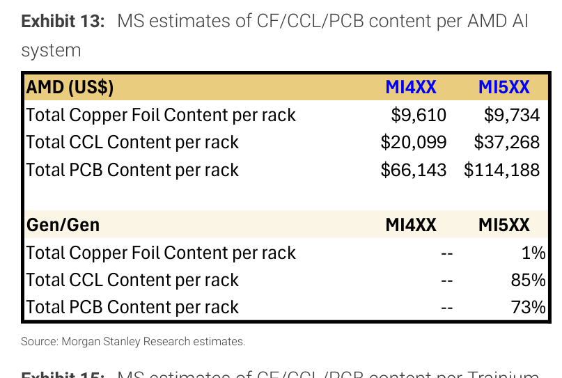

### 解讀摘要
AMD ASIC 平台（MI4XX、MI5XX）每 rack 含量：

### 表格

| 項目 | MI4XX | MI5XX |
|---|---|---|
| **銅箔含量/rack** | \$9,610 | \$9,734 |
| **CCL 含量/rack** | \$20,099 | \$37,268 |
| **PCB 含量/rack** | \$66,143 | \$114,188 |
| Gen/Gen CCL 增幅 | — | +85% |
| Gen/Gen PCB 增幅 | — | +73% |

> **洞察九（配合 Exhibit 12）**：AMD MI5XX 的 CCL content（\$37,268）與 Nvidia VR300（\$35,601）非常接近——兩個最高端平台都指向同樣的 M9/M10 等級需求。這不是 Nvidia 專有現象，而是全平台的規格趨同，對 EMC、TUC 等 M9 合格廠的訂單保障更強。

---

## Exhibit 14｜MS 估算 Google TPU 各平台 CF/CCL/PCB 含量

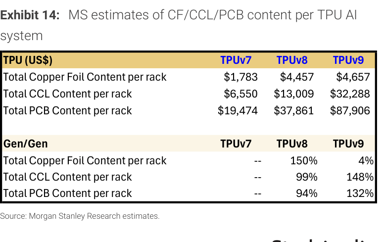

### 解讀摘要
Google TPU 各平台每 rack 含量（TPUv8、TPUv9）：

### 表格

| 項目 | TPUv8 | TPUv9 |
|---|---|---|
| **銅箔含量/rack** | \$4,457 | \$4,657 |
| **CCL 含量/rack** | \$13,009 | \$32,288 |
| **PCB 含量/rack** | \$37,861 | \$87,906 |
| Gen/Gen CCL 增幅 | — | +148% |
| Gen/Gen PCB 增幅 | — | +132% |

---

## Exhibit 15｜MS 估算 Amazon Trainium 各平台 CF/CCL/PCB 含量

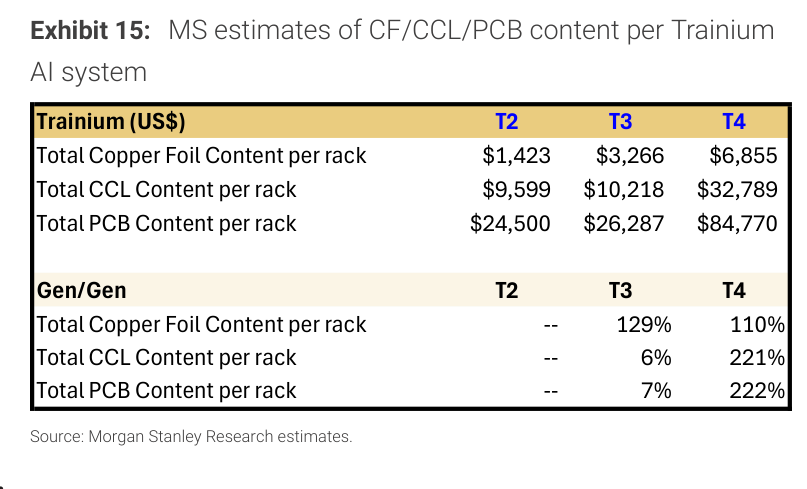

### 解讀摘要
Amazon Trainium 各平台每 rack 含量（T2、T3、T4）：

### 表格

| 項目 | T2 | T3 | T4 |
|---|---|---|---|
| **銅箔含量/rack** | \$1,423 | \$3,266 | \$6,855 |
| **CCL 含量/rack** | \$9,599 | \$10,218 | \$32,789 |
| **PCB 含量/rack** | \$24,500 | \$26,287 | \$84,770 |
| Gen/Gen CCL 增幅 | — | +6% | +221% |
| Gen/Gen PCB 增幅 | — | +7% | +222% |

> **洞察十**：Trainium 從 T3 到 T4 的 CCL/PCB content 增幅達 +221-222%——遠超 Nvidia VR200（+143-180%）的升幅。AWS T4 將是 CCL 需求的重要增量，且 T3→T4 的跨代跳躍非常陡峭，代表這一代升規的衝擊集中在單一時間點。

---

## Exhibit 16｜大中華 CCL 與銅箔供應商 P/E 走勢

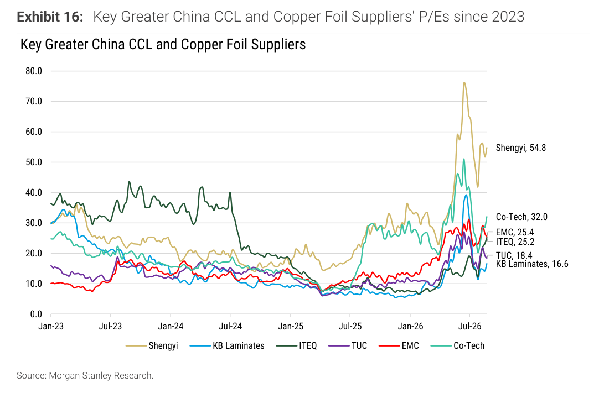

### 解讀摘要
大中華 CCL 和銅箔供應商的 P/E 走勢（2023 年 1 月至 2026 年 8 月）：各公司從 2025 年初的 6-10x 的低谷，隨 AI 需求確認而急速拉升，2026 年 7 月 Shengyi 曾短暫衝至 76x。截至 2026 年 8 月底，Shengyi=54.8x（最高），Co-Tech=32.0x，EMC=25.4x，ITEQ=25.2x，TUC=18.4x，KB Laminates=16.6x。

> **洞察十一**：Shengyi 54.8x 是顯著溢價——MS 對 Shengyi 評等為 Equal-weight（不是 Overweight），隱含 MS 認為市場對 Shengyi 的 M8+ 認證能力過於樂觀。若 Shengyi M9 驗證失敗，54x P/E 下修空間大。KB Laminates（16.6x）反而估值最低、但 MS 給 Overweight——玻纖布漲價帶動的盈利上修空間被市場低估。

---

## Exhibit 19｜PCB 供應鏈全流程圖

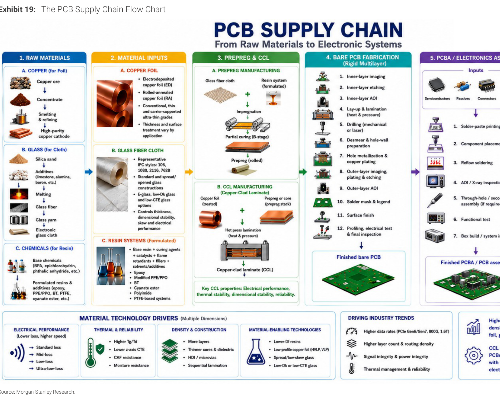

### 解讀摘要
全景式 PCB 供應鏈流程圖，從原料（銅礦、矽砂、樹脂化學品）到成品（Data Centers、Consumer Electronics、Automotive、Industrial、Aerospace）的六個層次：①原料 → ②材料輸入（銅箔 ED/RA、玻纖布、樹脂）→ ③Prepreg & CCL 製造 → ④裸板 PCB 製造（12 道工序）→ ⑤PCBA/電子組裝 → ⑥終端產品。底部說明四個材料技術驅動因素：電氣性能（低 Df 需求）、熱可靠性（低 CTE）、密度與層數、材料使能技術（HVLP 銅箔、低 Dk 玻璃）。

---

## Exhibit 20｜全球 PCB TAM 預測

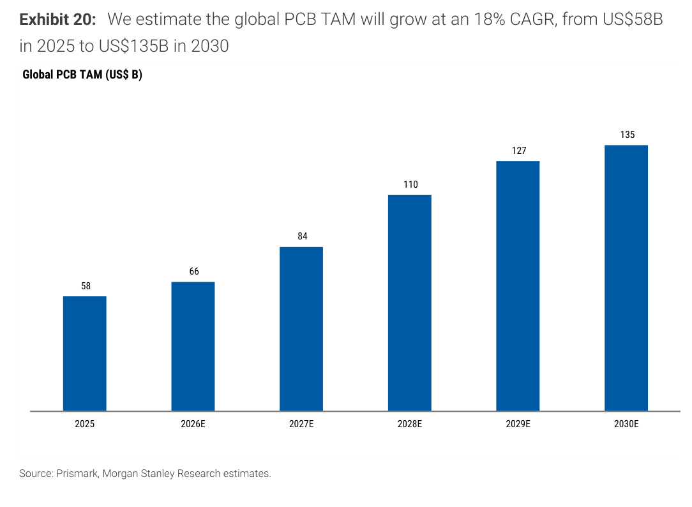

### 解讀摘要
全球 PCB TAM（US\$B）：2025=58B → 2026E=66B → 2027E=84B → 2028E=110B → 2029E=127B → 2030E=135B，2025-2030 CAGR 18%。整體 PCB 市場規模是 CCL 的 3 倍，增速也略低（18% vs CCL 的 20%）。

> **洞察十二（配合 Exhibit 22）**：AI/DC PCB（從 \$13B→\$86B，CAGR 45%）佔 2030E 總 PCB 的 64%，意味著非 AI PCB（\$45B→\$49B）幾乎零成長。整體 PCB 18% CAGR 的背後是結構大轉型：2030E 的 PCB 業務本質上是一個「AI 公司」。

---

## Exhibit 21｜AI/DC PCB 佔總 PCB TAM 的比例預測

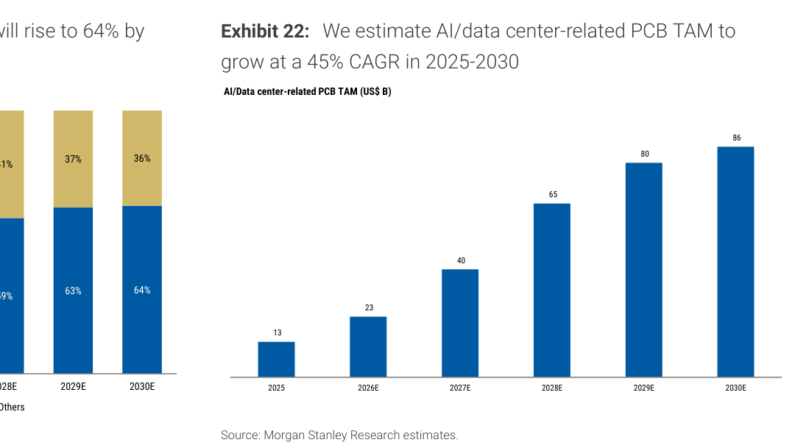

### 解讀摘要
AI/DC 相關 PCB 佔全球 PCB TAM 比例快速提升：2023=21% → 2024=20% → 2025=21% → 2026E=12% → 2027E=45% → 2028E=55% → 2029E=62% → 2030E=63%。在 2027E 出現跳升（43%→45%），與 Nvidia VR200/ASIC 平台大規模量產時點一致。

---

## Exhibit 22｜AI/DC PCB TAM 預測（絕對值）

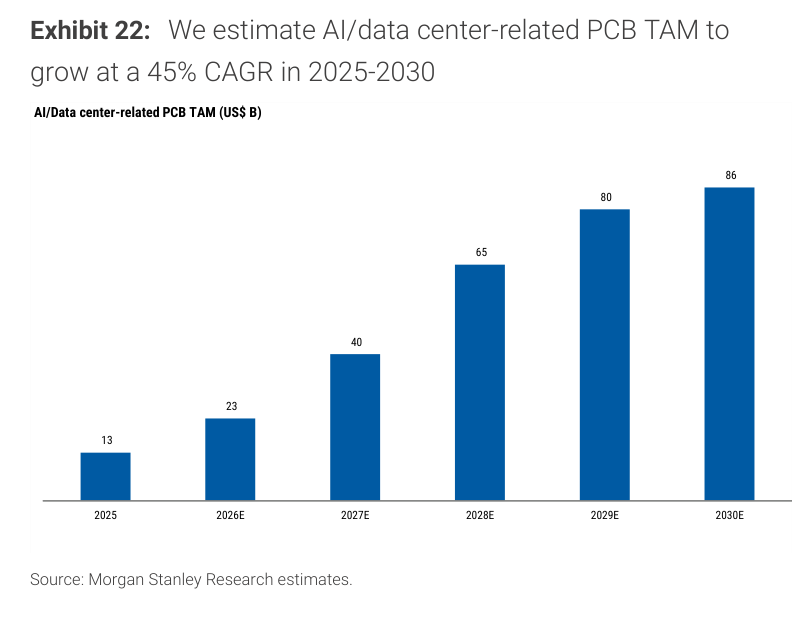

### 解讀摘要
AI/DC 相關 PCB TAM（US\$B）：2025=13 → 2026E=23 → 2027E=40 → 2028E=65 → 2029E=80 → 2030E=86，2025-2030 CAGR 45%。這個增速是整體 PCB TAM（18% CAGR）的 2.5 倍，是整體 CCL TAM（20% CAGR）的 2.25 倍。PCB 是鏈條中 content 成長最快的層次。

---

## Exhibit 23｜AI/DC PCB TAM 各終端市場拆解

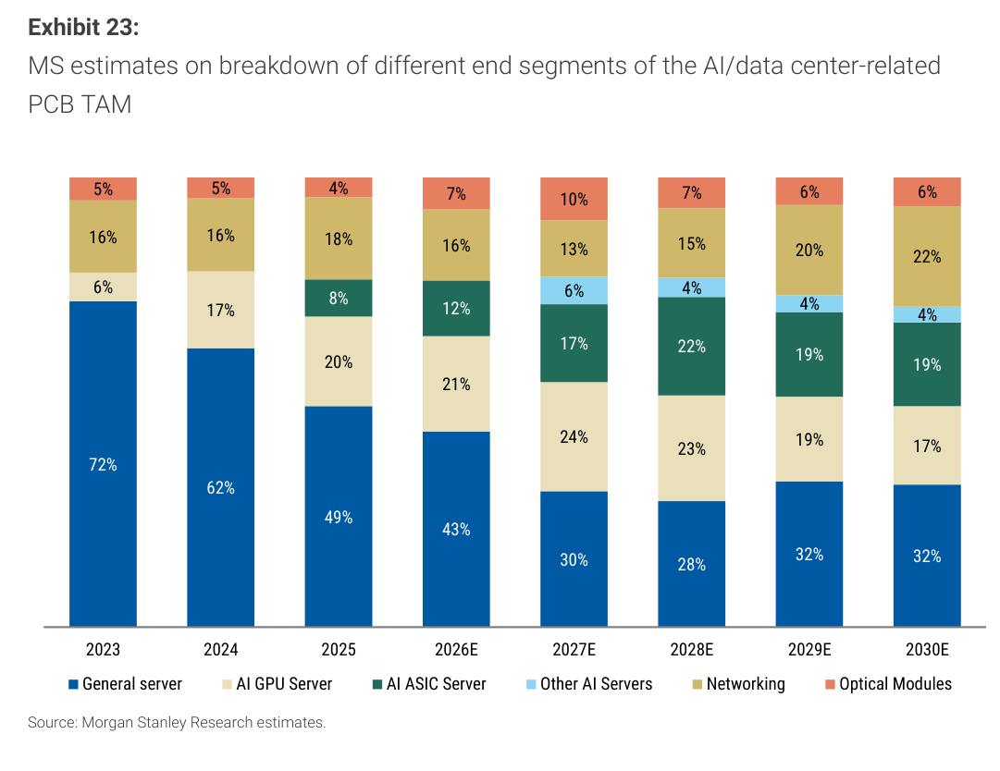

### 解讀摘要
AI/DC PCB TAM 按終端市場拆解：General server 比例快速萎縮（72%→32%），AI GPU Server 和 AI ASIC Server 雙雙崛起。2030E 結構：General server 32%、AI GPU Server 17%、AI ASIC Server 19%、Other AI Servers 4%、Networking 22%、Optical Modules 6%。Networking 在 2030E 達 22% 是重要轉變——800G/1.6T/3.2T 交換器 PCB 大量導入 HVLP4 銅箔。

---

## Exhibit 24｜AI PCB 生產週期比一般 PCB 長 2.2 倍

### 解讀摘要
PCB 生產甘特圖對比：Normal PCB 全程 46.0 天（6.6 週）；Advanced AI PCB 全程 102.0 天（14.6 週），整整多了 56 天。關鍵瓶頸在：玻纖布生產（13→28 天，+115%）、銅箔生產（6→15 天，+150%）、CCL 生產（14→25 天，+79%）、PCB 製造本身（10→40 天，+300%）。

> **洞察十三**：AI PCB 的 PCB fabrication 週期從 10 天跳到 40 天（+300%），是所有工序中增幅最大的。這意味著即使材料充足，AI PCB 的產能擴張也受到製程複雜度的硬性限制——供給端瓶頸不只在材料，也在製造能力本身。這也解釋了為什麼 AI PCB 會有較高的定價權。

---

## Exhibit 25｜MS 完整覆蓋股票評分排名

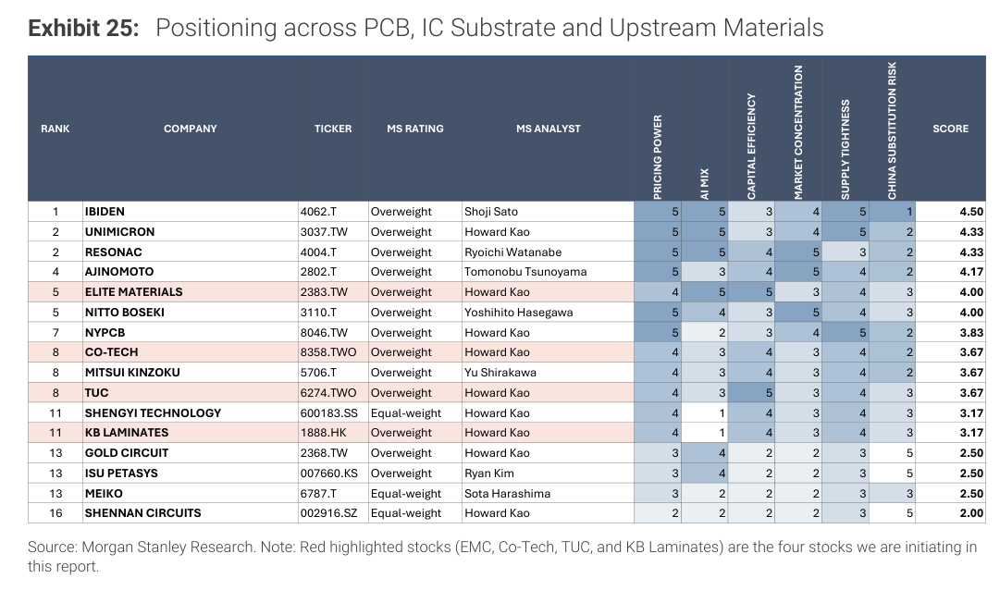

### 解讀摘要
MS 以定價權（Pricing Power）、AI 組合（AI Mix）、資本效率、市場集中度、供應緊張度、中國替代風險六項維度評分，列出 16 家公司排名。4 檔新啟動覆蓋（EMC、Co-Tech、TUC、KB Laminates，紅底色）全部為 Overweight。

### 表格

| 排名 | 公司 | Ticker | 評等 | 評分 |
|---|---|---|---|---|
| 1 | Ibiden | 4062.T | OW | 4.50 |
| 2 | Unimicron | 3037.TW | OW | 4.33 |
| 2 | Resonac | 4004.T | OW | 4.33 |
| 4 | Ajinomoto | 2802.T | OW | 4.17 |
| 5 | **Elite Materials (EMC)** | 2383.TW | OW | 4.00 |
| 5 | Nitto Boseki | 3110.T | OW | 4.00 |
| 7 | NYPCB | 8046.TW | OW | 3.83 |
| 8 | **Co-Tech** | 8358.TWO | OW | 3.67 |
| 8 | Mitsui Kinzoku | 5706.T | OW | 3.67 |
| 8 | **TUC** | 6274.TWO | OW | 3.67 |
| 11 | Shengyi Technology | 600183.SS | EW | 3.17 |
| 11 | **KB Laminates** | 1888.HK | OW | 3.17 |
| 13 | Gold Circuit | 2368.TW | OW | 2.50 |
| 13 | ISU Petasys | 007660.KS | OW | 2.50 |
| 13 | Meiko | 6787.T | EW | 2.50 |
| 16 | Shennan Circuits | 002916.SZ | EW | 2.00 |

> **洞察十四**：Ibiden（ABF 基板）評分最高（4.50），但本報告聚焦 CCL/銅箔/玻纖布。在純 CCL 範疇，EMC 評分 4.00（= 本報告新啟動中最高），顯示 MS 認為 EMC 在定價權、AI 組合和資本效率上均優於 TUC 和 KB Laminates。

---

## Exhibit 26｜CCL TAM 歷史七段週期與未來預測

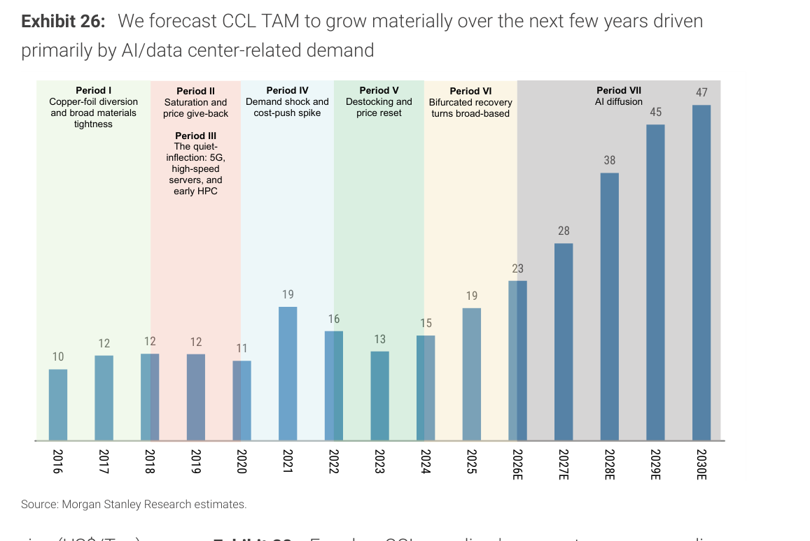

### 解讀摘要
CCL TAM（US\$B，2016-2030E），分七個市場時期：Period I（銅箔分流/材料緊張）、II（飽和與降價）、III（5G/高速伺服器靜默拐點）、IV（需求衝擊+成本推動漲價，2021 高點 \$19B）、V（去庫存+價格重設，2023 低點 \$13B）、VI（分岔式復甦，2025=\$19B）、VII（AI 擴散，2026-2030E，\$23B→\$47B）。

> **洞察十五**：Period VII 的斜率（19→47 in 5 years）遠比此前任何週期陡——最接近的是 Period I（飽和前），但那次的 \$10→\$19（+90%，5 年）遠不如 Period VII 的 \$19→\$47（+147%，5 年）。若 AI CapEx 維持當前軌道，CCL 將進入前所未有的成長週期。

---

## Exhibit 27｜CCL TAM 與 LME 銅價相關性

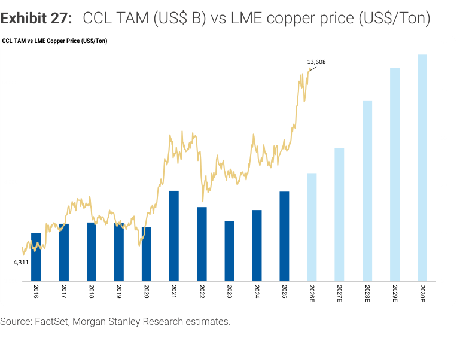

### 解讀摘要
CCL TAM（條形，US\$B）與 LME 銅價（線，US\$/ton）疊加走勢圖（2016-2030E）。LME 銅在 2026 年創歷史高點 13,608 US\$/ton，與 CCL TAM 急升同步。但 MS 強調此相關性是「順向」而非因果：AI 驅動的 CCL demand 上升才是主因，銅價是輔助推力（銅是 CCL 成本的 33%，直接影響 ASP）。

---

## Exhibit 28｜四大 CCL 廠商資本支出歷史（EMC、TUC、ITEQ、Shengyi）

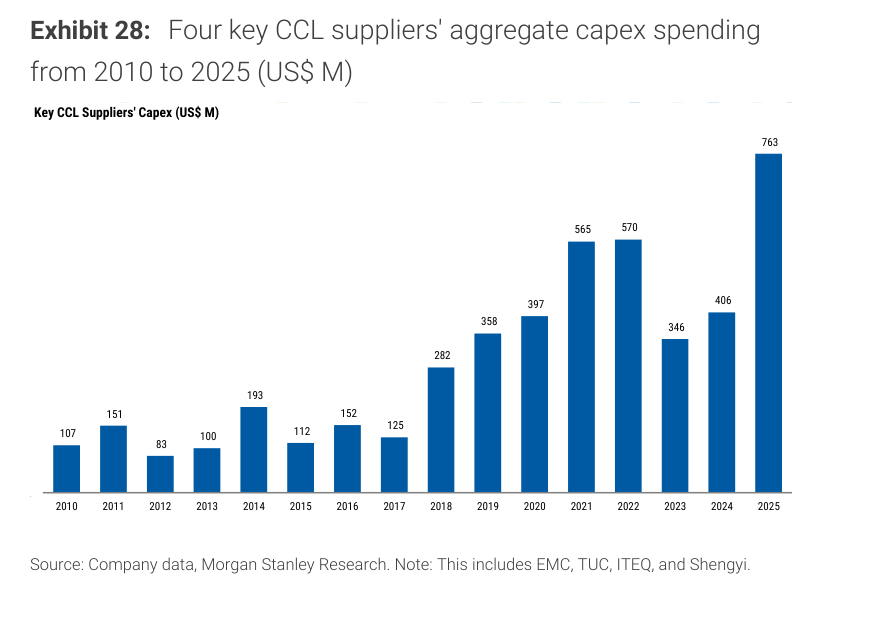

### 解讀摘要
四家 CCL 廠商（EMC、TUC、ITEQ、Shengyi）合計 Capex（US\$M）：2010-2022 年在 US\$83-570M 之間，2023-2024 降至 \$346-406M（去庫存週期縮減投資）→ 2025 跳升至 US\$763M（歷史新高）。這確認頭部廠商已確認 AI 需求、開始全力擴張。

> **洞察十六**：2025 年 \$763M 的合計 Capex 比 2022 年高峰（\$570M）高出 34%——更重要的是，這次 Capex 投向的是 M8/M9 等級的「品質擴產」而非傳統 M4-M6 的「量的擴產」，ROI 更高，因為高等級 CCL 的 ASP 是低等級的 6-17 倍。

---

## Exhibit 29｜AI/DC CCL TAM 47% CAGR 預測

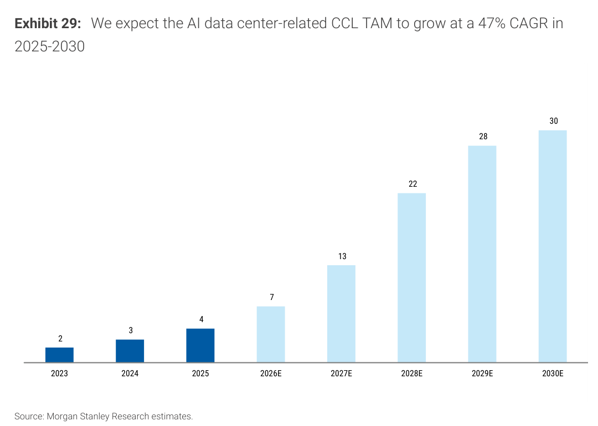

### 解讀摘要
AI/DC 相關 CCL TAM（US\$B）：2023=2 → 2024=3 → 2025=4 → 2026E=7 → 2027E=13 → 2028E=22 → 2029E=28 → 2030E=30，CAGR 47%（2025-2030）。注意 2026E 的 \$7B 是個拐點——從此 AI/DC CCL 開始主導整體 CCL 成長節奏。

---

## Exhibit 30｜AI/DC CCL 佔總 CCL TAM 比例

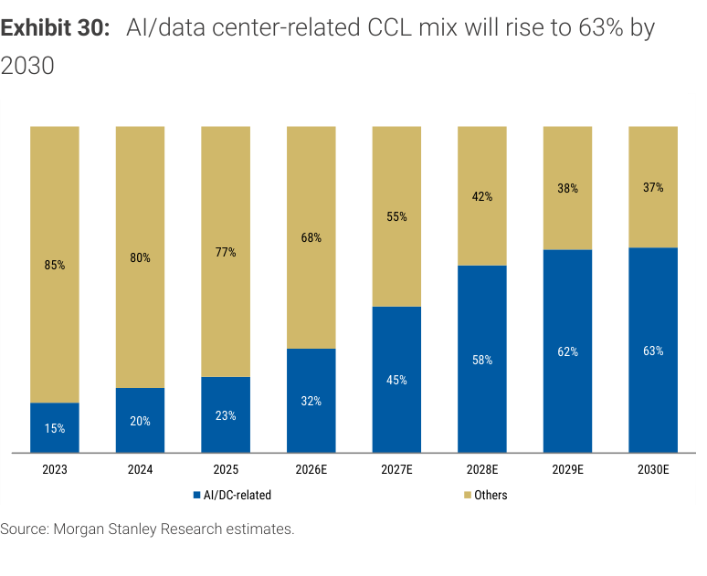

### 解讀摘要
AI/DC CCL 比例：2023=15% → 2025=23% → 2026E=32% → 2027E=45% → 2028E=58% → 2030E=63%。到 2030E，AI 資料中心相關的 CCL 將佔全球生產的 63%，CCL 業已從一個「廣泛終端市場」行業轉型為「AI infrastructure material」行業。

---

## Exhibit 31｜AI/DC CCL TAM 終端市場拆解

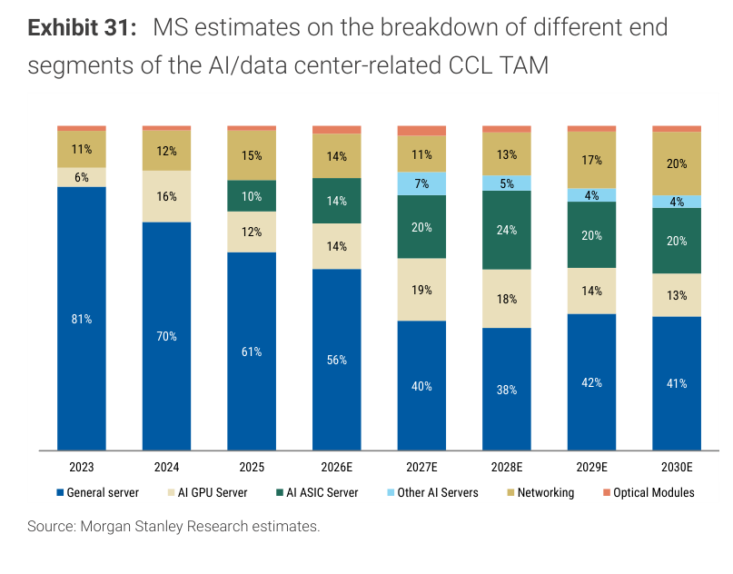

### 解讀摘要
AI/DC CCL TAM 按終端市場拆解趨勢（2023-2030E）：General server 比例從 81% 下降至 41%；AI GPU Server 從 6%→13%；AI ASIC Server 從 0%→20%；Networking 從 11%→20%（重要：交換器需要高等級 CCL 的 Switch PCB）；Optical Modules 從 0%→4%（Coherent 光收發器也用 CCL）。

---

## Exhibit 32｜Nvidia AI 系統 CCL 演進路線圖

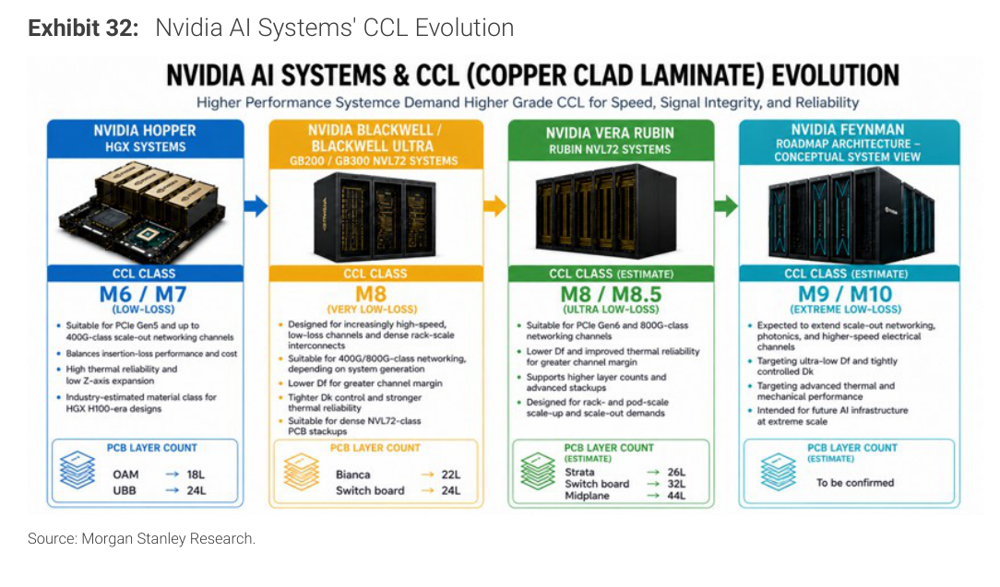

### 解讀摘要
Nvidia 四代 AI 系統的 CCL 等級演進：Hopper（H100/H200）M6/M7 → Blackwell/GB300 M8（Very Low-Loss）→ Vera Rubin（VR200/VR300）M8/M8.5（Ultra Low-Loss）→ Feynman（概念）M9/M10（Extreme Low-Loss）。PCB 層數同步提升：H100 OAM=18L/UBB=24L → Blackwell Bianca=22L/Switch=24L → Vera Rubin Strata=26L/Switch=32L/Midplane=44L → Feynman TBD。

> **洞察十七**：Midplane 在 Vera Rubin 達到 44 層，是整個 AI 伺服器最複雜的 PCB，且需要 M8.5 等級 CCL，目前市場上能供貨的廠商極少（只有 EMC 確認）。Feynman 的 M9/M10 需求目前「供應商 TBD」，意味著 2027-2028 年將出現認證空窗期，先通過認證者贏者通吃。

---

## Exhibit 33｜Nvidia 各 CCL 零件 ASP 與 Content 細拆

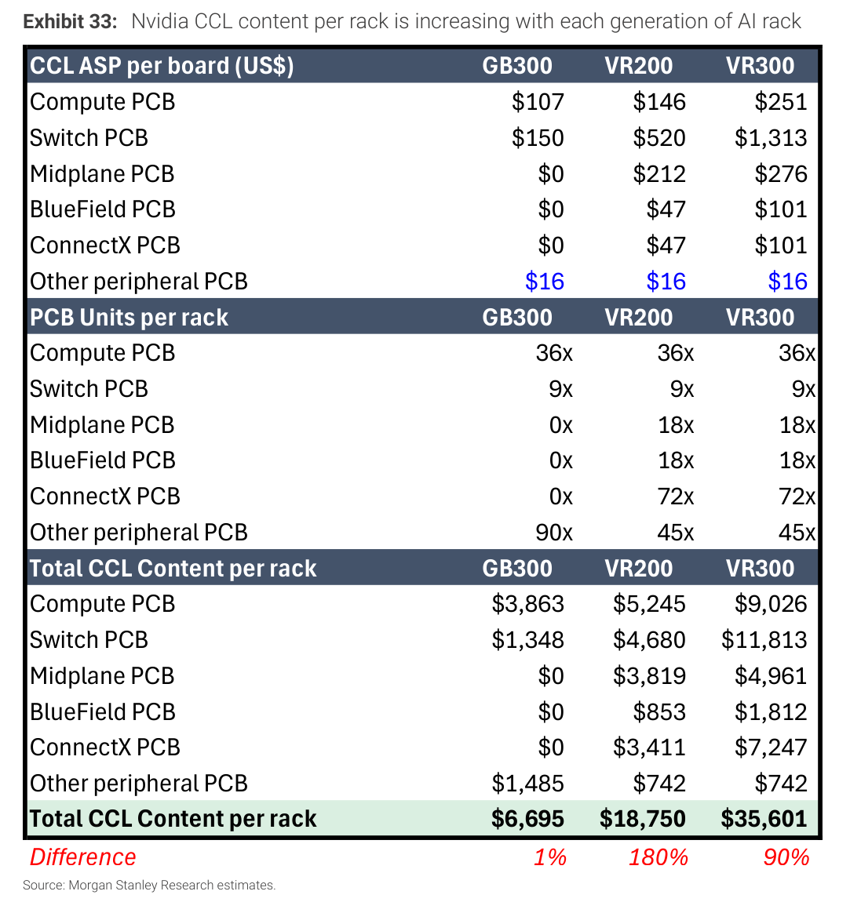

### 解讀摘要
逐 PCB 類型拆解 Nvidia GB300→VR200→VR300 的 CCL ASP、PCB 數量和 CCL 含量：

### 表格

| PCB 類型 | CCL ASP（GB300） | CCL ASP（VR200） | CCL ASP（VR300） | 數量/rack（VR200） | CCL Content（VR200） |
|---|---|---|---|---|---|
| Compute PCB | \$107 | \$146 | \$251 | 36 | \$5,245 |
| Switch PCB | \$150 | \$520 | \$1,313 | 9 | \$4,680 |
| Midplane PCB | \$0 | \$212 | \$276 | 18 | \$3,819 |
| BlueField PCB | \$0 | \$47 | \$101 | 18 | \$853 |
| ConnectX PCB | \$0 | \$47 | \$101 | 72 | \$3,411 |
| **Total CCL/rack** | **\$6,695** | **\$18,750** | **\$35,601** | — | — |
| **Gen/Gen 差異** | — | **+180%** | **+90%** | — | — |

> **洞察十八**：Switch PCB 的 CCL ASP 從 GB300 的 \$150 跳到 VR200 的 \$520（+247%），再到 VR300 的 \$1,313（+152%）。這是因為 Switch PCB 需要 M8/M8.5 甚至 M9+ 等級 CCL，且 Switch PCB 層數從 24L 提升到 32L。供應 Switch PCB CCL 的廠商（主要 EMC、Shengyi）將享受最高的 ASP 升級效應。

---

## Exhibit 34｜Taiflex PTFE CCL 無玻纖布堆疊結構

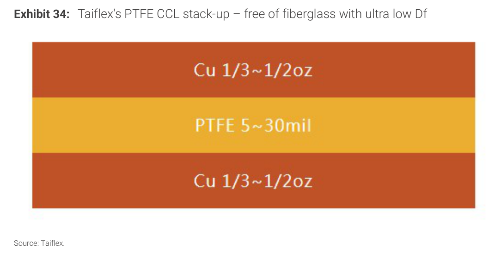

### 解讀摘要
Taiflex 的 PTFE CCL 截面示意圖：Cu (1/3~1/2 oz) / PTFE (5~30 mil) / Cu (1/3~1/2 oz) 三層結構，完全不含玻纖布（glass-free）。PTFE 基板提供極低 Df（信號損耗接近零），是 M10 等級的候選材料之一，適用於 800G/1.6T+ 的高速信號完整性需求。Taiflex 是少數能供應 PTFE-based CCL 的廠商，其 Switch PCB CCL 供應地位值得關注。

---

## Exhibit 35｜CCL 等級對應 ASP 指數

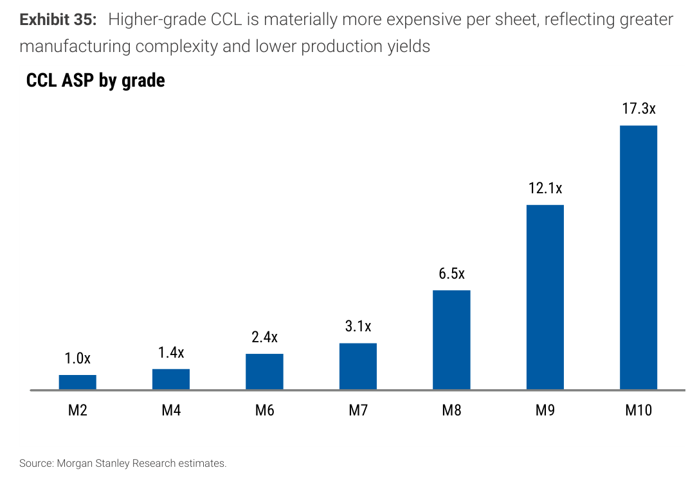

### 解讀摘要
CCL ASP by grade（以 M2=1.0x 為基準）：M2=1.0x → M4=1.4x → M6=2.4x → M7=3.1x → M8=6.5x → M9=12.1x → M10=17.3x。M7→M8 的 ASP 跳升最大（3.1x→6.5x = +110%），M8→M9 再跳 87%（6.5x→12.1x）。

> **洞察十九**：從 M7 到 M8 的 ASP 跳升幅度（+110%）遠超從 M2 到 M7 的累積升幅（+210%，但跨 5 個等級）。換言之，「通過 M8 資格認證」對一家 CCL 廠商來說是最大的單一收益跳躍點。這解釋了為什麼 Shengyi 即使評等只有 EW，市場仍給 55x 的 P/E——投資人在賭 Shengyi M8 通過認證後的 ASP 升級。

---

## Exhibit 36｜Nvidia AI 伺服器 CCL 完整規格表

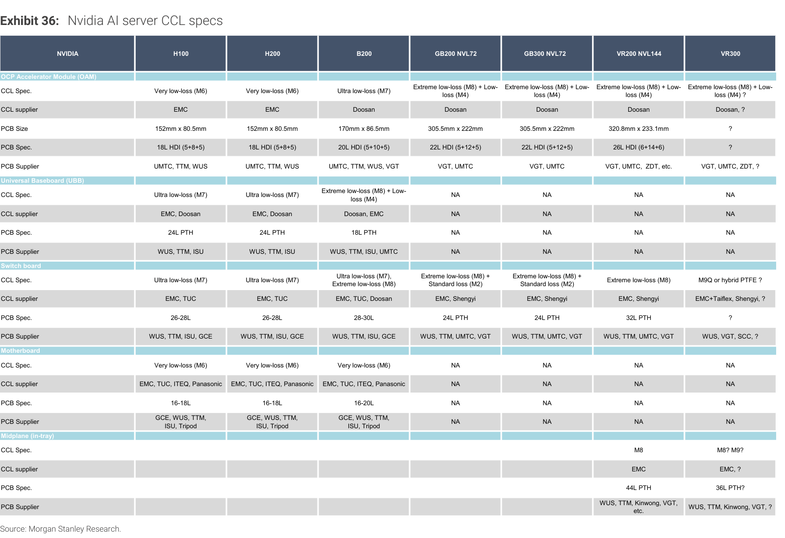

### 解讀摘要
涵蓋 H100→H200→B200→GB200→GB300→VR200→VR300 各平台、四類 PCB（OAM、UBB、Switch board、Motherboard/Midplane）的 CCL 等級、CCL 供應商、PCB 規格、PCB 供應商完整對照表。關鍵觀察：OAM CCL 等級從 H100/H200 的 M6 → B200 的 M7 → GB300 的 M8 → VR200/VR300 的 M8/M8.5+；Switch board CCL 等級從 H100 M7 → GB300 M8 → VR300 M9 或 hybrid PTFE。Doosan 是 OAM 高端部分主要供應商，EMC+TUC 主導 Switch board。

---

## Exhibit 37｜ASIC 伺服器 CCL 完整規格表（Google、AWS、Meta）

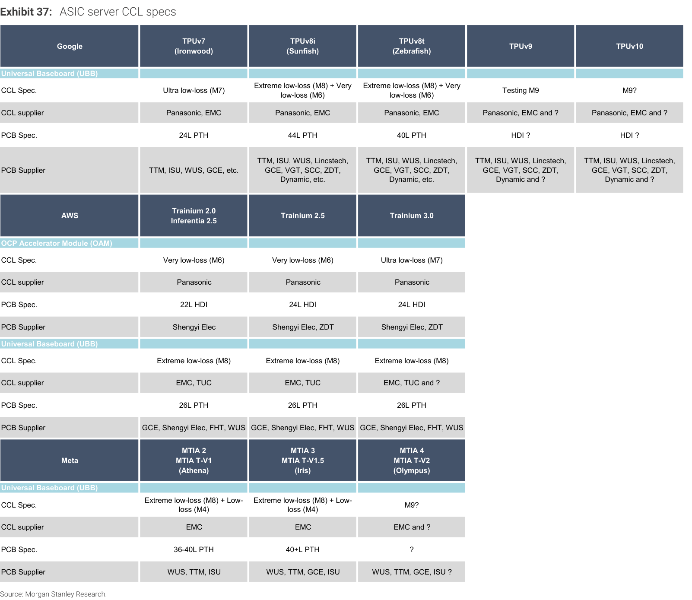

### 解讀摘要
Google TPUv7→TPUv10、AWS Trainium2→Trainium3.0、Meta MTIA2→MTIA4 各平台的 CCL 和 PCB 規格完整對照。Google UBB 從 M7（TPUv7）升至 M8+Very Low-Loss（TPUv8i）→ M9（TPUv9）；AWS OAM 從 M6 維持到 M7（Trainium3.0）；Meta UBB 從 M8+Low-loss 升至 M9（MTIA4）。Panasonic 和 EMC 是 Google/Meta 高端平台主要 CCL 供應商；EMC+TUC 主導 AWS UBB。

---

## Exhibit 38｜全球 R-PCB 銅箔 TAM 預測

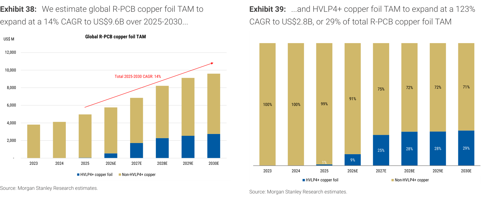

### 解讀摘要
全球 R-PCB 銅箔 TAM（US\$M）：2023=3,830 → 2025=4,960 → 2026E=5,760 → 2027E=6,860 → 2028E=8,230 → 2030E=9,600，CAGR 14%（2025-2030）。其中 HVLP4+ 銅箔（深藍色）從 2026E 開始快速擴大，而 Non-HVLP4+ 銅箔增速溫和——整體 TAM 成長的絕大多數來自 HVLP4+。

---

## Exhibit 39｜HVLP4+ 銅箔 TAM：123% CAGR，2030E 達 US\$2.8B

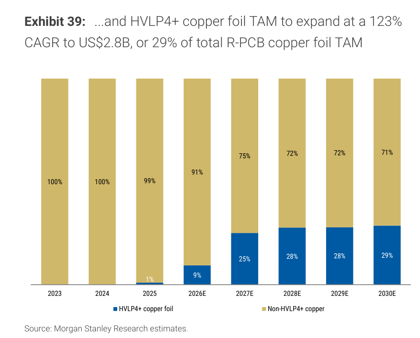

### 解讀摘要
HVLP4+ 佔 R-PCB 銅箔 TAM 比例（%）：2023=0% → 2025=1% → 2026E=9% → 2027E=25% → 2028E=28% → 2030E=29%。對應絕對值：從 2025 的 <\$50M → 2030E 的 US\$2.8B，2025-2030 CAGR 123%。

> **洞察二十（配合 Exhibit 38）**：HVLP4+ 從不到 US\$50M 成長到 \$2.8B（123% CAGR）——但整體 R-PCB 銅箔 TAM 只成長 14%。這意味著 HVLP4+ 是從低谷起步的超高速細分市場，總量還不大（僅佔整體 29%），但絕對增量（\$2.75B）已是整體 TAM 增量（\$4.6B）的 60%。

---

## Exhibit 40｜AI/DC 銅箔佔 R-PCB 銅箔市場比例

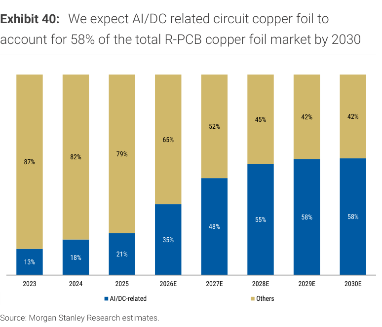

### 解讀摘要
AI/DC 相關電路銅箔佔全球 R-PCB 銅箔市場比例：2023=13% → 2025=21% → 2026E=35% → 2027E=48% → 2028E=55% → 2030E=58%。到 2030E，超過一半的 R-PCB 銅箔需求來自 AI 資料中心，與 CCL 的結構轉型高度同步。

---

## Exhibit 41｜AI/DC 銅箔市場終端客戶拆解

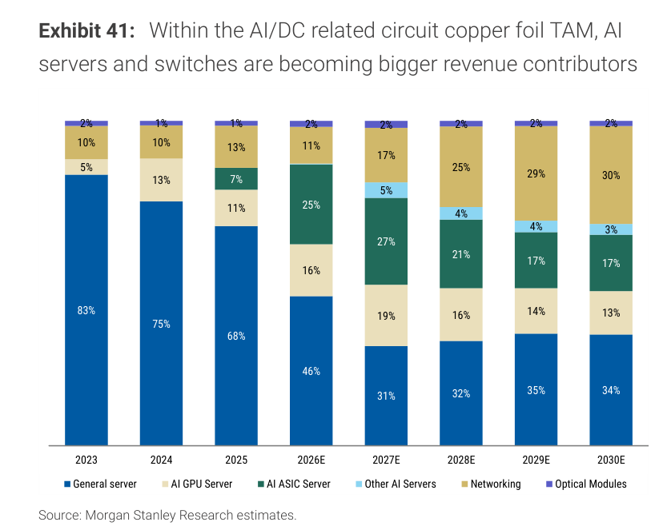

### 解讀摘要
AI/DC R-PCB 銅箔需求按終端客戶拆解：General server 比例下降（83%→34%），AI ASIC Server 和 AI GPU Server 快速崛起，Networking（800G/1.6T switch PCB）成長至 30%（2030E），Optical Modules 貢獻 2%。最值得注意的是 AI ASIC Server（深色）2027E 達到 27%，2030E 維持 17%——ASIC 平台的 PCB 通常需要更高規格銅箔，是 HVLP4+ 需求的第二大來源。

---

## Exhibit 42｜Mitsui Kinzoku 銅箔產品金字塔（VSP™ 系列）

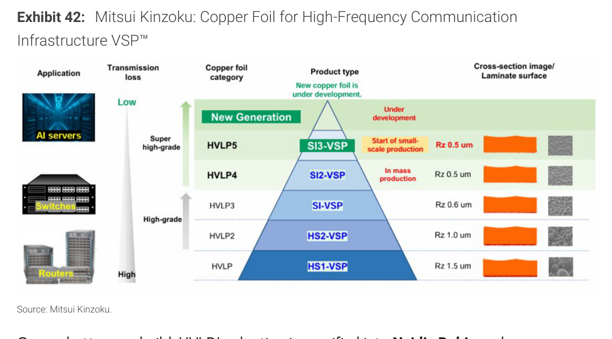

### 解讀摘要
Mitsui Kinzoku 的 VSP（Variable Surface Profile）銅箔產品線金字塔，從底部到頂部：HVLP（HS1-VSP，Rz 1.5μm）→ HVLP2（HS2-VSP，Rz 1.0μm）→ HVLP3（SI-VSP，Rz 0.6μm）→ **HVLP4（SI2-VSP，Rz 0.5μm，量產中）** → **HVLP5（SI3-VSP，Rz 0.5μm，小批量生產啟動）** → New Generation（研發中）。應用場景：AI 伺服器（最高端）、交換器、路由器（基礎）。

> **洞察二十一**：Rz（表面粗糙度）是 HVLP 銅箔的核心規格——越低，信號損耗越小。Mitsui 的 HVLP4/5 都達到 Rz 0.5μm，與其他廠商相比仍是最小（Co-Tech 的 HVLP4 達 Rz 0.5μm，接近 Mitsui 水準）。HVLP5 已進入小批量，代表 Mitsui 的技術領先至少維持 1-2 個等級。

---

## Exhibit 43｜HVLP4+ 銅箔供需分析（詳細版）

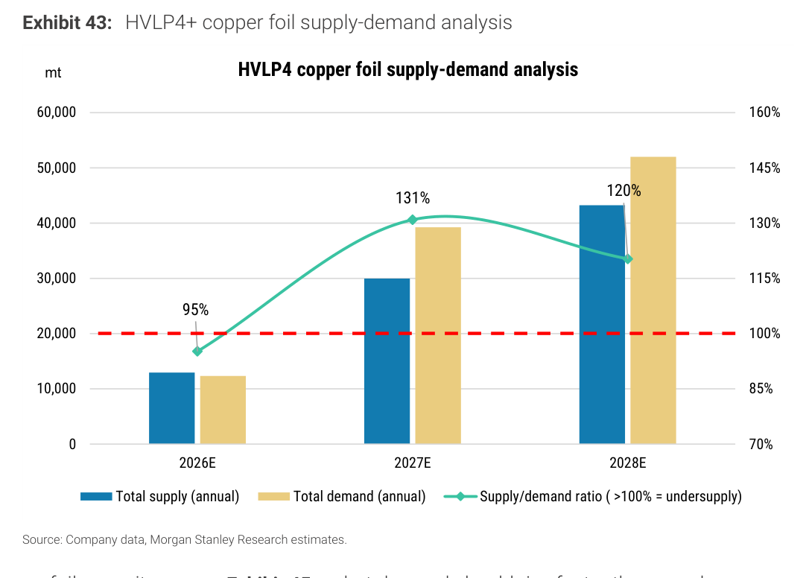

### 解讀摘要
與 Exhibit 6 相同的 HVLP4+ 供需分析圖，附有詳細數字標注。供給（藍色柱）：13,200mt（2026E）→ 30,000mt（2027E）→ 44,000mt（2028E）；需求（米色柱）：12,600mt → 40,000mt → 52,000mt；供需比（綠線）：95% → 131% → 120%。

### 表格

| 年度 | 供給（mt） | 需求（mt） | 供需比 | 狀況 |
|---|---|---|---|---|
| 2026E | 13,200 | 12,600 | 95% | 小幅過剩 |
| 2027E | 30,000 | 40,000 | 131% | 嚴重短缺 |
| 2028E | 44,000 | 52,000 | 120% | 持續短缺 |

---

## Exhibit 44｜HVLP4+ 銅箔月均供給能力（依廠商）

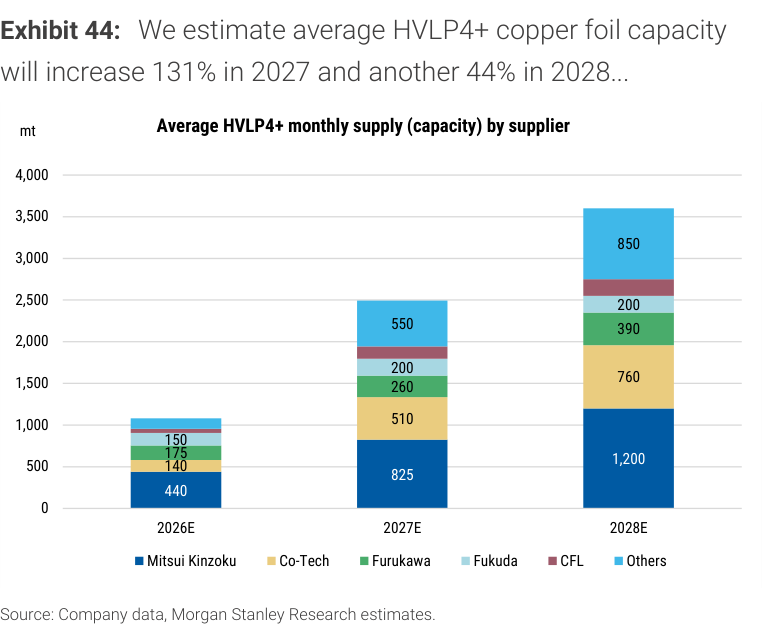

### 解讀摘要
HVLP4+ 銅箔月均供給能力（mt/月）：2026E 總計 1,100mt（Mitsui 440 + Co-Tech 140 + Furukawa 175 + Fukuda 150 + CFL+Others 195）→ 2027E 2,500mt（+127%）→ 2028E 3,600mt（+44%）。Mitsui 從 440→825→1,200mt，Co-Tech 從 140→510→760mt（成長最快）。

### 表格

| 廠商 | 2026E（mt/月） | 2027E（mt/月） | 2028E（mt/月） |
|---|---|---|---|
| Mitsui Kinzoku | 440 | 825 | 1,200 |
| Co-Tech | 140 | 510 | 760 |
| Furukawa | 175 | 260 | 390 |
| Fukuda | 150 | 200 | 200 |
| CFL | 50 | 155 | 200 |
| Others | 145 | 550 | 850 |
| **合計** | **1,100** | **2,500** | **3,600** |

---

## Exhibit 45｜HVLP4+ 銅箔月需求（依客戶平台）

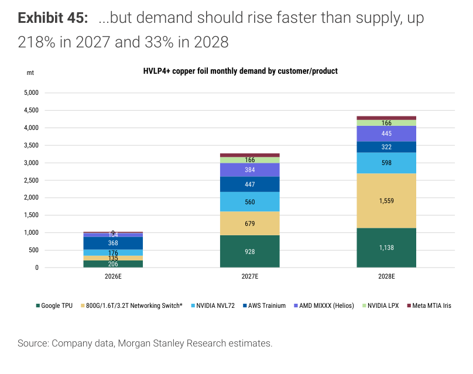

### 解讀摘要
HVLP4+ 銅箔月需求量（mt/月，依客戶/產品）：2026E=989mt → 2027E=3,164mt（+218%）→ 2028E=4,228mt（+33%）。2027E 最大增量來源：Nvidia NVL72（447mt）、800G/1.6T/3.2T Switch（679mt）、AWS Trainium（560mt）、AMD MI4XX（384mt）、Google TPU（928mt）、Meta MTIA Iris（166mt）。

> **洞察二十二**：Google TPU（928mt/月，2027E）是最大單一需求來源，佔 2027E 總需求的 29%——但 Google 的 TPU 是 ASIC，通常不被市場當成銅箔需求的首要驅動力。若 Google 進一步擴大 TPU 部署，HVLP4+ 短缺將更嚴重。

---

## Exhibit 46｜HVLP4+ 銅箔供應商市場份額（2028E）

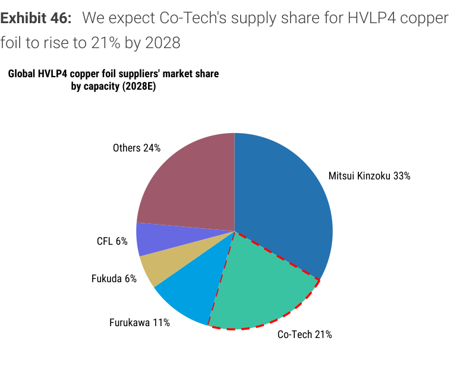

### 解讀摘要
2028E HVLP4+ 銅箔供應商市場份額（按產能）：Mitsui Kinzoku 33%、Co-Tech 21%、Furukawa 11%、Fukuda 6%、CFL 6%、Others 24%。2026E 時 Mitsui 還佔 41%（Exhibit 73），到 2028E 降至 33%——份額稀釋反映 Co-Tech 的快速擴產（13%→21%）。

> **洞察二十三（配合 Exhibit 73）**：Co-Tech 的市佔率從 2026E 的 13% 升至 2028E 的 21%，是漲幅最大的廠商。這代表 Co-Tech 不只是搭車受益，而是主動搶佔供需缺口，擴產能力是最大差異化因素。

---

## Exhibit 47｜銅箔加工費倍數（HVLP 等級升級）

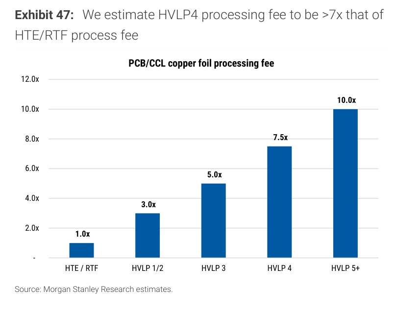

### 解讀摘要
PCB/CCL 銅箔加工費相對倍數（HTE=1.0x 為基準）：HTE/RTF=1.0x → HVLP 1/2=3.0x → HVLP 3=5.0x → HVLP 4=7.5x → HVLP 5+=10.0x。

> **洞察二十四**：HVLP4 vs HTE 的加工費是 7.5 倍，而 CCL ASP 中 M8 vs M2 是 6.5 倍（Exhibit 35）——兩者倍率相近，但銅箔加工費更高，顯示 HVLP4+ 銅箔廠商的定價權甚至優於 M8 CCL 廠商。HVLP5+ 的 10x 加工費（若量產成功）是利潤率最高的產品線。

---

## Exhibit 48｜銅箔種類與應用對照

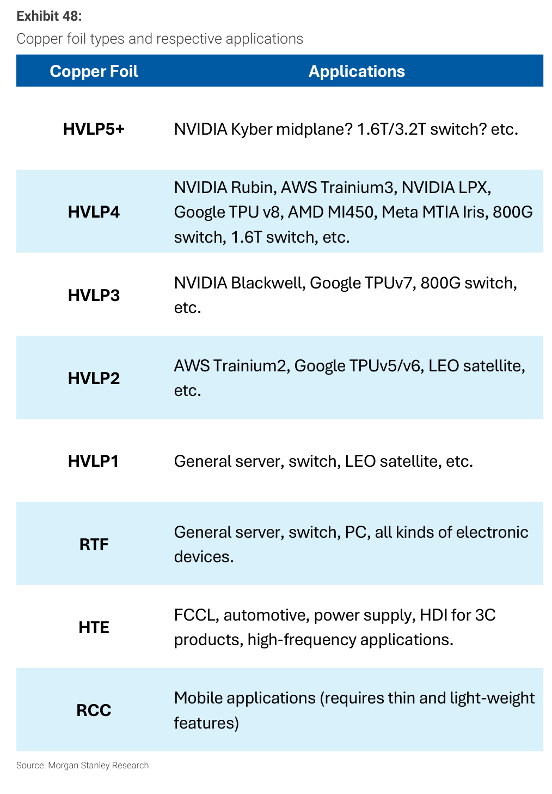

### 解讀摘要
銅箔種類（RCC→HTE→RTF→HVLP1→HVLP2→HVLP3→HVLP4→HVLP5+）對應應用對照：HVLP4 用於 Nvidia Rubin、AWS Trainium3、Google TPUv8、AMD MI450、Meta MTIA Iris、800G/1.6T switch；HVLP5+ 用於 Nvidia Kyber midplane、1.6T/3.2T switch（問號）；HVLP3 用於 Nvidia Blackwell、Google TPUv7、800G switch；HVLP2 用於 AWS Trainium2、Google TPUv5/v6、LEO satellite。

---

## Exhibit 49｜日本 PCB 廠商季度 OPM 趨勢

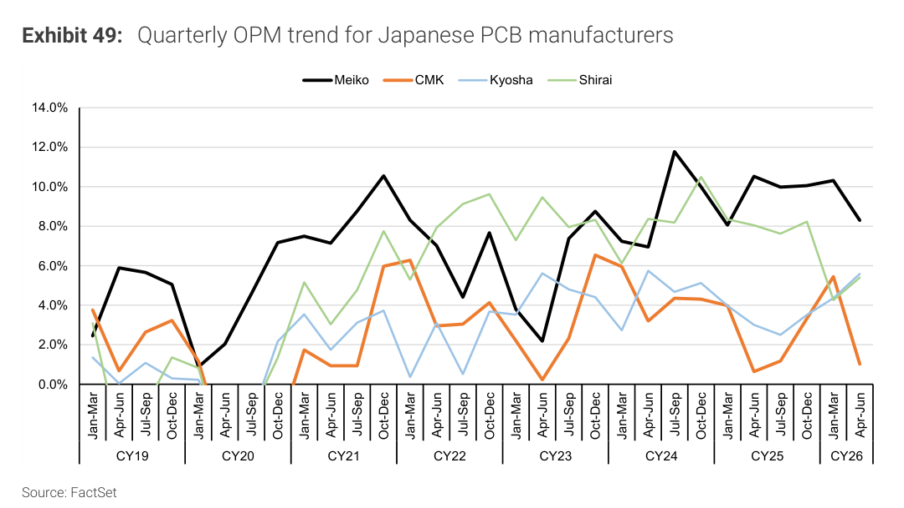

### 解讀摘要
Meiko、CMK、Kyosha、Shirai 四家日本 PCB 廠商 2019-2026 年季度 OPM 走勢。Meiko 持續引領（通常 7-12% OPM），2025-2026 維持 8-10%；CMK 最弱（0-7%），2026 年 1Q-2Q 大幅下滑至 1-2%；Shirai 波動性強，2024-2025 年明顯改善至 8-10%。日本 PCB 廠商整體獲利能力受 AI 需求拉動，但廠商間分化明顯。

---

## Exhibit 50｜PCB 按應用分類組成對照

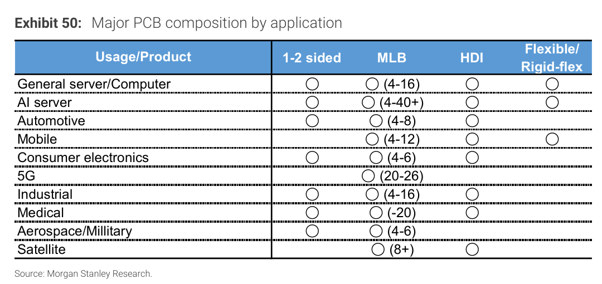

### 解讀摘要
各應用產品使用的 PCB 類型（1-2 sided、MLB、HDI、Flexible/Rigid-flex）對照表：AI server 使用 MLB（4-40+ 層），是所有應用中層數最多、複雜度最高的；5G 設備 MLB 在 20-26 層；一般伺服器 4-16 層；汽車 4-8 層。AI server 的 4-40+ 層是關鍵——40 層以上的需求讓只有少數 PCB 廠商有能力供貨，也是 Meiko、Unimicron 等廠商相對一般 PCB 廠的差異化來源。

---

## Exhibit 73｜HVLP4+ 銅箔供應商市場份額（2026E）

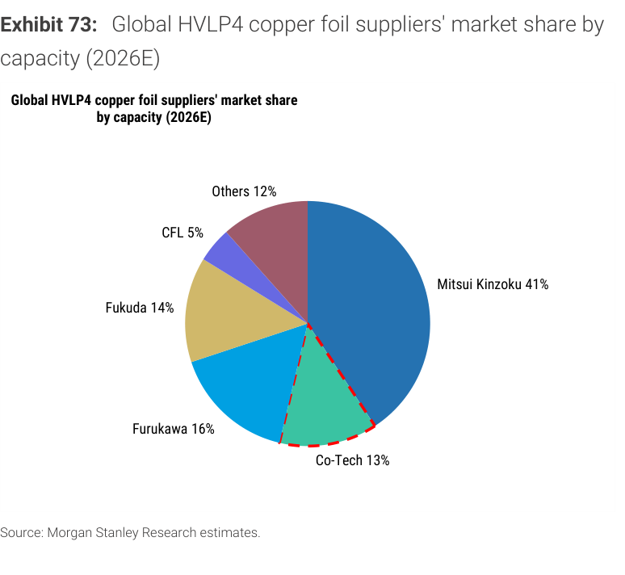

### 解讀摘要
2026E HVLP4+ 銅箔供應商市場份額（按產能）：Mitsui Kinzoku 41%、Furukawa 16%、Co-Tech 13%、Fukuda 14%、CFL 5%、Others 12%。Mitsui 此時仍高達 41%，兩年後（Exhibit 74）將降至 33%——反映新進廠商（尤其 Co-Tech）快速追趕。

---

## Exhibit 74｜HVLP4+ 銅箔供應商市場份額（2028E）

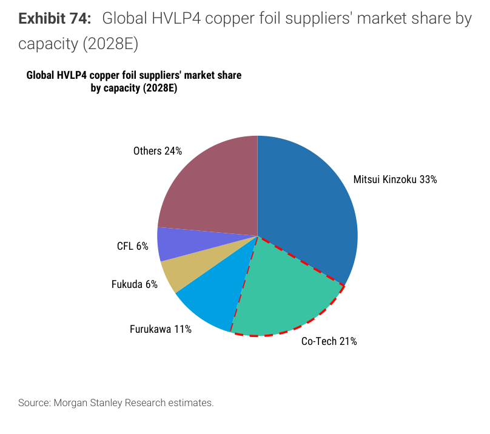

### 解讀摘要
與 Exhibit 46 相同（2028E HVLP4+ 市場份額）：Mitsui 33%、Co-Tech 21%、Furukawa 11%、Fukuda 6%、CFL 6%、Others 24%。和 Exhibit 73 對比，2026E→2028E 最大變化是 Co-Tech 從 13%→21%（+8ppt），Mitsui 從 41%→33%（-8ppt），Furukawa 從 16%→11%（-5ppt）。

---

## Exhibit 79｜玻纖布需求量：2027E 與 2028E 預測

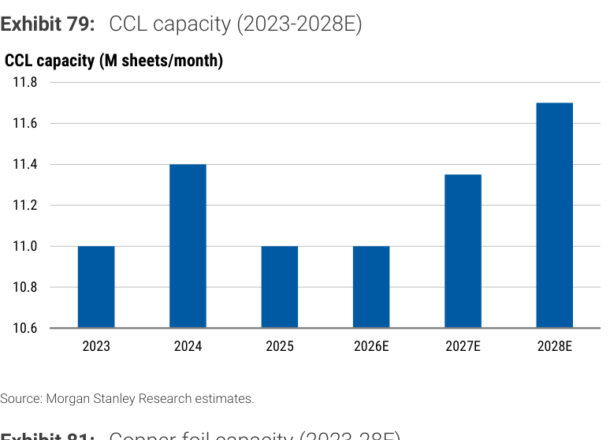

### 解讀摘要
玻纖布（Glass cloth）需求預測，顯示 2027E 和 2028E 兩個時間點的月均需求（M meters/month），分別約為 70M 和 93M meters/month。對照 Exhibit 80 的供給側數據（2027E=84M、2028E=96M），需求/供給比：2027E=83%（供過於求）、2028E=97%（極度緊繃）。

> **洞察二十五（配合 Exhibit 80）**：玻纖布到 2028E 的供需比高達 97%——實際上是幾乎無緩衝的均衡狀態。任何需求上修或供給爬坡延遲，玻纖布就會從「輕微過剩」直接進入「短缺」，市場對此的準備程度不足。

---

## Exhibit 80｜玻纖布供給能力（2023-2028E）

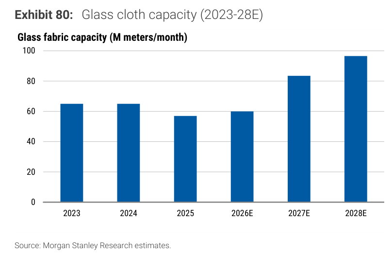

### 解讀摘要
全球玻纖布供給能力（Glass fabric capacity，M meters/month）：2023=65M → 2024=65M → 2025=57M（去庫存導致開工率下降）→ 2026E=60M → 2027E=84M（+40%）→ 2028E=96M（+14%）。2027E 的大幅跳升是因為主要廠商（KB Laminates 等）確認擴產，反映對 AI 需求的信心。

---

## Exhibit 81｜銅箔供給能力（2023-2028E，所有等級合計）

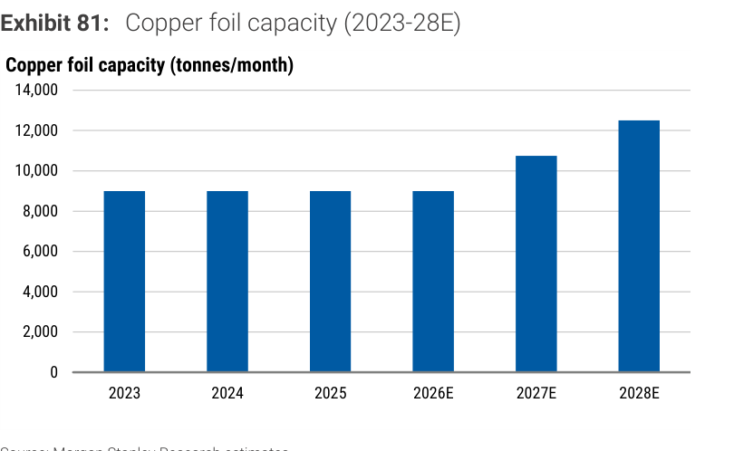

### 解讀摘要
全球銅箔供給能力（所有等級合計，tonnes/month）：2023=9,000 → 2024=9,000 → 2025=9,000 → 2026E=9,000（四年幾乎不變）→ 2027E=11,000（+22%）→ 2028E=12,500（+14%）。整體銅箔產能的平穩期反映廠商在確認訂單可見度前不敢貿然擴產，2027E 的急擴是已有客戶認證的前提下才發生。

---

## Exhibit 82｜E-glass Yarn 每月漲價走勢

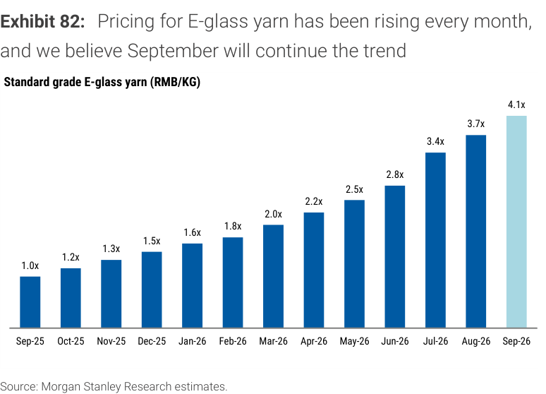

### 解讀摘要
Standard grade E-glass yarn 價格指數（RMB/KG，Sep-25=1.0x 為基準）：Sep-25=1.0x → Oct-25=1.2x → Dec-25=1.5x → Jan-26=1.6x → Feb-26=1.8x → Mar-26=2.0x → Apr-26=2.2x → May-26=2.5x → Jun-26=2.8x → Jul-26=3.4x → Aug-26=3.7x → Sep-26E=4.1x（MS 預測，淡色柱）。每個月連續上漲，MS 認為 Sep-26 仍將維持漲勢。

> **洞察二十六**：從 Sep-25 到 Sep-26E，12 個月 E-glass 漲 4.1 倍——這個漲幅已經超過大多數分析師的預期，而且 MS 認為漲勢尚未結束。KB Laminates 作為電子玻纖布主要生產商，這 4.1 倍的漲幅直接轉化為毛利率擴張，解釋了 Exhibit 7 的淨利爆炸式成長。

---

## Exhibit 83｜不同玻纖絲規格的 ASP 倍數

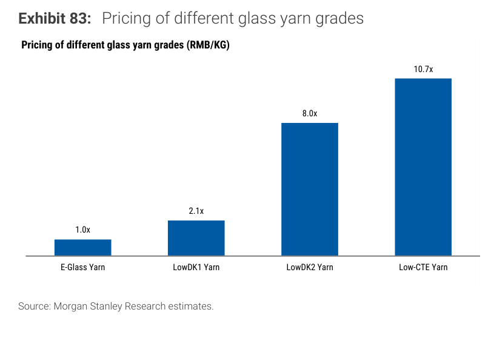

### 解讀摘要
不同玻纖絲規格的相對 ASP（E-Glass Yarn=1.0x 為基準）：E-Glass Yarn=1.0x → LowDK1 Yarn=2.1x → LowDK2 Yarn=8.0x → Low-CTE Yarn=10.7x。

> **洞察二十七**：LowDK2 是標準 E-glass 的 8 倍價格，Low-CTE 是 10.7 倍——這個溢價結構跟 CCL 的 M2 vs M9（12.1x）幾乎平行。AI 所需的特殊玻纖布（低 Dk、低 CTE）不是普通玻纖布加工改良，而是完全不同的製程與原料，少數廠商（Nitto Boseki、Resonac、KB Laminates 旗下子公司）才有能力供應。

---

## Exhibit 84｜KB Laminates 電子玻纖業務對總獲利貢獻

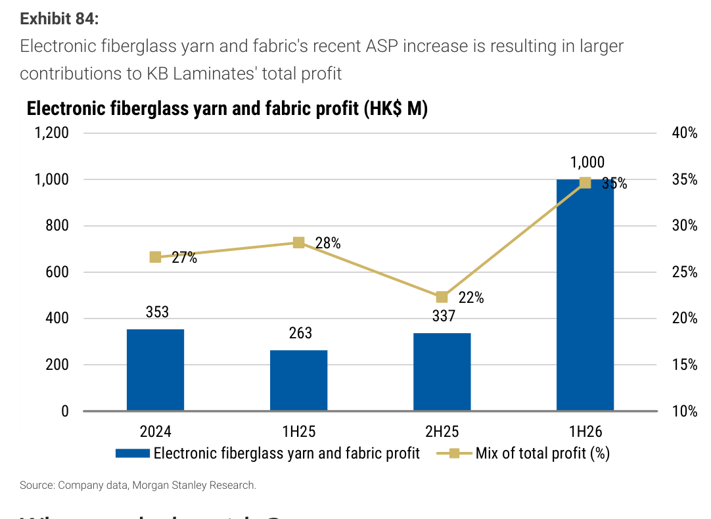

### 解讀摘要
KB Laminates 電子玻纖絲及布業務獲利（HK\$M）及佔總獲利比例：2024=HK\$353M（27%）→ 1H25=HK\$263M（28%）→ 2H25=HK\$337M（22%，比例下滑因 CCL 業務改善更快）→ **1H26=HK\$1,000M（35%）**。玻纖業務在 1H26 獨立貢獻 HK\$1B，是 1H25 的 3.8 倍，佔比升至 35%。

> **洞察二十八（配合 Exhibit 7）**：KB Laminates 1H26 總淨利 HK\$2,887M，其中電子玻纖貢獻 HK\$1,000M（35%）、CCL 業務貢獻 HK\$1,887M（65%）。兩個業務線同步因 AI 材料升級而爆發，是全球唯一的「CCL × 玻纖布」雙重曝險股——這個獨特性解釋了為何 MS 在評分 3.17（排名偏後）的情況下仍給 Overweight。

---

## Exhibit 94｜CCL 材料截面結構示意圖

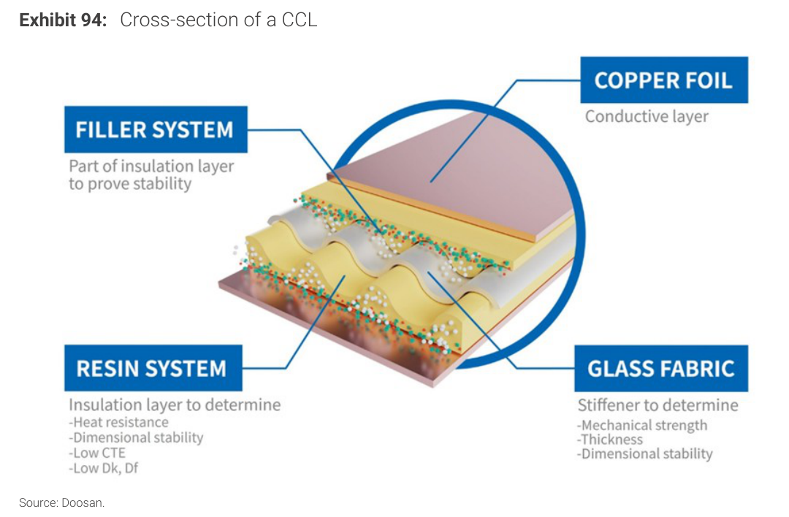

### 解讀摘要
CCL 的材料構成 3D 示意圖（來源：Doosan）：四大組成——①銅箔（COPPER FOIL，導電層）、②玻纖布（GLASS FABRIC，決定機械強度、厚度、尺寸穩定性的骨架）、③樹脂系統（RESIN SYSTEM，絕緣層，決定熱阻、尺寸穩定、低 CTE、低 Dk/Df）、④填充系統（FILLER SYSTEM，絕緣層的穩定劑）。CCL 的性能由四者共同決定。

---

## Exhibit 95｜全球 CCL 供應商市場份額（2026E）

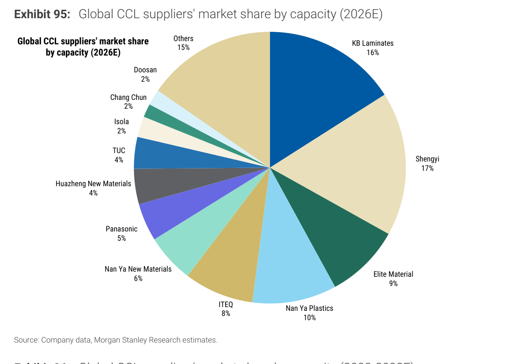

### 解讀摘要
2026E 全球 CCL 供應商市場份額（按產能）：Shengyi 17% → KB Laminates 16% → Nan Ya Plastics 10% → Elite Material 9% → ITEQ 8% → Nan Ya New Materials 6% → Panasonic 5% → Huazheng 4% → TUC 4% → Doosan 2% → Chang Chun 2% → Isola 2% → Others 15%。

> **洞察二十九**：Shengyi 17% 是最大單一廠商，但 MS 評等為 Equal-weight——因為市佔率最大不等於在 M8+ 等級最強。EMC（9%）評分最高，反映其 M8/M9 資格認證的領先地位比市佔率更重要。TUC（4%）看似份額小，但 Switch PCB CCL 幾乎由 EMC 和 TUC 雙佔，聚焦在最高利潤的利基產品。

---

## Exhibit 96｜全球 CCL 供應能力趨勢（2023-2028E）

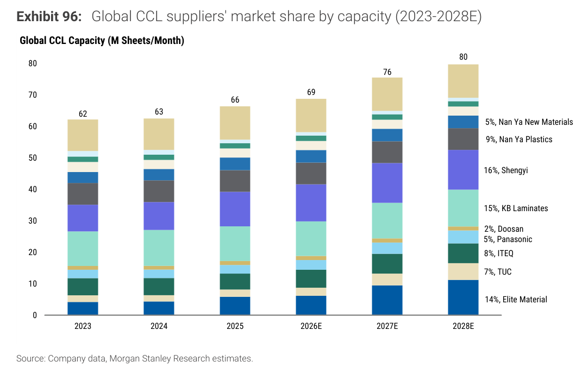

### 解讀摘要
全球 CCL 供給能力（M Sheets/Month）：2023=62M → 2024=63M → 2025=66M → 2026E=69M → 2027E=76M → 2028E=80M，各廠商佔比在圖中以疊加方式呈現。2028E 結構：Elite Material 14%、TUC 7%、ITEQ 8%、Panasonic 5%、KB Laminates 15%、Shengyi 16%、Nan Ya Plastics 9%、Nan Ya New Materials 5%（合計）。EMC 份額從 2023 年的偏低升至 2028E 的 14%，是擴產最積極的廠商之一。

---

## Exhibit 97｜玻璃強化型 CCL 的三大構成材料

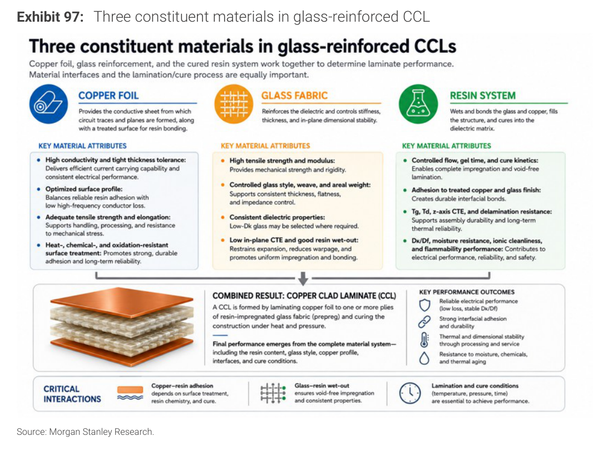

### 解讀摘要
CCL 三大構成材料圖解：①銅箔（提供導電線路，需要高導電性、厚度精密控制、優化表面輪廓）、②玻纖布（增強介電質，控制剛性/厚度/面內尺寸穩定，需要低 Dk 和低 in-plane CTE）、③樹脂系統（濕潤接合銅箔與玻纖，填充介電基質，決定 Tg、Td、z-axis CTE、Dk/Df、阻燃性）。最終性能由材料系統的完整組合（包括固化條件）決定。

---

## Exhibit 98｜PCB 材料成本構成

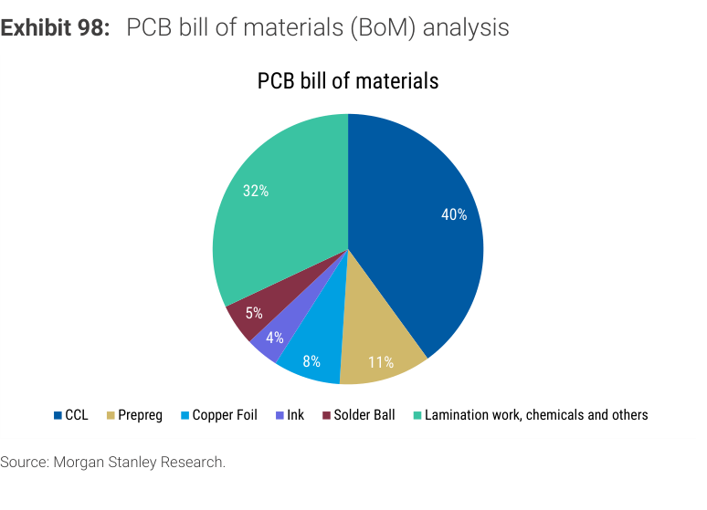

### 解讀摘要
PCB Bill of Materials 構成：CCL 40%、Lamination work/chemicals/others 32%、Prepreg 11%、Copper Foil 8%、Ink 4%、Solder Ball 5%。CCL 是 PCB 最大的物料成本（40%），其次是加工費（32%）。

> **洞察三十（配合 Exhibit 99）**：PCB 的 40% 原料成本是 CCL，而 CCL 的 33% 是銅箔——代表銅箔成本在 PCB BOM 中的間接占比是 40%×33% ≈ 13%（加上直接銅箔的 8%，合計約 21%）。單就銅箔升規（HTE→HVLP4）對 PCB 的成本影響：若銅箔加工費漲 7.5 倍（Exhibit 47），而銅箔佔 PCB BOM 約 8-21%，PCB 的成本上升可能達 40-140%（視直接/間接銅箔的比例）。高等級 PCB 的 ASP 升幅遠超過去認識。

---

## Exhibit 99｜CCL 材料成本構成

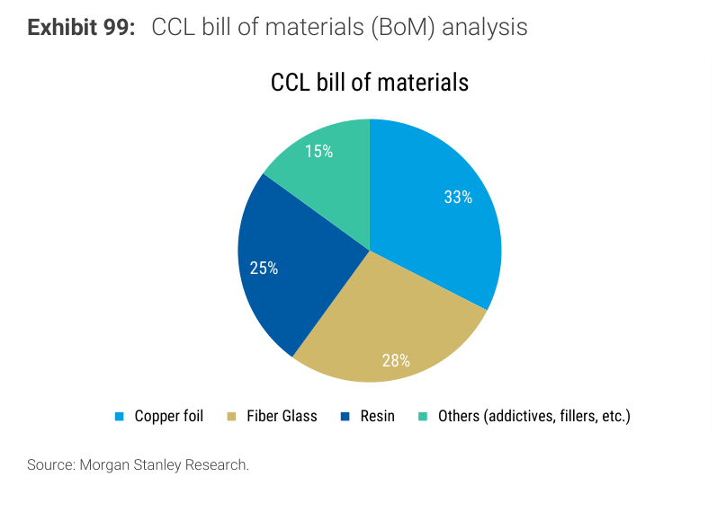

### 解讀摘要
CCL Bill of Materials 構成：銅箔 33%、Fiber Glass（玻纖布）28%、樹脂 25%、Others（添加劑、填充劑等）15%。CCL 的三大原料中，銅箔和玻纖布合計佔 61%——兩者都在漲價且漲幅顯著，對 CCL 廠商的成本端造成雙重壓力。能夠轉嫁漲價的廠商（具備 M8+ 認證、定價權強）才能維持毛利率。

> **洞察三十一**：玻纖布（28%）和銅箔（33%）加起來是 61% 的 CCL 成本。E-glass 漲 4.1x、HVLP4 處理費 7.5x——若 CCL 廠商無法同步提升 ASP（只有高等級認證廠商才有定價權），成本壓縮將侵蝕毛利。這解釋了為什麼市場份額大但集中在低等級的 CCL 廠商，盈利能力反而不及市場份額小但聚焦高端的廠商。

---

## 跨 Exhibit 彙整表

### 彙整 1｜三大材料各平台 Content per Rack 彙整（Exhibit 12-15）

| 平台 | 世代 | CF/rack | CCL/rack | PCB/rack |
|---|---|---|---|---|
| GB300 NVL72 | Nvidia Gen N | \$1,697 | \$6,695 | \$37,491 |
| TPUv7 | Google Gen N | — | \$6,550 | — |
| T2 | AWS Gen N | \$1,423 | \$9,599 | \$24,500 |
| VR200 NVL144 | Nvidia Gen N+1 | \$5,164 | \$18,750 | \$91,227 |
| TPUv8 | Google Gen N+1 | \$4,457 | \$13,009 | \$37,861 |
| T3 | AWS Gen N+1 | \$3,266 | \$10,218 | \$26,287 |
| MI4XX | AMD Gen N+1 | \$9,610 | \$20,099 | \$66,143 |
| VR300 | Nvidia Gen N+1 | \$5,705 | \$35,601 | \$154,377 |
| TPUv9 | Google Gen N+2 | \$4,657 | \$32,288 | \$87,906 |
| T4 | AWS Gen N+2 | \$6,855 | \$32,789 | \$84,770 |
| MI5XX | AMD Gen N+2 | \$9,734 | \$37,268 | \$114,188 |

> Gen N+2 各平台 CCL content 趨同於 \$32-37K/rack，確認 M9/M10 等級需求不是 Nvidia 特有，而是跨 GPU、ASIC 的共同趨勢。PCB content 在 Gen N+2 同樣趨向 \$85-115K/rack，顯示 AI server PCB 含量還有 1-2 倍的提升空間。

### 彙整 2｜HVLP4+ 供需核心數據（Exhibit 43-46）

| 年度 | 月供給（mt/月） | 月需求（mt/月）估算 | 年供給（mt） | 年需求（mt） | 供需比 | Co-Tech 份額 |
|---|---|---|---|---|---|---|
| 2026E | 1,100 | 1,050 | 13,200 | 12,600 | 95% | 13% |
| 2027E | 2,500 | 3,333 | 30,000 | 40,000 | 131% | — |
| 2028E | 3,600 | 4,333 | 44,000 | 52,000 | 120% | 21% |

---

## 相關個股清單

| 類別 | 公司 | Ticker | MS 評等 | 備註 |
|---|---|---|---|---|
| CCL | Elite Materials (EMC) | 2383.TW | Overweight | M8/M9 認證領先，新啟動覆蓋，Switch PCB CCL 主力 |
| CCL | TUC | 6274.TWO | Overweight | Switch PCB CCL，新啟動覆蓋 |
| CCL | Shengyi Technology | 600183.SS | Equal-weight | 最大市佔率但 M9 認證不確定 |
| CCL + 玻纖布 | KB Laminates | 1888.HK | Overweight | 新啟動覆蓋，CCL + 電子玻纖布雙重受益 |
| CCL | ITEQ | 6274.TW | — | M7 量產，M8 驗證中 |
| CCL | Panasonic | — | — | M8 主要非台廠 CCL 供應商（Google、AWS） |
| CCL | Doosan | — | — | Nvidia OAM 高端 CCL 供應商 |
| 銅箔 | Co-Tech | 8358.TWO | Overweight | 新啟動覆蓋，HVLP4+ 份額 13%→21% 成長最快 |
| 銅箔 | Mitsui Kinzoku | 5706.T | Overweight | HVLP4+ 領導者（41%→33%），未上市分部 |
| 銅箔 | Furukawa | — | — | HVLP4+ 供應商，11% 份額 |
| PCB | Unimicron | 3037.TW | Overweight | PCB 排名第 2，AI server PCB 主力 |
| PCB | NYPCB | 8046.TW | Overweight | PCB 排名第 7 |
| PCB | Gold Circuit | 2368.TW | Overweight | PCB 排名第 13 |
| PCB | ISU Petasys | 007660.KS | Overweight | 韓國 PCB，AI server 曝險 |
| 玻纖布 | Resonac | 4004.T | Overweight | 玻纖布/ABF，CCL/PCB 供應鏈評分第 2 |
| 玻纖布 | Nitto Boseki | 3110.T | Overweight | 特殊玻纖絲（LowDK/Low-CTE），評分第 5 |
