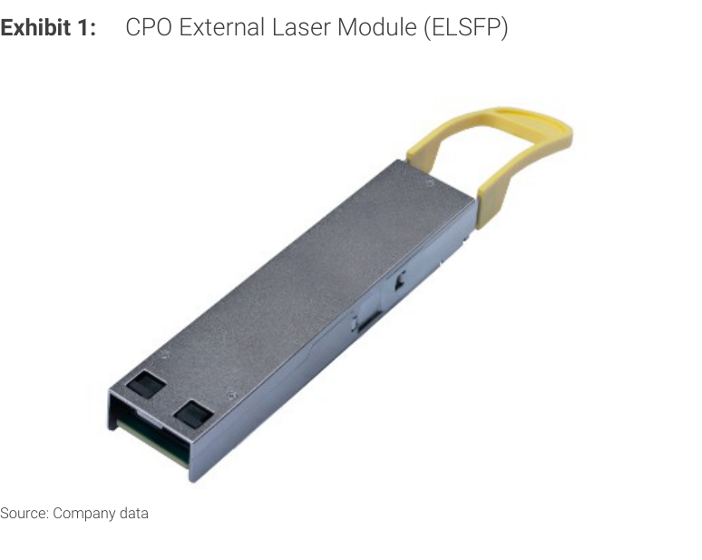
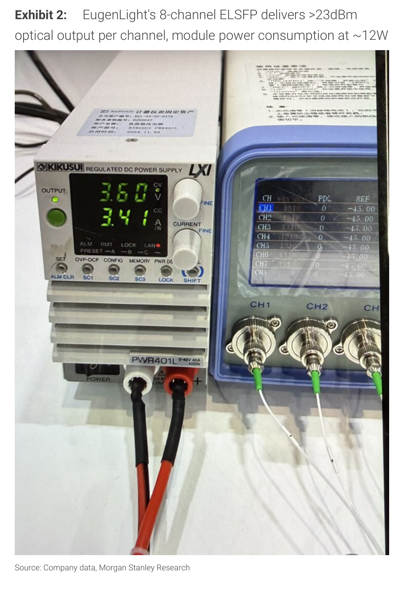
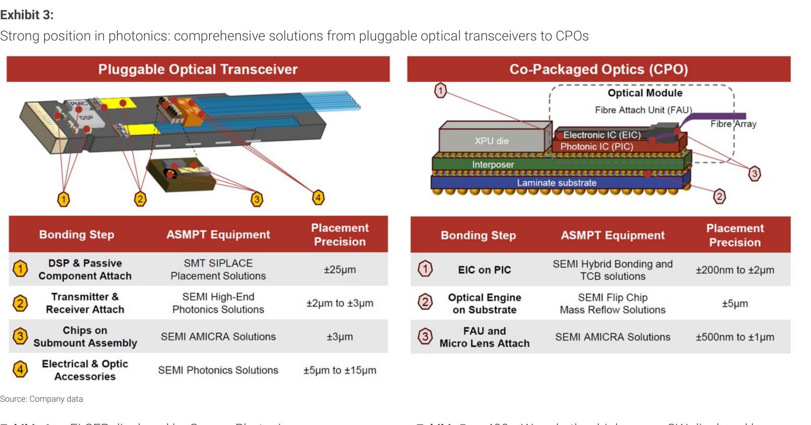
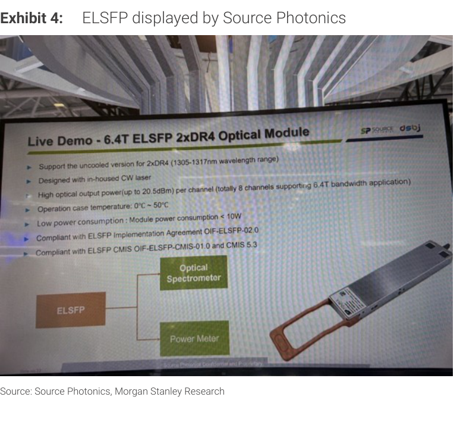
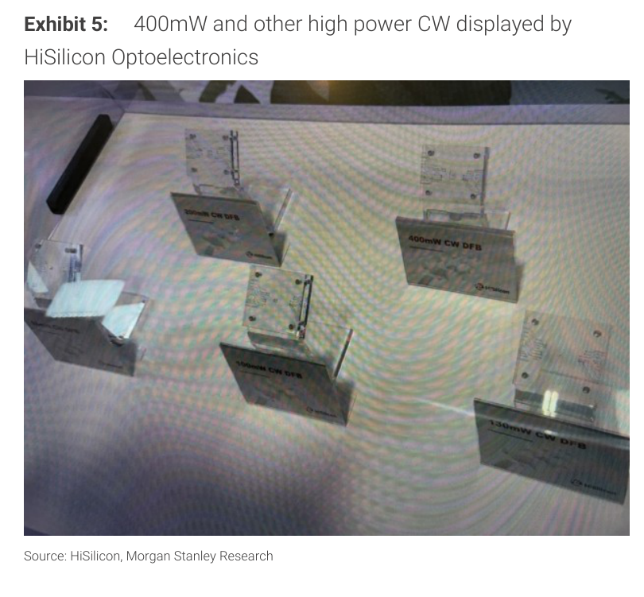
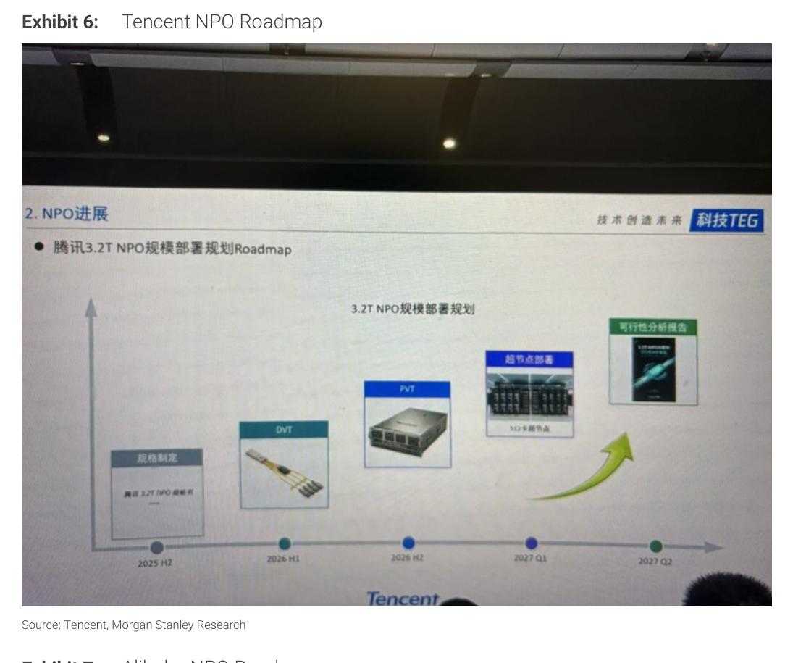
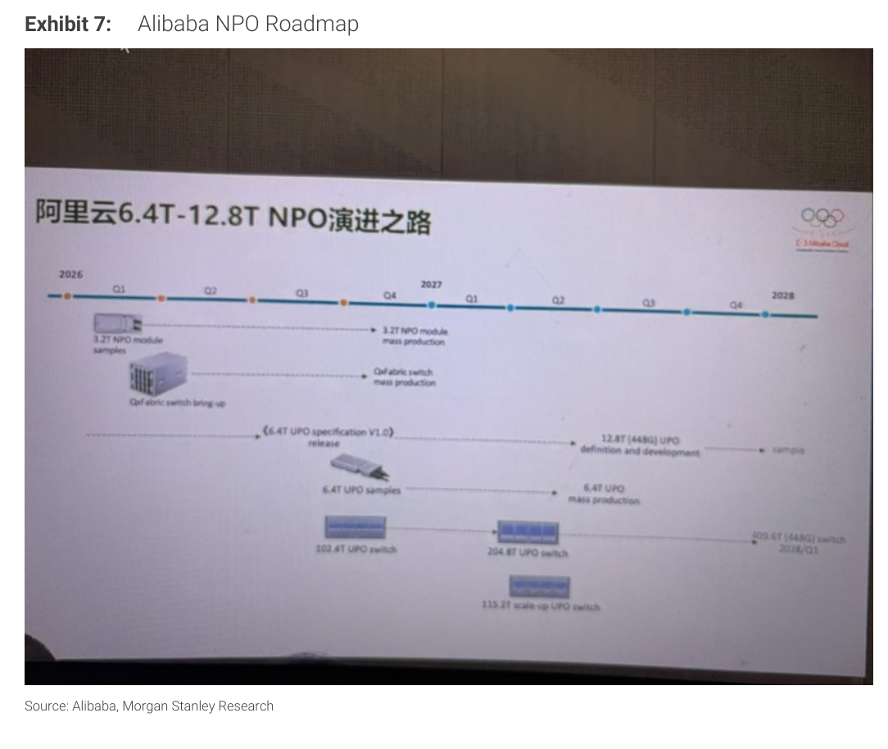

# MS｜CIOE Key Takeaways: Expanding the Growth Runway

**券商**：Morgan Stanley  
**分析師**：Daisy Dai, Charlie Chan, Daniel Yen, Henry Zhao  
**日期**：2026-09-13  
**主題**：CIOE 2026 光子技術展覽重點整理（CPO / NPO / ELSFP）  
**評級**：Industry View Attractive  
<a href="https://layx.uk/dl?g=產業&b=MS&d=20260913&h=CIOE-Key-Takeaway">📎 下載 PDF</a>

---

## 報告總結

摩根士丹利出席 CIOE 2026，聚焦三條主線：①EugenLight（USI 旗下）展示 8 通道 ELSFP（~12W），視為 NPO→CPO 遷移的關鍵構件；②ASMPT 的無焊劑 TCB 方案（AOR 技術）可同時解決光引擎封裝的翹曲與光口污染兩大良率痛點；③中國本土 CW 雷射晶片 200-400mW 各廠積極量產，供貨廣度擴大但客戶認證進度仍是差異化關鍵。

更重要的客戶端信號：騰訊公布 512 卡超節點（3.2T NPO）將於 1Q27 部署，阿里巴巴目標 4Q26 量產 3.2T NPO 模組與 QxFabric 交換器，並於 2027 年中推進 6.4T UPO 量產，顯示中國 CSP 在 scale-up 互連上已選定 NPO 路線、不視為過渡方案。

---

## MS 完整投資邏輯鏈

| 論點層次 | Exhibit | 內容 |
|---|---|---|
| 技術需求確立 | 6、7 | 騰訊/阿里 CSP 明確選定 NPO 路線（非過渡），scale-up 大規模部署時程落地 |
| 元件供給加速 | 4、5 | 本土 CW 雷射晶片廠商廣度擴大（200-400mW），競爭點移至客戶認證速度 |
| 受益架構 | 1、2 | ELSFP 成為 NPO 到 CPO 的橋接器，USI/EugenLight 率先卡位 |
| 封裝瓶頸與解方 | 3 | ASMPT 無焊劑 TCB 解決光引擎翹曲＋光口污染，良率問題有解 |
| **結論** | 封面 | **NPO scale-up 確立路線，光子封裝設備與 ELSFP 供應商最先受益** |

> **報告最大邏輯缺口**：報告未量化 NPO 相較 pluggables 的 ASP 差異，投資者需另行評估美元含量是否足以支撐本土 CSP 採用帶動的供應商擴張。

---

## 報告核心觀點

| 主題 | MS 觀點 | 市場共識 | 是否 Contra-Consensus |
|---|---|---|---|
| NPO 角色 | NPO 可能長期存在，非僅過渡方案 | 市場視 NPO 為 CPO 前橋接 | 偏 Contra |
| ELSFP 重要性 | ELSFP 是 NPO→CPO 遷移關鍵模組，USI 不落後 | USI 光模組業務低於預期 | Contra（修正悲觀看法） |
| CW 雷射競爭 | 廣度擴大，但客戶認證與持續放量才是真差異化 | 普遍看好中國本土替代 | 中性修正（勿過度樂觀） |
| 騰訊/阿里部署時程 | 1Q27 / 4Q26 量產，路線圖明確 | 不明確 | 正向催化劑 |

**零件/個股偏好**：USI（ELSFP/EugenLight）、ASMPT（無焊劑 TCB 設備）

---

## Exhibit 1｜CPO External Laser Module (ELSFP)

### 解讀摘要
EugenLight（USI 旗下光子子公司）在 CIOE 展出 ELSFP 實體模組。ELSFP 將雷射光源從計算/封裝環境移出，是 NPO 架構向 CPO 遷移的過渡構件——可先改善系統可靠性，再等 CPO 大規模採用成熟。此展品確認 EugenLight 在 ELSFP 上並未落後競爭對手。

---

## Exhibit 2｜EugenLight 8-channel ELSFP 功耗量測

### 解讀摘要
量測照片顯示 EugenLight ELSFP 在 3.60V / 3.41A 下運行（≈12.3W），8 通道光輸出 >23dBm（>200mW）per channel。功率效率（~12W/8 通道）對 scale-up 場景下系統整體散熱管理至關重要。隨著光 I/O 帶寬升級，每瓦輸出的功率效率將成為差異化競爭點。

> **洞察一**：12W 總模組功耗、8 通道 >23dBm——等效每通道功耗 <1.5W，在 400mW CW 雷射供電場景下功率利用率有改善空間，也顯示進一步降功耗可能。

---

## Exhibit 3｜ASMPT 光子封裝解決方案（Pluggable vs CPO）

### 解讀摘要
ASMPT 展示了從插拔式光收發器到 CPO 的完整封裝設備矩陣。CPO 封裝新增的關鍵步驟是「EIC on PIC」混合鍵合（±200nm 精度），遠比傳統 SMT 嚴格兩個數量級。ASMPT 以 TCB + AOR（大氣氧化物去除）無焊劑技術同時解決翹曲與光口污染——前者靠 TCB 的精密壓控，後者靠去除殘餘焊劑，兩個問題一套設備解決，且與傳統 mass reflow 設備不相容，是結構性的換代採購機會。

### 表格

**Pluggable Optical Transceiver 封裝步驟（ASMPT）**

| 步驟 | 製程 | ASMPT 設備 | 定位精度 |
|---|---|---|---|
| 1 | DSP & 被動元件貼裝 | SMT SIPLACE 放置方案 | ±25µm |
| 2 | 發射/接收元件貼裝 | SEMI 高端光子方案 | ±2µm 至 ±3µm |
| 3 | 晶片次底座組裝 | SEMI AMICRA 方案 | ±3µm |
| 4 | 電/光連接器 | SEMI Photonics 方案 | ±5µm 至 ±15µm |

**CPO 封裝步驟（ASMPT）**

| 步驟 | 製程 | ASMPT 設備 | 定位精度 |
|---|---|---|---|
| 1 | EIC on PIC | SEMI 混合鍵合 + TCB 方案 | ±200nm 至 ±2µm |
| 2 | 光引擎 on 基板 | SEMI 覆晶 Mass Reflow 方案 | ±5µm |
| 3 | FAU + 微透鏡貼合 | SEMI AMICRA 方案 | ±500nm 至 ±1µm |

> **洞察二**：CPO 最嚴格步驟（EIC on PIC）精度需求為 ±200nm，比 pluggable DSP 貼裝（±25µm）嚴格 100 倍——代表 CPO 封裝設備是全新資本支出，非既有設備升級，對 ASMPT 是全新增量市場。

---

## Exhibit 4｜Source Photonics 6.4T ELSFP 展示

### 解讀摘要
Source Photonics 現場展示 6.4T ELSFP 2xDR4 光模組 live demo，支援 1305-1317nm uncooled 操作、8 通道每通道最高 20.5dBm 光輸出、模組總功耗 <10W，採用自研 CW 雷射。相較 EugenLight（>23dBm, ~12W），Source Photonics 此方案功耗更低（<10W），但光輸出略低（20.5dBm vs 23dBm）。

### 表格

| 規格 | Source Photonics 6.4T ELSFP |
|---|---|
| 目標頻寬 | 6.4T（2xDR4 架構） |
| 通道數 | 8 |
| 光輸出（per channel） | 最高 20.5dBm（\~112mW） |
| 模組總功耗 | <10W |
| 波長範圍 | 1305-1317nm（uncooled） |
| 雷射來源 | 自研 CW DFB |
| 操作溫度 | 0°C \~ 50°C |
| 標準遵循 | OIF-ELSFP-02.0、CMIS 5.3 |

---

## Exhibit 5｜HiSilicon Optoelectronics 高功率 CW 雷射展示

### 解讀摘要
HiSilicon 展出 130mW、200mW（two variants）、400mW CW DFB 雷射晶片，顯示中國本土廠商已追上高功率 CW 需求。配合 Yunling（200mW、300mW）、Everbright（400mW@50°C）及 Source Photonics（200mW）的展出，本土 CW 雷射晶片供貨廣度快速擴大。MS 指出客戶認證與持續放量能力才是真正差異化關鍵，不能只看產品規格。

> **洞察三**：多家中國廠商同時展出 400mW CW DFB——此功率等級可支援需要長光路（基板、FAU 損耗後）仍有足夠 link budget 的 NPO 應用。供貨端競爭激化將壓縮 CW 雷射 ASP，有利於模組廠（降成本），但對單一雷射供應商而言是份額保衛戰。

---

## Exhibit 6｜Tencent NPO Roadmap（3.2T）

### 解讀摘要
騰訊公開 3.2T NPO 大規模部署路線圖：2025H2 規格制定 → 2026H1 DVT → 2026H2 PVT → **2027Q1 512 卡超節點部署** → 2027Q2 可行性分析報告。以具體量產時程（512 卡超節點 = 重要里程碑，非樣品測試）確認騰訊在 scale-up 上押注 NPO，路線圖透明度對供應商是明確的採購可預期性信號。

### 表格

| 里程碑 | 時程 |
|---|---|
| 規格制定（騰訊 3.2T NPO 規格書） | 2025 H2 |
| DVT（設計驗證） | 2026 H1 |
| PVT（生產驗證） | 2026 H2 |
| 超節點部署（512 卡超節點） | **2027 Q1** |
| 可行性分析報告 | 2027 Q2 |

---

## Exhibit 7｜Alibaba NPO Roadmap（6.4T-12.8T）

### 解讀摘要
阿里巴巴（阿里云）展示更長期的 6.4T-12.8T NPO 演進路線：2026Q1 起 3.2T NPO 模組樣品 → **2026Q4 3.2T NPO 模組量產 + QxFabric 交換器量產** → 2026Q3 6.4T UPO 規格 V1.0 發布 → **2027Q1 6.4T UPO 量產** → 12.8T（448G）UPO 定義開發 → 2028Q1 409.6T 交換器。阿里路線圖顯示 NPO 部署在 2026 下半年即開始，且同步推進 6.4T UPO，時程比騰訊更激進。

### 表格

| 里程碑 | 時程 |
|---|---|
| 3.2T NPO 模組樣品 | 2026 Q1 |
| QxFabric 交換器 bring-up | 2026 Q1 |
| 6.4T UPO 規格 V1.0 發布 | 2026 Q3 |
| 6.4T UPO 樣品 | 2026 Q3 |
| **3.2T NPO 模組量產 + QxFabric 量產** | **2026 Q4** |
| **6.4T UPO 量產** | **2027 Q1** |
| 204.8T UPO 交換器 | 2027（H1） |
| 115.2T scale-up UPO 交換器 | 2027 |
| 12.8T（448G）UPO 定義 | 2027 Q3 |
| 12.8T UPO 樣品 | 2027 Q4 |
| 409.6T（448G）交換器 | **2028 Q1** |

> **洞察四（配合 Exhibit 6）**：騰訊 2027Q1 512 卡超節點部署 vs. 阿里 2026Q4 即進入量產——兩大中國 CSP 路線圖同步在 2026H2-2027H1 落地，代表 NPO 模組的真實量產需求最早在 2026Q4 啟動，非紙上計畫。
> **洞察五**：阿里的 6.4T UPO（Uni-packaged Optics）路線比騰訊的 3.2T NPO 更大膽——UPO 要求光源更緊密整合（接近 CPO），若 2027Q1 量產成功，意味中國市場有可能跳過傳統 pluggable 而直接布建 UPO/NPO 架構。

---

## 相關個股清單

| 類別 | 公司 | Ticker | 評等 | 備註 |
|---|---|---|---|---|
| ELSFP / 光子子公司 | USI（環旭電子） | 601231.SS | — | EugenLight 展示 8ch ELSFP |
| 光子封裝設備 | ASMPT | 0522.HK | — | 無焊劑 TCB，MS 正擔任 SMT 部門策略評估財務顧問 |
| CW 雷射 | Source Photonics | 未上市 | — | 6.4T ELSFP，EML+CW 量產擴產 |
| CW 雷射 | HiSilicon Optoelectronics | 未上市（華為旗下） | — | 400mW CW DFB 展示 |
