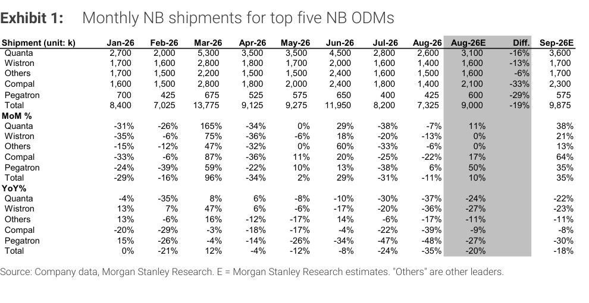
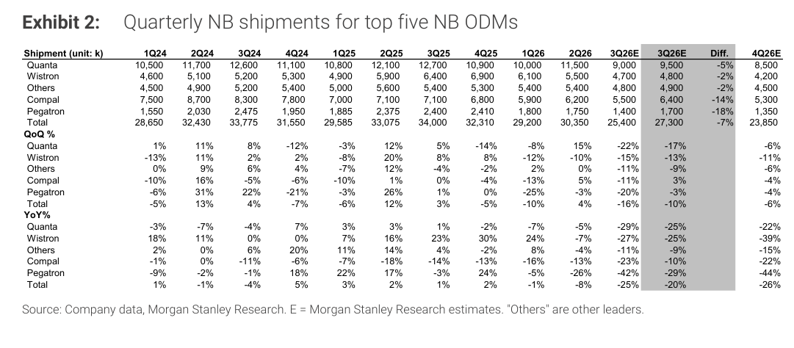

# MS｜NB Monthly Databook：Aug-26 出貨 miss -19%，下調 3Q 預估

**券商**：Morgan Stanley  
**分析師**：Howard Kao、Irene Yen、Andy Meng, CFA  
**日期**：2026-09-14  
**主題**：Taiwan NB ODM Monthly Databook — August 2026 shipments  
**評級**：In-Line  
<a href="https://layx.uk/dl?g=產業&b=MS&d=20260914&h=NB-Monthly-Databook">📎 下載 PDF</a>

---

## 報告總結

8 月台灣五大 NB ODM 出貨 7.3M 台（-11% MoM、-35% YoY），低於 MS 預估 19%。原因是 H1 提前拉貨（提前備貨因應美國關稅）已耗盡需求，通路商與分銷商庫存滿載，OEM 正主動降低對通路的銷售節奏。MS 因此將 3Q26 NB build 估計下調 7% 至 25.4M 台（-16% QoQ、-25% YoY），並首度給出 4Q26 估計 23.9M 台（-6% QoQ、-26% YoY）。

兩季均低於季節性：3Q 歷史平均為 +5% QoQ，此次估計 -16%；4Q 歷史平均為持平，此次估計 -6%。全年 CY26 MS 估計約 108.8M 台（-16% YoY），整體供應鏈動能顯著弱於去年水位。

---

## MS 完整投資邏輯鏈

| 論點層次 | Exhibit | 內容 |
|---|---|---|
| 需求信號惡化 | Exhibit 1 | Aug-26 出貨 7.3M，比 MSe 低 19%，為今年最大單月 miss |
| 通路去化壓力 | Exhibit 1 | H1 提前拉貨導致通路庫存充斥，OEM 主動減速銷售入通路 |
| 季度下修幅度 | Exhibit 2 | 3Q26E 從 27.3M 下調至 25.4M（-7%），Compal、Pegatron 降幅最大 |
| 全年格局 | Exhibit 2 | 4Q26E 23.9M（首次給出），CY26 合計 ~108.8M（-16% YoY） |
| **結論** | 報告封面 | **NB 產業今年供給層面持續去庫，產品組合向高端機種移動為唯一亮點** |

> **報告最大邏輯缺口**：MS 未提供 channel inventory 天數或庫存週轉具體數字，「庫存滿載」判斷為定性描述，無法量化去化時程。

---

## 報告核心觀點

| 主題 | MS 觀點 | 市場共識 | 是否 Contra-Consensus |
|---|---|---|---|
| Aug-26 出貨 | 7.3M（MSe 9.0M，差距 19%） | 市場可能預期接近 MS 的 9M | 是，顯著 miss |
| 3Q26 NB builds | 25.4M（-16% QoQ、-25% YoY） | ODM 法說時提出指引接近 -10% QoQ 左右 | 是，低於 ODM 指引下緣 |
| 4Q26 NB builds | 23.9M（-6% QoQ、-26% YoY） | 無官方指引，本報告為首份給出的預估 | 定性偏空 |
| 產品組合 | 高端機種佔比持續提升，利潤率支撐 | 市場同此觀點 | 否 |

**偏好排序**：MS 整體 In-Line 不主動推個股；但 Compal miss 最大（-33% vs. MSe）與 3Q 下修最多（-14%），支持現有 Underweight 立場。  
**個股影響**：Quanta（2382）、Compal（2324）、Wistron（3231）、Pegatron（4938）皆受負面影響，Compal 影響最大。

---

## Exhibit 1｜Monthly NB shipments for top five NB ODMs

### 解讀摘要

8 月五大 ODM 合計出貨 7,325k 台，較 MS 預估的 9,000k 低 19%，也是今年 Jan-Aug 中 YoY 跌幅最大的一個月（-35%）。Compal 是最大的 miss 來源（實際 1,400k vs. 估計 2,100k，差距 -33%），顯示其 AI PC / 商用機種拉貨已明顯降溫；Quanta 次之（-16%）。Pegatron 反而小幅超出（+6% MoM，diff -29% 但月度出貨本身非常低）。Sep-26E 設定在 9,875k（+35% MoM），含有明顯的 catch-up 假設——即是否真能達成將是 10 月初的關鍵數字。

### 表格

| 出貨量（k 台） | Jan-26 | Feb-26 | Mar-26 | Apr-26 | May-26 | Jun-26 | Jul-26 | Aug-26 | Aug-26E | Diff. | Sep-26E |
|---|---|---|---|---|---|---|---|---|---|---|---|
| Quanta | 2,700 | 2,000 | 5,300 | 3,500 | 3,500 | 4,500 | 2,800 | 2,600 | 3,100 | -16% | 3,600 |
| Wistron | 1,700 | 1,600 | 2,800 | 1,800 | 1,700 | 2,000 | 1,600 | 1,400 | 1,600 | -13% | 1,700 |
| Others | 1,700 | 1,500 | 2,200 | 1,500 | 1,500 | 2,400 | 1,600 | 1,500 | 1,600 | -6% | 1,700 |
| Compal | 1,600 | 1,500 | 2,800 | 1,800 | 2,000 | 2,400 | 1,800 | 1,400 | 2,100 | -33% | 2,300 |
| Pegatron | 700 | 425 | 675 | 525 | 575 | 650 | 400 | 425 | 600 | -29% | 575 |
| **Total** | **8,400** | **7,025** | **13,775** | **9,125** | **9,275** | **11,950** | **8,200** | **7,325** | **9,000** | **-19%** | **9,875** |

| MoM% | Jan | Feb | Mar | Apr | May | Jun | Jul | Aug | Aug-26E | Sep-26E |
|---|---|---|---|---|---|---|---|---|---|---|
| Quanta | -31% | -26% | +165% | -34% | 0% | +29% | -38% | -7% | +11% | +38% |
| Compal | -33% | -6% | +87% | -36% | +11% | +20% | -25% | -22% | +17% | +64% |
| Total | -29% | -16% | +96% | -34% | +2% | +29% | -31% | -11% | +10% | +35% |

| YoY% | Jan | Feb | Mar | Apr | May | Jun | Jul | Aug | Aug-26E | Sep-26E |
|---|---|---|---|---|---|---|---|---|---|---|
| Quanta | -4% | -35% | +8% | +6% | -8% | -10% | -30% | -37% | -24% | -22% |
| Compal | -20% | -29% | -3% | -18% | -17% | -4% | -22% | -39% | -9% | -8% |
| Total | 0% | -21% | +12% | -4% | -12% | -8% | -24% | -35% | -20% | -18% |

> **洞察一**：9 月估計需要 +35% MoM 反彈才能達到 9,875k 台——這基本上相當於 Jun-26 的水位（11,950k 的 83%）。過去 Jan-Aug 中從未出現 8 月到 9 月 +35% 的月增，這個估計具有相當大的上行假設，若 9 月再次 miss，3Q26 將面臨進一步下調壓力。

---

## Exhibit 2｜Quarterly NB shipments for top five NB ODMs

### 解讀摘要

MS 將 3Q26E 從此前指引的 27.3M 下修至 25.4M（-7%），並首次導入 4Q26E 23.9M 台。兩者連續 -16% QoQ → -6% QoQ，均低於歷史季節性（3Q：+5%；4Q：持平），代表 2026 下半年 NB 產業正在經歷結構性的去庫而非單季波動。Compal 在 3Q 被削減最多（從 6,400k 降至 5,500k，-14%），與其 8 月 miss 最大一致。全年 CY26 合計估計 ~108.8M 台，YoY -16%，回到接近 2022 年後修正期的水平。

> **原文補充**：報告指出五大 ODM 均未提供 4Q26 官方指引，MS 的 4Q26E 係基於「preliminary checks」建立，而非法說後的正式指引，確定性低於 3Q26E。

### 表格

| 出貨量（k 台） | 1Q24 | 2Q24 | 3Q24 | 4Q24 | 1Q25 | 2Q25 | 3Q25 | 4Q25 | 1Q26 | 2Q26 | 3Q26E | 3Q26E（前） | Diff. | 4Q26E |
|---|---|---|---|---|---|---|---|---|---|---|---|---|---|---|
| Quanta | 10,500 | 11,700 | 12,600 | 11,100 | 10,800 | 12,100 | 12,700 | 10,900 | 10,000 | 11,500 | 9,000 | 9,500 | -5% | 8,500 |
| Wistron | 4,600 | 5,100 | 5,200 | 5,300 | 4,900 | 5,900 | 6,400 | 6,900 | 6,100 | 5,500 | 4,700 | 4,800 | -2% | 4,200 |
| Others | 4,500 | 4,900 | 5,200 | 5,400 | 5,000 | 5,600 | 5,400 | 5,300 | 5,400 | 5,400 | 4,800 | 4,900 | -2% | 4,500 |
| Compal | 7,500 | 8,700 | 8,300 | 7,800 | 7,000 | 7,100 | 7,100 | 6,800 | 5,900 | 6,200 | 5,500 | 6,400 | -14% | 5,300 |
| Pegatron | 1,550 | 2,030 | 2,475 | 1,950 | 1,885 | 2,375 | 2,400 | 2,410 | 1,800 | 1,750 | 1,400 | 1,700 | -18% | 1,350 |
| **Total** | **28,650** | **32,430** | **33,775** | **31,550** | **29,585** | **33,075** | **34,000** | **32,310** | **29,200** | **30,350** | **25,400** | **27,300** | **-7%** | **23,850** |

| QoQ% | 1Q24 | 2Q24 | 3Q24 | 4Q24 | 1Q25 | 2Q25 | 3Q25 | 4Q25 | 1Q26 | 2Q26 | 3Q26E | 4Q26E |
|---|---|---|---|---|---|---|---|---|---|---|---|---|
| Total | -5% | +13% | +4% | -7% | -6% | +12% | +3% | -5% | -10% | +4% | -16% | -6% |

| YoY% | 1Q24 | 2Q24 | 3Q24 | 4Q24 | 1Q25 | 2Q25 | 3Q25 | 4Q25 | 1Q26 | 2Q26 | 3Q26E | 4Q26E |
|---|---|---|---|---|---|---|---|---|---|---|---|---|
| Total | +1% | -1% | -4% | +5% | +3% | +2% | +1% | +2% | -1% | -8% | -25% | -26% |

> **洞察一**：3Q25→3Q26E 的 YoY -25% 是本表最顯著的轉折——2025 年 NB 供應鏈曾出現溫和的 YoY 正成長（+1%），2026 因提前拉貨的反噬，整個下半年將以 -25%～-26% YoY 的幅度萎縮。這一水準低於市場在年初所設定的 NB 結構性成長預期。

> **洞察二（配合 Exhibit 1）**：Compal 在月度（-33% miss）與季度（-14% 下修）兩個維度都是最大受害者；其 3Q26E 5.5M 台與 2Q26 的 6.2M 相比 QoQ -11%，在五大 ODM 中最弱（Quanta -22%、Wistron -15%、Pegatron -20%），支持 MS 對 Compal 維持 Underweight 的立場。

---

## 相關個股清單

| 類別 | 公司 | Ticker | 評等 | 備註 |
|---|---|---|---|---|
| NB ODM | 廣達 Quanta | 2382.TW | OW | Aug miss -16%；3Q26E 下調 -5% |
| NB ODM | 緯創 Wistron | 3231.TW | OW | Aug miss -13%；3Q26E 下調 -2% |
| NB ODM | 仁寶 Compal | 2324.TW | UW | Aug miss -33%；3Q26E 下調 -14%，最大負面 |
| NB ODM | 和碩 Pegatron | 4938.TW | EW | Aug miss -29%；3Q26E 下調 -18% |
