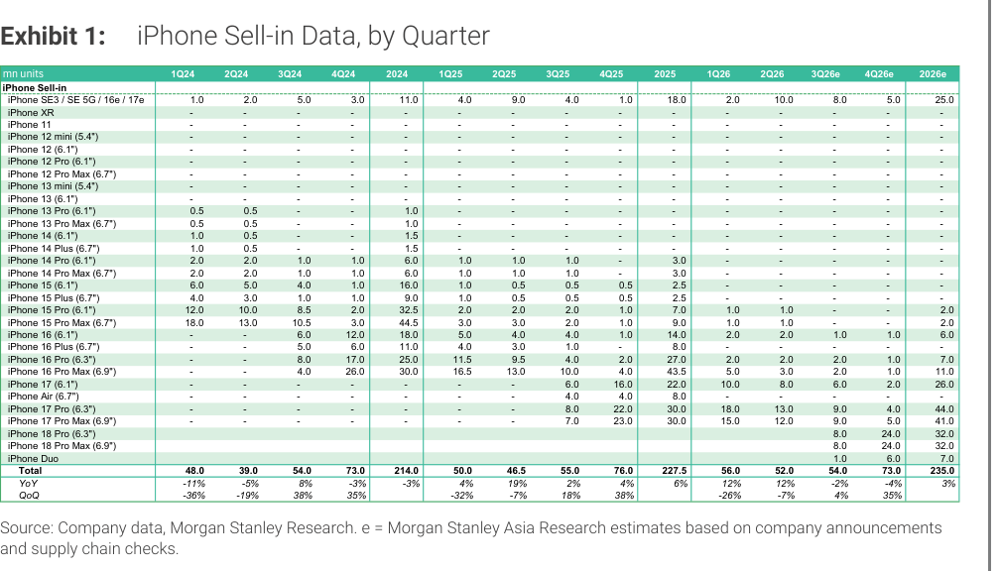
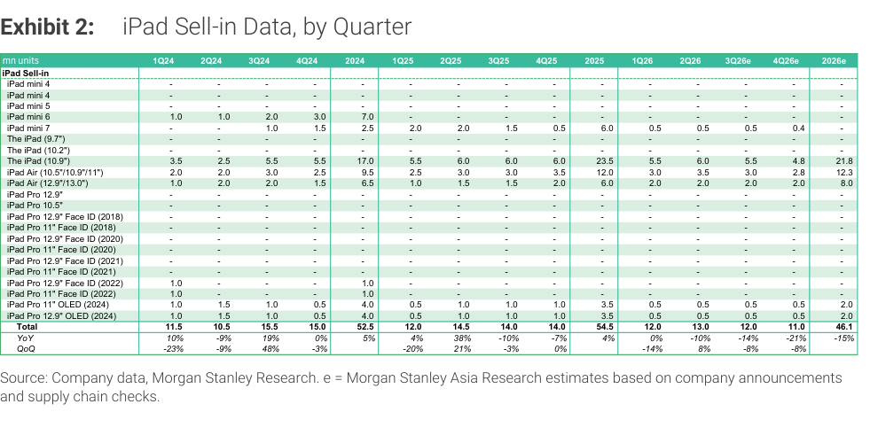

# MS｜iPhone & iPad 月度出貨量追蹤 — 3Q26 不動，首次導入 4Q26 預估

**券商**：Morgan Stanley  
**分析師**：Howard Kao、Derrick Yang、Andy Meng, CFA、Irene Yen、Vivi Huang、Betty Chen  
**日期**：2026-09-14  
**主題**：Greater China Technology Hardware Monthly Databook — iPhone/iPad build estimates  
**評級**：In-Line  
<a href="https://layx.uk/dl?g=產業&b=MS&d=20260914&h=iPhone-Monthly-Databook">📎 下載 PDF</a>

---

## 報告總結

3Q26 iPhone build estimate 維持不變（54M，+4% QoQ、-2% YoY），但 YoY 走弱的原因是本次 iPhone 18 周期只推出高端 SKU（18 Pro/Pro Max + iPhone Duo），標準 iPhone 18 延後至 1H27 發售——亦即今年新機數量比去年少一個 SKU。本報告首次導入 4Q26 iPhone estimate（73M，+35% QoQ、-4% YoY）與 4Q26 iPad estimate（11M，-8% QoQ、-21% YoY）；全年 iPhone 235M（+3% YoY），iPad 46.1M（-15% YoY）。

iPhone Duo（折疊機）起始售價 US\$1,999，低於市場預期的 US\$2,300+，對 build 偏正面，但仍有生產問題，導致上市延遲一個月；2H26 共 7M 台，後續 ramp 速度是關鍵變數。

---

## MS 完整投資邏輯鏈

| 論點層次 | Exhibit | 內容 |
|---|---|---|
| 新機周期確認 | Exhibit 1 | iPhone 18 Pro/Pro Max 3Q26e 各 8M，iPhone Duo 3Q26e 1M（4Q26e 急升至 6M） |
| SKU 結構轉高端 | 封面 | 2H26 新機 71M（-21% YoY），少一個 SKU；iPhone 18 標準版推至 1H27 |
| Duo 定價正面 | 封面 | 起始售價 US\$1,999（vs. 市場預期 US\$2,300+），但有生產問題，上市晚一個月 |
| iPad 需求降溫 | Exhibit 2 | 3Q26e 12M（-14% YoY）、4Q26e 11M（-21% YoY），1H 提前拉貨 + 漲價壓需求 |
| **結論** | 封面 | **2026 iPhone 全年 235M（+3% YoY），增量來自 Duo 而非量的擴張；iPad 則明顯萎縮** |

> **報告最大邏輯缺口**：MS 未提供 iPhone Duo 生產問題的具體原因或修復時程，「仍在解決中」的定性描述使 4Q26e Duo 6M 估計的可靠度存疑；若 ramp 持續卡關，4Q 總量 73M 將面臨下行風險。

---

## 報告核心觀點

| 主題 | MS 觀點 | 市場共識 | 是否 Contra-Consensus |
|---|---|---|---|
| 3Q26 iPhone build | 54M（不變，-2% YoY） | 與 MS 大致一致 | 否 |
| 4Q26 iPhone build | 73M（首次給出，-4% YoY） | 市場尚無官方預估 | 定性偏保守（YoY 下滑） |
| iPhone Duo 定價 | US\$1,999 起（低於預期） | 市場預期 US\$2,300+ | 是，正面意外 |
| iPhone Duo 生產 | 有問題，上市延後一個月 | 市場預期順利量產 | 是，負面意外 |
| 全年 iPhone | 235M（+3% YoY） | 前期市場預估多在 +5%+ | 偏保守 |
| 全年 iPad | 46.1M（-15% YoY） | 市場普遍預期個位數下滑 | 顯著偏空 |

**偏好排序**：MS 整體 In-Line；報告未點名個股偏好，但 Foxconn（2317）與 Pegatron（4938）作為 iPhone 主要 OEM 受 Duo 生產問題影響最大。  
**個股影響**：Foxconn（2317）、Pegatron（4938）、大立光（3008）、台積電（2330，A18 Pro chip）。

---

## Exhibit 1｜iPhone Sell-in Data, by Quarter

### 解讀摘要

3Q26e 總量 54M 維持不變，但組成結構大幅轉向高端：18 Pro（8M）+ 18 Pro Max（8M）+ Duo（1M）= 17M 新機，加上延續銷售的 iPhone 17 系列（6+9+9M = 24M）共 41M，其餘由 16 Pro 系列與 SE 系補足。4Q26e 73M 的驅動力幾乎全由 18 Pro（24M）+ 18 Pro Max（24M）+ Duo（6M）= 54M 承擔，佔比達 74%——這意味著 4Q 結果高度集中在這三個 SKU 的 ramp 能否達成。

iPhone Duo 的 3Q→4Q 爬升（1M→6M，+500%）是本季最大的上行 / 下行風險來源：定價低於市場預期 US\$500 對需求有支撐，但生產問題尚未解決、上市已延一個月，技術性 ramp 的不確定性仍高。

### 表格

| SKU（mn units） | 1Q24 | 2Q24 | 3Q24 | 4Q24 | 2024 | 1Q25 | 2Q25 | 3Q25 | 4Q25 | 2025 | 1Q26 | 2Q26 | 3Q26e | 4Q26e | 2026e |
|---|---|---|---|---|---|---|---|---|---|---|---|---|---|---|---|
| iPhone SE / 16e / 17e | 1.0 | 2.0 | 5.0 | 3.0 | 11.0 | 4.0 | 9.0 | 4.0 | 1.0 | 18.0 | 2.0 | 10.0 | 8.0 | 5.0 | 25.0 |
| iPhone 15 Pro (6.1") | 12.0 | 10.0 | 8.5 | 2.0 | 32.5 | 2.0 | 2.0 | 2.0 | 1.0 | 7.0 | 1.0 | 1.0 | - | - | 2.0 |
| iPhone 15 Pro Max (6.7") | 18.0 | 13.0 | 10.5 | 3.0 | 44.5 | 3.0 | 3.0 | 2.0 | 1.0 | 9.0 | 1.0 | 1.0 | - | - | 2.0 |
| iPhone 16 (6.1") | - | - | 6.0 | 12.0 | 18.0 | 5.0 | 4.0 | 4.0 | 1.0 | 14.0 | 2.0 | 2.0 | 1.0 | 1.0 | 6.0 |
| iPhone 16 Pro (6.3") | - | - | 8.0 | 17.0 | 25.0 | 11.5 | 9.5 | 4.0 | 2.0 | 27.0 | 2.0 | 2.0 | 2.0 | 1.0 | 7.0 |
| iPhone 16 Pro Max (6.9") | - | - | 4.0 | 26.0 | 30.0 | 16.5 | 13.0 | 10.0 | 4.0 | 43.5 | 5.0 | 3.0 | 2.0 | 1.0 | 11.0 |
| iPhone 17 (6.1") | - | - | - | - | - | - | - | 6.0 | 16.0 | 22.0 | 10.0 | 8.0 | 6.0 | 2.0 | 26.0 |
| iPhone Air (6.7") | - | - | - | - | - | - | - | 4.0 | 4.0 | 8.0 | - | - | - | - | - |
| iPhone 17 Pro (6.3") | - | - | - | - | - | - | - | 8.0 | 22.0 | 30.0 | 18.0 | 13.0 | 9.0 | 4.0 | 44.0 |
| iPhone 17 Pro Max (6.9") | - | - | - | - | - | - | - | 7.0 | 23.0 | 30.0 | 15.0 | 12.0 | 9.0 | 5.0 | 41.0 |
| iPhone 18 Pro (6.3") | - | - | - | - | - | - | - | - | - | - | - | - | 8.0 | 24.0 | 32.0 |
| iPhone 18 Pro Max (6.9") | - | - | - | - | - | - | - | - | - | - | - | - | 8.0 | 24.0 | 32.0 |
| iPhone Duo | - | - | - | - | - | - | - | - | - | - | - | - | 1.0 | 6.0 | 7.0 |
| **Total** | **48.0** | **39.0** | **54.0** | **73.0** | **214.0** | **50.0** | **46.5** | **55.0** | **76.0** | **227.5** | **56.0** | **52.0** | **54.0** | **73.0** | **235.0** |
| YoY | -11% | -5% | 8% | -3% | -3% | 4% | 19% | 2% | 4% | 6% | 12% | 12% | -2% | -4% | 3% |
| QoQ | -36% | -19% | 38% | 35% | | -32% | -7% | 18% | 38% | | -26% | -7% | 4% | 35% | |

> **原文補充**：MS 指出 iPhone 18 標準款（非 Pro）預計 1H27 推出；iPhone Duo 起始售價 US\$1,999 相對市場預期 US\$2,300+ 低，對 build 有利，但因生產問題比原定計畫晚一個月上市，目前持續追蹤 ramp-up 進度。

> **洞察一**：2026 全年 iPhone 18 新機（Pro × 2 + Duo）合計 71M 台，YoY -21%——這完全是因為「少一個 SKU」而非需求走弱。若加回歷年標準款（iPhone 17 在 2025 年貢獻 22M），2026 現有預估 71M 與去年 iPhone 17 家族（17 + 17 Pro + 17 Pro Max + Air = 22+30+30+8 = 90M）相比確實少 21%，且落差幾乎等於「標準款 18 的缺席」（~20M）。

> **洞察二（配合 Exhibit 2）**：iPhone Duo 的 4Q26 6M 估計若有 10% 下修（降至 5.4M），全年 iPhone 就從 235M 降至 234M，影響尚可接受；但若 Duo 全面 miss（如只達 3M），則 4Q26 可能從 73M 降至 70M，YoY 從 -4% 惡化至 -8%，市場對 4938 / 2317 等 OEM 的情緒可能快速翻空。

---

## Exhibit 2｜iPad Sell-in Data, by Quarter

### 解讀摘要

iPad 2026 全年估計 46.1M，YoY -15%——遠大於 iPhone 的 +3%。原因有二：1H 提前拉貨消耗了需求（1Q26 12M 相當於旺季 2Q 水位以下），加上 iPad 均價因產品組合轉高端（Pro OLED）而上升，壓縮了量的空間。4Q26e 11M（-21% YoY）的下滑幅度明顯大於 iPhone 4Q -4%，呈現 iPad 在 2H 的去庫壓力比 iPhone 更為嚴重。

iPad Air（11"/13" 兩種尺寸）是 2025–2026 的主力出貨品，2025 全年合計 ~35M 台；2026 在兩尺寸合計略降至 ~34M，相對穩定，顯示 iPad 萎縮主要集中在 mini 與 Pro 系列。

### 表格

| SKU（mn units） | 1Q24 | 2Q24 | 3Q24 | 4Q24 | 2024 | 1Q25 | 2Q25 | 3Q25 | 4Q25 | 2025 | 1Q26 | 2Q26 | 3Q26e | 4Q26e | 2026e |
|---|---|---|---|---|---|---|---|---|---|---|---|---|---|---|---|
| iPad mini 6 | 1.0 | 1.0 | 2.0 | 3.0 | 7.0 | - | - | - | - | - | - | - | - | - | - |
| iPad mini 7 | - | - | 1.0 | 1.5 | 2.5 | 2.0 | 2.0 | 1.5 | 0.5 | 6.0 | 0.5 | 0.5 | 0.5 | 0.4 | - |
| iPad Air (10.5"/10.9"/11") | 3.5 | 2.5 | 5.5 | 5.5 | 17.0 | 5.5 | 6.0 | 6.0 | 6.0 | 23.5 | 5.5 | 6.0 | 5.5 | 4.8 | 21.8 |
| iPad Air (12.9"/13.0") | 2.0 | 2.0 | 3.0 | 2.5 | 9.5 | 2.5 | 3.0 | 3.0 | 3.5 | 12.0 | 3.0 | 3.5 | 3.0 | 2.8 | 12.3 |
| The iPad (10.9") | 1.0 | 2.0 | 2.0 | 1.5 | 6.5 | 1.0 | 1.5 | 1.5 | 2.0 | 6.0 | 2.0 | 2.0 | 2.0 | 2.0 | 8.0 |
| iPad Pro 11" OLED (2024) | 1.0 | 1.5 | 1.0 | 0.5 | 4.0 | 0.5 | 1.0 | 1.0 | 1.0 | 3.5 | 0.5 | 0.5 | 0.5 | 0.5 | 2.0 |
| iPad Pro 12.9" OLED (2024) | 1.0 | 1.5 | 1.0 | 0.5 | 4.0 | 0.5 | 1.0 | 1.0 | 1.0 | 3.5 | 0.5 | 0.5 | 0.5 | 0.5 | 2.0 |
| **Total** | **11.5** | **10.5** | **15.5** | **15.0** | **52.5** | **12.0** | **14.5** | **14.0** | **14.0** | **54.5** | **12.0** | **13.0** | **12.0** | **11.0** | **46.1** |
| YoY | 10% | -9% | 19% | 0% | 5% | 4% | 38% | -10% | -7% | 4% | 0% | -10% | -14% | -21% | -15% |
| QoQ | -23% | -9% | 48% | -3% | | -20% | 21% | -3% | 0% | | -14% | 8% | -8% | -8% | |

> **原文補充**：MS 將 3Q26e iPad build 不變維持在 12M，下滑原因為 1H 提前拉貨（pull-forward demand）以及均價上升抑制量的需求。4Q iPad 估計為首次導入。

> **洞察一**：iPad 2026e 46.1M（-15% YoY）vs. iPhone 235M（+3% YoY），同為 Apple 產品卻走出完全相反的方向——根本原因是 iPad 已完成前一波 OLED 升級周期（2024–2025 年 iPad Pro OLED 拉貨），而 iPhone 現在才進入 Duo（折疊機）的全新需求創造階段。對 ODM 供應鏈而言，這意味著 Foxconn / Pegatron 的 iPad 產線面臨更高的閒置風險。

---

## 相關個股清單

| 類別 | 公司 | Ticker | 評等 | 備註 |
|---|---|---|---|---|
| iPhone OEM | 鴻海 Foxconn | 2317.TW | OW | iPhone Duo 主要 OEM，生產問題直接衝擊 |
| iPhone OEM | 和碩 Pegatron | 4938.TW | EW | iPhone 18 Pro Max 主要組裝商 |
| iPhone 關鍵零組件 | 大立光 Largan | 3008.TW | - | iPhone 18 Pro 鏡頭，受 SKU 高端化受益 |
| iPad OEM | 鴻海 Foxconn | 2317.TW | OW | iPad 產線閒置風險上升 |
