# UBS｜APAC Focus: AI Power — From Watts to Gigawatts

**券商**：UBS  
**分析師**：Randy Abrams、Nicolas Gaudois、Timothy Arcuri、Francois-Xavier Bouvignies、Tim Bush、Kenji Yasui、Gregg Orrill、Shneur Z. Gershuni CFA、Andre Kukhnin、Amit Mehrotra、Shingo Hirata CFA、Kunlun Li  
**日期**：2026-09-14  
**主題**：APAC Focus: AI Power — From Watts to Gigawatts  
**評級**：N/A（產業主題報告）  
<a href="https://layx.uk/dl?g=產業&b=UBS&d=20260914&h=AI-Power">📎 下載 PDF</a>

---

## 報告總結

本報告為 UBS 跨部門（亞洲硬體、半導體、電力公用事業、電子零件）合作的 67 頁 AI 電源深度報告，核心論點是：AI 計算的高速成長正使「電力」成為下一個供應瓶頸，但架構升級（PSU → 電源層架 → 800VDC 電源機架 → SST）本身會使每瓦電源內容值持續膨脹，即使 GW 部署量因電網限制而趨緩，電源 TAM 依然能維持高速成長。UBS 採用自下而上的平台 BOM 模型，將各加速器平台的機架數量、TDP、架構轉換參數直接對應到電源內容，估算 AI 伺服器電源 TAM 從 2025 年 US\$66 億以 69% CAGR 成長至 2030 年 US\$911 億，2027 年（US\$382 億）是最大的年度增量節點。

報告最大的差異化論點是：**2027 年的強勁成長並不需要 800V 廣泛普及**——Rubin 每 GW 帶來的架構升級內容增量，加上 +92% YoY 的 IT GW 部署量增長，已足以驅動 TAM。800V 反而在 2028–29 年成為更大的貢獻因子。偏好個股：Delta（廣最廣的 grid-to-chip 佈局，Buy）、光寶科（首次覆蓋 Buy，NT\$400）；電源半導體偏好 TI、ADI、STM，謹慎看待 Infineon（Neutral）。

---

## UBS 完整投資邏輯鏈

| 論點層次 | Figure | 內容 |
|---|---|---|
| 計算密度驅動電源密度 | Fig. 7–10 | 每 GPU 封裝功耗 700W（Hopper）→ 2.3kW（Vera Rubin）；每機架 TDP 45kW → 227kW+；多 die 封裝趨勢不可逆 |
| GW 部署量強勁但受電網上限 | Fig. 18–23 | 2027E +92% YoY IT GW；全球 DC 在建 201GW；美國備用容量率 2027 後跌破 20% 警戒線 |
| 每瓦電源內容隨架構升級膨脹 | Fig. 28–45 | Hopper \$0.42/W → GB300 \$0.68/W → VR300 \$0.73/W → 2030E \$0.87/W；800V 架構每瓦超過 \$1.00 |
| 2027 成長不依賴 800V | Fig. 50–51 | NVIDIA 電源機架普及率每 +10ppt 僅影響 TAM ~1%；主驅動力是 GW 成長與 Rubin 架構升級 |
| 2030 TAM ASIC 近追 GPU | Fig. 55 | GPU Power TAM \$491億（54%）vs ASIC \$420億（46%）；Google、AWS 各達 \$202億／\$137億 |
| 供應商定位分化 | Fig. 66–67、71 | Delta + 光寶科直接受益（grid-to-chip 廣度）；Vertiv/Schneider/Eaton 灰色空間滲透；Megmeet 中國後起挑戰者 |
| **結論** | 封面 | **Buy Delta、光寶科；電源半導體 Buy TI、ADI、STM；Infineon Neutral；BBU 看好 Panasonic（圓柱型）、Samsung SDI（LFP/UPS）** |

> **報告最大邏輯缺口**：2028–30 的 GW 部署量預測依賴電網基礎設施能如期到位，但 UBS 自己的公用事業團隊估算美國 2030 年備用容量率降至 14.6%，低於 20% 的安全門檻。若電網瓶頸比假設更嚴重，2030E \$911億 TAM 將面臨下行風險。

---

## 報告核心觀點

| 主題 | UBS 觀點 | 市場共識 | 是否 Contra-Consensus |
|---|---|---|---|
| 2027 AI 電源 TAM | US\$382億（+116% YoY） | 市場普遍聚焦 800V 延遲作為逆風 | 是，UBS 認為 2027 不依賴 800V 廣泛普及 |
| 800V 電源機架重要性 | 2028 後才成為主驅動 | 市場擔憂 800V 延遲拖累 2026–27 | 是，UBS 實際上佐証延遲影響有限 |
| ASIC 電源 TAM 規模 | 2030E \$420億（46% 市佔） | 多數模型以 NVIDIA 為主 | 是，ASIC（尤其 Google、AWS）規模被低估 |
| Delta 電源 TAM 市佔 | ~40% 穩守（\$354億 2030E） | 市場擔憂競爭侵蝕 | 否，UBS 認為 breadth 形成護城河 |
| 光寶科 首次覆蓋 | Buy，NT\$400 目標（上漲空間可觀） | 多數未覆蓋或中性 | 是，看好執行力改善與 ASIC 客戶滲透 |
| 電源半導體 | TI/ADI/STM 優於 Infineon | 市場多數中性看待整個板塊 | 部分，對 Infineon 的謹慎態度為 Contra |

**偏好排序**：Delta、Lite-On（電源供應）；TI、ADI、STM（電源半導體）；Panasonic（BBU）  
**謹慎個股**：Infineon（高市佔但高預期）；Megmeet（潛力但目前規模小）

---

## Fig. 1｜Higher voltage distribution shifts rectification upstream and final DC/DC closer to the silicon

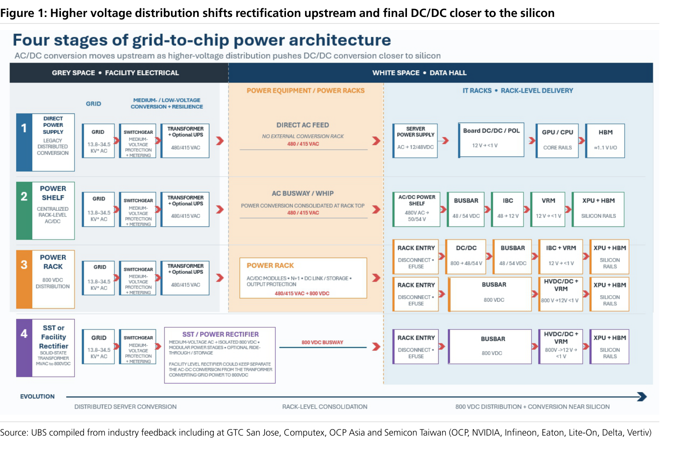

### 解讀摘要

這是全報告的核心架構示意圖：隨著分配電壓從 48/54V 升至 800V，AC/DC 整流逐步移出 IT 機架（上游化），而 DC/DC 降壓轉換則往矽晶片側移動（下游化）。這兩個方向的移動都創造電源電子 BOM 的新增內容，而不是零和替換——高壓側新增功率機架、BBU/CBU、HVDC 分配、保護控制；低壓側新增高比率 DC/DC 模組與垂直供電 VRM。

---

## Fig. 2｜AI Power TAM build-up: rising watts per rack drive the majority of growth

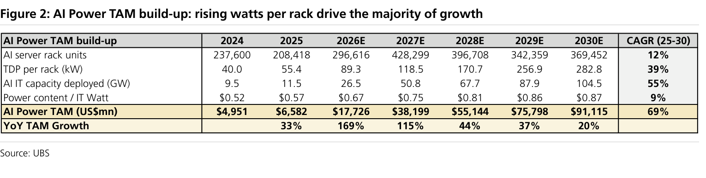

### 解讀摘要

TAM 增量分解圖：機架數量（+12% CAGR）是最小的貢獻因子；每機架 TDP（+39% CAGR）是最大貢獻因子；每瓦電源內容（+9% CAGR）提供結構性補充。三者乘積驅動 TAM 從 2025 年 \$66億 成長至 2030 年 \$911億。這個分解強調 Rubin/VR300 之後的機架即使數量不大幅成長，TDP 本身的膨脹也足以驅動電源 TAM——架構升級比出貨量更重要。

> **原文補充**：UBS 的三因子框架（rack units × TDP/rack × \$/W）是全報告定量估算的基礎；2030E TAM 之所以能達到 \$911億，最主要的驅動是 NVDA NVL72+ 平台從 2025 年 124kW 到 2030 年 1,200kW 的 TDP CAGR 57%。

---

## Fig. 3｜AI power TAM growth moderates after 2027, but annual dollar increases remain substantial

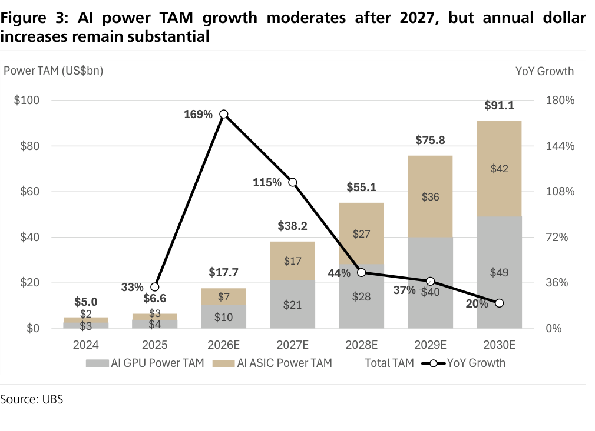

### 解讀摘要

YoY 成長率（右軸）呈現倒 U 形：2026 +168% → 2027 +116% → 2028 +44% → 2029 +37% → 2030 +20%。但年度絕對金額增量（左軸）在 2028–30 依然是 \$170億 / \$206億 / \$152億 的持續大規模增長。這與電網限制的論述一致：即使成長率趨緩，每年仍有巨額新電源裝機。

---

## Fig. 4｜2027 TAM sensitivity: US\$38.2bn base case at 50.8GW and US\$0.75/W

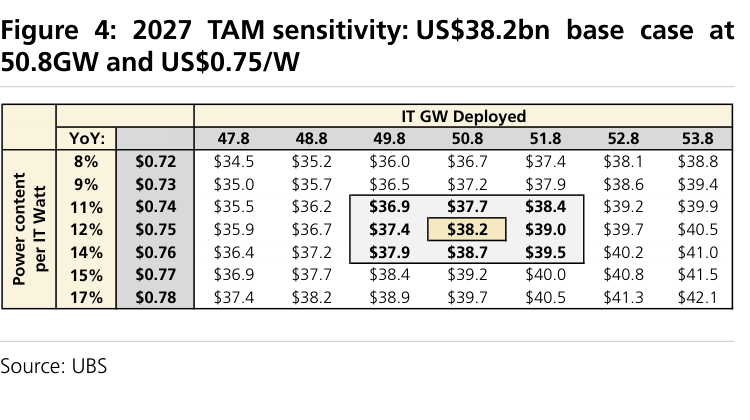

### 解讀摘要

2027 TAM 雙因子敏感度矩陣（IT GW deployed × 每瓦電源內容）。Base case：50.8GW、\$0.75/W → TAM \$382億。每增加 1GW 的 IT 容量約 +\$4.2億 TAM；每增加 \$0.01/W 約 +\$2.9億 TAM。GW 因子的彈性（每 GW 影響）高於內容因子，顯示部署規模是比架構升級更敏感的變數。

---

## Fig. 5｜2027 TAM growth sensitivity: +4.2ppt per +1GW and +2.9ppt per +\$0.01/W

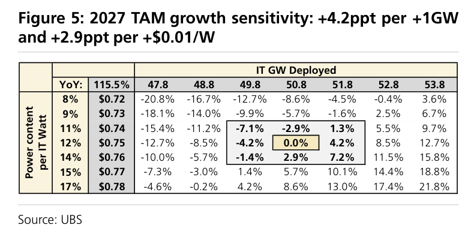

### 解讀摘要

成長率敏感度圖（對應 Fig. 4 的 YoY 版本）。Base case +116% YoY。GW 每 +1GW 貢獻 +4.2ppt；每瓦電源內容每 +\$0.01 貢獻 +2.9ppt。敏感度對稱：若 GW 低於預估 3GW（-12.6ppt），比電源內容低估 \$0.03/W（-8.7ppt）更傷。這支持 UBS 對電網瓶頸的重視程度高於 800V 普及速度。

---

## Fig. 7｜TSMC's tech roadmap supporting multiple accelerators per package

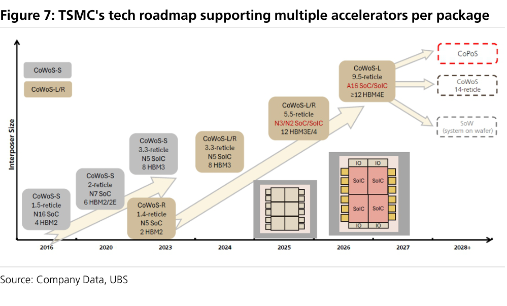

### 解讀摘要

TSMC CoWoS 封裝路線圖：從 12" 晶圓（CoWoS-S/L）延伸至 310×310mm 的 CoPoS（晶圓級面板封裝），預計 2028 年量產。每張面板可支援比 12" 晶圓更多的 compute dies + HBM stacks，使每 GPU 封裝從 Blackwell 的 2 dies（3.5 reticle）延伸至 4+ dies。這是 GPU 每封裝功耗從 1.3kW（Blackwell）升至 4–8kW 的技術基礎。

---

## Fig. 8｜Scale-up has an 18x bandwidth advantage over scale-out

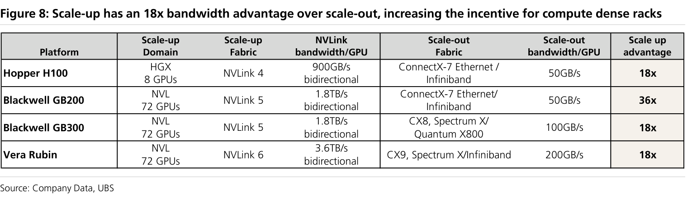

### 解讀摘要

NVLink（scale-up）vs InfiniBand/Ethernet（scale-out）頻寬比較：Hopper 900GB/s → Rubin 3.6TB/s（+18x），而 scale-out 在同期僅從 50GB/s 升至 200GB/s（+4x）。18x 的 scale-up 帶寬優勢是 NVIDIA 持續推升每機架 GPU 數量（72→144+）的根本動機：MoE 推論、tensor parallelism 在機架內通訊效率遠高於跨機架，這推動了機架密度升級，也推動了電源 TDP 升級。

---

## Fig. 9｜AI GPUs from AMD and NVIDIA increasing # of dies and power per package

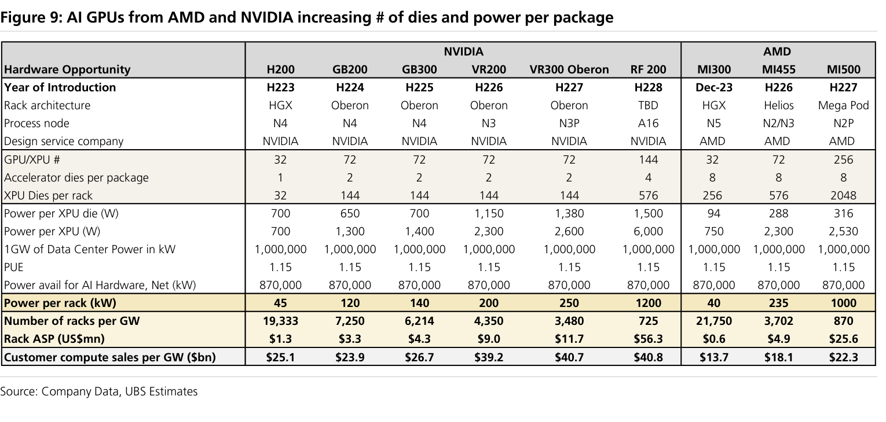

### 解讀摘要

NVIDIA 與 AMD GPU 路線圖的多維度密度升級：每封裝 dies 數量（Hopper 1 die → Blackwell 2 dies → Rubin 2 dies；AMD MI300 4 dies → MI455 6 dies）、每 die 功耗（H100 ~700W → VR 1,150W）、每機架 GPU 數量（32 → 72 → 可能 144+）三軸同時推升，驅動每機架 TDP 從 45kW（Hopper）到 227kW（VR200）再到預計 1,200kW（RF200/Feynman）。

---

## Fig. 10｜Leading ASIC platforms from AWS and Google also scaling up power per rack

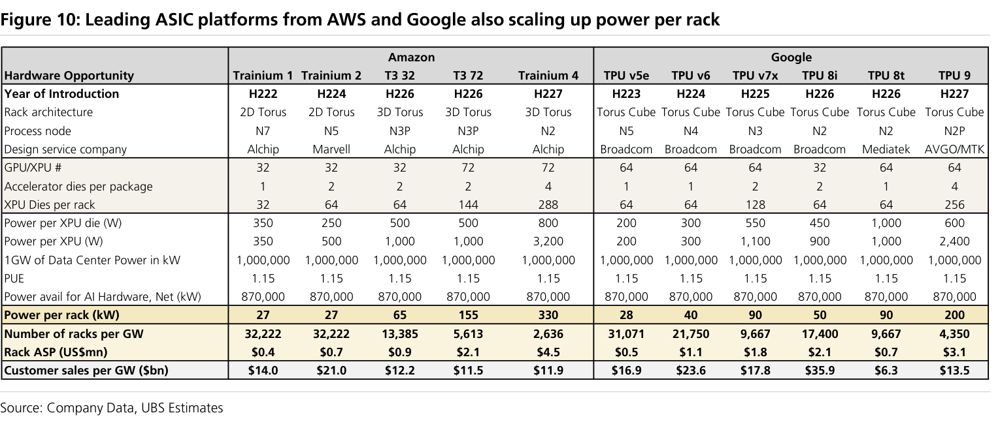

### 解讀摘要

AWS Trainium 和 Google TPU 的機架 TDP 升級路徑：Trainium 1 (27kW) → T2 (27kW) → T3 (65kW) → Teton3 Max (155kW) → T4 (估 250kW+)；Google TPU v5e (28kW) → v8i (90kW) → v9 (200kW)。ASIC 平台的 TDP 升級速度與 NVIDIA 相當，支撐 UBS 對 ASIC 電源 TAM（2030E \$420億）的估算。

---

## Fig. 11｜Hyperscaler cloud seeing high growth

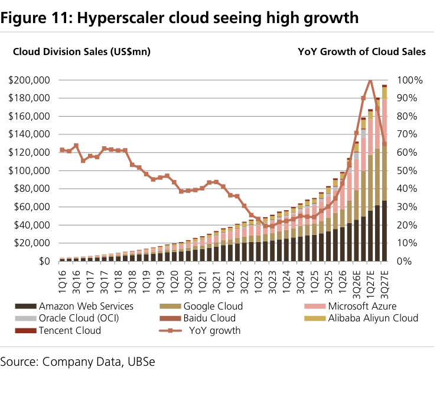

### 解讀摘要

頂級 hyperscaler 雲端收入年增率趨勢：UBS 預估 2026 年底前加速接近 100% YoY，之後 2027H2 趨緩至 ~70% YoY。Cloud backlog 達 US\$2.5trn（+197% YoY），佔年化雲端營收 578%。強勁的 backlog 和雲端利潤率改善（AWS OpM 39.4%、GCP 35.6%）是 hyperscaler 持續擴張 capex 的基礎。

---

## Fig. 12｜Internet service growth also picking up

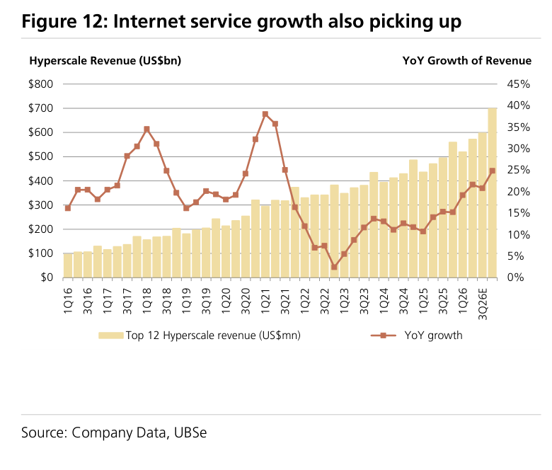

### 解讀摘要

網際網路服務（廣告、搜尋、電商）的 YoY 成長率從 2023 年初 <5% 加速至 2026 年 +25%，反映 AI 應用在消費端的貨幣化落地。這進一步強化 hyperscaler 持續投資 AI 基礎設施的意願，也支撐 UBS 對 2026–27 capex 不減速的判斷。

---

## Fig. 13｜Operating CF improving to ~40% YoY

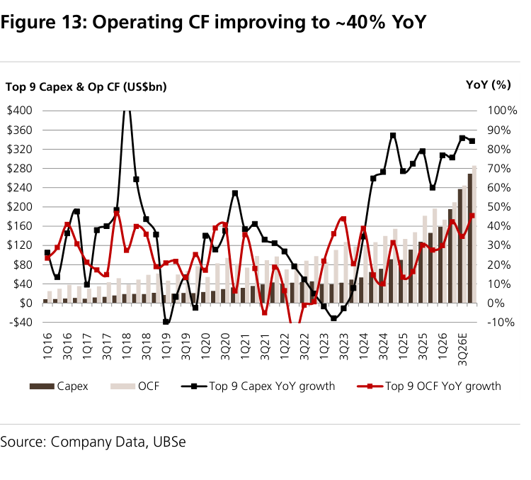

### 解讀摘要

頂 12 家 hyperscaler 合計營業現金流預估：2026E US\$9140億（+38% YoY）、2027E US\$1.27trn（+38% YoY）。現金流改善是 capex 擴張能夠持續的內在支撐。但 2027 的 capex-to-OCF 缺口約 US\$1600億，仍需外部融資（資本市場 + 現有 US\$6280億 net cash 支撐）。

---

## Fig. 14｜Capex may moderate to a more sustainable level of operating cash flow growth

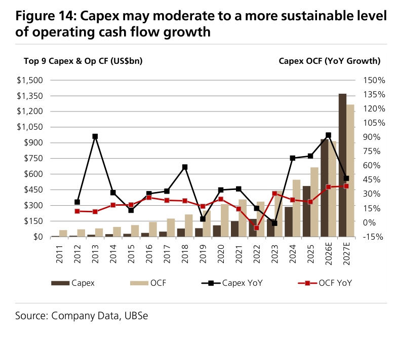

### 解讀摘要

Capex 路徑：UBS 上調頂 12 家 hyperscaler 2026–27E capex 至 US\$9980億 / US\$1.447trn（+97%/+45% YoY）。但 UBS 模型從 2028 年起將 capex 增速向 OCF 增速收斂（30–40% YoY），理由是 capex 已超過 OCF、需要持續資本市場融資，加上電網限制、AI 開源模式衝擊等不確定因素。這是 UBS 對 2028–30 IT GW 部署量採保守假設的基礎。

---

## Fig. 15｜Accelerator shipments: +39% compute die unit CAGR

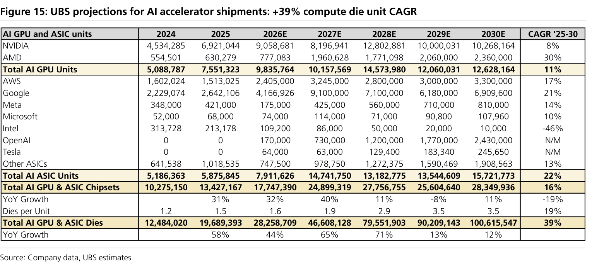

### 解讀摘要

UBS 預估 GPU/ASIC 加速器芯片出貨量：從 2025 年 1,970萬 dies 成長至 2030 年 1.006億 dies（CAGR +39%）。2027–28 增速最快（+65%/+71% YoY），之後放緩至 +10–15%。這個 die 出貨預估是電源 TAM 模型的輸入之一（換算成機架數量後再乘上 TDP 和 \$/W）。

---

## Fig. 16｜UBS forecast for AI GPU and ASIC racks: possible peak in 2027

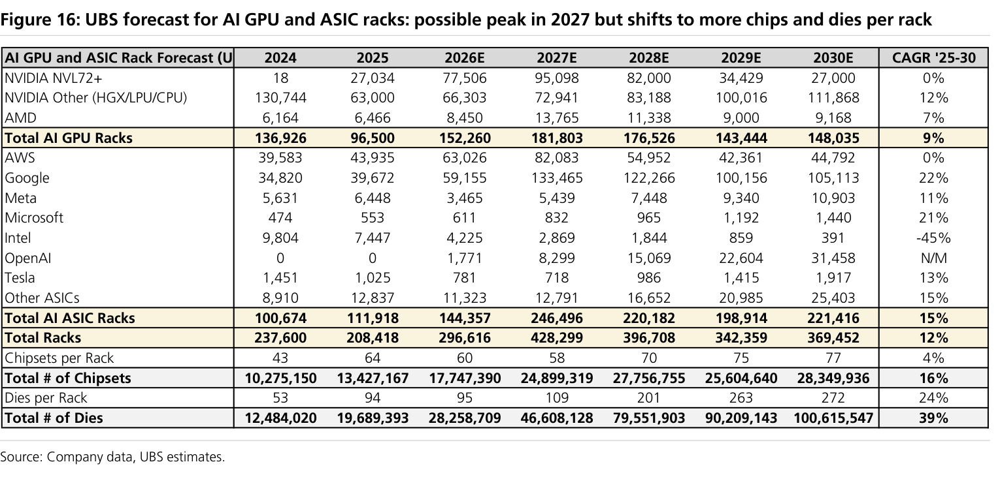

### 解讀摘要

AI 機架出貨量預估：總機架數 2025 年 208k → 2026E 297k → 2027E 428k（峰值）→ 2030E 369k（-14%）。峰值後下降的原因不是需求萎縮，而是每機架 GPU 數量持續增加（平均 chipsets/rack 從 43 升至 77），使相同的 GPU 出貨量需要更少的機架數。電源 TAM 並不因此減少，因為 TDP/rack 同時大幅上升。

---

## Fig. 17｜Thermal design power for racks increasing

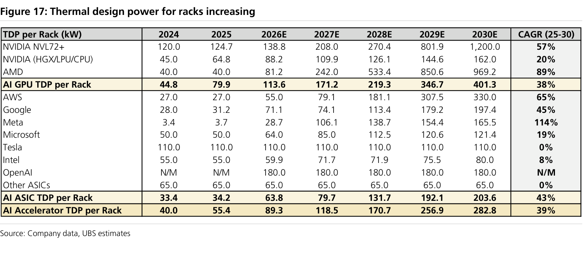

### 解讀摘要

平均機架 TDP 趨勢：2025 年 55kW → 2030E 283kW（CAGR +39%）。UBS 預計 2029–30 還有上行風險——隨著 TSMC CoPoS 和 Intel EMIB-T 支援更大型多 die 系統（4+ dies/package），即使機架 GPU 數量不變，TDP 也會繼續上升。這是電源內容膨脹的核心驅動力。

---

## Fig. 18｜Annual IT capacity deployed rises to ~105GW by 2030

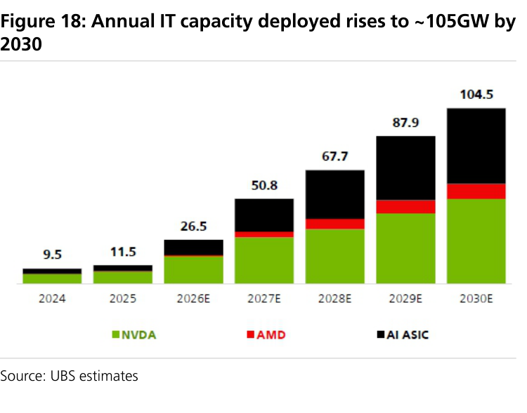

### 解讀摘要

年度 AI IT 容量部署：2024 年 9.5GW → 2027E 50.8GW（+92% YoY）→ 2030E 104.5GW。總計 2024–30 累計 358GW AI IT 容量部署，折算 PUE 1.12 後為 401GW 資料中心電力需求。2027 的 +92% YoY 是整個預測期中最大的年度增量，也是 UBS 認定 2027 為電源 TAM 最大節點的基礎。

---

## Fig. 19｜~337GW AI capacity deployed over 2026–30

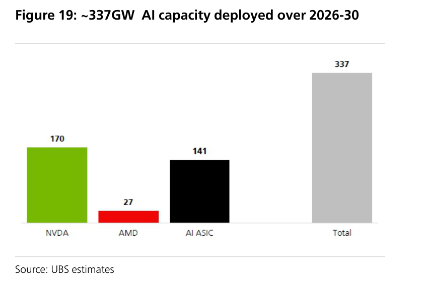

### 解讀摘要

2026–30 累計 AI IT 容量為 ~337GW，折算總資料中心需求約 380GW。這個數字與美國電網規劃中的已知 pipeline（126GW 在建/規劃）比較，缺口顯著。背後的假設是美國佔全球 55–60%，即需要約 200GW 的美國增量電力，遠超目前管線。

---

## Fig. 20｜GW of capacity deployed rising through 2030

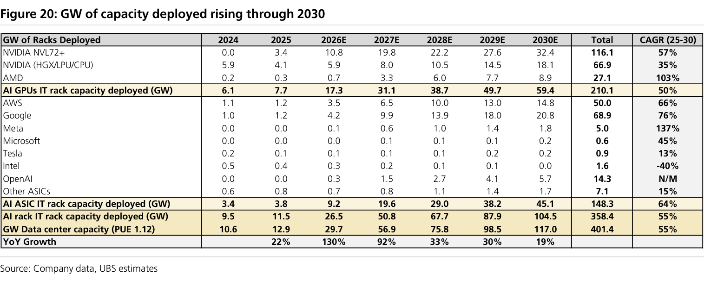

### 解讀摘要

按 GPU 平台分類的年度 AI IT GW 部署：NVIDIA NVL72+ 快速爬升至 2030E 32.4GW（CAGR 57%）；ASIC 平台合計 2030E 45.1GW（CAGR 64%）。ASIC 在 GW 維度的貢獻（45.1GW）超過 NVIDIA NVL72+（32.4GW），這是 ASIC 電源 TAM 近追 GPU 的基礎。

---

## Fig. 21｜Global data centers pipeline reaches 201GW

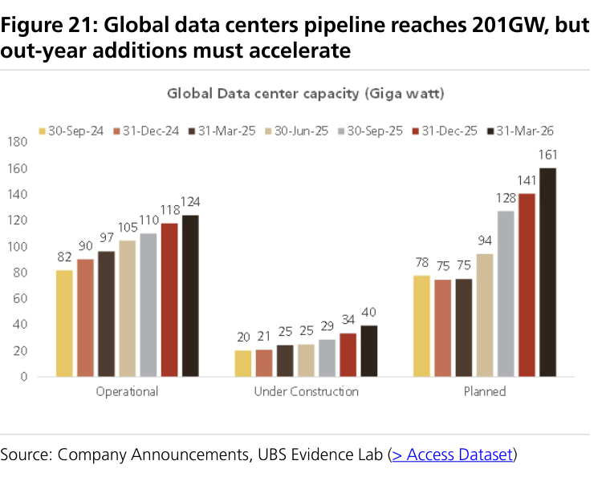

### 解讀摘要

UBS Evidence Lab 追蹤的全球資料中心在建/規劃管線：201GW（包含 126GW 在美國）。與 UBS 模型的 2027–30 需求（348GW）相比，近期（2026–27）的 pipeline 支撐充分；但到了 2029–30，現有管線需要大幅補充才能跟上需求。

---

## Fig. 22｜US planned/under-construction pipeline reaches 126GW

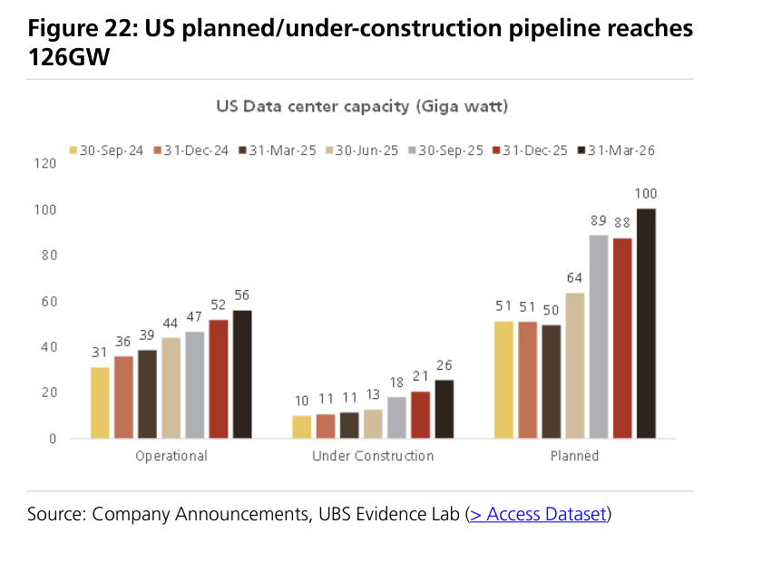

### 解讀摘要

美國資料中心在建/規劃管線地圖（126GW 按州分布）。德州、維吉尼亞州、亞利桑那州為主要集中地。與 UBS 估算的 ~200GW 美國增量需求相比，仍有約 74GW 的缺口需要靠後續許可與新建彌補，難度隨時間增加。

---

## Fig. 23｜US reserve margin falls below 20% after 2027 as data-center demand rises

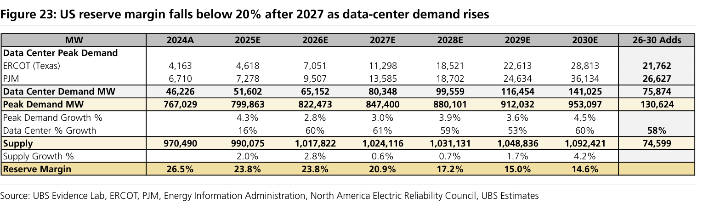

### 解讀摘要

UBS 美國電力公用事業分析師估算美國系統備用容量率：2026E 23.8% → 2027E 接近 20% → 2030E 14.6%。行業標準認為備用容量低於 20% 進入 cautionary zone，低於 15% 則進入 emergency zone。2030 年 14.6% 的備用容量率代表 AI 硬體部署可能在 2029–30 開始受到電網物理限制。

---

## Fig. 24｜Multiple grid and behind-the-meter sources are required to close the 2026–30 capacity gap

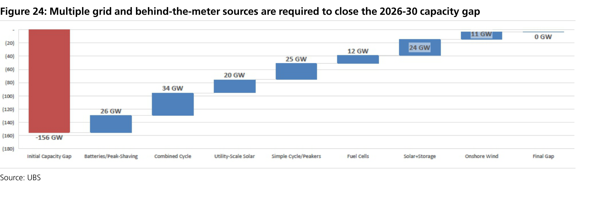

### 解讀摘要

填補 2026–30 電力缺口的來源分層：傳統電網（基礎場景 ~90GW）+ 電廠加速完工（~24GW 上行）+ 早期規劃項目推進（~151GW 潛在）+ 表後電源（電池儲能、天然氣、太陽能等 133–156GW）。UBS 認為現有來源總和可以覆蓋，但執行難度和時程是最大的不確定因素。

---

## Fig. 25｜Higher distribution voltage dramatically reduces current requirements

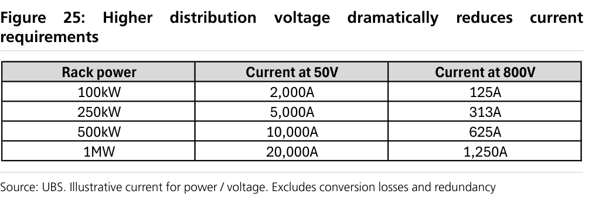

### 解讀摘要

電流需求 vs 配電電壓的計算圖：250kW 機架在 54V 配電需要 ~4,630A；升至 400V 僅需 625A；升至 800V 僅需 313A。電流減少 15x，理論上電阻損耗（= 電流平方 × 電阻）減少 200x。這是 800V 架構的物理吸引力所在——不只節省銅料和損耗，更使得 GW 級大型資料中心的配電工程在物理上可行。

---

## Fig. 27｜Power architecture shifts upstream — conversion closes in on silicon

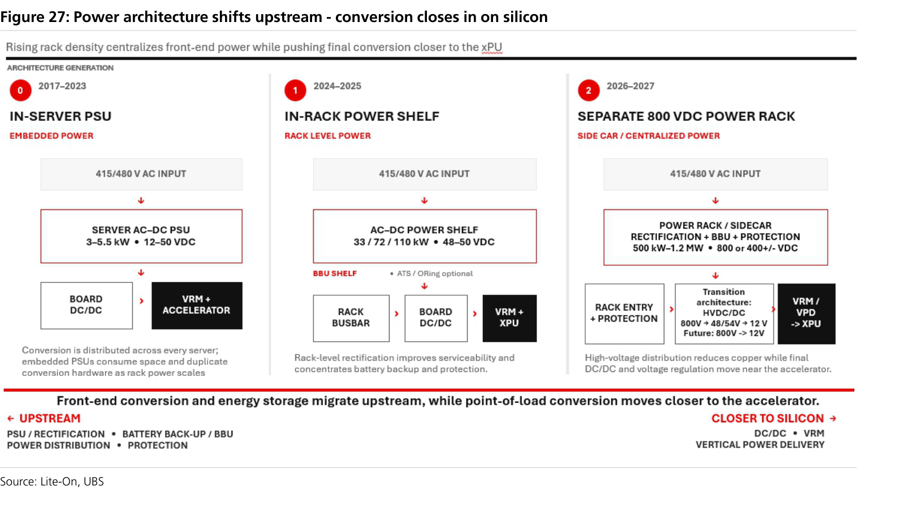

### 解讀摘要

四代電源架構演進圖：Gen 0（2017–23，伺服器 PSU，12/48VDC 分散式）→ Gen 1（2024–25，機架電源層架 48/54VDC）→ Gen 2（2026–27，獨立 800VDC 電源機架 sidecar）→ Gen 3（2028+，電源中心/電源區塊/SST）。每代升級都將 AC/DC 整流移至上游，使 DC/DC 轉換更靠近矽晶片，同時新增 BBU/CBU、HVDC 分配、保護控制的 BOM 內容。

> **原文補充**：Lite-On 是本圖的資料來源之一，暗示光寶科在 Gen 2–3 架構的設計參與深度與資訊優勢。

---

## Fig. 28｜AI power conversion scales from server PSUs to 110kW rack-level power shelves

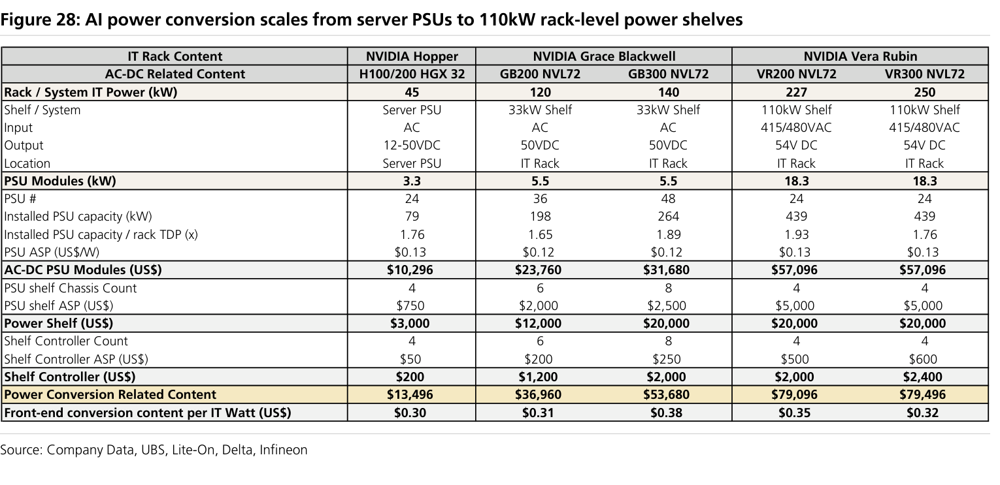

### 解讀摘要

NVIDIA 各平台的前端 AC-DC 轉換內容對比。VR200 的 PSU 模組升至 18.3kW（vs GB200 的 5.5kW），電源層架從 33kW 升至 110kW，AC-DC PSU 模組總值從 GB200 的 \$23,760 跳升至 VR200 的 \$57,096。前端轉換內容每瓦保持 \$0.30–\$0.38/W，顯示 PSU 環節的單位定價相對穩定，但因功率倍增而帶動絕對值大幅上升。

### 表格

| 指標 | Hopper H100×32 | GB200 NVL72 | GB300 NVL72 | VR200 NVL72 | VR300 NVL72 |
|---|---|---|---|---|---|
| 機架 TDP（kW） | 45 | 120 | 140 | 227 | 250 |
| PSU 模組（kW） | 3.3 | 5.5 | 5.5 | 18.3 | 18.3 |
| PSU 數量 | 24 | 36 | 48 | 24 | 24 |
| PSU ASP（US\$/W） | \$0.13 | \$0.12 | \$0.12 | \$0.13 | \$0.13 |
| AC-DC PSU 模組總值 | \$10,296 | \$23,760 | \$31,680 | \$57,096 | \$57,096 |
| 電源層架（US\$） | \$3,000 | \$12,000 | \$20,000 | \$20,000 | \$20,000 |
| 層架控制器（US\$） | \$200 | \$1,200 | \$2,000 | \$2,000 | \$2,400 |
| **前端轉換內容合計** | **\$13,496** | **\$36,960** | **\$53,680** | **\$79,096** | **\$79,496** |
| 前端轉換內容/IT Watt | \$0.30 | \$0.31 | \$0.38 | \$0.35 | \$0.32 |

> **洞察一**：VR200 vs VR300 的前端轉換內容幾乎相同（\$79,096 vs \$79,496），但 VR300 功率增加 10%（227→250kW）。這意味著 VR300 的電源密度效率提升（每瓦成本降低），對供應商而言 ASP 成長略低於瓦數成長——PSU 訂單量成長但不完全等比例。

---

## Fig. 29｜AMD and ASIC power conversion also scaling up from 33kW to 72kW shelves

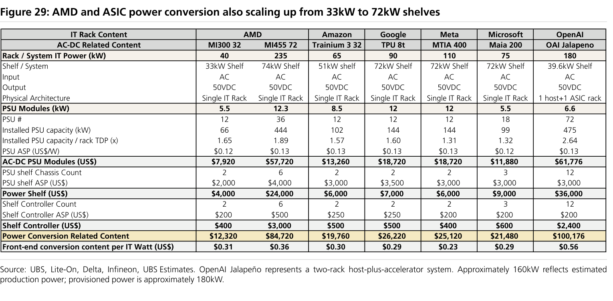

### 解讀摘要

AMD 和主要 ASIC 平台的前端 AC-DC 內容：AMD MI455 的前端轉換內容達 \$84,720（vs MI300 \$7,920）；OpenAI Jalapeño（雙機架主機+加速器系統）達 \$100,176，系統設計獨特（72 PSU、OAI 架構）。Google TPU 8t（\$26,220）和 Meta MTIA 400（\$25,120）規模相近。PSU ASP 各平台均維持 \$0.12–\$0.13/W，佐證 PSU 定價的市場一致性。

### 表格

| 平台 | TDP（kW） | 電源層架 | PSU 模組 kW | AC-DC PSU 模組 | 前端轉換 | \$/IT W |
|---|---|---|---|---|---|---|
| AMD MI300 32 | 40 | 33kW Shelf | 5.5 | \$7,920 | \$12,320 | \$0.31 |
| AMD MI455 72 | 235 | 74kW Shelf | 12.3 | \$57,720 | \$84,720 | \$0.36 |
| Amazon Trainium 3 32 | 65 | 51kW shelf | 8.5 | \$13,260 | \$19,760 | \$0.30 |
| Google TPU 8t | 90 | 72kW Shelf | 12 | \$18,720 | \$26,220 | \$0.29 |
| Meta MTIA 400 | 110 | 72kW Shelf | 12 | \$18,720 | \$25,120 | \$0.23 |
| Microsoft Maia 200 | 75 | 72kW Shelf | 5.5 | \$11,880 | \$21,480 | \$0.29 |
| OpenAI Jalapeño | 180 | 39.6kW Shelf | 6.6 | \$61,776 | \$100,176 | \$0.56 |

> **洞察一**：Microsoft Maia 200 的前端轉換 \$/W 最低（\$0.23），顯示 Maia 架構的電源效率較高，或電源架構相對簡單；OpenAI Jalapeño 最高（\$0.56），部分因雙機架結構（1 host + 1 ASIC rack）導致冗餘 PSU 需求更大。

---

## Fig. 30｜Storage and near silicon conversion lift power content faster than rack TDP

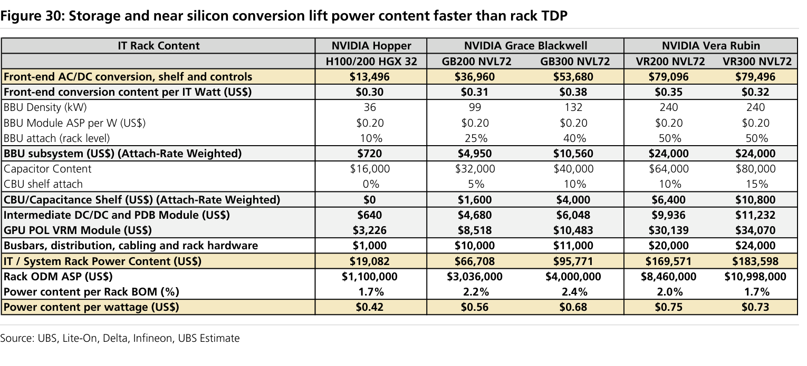

### 解讀摘要

NVIDIA 平台的全機架電源 BOM 全景表：從前端轉換（Fig. 28 的 \$13k–\$79k）加入 BBU（貢獻 \$0–\$24k，依 attach rate 加權）、CBU（\$0–\$11k）、DC/DC 模組（\$640–\$11k）、GPU POL VRM（\$3,226–\$34k）和機架基礎設施（busbar/cable，\$1k–\$24k）後，VR200 的 IT 機架電源內容合計達 \$169,571，每 IT Watt 為 \$0.75（vs 整機架 BOM ASP \$8.46M 的 2.0%）。

### 表格

| 內容項目 | Hopper | GB200 | GB300 | VR200 | VR300 |
|---|---|---|---|---|---|
| 前端 AC/DC 轉換+層架 | \$13,496 | \$36,960 | \$53,680 | \$79,096 | \$79,496 |
| BBU 子系統（attach-weighted） | \$720 | \$4,950 | \$10,560 | \$24,000 | \$24,000 |
| CBU 電容層架（attach-weighted） | \$0 | \$1,600 | \$4,000 | \$6,400 | \$10,800 |
| 中間 DC/DC + PDB 模組 | \$640 | \$4,680 | \$6,048 | \$9,936 | \$11,232 |
| GPU POL VRM 模組 | \$3,226 | \$8,518 | \$10,483 | \$30,139 | \$34,070 |
| Busbar/分配/佈線 | \$1,000 | \$10,000 | \$11,000 | \$20,000 | \$24,000 |
| **IT/系統機架電源內容合計** | **\$19,082** | **\$66,708** | **\$95,771** | **\$169,571** | **\$183,598** |
| 機架 ODM ASP | \$1,100,000 | \$3,036,000 | \$4,000,000 | \$8,460,000 | \$10,998,000 |
| 電源內容/Rack BOM | 1.7% | 2.2% | 2.4% | 2.0% | 1.7% |
| **電源內容/IT Watt** | **\$0.42** | **\$0.56** | **\$0.68** | **\$0.75** | **\$0.73** |

> **洞察一**：GPU POL VRM 是 Hopper→VR200 增量中增速最快的單一項目（+10.5x，\$3k→\$30k），遠超 PSU（+5.8x）和 busbar（+20x 絕對值但起點低）。這反映 Rubin 的高 TDP 使每顆 GPU 的電壓調節需求大幅增加，VRM 模組價值提升。
> **洞察二**：電源內容佔機架 BOM 的比例並未隨平台升級而線性提升（Hopper 1.7% → GB300 2.4% → VR200 2.0% → VR300 1.7%），因為機架 ASP 本身（GPU 晶片成本）也在快速上升。電源商的受益是絕對值增長，不是 BOM 佔比擴張。

---

## Fig. 31｜AMD and custom ASIC power content is broadly similar to NVIDIA on a per-watt basis

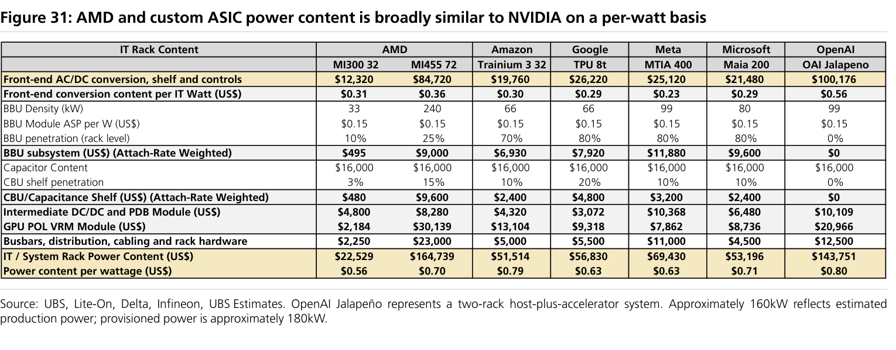

### 解讀摘要

AMD 和 ASIC 平台的全機架電源 BOM：AMD MI455（\$164,739，\$0.70/W）、OpenAI Jalapeño（\$143,751，\$0.80/W）、Google TPU 8t（\$56,830，\$0.63/W）。各平台的每瓦電源內容在 \$0.56–\$0.80 範圍內，與 NVIDIA VR200（\$0.75/W）相近。這驗證了 UBS 使用「單一每瓦內容假設」對所有平台建模的方法論合理性。

---

## Fig. 32｜660kW 800VDC power rack: BBU vs non-BBU configuration

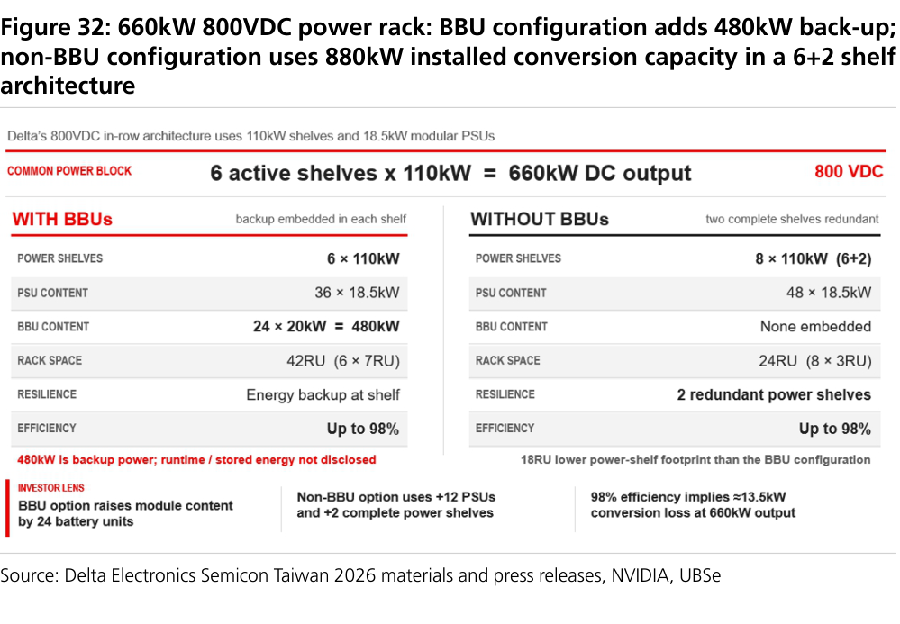

### 解讀摘要

Delta 的 800VDC 電源機架（660kW）有兩種配置：BBU 版（6 個 110kW 層架 + 每層架嵌入 BBU，容量 6×80kW = 480kW 備援，42RU）和 Non-BBU 版（8×110kW 層架 6+2 冗餘設計，24RU）。BBU 版模組化備援更高（能量層備援），Non-BBU 版空間效率更高（節省 18RU）。從電源供應商視角，BBU 版在硬體 BOM 上比 Non-BBU 版多 24 個電池模組+2 個完整電源層架，電源內容差異相當大。

---

## Fig. 33｜800VDC centralizes front-end power outside the IT rack and expands optional BBU content

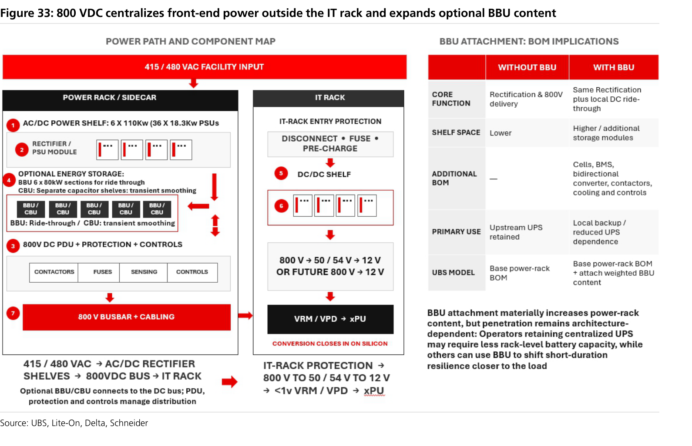

### 解讀摘要

800VDC 電源機架/sidecar 的完整架構圖：左側電源機架（AC/DC 轉換 → BBU/CBU 可選 → PDU/保護 → 800V busbar）→ 右側 IT 機架（機架入口保護 → DC/DC 層架 → VRM/VPD → xPU）。右側表格對比有/無 BBU 的核心差異：無 BBU 保留上游 UPS；有 BBU 可減少 UPS 依賴、增加本地備援，但電源機架 BOM 多出電芯、BMS、雙向轉換器、散熱和控制模組。這張圖是 UBS 電源 BOM 建模的架構依據。

---

## Fig. 34｜800V raises power content adding DC-DC distribution and optional storage attach

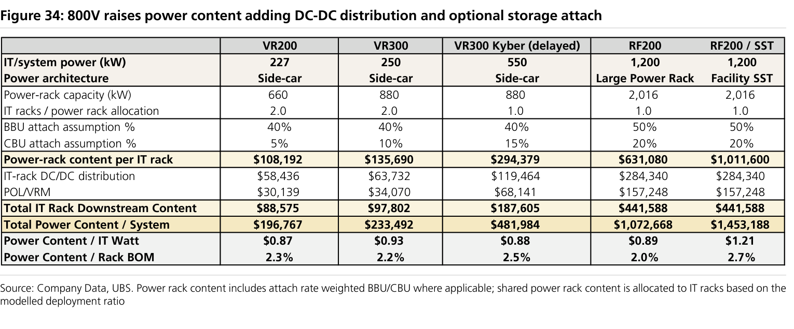

### 解讀摘要

800V 架構下 NVIDIA 各平台的全系統電源內容（電源機架 + IT 機架下游合計）：VR200 sidecar \$196,767/系統（\$0.87/IT W），VR300 \$233,492（\$0.93/W），VR300 Kyber（延遲）\$481,984（\$0.88/W），RF200 \$1,072,668（\$0.89/W），RF200/SST \$1,453,188（\$1.21/W）。從 VR200（\$0.87/W）到 RF200/SST（\$1.21/W）的跳升，主要來自 SST 上游電力轉換（\$705,600）。

### 表格

| 平台 | IT 系統功率（kW） | 電源架構 | 電源機架/IT 機架（US\$） | IT 機架下游（US\$） | **系統電源合計（US\$）** | **\$/IT W** |
|---|---|---|---|---|---|---|
| VR200 | 227 | Side-car | \$108,192 | \$88,575 | \$196,767 | \$0.87 |
| VR300 | 250 | Side-car | \$135,690 | \$97,802 | \$233,492 | \$0.93 |
| VR300 Kyber（延遲） | 550 | Side-car | \$294,379 | \$187,605 | \$481,984 | \$0.88 |
| RF200 | 1,200 | Large Power Rack | \$631,080 | \$441,588 | \$1,072,668 | \$0.89 |
| RF200 / SST | 1,200 | Facility SST | \$1,011,600 | \$441,588 | \$1,453,188 | \$1.21 |

> **洞察一**：VR300 Kyber 和 RF200 的 \$/IT W 實際上低於或接近 VR200（\$0.88/\$0.89 vs \$0.87），儘管系統電源內容絕對值大幅提高。這是因為 Kyber/RF200 功率更高（550kW/1,200kW vs 227kW），使電源成本的規模效益部分抵消了 BOM 增量。SST 版（\$1.21/W）才是真正的每瓦內容躍升，但 SST 商業化時程仍不明確。

---

## Fig. 35｜Content for potential next-gen AMD and ASIC 800V systems

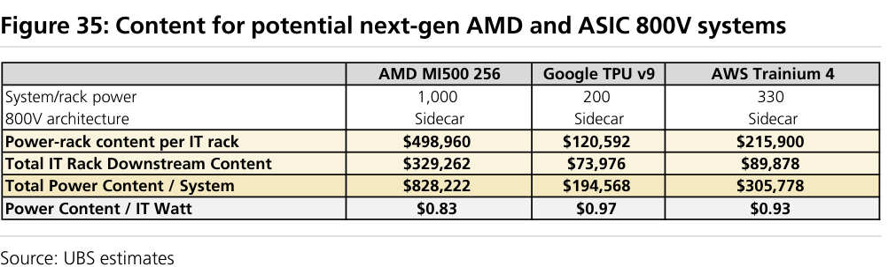

### 解讀摘要

下一代 AMD/ASIC 800V 系統的電源內容估算：AMD MI500 256（1,000kW sidecar）\$828,222（\$0.83/W）、Google TPU v9（200kW）\$194,568（\$0.97/W）、AWS Trainium 4（330kW）\$305,778（\$0.93/W）。每瓦內容在 \$0.83–\$0.97 範圍內，與 NVIDIA 800V 系統相近。驗證 UBS 的跨平台每瓦電源內容假設一致性。

---

## Fig. 36｜840kW in-row power rack moves bulk AC/DC conversion outside the ASIC rack

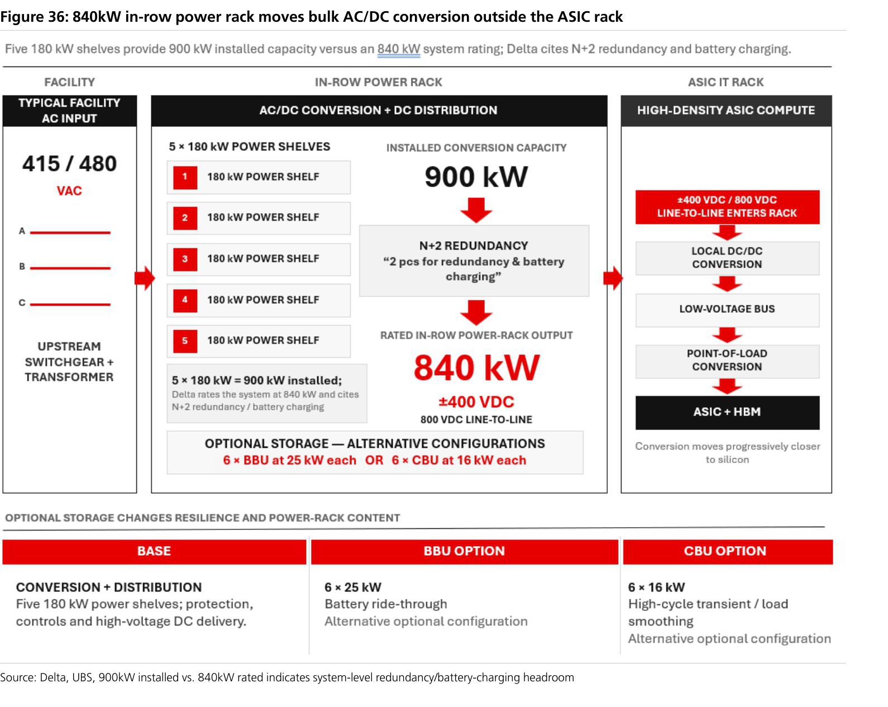

### 解讀摘要

Delta 的 840kW in-row 電源機架架構（設計用於 Amazon/Google 等 ASIC 高密度機架）：5×180kW 電源層架（總裝機 900kW）→ N+2 冗餘後額定 840kW 輸出（±400VDC / 800VDC line-to-line）→ ASIC IT 機架接收高壓直流後本地 DC/DC 降壓。可選 BBU（6×25kW）或 CBU（6×16kW）作為儲能。這是 Amazon Teton3 Max 等 ASIC 大功率機架的典型電源架構。

---

## Fig. 37｜800 VDC infrastructure roadmap: power conversion scales from rack side cars to multi-MW facility blocks

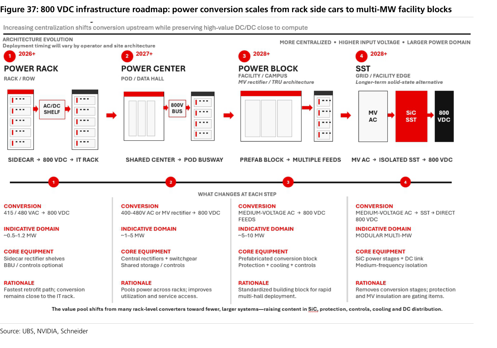

### 解讀摘要

800VDC 基礎設施路線圖的四個演進階段（每個前代共存）：①2026+ Power Rack（sidecar，0.5–1.2MW）→ ②2027+ Power Center（POD/資料廳，1–5MW，central rectifiers + busway）→ ③2028+ Power Block（設施/園區，5–10MW，MV rectifier/TRU）→ ④2028+ SST（電網/設施邊緣，multi-MW，SiC power stage + MV isolation）。每個階段的核心設備不同，市場格局也隨之演變：從模組化 PSU（光寶科、Delta）→ 中央整流機（Vertiv、Schneider）→ MV 轉換（ABB、Eaton）→ SiC SST（Delta 2.5MW 出貨中，Flex 34.5kV 路線圖）。

---

## Fig. 38｜Power content migrates from rack-level conversion to multi-MW facility systems

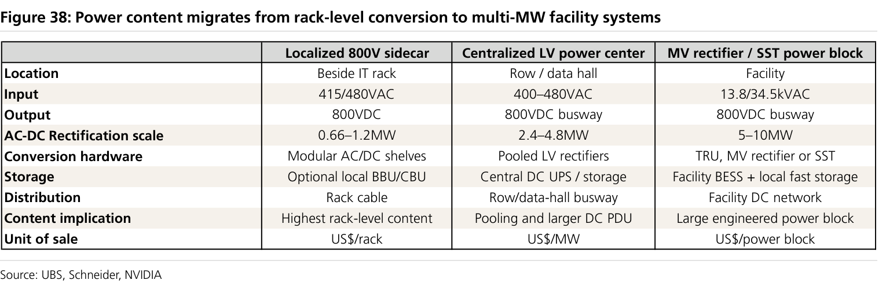

### 解讀摘要

三種 800V 架構的比較：Localized 800V sidecar（按機架計價，US\$/rack，每機架電源內容最高）→ Centralized LV power center（按 MW 計價，US\$/MW，汇集式 PDU）→ MV rectifier / SST power block（按電力區塊計價，大型工程化系統）。三種架構在不同時期並行共存，供應商必須同時具備跨架構的認證能力才能佔據主動。

---

## Fig. 39｜ASIC TDPs per rack (kW)

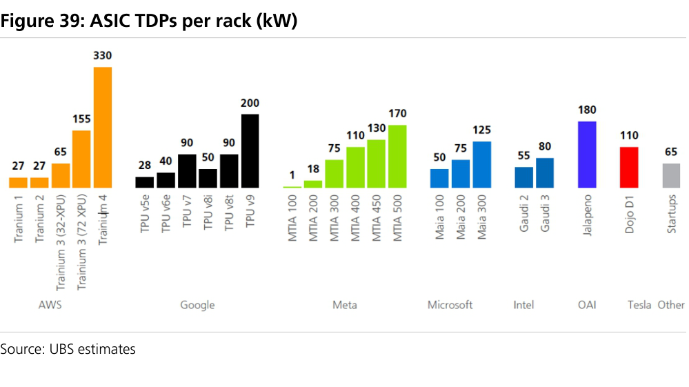

### 解讀摘要

各 ASIC 平台的機架 TDP 長條圖（UBS 估算）：AWS Trainium 4 最高（330kW），其次是 OpenAI Jalapeño（180kW）、Meta MTIA 500（170kW）、Google TPU v9（200kW）。Intel Gaudi 3 僅 80kW，是技術上落後最明顯的 ASIC 平台，CAGR -40% 電源 TAM（Fig. 55 佐證）。AMD MI455 235kW 是 GPU 中最高功耗的平台。

---

## Fig. 41｜AI rack units deployments peak in 2027, while rising power density sustains IT GW growth

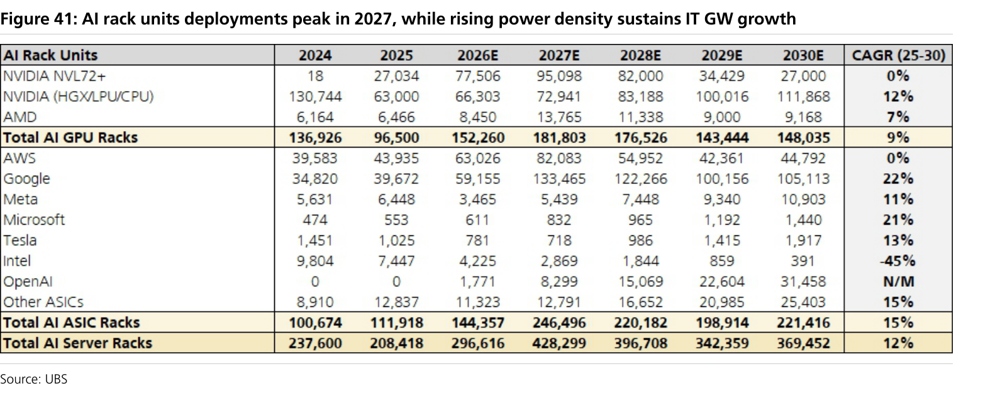

### 解讀摘要

AI 機架出貨量的完整分平台預測：NVIDIA NVL72+ 從 2025 年 27,034 機架快速爬升至 2027E 95,098（峰值）後回落至 2030E 27,000，CAGR 0%（因為 Feynman 平台以更少機架承載更多 GPU）；Google 機架 CAGR 22%，OpenAI 機架 N/M（2026 才開始），Intel ASIC 機架 CAGR -45%（快速衰退）。總 AI 機架 2025 年 208k → 2027E 428k（峰值）→ 2030E 369k，CAGR 12%。

### 表格

| 平台 | 2024 | 2025 | 2026E | 2027E | 2028E | 2029E | 2030E | CAGR '25-30 |
|---|---|---|---|---|---|---|---|---|
| NVIDIA NVL72+ | 18 | 27,034 | 77,506 | 95,098 | 82,000 | 34,429 | 27,000 | 0% |
| NVIDIA（HGX/LPU/CPU） | 130,744 | 63,000 | 66,303 | 72,941 | 83,188 | 100,016 | 111,868 | 12% |
| AMD | 6,164 | 6,466 | 8,450 | 13,765 | 11,338 | 9,000 | 9,168 | 7% |
| **Total AI GPU 機架** | **136,926** | **96,500** | **152,260** | **181,803** | **176,526** | **143,444** | **148,035** | **9%** |
| AWS | 39,583 | 43,935 | 63,026 | 82,083 | 54,952 | 42,361 | 44,792 | 0% |
| Google | 34,820 | 39,672 | 59,155 | 133,465 | 122,266 | 100,156 | 105,113 | 22% |
| Meta | 5,631 | 6,448 | 3,465 | 5,439 | 7,448 | 9,340 | 10,903 | 11% |
| Microsoft | 474 | 553 | 611 | 832 | 965 | 1,192 | 1,440 | 21% |
| Tesla | 1,451 | 1,025 | 781 | 718 | 986 | 1,415 | 1,917 | 13% |
| Intel | 9,804 | 7,447 | 4,225 | 2,869 | 1,844 | 859 | 391 | -45% |
| OpenAI | 0 | 0 | 1,771 | 8,299 | 15,069 | 22,604 | 31,458 | N/M |
| 其他 ASIC | 8,910 | 12,837 | 11,323 | 12,791 | 16,652 | 20,985 | 25,403 | 15% |
| **Total AI ASIC 機架** | **100,674** | **111,918** | **144,357** | **246,496** | **220,182** | **198,914** | **221,416** | **15%** |
| **Total AI 機架** | **237,600** | **208,418** | **296,616** | **428,299** | **396,708** | **342,359** | **369,452** | **12%** |

> **洞察一**：2027 年 Google 機架出貨量跳升至 133,465（+125% YoY），是單一平台最大的年度增量，也是 2027 年 TAM 峰值的主要貢獻者之一。Google TPU v9 在 2027 開始大規模部署，是最需要關注的 ASIC 電源需求催化劑。
> **洞察二（配合 Fig. 42）**：NVIDIA NVL72+ 機架數量 2027 年後下降，但其 TDP 繼續上升（208kW→802kW），使 AI IT GW 繼續爬升——量的峰值不等於 GW 的峰值，也不等於電源 TAM 的峰值。

---

## Fig. 42｜358GW cumulative gross deployments over 2024–30 (401GW of electricity at PUE 1.12)

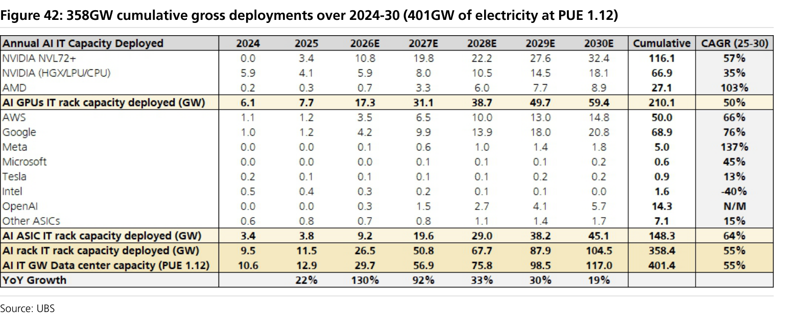

### 解讀摘要

年度 AI IT 容量部署（GW）：NVIDIA NVL72+ 在 2030E 達 32.4GW（CAGR 57%），是最快速成長的單一平台；Google ASIC 2030E 達 20.8GW（CAGR 76%）；Total AI IT rack capacity 2030E 104.5GW（CAGR 55%）。累計 2024–30 AI IT 容量 358.4GW，考慮 PUE 1.12 後對應 401.4GW 的資料中心電力需求。

### 表格

| 平台 | 2024 | 2025 | 2026E | 2027E | 2028E | 2029E | 2030E | Cumulative | CAGR '25-30 |
|---|---|---|---|---|---|---|---|---|---|
| NVIDIA NVL72+（GW） | 0.0 | 3.4 | 10.8 | 19.8 | 22.2 | 27.6 | 32.4 | 116.1 | 57% |
| NVIDIA（HGX/LPU/CPU）（GW） | 5.9 | 4.1 | 5.9 | 8.0 | 10.5 | 14.5 | 18.1 | 66.9 | 35% |
| AMD（GW） | 0.2 | 0.3 | 0.7 | 3.3 | 6.0 | 7.7 | 8.9 | 27.1 | 103% |
| **AI GPU IT rack（GW）** | **6.1** | **7.7** | **17.3** | **31.1** | **38.7** | **49.7** | **59.4** | **210.1** | **50%** |
| Google（GW） | 1.0 | 1.2 | 4.2 | 9.9 | 13.9 | 18.0 | 20.8 | 68.9 | 76% |
| AWS（GW） | 1.1 | 1.2 | 3.5 | 6.5 | 10.0 | 13.0 | 14.8 | 50.0 | 66% |
| OpenAI（GW） | 0.0 | 0.0 | 0.3 | 1.5 | 2.7 | 4.1 | 5.7 | 14.3 | N/M |
| Intel（GW） | 0.5 | 0.4 | 0.3 | 0.2 | 0.1 | 0.1 | 0.0 | 1.6 | -40% |
| **AI ASIC IT rack（GW）** | **3.4** | **3.8** | **9.2** | **19.6** | **29.0** | **38.2** | **45.1** | **148.3** | **64%** |
| **Total AI IT rack（GW）** | **9.5** | **11.5** | **26.5** | **50.8** | **67.7** | **87.9** | **104.5** | **358.4** | **55%** |
| AI IT GW DC 容量（PUE 1.12） | 10.6 | 12.9 | 29.7 | 56.9 | 75.8 | 98.5 | 117.0 | 401.4 | 55% |
| YoY 成長 | — | 22% | 130% | 92% | 33% | 30% | 19% | — | — |

---

## Fig. 43｜Power-system BOM migrates from the IT rack to a dedicated power rack as density rises

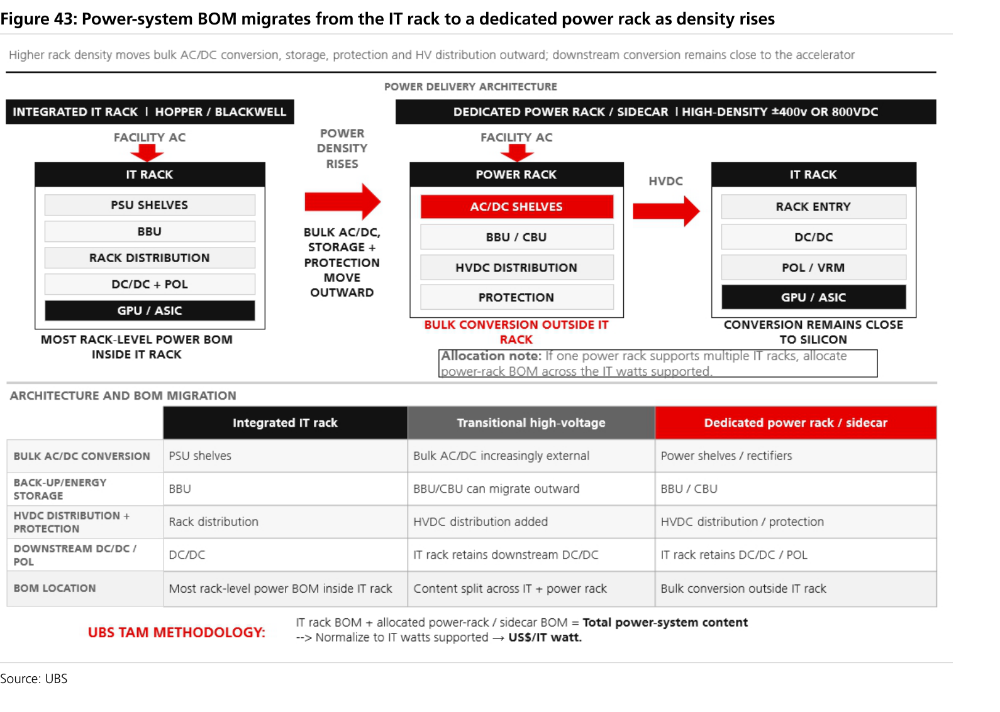

### 解讀摘要

這張圖是 UBS TAM 建模方法論的關鍵：說明電源系統 BOM 如何在三個架構階段移動——整合式 IT 機架（多數電源 BOM 在機架內）→ 過渡期高壓架構（BOM 分散於 IT 機架 + 電源機架）→ 專用電源機架/sidecar（大量轉換在 IT 機架外）。UBS TAM 方法是：IT 機架 BOM + 分配的電源機架 BOM = 總電源系統內容，再除以支援的 IT 瓦特數，得到 US\$/IT Watt。

---

## Fig. 44｜NVIDIA content evolution by platform

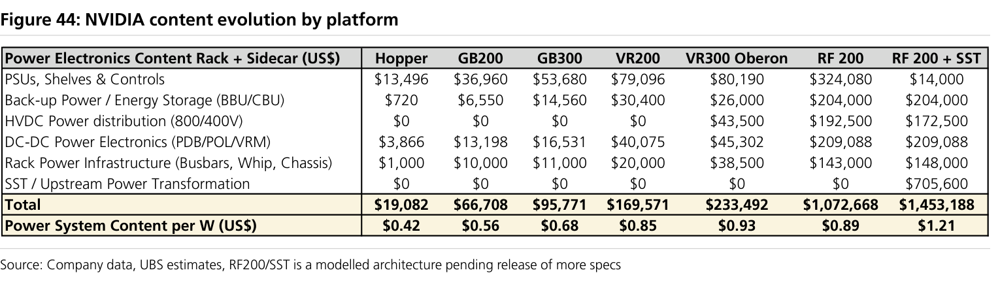

### 解讀摘要

NVIDIA 全平台（Hopper 到 RF200/SST）的電源系統 BOM 完整分解：RF200（含 Large Power Rack）的 PSU/層架/控制達 \$324,080，是 Hopper 的 24倍；RF200/SST 版的 SST/上游電力轉換達 \$705,600，使 SST 成為最大的單一 BOM 項目。每瓦電源系統內容從 Hopper \$0.42/W 升至 RF200/SST \$1.21/W，但 SST 商業化時程仍待確認。

### 表格

| 內容項目（US\$） | Hopper | GB200 | GB300 | VR200 | VR300 Oberon | RF200 | RF200+SST |
|---|---|---|---|---|---|---|---|
| PSU/層架/控制 | \$13,496 | \$36,960 | \$53,680 | \$79,096 | \$80,190 | \$324,080 | \$14,000 |
| 備援電源/儲能（BBU/CBU） | \$720 | \$6,550 | \$14,560 | \$30,400 | \$26,000 | \$204,000 | \$204,000 |
| HVDC 電力分配（800/400V） | \$0 | \$0 | \$0 | \$0 | \$43,500 | \$192,500 | \$172,500 |
| DC-DC 電力電子（PDB/POL/VRM） | \$3,866 | \$13,198 | \$16,531 | \$40,075 | \$45,302 | \$209,088 | \$209,088 |
| 機架電力基礎設施（busbar/whip） | \$1,000 | \$10,000 | \$11,000 | \$20,000 | \$38,500 | \$143,000 | \$148,000 |
| SST/上游電力轉換 | \$0 | \$0 | \$0 | \$0 | \$0 | \$0 | \$705,600 |
| **總計** | **\$19,082** | **\$66,708** | **\$95,771** | **\$169,571** | **\$233,492** | **\$1,072,668** | **\$1,453,188** |
| 電源系統內容/W | \$0.42 | \$0.56 | \$0.68 | \$0.85 | \$0.93 | \$0.89 | \$1.21 |

---

## Fig. 45｜NVIDIA content mix evolution by platform

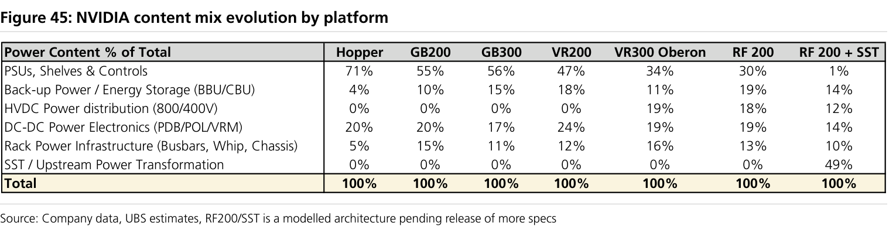

### 解讀摘要

BOM 結構的比例演變：PSU/層架（前端 AC/DC）佔比從 Hopper 71% 降至 RF200+SST 1%（被 SST 取代）；BBU/CBU 佔比從 4%（Hopper）升至 14–19%（VR/RF 時代）；HVDC 分配從 0% 到 VR300 Oberon 時代升至 19%；DC-DC/POL VRM 佔比維持在 14–24%（相對穩定的中間轉換層）；SST 在 RF200/SST 架構佔高達 49%。BOM 結構從「前端 PSU 主導」演變為「多元化分散式電源系統」。

> **洞察一**：DC-DC/POL VRM 在所有平台中佔比最穩定（14–24%），顯示「靠近矽晶片的最終轉換」是電源系統的永恆需求。供應 VRM 模組的廠商（TI、ADI、Infineon）在架構劇烈演變中受到的衝擊最小，應視為防禦性電源半導體持倉。

---

## Fig. 46｜PSU & Distribution the largest component pool with a US\$42bn TAM by 2030; BBU/CBU storage grows faster to US\$16bn by 2030

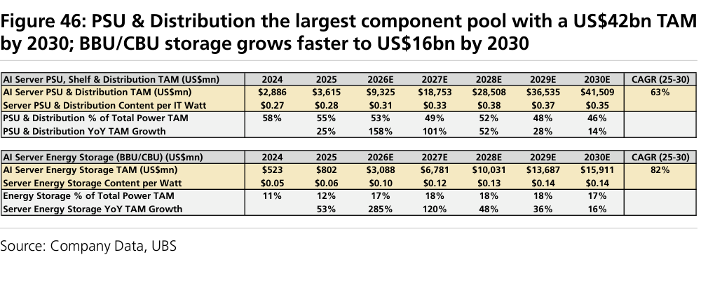

### 解讀摘要

兩大電源子市場的獨立 TAM 預測：PSU/分配（前端轉換 + 機架基礎設施）2030E TAM \$415億（CAGR 63%），佔總電源 TAM 46%；BBU/CBU 儲能 2030E \$159億（CAGR 82%），佔 17%。BBU 成長速度最快——attach rate 從 Hopper 10% 升至 GB300 40% 再到 VR200 50%，加上每機架 BBU 容量擴大，使 BBU 成長速度超過 PSU。

### 表格

| 子市場 | 2024 | 2025 | 2026E | 2027E | 2028E | 2029E | 2030E | CAGR '25-30 |
|---|---|---|---|---|---|---|---|---|
| PSU/分配 TAM（US\$mn） | \$2,886 | \$3,615 | \$9,325 | \$18,753 | \$28,508 | \$36,535 | \$41,509 | 63% |
| PSU/分配佔電源 TAM | 58% | 55% | 53% | 49% | 52% | 48% | 46% | — |
| 儲能（BBU/CBU）TAM（US\$mn） | \$523 | \$802 | \$3,088 | \$6,781 | \$10,031 | \$13,687 | \$15,911 | 82% |
| 儲能佔電源 TAM | 11% | 12% | 17% | 18% | 18% | 18% | 17% | — |

---

## Fig. 48｜VR200 rack content US\$170k in our base case

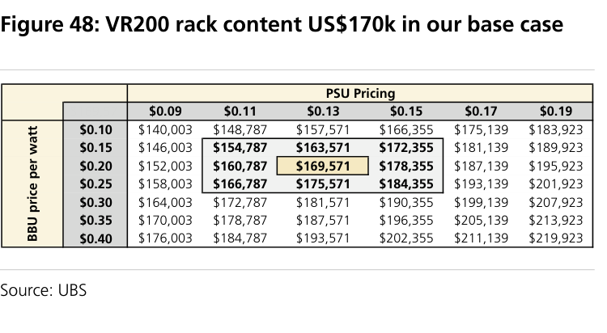

### 解讀摘要

VR200 機架電源內容的雙因子敏感度矩陣（PSU pricing \$0.09–\$0.19/W × BBU price per watt \$0.10–\$0.40）。Base case（PSU \$0.13/W，BBU \$0.20/W）= \$169,571。PSU 定價每降 \$0.02/W 對應機架電源內容約 -\$8k–\$9k；BBU 定價每降 \$0.05/W 約 -\$6k。顯示 PSU 定價對 BOM 的敏感度高於 BBU 定價。

---

## Fig. 49｜\$0.02 PSU erosion a 5% content downside, \$0.05 BBU erosion a 4% downside

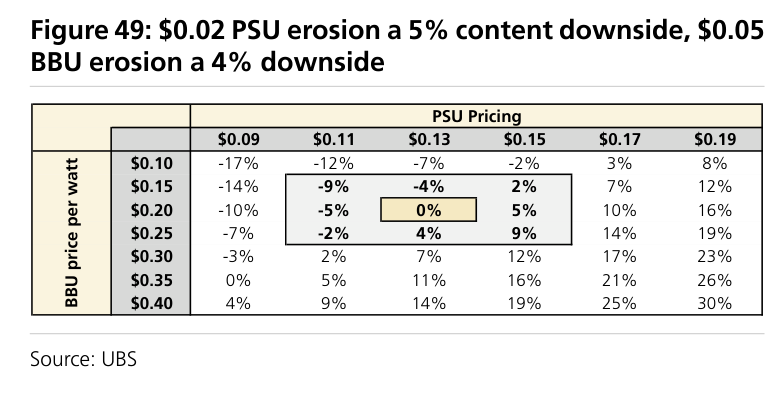

### 解讀摘要

Fig. 48 的相對偏差版本：PSU \$0.11 和 BBU \$0.15 的角落偏差為 -9%，而 PSU \$0.15 和 BBU \$0.25 的角落為 +9%。UBS 基礎情境（base case）定義在矩陣中間（第 3 行第 4 列），標注 0%。PSU 和 BBU 定價假設各有 ±5–10% 的範圍，驗證 UBS 估算的合理性。

---

## Fig. 50｜2027 NVIDIA sensitivity to power rack adoption in 2027

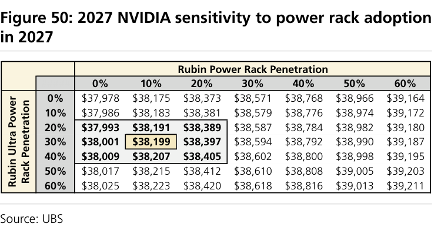

### 解讀摘要

2027 年 NVIDIA 電源 TAM 對電源機架（power rack）普及率的雙維度敏感度（Rubin Power Rack % × Rubin Ultra Power Rack %）。Base case（Rubin 30%/Rubin Ultra 10%）= \$38,199mn。最重要結論：矩陣中所有值的範圍僅在 \$37,978–\$39,211mn 之間，最大偏差約 ±3%。即使 power rack 普及率從 0% 到 60%，TAM 變化也不超過 \$1.2bn。這是支撐「2027 不依賴 800V 廣泛普及」論點的關鍵量化依據。

---

## Fig. 51｜1% impact on the power TAM for each 10ppt swing in power rack adoption in 2027

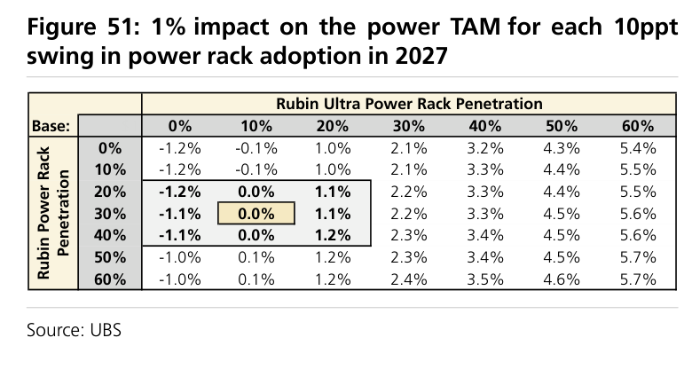

### 解讀摘要

Fig. 50 的相對偏差版本：每 10ppt 的 Rubin Power Rack 普及率變化，2027 NVIDIA 電源 TAM 僅改變 ~1%（橫向）；Rubin Ultra 普及率同樣如此（縱向）。最大正偏差 +5.6%（兩個維度都 60%）；最大負偏差 -1.2%（兩個都 0%）。由於 2027 Rubin Ultra 尚未大規模部署，實際影響更偏向矩陣左側（Rubin Ultra 0–10%），意味著 2027 的電源 TAM 對 800V 時程幾乎免疫。

---

## Fig. 52｜2028 NVIDIA sensitivity to power rack adoption

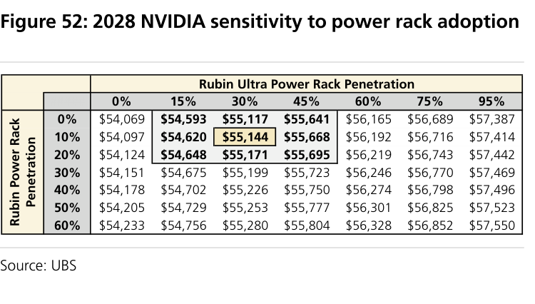

### 解讀摘要

2028 年的同類敏感度矩陣：Rubin Power Rack vs Rubin Ultra Power Rack（普及率更高，0–95% × 0–60%）。Base case（Rubin Ultra 30%/Rubin Power Rack 10%）= \$55,144mn。矩陣範圍 \$54,069–\$57,550mn，最大偏差約 ±6%。與 2027 相比，2028 的電源機架普及率敏感度更高（因為 Rubin Ultra 成為主力平台），驗證了 UBS「800V 是 2028 更大驅動因子」的判斷。

---

## Fig. 53｜1.3–1.4% impact on the power TAM for each 15ppt swing in Rubin Ultra power rack adoption in 2028

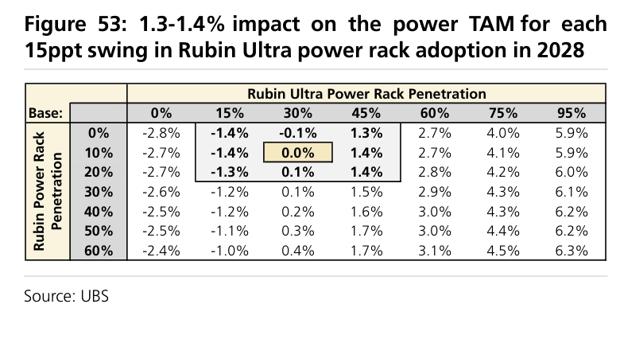

### 解讀摘要

2028 的相對偏差版本：每 15ppt 的 Rubin Ultra Power Rack 普及率變化，對 TAM 影響約 1.3–1.4%（縱向）；而 Rubin Power Rack 在 0% 普及時為 -2.8%，在 60% 時達到 +3.1%。2028 年的電源機架敏感度（每 15ppt 影響 1.3–1.4%）高於 2027 年（每 10ppt 影響 1%），確認 800V 對 2028 TAM 影響更大。

---

## Fig. 54｜NVIDIA Power TAM build-up: growth from higher power racks and content per rack

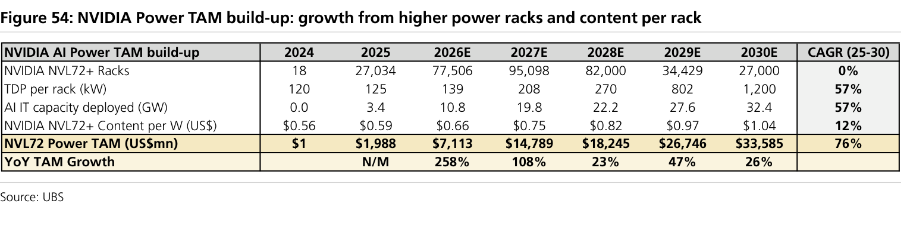

### 解讀摘要

NVIDIA NVL72+ 平台電源 TAM 的逐因子分解：機架數量 0 → 95,098 → 27,000（峰值在 2027）；TDP 從 125kW（2025）升至 1,200kW（2030，CAGR 57%）；IT 容量 CAGR 57%；每瓦內容 \$0.59 → \$1.04（CAGR 12%）。NVL72+ 電源 TAM 從 2025 年 \$20億（N/M YoY）成長至 2027E \$148億（+108%）再到 2030E \$336億（CAGR 76%）。NVIDIA NVL72+ 一個子市場在 2030 年就達 \$336億，佔總 TAM \$911億的 37%。

### 表格

| 指標 | 2024 | 2025 | 2026E | 2027E | 2028E | 2029E | 2030E | CAGR '25-30 |
|---|---|---|---|---|---|---|---|---|
| NVL72+ 機架數 | 18 | 27,034 | 77,506 | 95,098 | 82,000 | 34,429 | 27,000 | 0% |
| TDP/rack（kW） | 120 | 125 | 139 | 208 | 270 | 802 | 1,200 | 57% |
| AI IT 容量（GW） | 0.0 | 3.4 | 10.8 | 19.8 | 22.2 | 27.6 | 32.4 | 57% |
| NVL72+ 內容/W（US\$） | \$0.56 | \$0.59 | \$0.66 | \$0.75 | \$0.82 | \$0.97 | \$1.04 | 12% |
| **NVL72 Power TAM（US\$mn）** | **\$1** | **\$1,988** | **\$7,113** | **\$14,789** | **\$18,245** | **\$26,746** | **\$33,585** | **76%** |
| YoY TAM 成長 | — | N/M | +258% | +108% | +23% | +47% | +26% | — |

> **洞察一**：NVL72+ 的機架數量在 2027 達峰後快速下降（2030 僅 27,000），但 TDP 繼續從 208kW 飛升至 1,200kW，使電源 TAM 從 \$148億持續升至 \$336億。這個「量降價升、GW 繼續漲」的結構是 UBS 整個論點的核心——不需要機架出貨量繼續成長，TDP 本身已足以推升電源 TAM。

---

## Fig. 55｜AI Power TAM by platform: strong growth for GPU and ASIC platforms

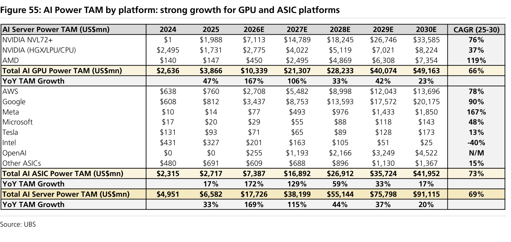

### 解讀摘要

全平台電源 TAM 匯總：2030E 總 TAM \$911億，其中 GPU（NVIDIA+AMD）\$491億（54%），ASIC \$420億（46%）。Google 2030E \$202億（CAGR 90%）和 AWS \$137億（CAGR 78%）已成為僅次於 NVIDIA NVL72+ 的最大單一平台電源貢獻者。Intel ASIC 持續萎縮（CAGR -40%）。Meta ASIC CAGR 167%，從低基期快速成長。

### 表格

| 平台 | 2024 | 2025 | 2026E | 2027E | 2028E | 2029E | 2030E | CAGR '25-30 |
|---|---|---|---|---|---|---|---|---|
| NVIDIA NVL72+（US\$mn） | \$1 | \$1,988 | \$7,113 | \$14,789 | \$18,245 | \$26,746 | \$33,585 | 76% |
| NVIDIA（HGX/LPU/CPU） | \$2,495 | \$1,731 | \$2,775 | \$4,022 | \$5,119 | \$7,021 | \$8,224 | 37% |
| AMD | \$140 | \$147 | \$450 | \$2,495 | \$4,869 | \$6,308 | \$7,354 | 119% |
| **Total GPU Power TAM** | **\$2,636** | **\$3,866** | **\$10,339** | **\$21,307** | **\$28,233** | **\$40,074** | **\$49,163** | **66%** |
| Google | \$608 | \$812 | \$3,437 | \$8,753 | \$13,593 | \$17,572 | \$20,175 | 90% |
| AWS | \$638 | \$760 | \$2,708 | \$5,482 | \$8,998 | \$12,043 | \$13,696 | 78% |
| OpenAI | \$0 | \$0 | \$255 | \$1,193 | \$2,166 | \$3,249 | \$4,522 | N/M |
| Meta | \$10 | \$14 | \$77 | \$493 | \$976 | \$1,433 | \$1,850 | 167% |
| Intel | \$431 | \$327 | \$201 | \$163 | \$105 | \$51 | \$25 | -40% |
| **Total ASIC Power TAM** | **\$2,315** | **\$2,717** | **\$7,387** | **\$16,892** | **\$26,912** | **\$35,724** | **\$41,952** | **73%** |
| **Total AI Server Power TAM** | **\$4,951** | **\$6,582** | **\$17,726** | **\$38,199** | **\$55,144** | **\$75,798** | **\$91,115** | **69%** |

---

## Fig. 56｜UBS Power TAM in 2027 at US\$38.2bn TAM at 50.8GW and US\$0.75/watt

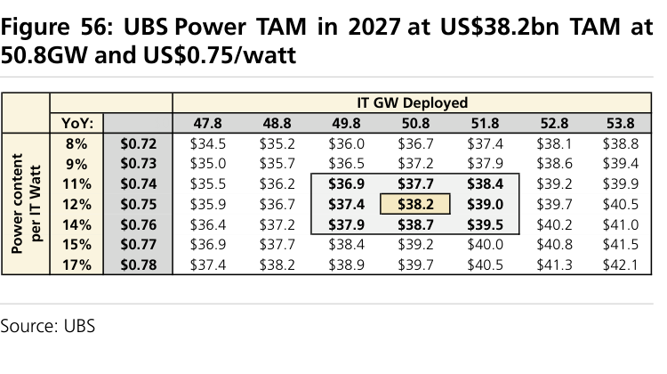

### 解讀摘要

2027 年全市場電源 TAM 的完整雙因子敏感度矩陣（IT GW 部署量 47.8–53.8GW × 每瓦電源內容 \$0.72–\$0.78/W）。Base case：50.8GW、\$0.75/W → \$38.2bn。每 +1GW IT 容量帶來約 +\$750mn TAM；每 +\$0.01/W 帶來約 +\$508mn TAM。GW 因子的絕對影響較大。

---

## Fig. 58｜UBS Power TAM in 2028 at US\$55.1bn TAM at 67.7GW and US\$0.81/watt

### 解讀摘要

2028 年電源 TAM 敏感度：Base case 67.7GW、\$0.81/W → \$55.1bn。矩陣範圍 \$50.8–\$59.7bn（±8%），比 2027 矩陣範圍更大（±8% vs ±4%），反映 2028 的不確定性更高（電網限制、800V 普及速度）。每 +1GW 的影響約 +\$810mn（高於 2027 的 +\$750mn），因為 2028 的每瓦電源內容更高。

---

## Fig. 59｜2028 YoY growth sensitivity: ~2.1ppt per +1GW and ~1.8ppt per +US\$0.01/W

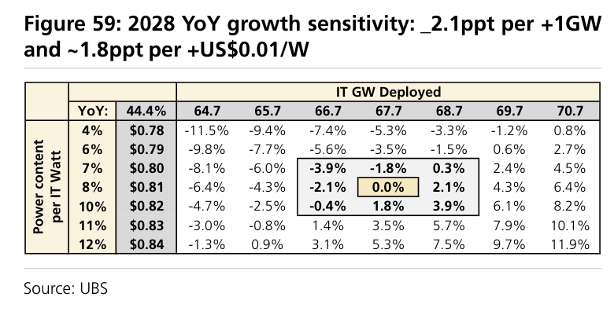

### 解讀摘要

2028 TAM YoY 成長率敏感度：Base case +44.4% YoY（Fig. 58 的 \$55.1bn vs \$38.2bn）。每 +1GW 帶來約 +2.1ppt YoY 成長；每 +\$0.01/W 帶來約 +1.8ppt。若 GW 和 \$/W 同時低估 3GW 和 \$0.03/W，成長率上行約 +5ppt；同時低於預期則可能落入 -7% YoY 範圍。2028 的成長方差比 2027 更大，是真正的高不確定性年份。

---

## Fig. 62｜High storage attach would lift VR200 power content

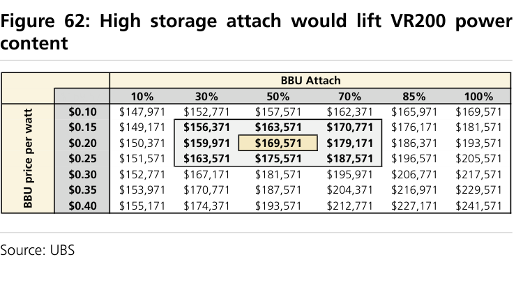

### 解讀摘要

VR200 機架電源內容對 BBU attach rate 和 BBU 定價的敏感度：base case（50% attach，\$0.20/W）= \$169,571。若 attach rate 升至 100%（全面部署 BBU），VR200 電源內容達 \$193,571（+14%）；若 BBU 定價升至 \$0.40/W 且 100% attach，則達 \$241,571（+43%）。BBU 普及率上升是 VR200 以後電源 TAM 的重要上行風險來源。

---

## Fig. 63｜VR200: 50% BBU attachment contributes US\$25.6k of weighted content

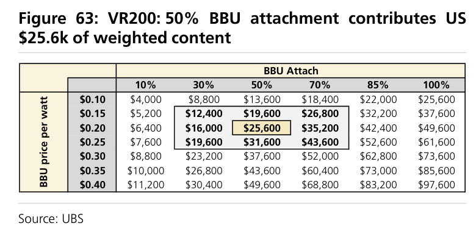

### 解讀摘要

VR200 的 BBU 加權內容（attach rate × 每 kW BBU 容量 × 定價）：base case（50% attach，\$0.20/W）= \$25,600。若 attach rate 升至 100%，BBU 貢獻 \$51,200（vs base case 的兩倍）；若同時 BBU 定價升至 \$0.40/W，達 \$97,600。這個矩陣說明 BBU 是電源 TAM 最主要的上行風險項，且上行幅度遠大於 PSU 定價的假設偏差。

---

## Fig. 64｜SST at 45% penetration drives NVIDIA's Power TAM to US\$41.8bn in 2030

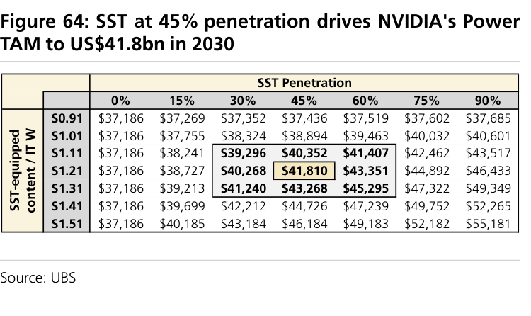

### 解讀摘要

2030 年 NVIDIA 電源 TAM 對 SST 普及率的敏感度（SST 普及率 0–90% × SST 每 IT Watt 內容 \$0.91–\$1.51）。Base case（45% SST 普及，\$1.21/IT W 內容）= \$41.8bn。若 SST 普及率維持 0%（不採用），NVIDIA 電源 TAM 僅 \$37.2bn（-11%）。若 SST 普及率達 90% 且定價達 \$1.51/W，TAM 可達 \$55.2bn（+32%）。SST 是 2030 年 NVIDIA 電源 TAM 最重要的上行情境。

---

## Fig. 65｜SST penetration key to YoY growth in the NVIDIA TAM in 2030

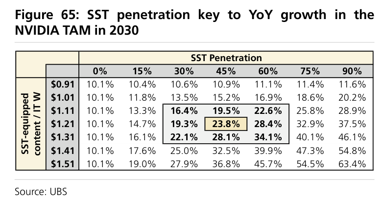

### 解讀摘要

2030 年 NVIDIA 電源 TAM YoY 成長率對 SST 參數的敏感度：base case（45% 普及，\$1.21/W）= +23.8% YoY。若 SST 為 0%，YoY 僅 +10.1%（接近無 SST 的純量成長）；若 SST 普及率 90%、定價 \$1.51/W，YoY 達 +63.4%。這個矩陣顯示 SST 的商業化進展是 2030 年 NVIDIA 電源 TAM 能否高速成長的決定因子。

---

## Fig. 66｜Key white-space and grey-space players in the data center power landscape

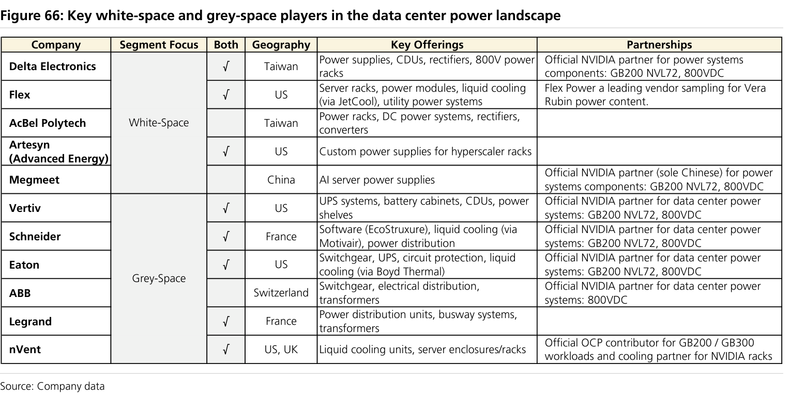

### 解讀摘要

AI 電源生態系的「白色空間」（IT 機架電源，傳統 PSU/電源層架供應商）與「灰色空間」（UPS/配電/開關設備，傳統設施電源）分類圖。Delta 和 Flex 橫跨兩個空間，是 UBS 認為最受益架構演進的廠商。Vertiv、Schneider、Eaton 從灰色空間向白色空間延伸，是 Fig. 37 架構演進中第 3–4 階段的受益者。

| 公司 | 空間分類 | 地區 | 主要產品/服務 | NVIDIA 官方合作夥伴 |
|---|---|---|---|---|
| Delta Electronics | 白色（Both） | 台灣 | PSU、CDU、整流器、800V 電源機架 | ✓（GB200、800VDC） |
| Flex | 白色（Both） | 美國 | 伺服器機架、電源模組、液冷（JetCool） | ✓（Vera Rubin 電源採樣） |
| AcBel Polytech | 白色 | 台灣 | 電源機架、DC 電源、整流器 | — |
| Artesyn（Advanced Energy） | 白色（Both） | 美國 | Hyperscaler 機架定製電源 | — |
| Megmeet | 白色 | 中國 | AI 伺服器電源供應 | ✓（GB200 NVL72、800VDC，唯一中國夥伴） |
| Vertiv | 灰色（Both） | 美國 | UPS、電池箱、CDU、電源層架 | ✓（GB200、800VDC） |
| Schneider | 灰色（Both） | 法國 | EcoStruxure 軟體、液冷、電力分配 | ✓（GB200、800VDC） |
| Eaton | 灰色（Both） | 美國 | 開關設備、UPS、電路保護 | ✓（GB200、800VDC） |
| ABB | 灰色 | 瑞士 | 開關設備、配電、變壓器 | ✓（800VDC） |
| Legrand | 灰色（Both） | 法國 | PDU、母線槽系統、變壓器 | — |
| nVent | 灰色（Both） | 美國/英國 | 液冷機組、伺服器機殼/機架 | ✓（GB200/GB300 OCP） |

---

## Fig. 67｜Vendor portfolio in power conversion and energy storage

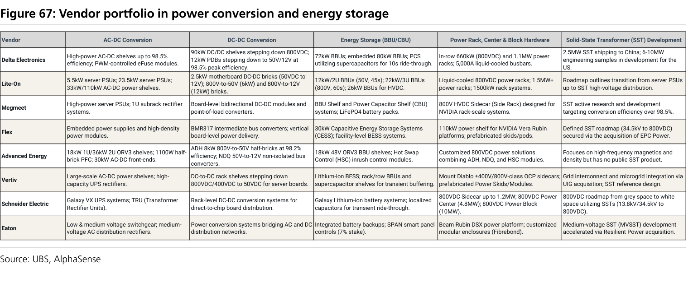

### 解讀摘要

各廠商跨五個技術維度（AC-DC 轉換、DC-DC 轉換、BBU/CBU、電源機架/中心/區塊、SST 開發）的產品組合對比。Delta 和光寶科在 AC-DC 和 DC-DC 都有完整產品線，且都在開發 SST（Delta 2.5MW 出貨中、光寶科路線圖確認）。Flex 在 BBU/CBU（CESS，30kW 電容儲能系統）和電源機架（110kW 層架，Vera Rubin）也有佈局。Megmeet 在 SST 研發中（目標轉換效率 >98.5%）。

---

## Fig. 68｜Delta and Flex gain scale fastest across cloud & power related businesses

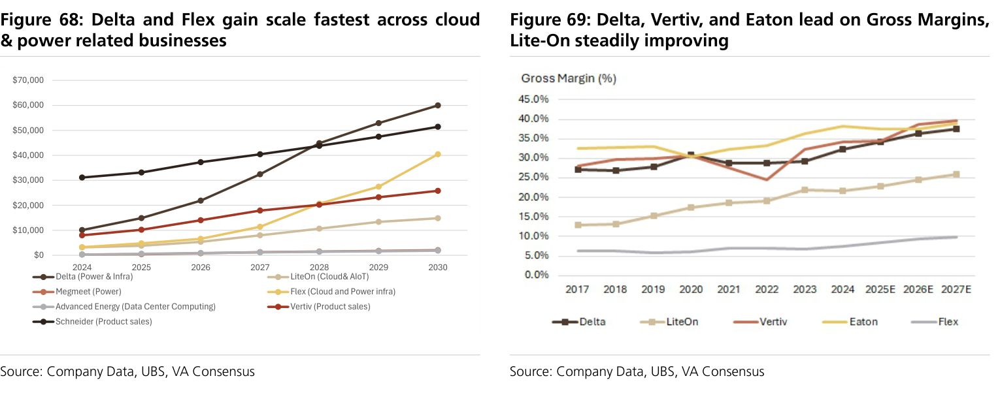

### 解讀摘要

主要電源供應商的雲端/電源相關業務收入長期趨勢（2024–2030E，US\$mn）：Delta（Power & Infra）從 2024 年 \$10,086 升至 2030E \$59,983，CAGR 最高；Schneider 2030E 預估 \$51,426（但報告範疇為能源管理銷售，不完全可比）；Flex 2030E \$40,449（雲端+電源基礎設施）為成長速度第三。光寶科 2030E \$14,828（Cloud & AIoT）和 Megmeet 2030E \$2,061（電源）相對較小，但成長速度可觀。

---

## Fig. 69｜Delta, Vertiv, and Eaton lead on Gross Margins, Lite-On steadily improving

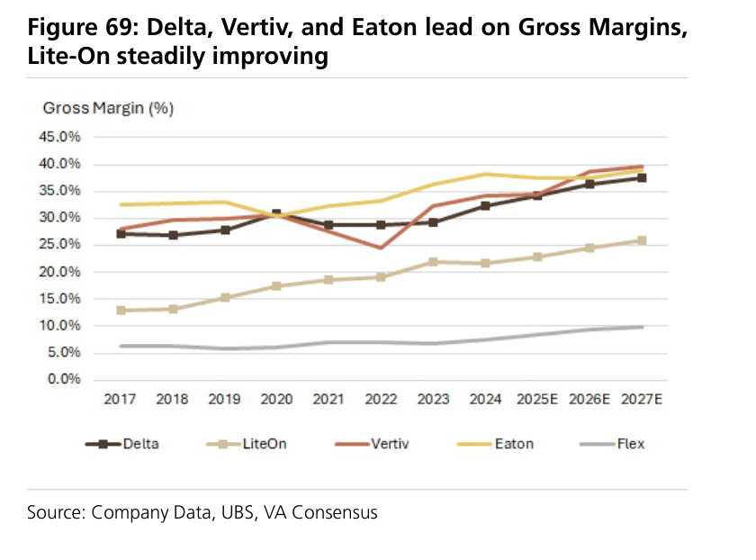

### 解讀摘要

主要電源廠商的毛利率趨勢（2017–2027E）：Delta 毛利率從 27% 穩步升至 2027E 39%，與 Vertiv（高峰時 39%+）並駕齊驅；Eaton 長期維持 35–38%。光寶科毛利率從低位 13%（2017）穩步升至 2027E 25%，是本群中改善幅度最顯著的廠商——這是 UBS 首次覆蓋光寶科給予 Buy 的核心邏輯支撐之一。Flex 毛利率依然最低（10%），反映其 EMS 製造導向的業務性質。

---

## Fig. 70｜Power and Infrastructure related sales by vendor

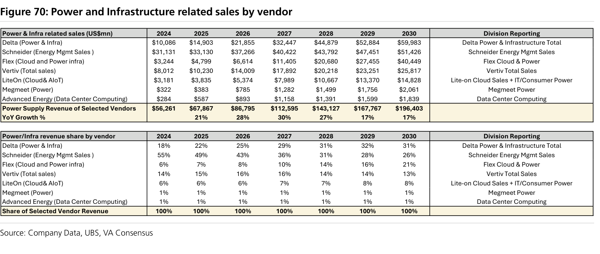

### 解讀摘要

七家主要廠商的電源/基礎設施相關業務收入匯總：2024 合計 \$562億，2030E 預估達 \$1,964億（+250%）。Schneider 依然是總量最大的廠商（2030E \$514億），Delta 成長最快（2030E \$600億，超越 Schneider）。注意：各廠商的業務界定範疇不完全相同（如 Delta 是 Power & Infra 合計，Vertiv 是總銷售額），僅用於規模對比。市場份額轉移（Schneider 從 55% 降至 26%，Delta 從 18% 升至 31%）是報告的重要訊息。

### 表格

| 廠商 | 2024 | 2025 | 2026E | 2027E | 2028E | 2029E | 2030E | 報告範疇 |
|---|---|---|---|---|---|---|---|---|
| Schneider | \$31,131 | \$33,130 | \$37,266 | \$40,422 | \$43,792 | \$47,451 | \$51,426 | 能源管理銷售 |
| Delta（Power & Infra） | \$10,086 | \$14,903 | \$21,855 | \$32,447 | \$44,879 | \$52,884 | \$59,983 | Delta P&I 合計 |
| Vertiv（Total） | \$8,012 | \$10,230 | \$14,009 | \$17,892 | \$20,218 | \$23,251 | \$25,817 | 全公司銷售 |
| Flex（Cloud & Power） | \$3,244 | \$4,799 | \$6,614 | \$11,405 | \$20,680 | \$27,455 | \$40,449 | 雲端+電源 |
| LiteOn（Cloud & AIoT） | \$3,181 | \$3,835 | \$5,374 | \$7,989 | \$10,667 | \$13,370 | \$14,828 | Cloud AIoT |
| Megmeet（Power） | \$322 | \$383 | \$785 | \$1,282 | \$1,499 | \$1,756 | \$2,061 | Megmeet 電源 |
| Advanced Energy（DC Computing） | \$284 | \$587 | \$893 | \$1,158 | \$1,391 | \$1,599 | \$1,839 | 資料中心運算 |
| **合計** | **\$56,261** | **\$67,867** | **\$86,795** | **\$112,595** | **\$143,127** | **\$167,767** | **\$196,403** | — |

---

## Fig. 71｜Competitive positioning across the AI power architecture transition

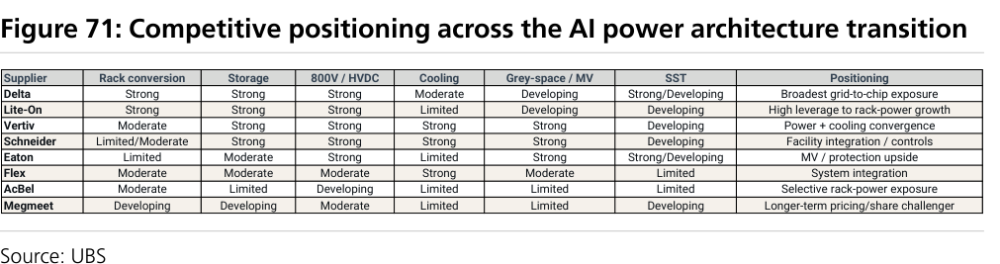

### 解讀摘要

各供應商跨六個技術維度（機架轉換、儲能、800V/HVDC、散熱、灰色空間/MV、SST）的定位評估（Strong/Moderate/Limited/Developing）。Delta 在機架轉換+儲能+800V 三個維度均為 Strong，且兩個空間都佔據（grid-to-chip 廣度），定位為「最廣的 grid-to-chip 曝光」。光寶科在機架轉換+儲能+800V 都是 Strong，定位「高度槓桿於電源機架成長」。Vertiv 在散熱上獨特，Schneider 在設施整合上最強，Eaton 正在強化 MV/電源機架，Flex 側重系統整合。

---

## Fig. 72｜Delta remains the revenue leader, Lite-On scales from a lower base

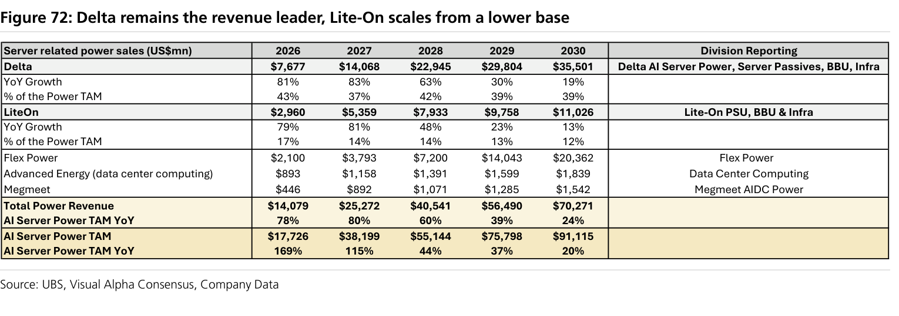

### 解讀摘要

Delta 和光寶科的 AI 伺服器電源相關收入預估：Delta 2026E \$76.77億 → 2030E \$355億（CAGR 约 47%），佔電源 TAM 约 39–43%；光寶科 2026E \$29.6億 → 2030E \$110億（CAGR 約 39%），佔電源 TAM 17%，UBS 視為低基期快速成長案例。兩者合計 2030E 可佔電源 TAM 約 51%。

### 表格

| 廠商 | 2026 | 2027 | 2028 | 2029 | 2030 | 業務範疇 |
|---|---|---|---|---|---|---|
| **Delta**（US\$mn） | **\$7,677** | **\$14,068** | **\$22,945** | **\$29,804** | **\$35,501** | Delta AI 伺服器電源、被動元件、BBU、Infra |
| YoY 成長 | 81% | 83% | 63% | 30% | 19% | — |
| % of Power TAM | 43% | 37% | 42% | 39% | 39% | — |
| **光寶科**（US\$mn） | **\$2,960** | **\$5,359** | **\$7,933** | **\$9,758** | **\$11,026** | LiteOn PSU、BBU & Infra |
| YoY 成長 | 79% | 81% | 48% | 23% | 13% | — |
| % of Power TAM | 17% | 14% | 14% | 13% | 12% | — |
| Flex Power | \$2,100 | \$3,793 | \$7,200 | \$14,043 | \$20,362 | Flex 電源業務 |
| Advanced Energy（DC computing） | \$893 | \$1,158 | \$1,391 | \$1,599 | \$1,839 | — |
| Megmeet | \$446 | \$892 | \$1,071 | \$1,285 | \$1,542 | Megmeet AI DC 電源 |
| **Total（5 廠）Power Revenue** | **\$14,079** | **\$25,272** | **\$40,541** | **\$56,490** | **\$70,271** | — |
| **AI Server Power TAM** | **\$17,726** | **\$38,199** | **\$55,144** | **\$75,798** | **\$91,115** | — |

> **洞察一**：五家廠商合計收入（\$703億）只涵蓋 2030E TAM 的 77%，其餘 23% 由 Schneider、Vertiv、Eaton、ABB 等灰色空間廠商（主要負責設施層配電）以及中國新興競爭者佔據。Delta 和光寶科的市佔率（39%+17%=56%）若能維持，是非常強的護城河。

---

## Fig. 80｜DC revenue approaching 15% of group for diversified analog names

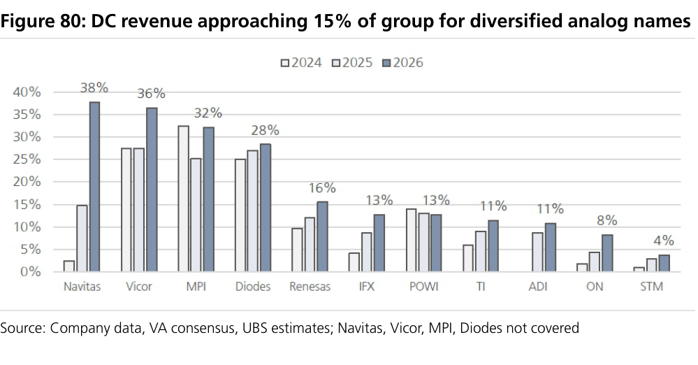

### 解讀摘要

多元類比晶片廠商的資料中心收入佔集團比例（2024–2026）：Navitas（38%）、Vicor（36%）、MPI（32%）、Diodes（28%）為高比例受益者；TI（13%）、POWI（13%）、ADI（11%）為中等比例；ON（8%）、STM（4%）比例較低。UBS 優先推薦 TI（DC 佔比 13% 但整體規模大）、ADI（VRM 市佔率提升）和 STM（光子學額外上行）；Infineon 雖未在此圖中，UBS 視之為高比例但已被充分定價。

---

## Fig. 81｜Global BBU TAM growing at a 78% CAGR to US\$12.8bn

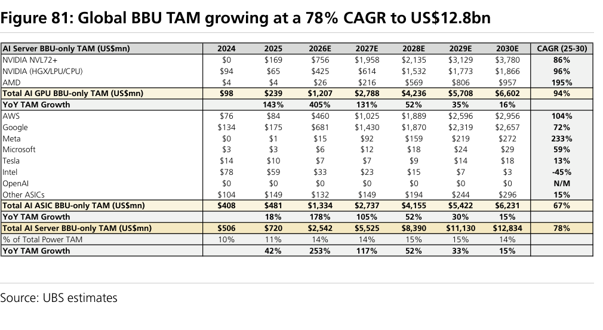

### 解讀摘要

全球 BBU（電池備援單元）TAM：2025 年 \$7.2億 → 2030E \$128億（CAGR 78%）。NVIDIA GPU BBU TAM CAGR 94%（2025 \$2.39億 → 2030E \$66億）；ASIC BBU TAM CAGR 67%（2025 \$4.81億 → 2030E \$62億）。Google ASIC BBU 2030E \$26.57億（CAGR 72%），AWS \$29.56億（CAGR 104%），Meta CAGR 233%（低基期）。BBU TAM 佔總電源 TAM 14–15%，是增長最快的子市場。

### 表格

| BBU TAM（US\$mn） | 2024 | 2025 | 2026E | 2027E | 2028E | 2029E | 2030E | CAGR '25-30 |
|---|---|---|---|---|---|---|---|---|
| NVIDIA NVL72+ | \$0 | \$169 | \$756 | \$1,958 | \$2,135 | \$3,129 | \$3,780 | 86% |
| NVIDIA（HGX/LPU/CPU） | \$94 | \$65 | \$425 | \$614 | \$1,532 | \$1,773 | \$1,866 | 96% |
| AMD | \$4 | \$4 | \$26 | \$216 | \$569 | \$806 | \$957 | 195% |
| **Total AI GPU BBU TAM** | **\$98** | **\$239** | **\$1,207** | **\$2,788** | **\$4,236** | **\$5,708** | **\$6,602** | **94%** |
| Google | \$134 | \$175 | \$681 | \$1,430 | \$1,870 | \$2,319 | \$2,657 | 72% |
| AWS | \$76 | \$84 | \$460 | \$1,025 | \$1,889 | \$2,596 | \$2,956 | 104% |
| Meta | \$0 | \$1 | \$15 | \$92 | \$159 | \$219 | \$272 | 233% |
| Intel | \$78 | \$59 | \$33 | \$23 | \$15 | \$7 | \$3 | -45% |
| **Total AI ASIC BBU TAM** | **\$408** | **\$481** | **\$1,334** | **\$2,737** | **\$4,155** | **\$5,422** | **\$6,231** | **67%** |
| **Total AI Server BBU TAM** | **\$506** | **\$720** | **\$2,542** | **\$5,525** | **\$8,390** | **\$11,130** | **\$12,834** | **78%** |
| % of Total Power TAM | 10% | 11% | 14% | 14% | 15% | 15% | 14% | — |

---

## 跨 Exhibit 彙整表

### 彙整 1｜AI 電源 TAM 分層構成（2025 vs 2030E）

來源：Fig. 46、Fig. 55、Fig. 81

| 電源子市場 | 2025 TAM（US\$bn） | 2030E TAM（US\$bn） | CAGR '25-30 | 主要受益廠商 |
|---|---|---|---|---|
| PSU/分配（前端 AC/DC）| \$3.6 | \$41.5 | 63% | Delta、光寶科、Megmeet |
| BBU/CBU 儲能 | \$0.8 | \$15.9 | 82% | Panasonic、Samsung SDI |
| HVDC 分配+保護 | 含於上 | 含於上 | — | Delta、Eaton、ABB |
| DC/DC + POL VRM | 含於上 | 含於上 | — | TI、ADI、Infineon |
| **Total AI Server Power TAM** | **\$6.6** | **\$91.1** | **69%** | **Delta、光寶科（最直接受益）** |

> BBU/CBU 子市場 CAGR（82%）是唯一超過整體電源 TAM（69%）的子類，顯示儲能附加率（attach rate）的提升速度超過整體電源密度的成長速度。Panasonic 和 Samsung SDI 是純粹的 BBU 受益者，而 Delta 和光寶科同時受益於 PSU/分配和 BBU 兩個子市場。

---

## 相關個股清單

| 類別 | 公司 | Ticker | UBS 評等 | 重點 |
|---|---|---|---|---|
| 電源供應（直接受益） | 台達電子 Delta Electronics | 2308.TW | Buy | 最廣 grid-to-chip 佈局，2030E 市佔 ~39%，PSU/BBU/800V/SST 全覆蓋 |
| 電源供應（直接受益） | 光寶科技 Lite-On | 2301.TW | Buy，NT\$400 目標 | 首次覆蓋；執行力改善+ASIC 客戶滲透+毛利率提升路徑；2030E \$110億收入 |
| 電源供應（觀察） | 光寶科技 Megmeet | 002851.SZ | Neutral | 中國市場後起，低基期快速成長，能否擴大 NVIDIA 以外的客戶認證是關鍵 |
| 設施電源（灰色空間延伸） | Vertiv | VRT.US | — | 電源+散熱交匯點，白色空間滲透者 |
| 設施電源（灰色空間延伸） | Schneider Electric | SU.FR | — | 設施整合能力最強，800V Power Block 受益者 |
| 設施電源（灰色空間延伸） | Eaton | ETN.US | — | MV 開關設備+Fibrebond 模組化電源機架平台（Beam Rubin DSX） |
| 電源半導體（偏好） | 德州儀器 TI | TXN.US | Buy | PSU/IBC 市佔率提升，DC 收入佔比 13%（規模效應顯著） |
| 電源半導體（偏好） | Analog Devices ADI | ADI.US | Buy | VRM 市佔率提升，800V 下游 DC/DC 受益 |
| 電源半導體（偏好） | STMicroelectronics | STM.EU | Buy | 光子學額外曝光提供差異化上行 |
| 電源半導體（謹慎） | Infineon | IFX.DE | Neutral | 高市佔但 UBS 認為預期已充分定價 |
| 被動元件（MLCC） | Murata | 6981.TJ | — | 800V/SST 架構高壓 MLCC 受益者（TDK、Samsung Electro-Mechanics 並列） |
| BBU 儲能 | Panasonic | 6752.TJ | — | 圓柱型 BBU 最具競爭力（近機架緊湊型） |
| BBU 儲能 | Samsung SDI | 006400.KQ | — | LFP 和大型集中式/UPS 應用潛力 |
