# UBS｜光寶科 Lite-On 深度啟動：AI 電源更強的競爭者

**券商**：UBS  
**分析師**：Randy Abrams、Irene Chang  
**日期**：2026-09-14  
**主題**：Lite-On Technology — A stronger contender in AI power（啟動覆蓋，Buy）  
**評級**：Buy（啟動）  
<a href="https://layx.uk/dl?g=產業&b=UBS&d=20260914&h=Lite-On-AI-Power">📎 下載 PDF</a>

---

## 報告總結

UBS 首度啟動光寶科（2301）覆蓋，給予 Buy 評等，目標價 NT\$400（20x 2028E EPS NT\$20，相當於 25x 2027E EPS NT\$16），較現價 NT\$277 有 44% 上行空間。報告核心論點是：AI 電源 TAM 以 69% CAGR 成長至 2030E 的 US\$91.1bn，光寶是台灣第二大電源供應商，正從落後者快速追趕，NVIDIA 認證取得、三大 CSP 供應商地位確立、首套 48V ASIC Power Rack 預計 2026 下半年量產。

光寶的轉型分兩層：一是過去十年透過剝離低毛利業務（Display、SSD、Image BU）將毛利率從中位數拉高至 23%；二是 AI power 將驅動下一階段毛利擴張，目標 2027E GM 26.4%、OpM 15.3%，對標目前已在 35-40% GM 的台達電，說明估值重評空間仍大。

---

## UBS 完整投資邏輯鏈

| 論點層次 | Figure | 內容 |
|---|---|---|
| AI 電源 TAM 超大且高速成長 | Fig 4、17 | AI Power TAM 以 69% CAGR 成長至 2030E US\$91.1bn，主因 TDP/rack 39% CAGR + AI IT 容量 55% CAGR |
| 架構演進創造增量，非替換 | Fig 5、14 | Power Rack 架構（Phase 2-4）使每瓦電源內容從 T1 US\$0.54 跳升至 T4 US\$0.93；HVDC 分配模組由零增至 21% |
| 光寶執行力追趕，ASIC 是差異化 | Fig 9、11、12 | AWS Trainium 已是主力，2026 下半年推 110kW shelf → 800V MW-class rack；ASIC 客戶 2026E 貢獻 61% AI 銷售 |
| 份額偏低但結構改善 | Fig 8、18 | 台達 M/S ~50% 難撼動，但光寶 Blended M/S 由 4.8%（2026E）升至 5.4%（2028E），AI power 銷售 177%/123%/56% YoY |
| 業務重心快速移向高利潤區 | Fig 22、23、24 | Cloud/AIoT 佔比 Q226 已達 55%，Q426E 目標 60%+；Cloud OpM 24% vs IT/CE 7.5% |
| 毛利擴張路徑清晰 | Fig 21、24 | 2025→2027E GM 22.9%→26.4%，OpM 10.1%→15.3%；對標台達 GM 35%+，重評空間仍存 |
| 估值折價修復中但尚未到位 | Fig 30、32 | 股價 YTD +66%，NTM P/E 升至 22x；仍較電源同業均值 29x 折價，較台達 25x 折價 |
| **結論** | 封面 | **Buy，NT\$400（20x 2028E EPS NT\$20），上行 NT\$540（95%），下行 NT\$270（-2%）** |

> **報告最大邏輯缺口**：AWS Trainium 代工認證集中度高（單一客戶 2026E 貢獻 ~60% AI sales），若 AWS 下一代供應商轉移，下行風險超過基礎模型預估的 20%。

---

## 報告核心觀點

| 主題 | UBS 觀點 | 市場共識 | 是否 Contra-Consensus |
|---|---|---|---|
| 2026E EPS | NT\$10.85 | NT\$10.16 | 是，高共識 7% |
| 2027E EPS | NT\$16.00 | NT\$13.80 | 是，高共識 16% |
| 2028E EPS | NT\$20.00 | NT\$19.02 | 略高 5% |
| AI Power TAM | 69% CAGR to US\$91.1bn (2025-30) | 未有明確共識 | 偏樂觀 |
| 光寶 M/S 趨勢 | 4.8%→5.4%（2026-28E） | 市場關注台達主導 | 是，強調追趕空間 |
| 估值倍數 | 目標 20x 2028E，可比 25x 2027E | 歷史 8-14x | 是，大幅提高估值框架 |

**偏好排序**：電源電子（光寶 > 其他 PSU 供應商）；ASIC AI power 優先於 GPU PSU（ASIC 66% AI M/S 預期更穩定）  
**零件/個股偏好**：光寶 Buy（唯一正式啟動）；台達電 2308 作為比較基準（不在本報告評級內）

---

## Fig. 1｜Lite-On 企業精簡時程

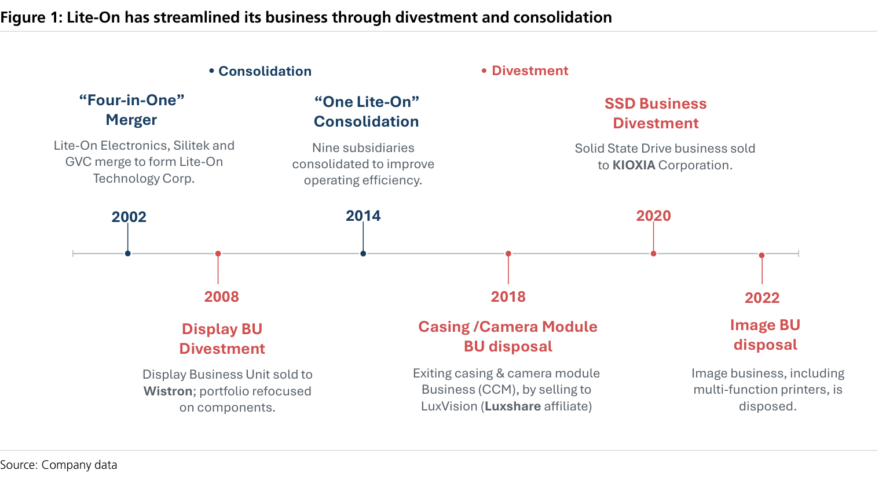

### 解讀摘要
光寶二十年的轉型是一條從「多業務分散集團」走向「電源+光電專業公司」的脫胎換骨路線。四次主要剝離（顯示器→威創 2008；機殼相機模組→路視 2018；SSD→鎧俠 2020；Image BU 2022）讓公司得以把資本與管理注意力集中在高毛利的電源與光電業務，為後來 AI 電源的毛利擴張奠基。

---

## Fig. 2｜三大業務部門現況

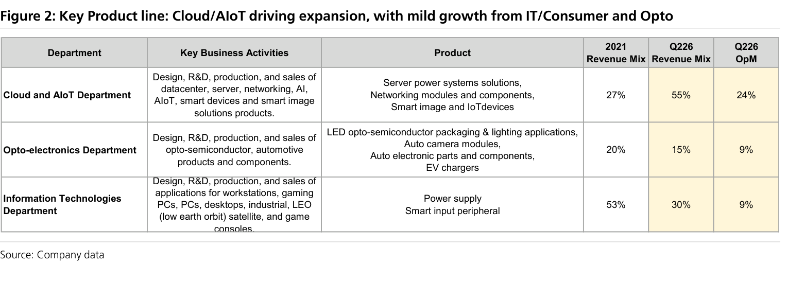

### 解讀摘要
Cloud & AIoT 部門（AI 電源的核心）自 2021 到 Q226 的佔比從 27% 跳升至 55%，同時 OpM 高達 24%，遠超 Opto（9%）與 IT/Consumer（9%）。這不只是結構改善的結果，也是利潤重心快速移動的信號——光寶並非在相同利潤率下做大，而是在轉型中提高單位利潤。

---

## Fig. 3｜選擇性 M&A 強化 AI 電源解決方案廣度

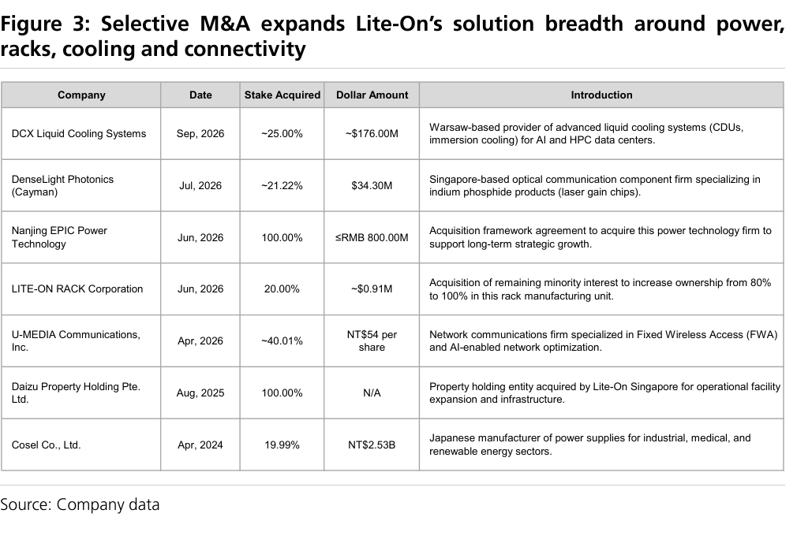

### 解讀摘要
光寶 2024-2026 年在 AI Power 相關技術上持續佈局，最具策略意義的是 DCX Liquid Cooling（浸入式冷卻，Sep 2026，~\$176M）和 DenseLight Photonics（InP 鐳射晶片，Jul 2026，\$34M）——前者讓光寶能跨入 AI 機架層級的散熱解決方案，後者布局光連結（CPO 相關）上游元件。Nanjing EPIC Power（電力技術，Jun 2026，≤RMB 800M）和 LITE-ON RACK 100% 收購，則完成「電源 + 機架」一條龍的垂直整合拼圖。這些收購在 18 個月內集中完成，顯示光寶已進入積極追趕窗口。

### 表格

| 公司 | 時間 | 持股% | 金額 | 戰略定位 |
|---|---|---|---|---|
| DCX Liquid Cooling Systems | Sep 2026 | ~25% | ~\$176M | 浸入式冷卻（CDU），AI DC 散熱 |
| DenseLight Photonics | Jul 2026 | ~21.22% | \$34.3M | InP 鐳射晶片（CPO 上游） |
| Nanjing EPIC Power Technology | Jun 2026 | 100% | ≤RMB 800M | 中國電力技術平台 |
| LITE-ON RACK Corporation | Jun 2026 | 20%（→100%） | ~\$0.91M | 機架製造 |
| U-MEDIA Communications | Apr 2026 | ~40.01% | NT\$54/股 | 固定無線接入（FWA）、AI 網路優化 |
| Cosel Co., Ltd. | Apr 2024 | 19.99% | NT\$2.53B | 工業/醫療/再生能源電源 |

---

## Fig. 4｜AI Power TAM 以 69% CAGR 成長至 2030E US\$91.1bn

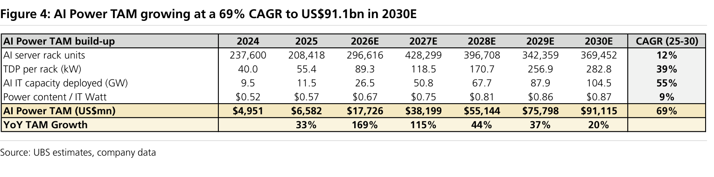

### 解讀摘要
AI Power TAM 的三個成長引擎拆開來看：rack 數量（CAGR 12%）其實相對保守，但 TDP/rack（39% CAGR，從 55kW→283kW）和 AI IT capacity GW（55% CAGR）才是主力，加上每 IT Watt 的電源內容（9% CAGR，\$0.57→\$0.87）形成複合乘數，最終推出 69% CAGR。這意味著 AI 電源 TAM 對 AI 硬體部署規模的槓桿顯著大於 AI 硬體本身的成長率。

### 表格

| 指標 | 2024 | 2025 | 2026E | 2027E | 2028E | 2029E | 2030E | CAGR 25-30 |
|---|---|---|---|---|---|---|---|---|
| AI server rack units | 237,600 | 208,418 | 296,616 | 428,299 | 396,708 | 342,359 | 369,452 | 12% |
| TDP per rack (kW) | 40.0 | 55.4 | 89.3 | 118.5 | 170.7 | 256.9 | 282.8 | 39% |
| AI IT capacity (GW) | 9.5 | 11.5 | 26.5 | 50.8 | 67.7 | 87.9 | 104.5 | 55% |
| Power content / IT Watt (\$) | \$0.52 | \$0.57 | \$0.67 | \$0.75 | \$0.81 | \$0.86 | \$0.87 | 9% |
| **AI Power TAM (US\$mn)** | **\$4,951** | **\$6,582** | **\$17,726** | **\$38,199** | **\$55,144** | **\$75,798** | **\$91,115** | **69%** |
| YoY TAM Growth | - | 33% | 169% | 115% | 44% | 37% | 20% | - |

> **洞察一**：2026E 的 169% YoY TAM 成長是一次性的「Blackwell 時代到來」效果（TDP/rack 89.3kW vs 2025 55.4kW）；2027E 起回歸 37-115% 區間，並非永遠不減速。
> **值得驗證**：Power content/IT Watt 的 9% CAGR 假設較保守（架構升級可能帶來更大跳升），若升至 12-15% CAGR，2030E TAM 可達 US\$110-120bn，對光寶 M/S 有槓桿效果。

---

## Fig. 5｜AI 電源架構演進：從 PSU 到 Power Rack 四階段

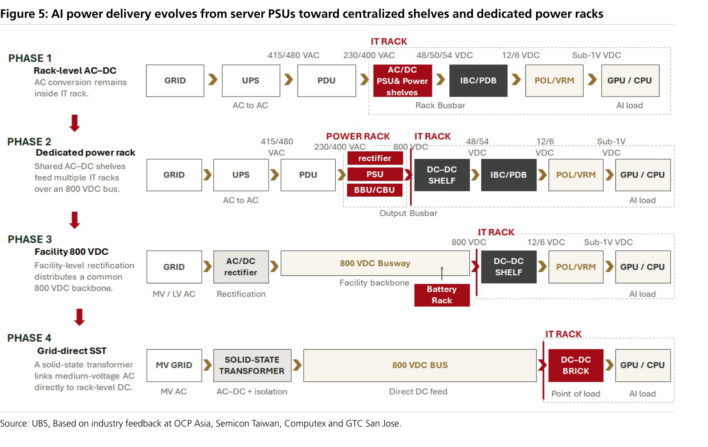

### 解讀摘要
架構演進的關鍵在於「電源轉換功能在機架體系中的位置持續外移」：Phase 1 在 IT Rack 內做 AC-DC（PSU）；Phase 2 獨立的 Power Rack 透過 800VDC 總線饋電多個 IT Rack（BBU/CBU 提供後備）；Phase 3 設施層級鋪設 800VDC Busway，整棟 DC 共享一套整流；Phase 4 固態變壓器直接從中壓電網輸出 800VDC。每個 Phase 的架構升級都意味著光寶的可尋址內容增加——從單台 PSU 擴展到整個 Power Rack 系統（BBU、整流器、母排、PDU），這正是 content/W 跳升的根本原因。

---

## Fig. 6｜台達 vs 光寶：伺服器電源銷售走勢（季度）

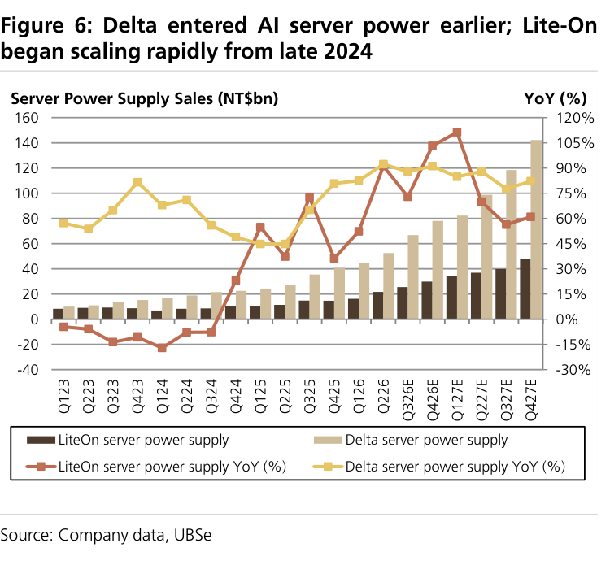

### 解讀摘要
台達在 AI 電源的先發優勢清晰——其伺服器電源規模已達光寶的 3-4 倍，且 YoY 成長率（黃線）自 2023 起就保持高位。光寶（紅線）則從 2024 年末開始急速拉高 YoY 增速，代表從 2024H2 起的快速切入。Q426E 光寶伺服器電源達 NT\$30bn，約為台達的 20%，差距正在縮窄但仍大。

---

## Fig. 7｜AI 伺服器電源佔光寶總銷售比重（年度）

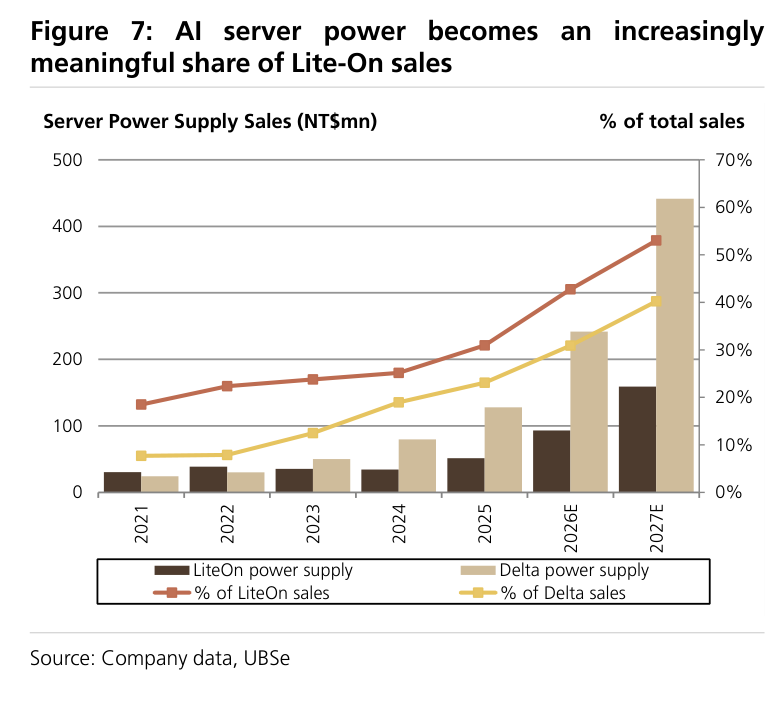

### 解讀摘要
光寶伺服器電源佔總銷售比重的擴張速度超過台達（台達已在 40%+，光寶從 2025 的 8% 快速升至 2027E 40%+）。這個加速現象說明光寶目前的體量較小、基數效應使比重成長更快，但也代表 AI 電源佔比躍升帶來的利潤率結構改善空間更大——Cloud OpM 24% 對整體 OpM 的拉力將遠超台達同期的邊際效果。

---

## Fig. 8｜競爭格局：台達保持規模優勢，光寶從低基數追趕

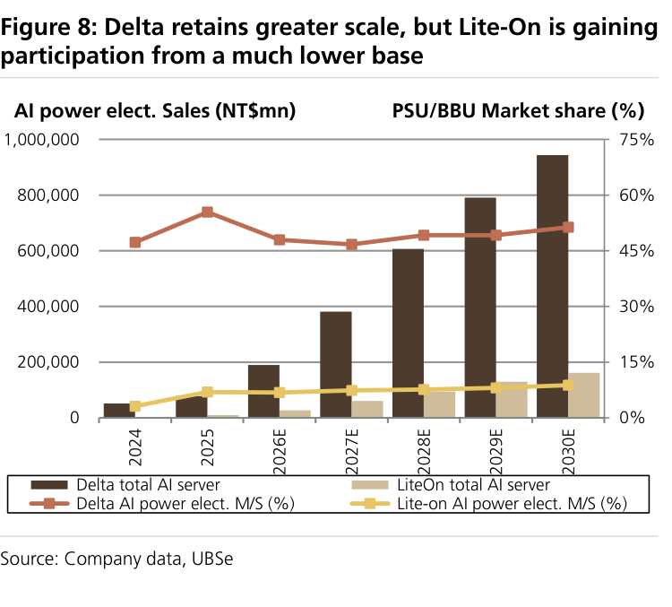

### 解讀摘要
台達 AI 電源規模在 2030E 將達 NT\$940bn，M/S 穩定在 46-50%，與光寶 NT\$162bn（M/S ~10%）的差距顯示台達的生態系優勢和客戶黏性難以在短期撼動。但光寶的 M/S 從 2025 的 ~2% 提升至 2030E 的 ~10%，若以絕對金額計算（NT\$162bn），已接近一個中型半導體廠商的全年規模，不可忽視。

### 表格

| 年份 | 台達 AI 電源（NT\$mn） | 台達 M/S | 光寶 AI 電源（NT\$mn） | 光寶 M/S |
|---|---|---|---|---|
| 2024 | ~40,000 | ~47% | ~2,000 | ~2% |
| 2025 | ~60,000 | ~52% | ~3,000 | ~2-3% |
| 2026E | ~180,000 | ~50%+ | ~27,000 | ~5% |
| 2027E | ~380,000 | ~48% | ~60,000 | ~5% |
| 2028E | ~600,000 | ~48% | ~94,000 | ~5% |
| 2029E | ~800,000 | ~48% | ~130,000 | ~5% |
| 2030E | ~940,000 | ~48% | ~162,000 | ~10%（包含Power Rack升級） |

---

## Fig. 9｜光寶伺服器電源季度放量（Q123-Q426E）

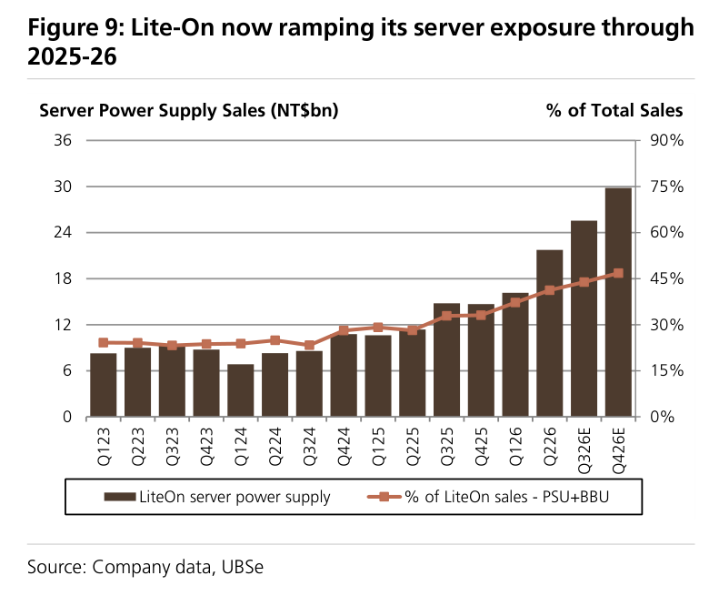

### 解讀摘要
光寶的伺服器電源從 2021-2024 長期在 NT\$7-10bn/季高原震盪，顯示早期執行力不足未能跟上 AI 投資浪潮的初期加速。轉折點在 Q125：季度銷售開始突破 NT\$12bn，2026 Q326E/Q426E 預估達 NT\$24-30bn，伺服器電源佔總銷售比重（右軸，紅線）也同步衝破 40%。這個「晚」入場的追趕曲線，說明光寶仍有較長的成長跑道。

---

## Fig. 10｜產業 ASIC 比例穩定在 ~45%

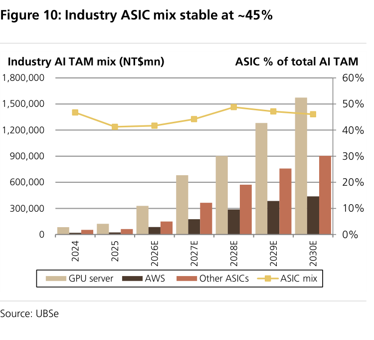

### 解讀摘要
GPU（NVIDIA）+ ASIC（AWS Trainium、其他 CSP 定制）的 AI 電源 TAM 分布中，ASIC 比例穩定在 44-47%，顯示 ASIC 電源需求並非靠蠶食 GPU 份額而來，而是 AI 基礎設施的並行擴張。對光寶而言，ASIC 客戶（尤其 AWS）是其 AI sales 的主力，ASIC TAM 的相對穩定說明其核心市場不會因 GPU 份額變動而大幅波動。

---

## Fig. 11｜光寶 AI 銷售客戶拆分（2024-2030E）

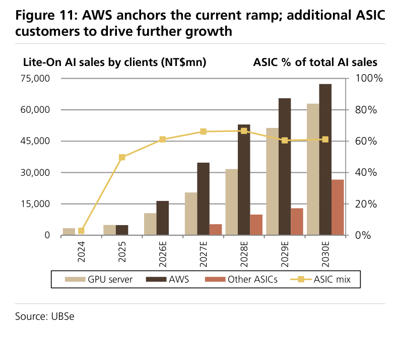

### 解讀摘要
AWS 目前是光寶 AI sales 的最大單一客戶，且比重持續上升（2026E 佔 AI sales 61%），但 2027E 之後，「其他 ASIC」客戶開始貢獻可觀增量（NT\$5bn→NT\$10bn→NT\$27bn），代表光寶正在拓展第二、三個 ASIC 客戶（推測為 Meta/Google/Microsoft）。若 AWS 後續轉移訂單，多元化程度不足將是主要風險。

### 表格

| 年份 | GPU Server（NT\$mn） | AWS（NT\$mn） | Other ASICs（NT\$mn） | ASIC Mix | Total AI（NT\$mn） |
|---|---|---|---|---|---|
| 2024 | ~2,000 | ~500 | ~0 | ~20% | ~2,500 |
| 2025 | ~2,000 | ~2,000 | ~0 | ~50% | ~4,000 |
| 2026E | 10,521 | 16,363 | 161 | 61% | 27,046 |
| 2027E | 20,454 | 34,737 | 5,234 | 66% | 60,425 |
| 2028E | 31,621 | 52,982 | 9,856 | 67% | 94,459 |
| 2029E | 51,295 | 65,514 | 12,886 | 60% | 129,695 |
| 2030E | 62,929 | 72,317 | 26,575 | 61% | 161,821 |

> **洞察一**：2026E AWS 貢獻佔光寶 AI sales 的 60%，代表 AWS Trainium 集中度顯著，若 Trainium 3 供應商重組（AWS 傾向分散化），光寶的 2027E 123% AI sales 成長假設有 20-30% 下行風險。
> **洞察二（配合 Fig 8）**：光寶 2027E AI power sales NT\$60bn 對台達 NT\$380bn，比值 ~15.8%，但 M/S 只有 5%——意味 UBS 的 TAM 假設中台達覆蓋的市場更廣，光寶主要是 ASIC 超算中心這個更精細的細分市場。

---

## Fig. 12｜光寶產品路線圖：33kW shelf → 110kW → MW 級 Power Rack（2026）

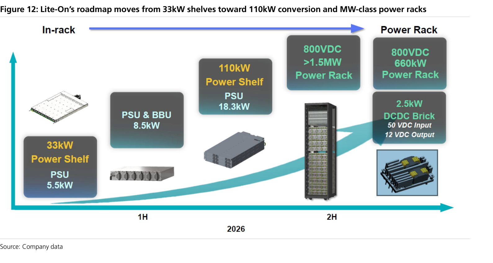

### 解讀摘要
2026 年是光寶的「架構升級年」：1H26 先量產 PSU&BBU（8.5kW）和 33kW/110kW Power Shelf，2H26 再推出 800VDC >1.5MW 及 660kW Power Rack，並附帶 2.5kW DCDC Brick（50V→12V）。從「in-rack PSU」走向「Power Rack」是 content/W 從 \$0.66 跳升至 \$0.93 的結構性原因（見 Fig 14），2H26 量產執行能否如期是最大的近期催化劑。

---

## Fig. 13｜光寶 HVDC Power Rack 解決方案架構

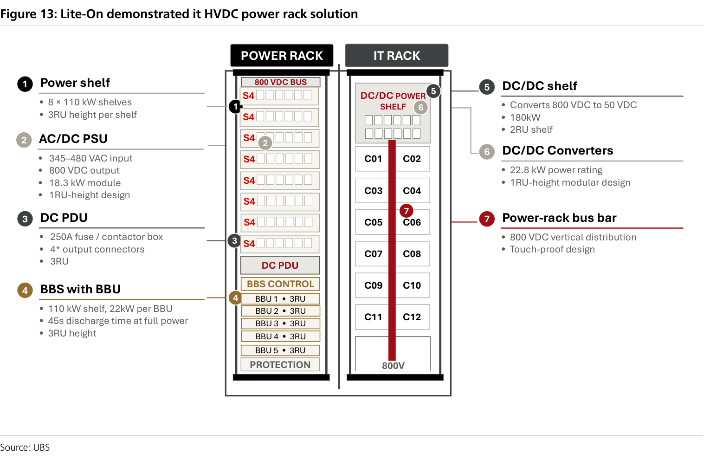

### 解讀摘要
光寶的 HVDC Power Rack 包含 7 個模組：8×110kW S4 Power Shelves（800VDC 輸出）、AC/DC PSU（18.3kW 單模組）、DC PDU、BBS with BBU（5×3RU，各 22kW）、DC/DC Shelf（800V→50V，180kW）、DC/DC Converters（12×22.8kW），以及 800V 垂直分配母排。整套系統完全由光寶自製，顯示其垂直整合深度——從 PSU 模組到整機架電源管理，都在光寶產品組合內。

---

## Fig. 14｜Lite-On 每瓦電源內容與各代 AI 機架總內容

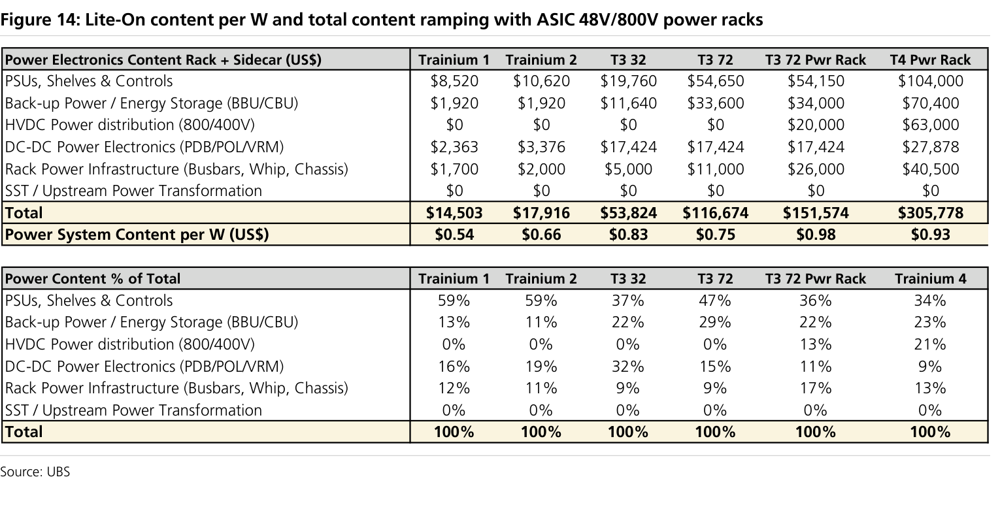

### 解讀摘要
從 Trainium 1 到 T4 Power Rack，光寶可尋址內容從 US\$14,503 暴增至 US\$305,778（+20x），每瓦從 \$0.54 升至 \$0.93。關鍵增量來源並非傳統 PSU（從 \$8,520 升到 \$104,000，+12x）而是兩個全新模組：HVDC 電源分配（從 \$0 升至 \$63,000，21% 的 T4 總量）和 Rack Power Infrastructure（Busbars/Whip/Chassis，從 \$1,700 升至 \$40,500）。這些是「純增量內容」，不是搶奪其他供應商份額，代表 Power Rack 轉型對光寶是全新市場而非零和競爭。

### 表格

| 電源組件 | Trainium 1 | Trainium 2 | T3 32 | T3 72 | T3 72 Pwr Rack | T4 Pwr Rack |
|---|---|---|---|---|---|---|
| PSUs, Shelves & Controls | \$8,520 | \$10,620 | \$19,760 | \$54,650 | \$54,150 | \$104,000 |
| Back-up Power / BBU | \$1,920 | \$1,920 | \$11,640 | \$33,600 | \$34,000 | \$70,400 |
| HVDC Power distribution | \$0 | \$0 | \$0 | \$0 | \$20,000 | \$63,000 |
| DC-DC Power Electronics | \$2,363 | \$3,376 | \$17,424 | \$17,424 | \$17,424 | \$27,878 |
| Rack Power Infrastructure | \$1,700 | \$2,000 | \$5,000 | \$11,000 | \$26,000 | \$40,500 |
| **Total** | **\$14,503** | **\$17,916** | **\$53,824** | **\$116,674** | **\$151,574** | **\$305,778** |
| **Content per W** | **\$0.54** | **\$0.66** | **\$0.83** | **\$0.75** | **\$0.98** | **\$0.93** |

> **洞察一**：T3 72 vs T3 72 Power Rack，差額為 \$34,900（+30%），主要是 HVDC distribution \$20,000 和 Infrastructure \$15,000——這就是「Power Rack」轉型的純增量價值，與 PSU 能力無關。
> **洞察二**：T3 72（in-rack）的 \$0.75/W 低於 T3 32 的 \$0.83/W，因為更高瓦數的機架攤薄了固定基礎設施成本；但 T3 72 Power Rack 的 \$0.98/W 則回到高位，說明 Power Rack 架構是解決「scale 稀釋 content/W」問題的結構性方案。

---

## Fig. 15｜2027 NVIDIA 電源 TAM 對 Power Rack 滲透率敏感度

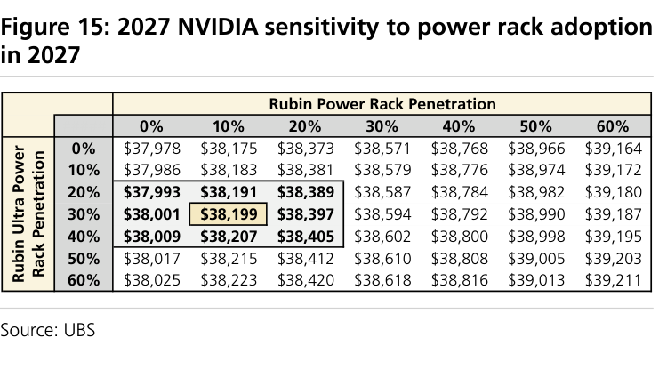

### 解讀摘要
此矩陣以 Rubin Ultra Power Rack Penetration（縱軸）和 Rubin Power Rack Penetration（橫軸）各 0-60% 組合，呈現 AI Power TAM 的範圍。基準假設（Rubin Ultra 30% / Rubin 10%）對應 \$38,199mn（黃色格）。TAM 範圍在 \$37,978mn（0%/0%）到 \$39,211mn（60%/60%），顯示 Power Rack 滲透對 2027 TAM 影響相對有限（約 3%），但對光寶的 AI sales 影響大得多（因 Power Rack content 是 PSU 的 10x+）。

### 表格

| Rubin Ultra / Rubin | 0% | 10% | 20% | 30% | 40% | 50% | 60% |
|---|---|---|---|---|---|---|---|
| 0% | \$37,978 | \$38,175 | \$38,373 | \$38,571 | \$38,768 | \$38,966 | \$39,164 |
| 10% | \$37,986 | \$38,183 | \$38,381 | \$38,579 | \$38,776 | \$38,974 | \$39,172 |
| 20% | \$37,993 | \$38,191 | \$38,389 | \$38,587 | \$38,784 | \$38,982 | \$39,180 |
| **30%（基準）** | \$38,001 | **\$38,199** | \$38,397 | \$38,594 | \$38,792 | \$38,990 | \$39,187 |
| 40% | \$38,009 | \$38,207 | \$38,405 | \$38,602 | \$38,800 | \$38,998 | \$39,195 |

---

## Fig. 16｜每 10ppt Power Rack 滲透率對 TAM 影響約 1%

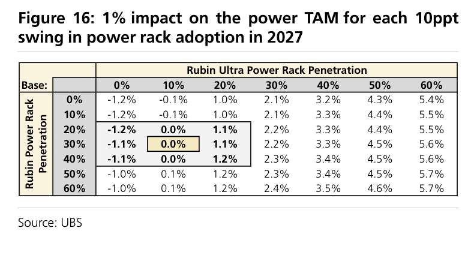

### 解讀摘要
敏感度矩陣顯示相對基準的 TAM 影響：每增加 10ppt Power Rack 採用率（Rubin），TAM 提升約 1-1.2%；反之減少 10ppt 則 TAM 下降 1%。這說明 UBS 的 AI Power TAM 對架構路徑的敏感度偏低——主要成長驅動仍是 IT capacity GW 部署量而非架構選擇。

---

## Fig. 17｜基礎案例 TAM：10% Power Rack 滲透 → 2027E US\$38.2bn

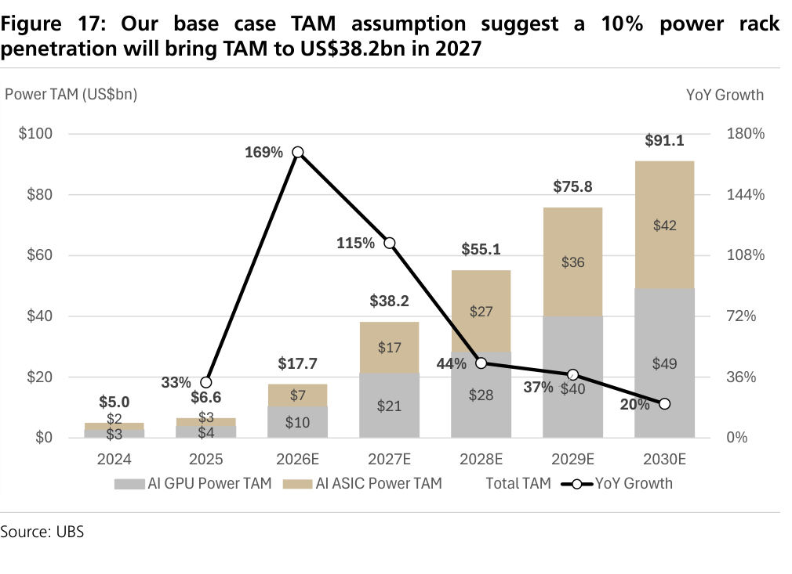

### 解讀摘要
2026E 是 TAM 爆發年（169% YoY），核心是 Blackwell 世代算力大幅鋪設推升 IT Capacity GW；2027E 雖仍有 115% 成長（\$38.2bn），但基數效應開始稀釋年增速。2030E 的 US\$91.1bn 中，AI ASIC Power TAM（米色）佔比持續擴大，與 Fig 10 的 ASIC mix ~45% 吻合，是光寶專注 ASIC 客戶的戰略支撐。

### 表格

| 年份 | AI GPU TAM | AI ASIC TAM | Total TAM | YoY |
|---|---|---|---|---|
| 2024 | \$3bn | \$2bn | \$5.0bn | - |
| 2025 | \$4bn | \$3bn | \$6.6bn | 33% |
| 2026E | \$10bn | \$7bn | \$17.7bn | 169% |
| 2027E | \$21bn | \$17bn | \$38.2bn | 115% |
| 2028E | \$28bn | \$27bn | \$55.1bn | 44% |
| 2029E | \$40bn | \$36bn | \$75.8bn | 37% |
| 2030E | \$49bn | \$42bn | \$91.1bn | 20% |

---

## Fig. 18｜光寶 AI 電源銷售基礎案例（客戶別，2026-2030E）

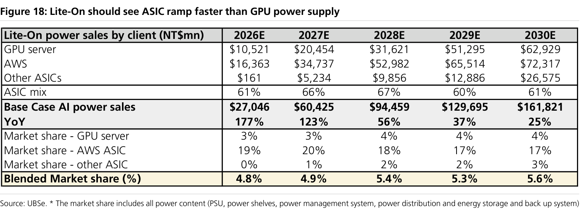

### 解讀摘要
光寶基礎案例下 AI power sales 2026E NT\$27bn（177% YoY）→ 2027E NT\$60bn（123%）→ 2028E NT\$94bn（56%），Blended M/S 穩步提升至 5.4%。值得注意的是 GPU Server M/S 只有 3-4%（vs AWS ASIC M/S 19-20%），說明光寶在 NVIDIA GPU 電源市場的地位相對薄弱，主要靠 AWS Trainium 的獨家性。

### 表格

| 客戶別 | 2026E | 2027E | 2028E | 2029E | 2030E |
|---|---|---|---|---|---|
| GPU server（NT\$mn） | \$10,521 | \$20,454 | \$31,621 | \$51,295 | \$62,929 |
| AWS（NT\$mn） | \$16,363 | \$34,737 | \$52,982 | \$65,514 | \$72,317 |
| Other ASICs（NT\$mn） | \$161 | \$5,234 | \$9,856 | \$12,886 | \$26,575 |
| **Base Case AI power sales** | **\$27,046** | **\$60,425** | **\$94,459** | **\$129,695** | **\$161,821** |
| YoY | 177% | 123% | 56% | 37% | 25% |
| GPU M/S | 3% | 3% | 4% | 4% | 4% |
| AWS ASIC M/S | 19% | 20% | 18% | 17% | 17% |
| Other ASIC M/S | 0% | 1% | 2% | 2% | 3% |
| **Blended M/S** | **4.8%** | **4.9%** | **5.4%** | **5.3%** | **5.6%** |

---

## Fig. 19｜上行情境：ASIC/GPU 多 2% 份額 → AI power +40-50%

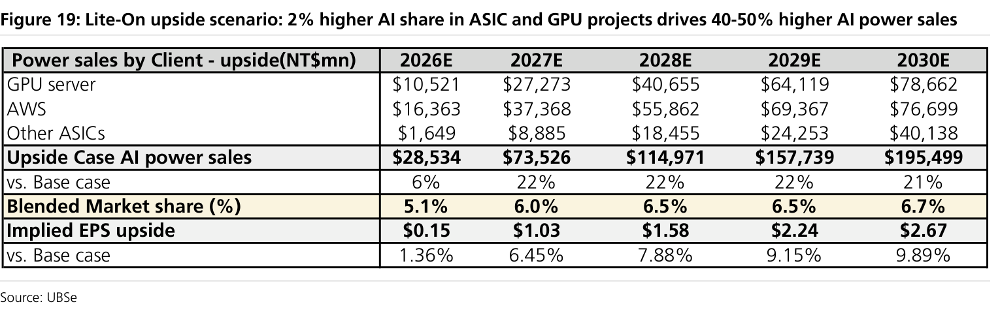

### 解讀摘要
上行情境假設光寶在 ASIC 和 GPU 項目中各多取得 2% 市場份額（Blended M/S 升至 5.1-6.7%），帶動 2027E AI power sales 達 NT\$73.5bn（+22% vs 基礎），隱含 EPS 上行 NT\$1.03（+6.45% vs 基礎），對應目標價 NT\$540（+35% vs 目前 NT\$400）。關鍵假設是光寶能在 12-18 個月內取得目前尚未覆蓋的兩家 Hyperscaler 訂單。

### 表格

| 指標 | 2026E | 2027E | 2028E | 2029E | 2030E |
|---|---|---|---|---|---|
| Upside AI power sales（NT\$mn） | \$28,534 | \$73,526 | \$114,971 | \$157,739 | \$195,499 |
| vs 基礎案例 | +6% | +22% | +22% | +22% | +21% |
| Blended M/S | 5.1% | 6.0% | 6.5% | 6.5% | 6.7% |
| **Implied EPS upside（NT\$）** | **\$0.15** | **\$1.03** | **\$1.58** | **\$2.24** | **\$2.67** |
| vs 基礎案例 EPS | +1.4% | +6.5% | +7.9% | +9.2% | +9.9% |

---

## Fig. 20｜下行情境：認證延遲 + 1-2% 份額流失 → AI power -20-30%

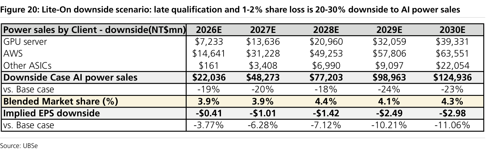

### 解讀摘要
下行情境假設光寶認證時程延誤且 1-2% 份額流失（Blended M/S 降至 3.9-4.4%），2027E AI sales 降至 NT\$48.3bn（-20% vs 基礎），隱含 EPS 下行 -NT\$1.01（-6.28%），對應目標價 NT\$270（-32.5% vs NT\$400），幾乎與現價 NT\$277 持平，說明在最壞情境下股票已無安全邊際。

### 表格

| 指標 | 2026E | 2027E | 2028E | 2029E | 2030E |
|---|---|---|---|---|---|
| Downside AI power sales（NT\$mn） | \$22,036 | \$48,273 | \$77,203 | \$98,963 | \$124,936 |
| vs 基礎案例 | -19% | -20% | -18% | -24% | -23% |
| Blended M/S | 3.9% | 3.9% | 4.4% | 4.1% | 4.3% |
| **Implied EPS downside（NT\$）** | **-\$0.41** | **-\$1.01** | **-\$1.42** | **-\$2.49** | **-\$2.98** |
| vs 基礎案例 EPS | -3.8% | -6.3% | -7.1% | -10.2% | -11.1% |

> **值得驗證**：下行情境 NT\$270 僅比現價 NT\$277 低 2.5%，意味市場已在定價一個「基礎以下」的 AI 執行情境。若近期無催化劑（如 2H26 Power Rack 量產確認），目前 22x NTM PE 的估值已反映相當高的執行預期。

---

## Fig. 21｜光寶長期銷售與毛利走勢（2014-2028E）

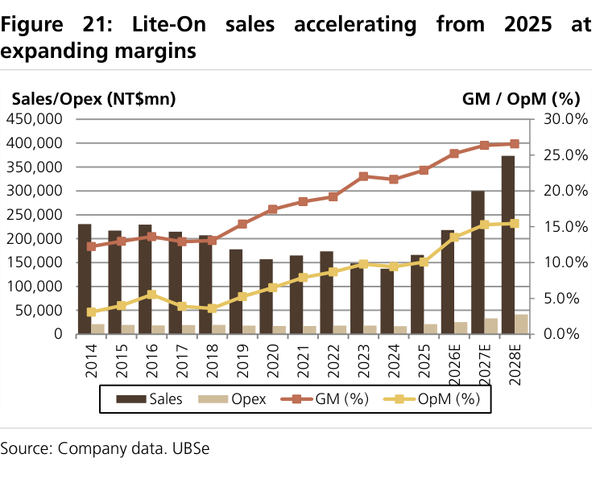

### 解讀摘要
光寶的長期軌跡呈現「L 型重建」：2014-2021 年銷售持平甚至下滑（因業務剝離），但 GM 從 10% 穩步提升至 17-18%（業務清理的紅利）；2021 起 Cloud 業務帶動銷售加速，加上 AI 電源導入帶來第二波毛利擴張（2025-27E GM 23%→26.4%）。這個「先瘦身提質、再擴大規模」的路徑，正是 UBS 認為光寶可以在高基礎上繼續提升毛利率的根本邏輯。

---

## Fig. 22｜業務組合快速移向 Cloud/AIoT

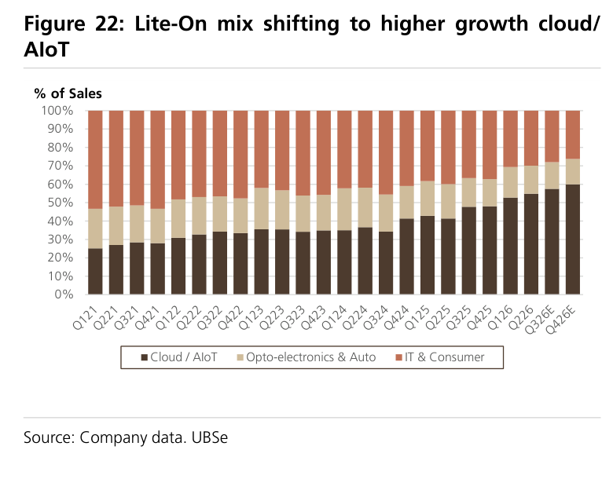

### 解讀摘要
Cloud/AIoT 從 2021 的 ~25% 迅速擴張到 Q226 的 ~55%，預估 Q426E 超過 60%。相對地，IT & Consumer（PC 電源、周邊）從 ~50% 降至 ~20%，Opto-electronics 從 ~25% 降至 ~18%。這個 mix shift 是光寶 GM 從 23%（2025）到目標 26-27%（2027E）的核心機制——Cloud OpM 24% vs 其他兩段 7-9%。

---

## Fig. 23｜Cloud & AIoT 驅動 2025-28 增量收入的 ~90%

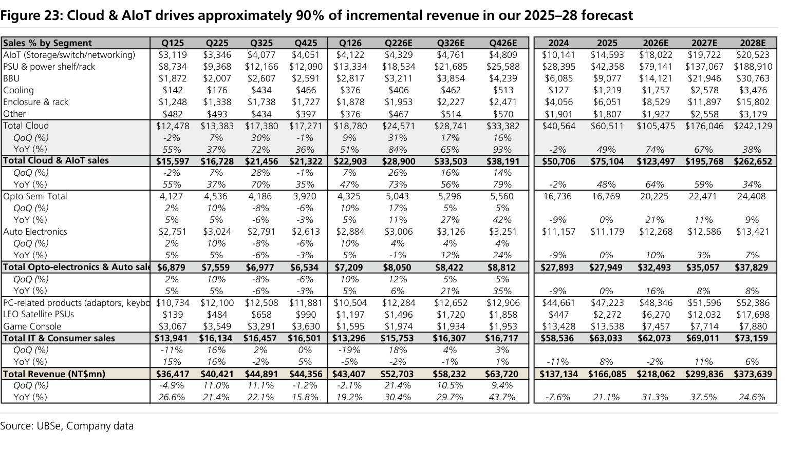

### 解讀摘要
最詳細的分部拆解：2025→2028E 總收入增量 NT\$207bn（NT\$166bn→NT\$374bn）中，Cloud & AIoT 貢獻 NT\$182bn（88%）。其中 PSU & Power Shelf/Rack 是最大引擎（NT\$42bn→NT\$189bn，增量 NT\$147bn）；BBU 次之（NT\$9bn→NT\$31bn，增量 NT\$22bn）。反之 IT & Consumer 幾乎原地踏步（NT\$63bn→NT\$73bn），Opto-electronics 小幅成長（NT\$28bn→NT\$38bn）。

### 表格（精簡版，年度比較）

| 業務 | 2025 | 2026E | 2027E | 2028E |
|---|---|---|---|---|
| AIoT（Storage/switch） | \$14,593 | \$18,022 | \$19,722 | \$20,523 |
| PSU & Power Shelf/Rack | \$42,358 | \$79,141 | \$137,067 | \$188,910 |
| BBU | \$9,077 | \$14,121 | \$21,946 | \$30,763 |
| Cooling | \$1,219 | \$1,757 | \$2,578 | \$3,476 |
| Enclosure & Rack | \$6,051 | \$8,529 | \$11,897 | \$15,802 |
| **Total Cloud & AIoT** | **\$75,104** | **\$123,497** | **\$195,768** | **\$262,652** |
| Opto Semi Total | \$16,769 | \$20,225 | \$22,471 | \$24,408 |
| Auto Electronics | \$11,179 | \$12,268 | \$12,586 | \$13,421 |
| **Total Opto & Auto** | **\$27,949** | **\$32,493** | **\$35,057** | **\$37,829** |
| IT & Consumer Total | \$63,033 | \$62,073 | \$69,011 | \$73,159 |
| **Total Revenue** | **\$166,085** | **\$218,062** | **\$299,836** | **\$373,639** |
| YoY | 21% | 31% | 38% | 25% |

> **洞察一**：PSU & Power Shelf/Rack 從 \$42bn 到 \$189bn（2025→2028E），4 年間 +\$147bn（+350%），這單一產品線就比 IT & Consumer 整個部門（\$73bn）還大，說明 AI 電源是真正的業務重心轉移。

---

## Fig. 24｜AI 組合改善 + 營運槓桿支撐毛利擴張

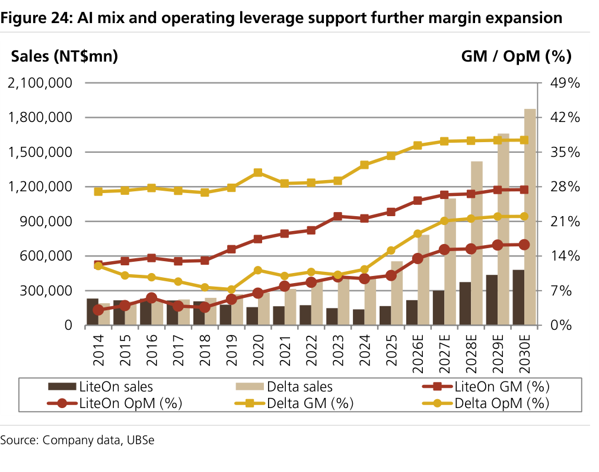

### 解讀摘要
台達（黃/米色線）的 GM 長期在 28-35%，OpM 在 20%+；光寶（紅/棕色）目前 GM 23%、OpM 10%，但軌跡向上、且斜率在 2026-27E 明顯陡化。差距仍大（GM gap ~6-10pp），但縮窄速度加快——光寶的 AI mix 提升路徑清晰（見 Fig 22、23），台達已在高位故邊際改善有限，光寶的 margin 擴張故事因此更有投資吸引力。

---

## Fig. 27｜2026 資本支出大幅提升以支撐 AI 電源產能

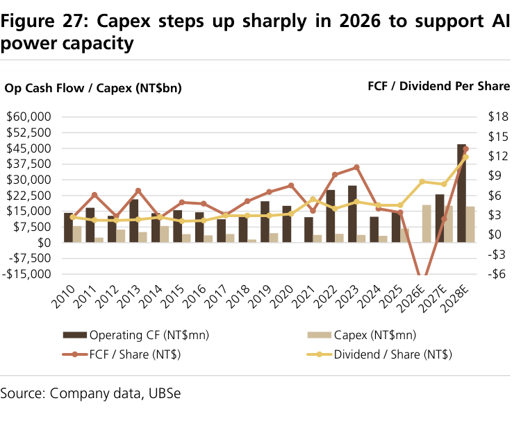

### 解讀摘要
光寶 Capex 從過去三年均值 NT\$4.6bn 跳增至 2026E NT\$18bn（~4 倍），目的是 2026 年底前使產能翻倍以上。這帶來 FCF/share（紅線）的短期負轉（2026E 約 -NT\$2/share），但 2027E 起隨 AI 電源銷售放量，FCF 應快速恢復正值（2027E ~NT\$1/share，2028E NT\$3/share+）。Capex surge 不是利潤隱憂，而是光寶執行力的證明——若未有充足訂單可見度，不會大幅擴產。

---

## Fig. 28｜光寶淨現金快速下降，為產能擴張加速融資

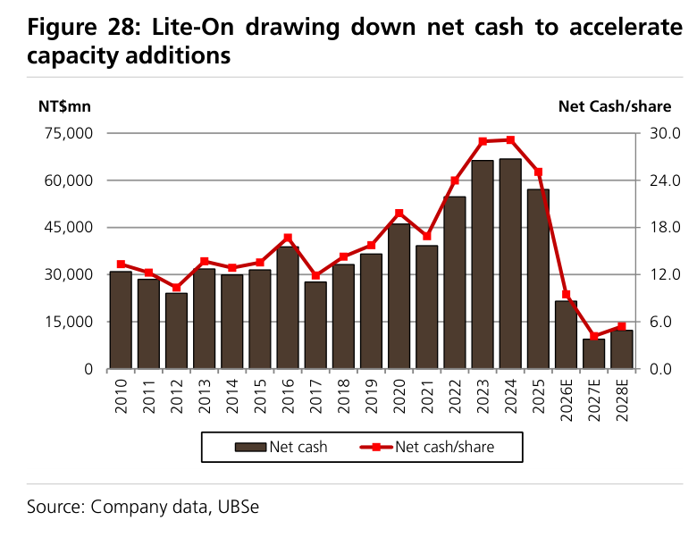

### 解讀摘要
光寶淨現金從 2024 峰值 NT\$67bn 大幅下降至 2027E NT\$11bn，之後逐步回升。這對財務穩健性有一定影響（從「淨現金公司」轉型為「輕負債」），但 HOLT 的分析（見 Fig 33）顯示 2026-28E CFROI 將升至 14-17%（遠超資本成本），說明這次資本支出的 ROI 有合理依據。

---

## Fig. 30｜光寶 P/E 向台達收斂，反映 AI 電源轉型再評價

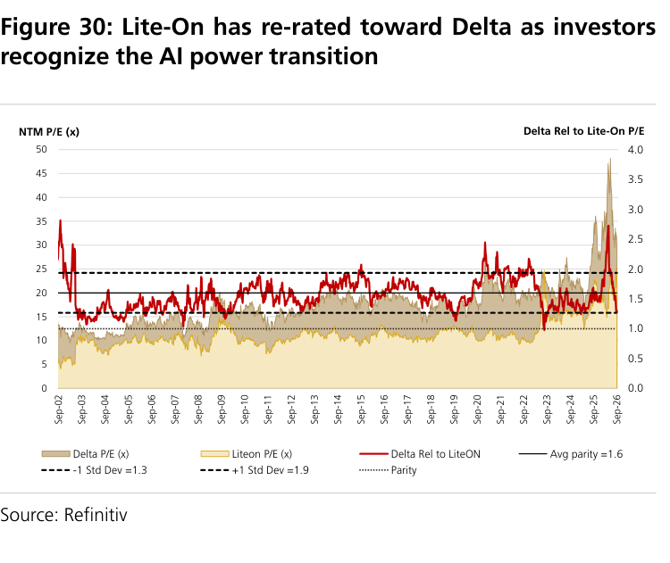

### 解讀摘要
自 2002 至 2024 年，台達 NTM P/E 長期約為光寶的 1.5-2x（均值 1.6x），但 2025-2026 年光寶的 P/E 快速追近台達，Delta/LiteOn P/E 比值從 2.5x 壓縮至接近均值 1.6x。UBS 認為這種收斂仍未完成，因光寶的 AI revenue 佔比（2026E 12%）還遠低於台達（~48%），隨光寶 AI 佔比提升，P/E gap 理應繼續縮窄。

---

## Fig. 32｜光寶估值仍低於電源同業均值

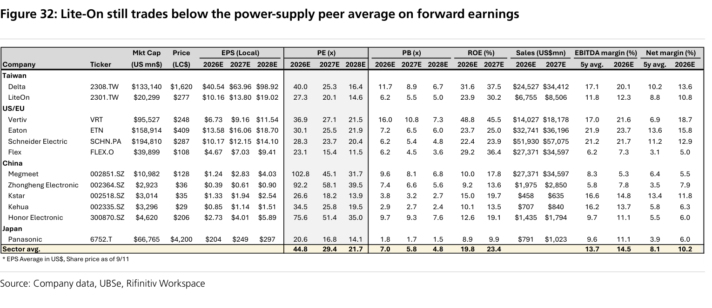

### 解讀摘要
光寶 2026E P/E 27.3x，低於台達 40.0x、Vertiv 36.9x，以及整體電源同業均值 44.8x（含中國公司如美的 Megmeet 102.8x）。若只看台灣和 US/EU 可比公司（台達 40x、Vertiv 37x、Eaton 30x），光寶 27x 仍有明顯折價。UBS 目標 2027E 25x 基本上相當於「給台達打折」，保守假設下仍有 44% 上行空間。

### 表格

| 公司 | Ticker | Mkt Cap (US\$mn) | 2026E PE | 2027E PE | 2028E PE | EPS 2027E (LC\$) |
|---|---|---|---|---|---|---|
| **台灣** | | | | | | |
| Delta | 2308.TW | \$133,140 | 40.0x | 25.3x | 16.4x | \$63.96 |
| **LiteOn** | **2301.TW** | **\$20,299** | **27.3x** | **20.1x** | **14.6x** | **\$13.80** |
| **US/EU** | | | | | | |
| Vertiv | VRT | \$95,527 | 36.9x | 27.1x | 21.5x | \$9.16 |
| Eaton | ETN | \$158,914 | 30.1x | 25.5x | 21.9x | \$16.06 |
| Schneider Electric | SCHN.PA | \$194,810 | 28.3x | 23.7x | 20.4x | \$12.15 |
| Flex | FLEX.O | \$39,899 | 23.1x | 15.4x | 11.5x | \$7.03 |
| **Sector avg.** | | | **44.8x** | **29.4x** | **21.7x** | - |

> **洞察一（配合 Fig 30）**：光寶 2026E 27.3x 的折價部分反映其 AI 電源佔比（目前 12%）遠低於台達（~48%），隨光寶 2027E AI mix 升至 ~20%，估值向台達收斂有結構性支撐。

---

## Fig. 33｜HOLT 視角：AI 回報持續是上行關鍵

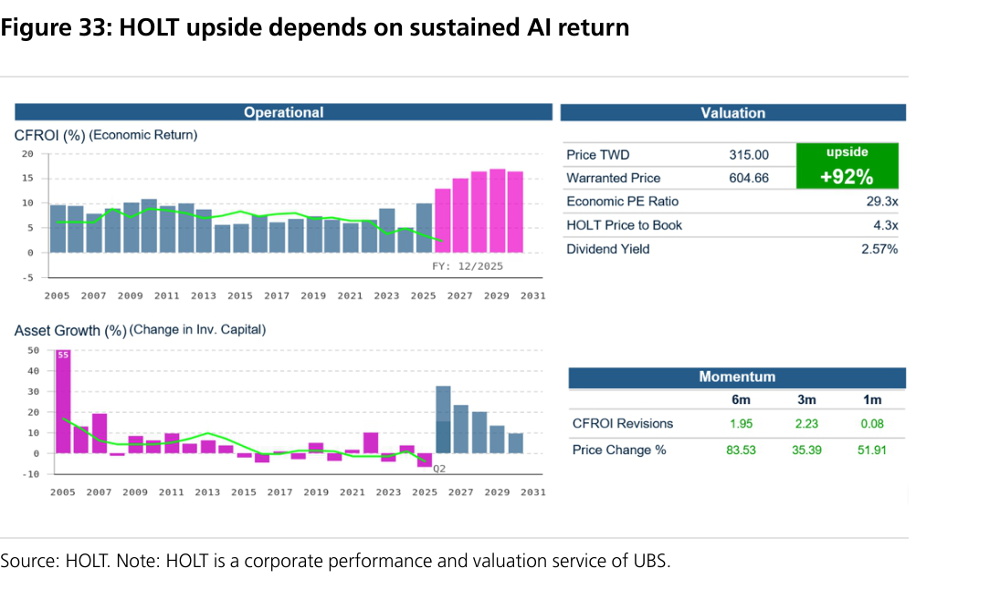

### 解讀摘要
HOLT 估值呈現兩點重要訊號：一是 CFROI（經濟報酬率）預估將從 2025 的 ~7% 躍升至 2026-31 的 14-17%，代表 AI 資本投入的 ROI 有顯著改善；二是 Warranted Price NT\$604.66（vs 現價 NT\$315，HOLT 使用報告日價格），HOLT 上行空間達 +92%，大於 UBS 目標價 NT\$400 隱含的 44%，顯示若 AI CFROI 能持續，估值倍數還有更大的重評空間。

---

## Fig. 35｜UBS 三情境：Base NT\$400、Upside NT\$540、Downside NT\$270

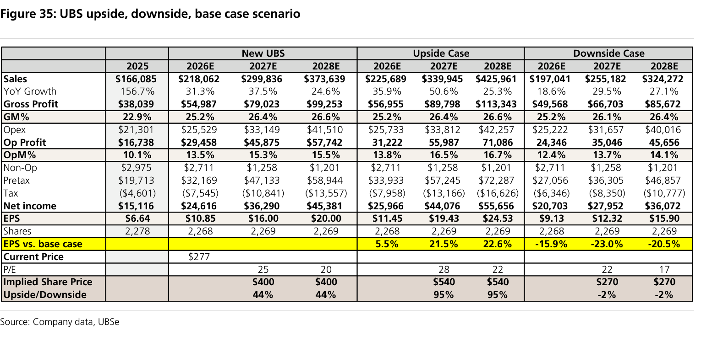

### 解讀摘要
三情境框架確立了明確的風險/報酬非對稱結構：上行 NT\$540（+95%）vs 下行 NT\$270（-2%）。EPS 敏感度在 2027E 最大（上行 +21.5% vs 下行 -23%），這與光寶 2027E 是 AI Power Rack 真正放量之年（Fig 12 路線圖）吻合——若 2027 Power Rack 量產延遲，下行情境將成真；若如期放量甚至超出預期，上行情境才有機會實現。

### 表格

| 指標 | 2025A | 2026E（Base） | 2027E（Base） | 2028E（Base） | Upside TP | Downside TP |
|---|---|---|---|---|---|---|
| Sales（NT\$mn） | \$166,085 | \$218,062 | \$299,836 | \$373,639 | \$339,945（27E） | \$255,182（27E） |
| GM% | 22.9% | 25.2% | 26.4% | 26.6% | 26.4%（27E） | 26.1%（27E） |
| OpM% | 10.1% | 13.5% | 15.3% | 15.5% | 16.5%（27E） | 13.7%（27E） |
| EPS（NT\$） | \$6.64 | \$10.85 | \$16.00 | \$20.00 | \$19.43（27E） | \$12.32（27E） |
| **Implied Share Price** | - | - | **\$400** | **\$400** | **\$540** | **\$270** |
| P/E Applied | - | - | 25x | 20x | 28x（27E） | 22x（27E） |

> **洞察一**：下行情境 NT\$270 幾乎等於現價 NT\$277，說明 UBS 的「Buy」評等在下行情境中也不會產生重大虧損，風險/報酬高度不對稱（+95% vs -2%）。但此分析以 9/11 的 NT\$277 為基礎，若股價已進一步上漲，不對稱性將降低。

---

## 相關個股清單

| 類別 | 公司 | Ticker | 評等 | 備註 |
|---|---|---|---|---|
| 主題個股 | 光寶科 | 2301.TW | Buy（UBS 啟動） | 目標 NT\$400，AI Power 主力 |
| 主要競爭對手 | 台達電 | 2308.TW | 未評級（本報告） | AI 電源龍頭，~50% M/S |
| 全球同業 | Vertiv | VRT | 未評級（本報告） | 美國 AI DC 電源基礎設施 |
| 全球同業 | Eaton | ETN | 未評級（本報告） | 電源分配 + UPS |
| 全球同業 | Schneider Electric | SCHN.PA | 未評級（本報告） | 法國電源/自動化龍頭 |
