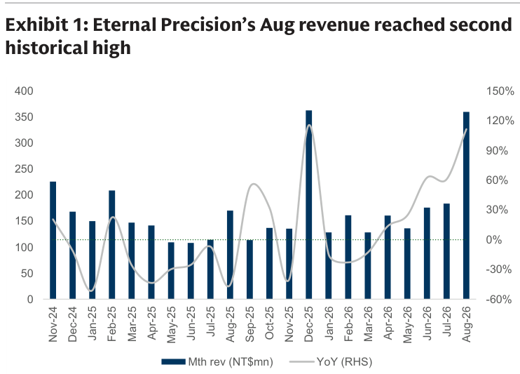
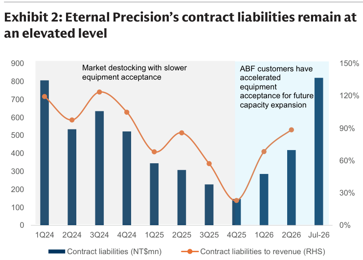
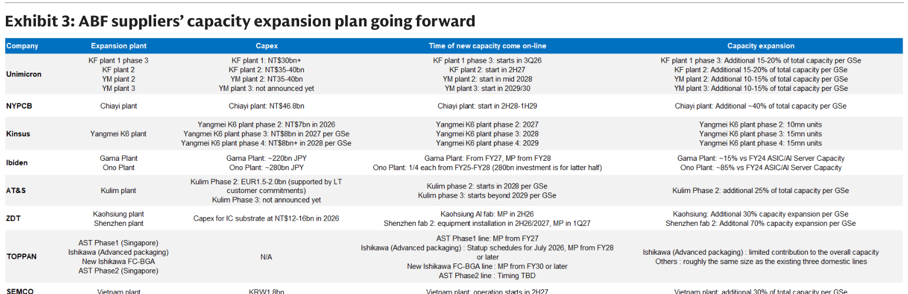

# Goldman Sachs｜Taiwan ABF：永精科技拜訪紀要

**券商**：Goldman Sachs  
**分析師**：Chao Wang、Daiki Takayama、Allen Chang、Al Wang  
**日期**：2026-09-16  
**主題**：Taiwan ABF — 永精科技拜訪：訂單交期延至 2031，客戶搶付溢價鎖定供貨  
**評級**：NYPCB Buy（CL）｜Kinsus Buy｜Unimicron Neutral  
<a href="https://layx.uk/dl?g=產業&b=GS&d=20260916&h=TW-ABF-Eternal-Precision">📎 下載 PDF</a>

---

## 報告總結

Goldman Sachs 拜訪永精科技（7795.TW，未評等）管理層。永精在中高階 ABF 真空壓合機市場占有率約 95%，是本輪 ABF 基板上行週期的關鍵設備瓶頸。核心發現是訂單交期從前期 2028/29 年延至 2031 年，且部分陸系客戶主動提出支付溢價縮短交期——這在 2020-22 週期從未出現，意味需求強度超越上一輪。管理層確認合約負債（領先指標）在 4Q25 低點後快速回升至 NT\$820mn 新高，GS 預計 ABF 基板短缺率將於 2H26/27/28 達 14%/34%/51%，維持 NYPCB（CL Buy，TP NT\$2,500）及 Kinsus（Buy，TP NT\$1,125）評等不變。

---

## Goldman Sachs 完整投資邏輯鏈

| 論點層次 | Exhibit | 內容 |
|---|---|---|
| 瓶頸確認 | Exhibit 1/2 | 永精 8 月營收 NT\$360mn 創次歷史高（YoY +101%）；合約負債從 4Q25 低點回升至 Jul-26 NT\$820mn 新高 |
| 需求結構 | 報告封面 | 訂單交期已延至 2031（較前期 2028/29 再延約 2 年）；主要訂單為 90 噸三段式高階壓合機；陸系廠商首度主動提溢價搶交 |
| 供給上限 | Exhibit 3 | 主要 ABF 基板廠新產能多在 2027-2029 年才到位；中系廠商同時受設備取得與 ABF film 供應雙重限制 |
| 受益排序 | 報告封面 | NYPCB（BT + non-LTA ABF 70%+ 曝險，OPM 從 1H25 breakeven 升至 2026/27E 27%/41%）＞ Kinsus（BT + non-LTA ABF 曝險 ~66%）＞ Unimicron（70%+ LTA，定價靈活性受限） |
| **結論** | 報告封面 | **設備端渠道確認本輪 ABF 上行週期強度超越 2020-22；NYPCB/Kinsus 2026-28E EPS CAGR 各 122%/106%；維持兩者 Buy** |

> **報告最大邏輯缺口**：陸系 ABF 廠受限的判斷來自永精管理層（有客戶分配優先順序的自身利益），且 ABF film（Ajinomoto 壟斷）對中系廠的供給限制未量化——若中系廠找到替代 film 來源，全球供需平衡假設需重新評估。

---

## 報告核心觀點

| 主題 | GS 觀點 | 市場共識 | 是否 Contra-Consensus |
|---|---|---|---|
| ABF 壓合機交期 | 已延至 2031（隱含未交訂單 ~1,500 units；2022-25 合計出貨僅 ~600 units） | 市場多預期 2028-29 | ✅ 超出共識 |
| ABF 基板短缺率 2027/28E | 34%/51% | 多數認為 2027 供需趨平衡 | ✅ 超出共識 |
| 中國 ABF 廠威脅 | 受設備 + ABF film 雙重限制，威脅有限 | 部分市場擔憂中國廠加速量產 | ✅ 反向 |
| EMIB-T 基板量產時程 | 1H27 開始出貨（日系廠優先；Unimicron 50% yield 追趕中） | 約同 | — |
| 玻璃芯基板商業化 | 2029 年後（2027/28 量產機率低）；新機台定價高於現有高端機 | 部分看法較樂觀 | ✅ 保守 |

**偏好排序**：NYPCB (CL Buy, TP NT\$2,500) ＞ Kinsus (Buy, TP NT\$1,125) ＞ Unimicron (Neutral, TP NT\$1,220)  
**零件/個股偏好**：BT + non-LTA ABF 雙曝險最佳（NYPCB 70%+、Kinsus 66%），定價靈活度高；Unimicron 因 LTA 佔比高達 70% 而定價受限

---

## Exhibit 1｜永精科技月營收達次歷史高（Nov-24 至 Aug-26）

### 解讀摘要

8 月營收 NT\$360mn 創次歷史高（MoM +91%，YoY +101%），呈現的並非季節性回溫，而是主要 ABF 客戶為 2H26-2027 新產能集中驗收設備的備料效應。更值得關注的是：儘管 8 月出貨入帳 NT\$360mn，合約負債「僅略微下滑」——正常邏輯下交貨應消耗合約負債，但幾乎沒有消耗，代表新訂單入帳速度追上了出貨速度，訂單池仍在擴大而非縮小。2025 上半年低谷（約 NT\$100-150mn/月）是客戶去庫存減速的反映，2H25 起加速回升確認去庫存結束、資本支出週期重新啟動。

> **原文補充**：管理層表示 1H26 與 2H26 出貨比例約 3:7（隱含 2026E 全年 YoY 成長 50%+），且 2H26 出貨以高階設備為主（2025 年高階占比 59%，2H26 更高）。

### 表格

| 時點 | 月營收（NT\$mn）| YoY | MoM |
|---|---|---|---|
| Aug-26 | 360 | +101% | +91% |
| 週期低點（約 May-Jul 25） | ~100-150 | — | — |

> **洞察一**：YoY +101% 的基期正是去年去庫存最深的低谷，容易讓絕對回升幅度看起來更大；但 NT\$360mn 的絕對值（次歷史高）才是真實信號。以目前 264 unit/年產能推算，月均 NT\$360mn 對應年化 NT\$4.3bn，按每台均價推算高階機台佔比已顯著高於 2025 年水準。

---

## Exhibit 2｜永精科技合約負債維持高位（1Q24 至 Jul-26）

### 解讀摘要

合約負債是永精營收的領先指標（客戶下單預付總訂單額 10-30%）。從 1Q24 高峰（~NT\$700mn）→ 4Q25 低點（~NT\$150mn）→ Jul-26 NT\$820mn 超越前高，這條曲線精確對應 ABF 客戶的資本支出週期：2024-25 年去庫存期客戶拖延設備驗收，合約負債持續消耗；2026 年起大廠重啟擴產、集中預付訂金鎖定設備，Jul-26 達歷史新高意味著現在是新週期的早期積累階段，而非晚期。RHS 合約負債/月營收比率也從低谷 ~20% 回升至 ~90%，訂單能見度已完全恢復。

> **原文補充**：管理層說明合約負債是領先指標，預付比例為訂單總值 10-30%；8 月數字雖小降，但已於 9 月恢復並「持續增加，目前約 NT\$800mn」。

### 表格

| 時期 | 合約負債（NT\$mn）| 合約負債/月營收比 | 備注 |
|---|---|---|---|
| 1Q24 | ~700 | ~120% | 前週期高峰 |
| 4Q25 | ~150 | ~20% | 去庫存低點 |
| Jul-26 | ~820 | ~90% | 超越前高、新週期高峰 |

> **洞察一**：Jul-26 NT\$820mn 超越 1Q24 前高 ~NT\$700mn，說明現在鎖定中的未交設備訂單規模大於 2020-22 上一輪。以 10-30% 預付率換算，NT\$820mn 對應已下單的設備訂單總額約 NT\$2.7-8.2bn，印證管理層所稱交期已排至 2031 年的訂單量規模。

> **洞察二（配合 Exhibit 1）**：8 月 NT\$360mn 出貨入帳後合約負債幾乎未降，意味新訂單入帳速度幾乎等於出貨消耗速度——這個動態在供給充足時不會發生（訂單入帳後有空間排新單），正是供給極度緊張的典型特徵。

---

## Exhibit 3｜ABF 基板供應商產能擴張計劃（向前展望）

### 解讀摘要

全球八大 ABF 基板供應商的新產能大量集中在 2027-2029 年才到位，相較於設備訂單已延至 2031 的需求端信號，供給到位時間明顯落後。NYPCB Chiayi 廠 2H28-1H29 才增加 40% 產能，Kinsus Yangmei K6 廠三期在 2027-2029 陸續投產，Ibiden 投資規模最大（Gama + Ono 合計 JPY 500bn 以上，FY27-28 才到位）。台廠擴產積極但完工時程集中於 2027-2029；中系 ZDT 雖計劃最早（2H26），但設備取得是核心瓶頸。此時程圖從供給側直接確認 GS ABF 短缺率預測（2027/2028：34%/51%）有結構性支撐。

> **原文補充**：管理層強調四家主要台灣 ABF 客戶主要訂購 90 噸三段式（最高端）壓合機作為新產能擴充；設備分配優先順序為「規模大、關係長久、且有 ABF film 供應保障的客戶」——陸系廠無論出溢價都在此優先序之後。

### 表格

| 供應商 | 擴廠計劃 | 預計時程 | 產能增幅 |
|---|---|---|---|
| Unimicron | KF p1、KF p2 | 2026-2028 | — |
| Unimicron | YM p2、YM p3 | 2027-2030 | — |
| NYPCB | Chiayi 新廠（NT\$46.8bn） | 2H28-1H29 | +40% |
| Kinsus | Yangmei K6 p2 | 2027 | — |
| Kinsus | Yangmei K6 p3 | 2028 | — |
| Kinsus | Yangmei K6 p4 | 2029 | — |
| Ibiden | Gama 廠（JPY 220bn） | FY27 | — |
| Ibiden | Ono 廠（JPY 280bn） | FY28 | — |
| AT&S | Kulim Phase 2 | 2028 起 | +25% |
| ZDT | Kaohsiung | 2H26 | +30% |
| ZDT | Shenzhen | 2H26 | +70% |
| TOPPAN | AST Phase 1 | FY27 | — |
| TOPPAN | Ishikawa | FY28+ | — |
| TOPPAN | New FC-BGA | FY30+ | — |
| SEMCO | Vietnam | 2H27 | +30% |

> **洞察一**：中系 ZDT 擴產時程最早（2H26），但永精明確指出設備分配優先序最低——即便 ZDT 願意付溢價，仍排在台日韓大廠之後。ZDT 2H26 計劃能否如期實現，取決於是否能從日系設備商（如 NIKKO）或自製路線取得壓合機，這是本報告最大的不確定因子。

> **洞察二（配合 Exhibit 1/2）**：NYPCB 和 Kinsus 是台灣擴產最積極的兩家，且兩者的高階設備已確認排入永精 2H26-2027 出貨清單（管理層稱 2H26 主要出貨給主要大廠的新產能）——這個設備訂單可見度，直接支撐 GS 對 NYPCB 2026-28E EPS CAGR 122%、Kinsus 2026-29E EPS CAGR 106% 的高增長預估。

---

## 相關個股清單

| 類別 | 公司 | Ticker | 評等 | 備註 |
|---|---|---|---|---|
| ABF 設備（未評等） | 永精科技 | 7795.TW | Not Covered | ABF 真空壓合機市佔 ~95%（中高階）；本報告核心拜訪對象 |
| ABF/BT 基板（Buy, CL） | NYPCB | 8046.TW | Buy | TP NT\$2,500（21x 2028E P/E）；BT + non-LTA ABF 70%+ 曝險；2026-28E EPS CAGR 122% |
| ABF/BT 基板（Buy） | Kinsus | 3189.TW | Buy | TP NT\$1,125（16.5x 2028E P/E）；BT + non-LTA ABF ~66% 曝險；2026-29E EPS CAGR ~106% |
| ABF 基板（Neutral） | Unimicron | 3037.TW | Neutral | TP NT\$1,220（17.4x 2028E P/E）；70%+ LTA ABF，定價靈活性受限；AI ABF 僅 10% 營收 |
| ABF film（壟斷） | Ajinomoto | — | Not Covered | ABF film 唯一主要供應商；對中系廠形成設備以外的第二道供給障礙 |
