# MS｜China Advanced Packaging: Favor Capex Beneficiaries & Share Gainers

**券商**：Morgan Stanley  
**分析師**：Daisy Dai（MS Asia）、Charlie Chan、Daniel Yen、Henry Zhao、Ethan Jia、Lucas Wang（MS Taiwan）  
**日期**：2026-09-16  
**主題**：中國先進封裝——看好設備商與份額搶奪者，對 OSAT 整體持謹慎態度  
**評級**：Attractive（Industry View）  
<a href="https://layx.uk/dl?g=產業&b=MS&d=20260916&h=China-Advanced-Packaging">📎 下載 PDF</a>

---

## 報告總結

MS 認為中國先進封裝是 AI 驅動的長期成長主題，但對 OSAT 的獲利捕獲持更審慎觀點：中國 2.5D 產能將從 2025 年 120k 晶圓/年激增至 2027 年 436k，而有效需求受良率、HBM 可及性制約，估計 2027 年利用率僅 ~63%，形成溫和產能過剩。因此報告偏好設備商（產能建設本身即獲利，不依賴填滿率）勝於廣泛 OSAT 曝險；在 OSAT 內部，偏好份額搶奪者 JCET（升評 OW）而非技術領先但估值過高的 SJ Semi（首次覆蓋 EW）。

---

## MS 完整投資邏輯鏈

| 論點層次 | Exhibit | 內容 |
|---|---|---|
| 產業規模確認 | 1 | 中國先進封裝 TAM 2029 年達 Rmb100bn，chiplet 2.5D 佔比以 40% CAGR 成長 |
| 供給超前需求 | 2, 3 | 2027 年供給 436k vs 需求 277k 晶圓，UTR 僅 63%，產能過剩風險顯著 |
| 設備商邏輯 | 5, 18 | OSAT capex 激增（2026e +67% YoY），設備商獲利不依賴利用率高低 |
| JCET 份額搶奪 | 4, 27-31 | 2.5D 市佔從 5% 升至 12%（2027e），Compute/Automotive 組合改善，GM 差距縮小 |
| SJ Semi 風險 | 40, 44 | 市佔從 78% 降至 34%（2027e），Huawei 客戶集中 74%，估值 147x 2027E P/E 已充分反映 |
| **結論** | 報告封面 | **設備商優於 OSAT；JCET OW（PT Rmb90.2，+35%）；SJ Semi EW（PT Rmb118.4，-7%）** |

> **報告最大邏輯缺口**：MS 的需求估算（277k wafers in 2027）隱含 AI GPU 出貨量 4.9mn 假設，若 Huawei/Hygon 出貨加速，需求端的低估可能使其產能過剩論點偏差。

---

## 報告核心觀點

| 主題 | MS 觀點 | 市場共識 | 是否 Contra-Consensus |
|---|---|---|---|
| 供需平衡 | 2027 年 UTR 僅 63%，溫和產能過剩 | 需求成長超越供給，利用率健康 | ✅ Contra |
| 最大受益者 | 設備商（capex 建設即獲利） | OSAT（AI 封裝需求直接受益） | ✅ Contra |
| SJ Semi 估值 | 147x 2027E P/E 已 price in 技術領先，EW | 100% 街頭 Buy/OW | ✅ Contra |
| JCET | 份額搶奪者，OW | 多為 Hold/Neutral | ✅ Contra |
| 3DIC/HBM/CPO 近期貢獻 | 2027 前貢獻有限，主要是期權價值 | 市場對 3DIC 快速商業化期望偏高 | ✅ Contra |

**偏好排序**：ACM Research ＞ ASMPT ＞ JCET ＞ ASE ＞ SJ Semi  
**個股推薦**：JCET（OW，Rmb90.2）；SJ Semi（EW 首覆，Rmb118.4）；ACM Research（OW，\$130）；ASMPT（OW，HK\$248）

---

## Exhibit 1｜中國先進封裝 TAM（2029e Rmb100bn）

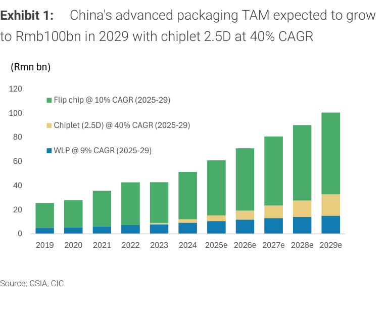

### 解讀摘要
Chiplet（2.5D）以 40% CAGR 領跑，但從 2025 年 Rmb~4bn 成長至 2029 年 Rmb17.7bn，絕對規模仍僅佔 TAM 的 ~18%；整體 TAM 仍以傳統 Flip Chip（10% CAGR）為主體。這意味著 2.5D 題材的成長率吸睛，但多數 OSAT 的收入基礎仍在傳統封裝，短期 mix 帶動的 blended ASP 提升空間有限。

> **洞察一**：Chiplet 2.5D 在 2025-29 年間從 ~4% 增至 ~18% 的 TAM 佔比，意味著傳統封裝仍是分母——OSAT 整體毛利率的改善幅度將受到 mix 稀釋制約。

---

## Exhibit 2｜中國 2.5D 封裝供給容量（2027e 436k 晶圓）

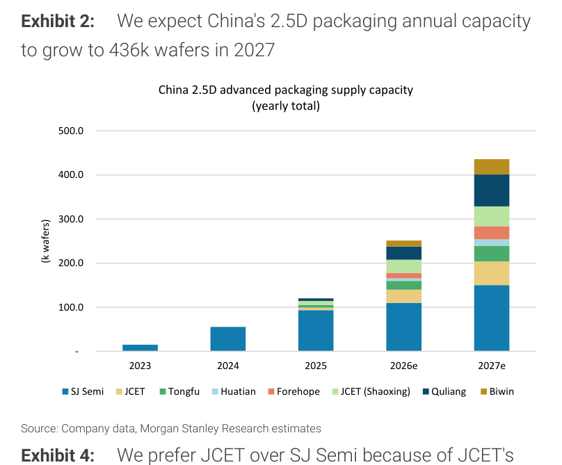

### 解讀摘要
SJ Semi 目前主導（2025 年 ~100k wafers），但 JCET + 周邊新進者（Quliang 超越 SJ Semi 成為第二大）構成大量增量：2025→2027 年間供給翻近 4 倍。2027 年 SJ Semi 仍為最大單一供應商，但其份額從 ~83% 降至 ~33%，競爭格局根本性改變。

| 廠商 | 2025e (k wafers) | 2027e (k wafers) |
|---|---|---|
| SJ Semi | ~100 | ~145 |
| JCET | ~10 | ~75 (估) |
| Quliang | <5 | ~75 (估) |
| 其餘（Tongfu, Huatian, Forehope, JCET Shaoxing, Biwin） | ~10 | ~141 |
| **合計** | **~120** | **~436** |

---

## Exhibit 3｜溫和產能過剩（UTR 2024-2027e）

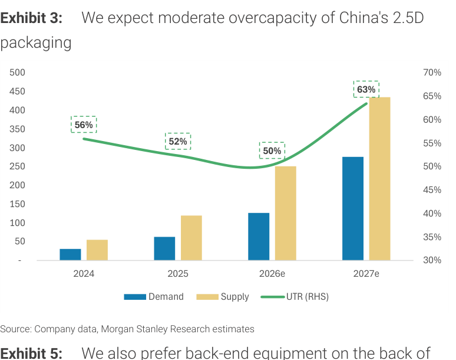

### 解讀摘要
2024 年 UTR 56% → 2025 年 52% → 2026e 50% → 2027e 63%。2027 年 UTR 反彈至 63% 是因為 AI GPU 出貨量激增（MS 估 4.9mn units），但仍僅 63% 意味著約 1/3 產能閒置，這在傳統封裝業標準（通常 >80% 方能維持毛利率）看來明顯偏低。

| 年份 | 供給（k wafers） | 需求（k wafers） | UTR |
|---|---|---|---|
| 2024 | ~55 | ~31 | 56% |
| 2025 | ~120 | ~62 | 52% |
| 2026e | ~250 | ~126 | 50% |
| 2027e | ~436 | ~277 | 63% |

> **洞察一**：UTR 2026e 最低點 50% 是最危險時窗——此時 JCET/SJ Semi 的 Rmb7-10bn capex 仍在建設中，若此時 GPU 出貨不及預期，現金流壓力極大。

---

## Exhibit 4｜市佔結構重組（SJ Semi 78%→34%，JCET 5%→12%）

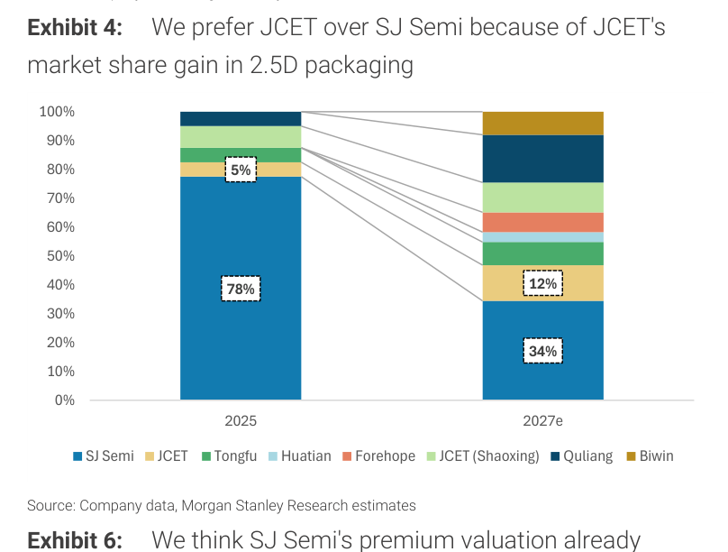

### 解讀摘要
這是報告最核心的論點圖：SJ Semi 的主導地位不是被 JCET 搶走，而是被整個生態系稀釋——JCET 市佔從 5% 升至 12%，但 Quliang 等新進者共同瓜分了更大份額。MS 偏好 JCET 的邏輯是「相對份額搶奪」而非「SJ Semi 失守」。

> **洞察一**：2027e JCET 12% 市佔對應 ~52k wafers（436k × 12%），以 MS 估算的 JME 容量 ~5kwpm = ~60k/年 年化，利用率隱含 ~87%，優於行業平均 63%——這是份額搶奪者論點的核心所在。

---

## Exhibit 5｜OSAT capex 季度趨勢（capex/revenue 創歷史新高）

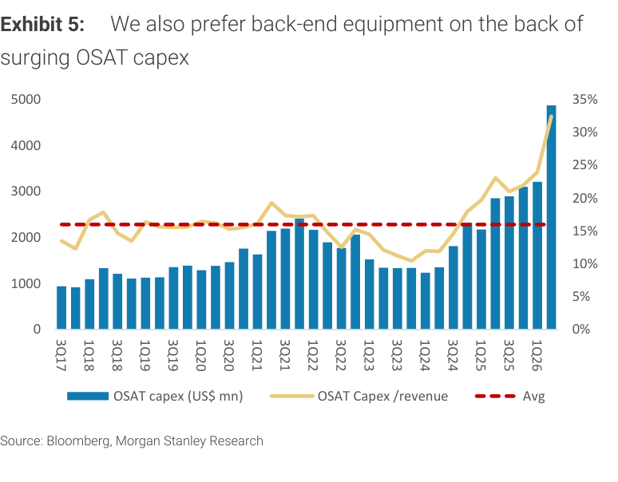

### 解讀摘要
全球 OSAT capex（季度）在 2025-2026 Q1 急升至 US\$3-5bn/季，capex/revenue 比率衝破 30%，遠超歷史均值 ~15%。這正是設備商投資邏輯的直接佐證：無論 OSAT 最終利用率如何，建設過程已確保設備訂單。

> **洞察一**：capex/revenue 超過均值一倍，代表 OSAT 目前的投資強度前所未有。ACM Research 和 ASMPT 的訂單能見度因此高度確定。

---

## Exhibit 8｜中美 AI 晶片供應鏈對照

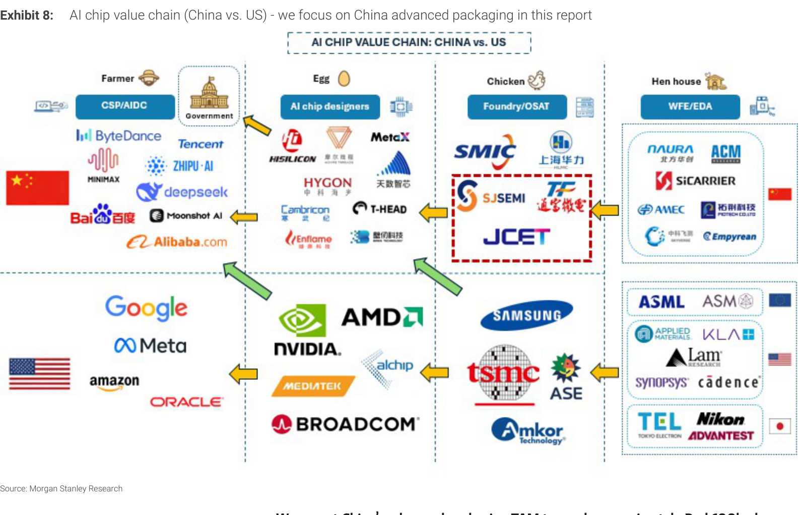

### 解讀摘要
此圖清楚說明本報告聚焦的位置：中國供應鏈中，Foundry/OSAT（SJ Semi、JCET、Tongfu）及設備商（ACM Research、NAURA 等）是 AI 晶片生態的關鍵節點。相比美國供應鏈，中國在 WFE/EDA 層仍大量依賴境外（ASML、Applied Materials、AMAT 均不在「雞舍」清單），封裝成為突破前端限制的戰略出口。

---

## Exhibit 13｜中國 2.5D 產能佔全球比例（2027e 16%）

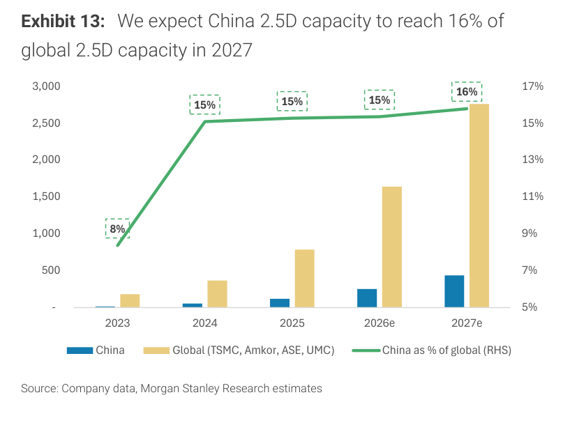

### 解讀摘要
中國 2.5D 產能從 2023 年 8% 全球佔比上升至 2027e 16%，絕對量從 ~20k 升至 ~436k（vs 全球 ~2.7mn wafers）。16% 看似不高，但考量這幾乎全是 AI GPU 特化用途，且集中於少數幾家廠，議價籌碼大於市佔率隱示的水平。

---

## Exhibit 14｜中國 AI GPU 出貨量（2027e ~5mn）

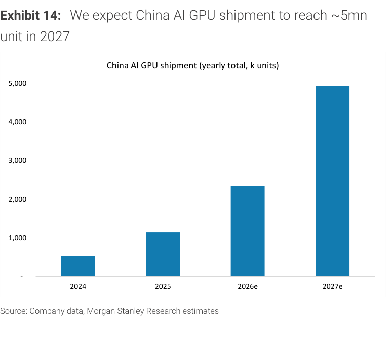

### 解讀摘要
MS 估計中國 AI GPU 出貨量：2024 ~500k → 2025 ~1.1mn → 2026e ~2.3mn → 2027e ~4.9mn。這是整個報告需求模型的基礎假設。21 chips/wafer × 85% yield → 277k wafer demand in 2027（配合 Exhibit 15）。

| 年份 | AI GPU 出貨（k units） | YoY |
|---|---|---|
| 2024 | ~500 | — |
| 2025 | ~1,100 | +120% |
| 2026e | ~2,300 | +109% |
| 2027e | ~4,900 | +113% |

> **值得驗證**：MS 假設良率 85% 且每 wafer 21 個晶片。若良率僅 70%（中國先進製程常見），需求將降至 ~229k，UTR 僅 52%；若良率達 90%，需求升至 ~294k，UTR ~67%。這個假設的高低對 UTR 估算有 ±5-15ppt 的影響。

---

## Exhibit 15｜中國 2.5D 封裝晶圓需求（2027e 277k）

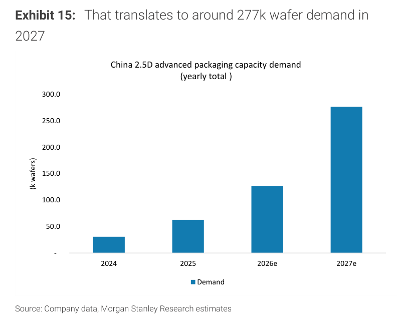

### 解讀摘要
從 GPU 出貨量換算 wafer demand：2024 ~30k → 2025 ~62k → 2026e ~126k → 2027e ~277k。供需差（Exhibit 3）的 demand 曲線即來自此估算。

---

## Exhibit 17｜CoWoS-S vs CoWoS-L 類型容量拆分

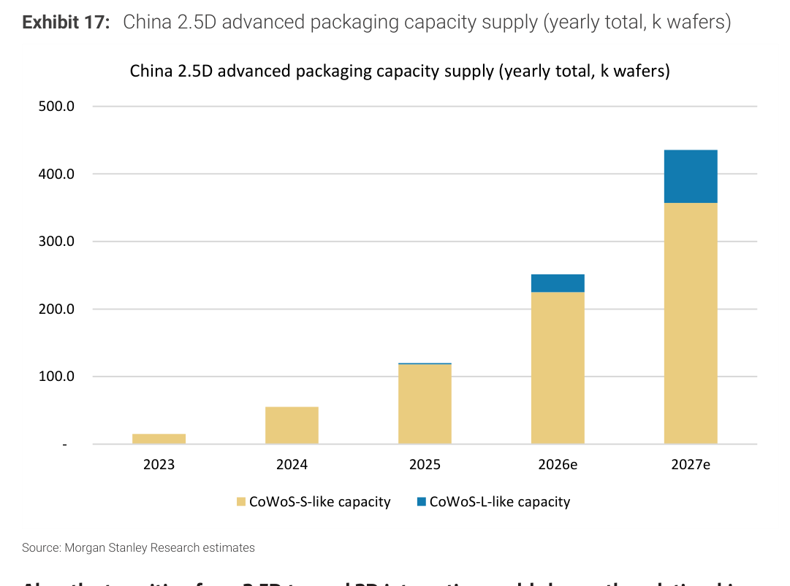

### 解讀摘要
2025-2026 年中國 2.5D 產能以 CoWoS-S-like（矽中介層）為主，CoWoS-L-like（RDL 中介層）2026 年才開始顯著建設，2027 年佔比仍不過 ~20%（Quliang ~75k, JCET Shaoxing 等）。但下一代 AI 加速器已偏向 CoWoS-L，意味著 S-like 過剩更嚴重，L-like 可能仍偏緊。

> **洞察一**：這構成「Aggregate UTR 63%」之下的隱藏分裂——CoWoS-S UTR 可能 <50%，CoWoS-L UTR 可能 >90%，因此廠商技術能否轉換（不完全平滑）是關鍵風險。

---

## Exhibit 18｜OSAT 年度 capex 趨勢（2026e +67% YoY）

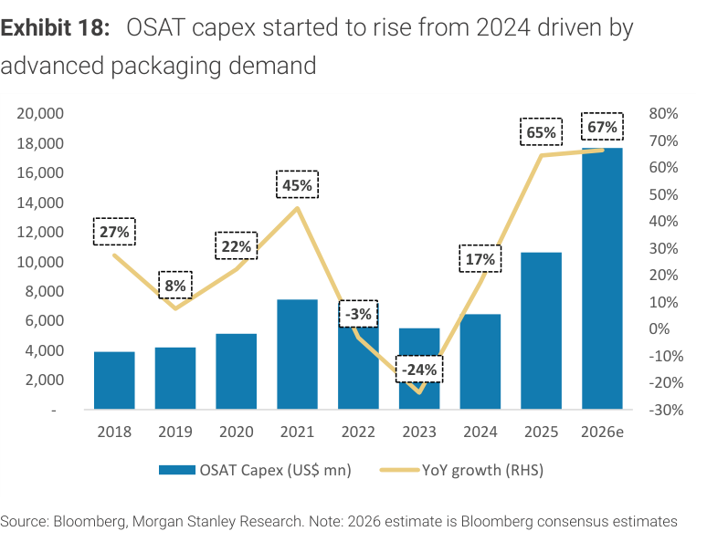

### 解讀摘要
全球 OSAT 年度 capex：2022-2023 年景氣回檔下降，2024 年回升，2025 年 +65% YoY，2026e +67% YoY，達 US\$~18bn。這一輪 capex 週期由先進封裝需求驅動，強度遠超過去任何一輪。設備商訂單能見度因此高度確定。

---

## Exhibit 20｜中國先進封裝製程與關鍵廠商全景圖

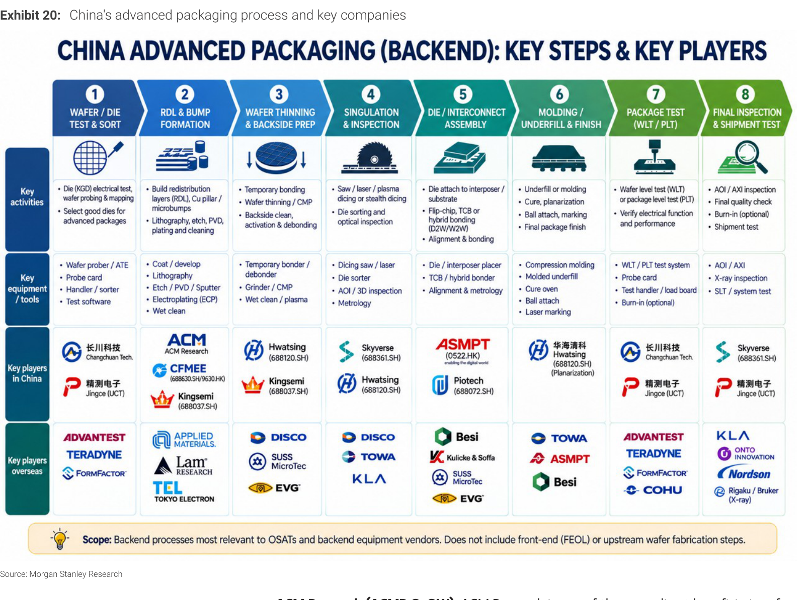

### 解讀摘要
8 個製程步驟（WDT & Sort → RDL & Bump → 薄化 → 切割 → 組裝 → 模封 → 封裝測試 → 最終測試）的設備與廠商全景。中國設備廠（長川、Kingsemi、Hwatsing、ACM Research、CFMEE）已覆蓋多個步驟，但 Die/Interconnect Assembly 中的 TCB/Hybrid Bonding 仍以 ASMPT 主導（中國廠商尚未完全替代）。

> **原文補充**：ACM Research 在 RDL & Bump 的 ECP 製程已交貨第 2,000 個腔體；Panel-level ECP（510×515mm 水平系統）已獲首個中國大陸客戶量產訂單，移步更近量產。

---

## Exhibit 21｜華為 LogicFolding（W2W 混合鍵合）

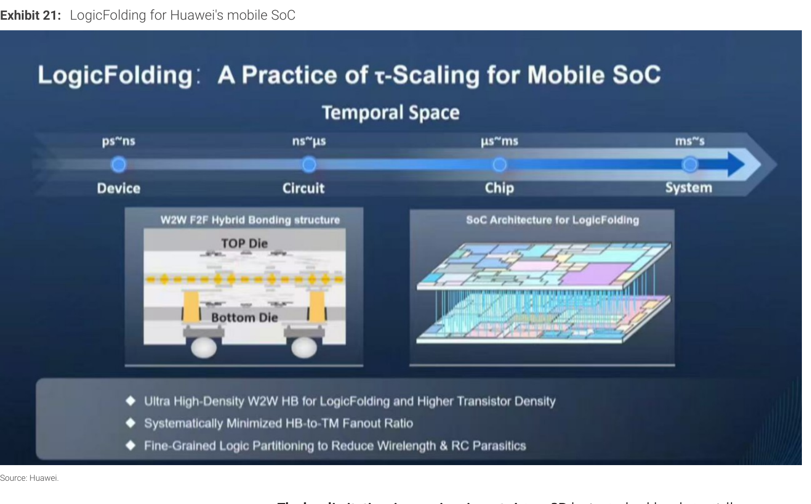

### 解讀摘要
華為提出 LogicFolding 作為 τ-Scaling 技術路徑：透過 W2W Face-to-Face 混合鍵合，將 Top Die 疊置於 Bottom Die，實現晶片層級的 Die 面積縮減而不依賴製程節點進步。三大特點：超高密度 W2W HB、最小化 Fanout 比、細粒度邏輯切割減少 RC 寄生效應。這是中國在前端受限情況下的最重要技術繞路——若 LogicFolding 規模化，對 SJ Semi 的 3DIC TSV 業務構成新需求，但也對其現有 CoWoS-S 業務形成部分替代。

---

## Exhibit 22｜TSMC SoIC 產能（2028e 70 kwpm）

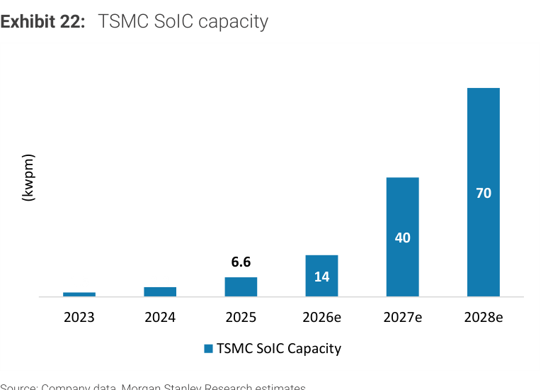

### 解讀摘要
TSMC SoIC 產能：2025 ~6.6kwpm → 2026e ~14kwpm → 2027e ~40kwpm → 2028e ~70kwpm。快速擴張反映 Apple/NVIDIA/AMD 的 3DIC 需求急增。對中國而言，這一能力被視為政策限制不允許使用的標竿，推動 SJ Semi 等廠商自研對等能力。

---

## Exhibit 23｜TSMC SoIC 需求客戶拆分

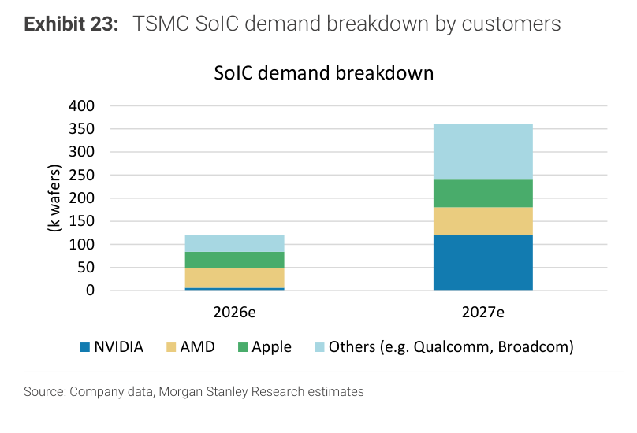

### 解讀摘要
2027e TSMC SoIC 需求 ~360k wafers：NVIDIA 最大（~31%）、AMD 次之（~15%）、Apple（~19%）、Others Qualcomm/Broadcom（~35%）。中國廠商完全無法使用 TSMC SoIC，因此需要自建對等能力——這正是 MS 看好中國 3DIC 長期發展的背景，但近期仍以 2.5D CoWoS-like 為主。

---

## Exhibit 24｜長鑫存儲（CXMT）HBM 產能擴張

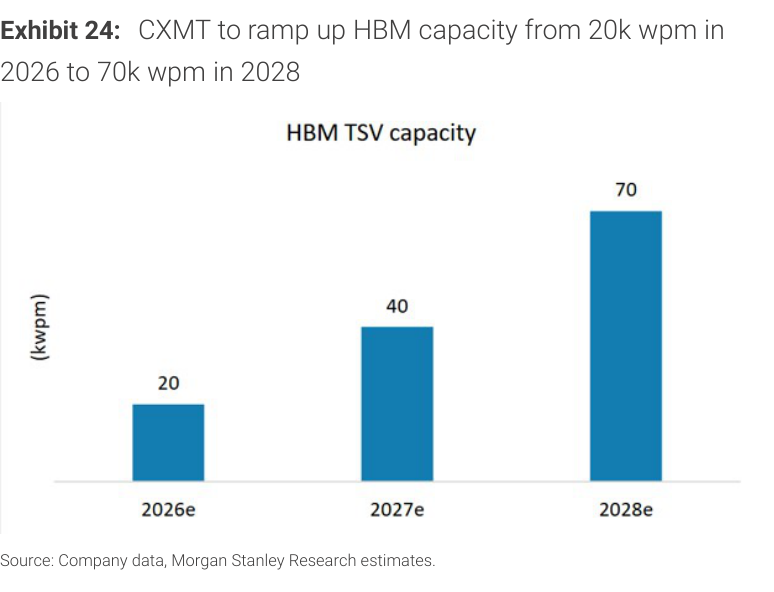

### 解讀摘要
CXMT HBM TSV 產能：2026e 20kwpm → 2027e 40kwpm → 2028e 70kwpm。HBM 可支援的 GPU 數量：3-4mn HBM units 僅能支持 0.75-1mn GPU（假設每 GPU 4 個 HBM），意味著 2027 年 4.9mn GPU 中，大部分仍依賴海外 HBM（SK Hynix 主導）。HBM 可及性是有效封裝需求的另一約束。

---

## Exhibit 25｜HBM 市場份額（CXMT 2026e/2027e 3.8%/4.4%）

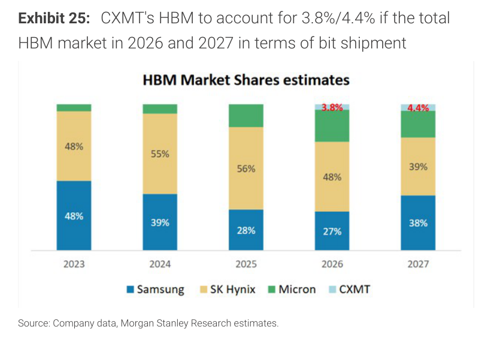

### 解讀摘要
HBM 市場目前由 SK Hynix（~48%）和 Samsung（~27-38%）、Micron（~16-22%）主導。CXMT 預計 2026-2027 年達 3.8-4.4%，與主要廠商差距仍懸殊。在 AI GPU 出貨 4.9mn 的假設下，CXMT 可支援的份額僅 ~15-20%，其餘仍需境外供應。

| 廠商 | 2025 | 2026e | 2027e |
|---|---|---|---|
| Samsung | 28% | 27% | 38% |
| SK Hynix | 56% | 48% | 39% |
| Micron | 16% | 21% | 18% |
| CXMT | 0% | 3.8% | 4.4% |

---

## Exhibit 26｜JME（江陰長電）收入與淨利潤趨勢

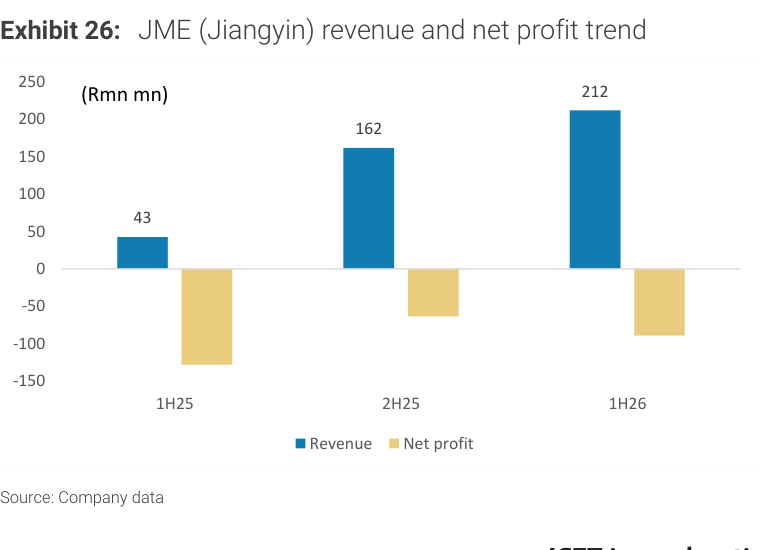

### 解讀摘要
JCET 旗下 JME（Jiangyin Microelectronics，高端先進封裝子公司）收入：1H25 Rmb43mn → 2H25 Rmb162mn → 1H26 Rmb212mn，快速放量；但淨利持續虧損（1H25 -Rmb115mn、1H26 -Rmb89mn），虧損持續收窄。管理層預期 2027 年轉盈，目前為「燒錢建市佔」階段。

> **洞察一**：虧損收窄速度（從 -115mn 到 -89mn）顯示 JME 的單位成本隨稼動率改善正在壓縮，若 2027 年達 5kwpm 並維持 >85% 稼動，ROI 轉正有合理基礎。

---

## Exhibit 27｜JCET 2.5D 封裝產能與收入預測

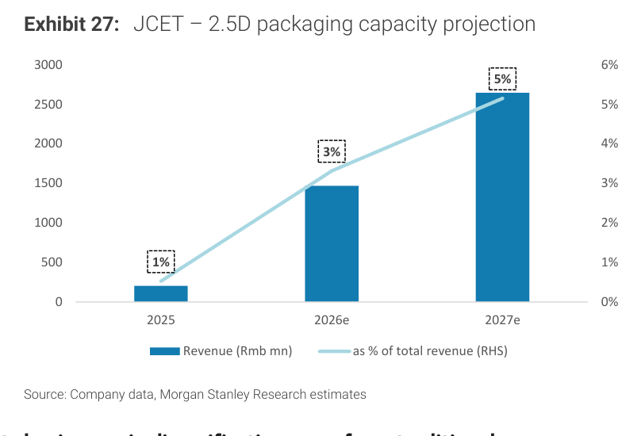

### 解讀摘要
JCET 的 2.5D 收入：2025 Rmb~200mn（1% 總收入）→ 2026e Rmb~1.5bn（3%）→ 2027e Rmb~2.7bn（5%）。從佔比看仍只是公司一小部分，但以 CAGR 看接近 7 倍（2025-2027），正是 MS 升評 OW 的核心增量敘事。

---

## Exhibit 28｜JCET 終端市場組合（Computing & Automotive 持續上升）

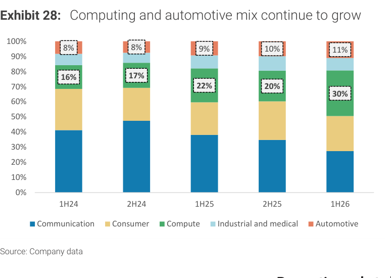

### 解讀摘要
JCET 業務組合：Computing 佔比 1H24 16% → 1H26 30%（YoY +40.4%），首次成為最大終端市場；Automotive 佔比 1H24 8% → 1H26 11%（YoY +25%）。Communication（傳統電訊）佔比從 40% 降至 27%。Mix 升級的同時 GM 也在改善——這是份額品質而非低價搶量的重要佐證。

---

## Exhibit 29｜JCET 年度 capex（2026e Rmb10bn+）

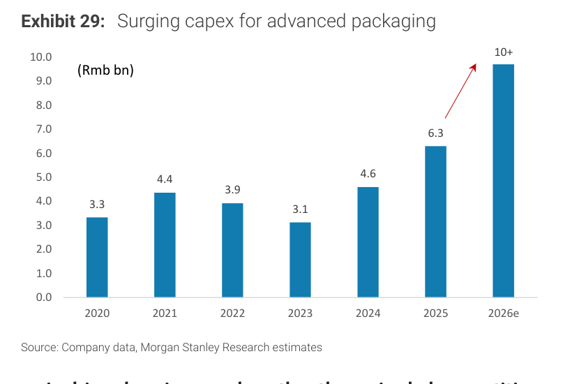

### 解讀摘要
JCET capex：2020-2024 年 Rmb3-5bn 區間，2025 年跳升至 Rmb6.3bn，2026e 超過 Rmb10bn。Rmb7.8bn 的上海臨港新廠（Shanghai Lingang）是主要驅動。此 capex 水平佔 2026e 收入（~Rmb44bn）約 23%，為歷史最高，對設備商（ACM Research、ASMPT）的直接採購訂單貢獻清晰可見。

---

## Exhibit 30｜2025 年中國市場銷售成長（JCET 最高）

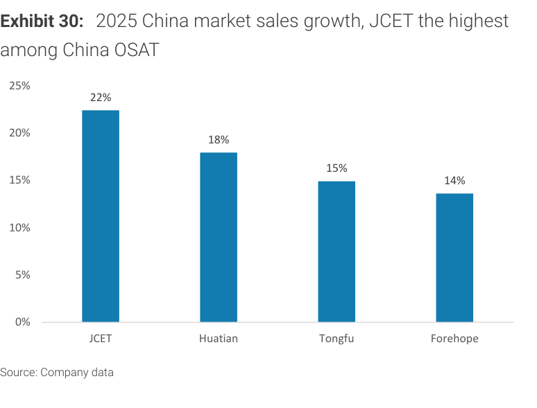

### 解讀摘要
2025 年中國市場銷售 YoY：JCET 22% > Huatian 18% > Tongfu 15% > Forehope 14%。JCET 在同業中增速最快，且伴隨毛利率改善（見 Exhibit 31），非低價搶量。

---

## Exhibit 31｜JCET 國內市場毛利率 vs 同業

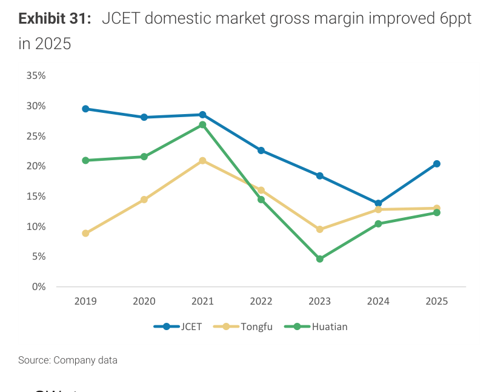

### 解讀摘要
JCET 國內 GM 從 2024 年 ~14% 快速回升至 2025 年 ~20.5%（+6.5ppt），而 Tongfu（~13%）和 Huatian（~12.5%）僅小幅改善。JCET 是唯一在收入加速同時毛利率也顯著改善的中國 OSAT，是 Mix 升級而非規模效應的表現。

---

## Exhibit 39｜SJ Semi 收入預測（25% CAGR 2025-28）

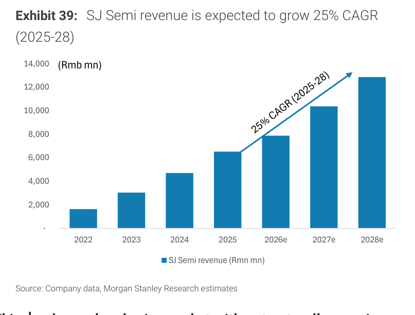

### 解讀摘要
SJ Semi 收入：2022 ~Rmb1.7bn → 2025 ~Rmb6.6bn → 2026e ~Rmb7.9bn → 2027e ~Rmb10.4bn → 2028e ~Rmb12.8bn，25% CAGR。但對應的估值（2027E P/E 146x）遠超 JCET（32x），MS 認為成長率已充分定價。

---

## Exhibit 40｜SJ Semi 中國 2.5D 市場主導地位（2025 年 77%）

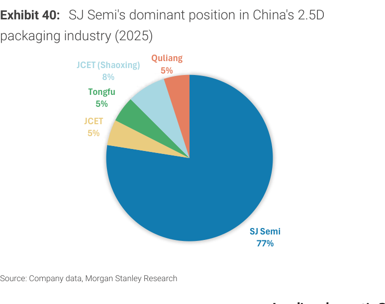

### 解讀摘要
2025 年 SJ Semi 以 77% 市場份額主導中國 2.5D，JCET 僅 5%，其餘零散分佈。這份主導是技術先發優勢的結果，但 Exhibit 4 顯示 2027e 市佔將降至 34%——競爭加速稀釋，不是 SJ Semi 技術失守，而是新進者產能追上。

---

## Exhibit 41｜SJ Semi 毛利率溢價（~30% vs 同業 ~15%）

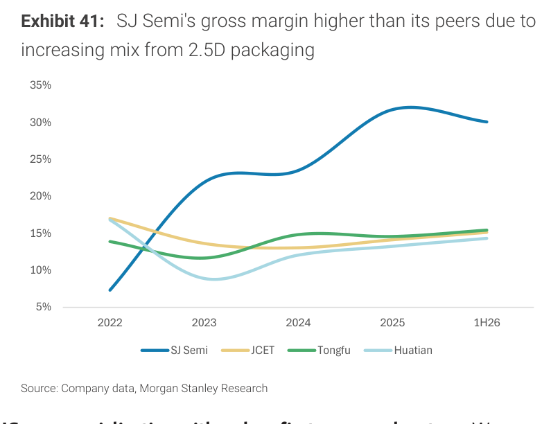

### 解讀摘要
SJ Semi GM 從 2022 年 ~8% 快速升至 2025 年 ~32%，遠高於 JCET（~15%）、Tongfu（~15%）和 Huatian（~15%）。這反映其 2.5D 技術溢價，但 1H26 已從高峰回落至 30%——競爭加劇及新技術投入開始侵蝕利潤。

> **洞察一**：SJ Semi GM 從 32% 回落至 30% 僅僅才開始，若 2027 年市佔從 78% 降至 34%，議價能力下滑加上利用率下降，GM 收窄的空間可能比目前定價更大。

---

## Exhibit 42｜3DIC 商業化追蹤（中國主要廠商進度）

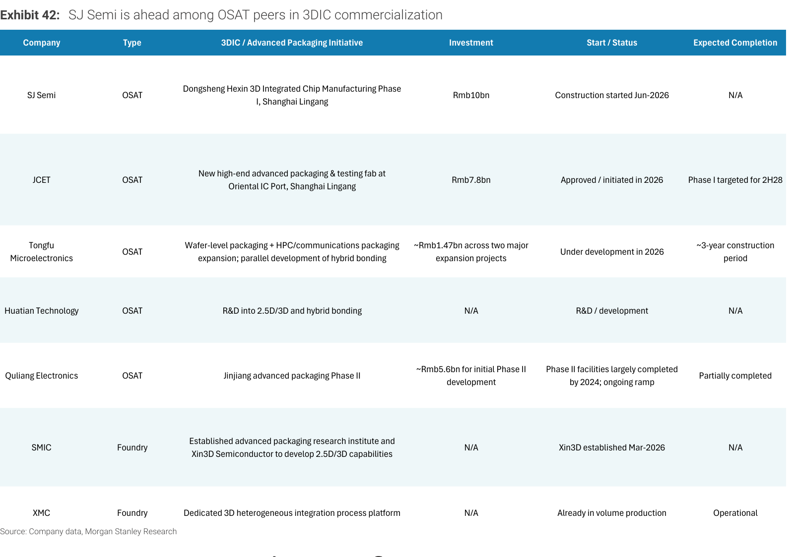

### 解讀摘要

| 廠商 | 類型 | 主要計畫 | 投資額 | 狀態 | 預計完成 |
|---|---|---|---|---|---|
| SJ Semi | OSAT | 上海臨港董晟合芯 3D IC Phase I | Rmb10bn | 2026 年 6 月動工 | N/A |
| JCET | OSAT | 上海臨港高端先進封測廠（Phase I） | Rmb7.8bn | 2026 年批准啟動 | Phase I 目標 2H28 |
| Tongfu Micro | OSAT | WLP + HPC 封裝擴產 + Hybrid Bonding | ~Rmb1.47bn | 2026 年進行中 | ~3 年建設期 |
| Huatian Tech | OSAT | 2.5D/3D + Hybrid Bonding R&D | N/A | R&D 階段 | N/A |
| Quliang Electronics | OSAT | 金江先進封裝 Phase II | ~Rmb5.6bn | Phase II 設施大致完成（by 2024） | 部分完成 |
| SMIC | Foundry | 建立先進封裝研究所 + Xin3D | N/A | 2026 年 3 月 Xin3D 成立 | N/A |
| XMC | Foundry | 3D 異質整合專屬平台 | N/A | 已量產 | 運營中 |

> **洞察一**：SJ Semi 和 JCET 合計投入 Rmb17.8bn 於 3DIC，但兩者 Phase I 均在 2026 年才啟動，最快 2028 年商業化，支持 MS「3DIC 近期貢獻有限」的論點。

---

## Exhibit 44｜SJ Semi 客戶集中度（Huawei 74%，1H25）

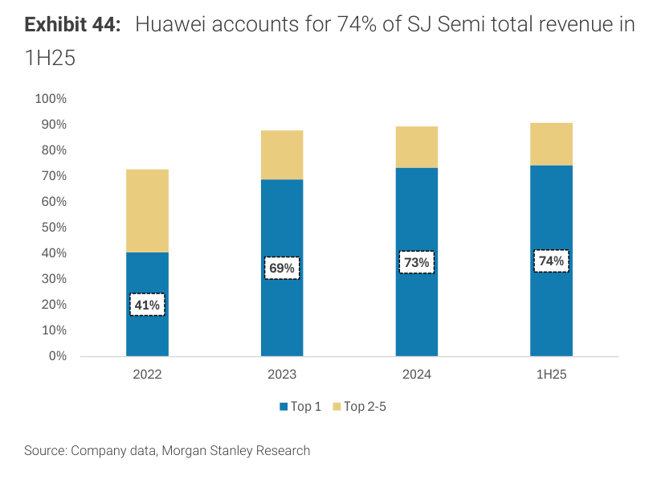

### 解讀摘要
SJ Semi Top 1 客戶（Huawei）佔比從 2022 年 41% 快速攀升至 2023 年 69%、2024 年 73%、1H25 74%。客戶高度集中是核心風險：Huawei 若自建封裝能力或分散供應商，將對 SJ Semi 產生不成比例的衝擊。MS 把這列為 EW 評等的重要下行因素之一。

---

## Exhibit 55｜SJ Semi 全球 OSAT 排名第 9（2025 年 2% 市佔）

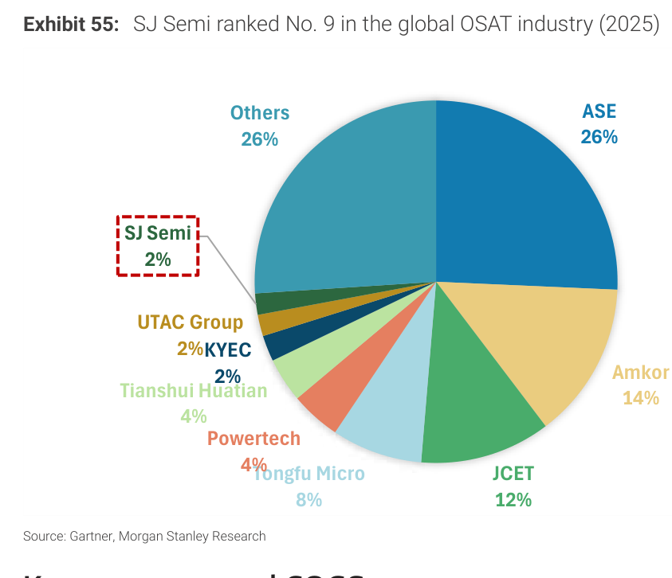

### 解讀摘要
全球 OSAT 市場份額（2025 年）：ASE 26%、Amkor 14%、JCET 12%、SJ Semi 2%（排名第 9）。SJ Semi 雖在中國 2.5D 市場獨霸一方，但在全球 OSAT 版圖中仍屬小廠，與其 147x 的本益比形成鮮明對比。

> **洞察一**：JCET 全球市佔 12%（第 3 大）vs SJ Semi 2%——但 A 股的相對估值卻是 JCET 32x、SJ Semi 147x。估值差距如此之大，主要反映 SJ Semi 的 AI 2.5D 純度，但也代表更大的基本面兌現壓力。

---

## Exhibit 57｜SJ Semi COGS 結構（製造成本 50%，原料 34%）

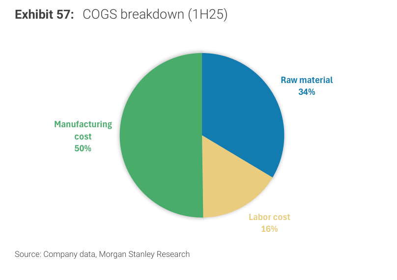

### 解讀摘要
SJ Semi 1H25 COGS：製造成本 50%、原料 34%、勞工 16%。製造成本（固定 + 折舊）佔比高意味著利用率對毛利率高度敏感——若市佔從 78% 降至 34%，固定成本稀釋效應將明顯打壓毛利率，遠超目前市場預期。

---

## 跨 Exhibit 彙整表

### 彙整 1｜中國 2.5D 供需對比（Exhibit 2 + 3 + 14 + 15）

| 年份 | AI GPU 出貨（k） | 2.5D 需求（k wafers） | 2.5D 供給（k wafers） | UTR |
|---|---|---|---|---|
| 2024 | ~500 | ~31 | ~55 | 56% |
| 2025 | ~1,100 | ~62 | ~120 | 52% |
| 2026e | ~2,300 | ~126 | ~250 | 50% |
| 2027e | ~4,900 | ~277 | ~436 | 63% |

> 即使 AI GPU 出貨翻倍再翻倍，產能擴張速度仍超越有效需求，2026e 達到最低點 UTR 50%——這正是設備商比 OSAT 更安全的核心邏輯。

### 彙整 2｜JCET vs SJ Semi 關鍵指標對比（Exhibit 4 + 27 + 30 + 31 + 40 + 41 + 55）

| 指標 | JCET | SJ Semi |
|---|---|---|
| 全球 OSAT 市佔 | 12%（#3） | 2%（#9） |
| 中國 2.5D 市佔（2025） | 5% | 77% |
| 中國 2.5D 市佔（2027e） | 12% | 34% |
| 2025 國內 GM | ~20.5% | ~32% |
| capex（2026e） | Rmb10bn+ | Rmb10bn（Dongsheng JV） |
| 主要客戶集中度 | 分散 | Huawei 74% |
| 2027E P/E | 32x | 147x |
| MS 評等 | Overweight（↑） | Equal-weight（首覆） |

---

## 相關個股清單

| 類別 | 公司 | Ticker | 評等 | 備註 |
|---|---|---|---|---|
| 設備（MS 偏好 #1） | ACM Research | ACMR.O | OW | ECP + 先進封裝；PT \$130 |
| 設備（MS 偏好 #2） | ASMPT | 0522.HK | OW | TCB/混合鍵合；PT HK\$248 |
| A 股 OSAT（MS 偏好） | 長電科技 JCET | 600584.SS | OW（↑） | PT Rmb90.2；2.5D 份額搶奪者 |
| 台股 OSAT | ASE 日月光 | 3711.TW | OW | PT NT\$628；全球最大 OSAT |
| A 股 OSAT（首覆 EW） | 盛合晶微 SJ Semi | 688820.SS | EW | PT Rmb118.4（-7%）；估值過高 |
