# MS｜MLCC — Continued Demand Growth for High-Value-added Products for AI & DCs

**券商**：Morgan Stanley  
**分析師**：Shoji Sato（MS MUFG）、Howard Kao（MS Taiwan）、Shawn Kim（MS International）、Sota Harashima（MS MUFG）、Duan Liu（MS Asia）、Cindy Huang（MS International）  
**日期**：2026-09-16（封面標示 Sep 15，系統日期以檔名為準）  
**主題**：MLCC 持續受惠於 AI/DC 高附加價值需求成長  
**評級**：Remain OW Murata、SEMCO、Yageo；Taiyo Yuden 從 UW 升至 EW  
<a href="https://layx.uk/dl?g=產業&b=MS&d=20260916&h=MLCC">📎 下載 PDF</a>

---

## 報告總結

本報告核心論點是：MLCC 處於 AI 伺服器滲透週期的**早期階段**，VR200 NVL72 升級帶來 MLCC 每機架用量跳增 80%（570K vs. GB300 的 320K）、美元含量增 166%（\$12,411 vs. \$4,664），且高電容（47µF+）製品佔比急增，進一步拉高 ASP；MS 因此將 2025-31 年全球 MLCC 出貨值 CAGR 預測從 5.0%（2012-25 歷史值）大幅上調至 20.3%（\$14.67bn→\$44.45bn），AI/DC 部分的 CAGR 更達 57.1%。報告的時機在於 Murata/SEMCO/Yageo/Taiyo Yuden 從高峰大幅回撤 38-59%，MS 認為這是再進場機會；同時對 Taiyo Yuden 評等從 UW 升 EW，Murata 仍為日本電子零件 Top Pick。

---

## MS 完整投資邏輯鏈

| 論點層次 | Exhibit | 內容 |
|---|---|---|
| 週期定位 | 1 | MLCC 仍在 AI 硬體滲透的早期 — 半導體/ABF 之後，MLCC 才剛開始受惠 |
| 需求量級躍升 | 11、12 | VR200 NVL72 每架 MLCC 571K 顆（+80% vs. GB300），美元含量 \$12,411（+166%） |
| 結構性 ASP 上升 | 15、17 | VR200 將高電容（47µF+）佔比從 <20% 推至 30%+；1608-size 100µF 單價比 2012-size 同容量高 5-10× |
| 市場規模大幅上修 | 3、10 | AI/DC MLCC CAGR 57.1%；全球市場 2031 年達 \$44.45bn（CAGR 20.3%） |
| 供給面護城河 | 21、22、23 | 高端 AI MLCC 日韓雙寡頭壟斷（Murata+SEMCO 合計 ~85%），品質門檻阻擋新進者重演 2017-18 |
| 股價錯誤定價 | 4、28 | 四家 MLCC 廠從高峰回撤 38-59%，提供再進場機會 |
| **結論** | 報告封面 | **維持 OW Murata（Top Pick）/SEMCO/Yageo；Taiyo Yuden UW→EW；目標價普遍下修（DCF 無風險利率 2.6%→3.0%）** |

> **報告最大邏輯缺口**：AI/DC MLCC 的 57.1% CAGR 假設高度依賴 GPU 世代升級維持 2-3 年一次的換代節奏；若 Vera Rubin→Feynman 間隔延長，或 hyperscaler capex 因電力/算法效率改善而放慢，缺口將大幅低於預期。

---

## 報告核心觀點

| 主題 | MS 觀點 | 市場共識 | 是否 Contra-Consensus |
|---|---|---|---|
| 全球 MLCC 2031 年市場規模 | \$44.45bn，CAGR 20.3% | 市場普遍更保守 | 是 — 較歷史 5% CAGR 大幅提速 |
| VR200 每架 MLCC 含量 | +166% vs. GB300（\$12,411） | 共識尚未完全消化新模組（BlueField、CX9 Orchid） | 是 |
| 高電容 47µF+ MLCC 份額 | CY27 佔增量 AI MLCC TAM 50-60% | 市場關注整體量，較少切分高低電容 | 是 |
| Murata ASP 上升空間 | 高於公司指引（公司稱 +50% YoY，MS 預期更高） | 市場傾向採信公司指引 | 是 |
| Taiyo Yuden 評等 | EW（升自 UW） | 部分機構仍偏低 | — |
| MLCC 供給護城河 | 品質門檻防止 2017-18 式新進者湧入 | 部分憂慮中國廠商追趕 | 部分 contra |

**偏好排序**：Murata（Top Pick）> SEMCO > Yageo > Taiyo Yuden  
**零件偏好**：小尺寸、高電容（1608-size 100µF、1005-size 47µF、0603-size 10µF）> 傳統低端 MLCC

---

## Exhibit 1｜Sequencing the technology cycle – still early cycle for MLCC

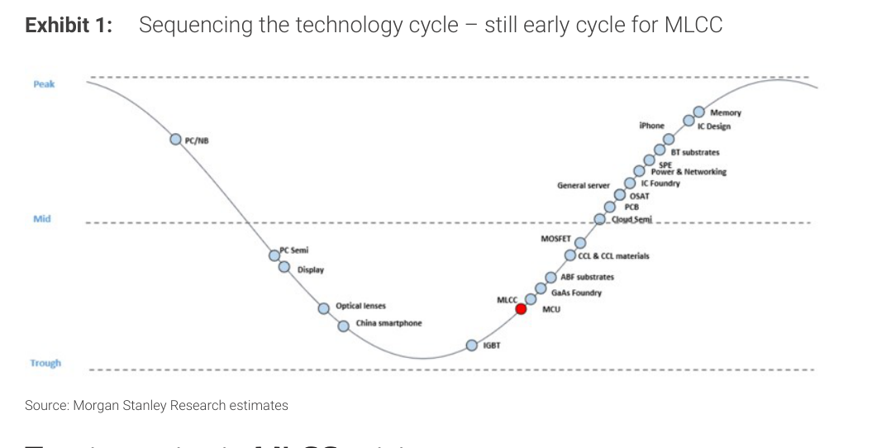

### 解讀摘要
MS 用一張週期定位圖說明 MLCC 相較半導體、ABF 基板等先行受惠者，仍處於 AI 基礎建設投資傳導鏈的早期：GPU→CoWoS→ABF 已先走一輪，MLCC 的需求滲透才剛起步。這個論點的核心是「時序差」——AI capex 不是同步拉動所有零件，而是沿物料清單（BOM）逐層傳導，MLCC 的受惠窗口尚未充分反映在股價上。

---

## Exhibit 2｜AI/DC-use MLCC shipment value forecasts（Old）

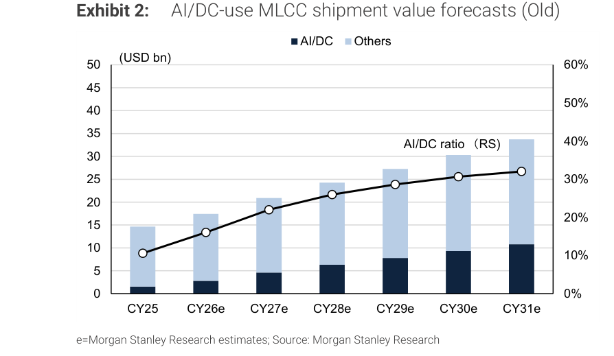

### 解讀摘要
舊預測下，AI/DC 用 MLCC 出貨值 2031 年達約 \$10.80bn，AI/DC 佔比至 CY31 僅約 32%。這是對照基準，下一張（Exhibit 3 新預測）顯示上修幅度。

---

## Exhibit 3｜AI/DC-use MLCC shipment value forecasts（New）

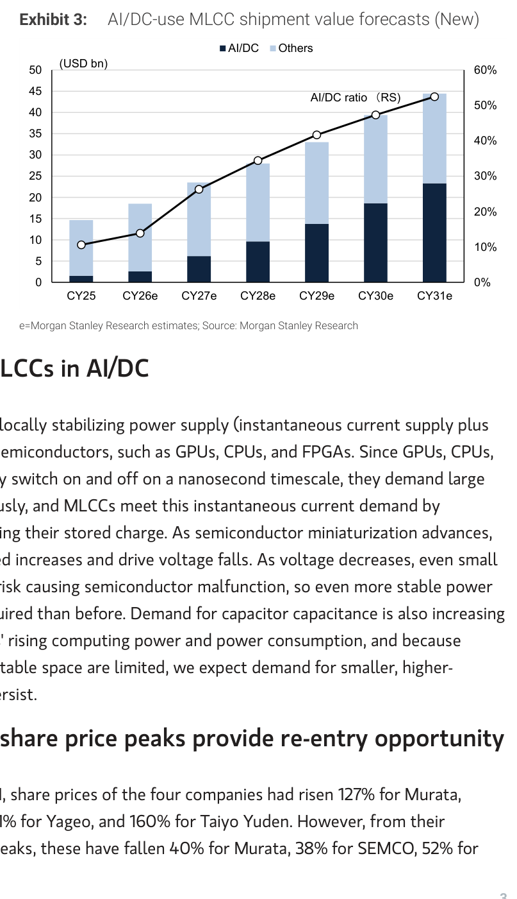

### 解讀摘要
新預測將 AI/DC MLCC 出貨值由 \$10.80bn 大幅上修至 \$23.33bn（2031），CAGR 從 38.1% 提升至 57.1%。驅動因素是 VR200 NVL72 帶來的 MLCC 用量跳升，以及 BlueField/CX9 Orchid 等全新模組的導入。AI/DC 佔比到 CY31 年超過 50%，意味著市場中心正從傳統消費/車用轉移至 AI 基礎建設。

> **洞察一**：舊→新預測的 AI/DC 部分差距達 \$12.53bn（\$23.33-\$10.80bn）——幾乎相當於 2025 年整個全球 MLCC 市場(\$14.67bn)的規模，說明 VR200 升級的影響量級完全是非線性的。

---

## Exhibit 4｜Stock performance comparison for 4 MLCC suppliers

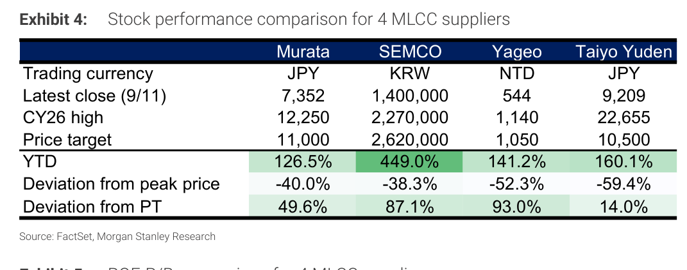

### 解讀摘要
四家 MLCC 廠今年大漲後從高峰暴跌 38-59%，但 MS 目標價普遍高於現價 14-93%，顯示評估折現率上升（日本 DCF 無風險利率 2.6%→3.0%）帶動了目標價下修，但基本面上修無法抵消利率因素。Taiyo Yuden 回撤最劇（-59.4%），而 SEMCO 和 Yageo 仍有最大目標價上行空間（+87-93%）。

### 表格

| 指標 | Murata（6981.T）| SEMCO（009150.KS）| Yageo（2327.TW）| Taiyo Yuden（6976.T）|
|---|---|---|---|---|
| 交易幣別 | JPY | KRW | NTD | JPY |
| 最新收盤（9/11）| ¥7,352 | W1,400,000 | NT\$544 | ¥9,209 |
| CY26 高點 | ¥12,250 | W2,270,000 | NT\$1,140 | ¥22,655 |
| 目標價 | ¥11,000 | W2,620,000 | NT\$1,050 | ¥10,500 |
| YTD 漲幅 | +126.5% | +449.0% | +141.2% | +160.1% |
| 距高點跌幅 | -40.0% | -38.3% | -52.3% | -59.4% |
| 距目標價漲幅 | +49.6% | +87.1% | +93.0% | +14.0% |
| 評等 | OW（Top Pick）| OW（Top Pick KR）| OW | EW |

> **洞察一**：Yageo 目標價 NT\$1,050 vs. 高點 NT\$1,140 意味著 MS 認為股票已超漲過頭、目標價低於前高點，但仍維持 OW——說明此處是「從深度修正估值恢復」的邏輯，而不是「再創新高」。

---

## Exhibit 5｜ROE-P/B comparison for 4 MLCC suppliers

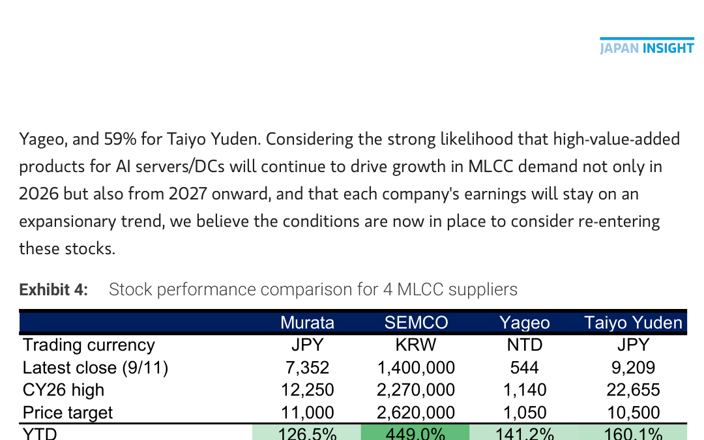

### 解讀摘要
散點圖呈現四家廠商 F26e-F28e 的 ROE 與 P/B 軌跡。SEMCO 的 P/B 最高（F26e 約 9.9×）但 ROE 也最強（預估達 30%+）；Murata 次之（P/B ~4.6×，ROE ~14-18%）；Yageo 相似 Murata；Taiyo Yuden P/B 最低（~2.6-3.5×），ROE 改善空間最受限，解釋了評等相對較低的原因。所有公司的 F27e-F28e 軌跡都向右移動（ROE 提升），驗證 AI MLCC 驅動利潤率上升的預測。

> **洞察一**：SEMCO 的 P/B-ROE 路徑最陡峭——F26e→F27e 的 ROE 大幅提升而 P/B 不同步跳升，意味著若獲利超預期，股票最容易出現估值重估（multiple expansion）。

---

## Exhibit 7｜AI ecosystem capital flows

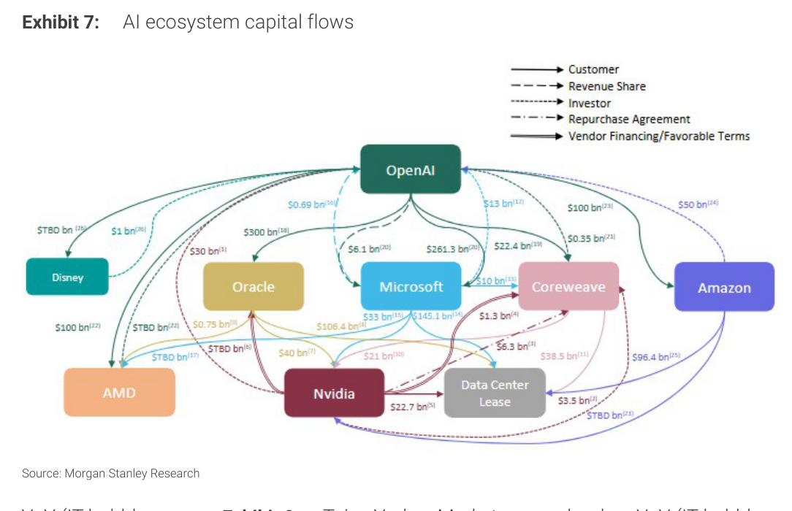

### 解讀摘要
MS 繪製了 AI 生態系資本流向圖：hyperscaler/tech 公司 AI capex 流入 GPU/ASICs，再傳遞至 PCB、基板、MLCC 等材料端。關鍵論點是 AI 公司越來越透過「以雲端使用費換股權」方式向 AI 開發公司收費，若此模式擴大，可能替代傳統 capex 支出——這是 MS 列出的主要下行風險之一。

---

## Exhibit 8｜Murata Mfg: Market cap and order YoY（IT bubble era）

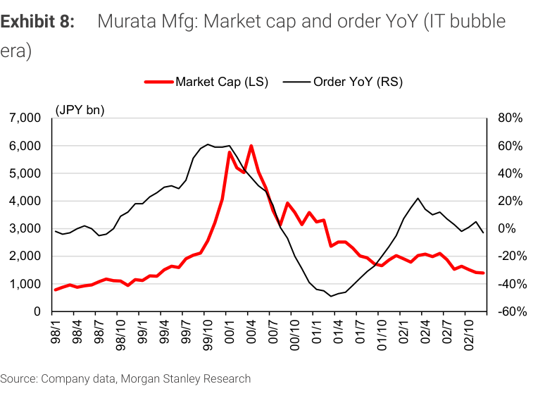

### 解讀摘要
1998-2002 年 IT 泡沫期間，Murata 市值與訂單 YoY 高度同步移動——訂單急升時市值跳漲、訂單反轉時市值暴跌。MS 以此為鏡：當前訂單 YoY 自 Jul-Sep 2025 以來急升，若 AI/DC capex 出現任何放緩，歷史顯示訂單 YoY 將快速逆轉，拖累估值。

---

## Exhibit 9｜Taiyo Yuden: Market cap and orders YoY（IT bubble era）

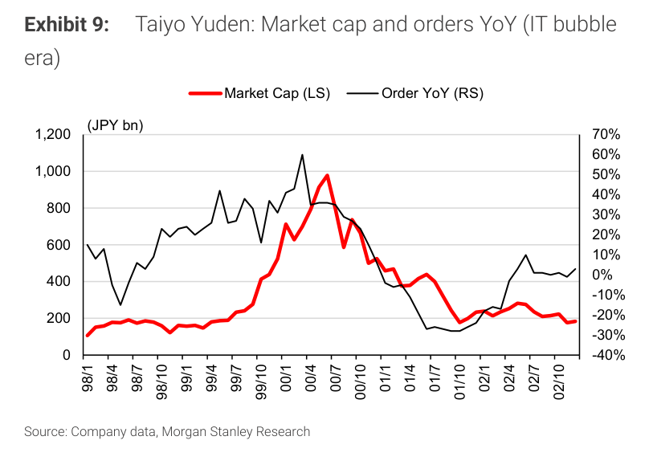

### 解讀摘要
與 Exhibit 8 相同邏輯用於 Taiyo Yuden：IT 泡沫期訂單與市值同步。TY 的訂單振幅比 Murata 更大（峰谷差高達 70% YoY），顯示其需求結構更偏向消費性/傳統端，AI 轉型尚在早期，這也是 TY 相較 Murata/SEMCO 溢價較低的底層原因。

> **洞察一（配合 Exhibit 8）**：Murata 和 TY 的歷史市值-訂單相關性提供了一個量化風險框架：若 AI 訂單 YoY 在 2Q26 達高峰後開始趨緩（如 IT 泡沫 2000 年初），市值可能在 6-9 個月內快速反轉，幅度歷史上是訂單跌幅的 1-1.5×。

---

## Exhibit 10｜Global MLCC market forecasts（Base Case）

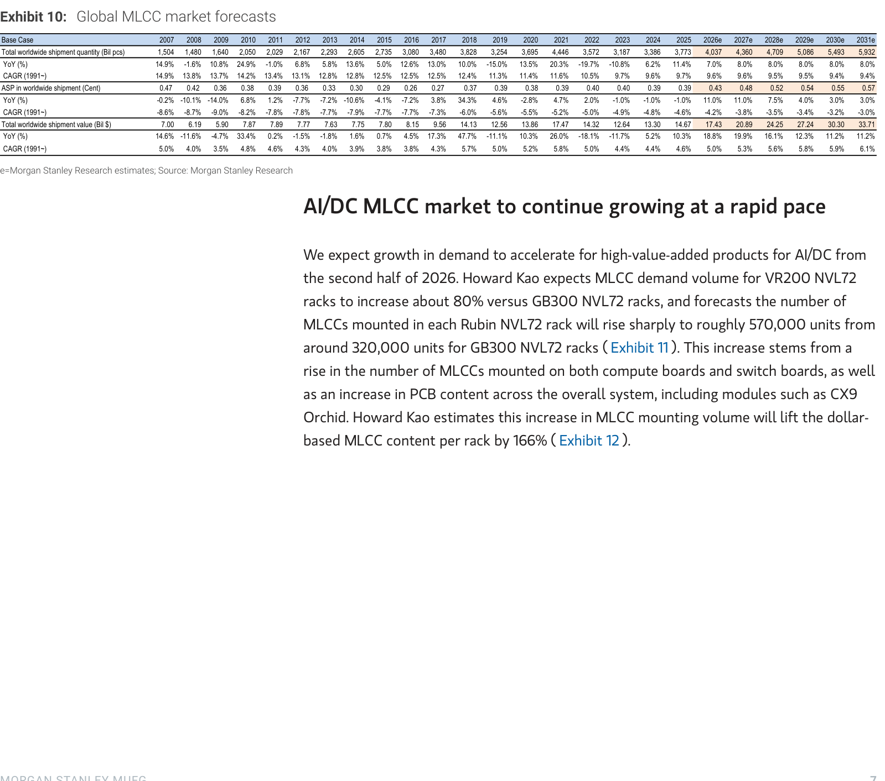

### 解讀摘要
展示全球 MLCC 出貨量、ASP 與出貨值的完整歷史（2007-2025）加預測（2026-2031）。Base Case 顯示的出貨值 2031 年達 \$33.71bn（CAGR 11.2%），較 MS 主預測 \$44.45bn 保守。ASP 在 AI 需求下從 0.39 美分（2025）上升至 0.57 美分（2031），這是 MLCC 史上久違的 ASP 正增長：2012-2025 的 ASP CAGR 曾長達 -4.8%。

### 表格（重點年份）

| 年份 | 出貨量（bn pcs）| YoY | ASP（美分）| ASP YoY | 出貨值（\$bn）| 出貨值 YoY |
|---|---|---|---|---|---|---|
| 2021 | 4,446 | +20.3% | 0.39 | +4.7% | 17.47 | +26.0% |
| 2022 | 3,572 | -19.7% | 0.40 | +2.0% | 14.32 | -18.1% |
| 2023 | 3,187 | -10.8% | 0.40 | -1.0% | 12.64 | -11.7% |
| 2024 | 3,386 | +6.2% | 0.39 | -1.0% | 13.30 | +5.2% |
| 2025 | 3,773 | +11.4% | 0.39 | -1.0% | 14.67 | +10.3% |
| 2026e | 4,037 | +7.0% | 0.43 | +11.0% | 17.43 | +18.8% |
| 2027e | 4,360 | +8.0% | 0.48 | +11.0% | 20.89 | +19.9% |
| 2028e | 4,709 | +8.0% | 0.52 | +7.5% | 24.25 | +16.1% |
| 2031e | 5,932 | +8.0% | 0.57 | +3.0% | 33.71 | +11.2% |

> **原文補充**：MS 主預測的 2031 年出貨值為 \$44.45bn（CAGR 20.3%），較 Base Case 的 \$33.71bn 高 32%。差距來自 AI/DC 用途的 MLCC 特殊需求，Base Case 代表扣除 AI 超額需求後的傳統需求基準線。

> **洞察一**：ASP 在 2026e 跳升 +11.0%（0.39→0.43 美分）是歷史上幅度最大的 ASP 升幅之一——對照 2012-25 年均 -4.8%/年，說明 AI 需求正在從根本上改變 MLCC 的定價能力，這比量的增長更具持續性。

---

## Exhibit 11｜MLCC assumptions for servers

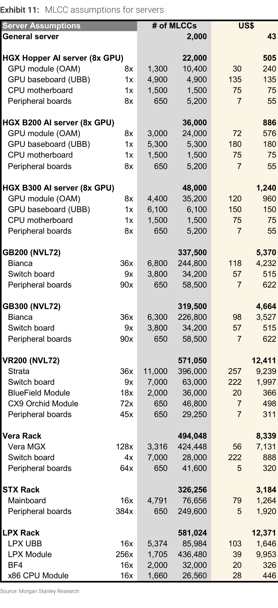

### 解讀摘要
逐型號列出 AI 伺服器/機架的 MLCC 用量（顆數）與美元含量。從 HGX Hopper（22K 顆/台）到 GB200 NVL72（337.5K 顆/架），再到 VR200 NVL72（571K 顆/架），MLCC 用量隨算力平台升級呈幾何級數增長。特別是 VR200 在 Strata 計算板、BlueField、CX9 Orchid 等全新模組貢獻了大量增量。

### 表格

| 產品 | 每台/架 MLCC 數量（顆）| MLCC 美元含量 |
|---|---|---|
| 一般伺服器 | 2,000 | \$43 |
| HGX Hopper AI 伺服器（8× GPU）| 22,000 | \$505 |
| HGX B200 AI 伺服器（8× GPU）| 36,000 | \$886 |
| HGX B300 AI 伺服器（8× GPU）| 48,000 | \$1,240 |
| GB200 NVL72 | 337,500 | \$5,370 |
| **GB300 NVL72** | **319,500** | **\$4,664** |
| **VR200 NVL72** | **571,050** | **\$12,411** |
| Vera Rack | 494,048 | \$8,339 |
| STX Rack | 326,256 | \$3,184 |
| LPX Rack | 581,024 | \$12,371 |

> **洞察一**：從 B300 單台 AI 伺服器（48K 顆/\$1,240）到 GB300 NVL72 機架（319.5K 顆/\$4,664），放大倍數僅 ~6.7×（理論上 72 張 GPU 板應更高），說明 NVL72 機架的 Switch board + 周邊板帶來的額外 MLCC 需求仍比想像中少。相反，VR200 的跳升（571K vs. 320K）主要來自 BlueField（+36K）、CX9 Orchid（+46.8K）等新模組，這些是 GPU 世代升級「附帶採購」的新類別需求。

---

## Exhibit 12｜MLCC content value per rack — GB300 vs VR200

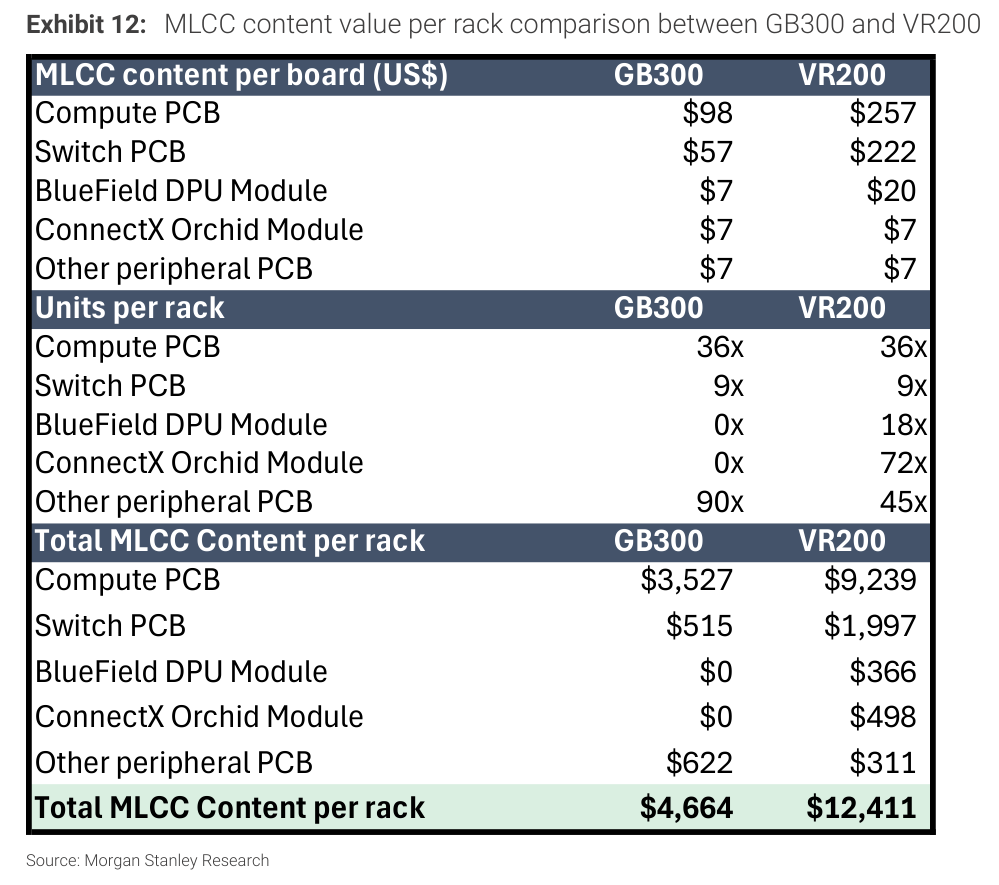

### 解讀摘要
GB300→VR200 的 MLCC 美元含量從 \$4,664 跳至 \$12,411（+\$7,747，+166%）。增量中，計算板（+\$5,712）佔最大份額，主因是每塊計算板的 MLCC 含量從 \$98 跳至 \$257（+163%，高電容製品混比提升）；其次是 Switch 板（+\$1,482）和全新模組（BlueField +\$366、CX9 Orchid +\$498）。

### 表格

| 項目 | GB300 每板（\$）| VR200 每板（\$）| GB300 數量 | VR200 數量 | GB300 總計（\$）| VR200 總計（\$）| 增量（\$）|
|---|---|---|---|---|---|---|---|
| 計算板（Compute PCB）| 98 | 257 | 36× | 36× | 3,527 | 9,239 | +5,712 |
| 交換機板（Switch PCB）| 57 | 222 | 9× | 9× | 515 | 1,997 | +1,482 |
| BlueField DPU 模組 | 7 | 20 | 0× | 18× | 0 | 366 | +366 |
| CX9 Orchid 模組 | 7 | 7 | 0× | 72× | 0 | 498 | +498 |
| 其他周邊板 | 7 | 7 | 90× | 45× | 622 | 311 | -311 |
| **合計** | | | | | **4,664** | **12,411** | **+7,747** |

### 增量貢獻拆解

| 成長來源 | 貢獻金額（\$）| 佔總增量 |
|---|---|---|
| 計算板 ASP 提升（+163% 高電容混比）| +5,712 | 73.7% |
| Switch 板 ASP 提升（+289%）| +1,482 | 19.1% |
| CX9 Orchid 全新模組（72×）| +498 | 6.4% |
| BlueField DPU 全新模組（18×）| +366 | 4.7% |
| 其他周邊板減量（90×→45×）| -311 | -4.0% |
| **淨增量** | **+7,747** | **100%** |

> **洞察一**：\$7,747 增量中 73.7% 來自計算板 ASP 提升（而非量的增加），這是最關鍵的 contra-consensus 訊號——市場傾向以「MLCC 顆數增加」衡量需求，但真正的利潤驅動力是每顆 MLCC 的 ASP 跳升 2.6×，這才是 Murata/SEMCO 利潤率擴張的引擎。
> **洞察二**：BlueField + CX9 Orchid 共貢獻 \$864（+11.1%），這兩個模組在 GB300 時代完全不存在，是純增量需求，供應商能見度比計算板 ASP 更確定。

---

## Exhibit 15｜High-cap (47µF+) MLCC usage to increase to 30%+ in VR200

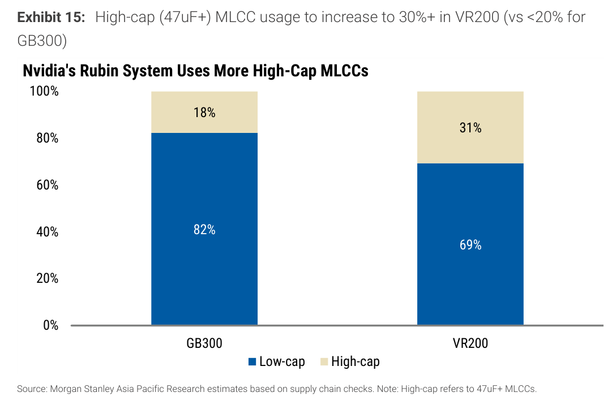

### 解讀摘要
GB300 NVL72 中高電容（47µF+）MLCCs 佔比不到 20%，升級至 VR200 後佔比超過 30%。高電容製品單價比同尺寸低電容高出 5-10×，且生產門檻更高，主要由 Murata、Taiyo Yuden、SEMCO 供應。

> **原文補充**：47µF+ MLCCs 預估佔 CY27 增量 Cloud AI MLCC TAM 的 50-60%，代表約 \$2bn 的額外市場機會；Cloud AI 需求的 47µF+ MLCC 量從 CY25 的約 40億顆暴增至 CY27 的 400億顆以上（10×）。

> **洞察一（配合 Exhibit 17）**：高電容 MLCC 在小尺寸下的量產技術是進入門檻——Murata 在 1005-size 1µF（2000）、0402-size 1µF/1005-size 22µF（2020）均為業界先行者。VR200 所需的 1608-size 100µF、1005-size 47µF 量產能力，Murata 已建立，SEMCO 次之，其他廠商尚未跟上。

---

## Exhibit 16｜Demand for high-cap (47µF+) MLCC is growing at a very fast pace

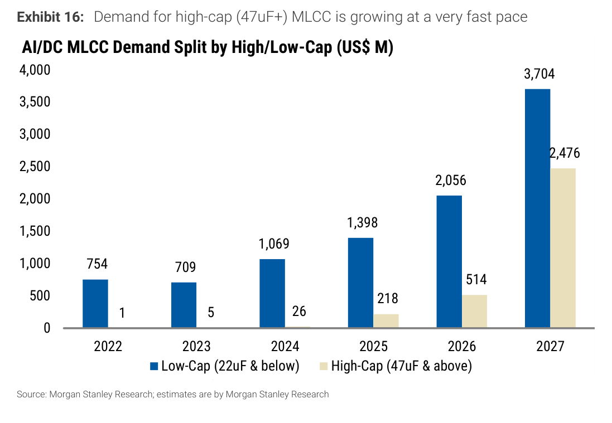

### 解讀摘要
圖表顯示 AI/DC 用途的 MLCC 需求依高/低電容切分，2022-2027 年趨勢。高電容（47µF+）需求從 2022 年的幾乎為零（\$1M）飛增至 2027 年的 \$3,704M；低電容（22µF 以下）需求同期也從 \$754M 增至 \$1,398M，但增幅遠不及高電容。

### 表格

| 年份 | Low-Cap 22µF 以下（\$M）| High-Cap 47µF+（\$M）| 合計 |
|---|---|---|---|
| 2022 | 754 | 1 | 755 |
| 2023 | 709 | 5 | 714 |
| 2024 | 1,069 | 26 | 1,095 |
| 2025 | 1,398 | 218 | 1,616 |
| 2026e | 2,056 | 514 | 2,570 |
| 2027e | 1,400（est.）| **3,704** | ~5,100+ |

> **洞察一**：High-Cap 從 \$1M（2022）到 \$3,704M（2027e），5 年 3700×，是整個 MLCC 成長故事中最具爆發力的分項。2026-27 年的高電容增量遠超低電容，說明若 AI 基礎設施需求放緩，受衝擊最大的不是 Yageo（低端）而是 Murata/SEMCO/TY（高端）——風險集中在估值最高的公司。

---

## Exhibit 17｜MLCC maximum capacitance by size（Murata mass production）

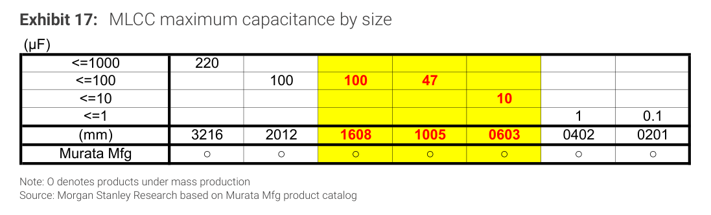

### 解讀摘要
表格標示 Murata 在各 MLCC 尺寸下的量產最大電容值（以「○」標示），確認 Murata 在 3216 至 0201 全尺寸均有量產能力，且在極小尺寸（0402、0201）的最大電容值方面屬全球領先。這張圖是 Murata 技術護城河的直接證明。

---

## Exhibit 18｜MLCC size comparison

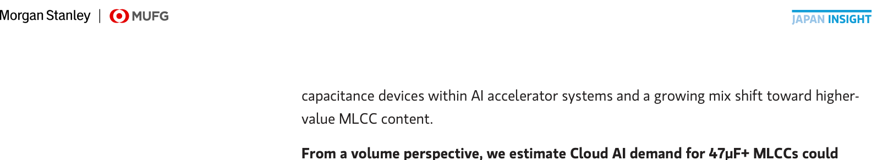

### 解讀摘要
從 4532（4.5×3.2×2.0mm）到 016008（0.16×0.08×0.08mm），MLCC 體積跨越近 3 萬倍（Volume ratio 7,373→0.26）。016008 是當前最小規格，0201 以下每縮一個尺寸等級，製造難度跨越一個數量級。VR200 所需的 1608/1005/0603 尺寸高電容正是量產難度最高的區間。

### 表格

| 尺寸 | 長 | 寬 | 厚 | 體積（mm³）| 體積比（以 0201 為 1）|
|---|---|---|---|---|---|
| 4532 | 4.5mm | 3.2mm | 2.0mm | 28.8 | 7,373 |
| 3216 | 3.2mm | 1.6mm | 0.85mm | 4.35 | 1,114 |
| 2012 | 2.0mm | 1.25mm | 0.6mm | 1.5 | 384 |
| 1608 | 1.6mm | 0.8mm | 0.8mm | 1.024 | 262 |
| 1005 | 1.0mm | 0.5mm | 0.5mm | 0.25 | 64.0 |
| 0603 | 0.6mm | 0.3mm | 0.3mm | 0.054 | 13.8 |
| 0402 | 0.4mm | 0.2mm | 0.2mm | 0.016 | 4.1 |
| 0201 | 0.25mm | 0.125mm | 0.125mm | 0.004 | 1.0 |
| 016008 | 0.16mm | 0.08mm | 0.08mm | 0.001 | 0.26 |

---

## Exhibit 19｜MLCC composition

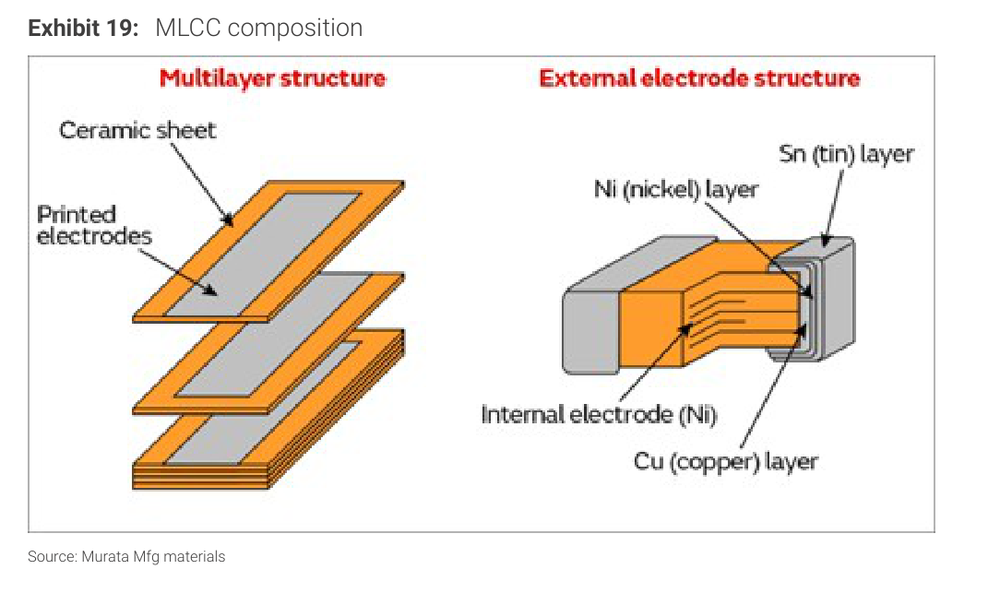

### 解讀摘要
MLCC 結構圖：交替堆疊的介電層（鈦酸鋇）與內部電極（鎳），外包封端電極（鎳+錫）。核心的「層薄化」（每層 <1µm）與「多層化」（上千層）是達成小尺寸高電容的技術路徑，也是日韓廠的核心 IP 所在。

---

## Exhibit 20｜MLCC production process

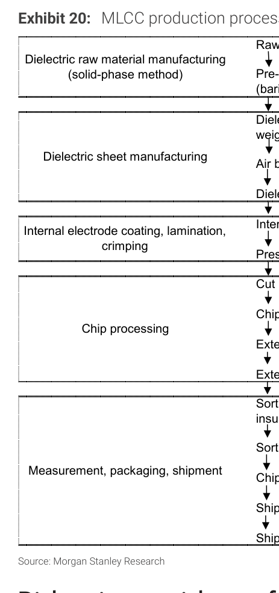

### 解讀摘要
五步製程流程：（1）介電原料製造（固相法，BaTiO₃）→（2）介電片製造（漿料成型）→（3）內部電極塗布、積層、壓著→（4）晶片加工（切割、燒結 1000-1350°C、外電極燒成 600-850°C、鍍 Ni/Sn）→（5）測量、包裝、出貨。製程密集且良率要求極高，燒結環境控制是防止介電層氧化的核心技術關卡，也是中國廠商最難跨越的壁壘。

---

## Exhibit 21｜Situations around Barium Titanate production

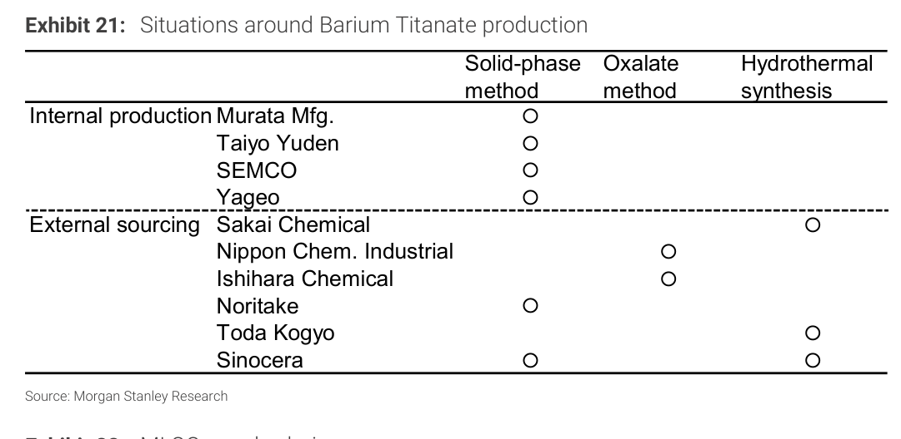

### 解讀摘要
鈦酸鋇（BaTiO₃）製法有三種：固相法、草酸鹽法（Oxalate method）、水熱合成法。Murata 三種均有內製能力，SEMCO 以固相法為主，Yageo/TY 亦有內製。Murata 更在 2023 年成立 MF Materials（20% 股份）以草酸法大量供應 BaTiO₃，2027 年新廠投產——垂直整合比競爭對手更完整。

> **原文補充**：TDK 也在 2026 年 4 月設立 TDK-NCI Advanced Materials（TDK 51%/日本化學工業 49%），加速草酸法 BaTiO₃ 開發——顯示關鍵原材料的供應安全化已成為整個 MLCC 產業的戰略課題。

---

## Exhibit 22｜MLCC supply chain

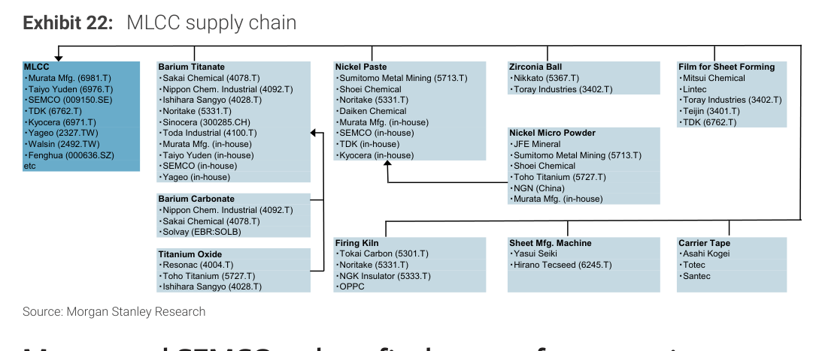

### 解讀摘要
MLCC 供應鏈圖：從鈦酸鋇、碳酸鋇、氧化鈦、鎳微粉、氧化鋯球等上游原料，到介電片成型機械、燒成窯爐、載帶等製程設備，最終匯聚至 Murata/TY/SEMCO/TDK/Kyocera/Yageo/Walsin。Walsin（2492.TW）是鎳微粉的主要外部供應商之一，和金居（Co-Tech，8358）的銅箔並不在此鏈上（MLCC 用鎳粉，非銅箔）。

---

## Exhibit 23｜MLCC market share（歷史趨勢）

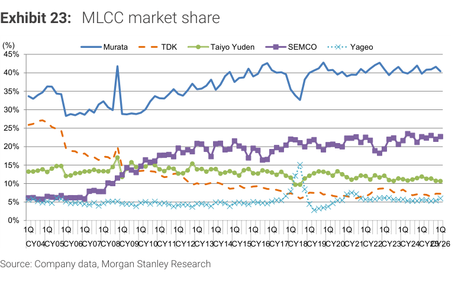

### 解讀摘要
CY04-CY26 的市場份額走勢：Murata 長期維持 35-40%+，SEMCO 穩定在 20-25%，Taiyo Yuden 從約 15% 下滑至 11%，Yageo 5-6%，TDK 6-7%。AI 週期中 Murata 和 SEMCO 份額持續微增，TY 份額停滯，與技術定位一致。

---

## Exhibit 24｜MLCC market share（CY25 圓餅）

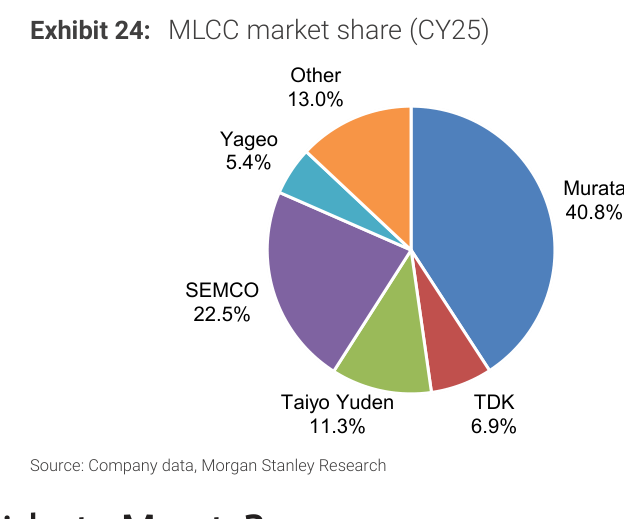

### 解讀摘要
CY25 市場份額：Murata 40.8%、SEMCO 22.5%、Taiyo Yuden 11.3%、TDK 6.9%、Yageo 5.4%、Other 13.0%。Murata+SEMCO 合計 63.3%，高端 AI MLCC 中兩者合計 ~85%，寡占格局比市場整體更集中。

---

## Exhibit 28｜Yageo vs TAIEX YTD share price performance

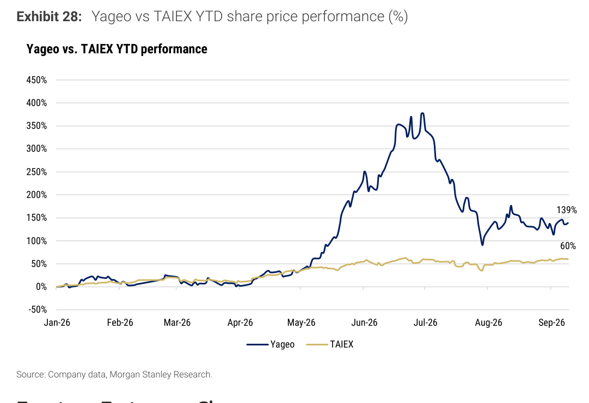

### 解讀摘要
Yageo 今年一度漲至 +139%（超越 TAIEX 的 +60%），但後來從高峰回落至當前約持平於年初（大盤仍正報酬）。Howard Kao 解釋這次深度修正的來龍去脈：2Q26 MLCC 現貨漲價是 ODM/EMS 恐慌補庫存（庫存週期從 3-4 週倉促拉至 4-6 個月），而非真實需求急增；庫存補滿後採購停止、現貨降溫，加上大盤情緒逆轉，股價腰斬 ~50%。但 MS 認為**基本面（MLCC 上行週期）並未改變**，48µF+ 產能轉換帶來的排擠效應將在 2H26-1Q27 收緊中低端供給，支撐 Yageo 定價能力。

---

## 跨 Exhibit 彙整表

### 彙整 1｜各 GPU 世代 AI 機架 MLCC 總覽（來源：Exhibit 11 + Exhibit 12）

| 平台 | 每架 MLCC 顆數 | 每架 MLCC 美元含量 | vs. GB300 量增量 | vs. GB300 值增量 |
|---|---|---|---|---|
| GB200 NVL72 | 337,500 | \$5,370 | +18,000 (+5.6%) | +706 (+15.1%) |
| **GB300 NVL72** | **319,500** | **\$4,664** | 基準 | 基準 |
| **VR200 NVL72** | **571,050** | **\$12,411** | **+251,550 (+79%)**| **+7,747 (+166%)** |
| Vera Rack | 494,048 | \$8,339 | +174,548 (+55%) | +3,675 (+79%) |
| LPX Rack | 581,024 | \$12,371 | +261,524 (+82%) | +7,707 (+165%) |

> VR200 和 LPX Rack 的值增量幾乎相同（+\$7,747/\$7,707），但 VR200 是 Nvidia 路線圖核心，出貨量預期最大；MLCC 供應商的受益主要來自這一平台。

---

## 相關個股清單

| 類別 | 公司 | Ticker | 評等 | 備註 |
|---|---|---|---|---|
| MLCC 主要廠 | Murata Manufacturing | 6981.T | OW（Top Pick）| PT ¥11,000；41% 全球份額；AI/DC MLCC 龍頭 |
| MLCC 主要廠 | Samsung Electro-Mechanics | 009150.KS | OW（Top Pick KR）| PT W2,620,000；23% 份額；ABF 雙驅動 |
| MLCC 主要廠 | Yageo Corp. | 2327.TW | OW | PT NT\$1,050；中低端受惠於排擠效應 |
| MLCC 主要廠 | Taiyo Yuden | 6976.T | EW（升自 UW）| PT ¥10,500；高端 AI 轉型進度較慢 |
| MLCC 原料 | Walsin Technology | 2492.TW | — | 鎳微粉供應商 |
| MLCC 原料 | Nippon Chemical Industrial | 4092.T | — | 草酸鋇鈦（BaTiO₃）外部供應商 |
| MLCC 原料 | Sakai Chemical | 4078.T | — | 鈦酸鋇供應商 |
| MLCC 原料 | Sumitomo Metal Mining | 5713.T | — | 鎳微粉供應 |
