# Nomura｜Global AI Trend Tracker：AI networking – scale-across & scale-in

**券商**：Nomura（Nomura International (Hong Kong) Ltd.）  
**分析師**：Bing Duan、Ethan Zhang  
**日期**：2026-09-22（檔名未含日期，採用封面/Production Complete 日期）  
**主題**：AI networking – scale-across & scale-in：Core players expanding business frontiers  
**評級**：N/A（Asia ex-Japan 不指派 sector rating；報告內個股評等：YOFC／Innolight／Accelink 均 Buy）  
<a href="https://layx.uk/dl?g=產業&b=Nomura&d=20260922&h=ScaleAcross-ScaleIn">📎 下載 PDF</a>

---

## 報告總結

本篇是 Nomura「Global AI Trend Tracker」系列的延續報告，銜接先前的 OCS 專題，聚焦 NVIDIA 近期正式提出的「Scale-Across」與新概念「Scale-In」兩大網路支柱——隨著兆參數模型訓練與 Agentic AI 需求成長，單一資料中心在電力、散熱、土地上的物理限制已成瓶頸，跨機房分散式訓練與 DPU 邊緣卸載正從選項轉為必要架構。

Nomura 認為這將驅動 coherent 光模組（800G/1.6T）、OCS、中空光纖的增量需求，把原本低成長的傳統 DCI（100G-400G、TAM 約 USD7bn）重新定義為 AI-WAN 市場，預期 2029E 倍增至 USD14bn（~30% CAGR）；中國受益個股鎖定 YOFC（中空光纖）、Innolight 與 Accelink（coherent 模組），三者均維持 Buy，但報告也提醒中國本土 Scale-Across 需求尚未到達轉折點。

---

## Nomura 完整投資邏輯鏈

| 論點層次 | Fig. | 內容 |
|---|---|---|
| 瓶頸確認 | Fig. 1-2 | 兆參數模型訓練與 Agentic AI 需求超出單一 DC/叢集的電力、散熱、土地上限，NVIDIA 正式訂出五層獨立網路（Scale-Up/Out/In/Across + Context Scale） |
| 需求結構 | Fig. 4, 9 | Scale-Across 涵蓋 500m-100km+，改用 coherent pluggable/DWDM/OCS/中空光纖；AI 用光纜需求 2024→2030 由 39.5 成長至 127.6 M F-Km |
| 供給上限 | Fig. 10-12 | 上游 coherent DSP 由 Marvell/Broadcom/Acacia 主導；中空光纖商業化領先者為 YOFC；中國廠商多外購 Marvell Aquila DSP 卡位 coherent-lite |
| 受益排序 | 封面 | Nomura Buy：YOFC（中空光纖商業化）> Innolight、Accelink（coherent 光模組需求） |
| **結論** | 封面 | **Scale-Across 相對傳統 DCI 的高頻寬/低延遲/高可靠度門檻，加上新興 Scale-In（DPU）需求，共同創造光通訊零組件供應商的增量 TAM；Nomura 重申 YOFC／Innolight／Accelink 三檔 Buy** |

> **報告最大邏輯缺口**：Scale-In 是 NVIDIA 剛提出的新概念，核心硬體 BlueField-4 尚未量產（Marvell 對標的 1.6T coherent-lite DSP 要到 2H26 才開始送樣），實際營收貢獻時程仍屬推測；且報告明白指出中國本土 Scale-Across 需求「尚未到達轉折點」，三檔 Buy 評等的短期出貨動能，主要仍是押注海外（尤其北美 CSP）需求外溢到中國供應鏈，而非中國本土 AI-WAN 建設本身。

---

## 報告核心觀點

| 主題 | Nomura 觀點 | 市場共識 | 是否 Contra-Consensus |
|---|---|---|---|
| 傳統 DCI vs Scale-Across | Scale-Across 連接 100 萬顆 XPU 所需頻寬約為傳統 WAN/DCI 的 14 倍（引用 Cisco）；AI-WAN TAM 由 USD7bn 倍增至 USD14bn（2026-29E，~30% CAGR） | 傳統 DCI 被視為低成長、成熟的電信基建業務 | 顯著 Contra（重新定義為高成長新興市場） |
| 中國 vs 海外 Scale-Across 需求 | 中國電力供給相對充足，但仍受限於單一機房散熱/空間物理限制；業務規模仍小，需求尚未到達轉折點 | 市場預期中國 AI 基建各環節同步跟進海外進度 | 部分 Contra（明確點出中國進度落後） |
| Coherent-lite + OCS 組合 | Coherent-lite 可回補 OCS 消耗的鏈路預算，使 OCS 架構得以延伸進 2.4T/3.2T 模組世代 | OCS 光學損耗被視為限制其升級速度的技術瓶頸 | 技術性 Contra（OFC 2026 Lumentum+Marvell 已聯合展示解方） |
| Scale-In 重要性 | NVIDIA 新增第五網路支柱，因 Agentic AI 複雜度提升、CPU 雜務外包、資料安全前移到 DPU 三項結構性理由，重要性預期持續上升 | 市場論述仍多聚焦 Scale-Up/Out/Across 三層，Scale-In 認知度低 | Contra（前瞻主題，尚未被市場定價） |

**偏好排序**：YOFC（中空光纖商業化，已有得標實績）> Innolight／Accelink（coherent 光模組，採用 Marvell Aquila DSP 快速卡位 1.6T coherent-lite）
**零件/個股偏好**：中空光纖 YOFC；coherent 光模組 Innolight、Accelink；DSP 平台依賴 Marvell；OCS 觀察 Coherent、Lumentum

---

## Fig. 1｜New definition of AI factory networking

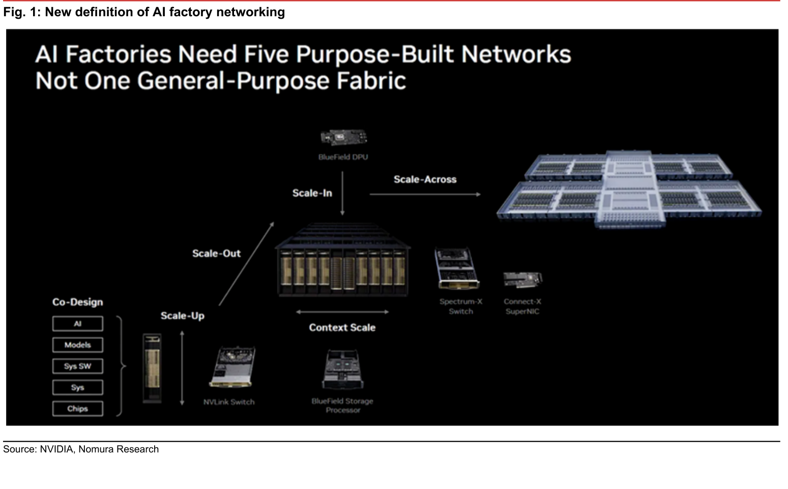

### 解讀摘要

這是全報告的核心框架圖，把 AI factory 網路拆解成五個各自獨立設計的網路層（而非過去的單一通用網路 fabric）：Scale-Up 連接 GPU 內部元件、Scale-Out 連接機櫃間、Scale-In 透過 BlueField DPU 對接北向的 Agentic CPU/Storage/Cloud/WAN、Scale-Across 透過 Spectrum-X Switch 與 ConnectX SuperNIC 連往其他資料中心、Context Scale 則是 BlueField Storage Processor 對 NVLink Switch 的記憶體擴充路徑。NVIDIA 把每個網路層綁定專屬硬體，意味著每個新增網路層都是一次獨立的零組件採購週期，而非既有網路的升級。

### 洞察

> **洞察一**：NVIDIA 用五個獨立命名的網路層（而非「一個通用 fabric 加強版」）本身就是一個市場訊號——每層各自對應獨立硬體 SKU（BlueField DPU、Spectrum-X Switch、ConnectX SuperNIC、NVLink Switch、BlueField Storage Processor），代表 AI 工廠的網路資本支出正從「單一大宗採購」轉為「多層平行採購」，對零組件供應商是採購頻次與品項數同時增加的結構性利多。

---

## Fig. 2｜Five-pillar of AI networking architecture

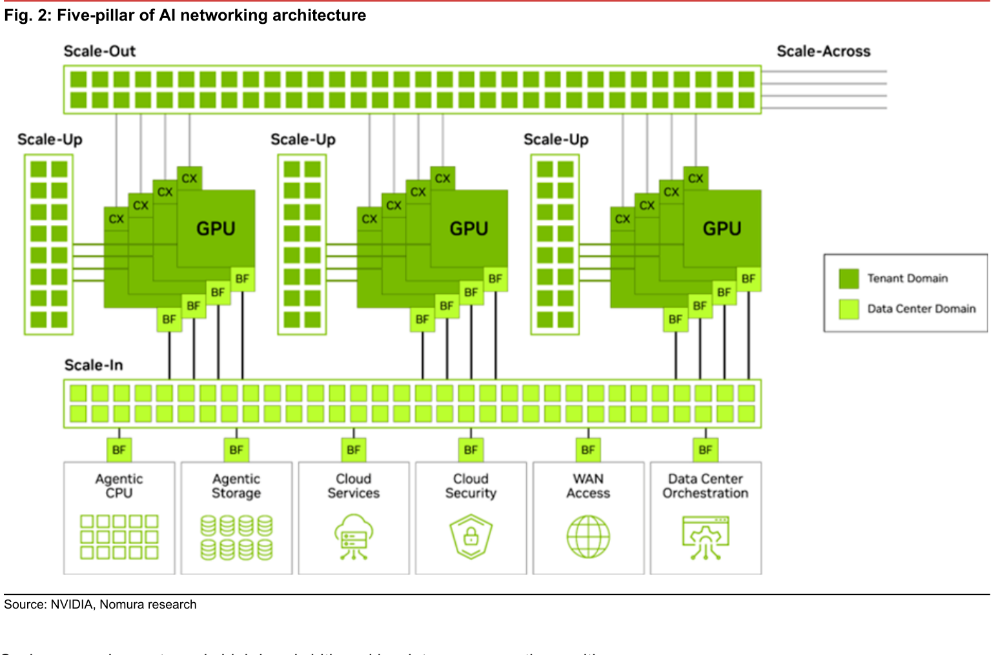

### 解讀摘要

此圖把 Fig.1 的抽象架構具體化到晶片層級：每個 GPU 節點配備多顆 CX（ConnectX）網卡走 Scale-Out fabric，同時配備多顆 BF（BlueField）DPU 走向下方的 Scale-In fabric；Scale-In fabric 再分岔到六個獨立功能區塊（Agentic CPU、Agentic Storage、Cloud Services、Cloud Security、WAN Access、Data Center Orchestration），每個功能區塊各自掛一顆 BF。這說明 Scale-In 不是單一用途網路，而是把原本由主機 CPU 處理的六類雜務全部搬到 DPU 層，形成獨立於 Tenant Domain（綠色，租戶專屬）與 Data Center Domain（淺綠，機房共用）的第三網路平面。

### 洞察

> **洞察二**：Scale-In 把安全邊界（Cloud Security）、WAN 存取都下放到 DPU 執行，等同把原本屬於 CPU 或機房層級網路設備的功能，轉譯成每顆 GPU 節點都要配置的 BF 顆數——圖中每組 GPU Scale-Up 域至少配 4-5 顆 BF，若未來 Scale-Up 群組數量隨機櫃規模擴大，BF 顆數會近乎線性增加，這是 BlueField DPU 出貨量的結構性驅動力，而非一次性升級。

---

## Fig. 3｜Scale-up vs. Scale-out vs. Scale-across vs. Scale-in

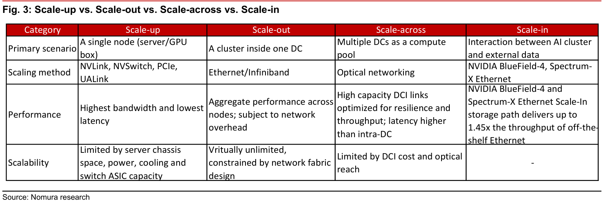

### 解讀摘要

這張表把四個網路層的「主要情境」「連接技術」「效能特徵」「可擴展性限制」並排比較，是全報告的分類基準表。最關鍵的一欄是「可擴展性」：Scale-Out 被形容為「近乎無限，受限於網路 fabric 設計」，而 Scale-Across 被明確標注「受限於 DCI 成本與光學傳輸距離」——代表 Scale-Across 是四層中唯一一個「用錢可以買到規模」的層級，直接指向光通訊元件（coherent 模組、OCS、中空光纖）供應商的商業機會，因為擴大 Scale-Across 規模的邊際成本主要落在這些元件上。

### 表格

| Category | Scale-up | Scale-out | Scale-across | Scale-in |
|---|---|---|---|---|
| Primary scenario | A single node (server/GPU box) | A cluster inside one DC | Multiple DCs as a compute pool | Interaction between AI cluster and external data |
| Scaling method | NVLink, NVSwitch, PCIe, UALink | Ethernet/Infiniband | Optical networking | NVIDIA BlueField-4, Spectrum-X Ethernet |
| Performance | Highest bandwidth and lowest latency | Aggregate performance across nodes; subject to network overhead | High capacity DCI links optimized for resilience and throughput; latency higher than intra-DC | Spectrum-X Ethernet Scale-In storage path delivers up to 1.45x throughput of off-the-shelf Ethernet |
| Scalability | Limited by server chassis space, power, cooling and switch ASIC capacity | Virtually unlimited, constrained by network fabric design | Limited by DCI cost and optical reach | - |

### 洞察

> **洞察三**：Scale-In 一欄的「可擴展性」留空（僅標示「-」），顯示 NVIDIA/Nomura 尚未對 Scale-In 的擴展上限給出明確結論——對照 Fig.8 揭露 BlueField-4 用 Spectrum-X Ethernet 提供「比一般 Ethernet 高 1.45 倍儲存吞吐量」的具體數字，可推測 Scale-In 現階段論述重點是「效能提升倍數」而非「擴展規模上限」，反映這是五層中最新、案例最少的一層。

---

## Fig. 4｜Primary technology comparisons in scale-up/scale-out/scale-across

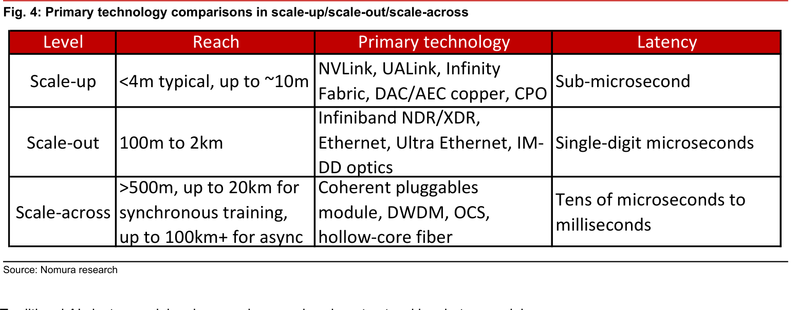

### 解讀摘要

這張表把 Fig.3 的架構分類換成物理層規格：Scale-Up 觸及 <4m（至多 10m）、次微秒延遲，靠 NVLink/UALink/CPO 等銅或封裝內連接；Scale-Out 觸及 100m-2km、個位數微秒延遲，靠 Infiniband/Ethernet/IM-DD 光學；Scale-Across 觸及 500m 到 100km+，延遲拉長到數十微秒至毫秒級，改用 coherent pluggable、DWDM、OCS、中空光纖。三個層級的技術完全不重疊，代表零組件供應商的競爭範圍是分層鎖定、而非同一批廠商跨層競爭。

### 表格

| Level | Reach | Primary technology | Latency |
|---|---|---|---|
| Scale-up | <4m typical, up to ~10m | NVLink, UALink, Infinity Fabric, DAC/AEC copper, CPO | Sub-microsecond |
| Scale-out | 100m to 2km | Infiniband NDR/XDR, Ethernet, Ultra Ethernet, IM-DD optics | Single-digit microseconds |
| Scale-across | >500m, up to 20km for synchronous training, up to 100km+ for async | Coherent pluggables module, DWDM, OCS, hollow-core fiber | Tens of microseconds to milliseconds |

### 洞察

> **值得驗證**：Scale-Across 的距離上限標示「up to 100km+ for async（非同步訓練）」，代表同步訓練上限僅 20km——若未來分散式訓練朝「跨區同步訓練」發展（而非目前多假設的非同步/資料並行），有效距離會被壓回 20km 以內，中空光纖與長距 coherent 模組的差異化優勢（可達 80-120km）在同步訓練場景下可能無法完全發揮，需求結構會更集中在都會級（Metro）而非區域級（Regional）光模組。

---

## Fig. 5｜Data center connectivity—from 10 km to 10,000+ km

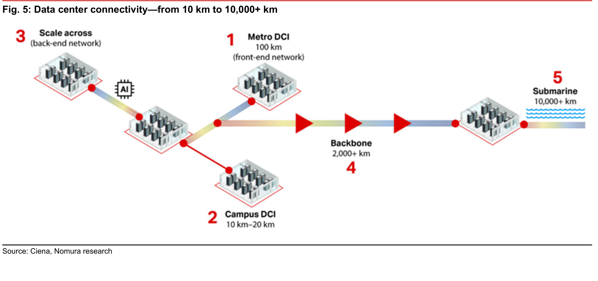

### 解讀摘要

這張 Ciena 提供的圖把資料中心互連依「地理尺度」分成五級，其中 Scale-across（back-end network，標示 AI 晶片圖示）被獨立於傳統的 Metro DCI（前端網路）之外，兩者用不同顏色的連接線區分——這個並列是本篇報告最核心的敘事：Scale-across 不是既有 DCI 業務的自然延伸，而是疊加在既有前端網路之外的第二套、專為 AI 流量設計的後端網路。既有電信商已部署 Metro/Backbone/Submarine 骨幹資產，但 Scale-across 這一段後端網路仍須新建。

> **原文補充**：報告內文引用 Cisco 數據，指 Scale-across 連接 100 萬顆 XPU 所需頻寬，約為傳統 WAN/DCI 網路的 14 倍。

### 洞察

> **洞察四（配合 Fig. 4）**：Fig.4 標示 Scale-Across 延遲「數十微秒至毫秒」、距離上看 100km+，對照本圖 Scale-across 與 Backbone（2,000+km）分屬不同層級，顯示現階段 Scale-across 部署主要落在 Campus/Metro 尺度（10-100km），尚未真正進入 Backbone 長途骨幹範疇——這也解釋了為何 Ciena 在 TAM 估算中特別區分 80km span（USD500mn）、1,000km span（USD1bn）、2,000km span（USD2bn）三個級距，距離越長對應的高性能 modem 佔比越高、TAM 密度也越高。

---

## Fig. 6｜Optical interconnect technologies in different layer of AI networking

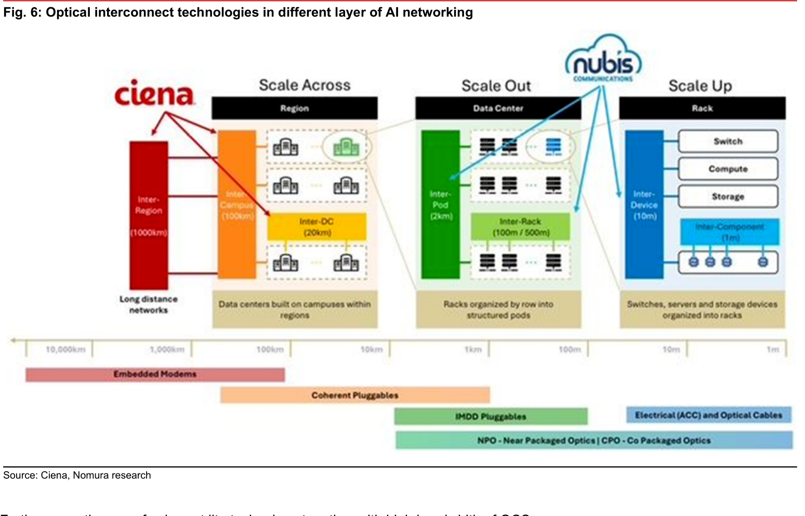

### 解讀摘要

這是報告中資訊密度最高的一張圖，把 Region（1000km）→Campus（100km）→Inter-DC（20km）→Inter-Pod（2km）→Inter-Rack（100-500m）→Inter-Device（10m）→Inter-Component（1m）七層距離尺度，對應到四種技術帶：Embedded Modems 覆蓋最長距離、Coherent Pluggables 覆蓋約 100km 到 1-2km（涵蓋 Scale-Across 全部三個子層）、IMDD Pluggables 專責 Inter-Pod 與部分 Inter-Rack、NPO/CPO 則從 Inter-Rack 延伸到 Inter-Component 最短距離。關鍵是 Coherent Pluggables 的覆蓋範圍橫跨 Scale-Across 的全部子層，代表同一類 coherent 模組供應商可吃下整個 Scale-Across 市場，不需依距離分層採購不同廠牌。

### 洞察

> **洞察五**：圖中同時標出 Ciena 主導 Scale Across 段（紅色箭頭指向 Inter-Campus/Inter-DC）、Nubis Communications 主導 Scale Out/Scale Up 交界（藍色箭頭指向 Inter-Pod 與 Inter-Rack/Inter-Device），顯示既有設備商版圖已按網路層級劃分勢力範圍——這對新進供應商（如中國廠商 Accelink、Innolight）的意義是：與其在 Ciena 已站穩的 Scale-Across 長距市場正面競爭，不如切入表格中段的 Coherent Pluggables 短距應用（2-20km，即 coherent-lite），這正是 Accelink 與 Innolight 目前用 Marvell Aquila DSP 卡位的區段（見 Fig.11）。

---

## Fig. 7｜Topology for OCS deployment designed by NVIDIA

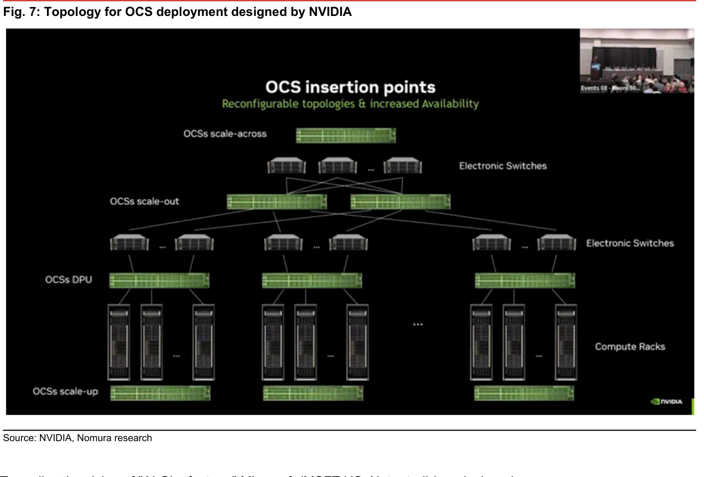

### 解讀摘要

這是 NVIDIA 官方會議簡報截圖，展示 OCS（全光交換器）如何插入到從 Scale-Up 到 Scale-Across 的每一層——不是只用在單一層級，而是每一層都有專屬的 OCS 節點（OCSs scale-up、OCSs DPU、OCSs scale-out、OCSs scale-across），透過電子交換器（Electronic Switches）分層聚合。這證實內文所述「OCS 可用於 Scale-Across 層的全光交換，取代傳統電子交換，以支援 10 萬卡級 AI 叢集的高效互連」——OCS 不是取代電子交換器，而是在其上再疊加一層全光重配置能力，讓拓樸可動態調整而不需實體重新佈線。

### 洞察

> **洞察六**：圖中 OCS 節點數量隨層級遞增而遞減（scale-up 層每個 rack 群組配一顆、DPU 層每組配一顆、scale-out 與 scale-across 層則各自只需少數幾顆聚合節點），意味著 OCS 採購密度集中在中低層級（靠近運算節點），而非最頂層骨幹交換——這與傳統認知「OCS 只用在核心層做長距全光交換」不同，OCS 廠商（Google、Coherent、Lumentum）若要打入這套拓樸，產品線需同時覆蓋從 rack 級到跨資料中心級的多種埠數規格，而非單一大型交換器產品。

---

## Fig. 8｜Components of BlueField-4

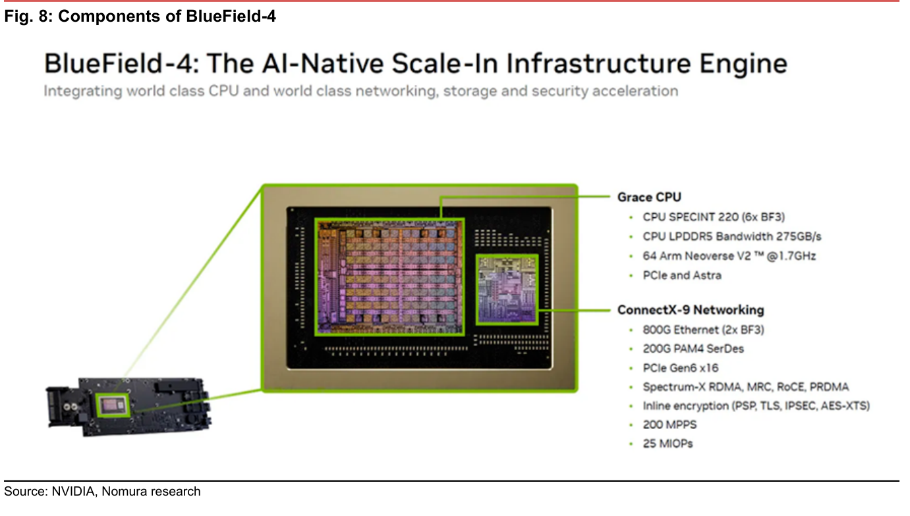

### 解讀摘要

BlueField-4 把 Grace CPU（64 顆 Arm Neoverse V2 核心、CPU SPECint 220、LPDDR5 頻寬 275GB/s）與 ConnectX-9 網路晶片（800G Ethernet、PCIe Gen6 x16、200 MPPS、25 MIOPs）封裝在同一顆晶片上，這是「第三大運算支柱」的具體實現——把運算（Grace CPU）與網路/安全加速（ConnectX-9）綁定在單一 DPU 封裝，而非分成兩顆獨立晶片透過 PCIe 外接。表列的 Inline encryption（PSP、TLS、IPSEC、AES-XTS）全部由硬體直接處理，呼應內文「把安全邊界前移到 DPU，比依賴主機內 CPU 更可控」的設計邏輯。

> **原文補充**：內文另指出，BlueField-4 提供 AI Factory 服務頻寬達 18 倍提升、儲存加速效能達 2 倍，使主機 CPU 與 GPU 得以從網路排程、安全審查、虛擬化管理等雜務中解放。

### 洞察

> **洞察七**：ConnectX-9 規格中的「800G Ethernet（2x BF3）」暗示 BlueField-4 的網路頻寬是用兩顆前代 BlueField-3 頻寬並聯而成——換算下來，若 BlueField-4 大量部署，對 800G 網路埠的需求會是前代 BF3 世代的兩倍密度，這對 800G 乙太網路交換器與對應光模組供應商（而非僅 coherent 長距模組）是一個常被忽略但同樣重要的增量需求來源。

---

## Fig. 9｜Fiber optic cables for AI workload market size forecast

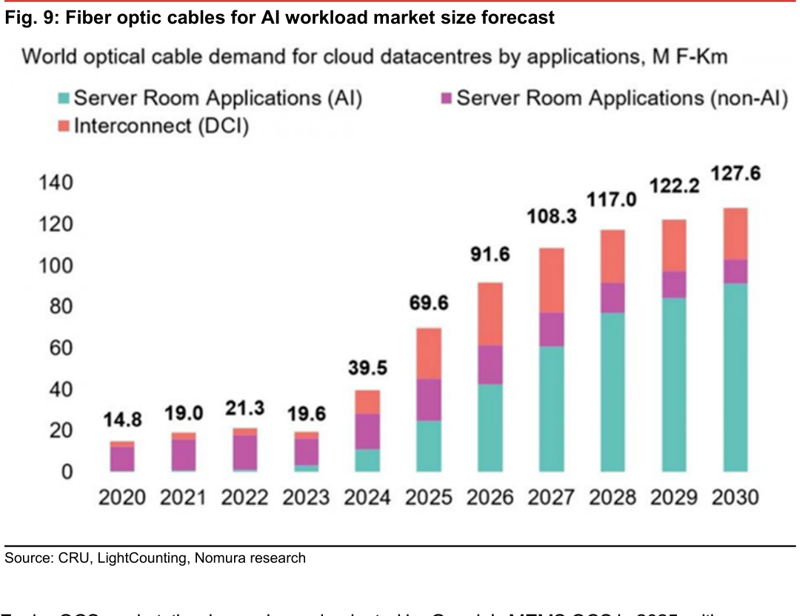

### 解讀摘要

圖表直接標示每年總量（2020 年 14.8 M F-Km 成長到 2030 年 127.6 M F-Km），十年複合成長率約 24%，其中 AI 相關的 Server Room Applications（AI，青色）是成長最快的分項——2030 年已成為三個分項中佔比最大的一塊（約 90/127.6 ≈ 71%）。這張圖佐證了報告封面引用 CRU 數據「2025E AI 相關光纜需求年增 77%，遠超非 AI 應用」的說法。

### 表格

| 年度 | 2020 | 2021 | 2022 | 2023 | 2024 | 2025 | 2026 | 2027 | 2028 | 2029 | 2030 |
|---|---|---|---|---|---|---|---|---|---|---|---|
| 總需求（M F-Km） | 14.8 | 19.0 | 21.3 | 19.6 | 39.5 | 69.6 | 91.6 | 108.3 | 117.0 | 122.2 | 127.6 |

### 洞察

> **洞察八**：從圖中可反推 non-AI 與 DCI（互聯）兩個分項在 2024 年後幾乎持平甚至萎縮佔比（紫色與橘色色塊的絕對高度成長遠慢於青色），顯示光纜供應商的產品組合正在被 AI 需求快速稀釋既有電信/企業客戶佔比——若光纖廠商的產能規劃仍以既有非 AI 客群為主要假設，可能會低估 AI 專用產能的擴產急迫性。

---

## Fig. 10｜Scale-across value chain

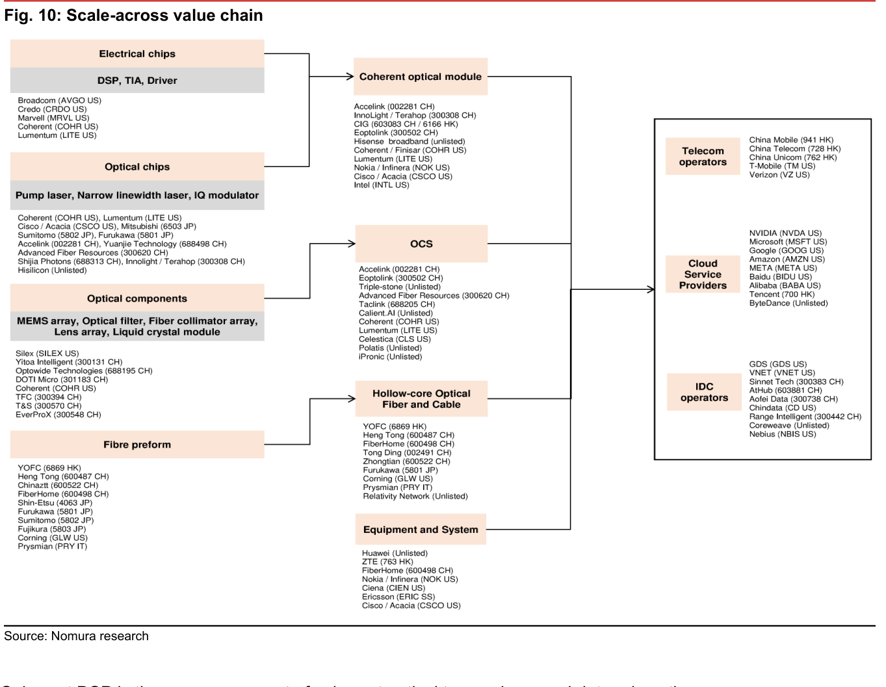

### 解讀摘要

這是全報告最完整的價值鏈地圖，把上游四類原料/晶片供應商（Electrical chips、Optical chips、Optical components、Fibre preform）匯流到三個中游產品線（Coherent optical module、OCS、Hollow-core Optical Fiber and Cable）再加 Equipment and System，最終賣給下游三類客戶（Telecom operators、Cloud Service Providers、IDC operators）。值得注意的是 Accelink（002281 CH）同時出現在上游 Optical chips 分類與中游 Coherent optical module、OCS 兩個產品線，顯示其為少數垂直整合覆蓋光晶片到模組的廠商，而 Innolight（以 Terahop 品牌列名）僅出現在 Coherent optical module 一欄。

### 洞察

> **洞察九**：YOFC 在上游同時出現在 Fibre preform 與中游 Hollow-core Optical Fiber and Cable 兩欄，顯示其優勢在於從光纖預製棒（preform，決定光纖光學特性與成本結構的關鍵原料）到成品光纖的垂直整合——這解釋了為何 Nomura 封面特別點名 YOFC 受益於「中空光纖商業化」而非泛稱「光纖需求成長」：預製棒環節的自製能力，是 YOFC 相對 Hengtong、Lightera 等其他中空光纖廠商的成本與良率護城河。

---

## Fig. 11｜DSP and Coherent optical module product progress

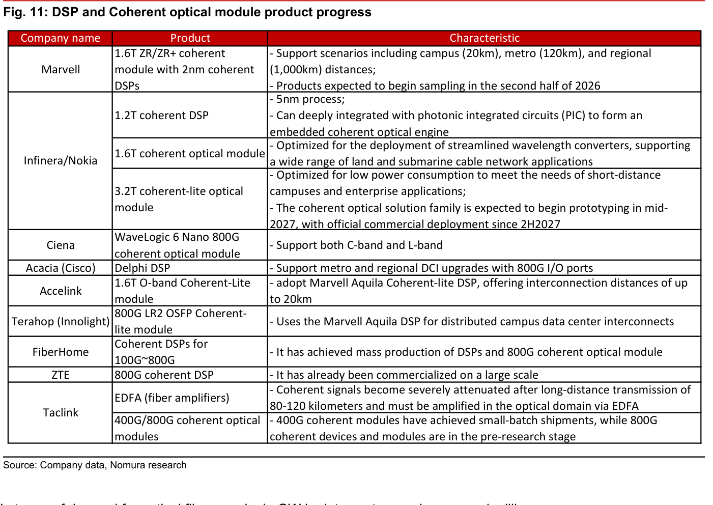

### 解讀摘要

這張表把 9 家公司的 DSP/coherent 模組產品世代與時程並列，可看出技術世代分兩軌並進：一軌是純長距 coherent（Marvell 1.6T ZR/ZR+、Infinera/Nokia 1.2T/1.6T DSP、Ciena WaveLogic 6 Nano、Acacia Delphi DSP），鎖定 campus（20km）到 regional（1,000km）；另一軌是低功耗 coherent-lite（Infinera/Nokia 3.2T、Accelink 1.6T O-band、Innolight 800G LR2），鎖定 20km 以內的校園級互連，其中 Accelink 與 Innolight 均採用 Marvell 的 Aquila coherent-lite DSP，而非自研 DSP。

> **原文補充**：內文指出 Ciena 是首家進入 1.6T 世代的廠商，用 3nm CMOS 製程推出業界首個 1.6T coherent 技術；中國廠商中 Accelink 用 Marvell DSP 推出 1.6T coherent-lite 模組，是最早的國產 1.6T coherent 光模組之一。FiberHome 400G 模組已小量出貨，800G coherent 元件與模組仍在預研階段（尚未量產），與 Accelink/Innolight 的 1.6T 進度有明顯落差。

### 表格

| Company | Product | 特點 |
|---|---|---|
| Marvell | 1.6T ZR/ZR+ coherent module，2nm coherent DSP | 支援 campus（20km）、metro（120km）、regional（1,000km）；2H26 開始送樣 |
| Infinera/Nokia | 1.2T coherent DSP | 5nm 製程，可與 PIC 深度整合形成嵌入式 coherent 光引擎 |
| Infinera/Nokia | 1.6T coherent optical module | 優化波長轉換器部署，支援陸纜與海纜應用 |
| Infinera/Nokia | 3.2T coherent-lite optical module | 針對短距校園/企業應用低功耗優化；2027 年中原型、2H2027 商用 |
| Ciena | WaveLogic 6 Nano 800G coherent optical module | 支援 C-band 與 L-band |
| Acacia (Cisco) | Delphi DSP | 支援 metro/regional DCI 升級，800G I/O |
| Accelink | 1.6T O-band Coherent-Lite module | 採用 Marvell Aquila Coherent-lite DSP，互連距離達 20km |
| Terahop (Innolight) | 800G LR2 OSFP Coherent-lite module | 使用 Marvell Aquila DSP，用於分散式校園資料中心互連 |
| FiberHome | Coherent DSPs for 100G~800G | 已量產 DSP 與 800G coherent 光模組 |
| ZTE | 800G coherent DSP | 已大規模商用化 |
| Taclink | EDFA、400G/800G coherent optical modules | 400G 已小量出貨，800G 仍在預研階段 |

### 洞察

> **洞察十**：Accelink 與 Innolight 都採購 Marvell Aquila DSP 而非自研，意味著這兩家中國廠商的 1.6T coherent-lite 產品競爭力，實質上綁定在 Marvell 的 DSP 世代節奏上——若 Marvell 3.2T coherent-lite 如期於 2H2027 商用，Accelink/Innolight 需同步跟上採用，否則產品世代會落後於使用自研 DSP 的 Ciena、Infinera/Nokia；這是報告 Buy 評等背後一個未明說的執行風險。

> **值得驗證**：Marvell 3.2T coherent-lite 光模組「預計 2027 年中開始原型測試、2H2027 才正式商用部署」——這代表 Accelink、Innolight 目前掛牌的 1.6T 產品線，在 2027 下半年前不會被自家上游 DSP 供應商的下一代產品打斷；但若 3.2T 商用時程提前，或使用自研 DSP 的競爭對手（Ciena/Infinera）搶先商用化，Accelink/Innolight 的 1.6T 世代產品窗口期可能被壓縮。

---

## Fig. 12｜Progress of hollow core optical fiber

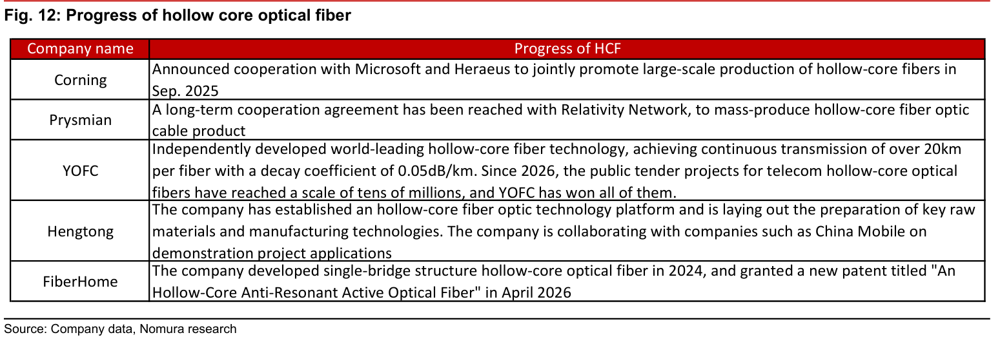

### 解讀摘要

五家廠商的中空光纖進度並列，只有 YOFC 明確寫出量化的技術指標（20km 以上連續傳輸、衰減係數 0.05dB/km）與商業化證據（2026 年以來電信標案「全部得標」），其餘四家（Corning、Prysmian、Hengtong、FiberHome）僅描述合作意向或平台建置，尚無公開的量產數字或得標紀錄。這個落差直接支撐報告封面「YOFC 受益於中空光纖商業化」的判斷——YOFC 不僅技術指標最具體，且已有實際訂單轉換。

> **原文補充**：內文另提到 Hengtong 正投資建置 AI 先進光纖材料研發中心，預計 2026 年 2 月完工後產能達 500 萬 fkm；而中空光纖整體需求規模，YOFC 管理層預估「未來 2-3 年僅數百萬 fkm 等級」，相對整體光纖市場仍屬小量。

### 表格

| 公司 | 進度 |
|---|---|
| Corning | 2025 年 9 月宣布與 Microsoft、Heraeus 合作推動中空光纖大規模量產 |
| Prysmian | 與 Relativity Network 達成長期合作協議，量產中空光纖光纜產品 |
| YOFC | 自主開發全球領先中空光纖技術，單纖連續傳輸逾 20km、衰減係數 0.05dB/km；2026 年以來電信中空光纖公開標案（規模達數千萬級）全部得標 |
| Hengtong | 已建立中空光纖技術平台，並布局關鍵原料與製造技術籌備；與中國移動等公司合作示範專案 |
| FiberHome | 2024 年開發單橋結構中空光纖，2026 年 4 月獲「中空抗諧振主動光纖」新專利 |

### 洞察

> **值得驗證**：YOFC「電信中空光纖公開標案全部得標」是本報告支撐其龍頭地位最關鍵的單一論據——若未來競標對手（Hengtong 已在建置產能、Corning 已與微軟合作）開始參與同類標案並得標，YOFC 的「全部得標」優勢會直接被稀釋；而目前的商業化量體（數百萬 fkm 級）本身就不大，一旦份額被侵蝕，中空光纖業務對 YOFC 整體營收的邊際貢獻會相應縮小。

---

## 相關個股清單

| 類別 | 公司 | Ticker | 評等 | 備註 |
|---|---|---|---|---|
| Nomura 覆蓋（Buy） | YOFC | 6869 HK | Buy | 中空光纖商業化受益，TP HKD266.00 |
| Nomura 覆蓋（Buy） | Zhongji Innolight | 300308 CH | Buy | coherent 光模組需求受益，TP HKD1,375.00（21x 2027F EPS） |
| Nomura 覆蓋（Buy） | Accelink | 002281 CH | Buy | coherent 光模組需求受益，TP CNY217.50（63x 2027F EPS） |
| Coherent DSP（Not rated） | Marvell | MRVL US | N/A | 400G+ coherent 市場領先；Accelink/Innolight 均採用其 Aquila coherent-lite DSP |
| 設備/模組（Not rated） | Ciena | CIEN US | N/A | 首家進入 1.6T coherent 世代；Scale-across TAM 估算主要來源 |
| 設備/模組（Not rated） | Cisco/Acacia | CSCO US | N/A | 400G+ coherent 市佔第二；3QFY26、4QFY26 訂單均逾 USD1bn |
| 設備/模組（Not rated） | Nokia/Infinera | NOK US | N/A | 800ZRx 即將出貨；1.2T/1.6T/3.2T DSP 路線圖 |
| OCS（Not rated） | Coherent | COHR US | N/A | OFC 2026 投資人會議將 2030E OCS 市場指引由 USD2bn 上修至 USD4bn |
| OCS（Not rated） | Lumentum | LITE US | N/A | 與 Marvell 於 OFC 2026 聯合展示 R300 OCS + Aquila DSP |
| 中空光纖（Not rated） | Hengtong Optoelectronics | 600487 CH | N/A | 中空光纖技術平台建置中，與 YOFC 同為核心供應商 |
| 中空光纖（Not rated） | Corning | GLW US | N/A | 與微軟、Heraeus 合作量產中空光纖；全球光纜市佔第一（約 19.52%） |
| 平台（Not rated） | NVIDIA | NVDA US | N/A | Scale-in／Spectrum-XGS／BlueField-4 概念提出者 |
