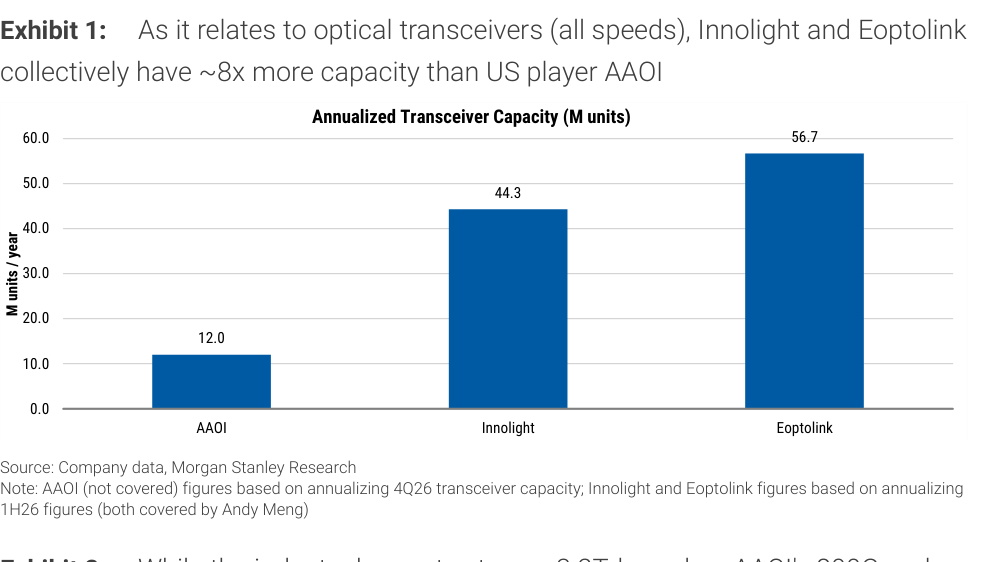
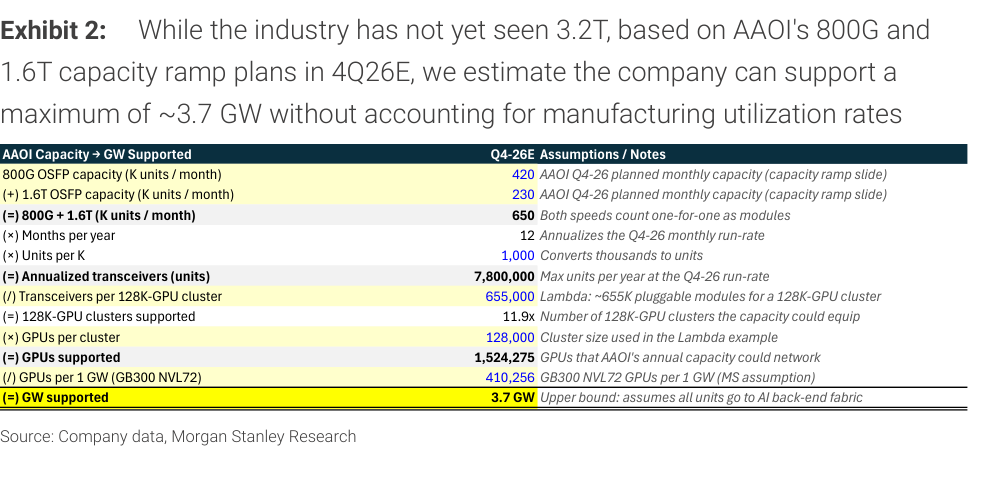

# MS｜FCC 光收發器限制更可能落在 3.2T 世代

**券商**：Morgan Stanley  
**分析師**：Meta A Marshall、Antonio Jaramillo、Daniel K Blake、Andy Meng  
**日期**：2026-10-01  
**主題**：Potential FCC Rules on Optical Transceivers More Likely to Come in at 3.2T  
**評級**：In-Line  
<a href="https://layx.uk/dl?g=產業&b=MS&d=20261001&h=Telecom-Networking-FCC">📎 下載 PDF</a>

---

## 報告總結

MS 策略師近期赴華盛頓 DC 會見 FCC 及出口管制法律團隊後發現，FCC 最可能將限制點設在 3.2T 光收發器，而非現行量產中的 800G/1.6T，使超大規模客戶的現有建置計畫不受干擾。關鍵機制是「65% 美國 BOM 內容門檻」：中國模組廠若採用 Marvell DSP（美製）＋ LITE/COHR 雷射（美製），理論上即可繞過限制繼續出口，代價是被迫放棄中國雷射供應商——令雷射市場持續緊繃，對 LITE/COHR 構成不對稱利好，且不需要它們接下毛利率偏低（mid-30s GM）的模組組裝業務。

---

## MS 完整投資邏輯鏈

| 論點層次 | Exhibit | 內容 |
|---|---|---|
| 瓶頸確認 | Exhibit 1 | 中國廠（Innolight+Eoptolink）年產能 101M 單位，AAOI（美國唯一大型廠）12M 單位，差距 8x；短期內美國無法替代中國供給 |
| 政策框架 | 封面論點 | FCC 鎖定 3.2T 為限制點（不追溯 800G/1.6T），提供約 2 年緩衝期（3.2T 量產預計 2028-2029） |
| 供應鏈重塑路徑 | 封面論點 | 65% 美國 BOM 門檻：中國模組廠需採用美製 DSP（Marvell）＋美製雷射（LITE/COHR）方可符規 |
| 受益排序 | 封面論點 | LITE/COHR 雷射佔比提升→市場緊繃；中國雷射廠失去替代空間；中國模組廠仍可存活但利潤被壓縮 |
| 風險點 | Exhibit 2 | 中國若視規則過於單方面，可能收緊 InP 基板出口，成為雷射產能擴充瓶頸 |
| **結論** | 報告封面 | **FCC 3.2T 限制=雷射市場強讀越（LITE/COHR）；收發器份額重分配效果有限；超大規模客戶建置不受短期衝擊** |

> **報告最大邏輯缺口**：65% BOM 門檻尚屬討論階段（"potentially as soon as October" 仍未正式公布），實際規則文字可能改變閾值，進而影響中國廠商的規避空間。

---

## 報告核心觀點

| 主題 | MS 觀點 | 市場共識 | 是否 Contra-Consensus |
|---|---|---|---|
| 限制目標世代 | 3.2T（非 800G/1.6T） | 市場擔心現行世代也受衝擊 | ✅ 是（限制時點較晚） |
| 中國廠命運 | 可存活，但必須採用美製雷射 | 市場預期中國廠被全面排除 | ✅ 是（更溫和） |
| LITE/COHR 受益方式 | 雷射定價/份額↑（非模組組裝） | 市場可能預期兩者皆拿 | 部分 Contra |
| 近期供應鏈衝擊 | 有限（800G/1.6T 不受影響） | 部分市場擔心立即短缺 | ✅ 是（影響較小） |

**偏好排序**：LITE（雷射→市場緊繃直接受益）= COHR；Innolight/Eoptolink 受衝擊但非消滅。  
**外部供應鏈受益**：JX Advanced Metals 5016 JP（InP 基板）、Sumitomo Electric 5802 JP（CWLD）、Furukawa Electric 5801 JP（DFB 雷射）——若 InP 採購移出中國。

---

## Exhibit 1｜年化收發器產能比較（AAOI vs 中國廠）

### 解讀摘要

AAOI（美國唯一大型收發器廠）年化產能 12.0M 單位，而 Innolight + Eoptolink 合計 101.0M 單位（44.3 + 56.7），差距超過 8 倍。這代表即使 FCC 明天公布 3.2T 限制，現有 800G/1.6T 中國供給在物理上無法被替代——短期政策的效果必然是「塑造下一代供應鏈格局」而非「立即重分配既有份額」，這正是報告論點的物理邊界。

> **原文補充**：AAOI 的 12M 是以 4Q26 月產能年化計算；Innolight（44.3M）與 Eoptolink（56.7M）則以 1H26 實際數字年化，基準期不一致——若 AAOI 尚在爬坡、而中國廠已達穩態，差距或更大於 8x。

### 表格

| 廠商 | 年化產能（M 單位） | 備註 |
|---|---|---|
| AAOI | 12.0 | 4Q26 計畫月產能年化（4Q26E） |
| Innolight | 44.3 | 1H26 年化（由 Andy Meng 覆蓋） |
| Eoptolink | 56.7 | 1H26 年化（由 Andy Meng 覆蓋） |
| **Innolight + Eoptolink 合計** | **101.0** | **AAOI 的 8.4x** |

> **洞察一**：AAOI 年末目標月產能約 650K 單位（即 7.8M/年），MS 估計即使全部導向 AI 後端互連，最多只能覆蓋 3.7 GW 算力（詳 Exhibit 2）——在超大規模客戶年度 capex 規模下，這個數字幾乎不夠格成為替代方案。供應鏈重構必須在 3.2T 世代正式量產前（2028-2029）開始，否則換不了。

---

## Exhibit 2｜AAOI 產能 → 可支撐算力（GW）換算

### 解讀摘要

MS 以 4Q26E 月產能（800G 420K + 1.6T 230K = 650K 單位/月，年化 7.8M）對照 Lambda 128K-GPU 叢集的收發器需求（655K 模組），推算 AAOI 可支撐 11.9 個 128K-GPU 叢集，換算為 1,524K GPU，再除以 GB300 NVL72 的 GPU/GW 比率（410K GPU/GW），得出上限 3.7 GW。這條計算鏈的意義在於：3.7 GW 是假設 AAOI 產能 100% 用於 AI 後端的理論上限，實際因製造稼動率、產品組合等折損後會更低。

### 表格

| 步驟 | 數值 | 說明 |
|---|---|---|
| 800G OSFP 月產能（K 單位） | 420 | AAOI 4Q26 計畫 |
| (+) 1.6T OSFP 月產能（K 單位） | 230 | AAOI 4Q26 計畫 |
| (=) 合計月產能（K 單位） | 650 | 兩速度 1:1 計算 |
| (×) 月數 | 12 | 年化 |
| (×) 每千換算 | 1,000 | 單位轉換 |
| (=) 年化收發器（單位） | 7,800,000 | 4Q26 月速率年化上限 |
| (÷) 每 128K-GPU 叢集收發器數 | 655,000 | Lambda 估算 |
| (=) 可支撐叢集數 | 11.9 | 個 128K-GPU 叢集 |
| (×) 每叢集 GPU 數 | 128,000 | 叢集規模 |
| (=) 可支撐 GPU 數 | 1,524,275 | |
| (÷) 每 1 GW GPU 數（GB300 NVL72） | 410,256 | MS 假設 |
| **(=) 可支撐算力** | **3.7 GW** | **上限（假設全部用於 AI 後端）** |

> **洞察二**：這條換算鏈的最脆弱假設是「每 128K-GPU 叢集需要 655K 收發器」（Lambda 估算）與「GB300 NVL72 GPU/GW 密度 410K」（MS 假設）。前者若隨著 3.2T 採用而改變（每模組頻寬提高 2x，所需模組數可能減半），3.7 GW 上限可能被推高——這對 AAOI 是有利的，但同時也削弱了「美國替代能力不足」這個論點的強度。

> **值得驗證**：65% 美國 BOM 門檻目前仍屬非正式討論（"potentially as soon as October"）。若最終規則門檻降至 50% 以下，中國雷射廠仍有使用空間，LITE/COHR 的雷射定價優勢將縮小；若門檻上調，中國模組廠的規避難度增加，部分份額可能真正流向 AAOI，但受限於 Exhibit 1 展示的產能差距，也不太可能大規模替代。

---

## 相關個股清單

| 類別 | 公司 | Ticker | 評等（MS） | 備註 |
|---|---|---|---|---|
| 美股受益 | Lumentum Holdings | LITE | E | 雷射市場緊繃直接受益；3.2T 限制→中國廠被迫採用 LITE 雷射 |
| 美股受益 | Coherent Corp | COHR | E | 同上；CWLD 產品亦受益 InP 採購移出中國 |
| 美股（不受規則保護） | AAOI | AAOI | 未覆蓋 | 唯一美國大型收發器廠；產能僅中國廠 1/8 |
| 日股受益（InP 外部採購） | JX Advanced Metals | 5016 JP | 未覆蓋 | InP 基板供應，中國限制 InP 出口時受益 |
| 日股受益 | Sumitomo Electric | 5802 JP | 未覆蓋 | CWLD 產品 |
| 日股受益 | Furukawa Electric | 5801 JP | 未覆蓋 | DFB 雷射 |
| 中國受衝擊 | Innolight | （未上市）| — | 年化產能 44.3M，規則後必須採購美製雷射 |
| 中國受衝擊 | Eoptolink | — | — | 年化產能 56.7M，同上 |
