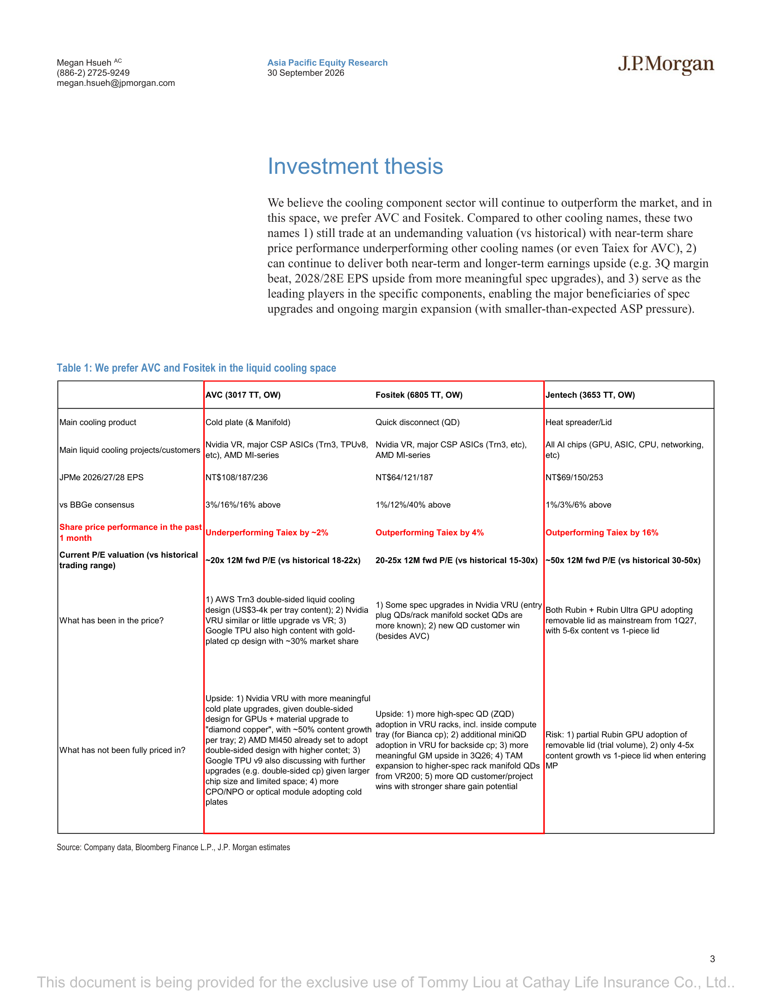
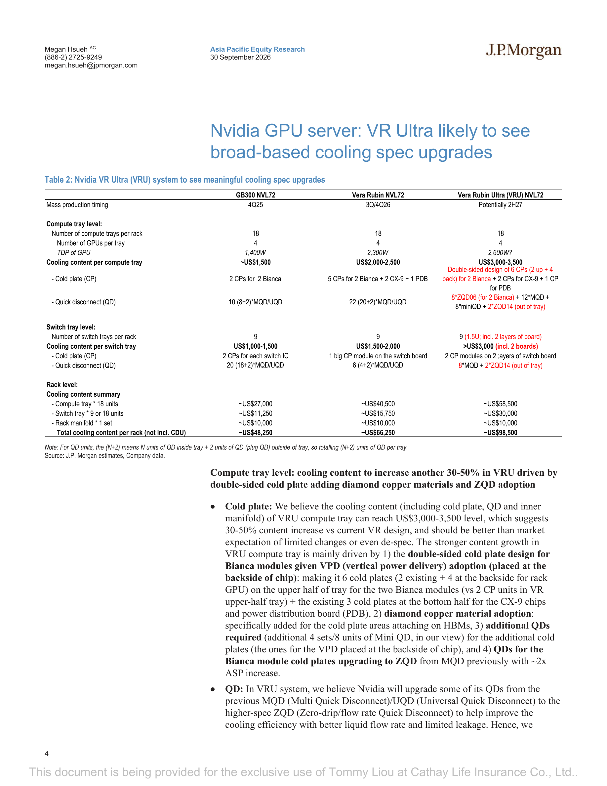
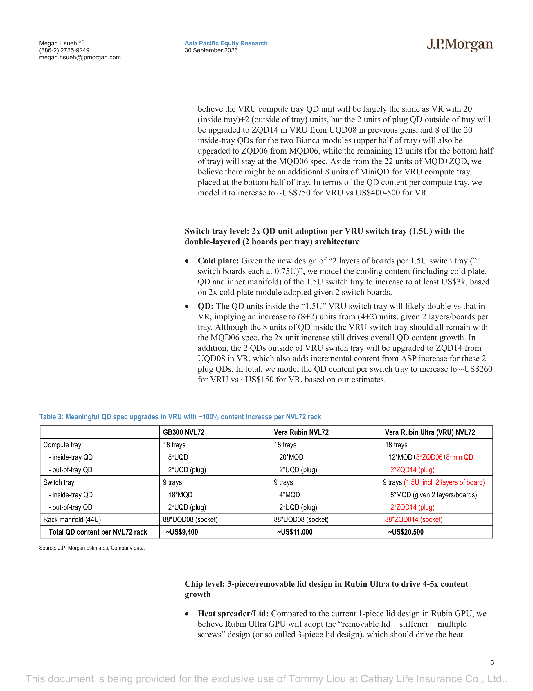
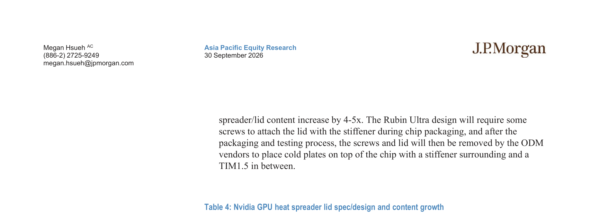
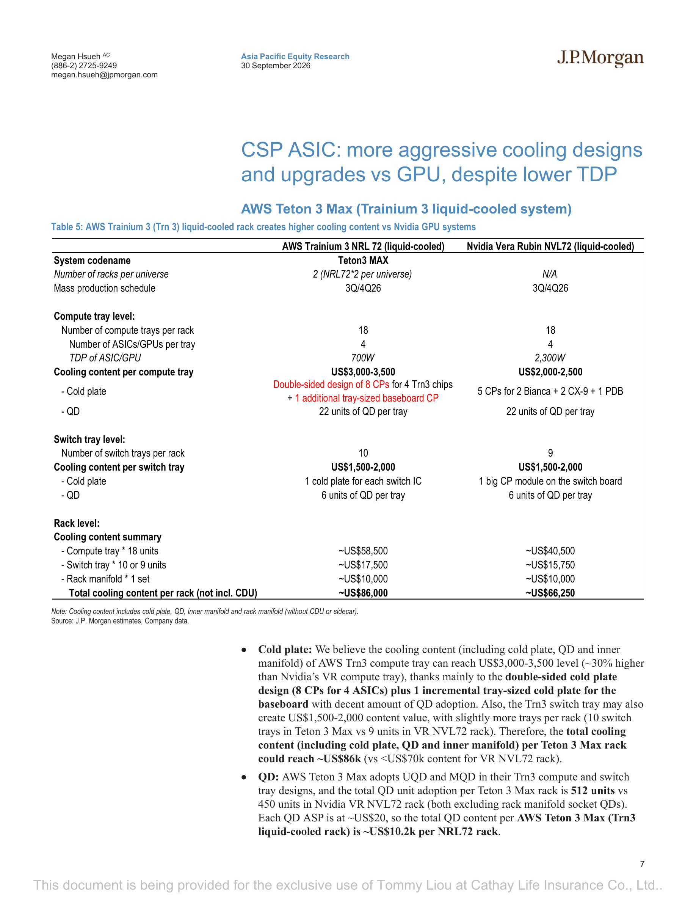
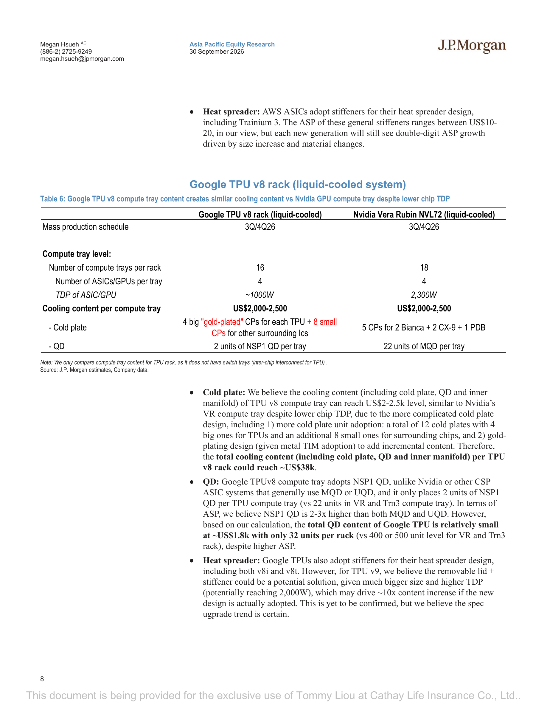

# JPM｜台灣散熱零件：Nvidia VRU 及 ASIC 散熱規格全面升級

**券商**：J.P. Morgan  
**分析師**：Megan Hsueh、Gokul Hariharan、Albert Hung  
**日期**：2026-10-02（封面標示 30 September 2026，系統日期以檔名 20261002 為準）  
**主題**：Taiwan Cooling Components — Accelerating cooling upgrades in Nvidia VRU and ASICs to unlock continued TDP growth  
**評級**：N/A（產業主題報告）  
<a href="https://layx.uk/dl?g=產業&b=JPM&d=20261002&h=Nvidia-VRU-Cooling">📎 下載 PDF</a>

---

## 報告總結

JPM 供應鏈調查顯示，Nvidia Vera Rubin Ultra（VRU）散熱規格升級幅度遠超市場預期——市場此前擔憂降規，但 JPM 估計每機架總散熱 Content（不含 CDU）將從 VR 的 \~\$66k 跳升至 VRU 的 \~\$98.5k（+49%），三大組件同步升級：冷板引入雙面設計＋Diamond Copper 材料、QD 全面換裝 ZQD、導熱蓋改為 3 件式可拆設計（4-5x ASP）。AWS Trn3 和 Google TPU v8 雖 TDP 均低於 Nvidia GPU，散熱 Content 卻持平或更高，顯示 ASIC 系統採更積極冷卻設計是跨平台趨勢。JPM 偏好 AVC（OW）與 Fositek（OW），因估值仍在歷史區間內、2027/28E EPS 上修空間最大，Jentech（OW）雖導熱蓋受益明確但估值已偏高（\~50x）。

---

## JPM 完整投資邏輯鏈

| 論點層次 | Table | 內容 |
|---|---|---|
| 市場認知落差確認 | Table 2 | VRU 市場預期降規或持平，JPM 估計機架 Content +49%（\~\$98.5k vs \$66.3k） |
| 冷板升級機制 | Table 2 | VPD 架構→雙面冷板（6 CPs vs 5 CPs）+ Diamond Copper，計算 tray content +30-50% |
| QD 升級機制 | Table 3 | ZQD 導入（\~2x ASP）+ 單位數增加，VRU 機架 QD Content 翻倍至 \~\$20.5k |
| 導熱蓋升級機制 | Table 4 | 3 件式可拆蓋 4-5x ASP vs Rubin 1 件式，預計 1Q-2Q27 量產 |
| ASIC 平台驗證 | Tables 5-6 | AWS Trn3 機架 \~\$86k、TPU v8 compute tray \$2-2.5k，跨平台均呈積極冷卻設計 |
| 受益排序 | Table 1 | AVC 估值 \~20x（歷史 18-22x）、Fositek 20-25x（歷史 15-30x），JPMe EPS 均大幅高於共識 |
| **結論** | 報告封面 | **AVC + Fositek 同步受益三大升級，估值仍在歷史合理區間，2027/28E EPS 存在上修空間** |

> **報告最大邏輯缺口**：VRU 量產時程仍標示「Potentially 2H27」，若延後或降規，content uplift 落地時間相應推移；ZQD 規格改採範圍（8 units upgrade 到 ZQD06、12 units 維持 MQD06）有可能在最終 BOM 中被壓縮。

---

## 報告核心觀點

| 主題 | JPM 觀點 | 市場共識 | 是否 Contra-Consensus |
|---|---|---|---|
| VRU 冷板規格 | 雙面設計+Diamond Copper，compute tray content +30-50% | 市場預期持平或降規（de-spec） | ✅ 是（更積極） |
| VRU QD 升級幅度 | 機架 QD content ~100% 增加至 \~\$20.5k | 市場知道 entry plug QD/rack manifold 升級，未完全計入 Bianca ZQD06 及 miniQD | ✅ 是（幅度超預期） |
| Rubin Ultra 導熱蓋 | 3 件式可拆蓋無延誤，小量或從 4Q26 Rubin GPU 開始試產 | 市場預期 Rubin + Rubin Ultra 都採可拆蓋 from 1Q27 | ✅ 是（稍提前） |
| ASIC 散熱 vs GPU | AWS Trn3 冷板 Content 高於同期 Nvidia VR（\$3-3.5k vs \$2-2.5k），儘管 TDP 低 | 市場認為 ASIC TDP 低→散熱 Content 低 | ✅ 是（邏輯反直覺） |

**偏好排序**：AVC（OW）＞ Fositek（OW）＞ Jentech（OW，估值偏高）  
**零件偏好**：冷板（AVC）/ Quick Disconnect（Fositek）/ 導熱蓋（Jentech）

---

## Table 1｜AVC vs Fositek vs Jentech 投資論點對照

### 解讀摘要

此表是整份報告投資論點的核心提煉，最關鍵的兩列是「What has been in the price」與「What has not been fully priced in」。AVC 市場已計入 AWS Trn3 雙面冷板（\$3-4k/tray Content）及 Google TPU v8 金鍍冷板，但尚未充分反映 VRU 雙面冷板（\~+50% Content/tray）及 AMD MI450 更高 Content 設計；Fositek 已知 entry plug QD 與 rack manifold socket QD 升規，但市場低估 Bianca ZQD06 計算托盤及 miniQD 的增量、以及 3Q26 毛利率上修潛力；Jentech 市場雖預期可拆蓋主流化，但 Rubin GPU 試產提前（4Q26）可能提供近期業績驚喜，而 AMD MI450 2 件式導熱蓋（\~10x vs MI350）與 CPO/NPO 不鏽鋼加強件需求尚未定價。AVC 的 JPMe EPS 16%/16% 高於共識（2027/28E），是三者中市場認知落差最大的標的。

### 表格

| 項目 | AVC（3017 TT, OW） | Fositek（6805 TT, OW） | Jentech（3653 TT, OW） |
|---|---|---|---|
| 主要散熱產品 | 冷板（& Manifold） | Quick Disconnect（QD） | 導熱蓋/Lid |
| 主要液冷專案/客戶 | Nvidia VR、主要 CSP ASIC（Trn3、TPUv8 等）、AMD MI-series | Nvidia VR、主要 CSP ASIC（Trn3 等）、AMD MI-series | 全 AI 晶片（GPU、ASIC、CPU、網通等） |
| JPMe 2026/27/28E EPS（NT\$） | 108 / 187 / 236 | 64 / 121 / 187 | 69 / 150 / 253 |
| vs BBGe 共識 | +3% / +16% / +16% | +1% / +12% / +40% | +1% / +3% / +6% |
| 近 1 個月股價表現 | 落後大盤 ~2% | 優於大盤 4% | 優於大盤 16% |
| 目前 12M fwd P/E（vs 歷史） | \~20x（歷史 18-22x） | 20-25x（歷史 15-30x） | \~50x（歷史 30-50x） |
| **市場已計入** | AWS Trn3 雙面冷板（\$3-4k/tray）；VRU 類似 VR 或小升；TPU 金鍍冷板（\~30% 市佔） | 部分 VRU 規格升級（entry plug QD/rack manifold QD 較為人知）；新 QD 客戶得標（除 AVC） | Rubin + Rubin Ultra GPU 採可拆蓋，from 1Q27，5-6x vs 1 件式 |
| **市場未充分計入** | VRU 雙面冷板+Diamond Copper（\~+50% Content/tray）；AMD MI450 雙面設計；Google TPU v9 升規；CPO/NPO 採冷板 | ZQD 在 VRU 機架廣泛採用（Bianca 計算托盤）；VRU backside CP 加 miniQD；3Q26 毛利率上修；QD TAM 擴展至高規 rack manifold；更多客戶/專案贏單 | 風險：Rubin GPU 試產量小；進入量產時 Content 僅 4-5x（非 5-6x） |

> **洞察一**：AVC 和 Fositek 的估值均在歷史區間中段偏低位（AVC 20x 在 18-22x 中間；Fositek 20-25x 在 15-30x 偏低位），而 JPMe EPS 分別高出共識 16% 和 12%（2027E）；這意味著「估值沒有提前定價 EPS 上修」的組合，為兩者提供了不對稱的上行空間。Jentech 雖同樣是 OW，但 \~50x 已在歷史高位（30-50x 上緣），upside 更依賴 Rubin GPU 試產如期且 Content 達 5-6x（而非 4-5x 下限）。

---

## Table 2｜Nvidia VRU 散熱規格全面升級

### 解讀摘要

從 GB300 到 VR 到 VRU，每機架總散熱 Content 呈現兩級跳升：\~\$48k → \~\$66k → \~\$98.5k。VRU 的增量主要來自兩個維度：計算托盤引入 VPD 架構（垂直供電）→ Bianca 晶片背面需額外冷板 → 從 VR 的 5 個冷板升至 6 個（2 正面 + 4 背面），加上 Diamond Copper 材料；切換托盤則因「雙層板設計（2 boards per 1.5U tray）」而冷板和 QD 單位數均翻倍（content per tray 從 VR \$1,500-2,000 跳至 VRU >\$3,000），比計算托盤升幅更大。市場此前預期 VRU 散熱 Content 持平或降規，JPM 預估機架合計 +49%，是這份報告最核心的 Contra-Consensus 論點。

> **原文補充**：VRU 機架的 Rack Manifold 維持 \~\$10,000（與 VR 相同），因此機架層面的 Content 升幅完全來自計算托盤（+\$18k）及切換托盤（+\$14.25k）兩層。

### 表格

| 項目 | GB300 NVL72 | Vera Rubin NVL72 | Vera Rubin Ultra（VRU）NVL72 |
|---|---|---|---|
| 量產時程 | 4Q25 | 3Q/4Q26 | 預計 2H27 |
| **計算托盤層級** | | | |
| 計算托盤數/機架 | 18 | 18 | 18 |
| GPU 數/托盤 | 4 | 4 | 4 |
| GPU TDP | 1,400W | 2,300W | 2,600W？ |
| 散熱 Content/計算托盤 | \~\$1,500 | \$2,000-2,500 | **\$3,000-3,500** |
| 　冷板（CP） | 2 CPs for 2 Bianca | 5 CPs for 2 Bianca + 2 CX-9 + 1 PDB | 雙面設計 6 CPs（2 正面 + 4 背面）for 2 Bianca + 2 CPs for CX-9 + 1 CP for PDB |
| 　Quick Disconnect（QD） | 10（8+2）\*MQD/UQD | 22（20+2）\*MQD/UQD | 8\*ZQD06（for 2 Bianca）+ 12\*MQD + 8\*miniQD + 2\*ZQD14（out of tray） |
| **切換托盤層級** | | | |
| 切換托盤數/機架 | 9 | 9 | 9（1.5U；含 2 層板） |
| 散熱 Content/切換托盤 | \$1,000-1,500 | \$1,500-2,000 | **>\$3,000（含 2 塊板）** |
| 　冷板 | 每個 switch IC 2 個 CP | switch board 上 1 個大型 CP module | 2 layers switch board 各 1 個 CP module |
| 　QD | 20（18+2）\*MQD/UQD | 6（4+2）\*MQD/UQD | 8\*MQD + 2\*ZQD14（out of tray） |
| **機架層級合計** | | | |
| 計算托盤 × 18 | \~\$27,000 | \~\$40,500 | \~\$58,500 |
| 切換托盤 × 9（或 18） | \~\$11,250 | \~\$15,750 | \~\$30,000 |
| Rack Manifold × 1 | \~\$10,000 | \~\$10,000 | \~\$10,000 |
| **機架總散熱 Content（不含 CDU）** | **\~\$48,250** | **\~\$66,250** | **\~\$98,500** |

### 增量貢獻拆解（VR → VRU）

| 成長來源 | 貢獻金額 | 佔總增量 |
|---|---|---|
| 計算托盤 Content 升幅（18 trays × \~\$1,000 mid）| +\~\$18,000 | \~56% |
| 切換托盤 Content 升幅（9 trays × \~\$1,583 mid）| +\~\$14,250 | \~44% |
| Rack Manifold（持平） | ±\$0 | 0% |
| **淨增量** | **+\~\$32,250** | **100%** |

> **洞察一**：切換托盤（switch tray）的升幅佔比 44% 是市場最容易低估的部分——因為 VRU 採「1.5U 雙層板設計」，等同於 1 個托盤位上放 2 塊板，每板各有 1 組冷板＋QD；這是一個「設計改變即翻倍」的結構性升幅，與計算托盤的「VPD 架構增加背板冷板」性質相同，但後者受到更多討論。

> **值得驗證**：VRU 量產時程標示「Potentially 2H27」，計算托盤冷板的雙面設計亦源自 VPD 架構確認。若 Nvidia 最終決定 VRU 不採 VPD（或推遲），雙面冷板驅動的 \~\$18k 增量可能延後落地，影響 AVC 2027/28E EPS。

---

## Table 3｜VRU QD 規格升級：機架 Content 增約 100%

### 解讀摘要

VRU 機架的 QD 升級同時走「ASP 升級」與「單位數增加」雙軌：計算托盤的 Bianca 模組 QD 從 MQD06 升至 ZQD06（\~2x ASP），並額外新增 8 個 miniQD；切換托盤 QD 單位數因雙層板設計翻倍（4→8 個）；Rack Manifold socket QD 則從 88 個 UQD08 全數升至 ZQD14。三層同步升級使機架 QD Content 從 VR 的 \~\$11k 跳至 VRU 的 \~\$20.5k（+86%），接近「翻倍」。市場此前已知 entry plug QD 及 rack manifold socket QD 升規，但未完全計入計算托盤 Bianca 模組的 ZQD06 及 miniQD 增量——這正是 Fositek 被認為有 upside 的關鍵。

### 表格

| 項目 | GB300 NVL72 | Vera Rubin NVL72 | Vera Rubin Ultra（VRU）NVL72 |
|---|---|---|---|
| **計算托盤（18 trays）** | | | |
| 　托盤內 QD | 8\*UQD | 20\*MQD | 12\*MQD + 8\*ZQD06 + 8\*miniQD |
| 　托盤外 QD（plug） | 2\*UQD | 2\*UQD | 2\*ZQD14 |
| **切換托盤（9 trays）** | | | |
| 　托盤內 QD | 18\*MQD | 4\*MQD | 8\*MQD（因 2 層板） |
| 　托盤外 QD（plug） | 2\*UQD | 2\*UQD | 2\*ZQD14 |
| **Rack Manifold（44U）** | 88\*UQD08（socket） | 88\*UQD08（socket） | 88\*ZQD014（socket） |
| **機架 QD Content 合計** | **\~\$9,400** | **\~\$11,000** | **\~\$20,500** |

> **洞察一**：ZQD 定義為「Zero-drip/flow rate Quick Disconnect」，相比 MQD 可提供更佳液流速率並幾乎無洩漏——這是允許更高 TDP（更大液冷流量）的關鍵元件，ZQD 採用率的提升因此是整個 TDP 成長路徑的「解鎖條件」之一，不只是 ASP 升幅問題。

> **洞察二（配合 Table 2）**：機架 QD Content 從 \~\$11k 升至 \~\$20.5k（+\$9.5k），佔機架散熱總增量 \$32.25k 的 \~29%；冷板相關升幅佔剩餘約 71%。QD 雖佔比較小，但 Fositek 幾乎 100% 集中於此單一元件，意味著 Fositek 的 Content uplift 完全由這 +\$9.5k 的機架 QD 升幅捕捉。

---

## Table 4｜Nvidia GPU 導熱蓋規格升級：4-5x ASP

### 解讀摘要

導熱蓋（Heat Spreader/Lid）的升級是三大組件中 ASP 增幅最大的：從 B300 的 0.6x、到 Rubin 的 1x（size increase），到 Rubin Ultra 的 4-5x。「3 件式可拆蓋」設計（removable lid + stiffener + multiple screws）的物理意義在於：晶片封裝與測試後需拆蓋才能在 ODM 端安裝冷板，整個流程需要更精密的鎖固機構與 TIM1.5 介面材料，因此材料複雜度與 Content 大幅提升。JPM 指出 Rubin GPU 可能提前在 4Q26 試產（市場預期 1Q27 才採可拆蓋），若屬實則可能帶來 Jentech 4Q26/1Q27 業績上行驚喜。

### 表格

| 項目 | B300 | Rubin | Rubin Ultra |
|---|---|---|---|
| 導熱蓋設計 | 1 件式 lid | 1 件式 lid（尺寸增大） | 可拆蓋 + 加強件 + 多螺絲（3 件式） |
| ASP/Content（以 Rubin = 1x 為基準） | 0.6x | 1x | 4-5x |
| 量產時程（以導熱蓋計） | 4Q25 | 2Q26 | 預計 1Q-2Q27 |

> **洞察一**：4-5x ASP 升幅中，「可拆」本身只是使用場景的改變——真正的 Content 升幅來自：1) 需要 stiffener 零件（額外工件），2) 多顆螺絲機構，3) TIM1.5（取代一般 TIM）帶來的材料升級，以及 4) 更大的蓋體面積（Rubin Ultra die size 更大）。JPM 估計 4-5x 而非更高，隱含假設 Rubin 1 件式蓋的 ASP 水位已因 size increase 有所提升（vs B300 的 0.6x），Rubin Ultra 的 4-5x 是在此更高基礎上再乘。

> **值得驗證**：「Potentially 1Q-2Q27」量產時程、且小量試產可能從 4Q26 開始——JPM 注記此判斷來自 industry check，尚未被 Jentech 本身確認。若 4Q26 試產量體不足以推動营收，Jentech 的近期業績驚喜效果有限。

---

## Table 5｜AWS Trainium 3：低 TDP ASIC 散熱 Content 超越 Nvidia VR

### 解讀摘要

AWS Trainium 3（Trn3）系統（Teton 3 MAX）的計算托盤散熱 Content 達 \$3,000-3,500——反而高於同期 Nvidia VR 的 \$2,000-2,500，儘管 Trn3 TDP 只有 700W（vs VR 2,300W）。原因在於冷板設計更複雜：每個計算托盤 8 個雙面冷板（4 個 ASIC × 2）加上 1 個 tray-sized baseboard CP，共 9 個冷板單元（vs VR 的 5 個）。這驗證了 JPM 的核心觀點：ASIC 的散熱設計「積極程度」與 GPU TDP 解除連結，設計複雜度才是驅動 Content 的主因。整個 Teton 3 MAX 機架散熱 Content 達 \~\$86k，高於 Nvidia VR 機架的 \~\$66.25k。

> **原文補充**：AWS Trn3 每個機架共 2 個 NRL72，形成一個「universe」，因此實際建設規模是以 2 機架為單位，這可能影響 AVC 接單的 lot size 計算。Trn3 每個機架 10 個切換托盤（vs VR 9 個），也提供額外的 QD 增量。

### 表格

| 項目 | AWS Trainium 3 NRL 72（液冷）| Nvidia Vera Rubin NVL72（液冷）|
|---|---|---|
| 系統代號 | Teton3 MAX | — |
| 每 universe 機架數 | 2（NRL72 × 2） | N/A |
| 量產時程 | 3Q/4Q26 | 3Q/4Q26 |
| **計算托盤層級** | | |
| 計算托盤數/機架 | 18 | 18 |
| ASIC/GPU 數/托盤 | 4 | 4 |
| TDP | 700W | 2,300W |
| 散熱 Content/計算托盤 | **\$3,000-3,500** | \$2,000-2,500 |
| 　冷板 | 雙面設計 8 CPs（4 Trn3 各 2 面）+ 1 baseboard CP | 5 CPs for 2 Bianca + 2 CX-9 + 1 PDB |
| 　QD | 22 units/托盤 | 22 units/托盤 |
| **切換托盤層級** | | |
| 切換托盤數/機架 | 10 | 9 |
| 散熱 Content/切換托盤 | \$1,500-2,000 | \$1,500-2,000 |
| 　冷板 | 每個 switch IC 1 個冷板 | switch board 上 1 個大型 CP module |
| 　QD | 6 units/托盤 | 6 units/托盤 |
| **機架層級合計** | | |
| 計算托盤 × 18 | \~\$58,500 | \~\$40,500 |
| 切換托盤 × 10 or 9 | \~\$17,500 | \~\$15,750 |
| Rack Manifold × 1 | \~\$10,000 | \~\$10,000 |
| **機架總散熱 Content（不含 CDU）** | **\~\$86,000** | **\~\$66,250** |

> **洞察一**：AWS Trn3 的 QD 每機架 512 個（不含 rack manifold socket QD），高於 Nvidia VR 的 450 個；每個 QD ASP 約 \$20，Trn3 機架 QD Content 約 \$10.2k。Fositek 若同時切入 AWS Trn3 QD 供應，其 per-rack QD Content 已接近 Nvidia VR 水準，Volume 擴充對 Fositek 的貢獻與 Nvidia 相當。

---

## Table 6｜Google TPU v8：複雜冷板設計令散熱 Content 與 GPU 持平

### 解讀摘要

Google TPU v8（Axion v8）計算托盤的散熱 Content 達 \$2,000-2,500，與 Nvidia VR 持平——但 TDP 只有 \~1,000W（vs VR 2,300W）。這是因為 TPU v8 採「金鍍冷板（gold-plated CP）+ 金屬 TIM」設計，每托盤 4 個大型金鍍 CP（各對應 1 個 TPU）加上 8 個小型 CP（用於周邊 IC），共 12 個冷板單元，複雜度遠超 Nvidia VR 的 5 個。不過 TPU v8 的 QD 設計截然不同：採用 NSP1 規格（2-3x ASP vs MQD），但每托盤只有 2 個，整機架僅 32 個 QD（vs VR 400+），因此整體 QD Content 反而極小（\~\$1.8k），不利 Fositek 在 TPU 平台佈局。TPU v9 若採可拆蓋（TDP 預計達 \~2,000W），Content 可能 \~10x 升幅，但尚未確認。

### 表格

| 項目 | Google TPU v8 rack（液冷）| Nvidia Vera Rubin NVL72（液冷）|
|---|---|---|
| 量產時程 | 3Q/4Q26 | 3Q/4Q26 |
| **計算托盤層級** | | |
| 計算托盤數/機架 | 16 | 18 |
| ASIC/GPU 數/托盤 | 4 | 4 |
| TDP | \~1,000W | 2,300W |
| 散熱 Content/計算托盤 | **\$2,000-2,500** | \$2,000-2,500 |
| 　冷板 | 4 個大型金鍍 CP（各對應 1 TPU）+ 8 個小型 CP（周邊 IC） | 5 CPs for 2 Bianca + 2 CX-9 + 1 PDB |
| 　QD | 2 units NSP1 QD/托盤 | 22 units MQD/托盤 |
| 備注 | TPU rack 無切換托盤（晶片間互連整合於 TPU 本身） | — |

> **洞察一**：TPU v8 QD 設計（2 個 NSP1/托盤）與 Nvidia/AWS 的設計（22 個/托盤）差距極大——32 個 vs 400-500 個，且 AVC 是否有 TPU v8 的 QD 供應份額尚未明朗。這意味著 Fositek 在 TPU 平台的增量幾乎為零，其受益路徑高度集中在 Nvidia + AWS ASIC 兩個平台。

> **洞察二（配合 Table 5）**：從三個平台（VRU / Trn3 / TPU v8）的計算托盤 Content 比較：Trn3 >\$3k > VRU \$3k > TPU v8 = VR \$2-2.5k，顯示 ASIC 系統未必因 TDP 低而 Content 低——Trn3 更積極的雙面冷板設計使其超越同期 GPU 系統。散熱 Content 驅動力已從「TDP 高低」轉向「冷板設計複雜度」，這是報告最核心的產業結構性洞察。

---

## 跨 Table 彙整表

### 彙整 1｜三大 AI 平台機架散熱 Content 比較（Table 2/5/6）

| 平台 | 世代 | 量產時程 | 計算托盤 Content | 切換托盤 Content | Rack Manifold | **機架合計** |
|---|---|---|---|---|---|---|
| Nvidia GB300 NVL72 | 現行 | 4Q25 | \~\$27,000（18 trays） | \~\$11,250（9 trays） | \~\$10,000 | **\~\$48,250** |
| Nvidia VR NVL72 | 次世代 | 3Q/4Q26 | \~\$40,500（18 trays） | \~\$15,750（9 trays） | \~\$10,000 | **\~\$66,250** |
| AWS Trn3 NRL 72 | 次世代 | 3Q/4Q26 | \~\$58,500（18 trays） | \~\$17,500（10 trays） | \~\$10,000 | **\~\$86,000** |
| Google TPU v8 rack | 次世代 | 3Q/4Q26 | \~\$38,000（16 trays）* | N/A（無切換托盤） | 未揭露 | **\~\$38,000**\* |
| Nvidia VRU NVL72 | 次次世代 | 預計 2H27 | \~\$58,500（18 trays） | \~\$30,000（9 trays） | \~\$10,000 | **\~\$98,500** |

\* TPU v8 total rack \~\$38k 為 JPM 推算（僅計算托盤，不含切換托盤）

> **跨平台洞察**：同期量產（3Q/4Q26）的三個系統中，AWS Trn3 (\~\$86k) > Nvidia VR (\~\$66k) > Google TPU v8 (\~\$38k)，三者差距極大。主要驅動是「切換托盤有無」（TPU 無切換托盤，其 inter-chip 互連用光纖/電纜，不需液冷切換托盤）以及「計算托盤冷板設計複雜度」。AVC 在三大平台均有佈局（冷板），但 TPU 平台 Content/機架 遠低於另外兩個；Fositek 的 TAM 高度集中在 Nvidia + AWS（TPU QD 幾乎無份額）。

---

## 相關個股清單

| 類別 | 公司 | Ticker | 評等（JPM） | 備註 |
|---|---|---|---|---|
| 冷板 & Manifold | 亞力（Asia Vital Components） | 3017 TT | OW | 冷板市場份額領先；VRU/Trn3/TPUv8 均有佈局；估值 \~20x（歷史 18-22x） |
| Quick Disconnect | 訊凱（Fositek） | 6805 TT | OW | ZQD 升級直接受益；3Q26 GM upside；20-25x（歷史 15-30x） |
| 導熱蓋/Lid | 鈤新（Jentech） | 3653 TT | OW | 3 件式可拆蓋 4-5x ASP；AMD MI450 2 件式蓋（\~10x vs MI350）；\~50x 估值偏高 |
