# Aletheia Capital｜Advanced Materials – PCB & CCL「Goldilocks」

**券商**：Aletheia Capital  
**分析師**：Shaotang Lee、Warren Lau、Skye Chen  
**日期**：2026-10-05  
**主題**：PCB/CCL 產業復盤覆蓋 — Google TPU 供應鏈主導 2027/28 成長  
**評級**：N/A（無整體 Industry View；個股全 Buy）  
<a href="https://layx.uk/dl?g=產業&b=Aletheia&d=20261005&h=PCB-CCL">📎 下載 PDF</a>

---

## 報告總結

Aletheia 復盤覆蓋 PCB/CCL 產業，主題為「Goldilocks」（剛剛好的環境：量增＋升規＋供給緊缺三者並存），核心論點是 Google TPU 供應鏈將在 2027/28 帶來最強且最具持續性的 PCB/CCL 需求成長——TPU 出貨量預計從 2026 年 3.6m 三倍增至 2028 年 12m，同時每代 PCB 含量金額翻倍至五倍。此時發報告的催化劑是 Google 在 Hot Chips 大會（8月底）公開 TPU V8/V9 網路架構細節，以及供應鏈 LTA 討論明顯加速，令需求能見度顯著提升。

主要投資結論：供給瓶頸（設備交期36個月、上游材料短缺）短期無解，CSP prepayment + LTA 討論已在進行，類比記憶體 LTA 帶動估值重估；偏好 EMC（CCL 領導地位＋ASIC 份額擴張）、ISU Petasys（Google TPU PCB 50%+曝險）、TTM（美國 AI server + A&D 稀缺性）。

---

## Aletheia Capital 完整投資邏輯鏈

| 論點層次 | Exhibit | 內容 |
|---|---|---|
| 需求信號 | Fig 1 | Google Cloud backlog 達 \$520bn（2Q26），YoY 加速至 400%+；可見度最高的 CSP |
| 量增 | Figs 2, 4 | TPU 3.6m→12m（2026-28E，3.3x）；GPU+ASIC 全市場 15m→34m（50% CAGR） |
| 單位含量升值 | Figs 3A/3B | PCB compute tray：V7→V10 升 4.2x；networking tray：100G→1600G 升 18.5x |
| 規格升級路徑 | Figs 9, 10 | TPU V8→V9 總晶片數 11→24（含 EMIB-T 轉型）；PCB 層數 26→40+L，ASP 指數 1.3→2.5 |
| 供給瓶頸 | Figs 14, 18 | 設備（鑽孔機）交期長達 36 個月；mSAP 1.6T 起成標準，SCC/ZDT/Unimicron 為關鍵受益 |
| LTA 重估邏輯 | Fig 15 | 記憶體 LTA 先例：Samsung/Micron/SNDK 均 3-5 年合約 + prepayment；PCB/CCL LTA 討論啟動 |
| 受益排序 | 封面 | **EMC（CCL 定價權）> ISU（Google PCB 最高曝險）> TTM（美國 A&D 護城河）** |
| **結論** | 封面 | **量增×升規×LTA 三重催化；2028E EPS 成長 CAGR 50%+，估值重估空間顯著** |

> **報告最大邏輯缺口**：TPU LTA 細節（prepayment 比例、合約期限）未披露，僅基於供應鏈 channel check，若 LTA 延遲落地則 P/E 重估論點需重評。

---

## 報告核心觀點

| 主題 | Aletheia 觀點 | 市場共識 | 是否 Contra-Consensus |
|---|---|---|---|
| Google TPU 重要性 | TPU 是 PCB/CCL 最大成長驅動，超越 NVDA GPU | 市場多聚焦 NVDA GPU | ✅ |
| 內容金額成長 | V7→V10 PCB compute tray 升 4.2x；網路板升 18.5x | 市場主要看層數增加 | ✅ 幅度更大 |
| LTA 討論進度 | 主動討論中，為新常態；類比記憶體模式 | 市場低估 LTA 潛力 | ✅ |
| mSAP 普及時程 | 800G optional，1.6T 起強制；SCC/ZDT/Unimicron 受益 | 市場對 mSAP 應用場景模糊 | ✅ |
| PTFE 材料前景 | 非近期主流（良率低、成本高）；Nvidia 測試中，1H27 更有能見度 | 部分人士過度看好 PTFE | ✅ 偏保守 |
| CPO 影響 | 主要衝擊 CCL 而非 PCB；非即時威脅（CPO 設計未定型） | CPO 被視為 PCB 負面 | ✅ 衝擊有限且滯後 |

**偏好排序**：EMC（CCL 定價最高、ASIC 份額擴） > ISU Petasys（Google 純度最高） > TTM（US A&D + N+M）  
**個股 TP**：EMC TWD10,000（+93%）｜ISU KRW270,000（+123%）｜TTM USD236（+79%）

---

## Fig. 1｜Google Compute Cloud Services 訂單積壓（\$ bn）

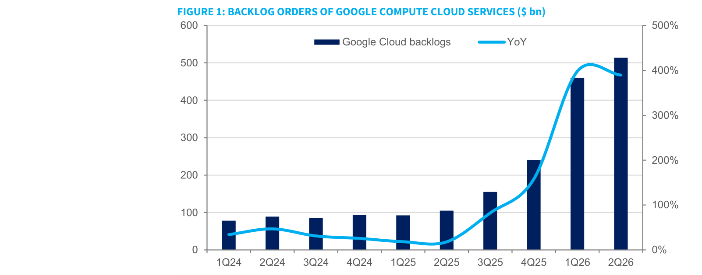

### 解讀摘要

Google Cloud 訂單積壓從 1Q24 的 \$75bn 加速至 2Q26 的 \$514bn，YoY 增速高達 400%+，是所有主要 CSP 中可見度最高的訂單指標。這不只是需求信號——\$520bn 的 backlog 意味著 Google 已向供應商做出承諾式的前向需求確認，為 PCB/CCL 廠商洽談 LTA 提供了最強的合約依據。

> **原文補充**：TPU 量預計包含 Google 內部部署及以 ASIC 服務名義向第三方 AI 實驗室（Anthropic、OpenAI）的分配份額。

---

## Fig. 2｜Google TPU 出貨量預估（百萬顆）

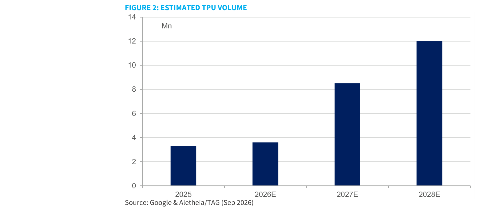

### 解讀摘要

TPU 出貨量從 2025 的 3.3m 到 2026E 持平於 3.6m 後加速——2027E 8.5m（+136% YoY），2028E 12m（+41% YoY）。兩年合計成長 3.3x，且高成長期在 2027 而非 2028（斜率最陡）。關鍵是 Aletheia 計入了 Anthropic（使用 AVGO-made TPU V8i/V8.5）和 OpenAI（使用 AMD + AVGO ASIC）的出貨，這使 TPU「生態系」比 Google 自用量大得多。

> **洞察一**：V8.5（Whalefish）等同 2x V8i（Sunfish），12m 中有部分來自 Anthropic 的 V8.5 需求計入 TPU volume——PCB/CCL 受益的是整個生態系出貨，不限 Google 內部。

---

## Figs. 3A + 3B｜PCB 含量金額升幅（倍率）

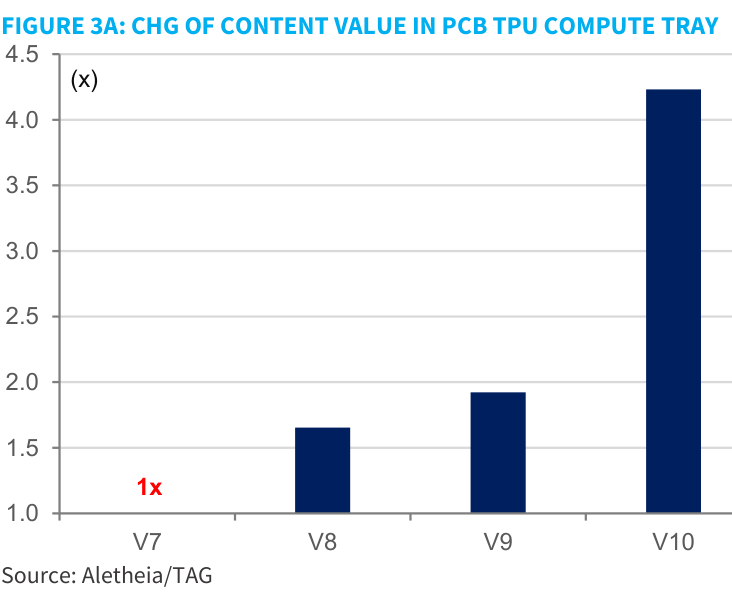
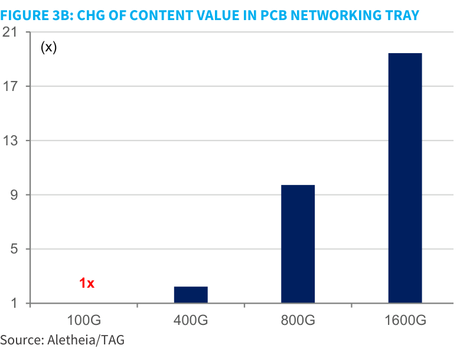

### 解讀摘要

Compute tray（含 TPU 本體）：V8 是 V7 的 1.65x，V9 升至 1.93x，V10 大幅跳升至 4.2x。Networking tray（交換器）升幅更猛：100G 基準→400G 1.3x→800G 9.2x→1600G 18.5x。Networking tray 的跳升幅度（18.5x）遠超 compute tray（4.2x），且 networking 時程更早（800G 已在 2Q26 量產），意味著 **switch PCB/CCL 的需求爆發比 TPU 計算板早了 1-2 個季度**。

### 增量貢獻拆解

| 成長向量 | 驅動機制 | 幅度 |
|---|---|---|
| 層數增加（compute） | V8→V9：26L→32-34L（N+M）；V10：HDI | +18-31% ASP |
| CCL 材料升級 | V8：M8 signal + M6 power；V9/10：M8/M9/M10 | ASP 雙倍效果（每代+100%）|
| Networking 頻寬升級 | 100G→800G：層數 12-18L→36-40L，CCL M6→M8 | PCB ASP \$180→\$1,500-2,000（+733%） |
| V10 HDI 升級 | 首次啟用 HDI，reticle 15x，TDP 10kW | V10 ASP 指數 ~5-6x vs V8 |

> **洞察二**：PCB 含量升幅中 CCL 材料升級的貢獻（每代 ASP 雙倍）與層數增加的貢獻幾乎等量——這意味著 CCL 廠商（EMC）不能被僅視為 PCB 的附屬品，而是獨立的 ASP 驅動力。

---

## Fig. 4｜GPU & ASIC 出貨量預估（百萬顆）

### 解讀摘要

GPU+ASIC 整體市場 2025-2028E CAGR ~50%，至 2028E 達 34.4m 單位。成長主力從 NVDA（7.6→11.4m，增 50%）轉移至 Google TPU（3.6→12m）及 OpenAI ASIC（0.2→3.5m）。特別值得注意的是 Anthropic 的 Trainium（1.6→2.0m，由 AVGO 代工）——Aletheia 估計 Anthropic 的算力在 CY28 可達 13GW，而 TPU V8.5 是核心供給來源。

### 表格

| 廠商 | 2025 | 2026E | 2027E | 2028E | 備註 |
|---|---|---|---|---|---|
| NVDA | 5.4 | 7.6 | 9.5 | 11.4 | CY27 約 1m 顆 GB300 量產；CY28 含 Rubin Ultra/Feynman |
| 　-Rubin | - | 2.0 | 6.5 | TBD | |
| 　-Rubin Ultra | - | - | 2.0 | 1.5 | |
| AMD | 1.9 | 1.6 | 2.0 | 3.0 | OAI 和 Anthropic 最近上調 CY28 訂單 |
| Google TPU | 3.3 | 3.6 | 8.5 | 12.0¹ | 含 Anthropic via AVGO；V8.5=2x V8i |
| 　-V8i+t | - | 1.0 | 8.2 | 10.5 | |
| 　-V9 | - | - | - | 1.5 | V9 HVM mid-28E |
| Trainium | 1.9 | 1.6 | 2.0 | 2.0 | T4 TBD |
| OpenAI | - | 0.2 | 1.0 | 3.5 | CY27/28 部署 1.3/5GW（Jalapeno via AVGO） |
| MTIA | 0.2 | 0.2 | 0.7 | 2.0 | MTIA400/450 CY27/28 有意義放量 |
| Others | 0.2 | 0.2 | 0.3 | 0.5 | Maia300/400 等 |
| **Total** | **12.9** | **15.0** | **24.0** | **34.4** | **~50% CAGR CY26-28E** |

¹ 注：V8.5 (Whalefish) 相當於 2x V8i (Sunfish)；CY28 10GB 部署 = 6.5m 顆 V8.5。

> **洞察三**：NVDA 出貨從 2025 到 2028 僅增 ~2x（5.4→11.4m），而 Google TPU 增 3.6x，OpenAI ASIC 增 17.5x——PCB/CCL 增量需求主體已從 NVDA GPU 供應鏈轉向 ASIC 供應鏈（ISU/EMC/TTM）。

---

## Figs. 5A + 5B｜GPU & ASIC 規格及 Multi-rack 對比

### 解讀摘要

Fig 5A 和 5B 揭示 TPU 在 TDP 和封裝複雜度上的快速升級路徑，是 PCB 含量成長的根本驅動：TPU V8i 的 TDP 僅 600W，V9 跳升至 4,500W（+650%），V10 達 10,000W（另增 120%）。同時 HBM 密度從 8x12-Hi HBM3E 升至 12x8-Hi HBM4E（V9），再到 16x HBM4E（V10）。PCB 必須支撐這個複雜度，層數和材料等級必然跟進。

### Fig 5A — 選定 GPU/ASIC 規格對比

| 規格 | Rubin | Rubin Ultra（Dual-die） | MI500³（Quad-die） | TPU V8i（Sunfish） | TPU V9（Humufish） | OpenAI（Jalapeno） |
|---|---|---|---|---|---|---|
| Logic | 2xN3 | 2xN3 | 4xN2+2xN3 | 2xN3P | 4xN2P+4xN3P | 1xN3P |
| I/O | 1xN3+1xN4 | 1xN3+1xN4 | 4xN3 | 1xN3E | 4xN3P | 1xN3E |
| HBM | 288GB/4 | 192GB/4² 或 256GB/4E | 512GB/4E³ | 288GB/3E | 384GB/4E | 216GB/4 |
| Bandwidth | 21TB/s | 21/32TB/s | Up to 66TB/s | 10-15TB/s | Up to 49TB/s | 15.4TB/s |
| TDP | 2.3kW | 2.6kW | 4.5-5kW | 600W | 4-5kW | 700W |
| FP4 | 50PFLOPs | <50PFLOPs | ~100PFLOPs | 10.1PFLOPs | N.A. | 13.4PFLOPs |
| HVM | 2H26 | 2H27 | 4Q27 | 4Q26 | Mid-28 | 4Q26 |

### Fig 5B — Multi-rack 系統對比

| 規格 | Rubin | Rubin Ultra（Dual-die） | MI500³（Quad-die） | TPU V8i（Sunfish） | TPU V9（Humufish） | OpenAI（Jalapeno） |
|---|---|---|---|---|---|---|
| Scalability | 576¹ | 576¹ | 512 | 1,152 | 1,600⁴ | 2,048 |
| Networking | Spectrum-X | Spectrum-X | T100 or S1 G300 | ICI | ICI | TH6 |
| System compute | 29EFLOPs | <29EFLOPs | 51EFLOPs | 12EFLOPs | N.A. | 27EFLOPs |
| System memory | 166TB⁵, 12PB/s | 111-147TB⁵, ~20PB/s | 262TB, 34PB/s | 332TB, 17PB/s | 614TB, 78PB/s | 432TB, 32PB/s |
| Device/tray Tray/rack | 4/18 | 4/18 | 1/16 | 4/8 | N.A. | 8/16 |
| Rack/pod | 8 | 8 | 32 | 36 | N.A. | 16 |
| TDP/rack | 225kW | 260kW | ~100kW | <80kW | N.A. | ~125kW |
| Rack HVM | 1H27 | 1H28 | 1H28 | Mid-27 | 2H28 | 2H27 |

> **洞察四**：TPU V9 系統有 1,600 顆規模的 scalability（vs Rubin Ultra 576），且記憶體帶寬達 78PB/s（vs Rubin Ultra ~20PB/s）——這說明 Google 在推出 V9 時針對的是超大規模 AI 叢集，對 PCB/CCL networking 需求量的拉動將遠大於 Nvidia 的 per-rack 數字。

---

## Fig. 6｜PCB/CCL 規格與關鍵供應商（各 GPU/ASIC 平台）

### 解讀摘要

這是全報告最關鍵的供應商矩陣：EMC 在幾乎所有下一代平台（TPU V8-V9、Amazon Trn3/4、AMD MI500）的 CCL 供應鏈都出現，且以 M8/M8.5/M9 高端材料為主。PCB 方面，ISU 在 Google TPU（32L M+M 和 34L N+M）的出現是投資 EMC+ISU 論點的核心證據。TTM 負責 Nvidia 的 LPU（52L、M9/M8），但這張圖中沒有列出，顯示 TTM 的 Google 曝險較低。

### 表格

| 客戶 | 代碼名稱 | 時程 | PCB 規格 | PCB 供應商 | CCL 規格 | CCL 供應商 |
|---|---|---|---|---|---|---|
| **Nvidia** | GB200 | 1H25 | 22L HDI + 24L（switch） | VGT, Unimicron; VGT, TTM, Unimicron（switch） | M8/M4; M8/M2（switch） | Doosan, Shengyi, EMC; Doosan, Shengyi, EMC（switch） |
| | GB300 | 1H26 | 22L HDI + 24L（switch） | VGT, Unimicron; VGT, TTM, Unimicron | M8/M4; M8/M2（switch）; M8/M4 | Doosan, Shengyi, EMC |
| | Vera Rubin | 2H26 | 26L HDI; 32L（switch）; 44L（mid-plane） | VGT, Unimicron, ZDT; VGT, WUS, TTM, Unimicron（switch） | M8/M4; M8（switch）; M8（mid-plane） | Doosan, Shengyi, EMC; Doosan, Shengyi, EMC（switch） |
| | Rubin Ultra | 2H27 | 30L HDI; 32L（switch）; 44L（mid-plane） | VGT, Unimicron, ZDT; VGT, WUS, TTM, Unimicron, SCC | M8/M6; M8/M9+PTFE（switch）; M9（mid-plane） | Doosan, Shengyi; EMC/Taiflex（switch） |
| **Google** | TPU v7 Ironwood | 1H26 | 26L | ISU, LCS, WUS, TTM | M7 | Panasonic, EMC |
| | TPU v8i Sunfish | 4Q26 | 32L M+M | ISU, LCS, WUS, TTM, Dynamic | M8/M6 | Panasonic, EMC, Nanya |
| | TPU v8t Zebrafish | 1Q27 | 34L N+M | ISU, LCS, WUS, TTM, GCE, Dynamic | M8/M6 | Panasonic, EMC, Doosan |
| | TPU v9 Humufish | 2028 | HDI | ISU, LCS, WUS, TTM, Unimicron, Dynamic | M9/M8 | Panasonic, EMC, Doosan |
| **Amazon** | Trainium 2e | 1H26 | 26L | GCE, Shengyi, FHT | M8 | EMC, TUC |
| | Trainium 3 | 2H26 | 26L/40L + 22L（switch） | GCE, Shengyi, FHT, WUS, ZDT | M8 | EMC, TUC |
| | Trainium 4 | 2H27 | 34L; 30L（switch） | GCE, Shengyi, ZDT | M9? | EMC, TUC, Nanya |
| **AMD** | MI450 | 4Q26 | 48L | SCC（major）, Unimicron, Dynamic | M8 | EMC, Doosan |
| | MI500 | 4Q27 | 48-52L | SCC（major）, Unimicron, Dynamic | M9 | EMC, Doosan |
| **OpenAI** | Jalapeno | 4Q26 | 40L | GCE and others | M8? | EMC, Doosan |

> **洞察五**：EMC 是唯一在 Google TPU（V7→V9）、Amazon Trainium（2e→4）、AMD MI500、OpenAI Jalapeno 全部平台都出現的 CCL 供應商——形成事實上的 M8/M9 材料壟斷地位，LTA 討論若成真對 EMC 估值重估幅度最大。

---

## Fig. 7｜Nvidia LPU PCB/CCL 供應鏈

Nvidia LPU 單獨列出：晚 2H26 量產，52L 多層板，M9/M8 材料，PCB 供應商為 VGT/WUS/TTM，CCL 為 Shengyi 和 EMC。TTM 參與 LPU PCB 是 TTM 論點的關鍵支撐——LPU 是 Nvidia NVL rack 架構中成長最快的部件之一。

---

## Fig. 8｜TPU V8i 與 V9（Humufish）內部拓撲架構

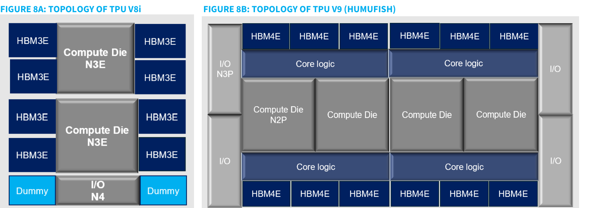

### 解讀摘要

Fig 8A 顯示 TPU V8i（Sunfish）：2 顆 Compute Die（N3E）＋ 8 顆 HBM3E，共 11 個 die，I/O die 為 N4，採 CoWoS 封裝。Fig 8B 顯示 TPU V9（Humufish）：激增至 4 顆 N2P compute die + 4 顆 N3P core logic die + 4 顆 N3P I/O die，HBM 則增至 12 顆 HBM4E——**total die count 從 11 跳至 24（+118%）**，改用 EMIB-T panel 封裝。Die 數量翻倍的直接含義是 substrate 尺寸擴大、PCB 電源分配網路（PDN）需求增加，驅動 PCB 向更高層數（HDI）和更先進 CCL（M9/M8 混合）遷移。

---

## Fig. 9｜Google TPU ASIC 規格演進

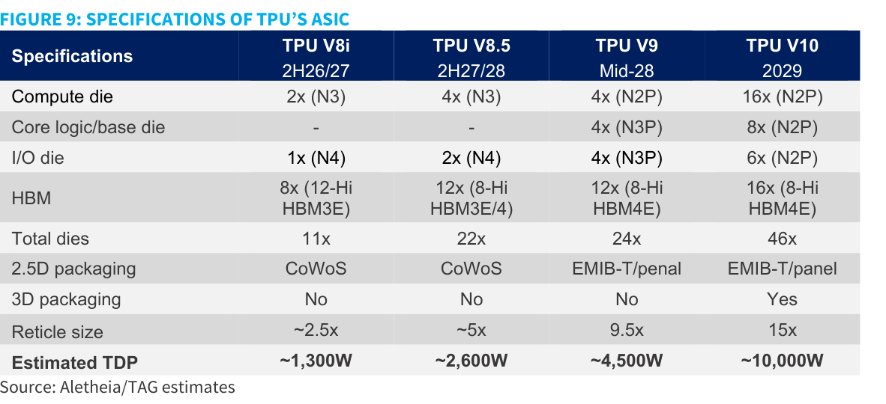

### 解讀摘要

TPU 規格代際跳躍的核心數字：TDP 從 V8i 的 1,300W → V8.5 的 2,600W → V9 的 4,500W → V10 的 10,000W；Reticle size 從 2.5x → 5x → 9.5x → 15x（vs N3 baseline）。V9 首次引入 EMIB-T 封裝（panel 版），V10 則額外增加 3D packaging。這條升級曲線說明 PCB/CCL 規格升級不是漸進式的，而是在 V9→V10 間出現非線性跳躍，對應 HDI PCB 和 M9/M10 CCL 的 ASP 爆發。

---

## Fig. 10｜Google TPU PCB 規格演進

### 解讀摘要

從 ViperFish（TPU v6, 20-22L, M5-6）到 HumuFish（TPU v9, ~30-40L HDI, M8/M9）到 TPU V10（TBD, M9/M10），每代 ASP 指數翻升。關鍵節點是 SunFish 到 ZebraFish 的升級（N+M sequential lamination，良率損失 15-30%），以及 HumuFish 起的 HDI（多次 laser drilling，良率損失更高）——良率損失意味著相同需求需要更多投片，對供給緊缺起放大作用。

### 表格

| 代號 | CCL 材料 | PCB 生產時程 | 層數 | 架構 | ASP 指數 |
|---|---|---|---|---|---|
| ViperFish（v6） | M5-M6 | — | 20-22L | Multi-layer | 1.0x |
| GhostFish（v7） | M7 | 4Q25 | 26L | Multi-layer | 1.3x |
| SunFish（v8i） | M8 signal + M6 power | 4Q26 | 32L（15+2+15） | N+M | 2.2x |
| ZebraFish（v8t） | M8 signal + M6 power | 1Q27 | 34L（16+2+16） | N+M | 2.1x |
| HumuFish（v9） | M8/M9 | 2028 | ~30-40L | HDI | 2.5x |
| TPU V10 | M9/M10 | 2029 | TBD | HDI | ~5-6x |

> **洞察六**：GhostFish→SunFish 的 ASP 從 1.3x 跳至 2.2x（+69%），主因是 N+M sequential lamination 的良率損失（15-30%），而非單純層數增加。良率損失把供給端有效產能壓縮 15-30%，在需求 3x 的背景下等同供給缺口雙重擴大。

---

## Fig. 11｜Multi-lam 與 HDI PCB 工藝對比

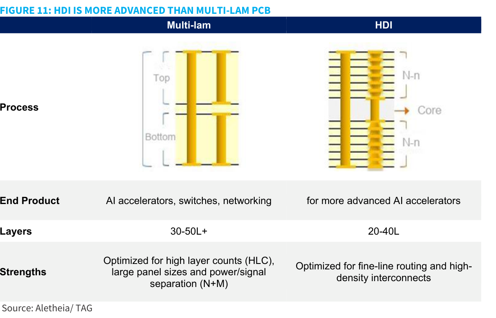

### 解讀摘要

Multi-lam（N+M）：30-50L+，適合 HLC（高層數）、大板面、功率/信號分離；HDI：20-40L，優化 fine-line routing 和高密度互聯（microvias）。HDI 雖然層數較少，但工藝難度更高（多次 laser drilling + sequential buildup + ultra-fine feature），良率損失幅度超過 N+M。**HDI 是 TPU V9（HumuFish）起的選擇**，供應商門檻顯著提高——ISU Petasys 因大量投資 HDI 能力而成為 Google TPU V9 的關鍵供應商。

---

## Fig. 12｜Google TPU 網路架構（Jupiter + Virgo 雙網）

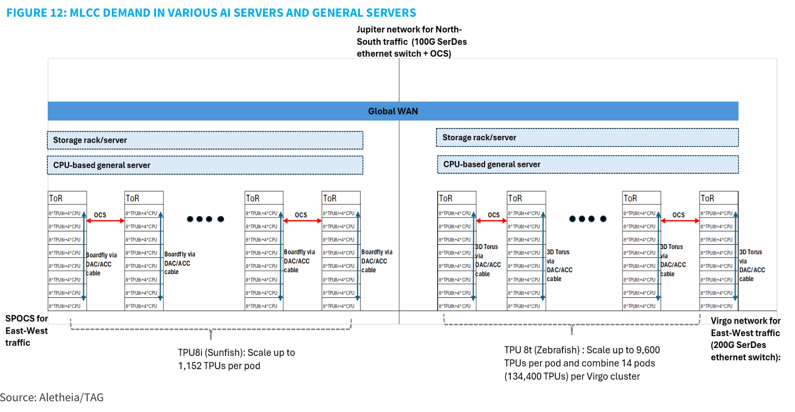

### 解讀摘要

此圖（原標題誤標為「MLCC Demand」，實際為 TPU 網路架構圖）清晰顯示 Google 的雙網設計：Jupiter（Broadfly DAC/ACC，南北向流量，OCS 用 100G SerDes）和 Virgo（東西向流量，200G SerDes ethernet switch）。TPU V8t (Zebrafish) 的 Virgo pod 可達 134,400 顆 TPU（14 個 pods × 9,600 TPUs/pod），而 V8i (Sunfish) 僅 1,152 顆/pod。規模擴張 116x，對 ethernet switch 的 PCB/CCL 需求是 TAM 的關鍵乘數。

> **洞察七（配合 Fig 13）**：Virgo 從 100G→200G SerDes 升級，Ethernet switch bandwidth per TPU 從 0.4Tbps 升至 2.0Tbps（5x），transceiver modules per TPU 從 1.8 升至 3.0（+67%）——這是一個純增量需求，不受 compute tray 需求影響。

---

## Fig. 13｜光學網路硬件需求對比（TPU7 vs TPU8）

### 解讀摘要

TPU8 vs TPU7 的 per-TPU 需求對比，揭示 Google 網路架構升級對光網路的量的影響。Ethernet switch bandwidth 5x，OCS 總需求 258,542 vs 20,833（12.4x，且生命週期假設 TPU8 達 14-15m 顆），光纖線 18.2 vs 8.0 per TPU。

### 表格

| 組件 | TPU8 比例/顆 | TPU7 比例/顆 | 備註 |
|---|---|---|---|
| Ethernet switch bandwidth（Tb per TPU） | 2.0 | 0.4 | +400% |
| Transceiver modules per TPU | 3.0 | 1.8 | +67% |
| Total OCS demand（產品生命週期） | 258,542 | 20,833 | TPU7 假設 4m 顆，TPU8 假設 14-15m 顆 |
| Optical cable per TPU | 18.2 | 8.0 | +128% |
| DAC/ACC cable per TPU | 1.9 | 1.5 | TPU7 100G/lane，TPU8 200G/lane |

---

## Fig. 14｜Switch PCB 規格演進（頻寬升級路線）

### 解讀摘要

Switch PCB 的含量金額升幅是全報告中 per-unit 增量最大的：100G(\$180) → 400G(\$400, +122%) → 800G(\$1,500-2,000, +275%) → 1.6T(\$3,000-4,000, +94%)。800G 的跳躍（+275%）代表從 Multi-layer 升至 N+M（36-40L，CCL M8），已在 2Q26 量產。1.6T 預計 2Q27 量產，CCL 升至 M8/M9。Switch PCB ASP 從 100G 到 1.6T 累計上漲 16.7-22.2x（對應 Fig 3B 的 18.5x 升幅）。

### 表格

| 頻寬 | CCL 材料 | 量產時程 | 層數 | 層數增幅 | 架構 | PCB ASP（USD） | ASP 增幅 |
|---|---|---|---|---|---|---|---|
| 100 Gbps | M6 | — | 12-18L | — | Multi-layer | 180 | — |
| 400 Gbps | M7 | 2022-23 | 26-28L | 65-75% | Multi-layer | 400 | +122% |
| 800 Gbps | M8 | 2Q26 | 36-40L | 35-40% | N+M | 1,500-2,000 | +275% |
| 1.6 Tbps | M8/M9 | 2Q27 | 44-50L | 20-25% | N+M | 3,000-4,000 | +94% |

> **值得驗證**：800G switch 的 PCB ASP 增幅（+275%）中，層數貢獻約 35-40%（~35-40% layer count 增加，ASP 線性約 +35-40%），剩餘 ~235% 來自 M7→M8 材料升級和 N+M 工藝——若 CCL 材料升級的 ASP 乘數估算偏差 20%，對 EMC CCL ASP 整體影響可達 20-30%。

---

## Fig. 15｜記憶體供應商 LTA 詳情（截至 2026 年 9 月）

### 解讀摘要

此表是 Aletheia 用來類比 PCB/CCL LTA 前景的核心依據。記憶體 LTA 的模板顯示：期限 3-5 年、有 ceiling/floor 機制（Samsung/Micron/SNDK）、prepayment 比例最高達 25%（Samsung）、Micron 的 $150bn 合約規模和 $32bn prepayment 是估值重估的核心論點。PCB/CCL LTA 若達到類似規模，對廠商 FCF 和 P/E 的重估幅度將是非線性的。

### 表格

| | Samsung | SKHY³ | Micron | Kioxia | SNDK |
|---|---|---|---|---|---|
| 期限 | 5 年 | 5 年 | 3-5 年⁴ | 3 年+ | 4 年 |
| 目標覆蓋率 | 60-70% | 50-60% | 35%⁵ | ~50%（2H26） | 2/3（27/28） |
| 客戶數 | 5+5¹ | 10 | 26 | 3 | 8 |
| Ceiling price | 有 | 無³ | 有 | 無 | 有 |
| Floor price | 有 | 有 | 有 | 有 | 有 |
| Deposit/prepayment | 有² | 無 | \$32bn | 無 | \$16.5bn |
| 合約總值 | N.A. | N.A. | \$150bn | N.A. | \$94bn |

¹ 2Q26 已確認 5 個 AI 客戶，3Q26 再加 5 個。² 現金支付為合約值的 25%。³ SKHY LTA 不適用 NVDA（HBM ASP 為年度議定）。

> **洞察八**：Micron 的 LTA：$150bn 合約 + $32bn prepayment，覆蓋 26 個客戶，35% 出貨量。如果 EMC CCL 的 LTA 達到 1/10 此規模（~\$15bn），考慮 EMC 目前市值僅約 \$60bn，prepayment 本身的 FCF 效應就能推動顯著的本益比擴張。

---

## Fig. 16｜mSAP 工藝流程（對比標準 HDI）

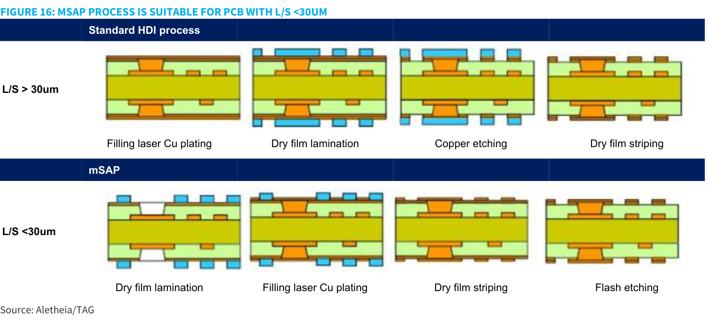

### 解讀摘要

Standard HDI（L/S>30μm）：Filling laser Cu plating → Dry film lamination → Copper etching → Dry film striping。mSAP（L/S<30μm）：Dry film lamination → Filling laser Cu plating → Dry film striping → **Flash etching**（改用 flash etching 取代 copper etching）。核心差異在於 mSAP 是「加法」（先鍍銅再 flash 蝕刻）而非 HDI 的「減法」（先鍍後深度蝕刻），減少了對厚銅層的依賴，讓線寬可縮至 20-30μm 以下。

---

## Fig. 17｜mSAP 成為 1.6T 起標準製程

### 解讀摘要

mSAP 的採用路徑：800G 為 Optional（部分 switch 廠商採用），1.6T 起為 **YES（強制）**，3.2T 依然 YES。關鍵是 1.6T 的量產時程為 2Q27——距今約 6 個月，SCC/ZDT/Unimicron/Compeq 已開始排產，mSAP 投資已進入正式回收期。

### 表格

| 頻寬 | 層數（HDI） | L/S | CCL | 供應商 | mSAP 採用 |
|---|---|---|---|---|---|
| 400G | 10L | 40-50μm | M4/M6 | SCC, Unimicron | **NO** |
| 800G | 12-14L | 30-40μm | M6/M7 | SCC, ZDT, Unimicron, Compeq, Kinwong, WUS | **Optional** |
| 1.6T | 14-18L | 20-30μm | M8+ | SCC, ZDT, Unimicron, Compeq | **YES** |
| 3.2T | 20-22L | 10-15μm | M9+ | SCC, ZDT, Unimicron | **YES** |

---

## Fig. 18｜主要玩家 mSAP 進展

### 解讀摘要

mSAP 受益集中在中資 PCB 廠（SCC、ZDT/Avary、Unimicron、Compeq），台灣廠商相對受益有限。Unimicron 是唯一明確將資本支出大幅拉升（TWD25bn→34bn，+36%）的台廠，且 70% 用於 ABF substrate + HDI，30% 用於 mSAP + 泰國新廠。

### 表格

| 廠商 | mSAP 現狀 | 資本投入 |
|---|---|---|
| SCC | 中國 mSAP 領先廠商，已宣布 RMB4.37bn 私募擴充 AI 相關 PCB 產能（含 mSAP） | 人民幣 4.37bn |
| ZDT/Avary | 目標成為全球最大 mSAP 供應商，未來數年所有主要廠區（中國、台灣、泰國）各 5x 擴產 | 大規模擴產 |
| Unimicron | 2026 capex 提升至 TWD34bn（+36%），70% 用於 ABF/HDI，30% 用於 HDI mSAP + 泰國新廠 | TWD34bn |
| Compeq | 已完成高端 switch 產品 mSAP 認證，2H26 起進入量產；中國（重慶）另設廠持續擴產 | 持續擴產 |

---

## Fig. 19｜PCB 主要樹脂材料 Dk/Df 對比

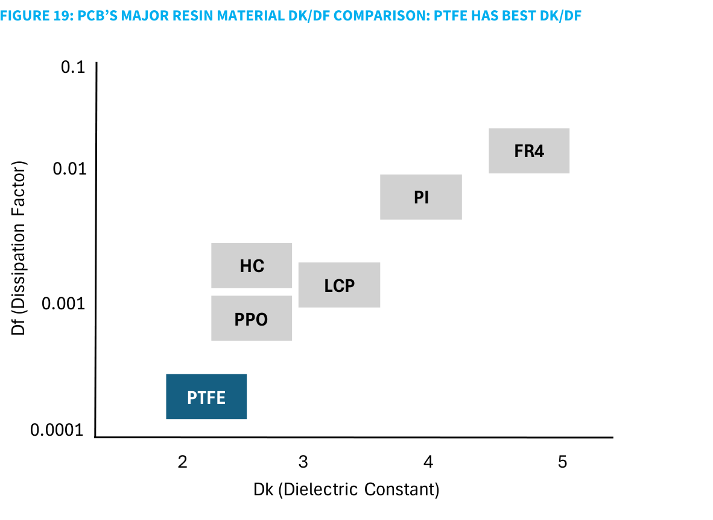

### 解讀摘要

散點圖橫軸 Dk（介電常數，越低越好），縱軸 Df（耗散因子，對數軸，越低越好）。PTFE 在 Dk~2、Df~0.0002，遠優於 PPO/HC（Dk~2.5, Df~0.001）和 LCP（Dk~3, Df~0.001）。FR4 居末（Dk~5, Df~0.01）。PTFE 有最優的電氣性能，但報告明確指出它「不太可能成為 AI server 近期主流」（良率低、成本高、加工困難）。現階段 Nvidia 僅在 Rubin Ultra switch tray 進行 PTFE 混合材料（PTFE + M9）測試，1H27 前能見度有限。

> **洞察九**：PTFE 的 Dk/Df 雖在 Fig 19 一目瞭然最優，但 Shengyi 是 PTFE CCL 的首選供應商（非 EMC）——這意味著 PTFE 若提前普及對 EMC 是負面。但 Aletheia 判斷 PTFE 近期非主流，EMC 的 M8/M9 仍是現實路徑的主流材料，這也是偏好 EMC 的一個假設前提。

---

## Fig. 20｜CPO 架構對 PCB/CCL 的影響

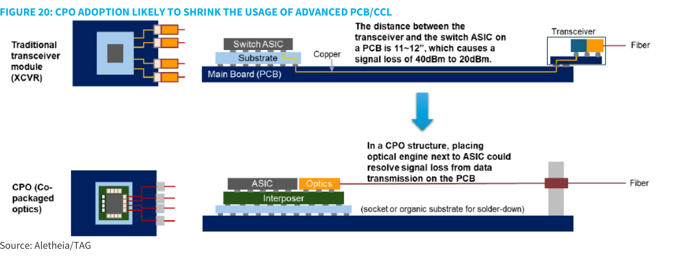

### 解讀摘要

傳統方案（XCVR）：Transceiver 與 Switch ASIC 之間距離 11-12 英吋，經過 Main Board（PCB）上的銅連接，信號損耗從 40dBm 降至 20dBm（-50%）。CPO 方案：光學引擎緊靠 ASIC（通過 Interposer），消除 PCB 上的長距離銅走線，信號損耗大幅下降。CPO 的邏輯是：若 PCB 上的銅走線被「繞路」，對高端 CCL（低 Df/Dk）的需求就會下降。但 Aletheia 認為 CPO 影響**可控**：1）CPO 設計仍未定型；2）Google 等仍堅持傳統方案；3）CCL 整體行業供不應求，其他應用需求填補空缺。

> **洞察十**：CPO 衝擊更多偏向 Nvidia 供應鏈（Nvidia 是最積極評估 CPO 的廠商），而 Google 的 TPU 方案維持傳統架構——因此 CPO 風險對 ISU/EMC 的衝擊小於投資人擔憂，而對 TTM 的影響需要更密切追蹤（TTM 服務 Nvidia LPU）。

---

## 跨 Exhibit 彙整表

### 彙整 1｜PCB/CCL TAM 增量拆解（TPU 供應鏈，2026→2028E）

來源：Figs 2, 3A, 3B, 10, 14

| 成長向量 | 2026 基準 | 2028E | 增量倍率 | 驅動機制 |
|---|---|---|---|---|
| TPU 出貨量 | 3.6m 顆 | 12m 顆 | 3.3x | AVGO ASIC 服務 + Google 自用 |
| Compute tray PCB ASP | USD20k/rack | USD30-40k/rack（V8）；V10 可達 ~100-120k | 1.5-2.5x | N+M→HDI；M7→M9 |
| Networking tray PCB ASP | USD~350（400G) | USD3,000-4,000（1.6T） | ~10x | M7→M8/M9，層數 26→44-50L |
| **PCB TAM 估算（粗估）** | — | — | **~8-12x（2026→2029E）** | 量增 3.3x × 含量升值 2.5-3.5x |

> **彙整洞察**：即使只考慮 compute tray 的 ASP 倍增和出貨量三倍，PCB TAM 就增 5x。加上 networking switch 的 PCB ASP 10x 升幅，整體 TPU PCB 相關 TAM 在 Aletheia 的框架下「四倍增長（2026→2029）」的說法是保守而非激進的估算。

---

## 相關個股清單

| 類別 | 公司 | Ticker | 評等 | TP | 備註 |
|---|---|---|---|---|---|
| PCB（Google TPU 首選） | ISU Petasys | ISSI KS | Buy | KRW270,000 | Google PCB 50%+，networking PCB 50-60% 營收，HDI 投資確定 |
| CCL（全平台首選） | Elite Material（台光電） | EMC / 2383 TT | Buy | TWD10,000 | M8/M9 全平台 CCL 主導；30x FY27/28E PER |
| PCB（美國 AI + A&D） | TTM Technologies | TTMI US | Buy | USD236 | 美國 AI server N+M + A&D（軍用）不可替代性；30x FY27/28E PER |
| PCB（次選，networking） | Unimicron（欣興） | 3037 TT | 未評等 | — | ABF 基板 + HDI mSAP 擴產，TPU networking 參與 |
| PCB（mSAP 中國龍頭） | SCC（深南電路） | 002916 CH | 未評等 | — | mSAP 領先，RMB4.37bn 擴產 |
| CCL（PTFE 選手） | Shengyi Technology（生益） | 600183 SS | 未評等 | — | PTFE 首選供應商（Nvidia 測試中）；若 PTFE 普及受益最大 |
| CCL（台灣 PTFE/高階） | Nanya PCB（南電） | 8046 TT | 未評等 | — | Google TPU V8i CCL 供應商（Panasonic 陣營） |
