# MS｜The Foundry Floorplan: TSMC 3Q26 Earnings Preview; UMC Preliminary 2027 Positives

**券商**：Morgan Stanley  
**分析師**：Charlie Chan、Daniel Yen、Daisy Dai、Lucas Wang、Ethan Jia  
**日期**：2026-10-05  
**主題**：TSMC 3Q26 法說前預覽；UMC 2027 SiPh/TFLN 上行空間  
**評級**：Attractive（Greater China Technology Semiconductors）  
<a href="https://layx.uk/dl?g=產業&b=MS&d=20261005&h=Foundry-Floorplan">📎 下載 PDF</a>

---

## 報告總結

本報告在 TSMC 3Q26 法說（10/15）前夕發布，提供兩大主軸預覽：其一，TSMC 3Q26 毛利率預計觸及指引高端 67.5%，全年收入指引料從「above 40%」上修至「low-to-mid-40%」，MS 同步上調 TSMC 目標價 3% 至 NT\$3,088（22x 2027E P/E）；其二，UMC 因 TFLN SiPh（矽光子積體電路）業務打開 2027 8 吋漲價空間，MS 大幅上調 UMC 目標價 36% 至 NT\$188。封裝技術方面，CoWoS 依舊是 <9.7-reticle 的主流解，CoPoS 和 EMIB 各有市場但均面臨量產時間與執行力風險；MS 指出 AI 晶片 capex 重心最快 2028 年將轉向 AI compute 與 AI networking，是兩家晶圓代工的中長期正面催化劑。

---

## MS 完整投資邏輯鏈

| 論點層次 | Exhibit | 內容 |
|---|---|---|
| 3Q26 業績確認 | 1 | GM 67.5% 觸指引高端；MS EPS NT\$30.74 vs 共識 NT\$28.28，上行空間明確 |
| 漲價軌跡 | 2 | 先進節點 2027 年持續漲價，1.4nm 4Q27e ~US\$33,000/wf |
| 財務結構改善 | 3, 4 | 折舊走高但 GM 底部抬升；CapEx intensity 2028e 降至 ~28%（revenue 成長速度超越 capex） |
| 先進節點需求 | 5, 6, 7 | 2nm 2027e 需求 ~155kwpm；N2 capacity 70% CAGR 2026-28；fab roadmap 顯示 N3/N2/A14 多節點並行擴 |
| 封裝生態護城河 | 8, 9, 10, 11, 12, 13, 14 | CoWoS 2028e 370kwpm（TSMC 260+OSAT 110）；CoPoS/EMIB 量產仍早期；TSMC 在 <9.7-reticle 下無替代 |
| UMC 差異化 | 15, 16 | TFLN MZM 頻寬 >110GHz，TSMC 走 MRM 路線，UMC TFLN 定位互補不競爭 |
| **結論** | 報告封面 | **TSMC TP NT\$3,088（↑3%）；UMC TP NT\$188（↑36%）；兩檔 Overweight** |

> **報告最大邏輯缺口**：CoPoS 量產進度（trial only）和 Intel EMIB-T 爬坡能否依時間表（2027e 20kwpm → 2028e 45kwpm）執行，是決定 TSMC CoWoS 在 >9.7-reticle 是否依然壟斷的關鍵不確定變數。

---

## 報告核心觀點

| 主題 | MS 觀點 | 市場共識 | 是否 Contra-Consensus |
|---|---|---|---|
| TSMC 3Q26 GM | 67.5%（指引高端） | 66.5% | 偏樂觀 |
| TSMC 全年指引 | 上修至 low-to-mid-40% | above 40%（現有措辭） | 是，更具體 |
| 2027 先進節點漲價 | 5-10%（leading edge），0-3%（mature） | 市場預期不明確 | 是，明確量化 |
| GM 邁向 70% | 2027E 接近 70% | 共識 ~66-67% | 是，明顯偏樂觀 |
| UMC 2027 漲價 | TFLN SiPh + Samsung DDI 外包支撐 8 吋漲價 | 多數認為 UMC 無法漲價 | 是，contra |
| CoPoS vs CoWoS | CoPoS 2028 才小量，CoWoS 仍壟斷 | 部分市場過度期待 CoPoS 速度 | 是，偏保守 |

---

## Exhibit 1｜3Q26 Earnings and 4Q26 Guidance Preview

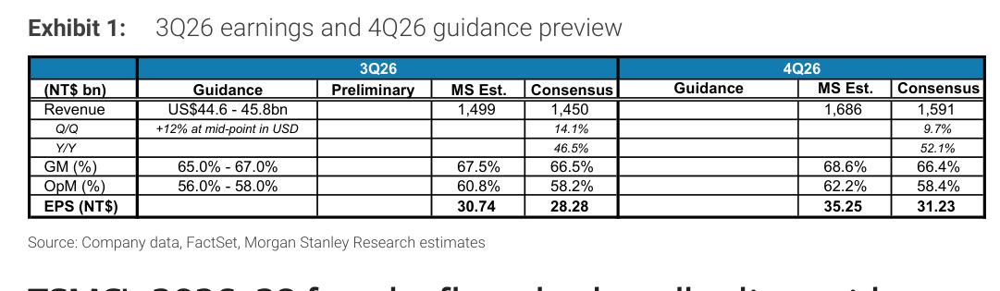

### 解讀摘要

MS 預測 TSMC 3Q26 EPS NT\$30.74，高於共識 NT\$28.28（+8.7%），主要來自 GM 67.5% 比共識 66.5% 高出 1ppt——而 GM 每 1ppt 對 EPS 貢獻約 NT\$1.5。展望 4Q26，MS 估 EPS NT\$35.25 vs 共識 NT\$31.23（+12.9%），反映 3nm 強勁需求帶動收入環比 +10-15%，同時 GM 進一步上升至 68.6%。

### 表格

| 指標（NT\$ bn） | 3Q26 指引 | 3Q26 MS Est. | 3Q26 共識 | 4Q26 MS Est. | 4Q26 共識 |
|---|---|---|---|---|---|
| 收入 | US\$44.6-45.8bn | 1,499 | 1,450 | 1,686 | 1,591 |
| QoQ | +12%（中值，USD） | — | +14.1% | — | +9.7% |
| YoY | — | — | +46.5% | — | +52.1% |
| GM (%) | 65.0-67.0% | 67.5% | 66.5% | 68.6% | 66.4% |
| OpM (%) | 56.0-58.0% | 60.8% | 58.2% | 62.2% | 58.4% |
| **EPS (NT\$)** | — | **30.74** | **28.28** | **35.25** | **31.23** |

> **洞察一**：MS 對 3Q26 GM 的預測比共識高 1ppt，全年來看這使 MS EPS 估計系統性高出約 8-12%；若法說確認 GM 觸高端，市場上修空間明顯。

---

## Exhibit 2｜TSMC Wafer Pricing Trend

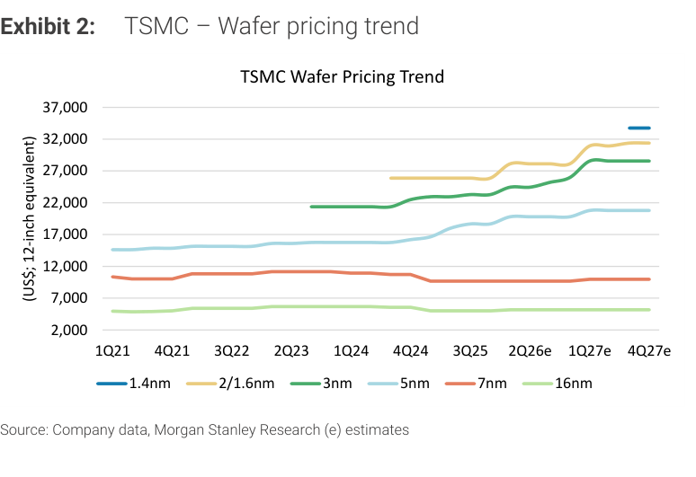

### 解讀摘要

領先製程的晶圓價格在 2026e-2027e 呈現加速漲勢：1.4nm 預計 4Q27e 約 US\$33,000/wf，2/1.6nm 約 US\$29,000，而 3nm 因已量產規模化在 ~US\$21,000-22,000 趨於穩定。7nm 與 16nm 基本持平（分別 ~US\$10,000 與 US\$6,000）。這與 MS 對先進節點 +5-10% 漲價的預測相符，而成熟節點 0-3% 的漲幅也反映在 7nm/16nm 的持平走勢中。

### 表格

| 節點 | 現況 (2Q26e) | 4Q27e（MS est.） |
|---|---|---|
| 1.4nm | 開始導入 | ~US\$33,000 |
| 2/1.6nm | ~US\$26,000-27,000 | ~US\$29,000 |
| 3nm | ~US\$21,000 | ~US\$22,000（趨穩） |
| 5nm | ~US\$18,000-19,000 | ~US\$21,000 |
| 7nm | ~US\$10,000 | ~US\$10,000（持平） |
| 16nm | ~US\$6,000 | ~US\$6,000（持平） |

> **洞察一**：先進節點（5nm 以下）漲價幅度明顯大於成熟節點，強化了 TSMC 未來兩年 GM 邁向 70% 的路徑可信度；成熟節點持平則反映中國競爭仍在壓縮定價空間。

---

## Exhibit 3｜TSMC GM and Depreciation Trends — 60% Should Be the Floor

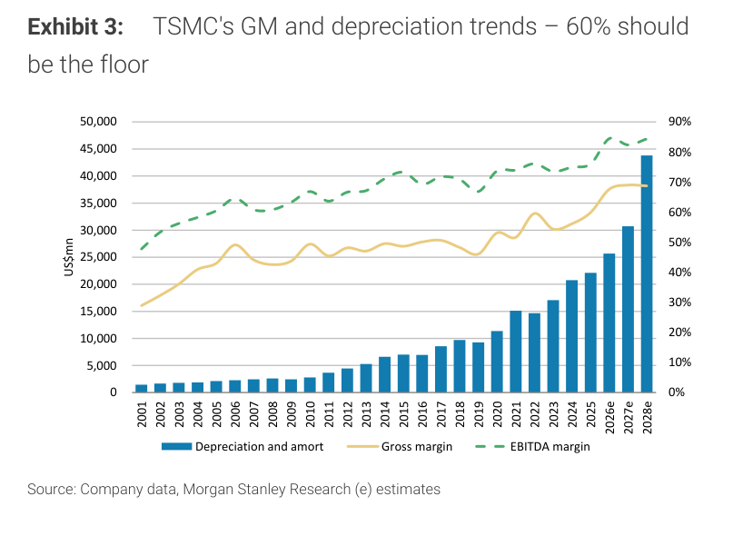

### 解讀摘要

TSMC 折舊費用呈現加速增長（2026e ~US\$31bn → 2028e ~US\$43bn），但 GM 同步走高而非被折舊壓縮，MS 論證其 GM 底部已從過去的 50-55% 結構性抬升至 60% 以上。EBITDA margin 2027-28e 預計維持 ~80%，代表即使折舊大幅增加，TSMC 的現金產生能力仍極為強健，資本投入能力有保障。

> **洞察一**：折舊走高 + GM 走高並存，說明 TSMC 的漲價力量足以消化折舊侵蝕——這是「護城河」的財務量化體現，市場共識的 GM 66% 低估了此結構性變化。

---

## Exhibit 4｜TSMC CapEx Intensity Drop

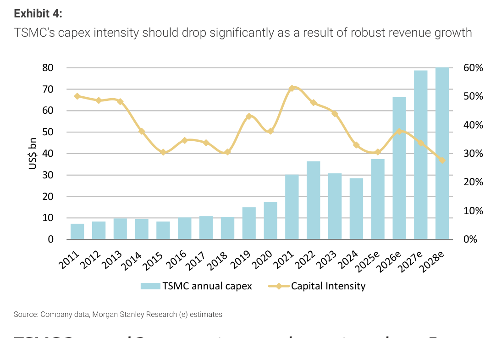

### 解讀摘要

TSMC 年度 CapEx 2026e ~US\$38bn（持平），2027e 跳升至 ~US\$65bn，2028e ~US\$80bn；但 Capital Intensity（CapEx/Revenue）反而從 2026e ~38% 降至 2028e ~28%，因為收入成長速度（漲價 + 量增）超越資本支出增速。這是 GM 邁向 70% 的結構支撐——不是花更少，而是賺更多。

### 表格

| 年度 | CapEx (US\$ bn) | Capital Intensity (%) |
|---|---|---|
| 2025e | ~38 | ~33% |
| 2026e | ~38 | ~38% |
| 2027e | ~65 | ~38% |
| 2028e | ~80 | ~28% |

> **洞察一**：2027e intensity 暫時維持在 38%（CapEx 跳增但 revenue 尚未完全反映漲價），2028e intensity 驟降至 28%——這意味 2028 年的自由現金流將顯著改善，是 TSMC 估值重評的關鍵年。

---

## Exhibit 5｜TSMC 2nm Customer Demand Breakdown

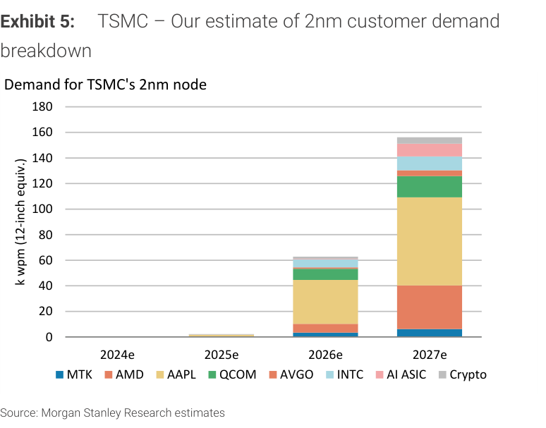

### 解讀摘要

2nm（N2）需求從 2025e 的約 2kwpm 試產規模，在 2026e 躍升至 ~63kwpm，2027e 進一步達 ~155kwpm——兩年近 78 倍增長。客戶結構上，2026e 以 Apple（約 40kwpm，佔主導）為主力，2027e Apple 維持約 40kwpm 但 Broadcom（AVGO）、AMD 各自衝至 ~30kwpm，AI ASIC 與 Crypto 合計也達 ~30kwpm，需求從單客戶主導轉向多元化。

### 表格

| 客戶 | 2025e（kwpm） | 2026e（kwpm） | 2027e（kwpm） |
|---|---|---|---|
| Apple（MTK proxy） | 微量 | ~40 | ~40 |
| AMD | — | ~5 | ~30 |
| AAPL (direct) | — | ~8 | — |
| QCOM | — | ~5 | ~10 |
| AVGO（Broadcom AI） | — | ~3 | ~30 |
| INTC | — | ~2 | ~10 |
| AI ASIC | — | ~0 | ~20 |
| Crypto | — | ~0 | ~15 |
| **合計** | **~2** | **~63** | **~155** |

> **洞察一**：2027e AVGO 和 AMD 各貢獻 ~30kwpm，代表 TSMC 2nm 的 AI 受益者不只蘋果——即使蘋果訂單不如預期，AI 客戶群可以填補缺口，需求基礎比市場認知的更分散。

---

## Exhibit 6｜TSMC N2 Family Technology Capacity Growth — 70% CAGR 2026-28

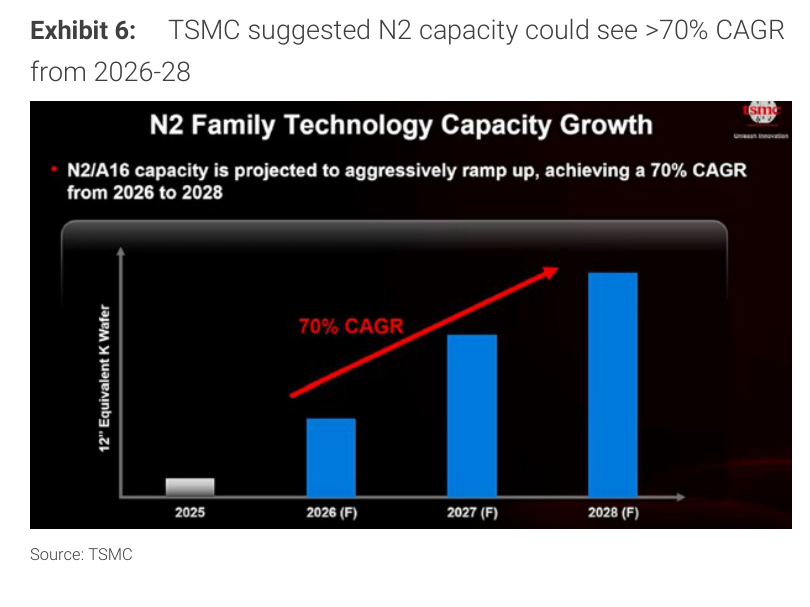

### 解讀摘要

TSMC 官方投影片顯示 N2/A16 產能 2026-2028 實現 70% CAGR，呈加速斜率增長。此數字對應 MS Exhibit 7 的 fab roadmap 估算（90-100kwpm → 150-170kwpm → 210kwpm），兩者互相驗證。70% CAGR 對比 N3 歷史爬坡（當年約 30-40% CAGR）顯示 TSMC 在先進節點擴產上持續提速。

> **洞察一（配合 Exhibit 5）**：2027e 需求 ~155kwpm 對應 2027e 產能 150-170kwpm，供需基本平衡——這意味 2027 的漲價空間是真實的供不應求，而非人為限量製造稀缺性。

---

## Exhibit 7｜TSMC Fab Roadmap (Without Potential Texas Capacity)

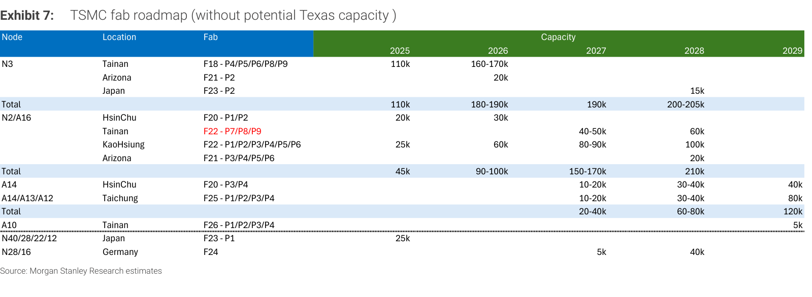

### 解讀摘要

MS 完整 fab roadmap 覆蓋 N3 至 A10，顯示多節點並行擴產的宏觀規模。N3 在台南 + 亞利桑那 + 日本三地布局，2026 年達 180-190kwpm 後逐步成熟；N2/A16 以台南 F22（P7/P8/P9，圖中紅字標注為關鍵新廠）和高雄 F22 為主力，2027e 達 150-170kwpm；A14/A13/A12 台中 F25 2027 啟動，2029 年達 80kwpm；德國廠（N28/16）2027-2028 年投入 5-40kwpm 服務歐洲客戶。

### 表格

| 節點 | 主要地點 | 2025 (kwpm) | 2026 (kwpm) | 2027 (kwpm) | 2028 (kwpm) | 2029 (kwpm) |
|---|---|---|---|---|---|---|
| **N3 合計** | 台南/亞利桑那/日本 | 110 | 180-190 | 190 | 200-205 | — |
| 　台南 F18 | P4/P5/P6/P8/P9 | 110 | 160-170 | — | — | — |
| 　亞利桑那 F21 | P2 | — | 20 | — | — | — |
| 　日本 F23 | P2 | — | — | — | 15 | — |
| **N2/A16 合計** | 台南/高雄/竹科/亞利桑那 | 45 | 90-100 | 150-170 | 210 | — |
| 　竹科 F20 | P1/P2 | 20 | 30 | — | — | — |
| 　台南 F22 | P7/P8/P9（紅字） | — | — | 40-50 | 60 | — |
| 　高雄 F22 | P1-P6 | 25 | 60 | 80-90 | 100 | — |
| 　亞利桑那 F21 | P3-P6 | — | — | — | 20 | — |
| **A14/A13/A12** | 竹科 F20/台中 F25 | — | — | 20-40 | 60-80 | 120 |
| **A10** | 台南 F26 | — | — | — | — | 5 |
| **N28/16** | 德國 F24 | — | — | 5 | 40 | — |

> **洞察一**：台南 F22 P7/P8/P9（圖中紅字）是 2027 年 N2 能否如期爬坡的最關鍵單一廠，此廠延期即是 2027e 供需平衡假設的最大尾部風險。
> **洞察二**：亞利桑那 F21 P3-P6 的 N2/A16 產能 2028 才投入，高雄廠是 2026-2027 年的主力——地緣政治分散布局對短中期供應影響有限。

---

## Exhibit 8｜CoWoS Supply Capacity Breakdown

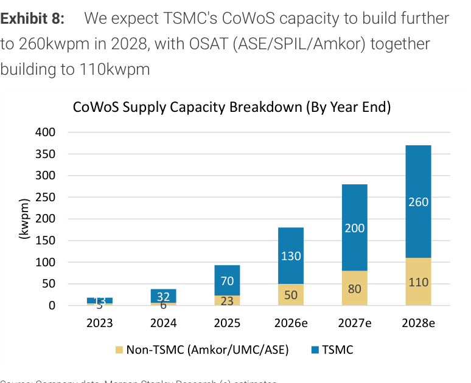

### 解讀摘要

CoWoS 總供給產能從 2023 年 8kwpm（TSMC 5 + OSAT 3 trial）到 2028e 370kwpm（TSMC 260 + OSAT 110），六年近 46 倍成長。TSMC 自建比例從 63% 降至 70%（2028e），OSAT（Amkor/ASE/SPIL）從配角到 2028e 110kwpm 的重要補充。值得注意的是：CoWoS 從 2023 到 2025 增速受限於 TSMC 自身 wafer 產能瓶頸，2026 後加速反映 OSAT 分工成熟。

### 表格

| 年份 | TSMC CoWoS (kwpm) | OSAT (kwpm) | 合計 (kwpm) |
|---|---|---|---|
| 2023 | 5 | 3 | 8 |
| 2024 | 32 | 6 | 38 |
| 2025 | 70 | 23 | 93 |
| 2026e | 130 | 50 | 180 |
| 2027e | 200 | 80 | 280 |
| 2028e | 260 | 110 | 370 |

> **洞察一**：OSAT 的 110kwpm（2028e）佔整體 30%，代表 ASE/Amkor 是 CoWoS 的重要受益者——但其技術能力受限於 TSMC 授權範圍，技術壁壘高於一般 OSAT 業務。

---

## Exhibit 9｜TSMC CoPoS Capacity

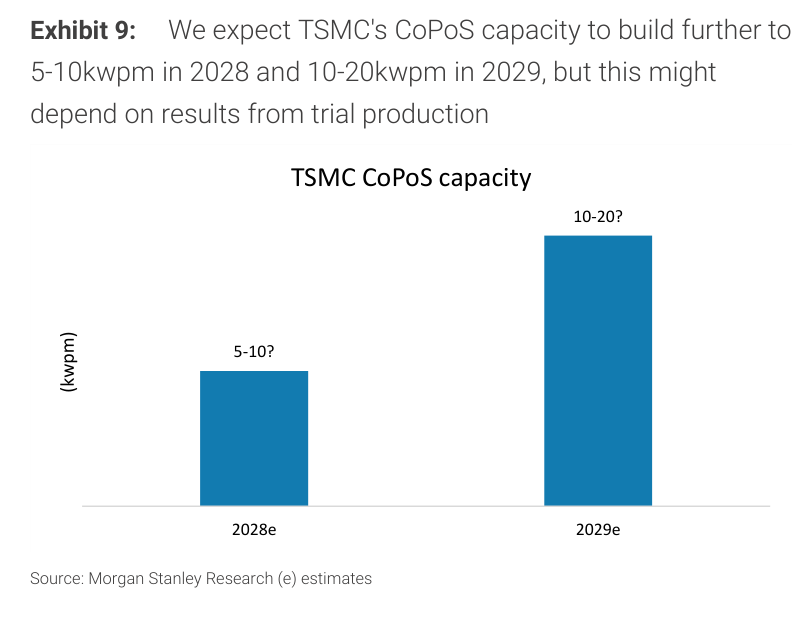

### 解讀摘要

MS 預測 TSMC CoPoS 產能 2028e 僅 5-10kwpm，2029e 10-20kwpm（均帶問號，代表高度不確定）。相比 CoWoS 2028e 260kwpm，CoPoS 即使按樂觀預測也只是零頭——這是 MS 認為 CoPoS 尚不足以威脅 CoWoS 主流地位的核心數據。CoPoS 的 panel-level 工藝仍在 trial production 階段，量產時間高度依賴良率突破。

> **洞察一（配合 Exhibit 12）**：CoPoS 的理論優勢（大尺寸 >9.7-reticle 的成本效益）在 2028 年之前幾乎無法變現，而 CoWoS-L/R 正在向 9.7-reticle 擴展（Exhibit 11）——窗口期留給 CoPoS 的時間非常短。

---

## Exhibit 10｜Intel EMIB Capacity

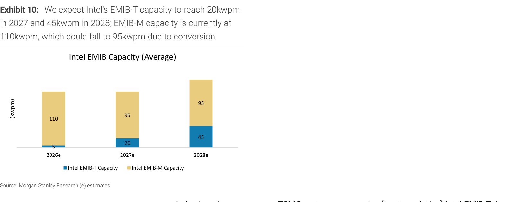

### 解讀摘要

Intel EMIB 分兩種：EMIB-T（先進，藍色）與 EMIB-M（現有，金色）。EMIB-M 目前 110kwpm 是主力，但因廠房轉換 EMIB-T 而下降至 95kwpm（2027e、2028e 均為 95）；EMIB-T 從 2026e 5kwpm 爬升至 2028e 45kwpm。兩者相加總量從 115kwpm（2026e）升至 140kwpm（2028e）——依然遠低於 TSMC CoWoS 260kwpm。

### 表格

| 類型 | 2026e (kwpm) | 2027e (kwpm) | 2028e (kwpm) |
|---|---|---|---|
| Intel EMIB-T | 5 | 20 | 45 |
| Intel EMIB-M | 110 | 95 | 95 |
| **合計** | **115** | **115** | **140** |

> **洞察一**：EMIB 的 substrate-level 特性使其面積效率優於 CoWoS（Exhibit 12），但 2028e 140kwpm 的規模仍無法威脅 TSMC 370kwpm（CoWoS）——EMIB 的機會是「補充」而非「替代」，針對 >9.7-reticle 大尺寸 AI 芯片。

---

## Exhibit 11｜TSMC CoWoS Interposer Size Roadmap

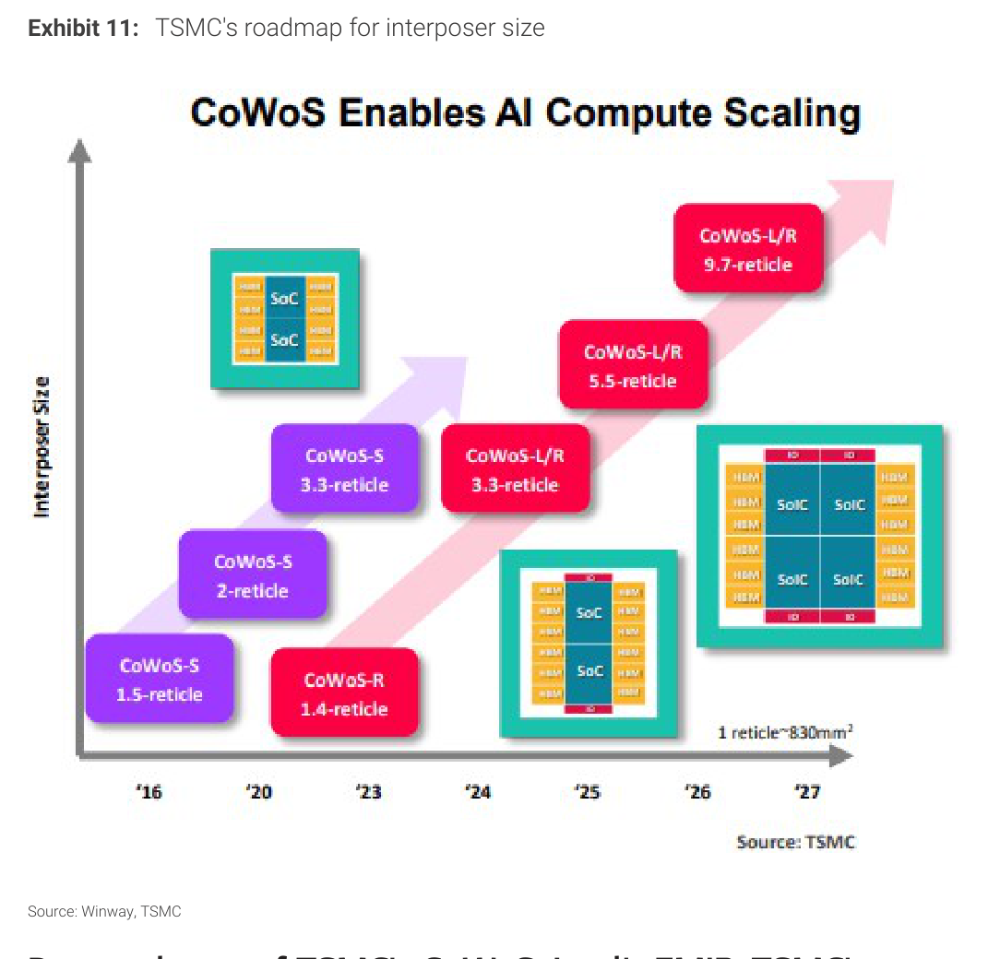

### 解讀摘要

TSMC CoWoS 的 interposer 尺寸從 2016 年 CoWoS-S 1.5-reticle 持續擴大，2027 年達到 CoWoS-L/R 9.7-reticle（≈8,051mm²），每一代均超越前代。最關鍵的轉折是 2024-2025 年的 CoWoS-L/R 導入（reticle-stitching 技術允許超越單一光罩限制），以及 2026-2027 年 SoIC 三維堆疊開始整合進 CoWoS 封裝方案，使其可支援更複雜的 AI GPU 設計（MediaTek TPU v10 IceFish 初始設計即超過 14x-reticle）。

> **洞察一**：CoWoS-L/R 到 9.7-reticle 已是技術上接近上限——更大尺寸（>9.7x）理論上需要 CoPoS 或 EMIB 的面板/substrate 方案，但這兩者量產都要到 2028 年以後（Exhibits 9、10）。TSMC 在 2026-2027 年仍握有供給壟斷地位。

---

## Exhibit 12｜CoWoS、CoPoS、SoIC 與 Intel EMIB 技術比較

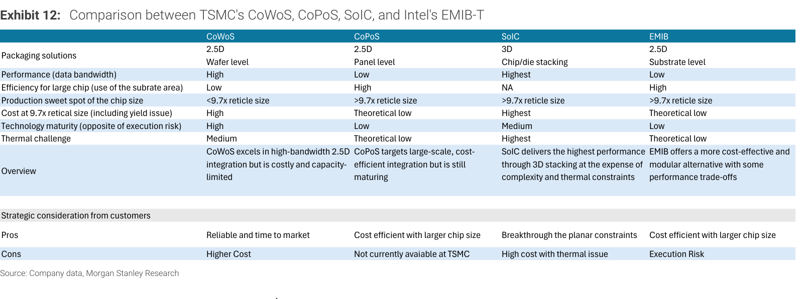

### 解讀摘要

四種先進封裝技術各有定位：CoWoS 是成熟可靠、高頻寬的 2.5D wafer 方案，優勢在 <9.7-reticle 尺寸；CoPoS 是面板級方案，理論成本最低但技術成熟度低（「仍在成熟中」）；SoIC 是 3D 堆疊，性能最高但成本最高且熱挑戰最大；EMIB 是 substrate-level 的 2.5D，成本效率好但頻寬偏低、成熟度也低。

### 表格

| 特性 | CoWoS | CoPoS | SoIC | EMIB |
|---|---|---|---|---|
| 封裝維度 | 2.5D wafer | 2.5D panel | 3D chip stacking | 2.5D substrate |
| 資料頻寬 | 高 | 低 | 最高 | 低 |
| 大尺寸晶片效率 | 低 | 高 | NA | 高 |
| 最佳晶片尺寸 | <9.7x reticle | >9.7x reticle | >9.7x reticle | >9.7x reticle |
| 9.7x reticle 成本 | 高 | 理論低 | 最高 | 理論低 |
| 技術成熟度 | 高 | 低 | 中 | 低 |
| 熱挑戰 | 中 | 理論低 | 最高 | 理論低 |

---

## Exhibit 13｜CoPoS / FoPLP 面板尺寸效益（Yole Group）

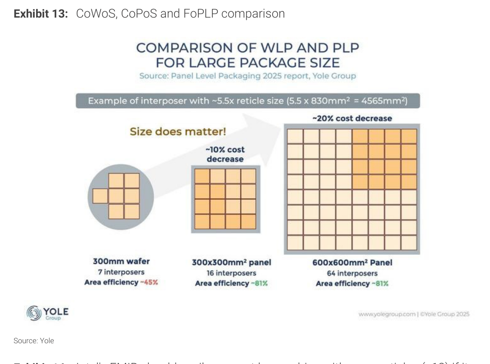

### 解讀摘要

Yole Group 資料顯示，面板封裝（Panel Level Packaging）的核心邏輯是面積效率（area efficiency）：300mm 晶圓的 interposer 面積效率僅 ~45%，而 300x300mm² 面板與 600x600mm² 面板均可達 81%，前者成本較晶圓降 ~10%、後者降 ~20%。以 5.5-reticle（4,565mm²）的 interposer 為例，面板的優勢隨尺寸增大而顯著——這正是 CoPoS 面向 >9.7-reticle AI 芯片的核心商業邏輯。

> **洞察一**：面板的面積效率優勢是真實的（81% vs 45%），但問題在良率而非效率——CoPoS 試量產良率尚未公開，而 CoWoS 良率已達業界標準，這才是兩者目前差距的本質。

---

## Exhibit 14｜Intel EMIB Scalability Roadmap

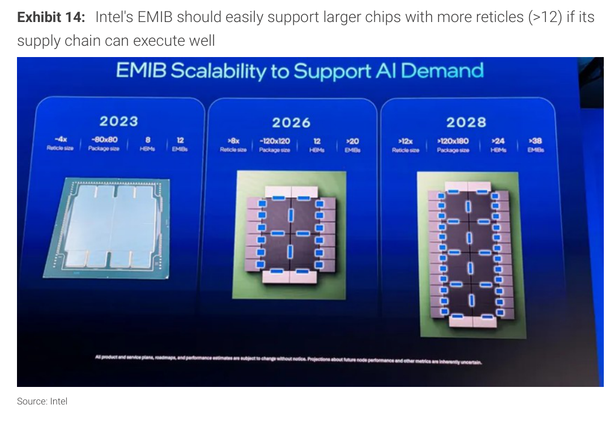

### 解讀摘要

Intel 官方 EMIB 路線圖顯示系統規模持續擴大：2023 年約 4x-reticle（80x80mm 封裝，8 顆 HBM，12 個 EMIB）；2026 年約 8x-reticle（120x120mm，12 顆 HBM，>20 個 EMIB）；2028 年約 12x-reticle（>120x180mm，>24 顆 HBM，>38 個 EMIB）。Intel 宣稱 EMIB 可輕鬆支援 >12-reticle——但 MS 標題特別加上「if its supply chain can execute well」，暗示執行力是核心風險。

> **洞察一**：Intel EMIB 的技術路徑理論上很有吸引力（>12-reticle、低成本），但 Exhibit 10 顯示 EMIB-T 2027e 只有 20kwpm——「技術可行」與「供應鏈規模化」之間的落差，是 MS 維持 TSMC CoWoS 壟斷論點的核心根據。

---

## Exhibit 15｜UMC TFLN Process for PIC — TFLN Pros and Cons

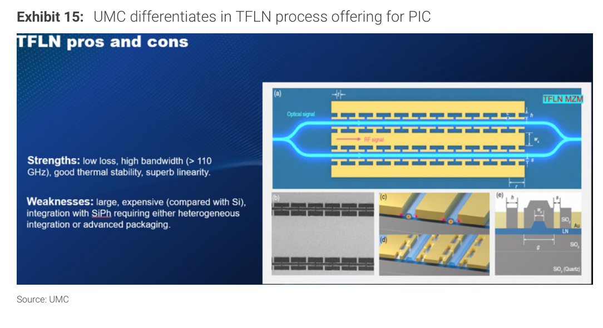

### 解讀摘要

UMC 的差異化策略建立在 TFLN（Thin-Film Lithium Niobate）Mach-Zehnder Modulator（MZM）上：頻寬 >110GHz、低損耗、高線性度，非常適合 400G/800G 高速光傳輸；但 TFLN 的弱點是體積大、成本高，且與矽光子整合需要異質整合或先進封裝。相比 TSMC 選擇的 MRM（Micro Ring Modulator，Exhibit 16），TFLN 在 400Gbps/lane 以上具有壓倒性優勢——恰好是 1.6T 時代的關鍵需求節點。

> **洞察一**：UMC 用 TFLN（大晶片、高頻寬）、TSMC 用 MRM（小晶片、受限頻寬）——兩者不直接競爭，UMC 瞄準的是 TSMC MRM 無法支持的高端光傳輸市場。這是 MS 上調 UMC TP 36% 的技術根據：現有市場認為 UMC 無差異化，但 TFLN 已開始改變這個故事。

---

## Exhibit 16｜TSMC PIC Focus on Micro Ring Modulator (MRM)

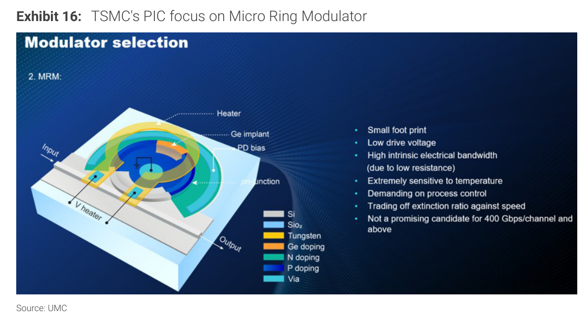

### 解讀摘要

TSMC 的矽光子路線聚焦 MRM（Micro Ring Modulator）：優點是體積小、驅動電壓低、高固有電氣頻寬；缺點是對溫度極度敏感、製程控制嚴苛，且 MRM 不適合 400Gbps/channel 以上應用（TSMC 官方描述為「Not a promising candidate for 400 Gbps/channel and above」）。這意味 TSMC 的 PIC 解法天花板在 400G 以下，恰好是 UMC TFLN 的起點。

> **洞察一（配合 Exhibit 15）**：TSMC MRM 的天花板（<400Gbps/lane）恰好是 UMC TFLN MZM 的起點（>400Gbps/lane），兩家晶圓代工在 PIC 上形成「互補非競爭」的格局。1.6T 乙太網交換應用的到來（~2026-2027）是 UMC TFLN 商業化的催化劑——這才是 MS 認為市場低估 UMC 的核心所在。

---

## 跨 Exhibit 彙整：封裝技術供給規模比較（2026e-2028e）

### 彙整 1｜各先進封裝技術產能對比（kwpm）

來源：Exhibit 8（TSMC CoWoS + OSAT）、Exhibit 9（CoPoS）、Exhibit 10（Intel EMIB）

| 技術 | 2026e | 2027e | 2028e |
|---|---|---|---|
| TSMC CoWoS | 130 | 200 | 260 |
| OSAT CoWoS（Amkor/ASE） | 50 | 80 | 110 |
| **CoWoS 合計** | **180** | **280** | **370** |
| TSMC CoPoS | 0（trial） | 0（trial） | 5-10？ |
| Intel EMIB-T | 5 | 20 | 45 |
| Intel EMIB-M | 110 | 95 | 95 |
| **Intel EMIB 合計** | **115** | **115** | **140** |

> **彙整洞察**：2028e CoWoS 370kwpm vs Intel EMIB 140kwpm vs CoPoS <10kwpm——CoWoS 的規模優勢不是 2x 而是 3-4x，且這是 TSMC 直接掌控的產能，不存在供應鏈分散風險。在 AI 算力需求持續高成長的前提下，CoWoS 的供給壟斷使 TSMC 具備相當強的定價議價能力。

---

## 相關個股清單

| 類別 | 公司 | Ticker | 評等 | 備註 |
|---|---|---|---|---|
| 晶圓代工 | 台積電 | 2330 TW | Overweight | TP NT\$3,088（↑3%）；GM 邁向 70% |
| 晶圓代工 | 聯電 | 2303 TW | Overweight | TP NT\$188（↑36%）；TFLN SiPh 差異化 |
