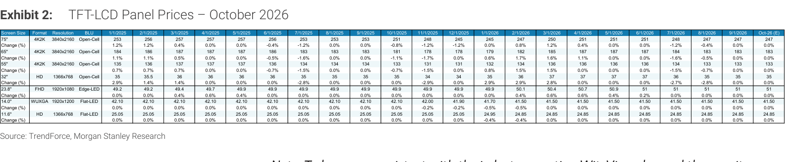
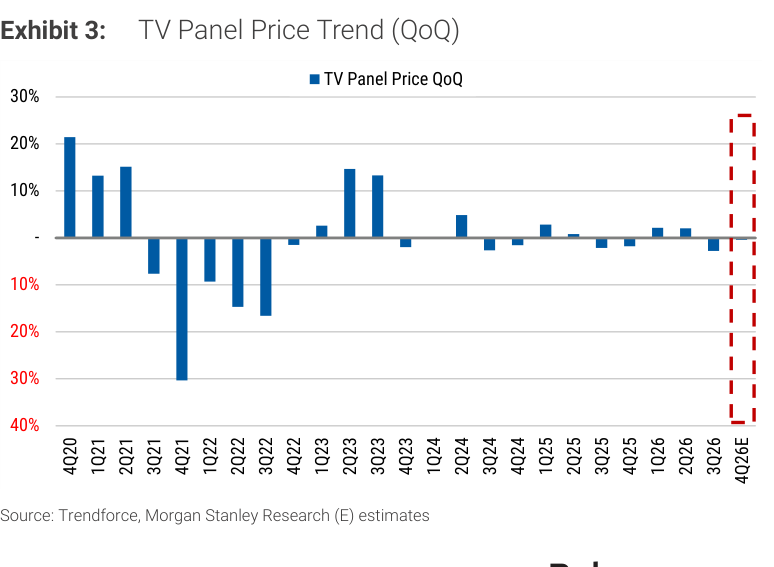
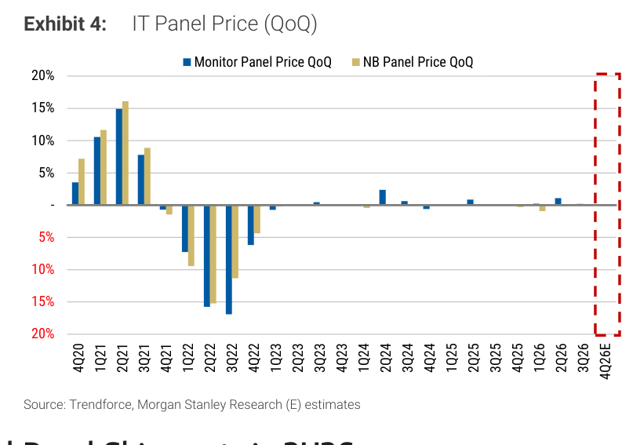
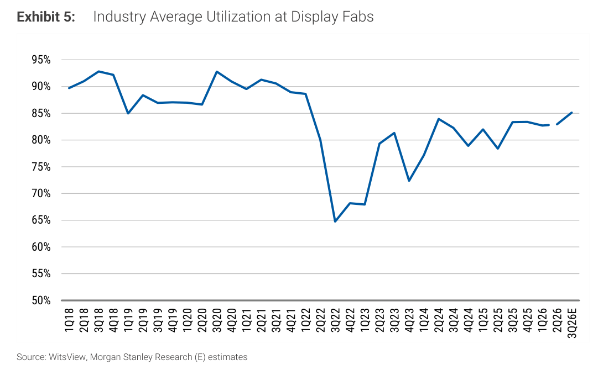
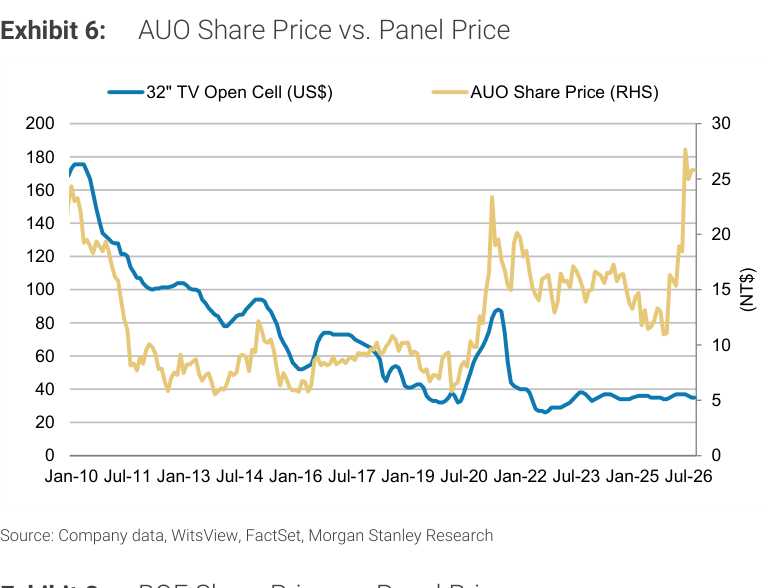
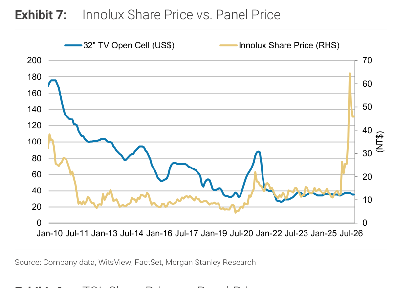
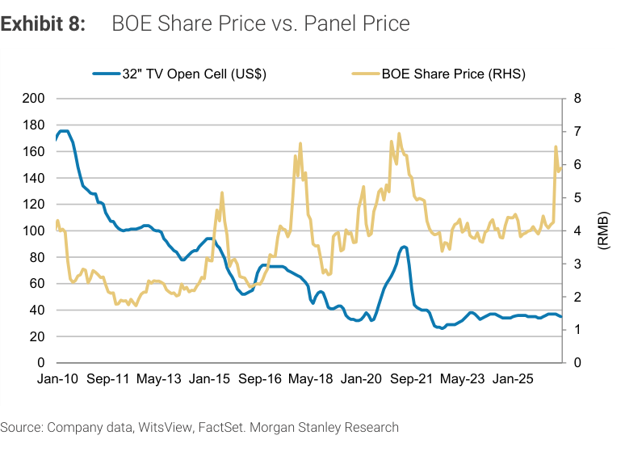
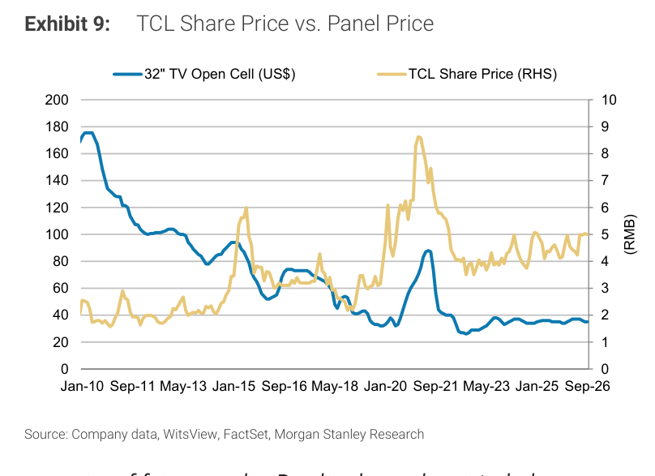
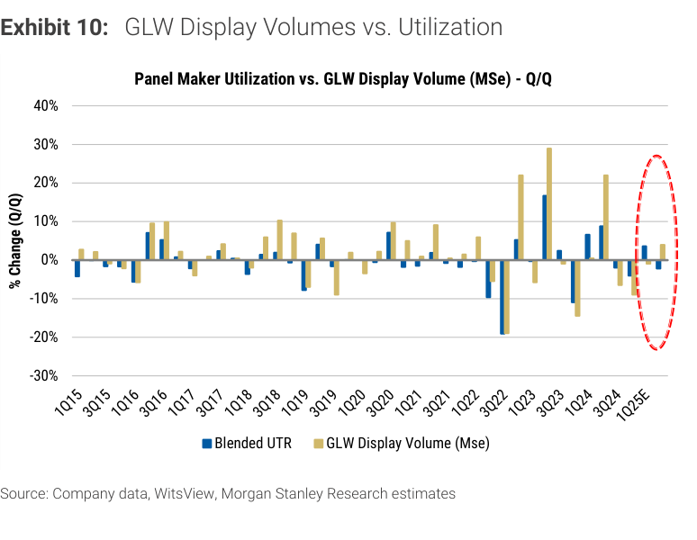

# MS｜TFT-LCD Panel Price Outlook for Oct-26

**券商**：Morgan Stanley  
**分析師**：Derrick Yang、Shawn Kim、Ryan Kim、Vivi Huang、Andy Meng  
**日期**：2026-10-05  
**主題**：TVs, Monitors and NBs Flat MoM  
**評級**：In-Line（Greater China Technology Hardware）  
<a href="https://layx.uk/dl?g=產業&b=MS&d=20261005&h=Panel-Price-Oct">📎 下載 PDF</a>

---

## 報告總結

10 月 TV、螢幕、NB 面板價格全面平盤（MoM 0%）。面板廠原計畫從 4Q26 起漲價以抵銷原料成本壓力，但 TV 品牌面對季節性訂單放緩而抗拒漲價，談判持續進行中；中國面板廠 10 月假期維護有助控制供給。MS 基本預測：TV / IT 面板 4Q26E QoQ 均持平（季均）。最大催化劑：TV 面板廠若堅持漲價且 CNY 備貨潮啟動，漲價可能在 4Q26 末發生。另一主題是玻璃基板進入先進封裝的時間點——MS 認為收入貢獻最快 2028 年，台灣面板廠（AUO 2.0x P/B、Innolux 1.7x P/B）已反映此預期，風險報酬吸引力下降。

---

## MS 完整投資邏輯鏈

| 論點層次 | Exhibit | 內容 |
|---|---|---|
| 現況確認 | 2 | 10 月 TV / IT 面板價格 MoM 0%，談判中 |
| 供給控制 | 5 | 3Q26E 稼動率 ~85%，中國假期維護助控供給 |
| QoQ 趨勢 | 3, 4 | TV / IT 面板 4Q26E 預計季均持平（QoQ 0%）|
| 玻璃基板機會 | - | 先進封裝收入最快 2028H2；競爭者增多，風險待評估 |
| 估值警示 | 6, 7 | AUO 2.0x / Innolux 1.7x P/B 已反映 2H28 玻璃機會，風險報酬減弱 |
| **結論** | - | **維持 In-Line；漲價難度高於市場預期；玻璃機會 2028 才兌現** |

---

## 報告核心觀點

| 主題 | MS 觀點 | 市場共識 | 是否 Contra-Consensus |
|---|---|---|---|
| 4Q26E 面板價格 | QoQ 持平（TV 及 IT），漲價談判有困難 | 部分預期小幅漲價 | 部分 contra |
| 玻璃基板先進封裝 | 最快 2028 年收入，競爭者增多 | 市場偏樂觀，部分預期更早 | 是 |
| 中國廠 偏好 | BOE（1.4x P/B）> TCL（1.7x P/B）；BOE 規模及玻璃基板進展領先 | 無明顯差異 | 部分差異 |

---

## Exhibit 2｜TFT-LCD Panel Prices – October 2026

### 解讀摘要
10 月 TV 大尺寸（32"～75"）與 IT 面板（14"、11.6"）均為 MoM 0% 平盤。TV 面板廠原通知品牌客戶 4Q26 起漲價以因應組件成本，但季節性訂單放緩使漲價執行困難；預計漲價可能延至 4Q26 末（CNY 備貨期）。IT 面板同樣面臨 1H26 提前備貨後的需求回軟，但廠商也不願讓步。

---

## Exhibit 3｜TV Panel Price Trend (QoQ)

### 解讀摘要
TV 面板 4Q26E（紅框）QoQ 估計小幅負值，反映季節性淡季與漲價談判困難並存。歷史上 4Q 通常受 CNY 備貨支撐轉正，但 2026 年的漲價尚未在買方端形成共識，使本季的正負方向存在不確定性。

---

## Exhibit 4｜IT Panel Price (QoQ)

### 解讀摘要
螢幕與 NB 面板 4Q26E 估計 QoQ 持平至略負。IT 面板 1H26 受提前備貨支撐，2H26 進入補庫後需求放緩，廠商在成本壓力下保持定價底線，但難以主動漲價。

---

## Exhibit 5｜Industry Average Utilization at Display Fabs

### 解讀摘要
顯示面板業稼動率 3Q26E 回升至約 85%，與 2022 年低谷（約 65%）相比已顯著回復，接近 2018-2021 年的 85-92% 正常水位。中國面板廠 10 月假期計畫性維護有助維持供給紀律，支撐價格底部。稼動率持續回升是面板廠進一步漲價的必要但非充分條件。

---

## Exhibit 6｜AUO Share Price vs. Panel Price

### 解讀摘要
AUO 股價（NT$）近期升至 ~NT$25-27，為 2022 年以來相對高點，而 32" TV 面板價格長期以來一路下滑至歷史低位。股價與面板價格的顯著背離，反映市場對玻璃基板先進封裝機會的預期溢價。MS 認為此溢價已在 2.0x P/B 中充分反映，上行空間有限。

---

## Exhibit 7｜Innolux Share Price vs. Panel Price

### 解讀摘要
Innolux 股價近期急漲至 ~NT$60，達近十六年新高，與面板價格趨勢大幅背離，反映玻璃基板進入 AI 封裝的市場樂觀情緒。MS 認為 1.7x P/B 已反映 2H28 的玻璃貢獻，近期股價急漲後風險報酬欠佳。

---

## Exhibit 8｜BOE Share Price vs. Panel Price

### 解讀摘要
BOE（中國最大面板廠）股價近期升至約 RMB6，在中國面板廠中 MS 相對偏好 BOE（1.4x P/B）勝於 TCL（1.7x P/B），因 BOE 規模更大、在玻璃基板進展更快。

---

## Exhibit 9｜TCL Share Price vs. Panel Price

### 解讀摘要
TCL 股價近期約 RMB4-5，估值 1.7x P/B 高於 BOE（1.4x P/B），MS 不偏好。TCL 在規模及玻璃基板進展上均落後於 BOE。

---

## Exhibit 10｜GLW Display Volumes vs. Utilization

### 解讀摘要
以 Corning（GLW）玻璃出貨量（MSe）作為顯示面板業稼動率的代理指標。兩者 QoQ 走勢高度相關，1Q25E 顯示稼動率 QoQ 回升（紅圈），GLW 出貨量同步轉正，確認面板業從 2022-23 年的庫存調整中持續復甦。

---

## 相關個股清單

| 類別 | 公司 | Ticker | 評等 | 備註 |
|---|---|---|---|---|
| 台灣面板 | AUO | 2409 TW | - | 2.0x P/B；玻璃基板機會已反映 |
| 台灣面板 | Innolux | 3481 TW | - | 1.7x P/B；近期股價急漲，風險報酬欠佳 |
| 中國面板 | BOE | 000725 SZ | - | 1.4x P/B；MS 偏好，規模及玻璃進展領先 |
| 中國面板 | TCL | 000100 SZ | - | 1.7x P/B；估值偏貴 |
