# UBS｜Global I/O Smartphones: August '26 Sell-Through: No Signs of Recovery Yet

**券商**：UBS  
**分析師**：Nicolas Gaudois、David Vogt、Timothy Arcuri、Randy Abrams、Jimmy Yoon、Luke Yoo、Sunny Lin、Shingo Hirata、Jimmy Yu、Joseph Koh、Kenji Yasui  
**日期**：2026-10-05  
**主題**：August '26 sell-through data; 9th consecutive YoY decline; no recovery signal  
**評級**：N/A（供應鏈偏好：MTK APAC Key Call Buy；Largan Sell）  
<a href="https://layx.uk/dl?g=產業&b=UBS&d=20261005&h=Global-Smartphone">📎 下載 PDF</a>

---

## 報告總結

8 月全球智慧型手機實際銷量（sell-through）85.9m 台，MoM -0.1%、YoY -12.3%，為連續第 9 個月 YoY 下滑；2026 年 1-8 月累計下滑 -8.9%，全區域均為負值（美國 -4.4% 是最淺的缺口）。UBS 維持 2026E 出貨量（sell-in）全年 -10.0% YoY 預測，並將 2027E 從 +2.0% 下修至 -3.0%，理由是 DRAM/NAND 漲價週期預計延伸至 2Q28E/4Q27E，記憶體成本持續擠壓 Android OEM 毛利與出貨意願。Apple 以 YTD +8.7% 是唯一跑贏的主要 OEM，三星 August 開始因折疊機新品（Galaxy Z Fold8 Ultra/Fold8/Flip8）回到正值。供應鏈首選：MediaTek、Samsung（APAC Key Call Buy）；偏好 ASE、Hon Hai、JCET、Micron、Murata、SEMCO、SK Hynix、TSMC（Buy）；對大立光（Largan）維持 Sell。

---

## UBS 完整投資邏輯鏈

| 論點層次 | Figure | 內容 |
|---|---|---|
| 需求結構惡化 | 1, 3 | 全球 Aug '26 YTD -8.9%；9 個月連續 YoY 負成長 |
| 記憶體成本頭風 | 9 | DRAM/NAND 超級週期延伸至 2Q28E；Android OEM sell-in 遠弱於 sell-through |
| 區域差異 | 4-8 | 美國最淺（-4.4%）；中國/印度/歐洲均 -10% 以上 |
| OEM 份額分化 | 10-16 | Apple +8.7%（唯一正值）；中國 Android 全線 -18 至 -23% |
| 規格升級催化劑 | 19-22 | Samsung 旗艦比例回升；iPhone Pro 佔比穩定 ~40%（高 ASP 韌性）|
| 供應鏈選股 | 報告封面 | 偏好 MTK/ASE/鴻海/記憶體；迴避小米；Largan Sell |
| **結論** | 封面 | **維持 '26E -10%；下修 '27E 至 -3%；記憶體成本決定反彈時間點** |

> **報告最大邏輯缺口**：2027 反彈幅度 -3%（從 +2% 下修）的假設依賴記憶體成本在 2H27 之後緩和，但若 HBM 需求持續擠佔 DRAM wafer 供給，記憶體降價時間點可能再度後移——下修風險未消。

---

## 報告核心觀點

| 主題 | UBS 觀點 | 市場共識 | 是否 Contra-Consensus |
|---|---|---|---|
| '26E 全年出貨 | sell-in -10% | 部分預期 -7 至 -8% | 偏保守 |
| '27E 出貨 | -3%（最新下修） | 多數仍估 +2 至 +5% | 是，明顯偏保守 |
| 記憶體成本壓力 | 延伸至 2Q28E/4Q27E | 多數預期 1H27 緩和 | 是，more negative |
| Apple 表現 | 持續正成長，YTD +8.7% | 共識同意 | 確認共識 |
| 中國 Android | 全線 -18 至 -23% | 共識知道弱但幅度可能低估 | 略保守 |

**供應鏈偏好排序**：MediaTek、Samsung（APAC Key Call）> ASE、Hon Hai、JCET、Micron、Murata、SEMCO、SK Hynix、TSMC（Buy） > LG Display、Maxscend、Xiaomi、Apple、Transsion（Neutral）> Largan（Sell）

---

## Figure 1｜Global Smartphone Monthly Unit Sell-Through

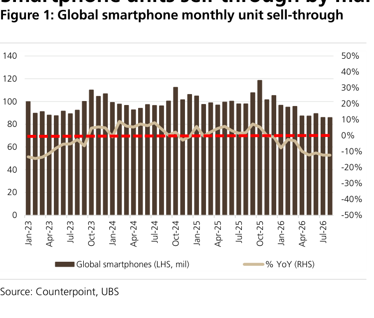

### 解讀摘要

全球智慧手機月度出貨量從 2023 年高峰（季節性 10 月峰值約 110m 台）到 2026 年的 85-90m 台水位，YoY 的走勢在 2025 年 4Q 短暫轉正後，2026 年 1 月起再度轉負，且負幅持續擴大至 -12% 以上。紅色虛線（長期均值約 70m 台）仍遠低於目前水位，反映整體需求結構並非「低於趨勢」而是「趨勢本身下移」。

---

## Figure 2｜Smartphone Monthly Sell-Through by Markets

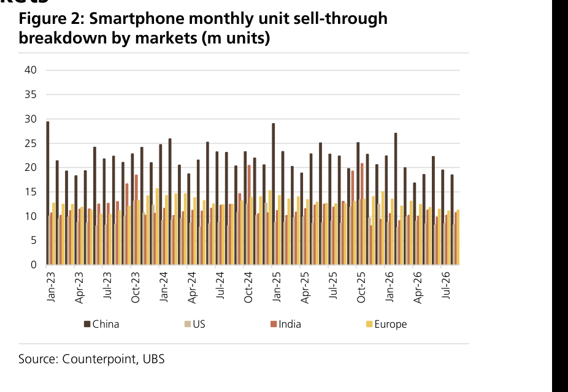

### 解讀摘要

四大市場月度拆分顯示中國（深色，~17-20m）佔絕對大頭，其次是歐洲（~11m）、印度（~10m）、美國（~8m）。各市場走勢與全球一致——2026 年後普遍走弱，印度 Oct '23 高峰後下滑尤為明顯。中國體量最大，中國需求的回溫與否是全球觸底的關鍵。

---

## Figure 3｜YoY Smartphone Sell-Through Growth by Region (August '26 YTD)

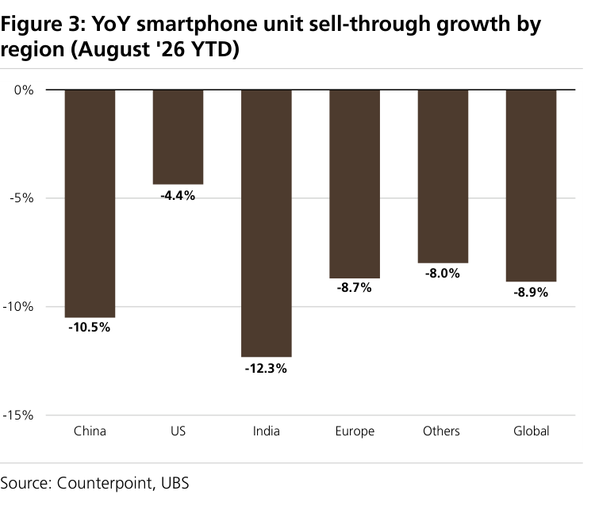

### 解讀摘要

Aug '26 YTD 各地區 YoY：中國 -10.5%、美國 -4.4%（最淺）、印度 -12.3%（最深）、歐洲 -8.7%、其他 -8.0%、全球 -8.9%。美國的相對韌性主要來自 Apple 的正成長對沖 Android 下滑；印度的 -12.3% 最深，反映中低端機型記憶體成本衝擊最大——印度是 \$100-299 段的主力市場。

---

## Figure 4｜YoY Smartphone Sell-Through Growth by Region (Monthly)

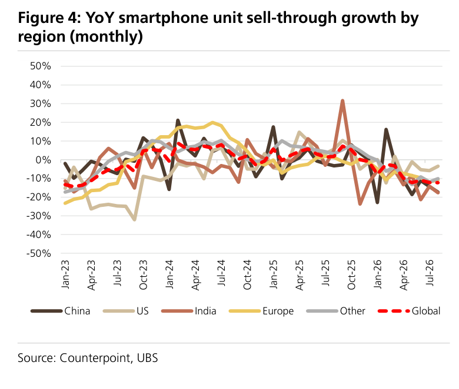

### 解讀摘要

月度 YoY 趨勢圖顯示所有區域在 2026 年後均持續低於 0% 的紅色虛線（全球均值），且無任何一個月出現「觸底反彈」的跡象。中國在 1Q26 甚至急跌至 -20% 以下，印度波動最大。這張圖是 UBS 下修 '27E 的核心根據——沒有任何先行訊號支持市場共識的 V 型反彈假設。

---

## Figure 5｜China Smartphone Monthly Sell-Through

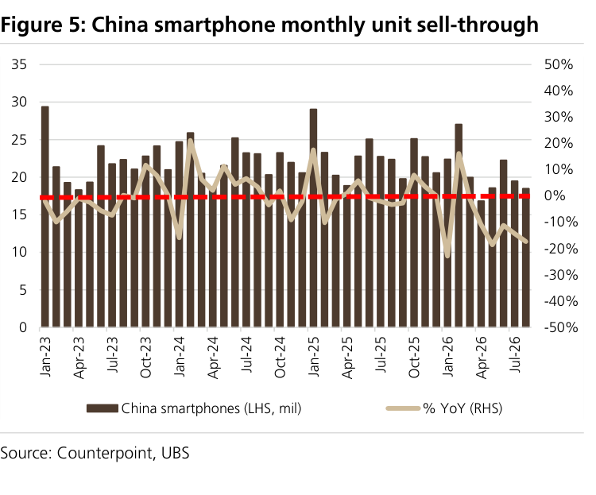

### 解讀摘要

中國月度賣出量在 2025 年短暫回到正 YoY 後，2026 年從 Jan 起轉為 -15 至 -20% 的深度負成長。7 月約 17m 台是近 4 年低點之一。Transsion/Oppo/Vivo/Xiaomi 在中國的市佔份額（Fig 12）顯示 Huawei 回歸搶走大量份額，是 Android OEM 在中國遭遇的額外逆風。

---

## Figure 6｜US Smartphone Monthly Sell-Through

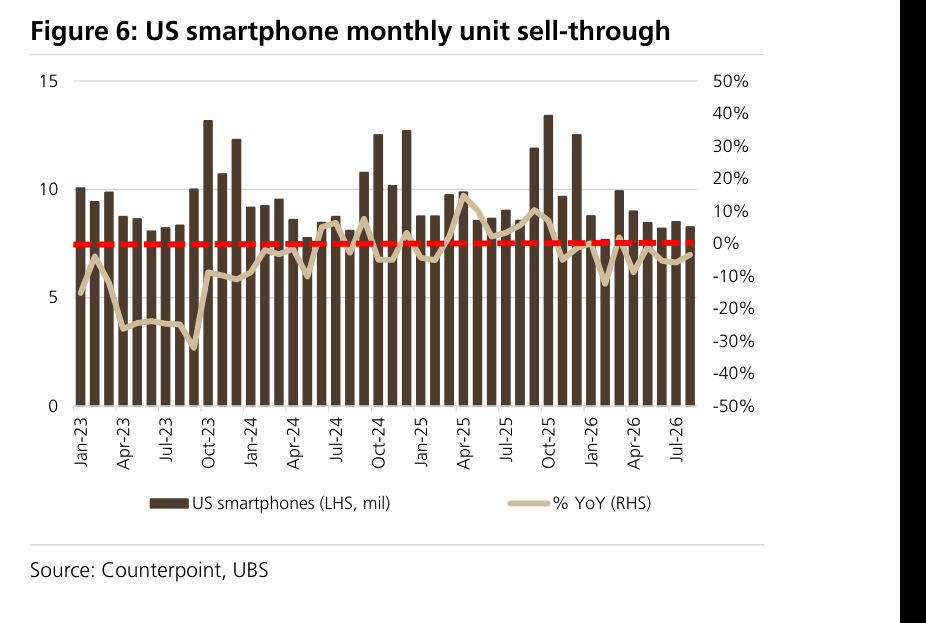

### 解讀摘要

美國市場最為穩健——月度量維持 ~7-9m 台，YoY 在 -3.4%（Aug '26）為最淺缺口，接近持平。驅動因素是 Apple（市占 ~60-65%，Fig 13）iPhone 升級週期穩定，以及美國消費者對高端機型較不敏感於記憶體成本漲價。

---

## Figure 7｜India Smartphone Monthly Sell-Through

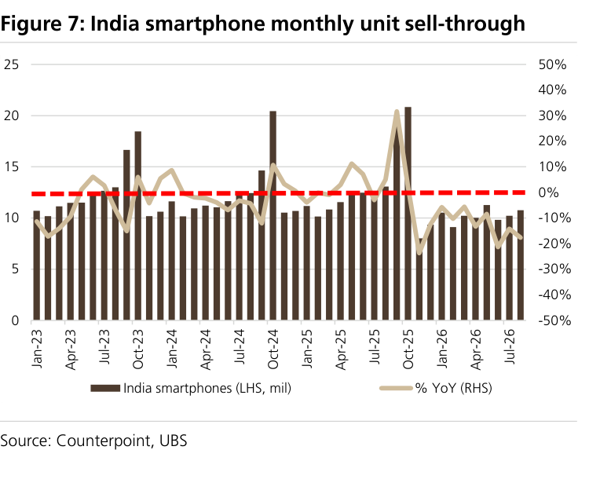

### 解讀摘要

印度月度量 ~10-12m 台，YoY 在 Aug '26 約 -12%（為 UBS 所述 "most incremental downside" 的來源）。波動性高（Oct '24 月峰超過 20m 台）。記憶體成本頭風對印度市場衝擊最大，因為印度主力價位段（\$100-299）的利潤最薄，OEM 無法吸收成本增加。

---

## Figure 8｜Europe Smartphone Monthly Sell-Through

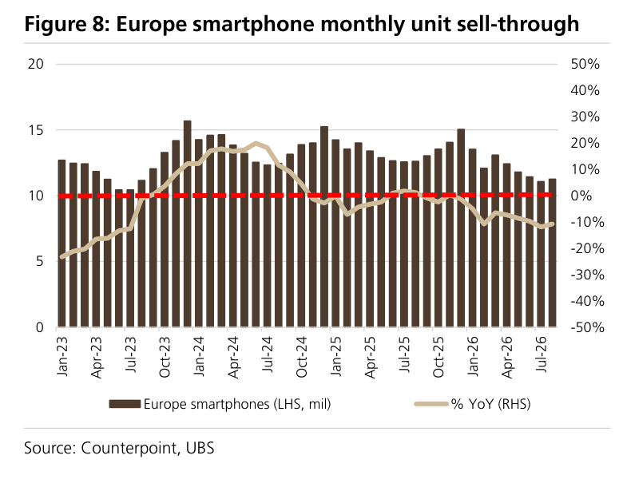

### 解讀摘要

歐洲月度量 ~10-12m 台，2024 上半年受益於旅遊季短暫走強後，2026 年滑落至 YoY -8.7%（YTD）。歐洲市場的主要特徵是 Samsung 高佔比（~30%，Fig 15）使其對 Samsung Galaxy 折疊機的回彈有邊際正向敏感度。

---

## Figure 9｜YoY Sell-In vs Sell-Through by OEM (1H26)

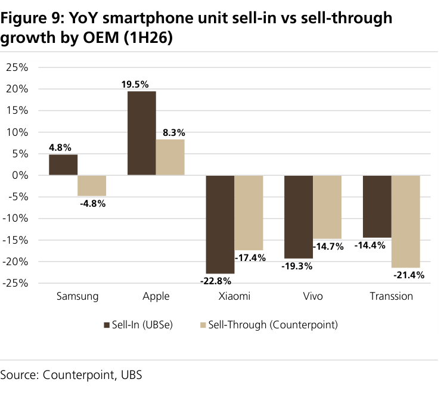

### 解讀摘要

1H26 的 sell-in vs sell-through 背離是本報告最重要的庫存訊號：Apple sell-in +19.5% 遠高於 sell-through +8.3%（+11.2ppt 差距），代表 Apple 供應鏈（TSMC、鴻海、Murata）在積極備貨；Samsung sell-in +4.8% vs sell-through -4.8%（+9.6ppt），亦在建庫存。中國 Android（Xiaomi/Vivo/Transsion）sell-in 比 sell-through 更負，說明在主動去庫存——而非需求更差。

### 表格

| OEM | Sell-In YoY (UBSe) | Sell-Through YoY | 差距（SI - ST） | 解讀 |
|---|---|---|---|---|
| Samsung | +4.8% | -4.8% | +9.6ppt | 正在建庫存 |
| Apple | +19.5% | +8.3% | +11.2ppt | 積極備貨 |
| Xiaomi | -22.8% | -17.4% | -5.4ppt | 主動去庫存 |
| Vivo | -19.3% | -14.7% | -4.6ppt | 主動去庫存 |
| Transsion | -14.4% | -21.4% | +7.0ppt | 去庫存不夠快 |

> **洞察一**：Apple sell-in 比 sell-through 高 11ppt，代表鴻海/Murata/TSMC 的 Apple 相關訂單在 1H26 被「人工放大」；若 2H26 補貨節奏放緩，這些供應商可能面臨 2H26 的訂單修正——這是 UBS 維持謹慎的隱含風險。
> **洞察二**：中國 Android OEM 在主動去庫存，意味 sell-through 的真實需求下滑比 sell-in 數字顯示的還要嚴重——去庫存行動如果提前結束，可能給出錯誤的需求回溫訊號。

---

## Figure 10｜YoY Smartphone Sell-Through Growth by OEM (August '26 YTD)

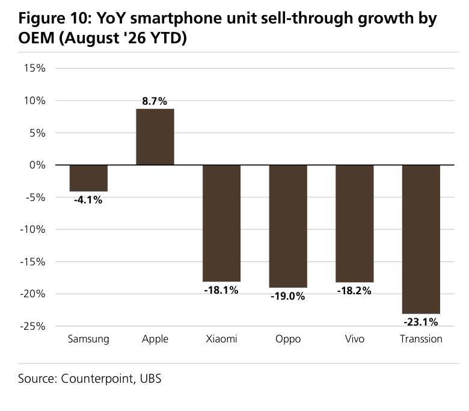

### 解讀摘要

YTD OEM 表現兩極分化：Apple +8.7% 是唯一正值大型 OEM；Samsung -4.1%（相對好）；Xiaomi -18.1%、Oppo -19.0%、Vivo -18.2%、Transsion -23.1%。中國 Android OEM 的集體崩跌反映記憶體成本逼近其利潤底線，導致 OEM 主動砍貨而非吸收成本。

---

## Figure 11｜Global Smartphone Market Share by OEM

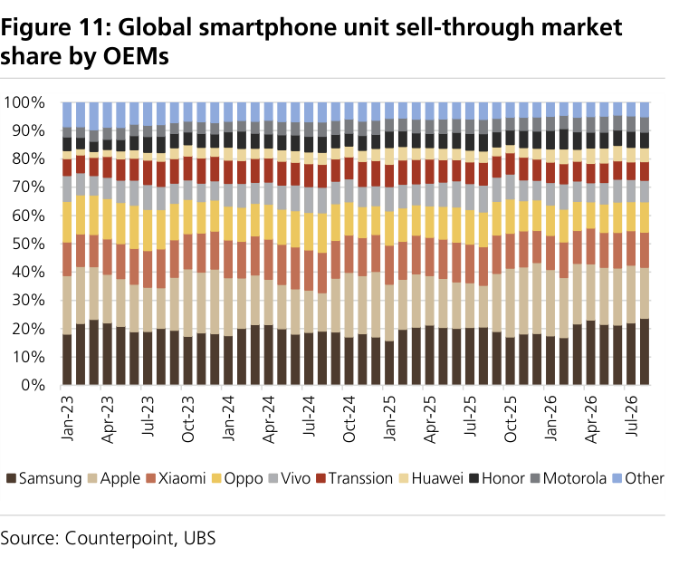

### 解讀摘要

全球市占格局：Samsung ~20%（穩定），Apple ~17%（上升），Xiaomi ~13%，Oppo ~12%，Vivo ~10%，Transsion ~6-7%，Huawei ~5%，Honor ~5%。2026 年最顯著的變化是 Apple 份額持續爬升、Transsion 份額從高點回落，反映低端市場被記憶體成本衝擊最深。

---

## Figure 12｜China Smartphone Market Share by OEM

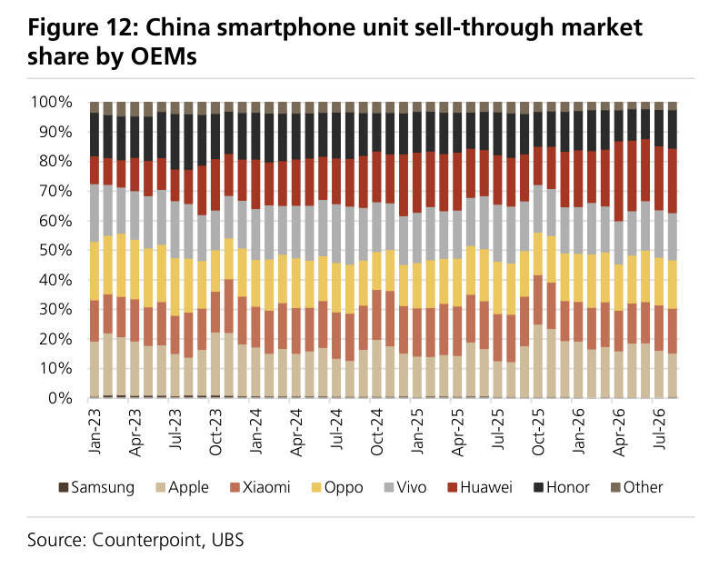

### 解讀摘要

中國市占：Vivo/Oppo（各 ~18-20%）合計逾 35% 為最大集團，Xiaomi ~17%，Huawei ~15%（2024 後回升明顯），Honor ~12%，Apple ~10%，Samsung 幾乎可忽略（<1%）。Huawei 的份額回升直接搶奪 Xiaomi/Oppo/Vivo 的中高端客群，是中國 Android OEM 在中國加速失血的主因之一。

---

## Figure 13｜US Smartphone Market Share by OEM

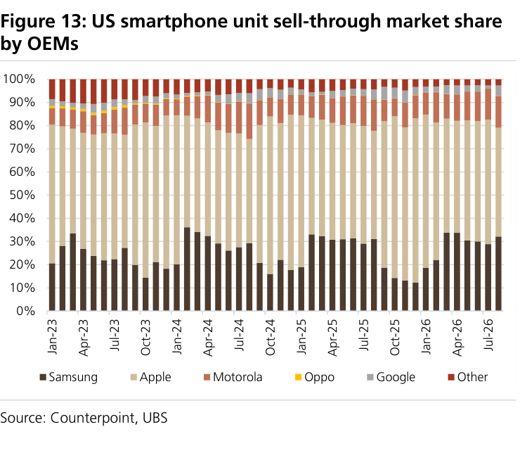

### 解讀摘要

美國市場：Apple 主導 ~60-65%（穩定且微升），Samsung ~25-30%，Motorola ~5-8%，Google Pixel ~2-3%。美國市場的高 Apple 佔比使其成為全球最抗跌的地區，也是 UBS 對 Apple 維持正面看法的市場數據依據。

---

## Figure 14｜India Smartphone Market Share by OEM

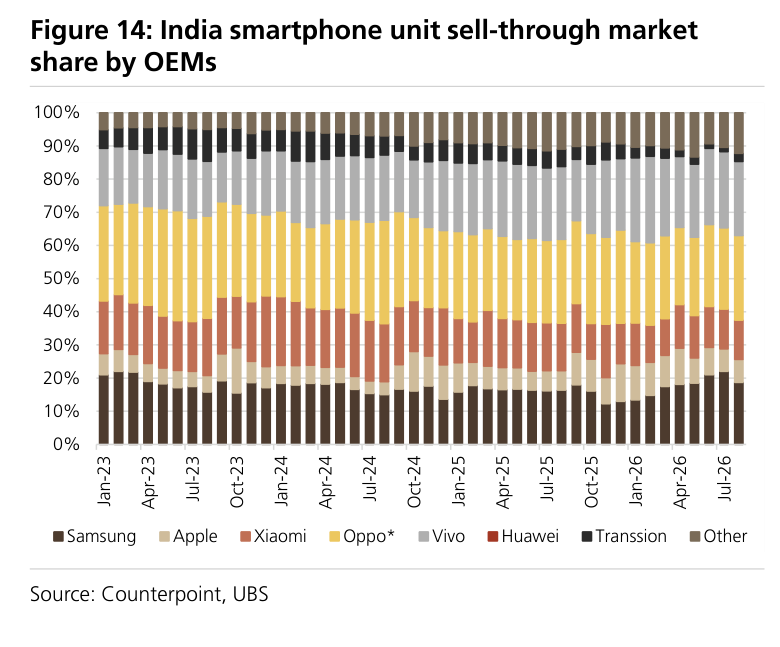

### 解讀摘要

印度市占競爭激烈：Oppo（含 OnePlus，\*）~25-30%，Vivo ~20-25%，Xiaomi ~12-15%，Samsung ~12-15%，Transsion ~8%，Apple ~3-5%（小但上升）。印度市場高度競爭且以 \$100-299 低端為主，記憶體成本衝擊最直接，因此 -12.3% YTD 是全球最深的跌幅。

---

## Figure 15｜Europe Smartphone Sell-Through by OEM

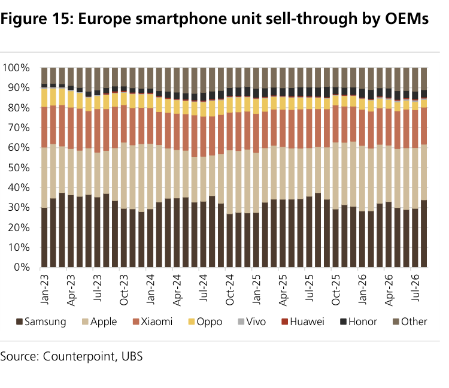

### 解讀摘要

歐洲市占：Samsung ~30-35% 主導，Apple ~25-30%（穩定），Xiaomi ~15%，Huawei（受制裁）&Honor 合計 ~5-10%。歐洲的 Samsung 高佔比使其折疊機新品（Aug '26 推出）對歐洲整體數據的正面讀數影響高於其他地區。

---

## Figure 16｜RoW Smartphone Market Share by OEM

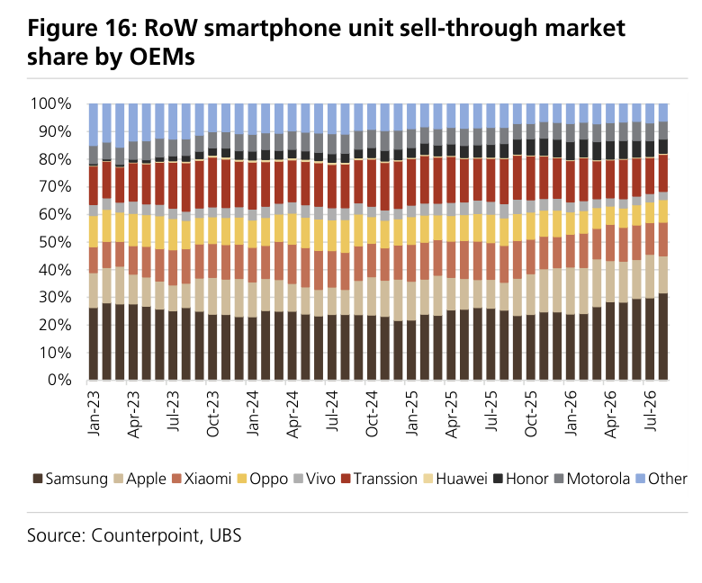

### 解讀摘要

其他地區（RoW）是 Transsion 的主戰場（Transsion 佔 ~15-20%），Samsung ~25%，Xiaomi/Oppo/Vivo 各 ~10-15%。Transsion 在 RoW 的份額高使其 YTD -23.1% 的劇烈下滑對整體 RoW 數字有顯著拖累，但同時也是 Transsion 未來任何需求回溫的最大槓桿。

---

## Figure 17｜Global Smartphone Sell-Through by Price Band

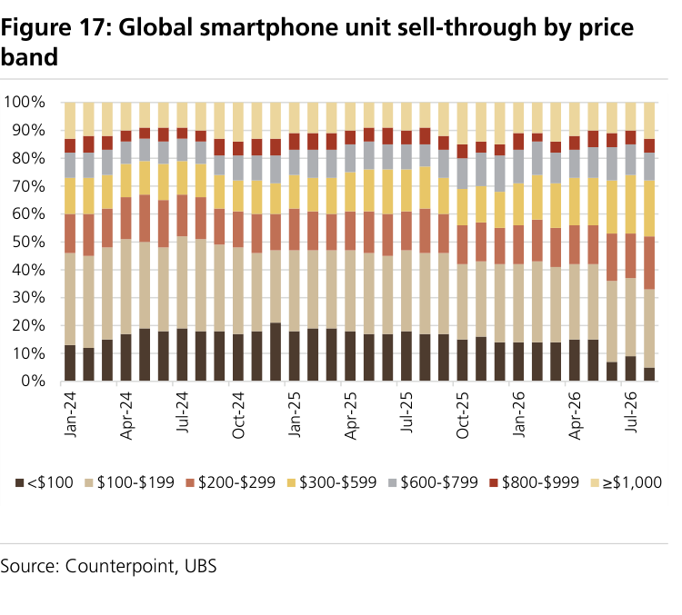

### 解讀摘要

全球手機價格帶分布：\$300-599 是最大段（~30-35%），\$100-199 降至 ~15%，\$200-299 約 20%，\$600-799 約 10%，≥\$1,000 約 5%，<\$100 段近乎消失（2026 年 Jul 降至 ~3%）。趨勢方向明確：低端（<\$200）萎縮、中高端（\$300-599）穩定、旗艦（≥\$800）韌性強。這是 UBS 偏好 Apple（全旗艦）而對 Transsion/小米（低端重）保守的核心根據。

---

## Figure 18｜OEM Smartphone Sell-Through Mix by Price Band (August '26)

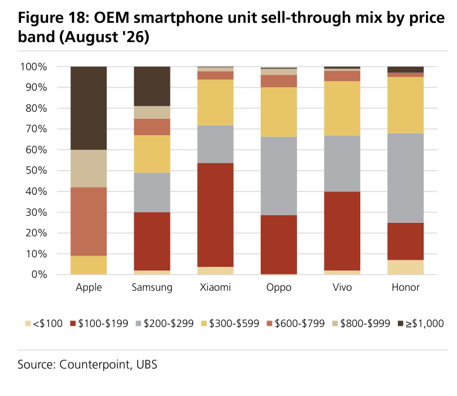

### 解讀摘要

OEM 定價結構對比（Aug '26）：Apple ~40% ≥\$800 + ~20% \$600-799（幾乎全高端）；Samsung ~30% \$300-599 + ~25% \$600-799（中高端平衡）；Xiaomi 集中 \$100-299（約 53%）；Oppo/Vivo 以 \$200-599 為主；Honor 集中 \$200-599。記憶體成本頭風對 \$100-299 段的利潤衝擊最嚴重（以 Xiaomi 為例），對 Apple 幾乎沒有影響。

> **洞察一（配合 Figure 9）**：Xiaomi 53% 集中在 \$100-299 段，正好是記憶體成本佔 BOM 比例最高的價位——這解釋了 Xiaomi sell-in 被主動砍 -22.8% 的原因：利潤壓力逼迫 OEM 主動降低出貨而非吸收成本。

---

## Figure 19｜Samsung Smartphone Sell-Through and Flagship as % of Total

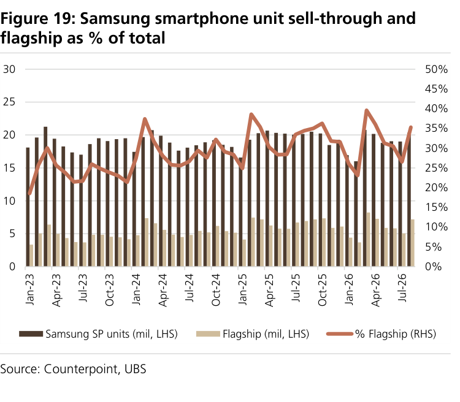

### 解讀摘要

Samsung 整體月銷量 ~18-20m 台，旗艦（flagship）佔比約 30-40%（~5-7m 台/月）。Aug '26 旗艦佔比回升至 ~35%（因折疊機新品），是 Samsung YoY 開始改善（8 月 +0.9%）的主要驅動。Samsung 整體量雖然 YTD -4.1%，但旗艦 ASP 上升可部分彌補量的損失。

---

## Figure 20｜Samsung Galaxy S Series Product Mix

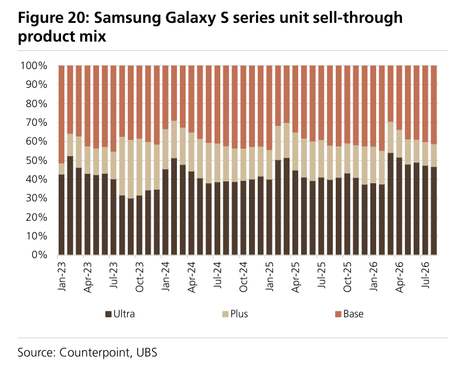

### 解讀摘要

Galaxy S 系列組合：Ultra 佔 ~40-50%，Base 佔 ~40-50%，Plus ~10-15%，且 Plus 比重有逐年下滑趨勢。Ultra 維持高比例反映 Samsung 旗艦的高端消費者需求韌性，但 Base 型號的持續高佔比也說明 Samsung 旗艦客群仍以「性價比旗艦」為主而非純高端化。

---

## Figure 21｜iPhone Sell-Through and New Pro Models as % of Total

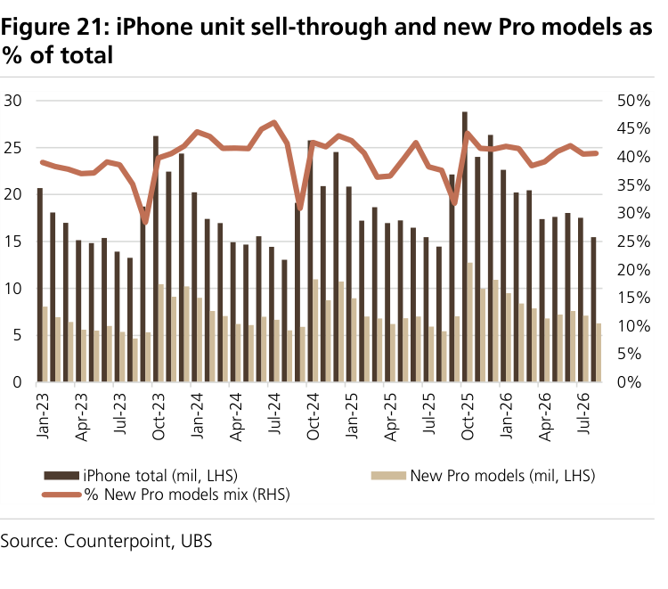

### 解讀摘要

iPhone 月度銷量 ~15-20m 台，新 Pro 機型（新品週期前後 12 個月）比例穩定維持在 ~40%（RHS 橙色線）。Aug '26 iPhone 總量 ~15-17m 台，New Pro 佔比 ~40%。Pro 系列的穩定高佔比是 Apple 能維持 ASP 在 ~\$850+ 的關鍵，也是其相較中國 Android OEM 完全不受記憶體成本擠壓的核心原因。

---

## Figure 22｜iPhone Series New Models Unit Sell-Through Product Mix

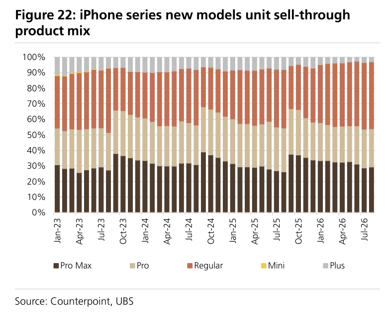

### 解讀摘要

iPhone 新機型組合（僅新品週期）：Pro Max 穩定 ~30%，Pro ~25%，Regular ~30%，Plus ~5-8%，Mini 趨近於零。Pro Max + Pro = ~55% 佔比（高端旗艦主導），與 UBS 對 TSMC（A 系列 SoC 旗艦製程）、Largan（攝影模組，但以 Sell 表示相機不再是差異化升級驅動）形成對比。

> **洞察一**：Mini 系列消亡而 Regular 維持 ~30% 說明 Apple 的銷量底部在 \$799 Regular 而非 Mini 機型——這是 Apple YTD +8.7% 但 Regular 仍佔量，高 ASP 旗艦補充的混合效果。

---

## 相關個股清單

| 類別 | 公司 | Ticker | 評等 | 備註 |
|---|---|---|---|---|
| IC 設計 | 聯發科 | 2454 TW | APAC Key Call Buy | 手機 AP 市占最高；最受益 Android 需求回溫 |
| ODM-EMS | 鴻海 | 2317 TW | Buy | Apple 最大代工廠；1H26 備貨比 ST 高 11ppt |
| 半導體封測 | 日月光 | 3711 TW | Buy | — |
| 半導體封測 | 長電科技 | JCET SH | Buy | — |
| 記憶體 | 美光 | MU US | Buy | DRAM/NAND 漲價週期延伸至 2Q28E |
| 記憶體 | 三星 | 005930 KS | APAC Key Call Buy | 折疊機新品 + DRAM 受惠 |
| 記憶體 | SK Hynix | 000660 KS | Buy | HBM + DRAM |
| 被動元件 | 村田製作所 | 6981 JP | Buy | Apple 備貨受惠 |
| 被動元件 | 三星電機 | 009150 KS | Buy | — |
| 晶圓代工 | 台積電 | 2330 TW | Buy | Apple A 系列、MTK Dimensity |
| 光學 | 大立光 | 3008 TW | Sell | 攝影模組非升級驅動 |
