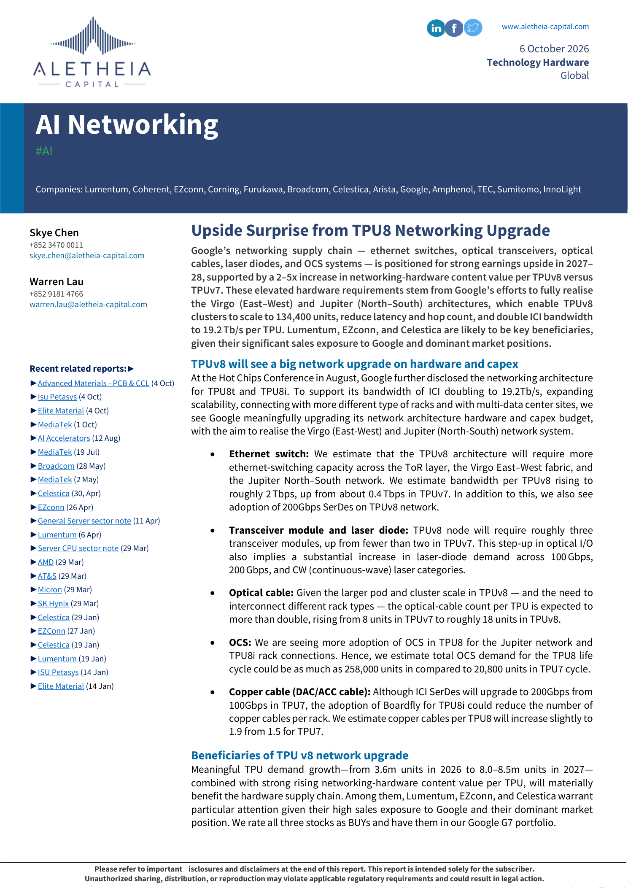
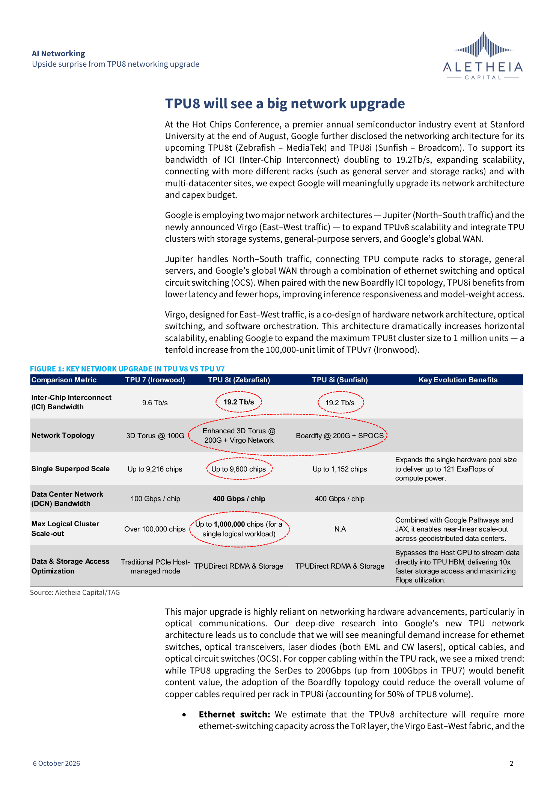
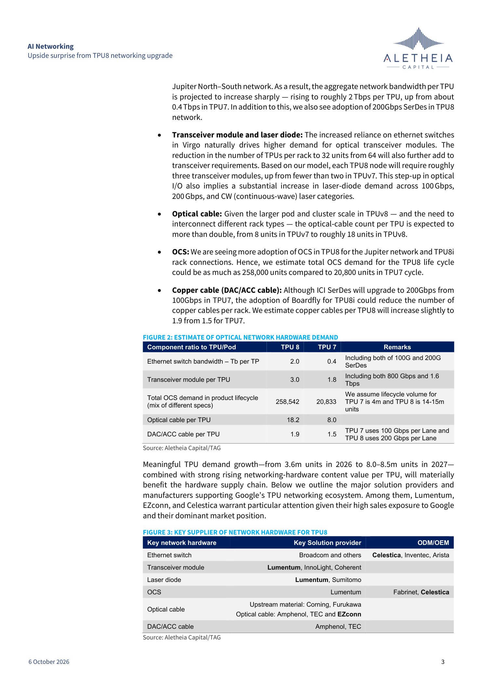
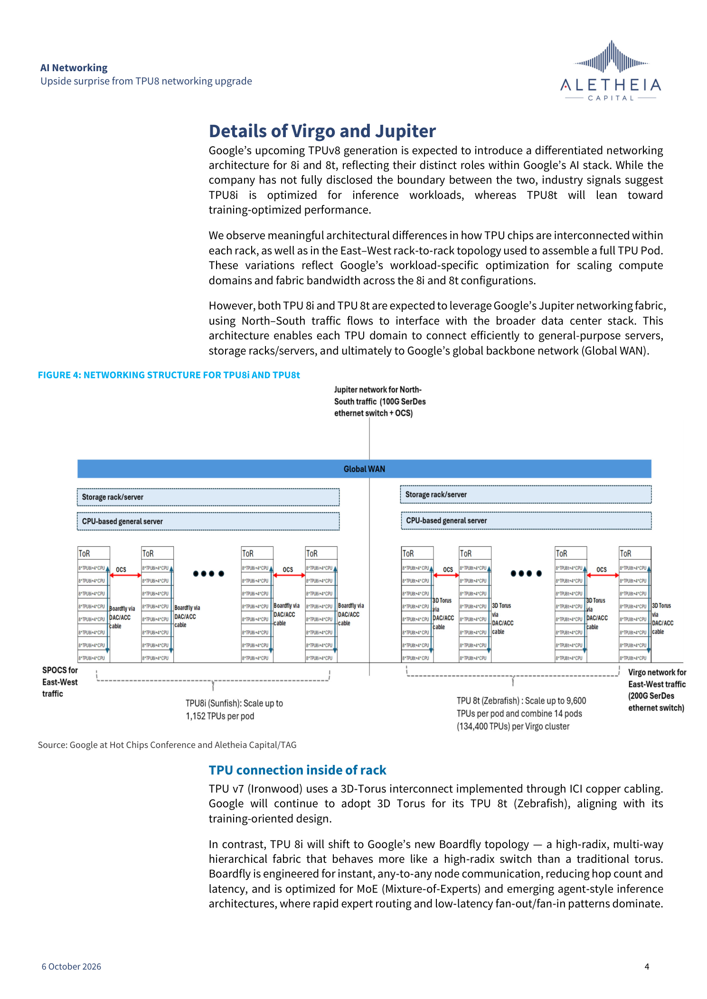
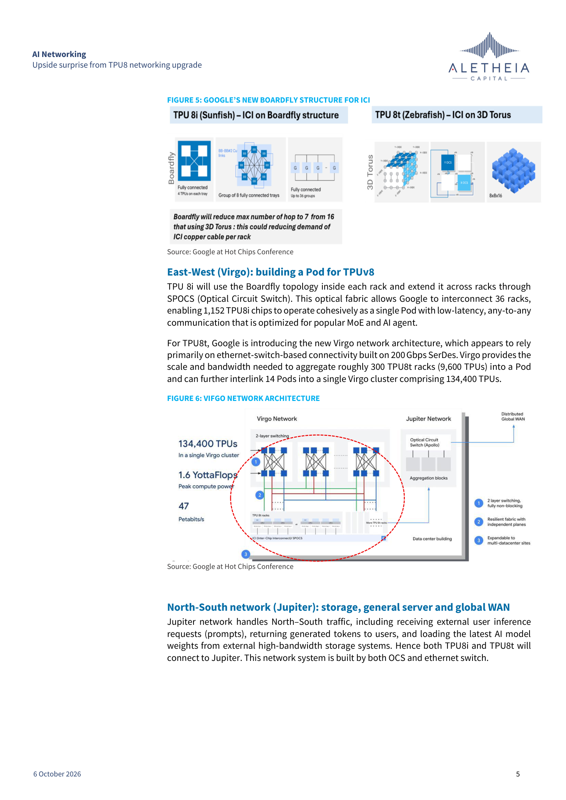

# Aletheia Capital｜AI Networking

**券商**：Aletheia Capital  
**分析師**：Skye Chen、Warren Lau  
**日期**：2026-10-06  
**主題**：TPU v8 網路硬體升級帶來的上行驚喜（Upside Surprise from TPU8 Networking Upgrade）  
<a href="https://layx.uk/dl?g=產業&b=Aletheia&d=20261006&h=AI-Networking">📎 下載 PDF</a>

---

## 報告總結

Google TPU v8（TPU8t/Zebrafish + TPU8i/Sunfish）架構在熱晶片大會（Hot Chips）進一步揭露後，Aletheia 估計每顆 TPU 的網路硬體內容值將較 TPU7 提升 2–5 倍——主因是 ICI 頻寬加倍至 19.2 Tb/s、光纜數量翻倍、transceiver 模組從 1.8 增至 3.0 顆，以及 OCS 生命週期需求從 20,833 顆暴增至 258,542 顆。結合 TPU 出貨量從 2026 年 3.6m 顆成長至 2027 年 8.0–8.5m 顆，Lumentum、EZconn、Celestica 是最直接受益標的。

---

## Aletheia 完整投資邏輯鏈

| 論點層次 | 圖表 | 內容 |
|---|---|---|
| 需求信號明確 | Fig. 1 | Google 正式揭露 TPU8t/8i 雙架構，ICI 頻寬翻倍至 19.2 Tb/s，單叢集規模擴至 134,400 TPU |
| 硬體內容提升 | Fig. 2 | 每 TPU 光纜 8→18.2 條（+128%）、transceiver 1.8→3.0 顆（+67%）、OCS 生命週期需求 +1,142% |
| 供應鏈受益排序 | Fig. 3 | Lumentum（transceiver+laser+OCS）、EZconn（光纜）、Celestica（乙太交換 ODM+OCS 組裝）最高曝險 |
| 出貨量驅動 | 封面 | TPU 需求 2026E 3.6m→2027E 8.0–8.5m，量價齊升放大受益幅度 |
| **結論** | 封面 | **三標的均為 Buy；Lumentum/EZconn/Celestica 在 Google G7 投組；建議現在布局** |

---

## 報告核心觀點

| 主題 | Aletheia 觀點 | 市場共識 | 是否 Contra-Consensus |
|---|---|---|---|
| TPU8 網路升級幅度 | 每 TPU 硬體內容值 +2–5x vs TPU7 | 市場尚未充分定價 | 是（上行驚喜） |
| OCS 需求 | 生命週期 258,542 顆 vs TPU7 的 20,833 | 共識低估 OCS 滲透率 | 是 |
| 光纜受益者 | EZconn（Google 主供）、Amphenol、TEC | 市場較少關注 EZconn TPU8 曝險 | 是 |
| 銅纜趨勢 | Boardfly 拓撲減少每 rack ICI 銅纜（hop 數 16→7）但整體略升 1.5→1.9 條/TPU | 銅纜稀釋擔憂被放大 | 是（影響有限） |

**偏好排序**：Lumentum（最高曝險：transceiver+laser diode+OCS 三重）> Celestica（乙太交換 ODM+OCS 組裝）> EZconn（光纜，Google G7 直供）

---

## Page 1｜報告封面與投資主題

### 解讀摘要
Google TPU v8 的網路架構在 Hot Chips Conference（Aug-26）進一步披露，確立了 Virgo（East–West）與 Jupiter（North–South）雙架構。TPU8t（Zebrafish）最大叢集達 134,400 顆，TPU8i（Sunfish）以 Boardfly+SPOCS 實現 1,152 顆低延遲 pod。報告催化劑：Hot Chips 新披露使 Aletheia 得以量化每 TPU 的網路硬體內容升幅，為此前最高精度的 TPU8 供應鏈估算。

---

## Page 2｜Fig. 1：TPU7 vs TPU8 關鍵規格比較

### 解讀摘要
TPU8t ICI 頻寬從 9.6 Tb/s 翻倍至 19.2 Tb/s；網路拓撲升級為 200G SerDes 的 Enhanced 3D Torus（TPU8t）或 Boardfly+SPOCS（TPU8i）。最大邏輯叢集從 10 萬顆擴張至 100 萬顆（TPU8t，單一工作負載），意味著 Google 可組建跨多資料中心的超大規模訓練叢集。

### 表格（Fig. 1）

| 規格 | TPU 7（Ironwood） | TPU 8t（Zebrafish） | TPU 8i（Sunfish） |
|---|---|---|---|
| ICI 頻寬 | 9.6 Tb/s | **19.2 Tb/s** | 19.2 Tb/s |
| 網路拓撲 | 3D Torus @100G | Enhanced 3D Torus @200G + Virgo Network | Boardfly @200G + SPOCS |
| 單一 Superpod 規模 | 9,216 chips | 9,600 chips | 1,152 chips |
| DC Network 頻寬/chip | 100 Gbps | **400 Gbps** | 400 Gbps |
| 最大邏輯叢集 | 100,000+ chips | **1,000,000 chips**（單一邏輯工作負載） | N/A |
| 資料/儲存存取 | PCIe Host-managed | TPUDirect RDMA & Storage | TPUDirect RDMA & Storage |

> **洞察一**：TPU8t 的最大邏輯叢集 10 倍於 TPU7（100k→1,000,000），意味著 Google 可將橫跨多個 Virgo 叢集的訓練工作負載串接，對乙太交換機與光纜需求是「面積乘以深度」的複合提升——不僅每 TPU 用量增加，整體集群尺度也大幅擴張。

---

## Page 3｜Fig. 2 & 3：光網路硬體需求估算 + 主要供應商

### 解讀摘要
每 TPU 光纜數量從 8 升至 18.2（+128%），transceiver 從 1.8 升至 3.0（+67%），OCS 生命週期需求從 20,833 升至 258,542（+1,142%）。Lumentum 在 transceiver、laser diode、OCS 三條線均是主要供應商，是最高受益者；EZconn 為 Google 光纜直供商（Amphenol、TEC 為另二家）。

### 表格（Fig. 2）

| 元件 | TPU 8 | TPU 7 | 備註 |
|---|---|---|---|
| 乙太交換頻寬（Tb per TP） | 2.0 | 0.4 | 含 100G 與 200G SerDes |
| Transceiver 模組/TPU | 3.0 | 1.8 | 含 800G 及 1.6 Tbps |
| OCS 生命週期總需求 | **258,542** | 20,833 | TPU7 生命週期 4m，TPU8 14–15m 單位 |
| 光纜/TPU | **18.2** | 8.0 | |
| DAC/ACC 銅纜/TPU | 1.9 | 1.5 | TPU7 @100Gbps/Lane，TPU8 @200Gbps/Lane |

### 表格（Fig. 3）

| 關鍵網路硬體 | 主要元件供應商 | ODM/OEM |
|---|---|---|
| 乙太交換機 | Broadcom and others | **Celestica**, Inventec, Arista |
| Transceiver 模組 | **Lumentum**, InnoLight, Coherent | — |
| Laser diode | **Lumentum**, Sumitomo | — |
| OCS | Lumentum | Fabrinet, **Celestica** |
| 光纜 | 上游：Corning、Furukawa；成品：Amphenol、TEC、**EZconn** | — |
| DAC/ACC 銅纜 | Amphenol, TEC | — |

> **洞察二**：OCS 生命週期需求 +1,142% 是本報告最大的驚喜數字——市場普遍低估 OCS 在 Jupiter 網路的滲透率。Lumentum 是 OCS 的主要元件商，Celestica 是主要組裝商，兩者在此線的雙重受益尚未充分定價。

---

## Page 4｜Fig. 4：TPU8i/8t 網路結構

### 解讀摘要
TPU8i（Sunfish）使用 Boardfly 拓撲在 rack 內互連，並透過 SPOCS 光學電路交換延伸至跨 rack，36 個 rack 組成 1,152 TPU Pod。TPU8t（Zebrafish）沿用 3D Torus，14 個 Pod（9,600 TPU 各）組成 134,400 TPU Virgo 叢集，並以 200G SerDes 乙太交換機作為 Virgo East–West Fabric。

---

## Page 5｜Fig. 5 & 6：Boardfly 架構 + Virgo 網路

### 解讀摘要
Boardfly 將最大 hop 數從 16（3D Torus）降至 7，降低延遲並優化 MoE（Mixture-of-Experts）及 AI agent 推論的 fan-out/fan-in 模式。Virgo 叢集提供 1.6 YottaFlops 峰值算力與 47 Petabits/s 頻寬，支援跨多資料中心站點的橫向擴展。Boardfly 雖減少每 rack ICI 銅纜需求（hop 減少→銅纜路徑縮短），但整體每 TPU 銅纜量仍從 1.5 微升至 1.9（TPU8i 採用 Boardfly 約佔 TPU8 總量 50%）。

---

## 相關個股清單

| 類別 | 公司 | Ticker | 評等 | 備註 |
|---|---|---|---|---|
| Transceiver/Laser/OCS | Lumentum | LITE | Buy | 最高 TPU8 受益，三條線主供 |
| 光纜 | EZconn | — | Buy | Google 主要光纜直供商 |
| 乙太交換 ODM/OCS 組裝 | Celestica | CLS | Buy | 交換機 ODM + OCS 組裝雙重受益 |
| Transceiver | InnoLight | 非上市 | — | 中國 transceiver 廠 |
| Transceiver | Coherent | COHR | — | |
| 乙太交換晶片 | Broadcom | AVGO | — | |
| 光纜上游 | Corning | GLW | — | 光纖上游 |
| 銅纜 | Amphenol | APH | — | DAC/ACC 主供 |
