# MS｜Integrated Power Solutions

**券商**：Morgan Stanley  
**分析師**：Derrick Yang、Kazuo Yoshikawa CFA、Andy Meng CFA、Vivi Huang、Hidetaka Suzuki  
**日期**：2026-10-06  
**主題**：AI 資料中心整合電源解決方案—PSU/BBU/CBU/800VDC/SST 結構性需求  
**評級**：Greater China Tech Hardware — In-Line  
<a href="https://layx.uk/dl?g=產業&b=MS&d=20261006&h=Integrated-Power-Solutions">📎 下載 PDF</a>

---

## 報告總結

MS 以承接覆蓋（assuming coverage）方式同步啟動 Delta（2308，OW，PT NT\$2,500↓）和 Lite-On（2301，EW，PT NT\$315↑）研究，並以此報告建立整合電源解決方案的產業框架。催化劑來自 Nvidia Blackwell → GB300 → Vera Rubin 世代推進帶動機架 TDP 從 40KW（Hopper）飆升至預估 >300KW（VR300 NVL72），迫使資料中心從傳統 480VAC 轉向 800VDC 架構，PSU/BBU/CBU/SST 技術門檻同步提升。MS 預估資料中心 PSU 市場三年 CAGR 75%、2028 年達 US\$33bn；800VDC 機架 BOM 中 PSU 佔 50-55%、BBU 佔 25-30%，整合方案業者每 W 單價為傳統方案 4-5 倍。Delta 以整合電源/散熱方案為核心競爭力，44% 營收 CAGR 驅動 63% EPS CAGR（2025-28），估值 30x 2027/2028 P/E 有充分支撐；Lite-On HVDC 進展較慢，給予 17x P/E（EW）。

---

## MS 完整投資邏輯鏈

| 論點層次 | Exhibit | 內容 |
|---|---|---|
| 需求加速 | 28, 29 | Reasoning model 算力需求 5-20x、multiagent 10-50x，GPU TDP 指數增長 |
| 功率密度危機 | 31, 33 | 機架 TDP：Hopper 40KW → VR300 NVL72 >300KW；PSU 功率密度：Hopper 3.2KW → Rubin 18.3KW per PSU |
| 架構必然轉型 | 16, 18 | 800VDC 效率 +2ppt（93%→95%），Q3 2026 Phase I 部署就緒，2028 廣泛採用 |
| 整合方案取勝 | 19, 20 | HVDC 機架 BOM：PSU 55%+BBU 30%+Others 15%；整合方案 4-5x 傳統方案 US\$/W 單價 |
| SST 長期期權 | 22, 24 | 2029+ GW 級資料中心需 SST 完成電力集中化；2030 SST 市場 >US\$1bn（Infineon 估） |
| 燃料電池機遇 | 25, 26 | 全球電力缺口 5GW（2026）、累積 72GW（至 2029）；SOFC 可就近供電，Delta 已有佈局 |
| Delta 定價 | 75, 76 | 44% 營收 CAGR × OPM 15.1%→22.1% → 63% EPS CAGR；30x P/E → OW NT\$2,500 |
| **結論** | 封面 | **Delta OW（PT NT\$2,500↓），Lite-On EW（PT NT\$315↑）；電源基礎設施為 AI 資本週期最後的定價窗口** |

> **報告最大邏輯缺口**：Delta TP 從 NT\$2,700 下調至 NT\$2,500（-7%）原因未完整說明——可能反映近期市場估值收縮，而非基本面惡化，但報告本身 bull case 論點仍完整。

---

## 報告核心觀點

| 主題 | MS 觀點 | 市場共識 | 是否 Contra-Consensus |
|---|---|---|---|
| PSU 市場 CAGR | 75% 三年 CAGR，2028 年 US\$33bn | 市場普遍認同 AI 帶動需求，但規模估算分歧 | 偏多（高估） |
| 800VDC 進度 | Q3 2026 Phase I 就緒，2028 廣泛部署 | 市場擔憂延遲（Bernstein 6/2026 曾發 delay 報告） | Contra（MS 較樂觀） |
| Delta vs Lite-On | Delta 整合能力更強（OW），Lite-On HVDC 進度落後（EW） | 同樣持有兩檔，但差異化程度不明顯 | Contra（MS 明確差異化） |
| SST 時程 | 2029+ 廣泛部署，2030 市場 >US\$1bn | SST 仍被視為遙遠技術 | 偏多（早期押注） |
| 燃料電池 | 可成為功率約束下的增量機會 | 燃料電池多被視為能源股議題，非硬體業者 | 創新論點 |

**偏好排序**：Delta > Lite-On（HVDC 技術能力與整合度）  
**零件/個股偏好**：PSU > BBU（BOM 比重），整合方案業者 > 零部件業者

---

## Exhibit 10｜Global datacenter power supply market forecast

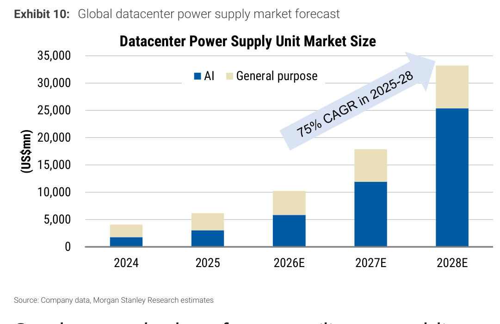

### 解讀摘要
資料中心 PSU 市場從 2024 年約 US\$4bn 預計以 75% CAGR 成長至 2028 年 US\$33bn，其中 AI 專屬 PSU 從 ~US\$1.5bn 擴大至 ~US\$26bn（佔比從 35% 升至 78%）。這個成長速度意味著每兩年市場規模翻 2.5 倍，是純量性成長而非替換效應——AI 伺服器的電源規格與傳統通用伺服器完全不同，不能共用，是增量市場。

### 表格
| 年份 | 市場規模 (US\$mn) | AI PSU | General Purpose PSU |
|---|---|---|---|
| 2024 | ~4,000 | ~1,500 | ~2,500 |
| 2025E | ~6,000 | ~3,000 | ~3,000 |
| 2026E | ~10,000 | ~5,800 | ~4,200 |
| 2027E | ~18,000 | ~12,000 | ~6,000 |
| 2028E | ~33,000 | ~26,000 | ~7,000 |

> **洞察一**：2024-2028E AI PSU CAGR 約 103%（從 US\$1.5bn → US\$26bn），大幅高於整體市場 75%，代表 AI PSU 快速取代通用 PSU 成為市場主體，規格差異使舊有供應鏈難以跨入。

---

## Exhibit 11｜Concept of peak shaving for AI server power loads

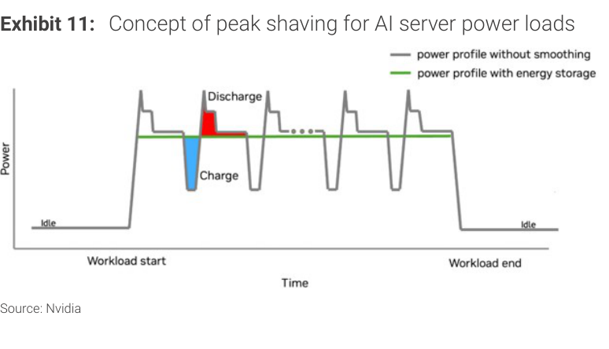

### 解讀摘要
AI 工作負載啟動時電力需求瞬間飆升，不儲能情況下電網必須為峰值設計（虛線）；加入 BBU/CBU 後，充電期填平低谷、放電期削平尖峰，讓電網只需供應平均功率（綠線）。這不只是降低電費，更決定資料中心能取得多少電力配給——電網規劃部門按峰值計算容量，削峰比例直接決定可部署的 GPU 機架數量。

---

## Exhibit 12｜BBU

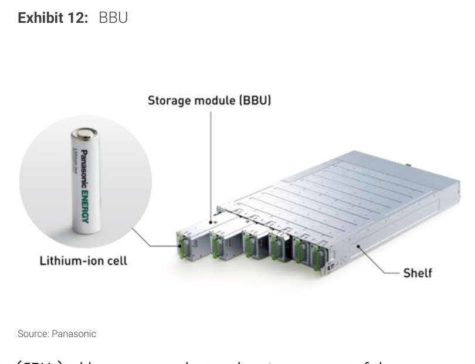

### 解讀摘要
Battery Backup Unit（BBU）以 Panasonic 鋰離子電池為芯，組成模組化貨架（shelf）形式，可在機架內或鄰近機架部署。鋰離子電池的高能量密度決定 BBU 適合數秒至數分鐘的持續支援（而非 CBU 的毫秒級快速反應），是電力中斷橋接與持續高功率支援的主要元件。

---

## Exhibit 13｜CBU

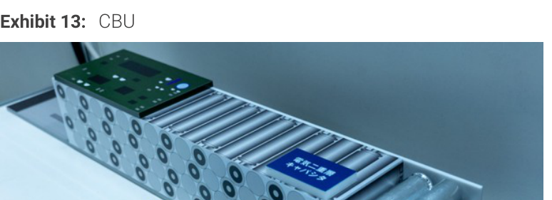

### 解讀摘要
Capacitor Bank Unit（CBU）以雙電層電容（EDLC/超電容）為基礎，響應時間達毫秒級以下，適合 AI GPU 工作負載切換時的瞬間電壓波動平滑。與 BBU 相比，CBU 循環壽命遠高（Eaton 規格 >100 萬次 vs 鋰電池循環受限），維護成本低，但能量密度低，僅能支撐秒級以內的功率緩衝。

---

## Exhibit 14｜GB300 power shelf with integrated capacitors

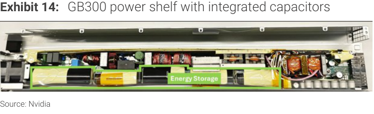

### 解讀摘要
GB300 電源架已將能量儲存（Energy Storage，圖中綠框標示）直接整合進電源架本體，而非外掛。這是 Nvidia 將 CBU 功能模組化內建的具體實現——對 Lite-On 等 PSU 製造商而言，意味著電源架單品 BOM 增加了儲能組件，有利於 ASP 提升和技術進入門檻。

---

## Exhibit 15｜Comparison of CBU and BBU

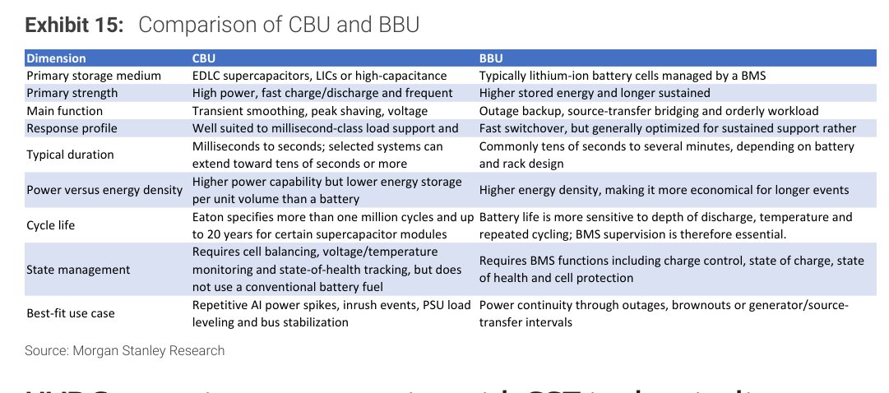

### 解讀摘要
CBU 擅長毫秒級快速充放電（Inrush、峰值平滑、匯流穩壓），BBU 擅長秒至分鐘級的持續備援（停電橋接、工作負載轉移）。兩者在高功率 AI 機架中是互補而非替代關係，GB300 機架的設計已顯示兩者並存趨勢。

### 表格
| 維度 | CBU（超電容） | BBU（鋰電池） |
|---|---|---|
| 儲能介質 | EDLC、LIC 或高電容超電容 | 鋰電池（BMS 管理） |
| 主要強項 | 高功率、快速充放、高頻率循環 | 高能量密度、長持續時間 |
| 主要功能 | 瞬間平滑、削峰、電壓穩定 | 備援橋接、工作負載轉移 |
| 響應特性 | 毫秒級；適合毫秒類負載支援 | 2ms 以內切換（OCP ORV3 要求） |
| 典型持續時間 | 毫秒至秒；部分系統可延伸至數十秒 | 數十秒至數分鐘（依電池容量） |
| 功率密度 | 高（但能量密度低） | 較低功率密度但高能量密度 |
| 循環壽命 | >100 萬次（Eaton 規格），20 年 | 循環壽命受放電深度影響，需 BMS |
| 狀態管理 | 電池均衡、電壓/溫度監控（無燃料計量） | 充電控制、SOC、SOH、電芯保護 |
| 最佳場景 | 重複 AI 功率尖峰、Inrush、PSU 負載均衡 | 停電橋接、棕電（brownout）支援 |

> **洞察一**：CBU 與 BBU 的功能互補性，使 AI 機架供電方案難以只選其一；全套供應商（如 Delta）比單一零件商更具定價能力。

---

## Exhibit 16｜Better power efficiency for 800VDC architecture

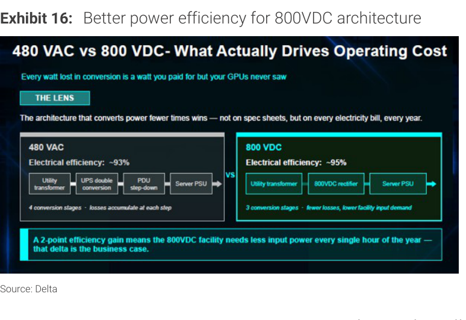

### 解讀摘要
480VAC 需要 4 段轉換（公用變壓器→UPS 雙轉換→PDU 降壓→伺服器 PSU），整體效率 ~93%；800VDC 只需 3 段（公用變壓器→800VDC 整流器→伺服器 PSU），效率 ~95%。每減少一個轉換環節就省去該環節的損耗，2ppt 效率差在大型設施中等比例放大。

---

## Exhibit 17｜Better efficiency leads to cost savings

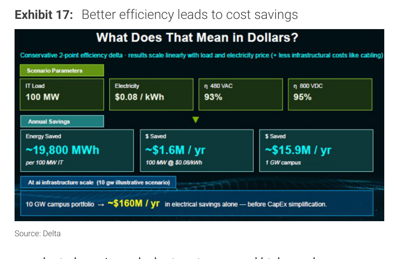

### 解讀摘要
以 100MW IT 負載、\$0.08/kWh 計算：800VDC vs 480VAC 節省 ~19,800MWh/年 → \$1.6M/年節電費；1GW 園區 → \$15.9M/年；10GW 規模 → \$160M/年，僅電費就能合理化 800VDC 升級的 CapEx。這套計算尚未含佈線基礎設施簡化所節省的建設成本。

### 表格
| 場景 | IT 負載 | 年節電 | 年節費 |
|---|---|---|---|
| 單一設施 | 100 MW | ~19,800 MWh | ~\$1.6M |
| 1GW 園區 | 1,000 MW | ~198,000 MWh | ~\$15.9M |
| AI 基礎設施（10GW 試算） | 10,000 MW | — | ~\$160M |

> **洞察一**：\$160M/yr 的節電效益是保守估算（\$0.08/kWh 基準），若電費上漲或碳稅添加，ROI 更快，反而加速 800VDC 部署速度——兩個變數都朝有利方向演進。

---

## Exhibit 18｜HVDC deployment roadmap

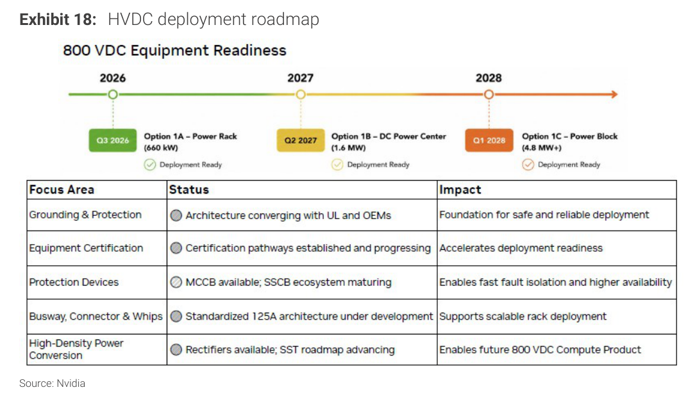

### 解讀摘要
Nvidia 將 800VDC 分三階段部署：Phase I（Q3 2026 ready，Power Rack，660KW）→ Phase II（Q2 2027，DC Power Center，1.6MW）→ Phase III（Q1 2028，Power Block，4.8MW+）。接地保護、設備認證、保護裝置、匯流系統都已進入成熟或認證中狀態，不存在技術阻礙——時程風險主要來自超大規模業者的部署決策速度。

### 表格
| 時程 | 階段 | 容量 | 部署就緒狀態 |
|---|---|---|---|
| Q3 2026 | Phase I — Power Rack | 660KW | ✓ Deployment Ready |
| Q2 2027 | Phase II — DC Power Center | 1.6MW | 認證進行中 |
| Q1 2028 | Phase III — Power Block | 4.8MW+ | 規劃中 |

> **洞察一**：Phase I 在 Q3 2026 就緒與 Bernstein 6月發布的「800VDC 延遲」報告形成對照——MS 認為整體時程並未推遲，Phase I 仍按計劃落地，市場分歧即為短期股價波動來源。

---

## Exhibit 19｜BOM cost breakdown for an 800VDC power rack

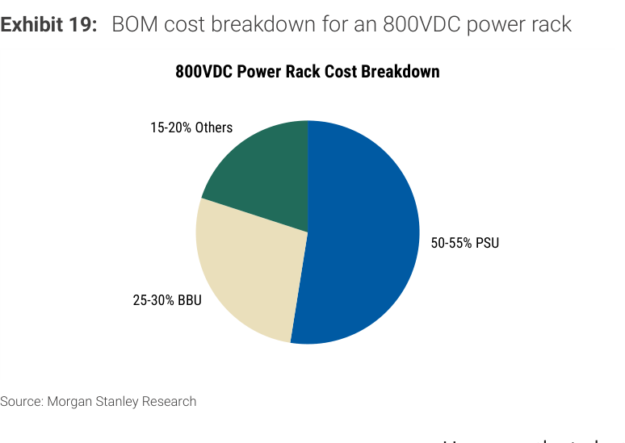

### 解讀摘要
800VDC 機架 BOM 中 PSU 佔 50-55%、BBU 佔 25-30%、其他 15-20%。這個結構揭示了整合方案業者的優勢：同時供應 PSU＋BBU 的廠商（如 Delta）可以讓客戶降低系統整合複雜度，並主張更高的套組溢價——若分開採購，每個零件廠各自議價，定價能力分散。

---

## Exhibit 20｜Higher dollar content for HVDC power racks

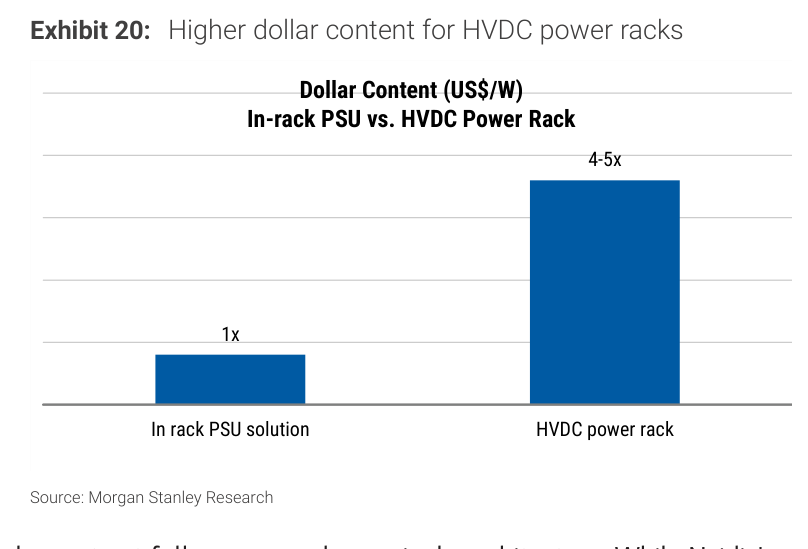

### 解讀摘要
800VDC 電源架的 US\$/W 單價是傳統機架內 PSU 方案的 4-5 倍。以 Vera Rubin NVL72 機架 ~110KW 電源架為例：傳統方案每 KW 約 US\$X → HVDC 方案 4-5x US\$X，意味著每個機架的電源組件 ASP 翻數倍，PSU/BBU 業者的 per-unit 收入大幅提升，即便機架出貨量不變也能顯著拉抬業績。

> **洞察一**：4-5x ASP 倍增不依賴市場份額增加，是純技術升級帶動的 ASP 擴張——這種增長對業者而言比擴大市占更確定（不需要打贏競爭對手，只需搭上客戶升級週期）。

---

## Exhibit 21｜Comparison of 800VDC and ±400VDC

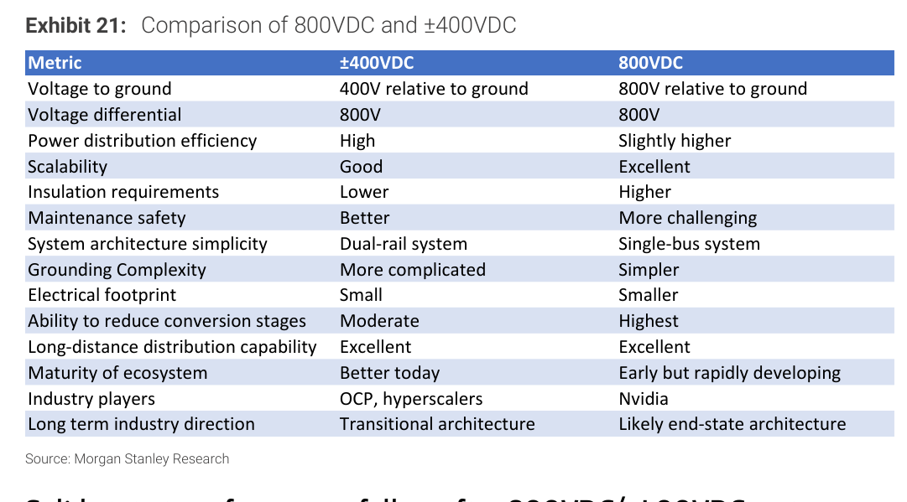

### 解讀摘要
±400VDC 是 OCP 等開放標準社群採用的過渡架構（雙匯流排系統），成熟度較高但長期並非最優解；800VDC 是 Nvidia 推動的標準（單匯流排），可進一步減少轉換環節且擴展性「最佳」，MS/Nvidia 定位為「長期終態架構」。現階段兩者並存，但市場最終將收斂至 800VDC。

### 表格（選擇差異關鍵維度）
| 維度 | ±400VDC | 800VDC |
|---|---|---|
| 架構類型 | 雙匯流排 | 單匯流排 |
| 對地電壓 | 400V | 800V |
| 擴展性 | Good | Excellent（最佳） |
| 接地複雜度 | 較複雜 | 較簡單 |
| 維護安全性 | Better（今天） | 挑戰性較高 |
| 減少轉換環節能力 | 中等 | 最高 |
| 生態系成熟度 | Better（OCP/超大規模） | 早期但快速發展（Nvidia） |
| 長期方向 | 過渡架構 | 可能終態架構 |

> **洞察一**：MS 明確說 800VDC 是終態架構，±400VDC 是過渡——投資意涵：押注 800VDC 業者勝率更高，但過渡期（2026-2028）兩種架構同時存在，Delta/Lite-On 都應能受益。

---

## Exhibit 22｜SST enabling more efficient power delivery architecture

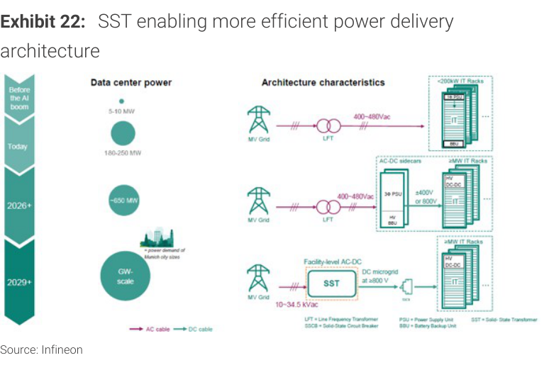

### 解讀摘要
資料中心規模演進：AI 潮前 5-10MW（單設施）→ 今日 180-250MW → 2026+ ~650MW → 2029+ GW 級（等同慕尼黑城市用電）。功率規模每跳升一級，傳統 AC 配電架構的複雜度與損耗呈指數成長；SST（固態變壓器）直接在設施入口將 MV（中壓交流，10-34.5kVAC）轉為 DC 微電網（800V+），消除 AC-DC 側掛和多次轉換，2029+ 大規模資料中心幾乎是必然選項。

### 架構演進
| 時期 | 典型規模 | 架構特徵 |
|---|---|---|
| AI 前 | 5-10 MW | MV Grid → LFT → PDU → Server PSU（傳統 AC） |
| 今日 | 180-250 MW | AC sidecar 側掛 PSU + BBU + ±400/800VDC |
| 2026+ | ~650 MW | 設施級 AC-DC + 800VDC 分配至 IT 機架 |
| 2029+ | GW 級 | SST 直接建立 DC 微電網 → 廠區級統一電壓 |

---

## Exhibit 23｜SST offers better power efficiency with at least 30% less space/weight

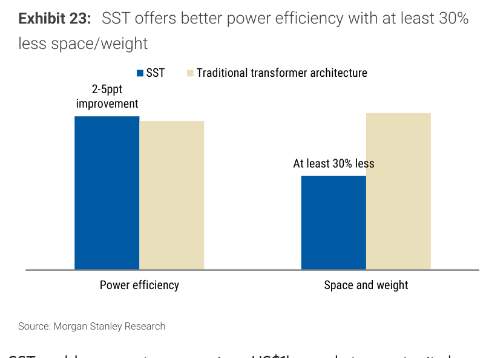

### 解讀摘要
SST 相較傳統變壓器可達 2-5ppt 效率提升，並節省 ≥30% 的空間/重量。在 GW 級資料中心，空間省 30% 等於多放 30% 的 IT 設備，是直接的營收機會——對超大規模業者而言，空間受限往往比電力受限更早成為瓶頸。

---

## Exhibit 24｜SST to see initial adoption in 2030

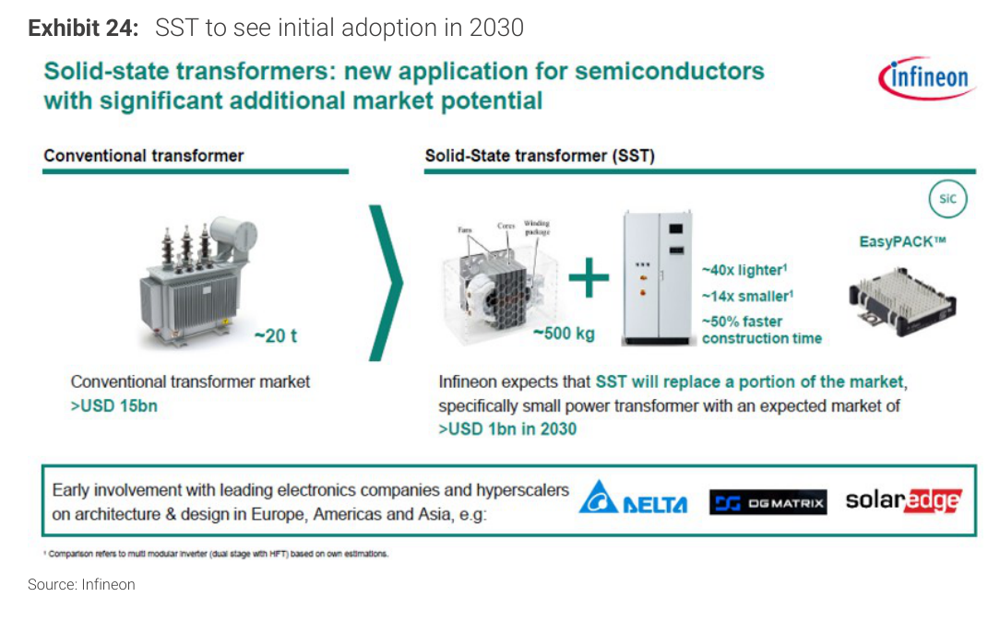

### 解讀摘要
傳統變壓器約 20 噸；SST 約 500KG（輕 40 倍）、體積小 14 倍、施工時間快 50%，替換的傳統變壓器市場 >US\$15bn。Infineon 預估 2030 年小型電力變壓器 SST 市場 >US\$1bn；Delta 已與 Infineon 在歐洲、美洲、亞洲超大規模業者架構設計上早期合作。

---

## Exhibit 25｜Fuel cell diagram

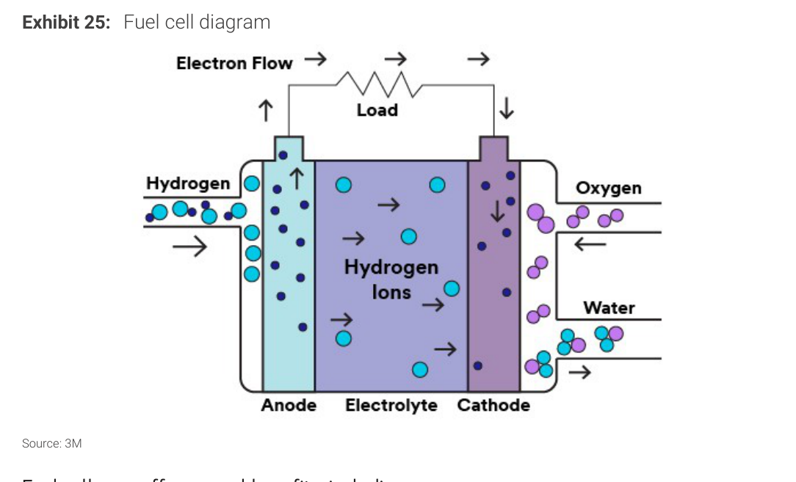

### 解讀摘要
燃料電池基本原理：氫氣在陽極氧化→電子流（電流）→氫離子穿透電解質→在陰極與氧氣結合生成水，唯一排放物為水。固態氧化物燃料電池（SOFC）可同時捕捉 >95% CO₂，配合 CCUS（碳捕集利用與封存）可實現 <50g CO₂/kWh 排放量，是功率約束下兼顧碳中和目標的電力方案。

---

## Exhibit 26｜Fuel cell in datacenter power delivery architecture

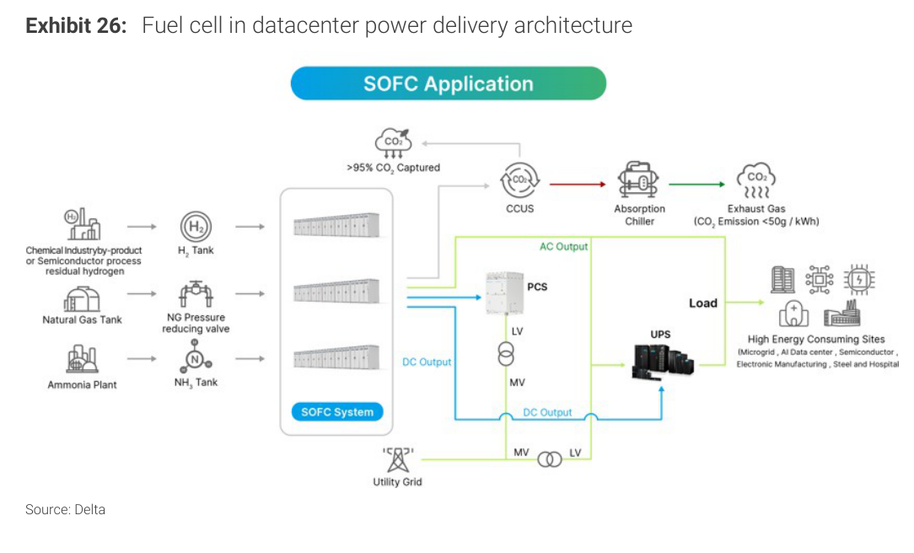

### 解讀摘要
Delta 的 SOFC 系統（固態氧化物燃料電池）可接受氫氣、天然氣或氨氣為燃料，同時輸出 AC 和 DC，透過 PCS（電力調節系統）對接 UPS 與負載端（資料中心、半導體廠、鋼廠等），旁路回收廢熱供吸收式冷凍機（Absorption Chiller）使用，>95% CO₂ 捕集率後排放氣 <50g CO₂/kWh。這個設計讓燃料電池可直接接入現有電力架構，不需全廠改造。

---

## Exhibit 27｜Panasonic Holdings: Next generation BBU/CBU roadmap

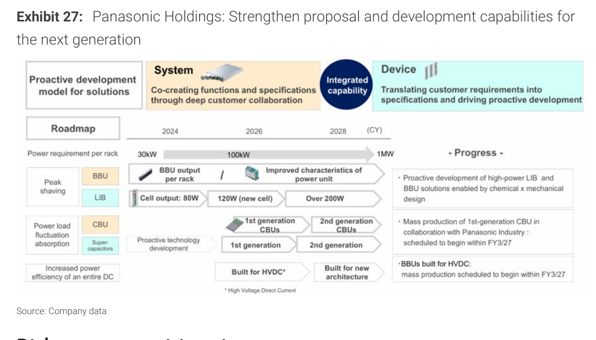

### 解讀摘要
Panasonic 路線圖揭示 AI 機架電源從 30KW 推進至 100KW 再至 1MW 的路徑，配套的電池/電容規格同步跳升：電池芯輸出 80W → 120W（2026 新芯）→ 200W+（2028）；第 1 代 CBU 2026 年量產、第 2 代 2028 年；HVDC 用 BBU 量產計畫 FY3/27（即 2027 年初）。這是 MS 預測 BBU 市場在 2026-2027 年快速放量的重要依據。

### 關鍵里程碑
| 年份 | 電池芯輸出 | CBU 世代 | 機架功率 |
|---|---|---|---|
| 2024 | 80W | 技術開發中 | ~30KW |
| 2026 | 120W（新電芯） | 1st gen 量產（FY3/27） | ~100KW |
| 2028 | 200W+ | 2nd gen | ~1MW |

---

## Exhibit 28｜Increasing demand for compute power from reasoning models

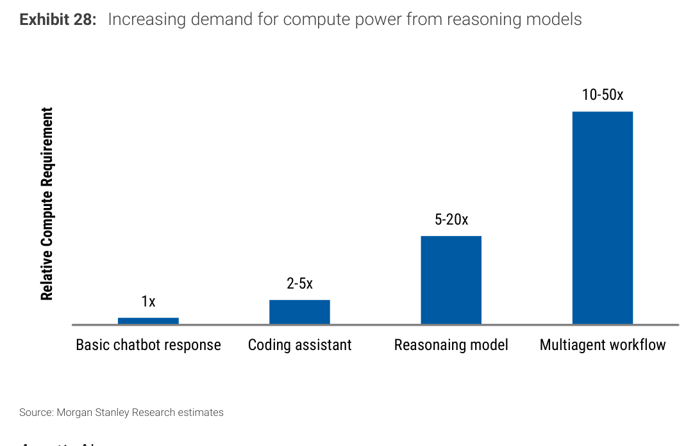

### 解讀摘要
AI 算力需求的結構性上行：基礎聊天機器人 1x → 程式碼助手 2-5x → Reasoning model 5-20x → 多代理工作流 10-50x。這個倍數擴張不是線性的，代表每次 AI 能力進化都需要指數量級更多算力，電源需求隨之增加——而且這個趨勢還在加速，不是短暫高峰。

### 表格
| 應用場景 | 相對算力需求 |
|---|---|
| 基礎聊天機器人回應 | 1x |
| 程式碼助手 | 2-5x |
| Reasoning model | 5-20x |
| 多代理工作流 | 10-50x |

---

## Exhibit 29｜Compute power for HPCs continuing to evolve

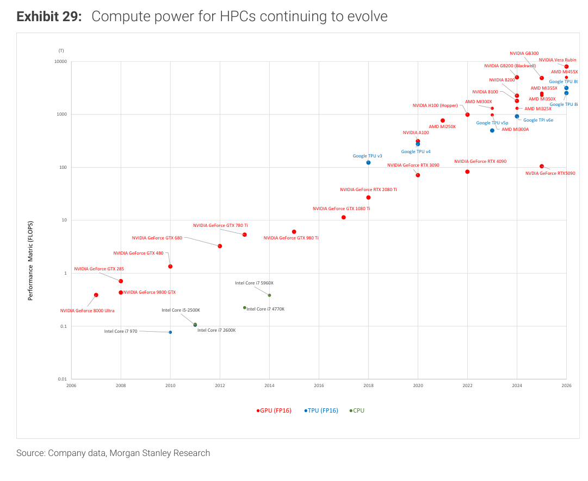

### 解讀摘要
從 2006 年 NVIDIA GeForce 8000 Ultra（~0.1T FLOPS）到 2026 年 NVIDIA GB300（~5,000T FLOPS）和 Vera Rubin（~10,000T FLOPS），性能提升超過 10 萬倍（對數軸）。AMD MI455X 在最右上角達到 ~4,500T；Google TPU v7 ~3,500T。性能曲線在 2020 年後加速彎曲上行，2024-2026 年的各代產品幾乎垂直上升，對應 TDP 的同步快速攀升。

---

## Exhibit 30｜Compute power vs. TDP for HPCs

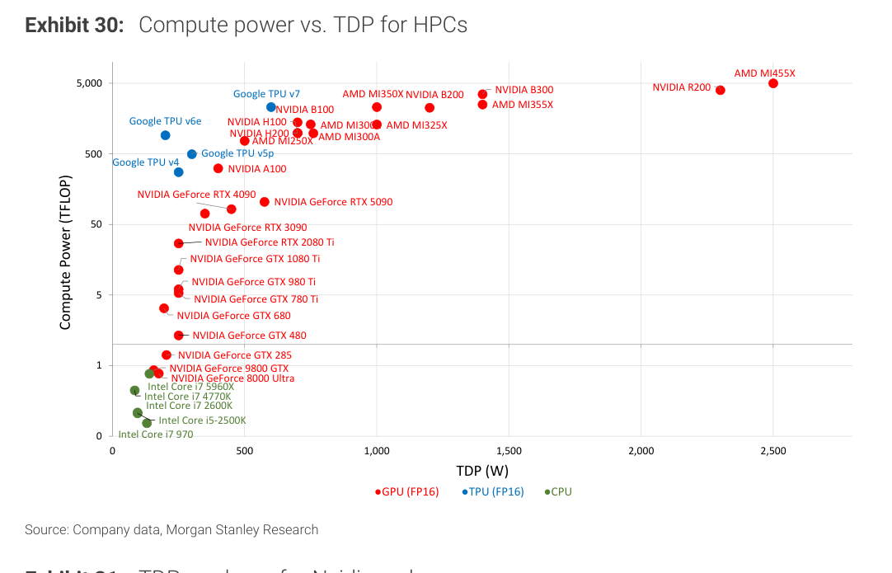

### 解讀摘要
將算力（TFLOP）對比 TDP（W），AI 加速器的算力/W 效率持續提升，但絕對 TDP 仍在快速增加：NVIDIA GB300 TDP ~1,300W、VR200 NVL72 ~1,500W、AMD MI455X ~2,500W、NVIDIA R200 ~2,000W。關鍵洞察是效率提升（斜率）不足以抵銷規模擴張，絕對耗電量仍是主軸。

---

## Exhibit 31｜TDP roadmap for Nvidia racks

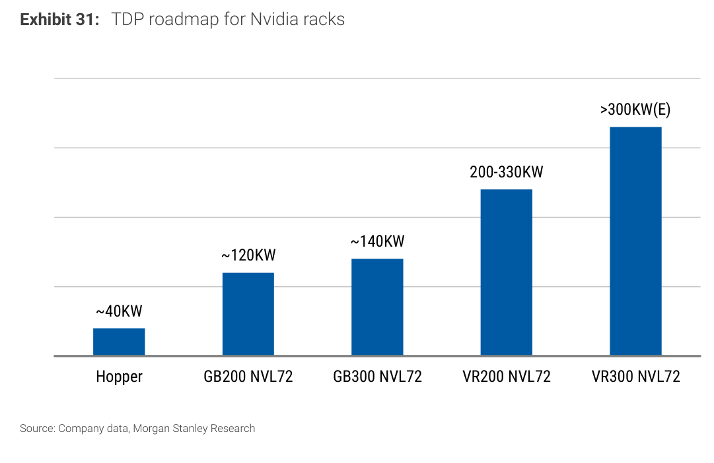

### 解讀摘要
Nvidia 機架 TDP 路線圖：Hopper ~40KW → GB200 NVL72 ~120KW → GB300 NVL72 ~140KW → VR200 NVL72 200-330KW → VR300 NVL72 >300KW（預估）。從 Hopper 到 Vera Rubin 世代，機架 TDP 增加 7.5-8x，是資料中心電源基礎設施必須全面升級的直接驅動力。

### 表格
| 世代 | 機架 TDP |
|---|---|
| Hopper | ~40KW |
| GB200 NVL72 | ~120KW |
| GB300 NVL72 | ~140KW |
| VR200 NVL72 | 200-330KW |
| VR300 NVL72（預估） | >300KW |

> **洞察一**：VR200 NVL72 的 TDP 範圍 200-330KW 跨度極大（+65%），暗示 Nvidia 或超大規模業者仍在決定最終散熱/供電組態；這個不確定性是 800VDC Phase II 部署時程存在季度左右移風險的技術根因。

---

## Exhibit 32｜Power supply density for different network switch generations

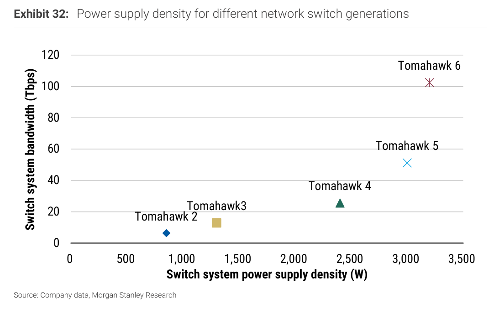

### 解讀摘要
網路交換器功率：Tomahawk 2 ~800W @ 6Tbps → Tomahawk 3 ~1,300W @ 12Tbps → Tomahawk 4 ~2,400W @ 25Tbps → Tomahawk 5 ~3,100W @ 50Tbps → Tomahawk 6 ~3,200W @ 100Tbps。交換器頻寬每世代翻倍，TDP 也以大幅幅度提升，網路設備本身的供電需求快速累加——資料中心不只是 GPU 的電力問題，網路層也需要大量電源升級。

---

## Exhibit 33｜Power density for PSUs in Nvidia server systems

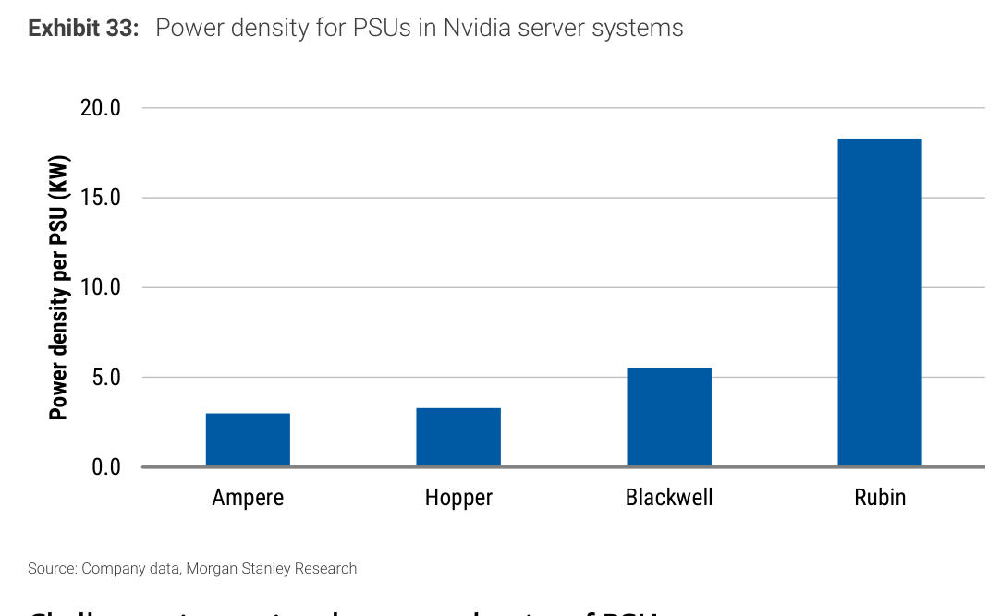

### 解讀摘要
每個 PSU 的功率密度：Ampere ~3KW → Hopper ~3.2KW → Blackwell ~5.6KW → **Rubin ~18.3KW**（Lite-On Vera Rubin NVL72 110KW 電源架規格）。Rubin 世代每個 PSU 密度是 Hopper 的 5.7 倍、Blackwell 的 3.3 倍，代表 PSU 的技術門檻在 Rubin 世代出現質變，一般製造商難以跟上。

### 表格
| 世代 | 每 PSU 功率密度 |
|---|---|
| Ampere | ~3.0KW |
| Hopper | ~3.2KW |
| Blackwell | ~5.6KW |
| Rubin | ~18.3KW |

> **洞察一**：Rubin PSU 密度 18.3KW 約為 Blackwell 3.3x——這不是線性升級而是世代躍進，意味著製程能力（磁性材料、散熱、電路設計）要同時達到三倍水準，現有 PSU 供應商大多需要重新設計而非改良，Lite-On 的技術進度落後於 Delta 在此最為關鍵。

---

## Exhibit 35｜Transient power spikes at AI servers

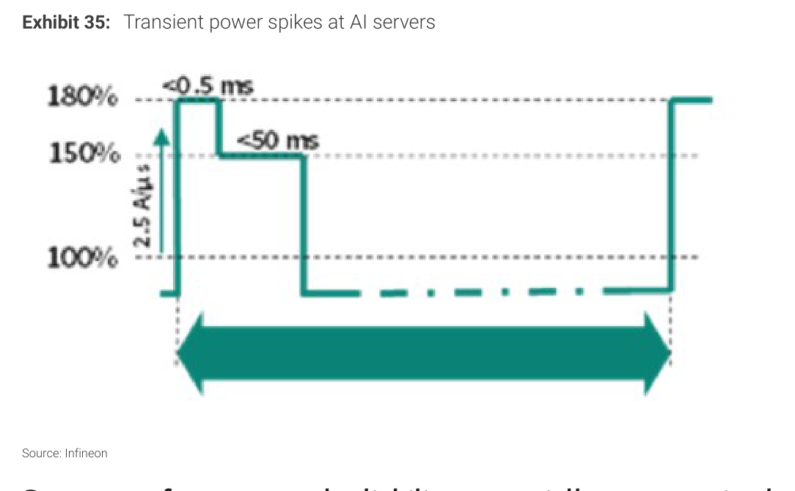

### 解讀摘要
AI 伺服器啟動工作負載的瞬間電流尖峰：在 <0.5ms 內電流上升率 2.5 A/μs，峰值達穩態的 180%；在 <50ms 內回落至穩態的 150%（仍高出穩態 50%）。CBU 需要在 <0.5ms 內響應吸收這個尖峰，BBU 則在 <50ms 內提供後續的持續支援。這解釋了為什麼 AI 伺服器機架需要兩種儲能技術並存，而不是只用高容量電池。

---

## Exhibit 38｜BBU diagram

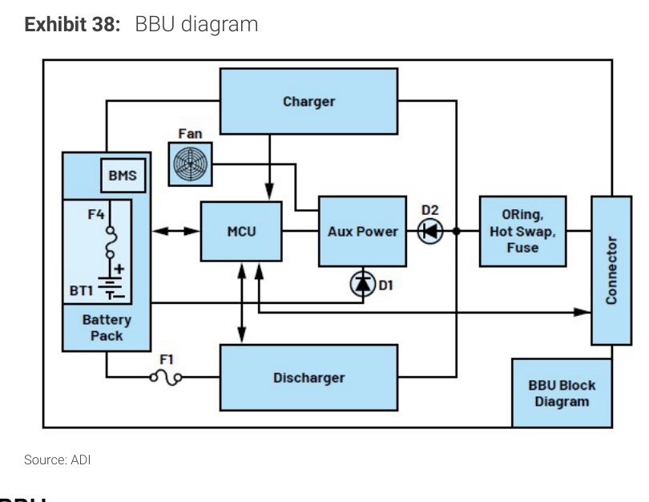

### 解讀摘要
BBU 系統架構（ADI 方案）：電池包（Battery Pack + BMS F4）→ MCU（微控制器）→ 充電器（Charger）/ 放電器（Discharger）→ 輔助電源（Aux Power）→ ORing/Hot-Swap/Fuse → Connector 對接機架。關鍵是 BMS（電池管理系統）與 MCU 雙環路控制，確保在充放電轉換時無縫切換、不中斷計算工作負載。

---

## Exhibit 39｜Comparison of BBUs and UPSs

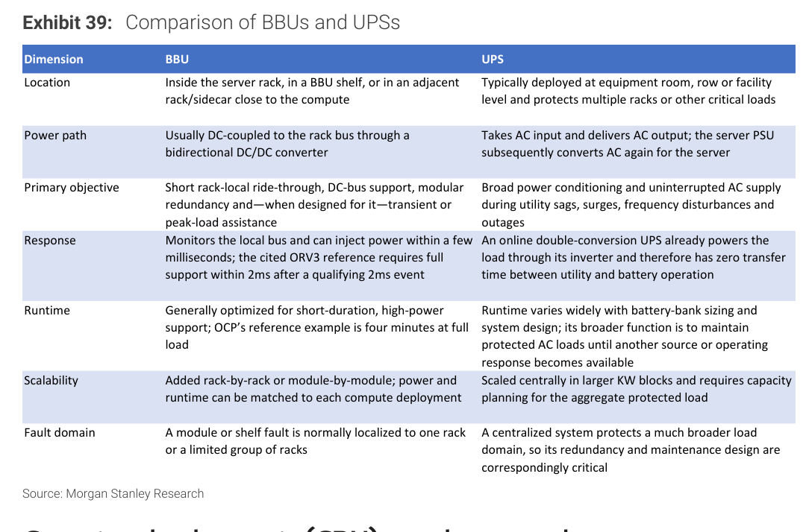

### 解讀摘要
BBU 是機架級、DC 耦合、模組化備援，響應在幾毫秒內（OCP ORV3 要求 2ms 後 full support）；UPS 是設施級、AC 耦合，online double-conversion 保護整棟建築，零轉換時間但難以逐機架擴展。AI 機架的分散式、模組化特性更適合 BBU 而非傳統 UPS——這是 BBU 市場加速成長的結構性原因，不是 UPS 被淘汰，而是 AI 機架層增加了 BBU 需求層。

### 表格（關鍵維度）
| 維度 | BBU | UPS |
|---|---|---|
| 部署位置 | 機架內或鄰近機架 | 設備室或設施層 |
| 電力路徑 | DC 耦合（透過雙向 DC/DC 轉換器） | AC 輸入→AC 輸出（PSU 再轉換） |
| 主要目標 | 短暫機架騎過（ride-through）、模組化備援 | 廣泛電力調節（SAG/SURGE/頻率） |
| 響應 | 幾毫秒；ORV3 要求 2ms 全功率支援 | Online 雙轉換，零轉換時間 |
| 擴展性 | 逐機架或逐模組 | 集中式大 KW 塊，需整體規劃 |
| 故障域 | 局限一個機架或小群組 | 大範圍，冗餘與維護設計更關鍵 |

---

## Exhibit 42｜Capacitors help smooth power delivery

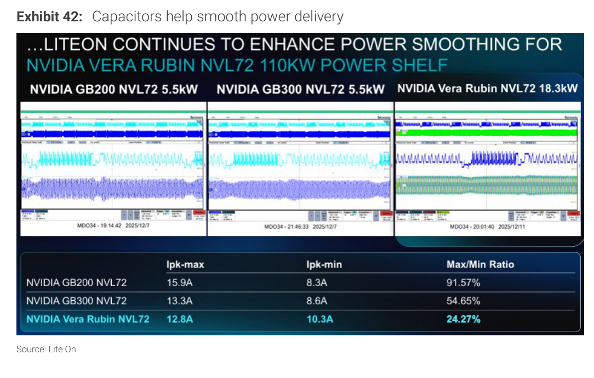

### 解讀摘要
Lite-On（光寶）在 Vera Rubin NVL72 110KW 電源架的電流穩定度上取得顯著進步：GB200 NVL72 的 Ipk-max/min 比（電流波動幅度）為 91.57%（極度不穩定）→ GB300 NVL72 54.65% → **Vera Rubin NVL72 24.27%**（大幅改善）。這個改善直接來自 Lite-On 在 Vera Rubin 電源架中增強電容平滑設計，是 Lite-On 技術能力的具體展現。

### 表格
| 系統 | Ipk-max | Ipk-min | Max/Min 比（電流波動） |
|---|---|---|---|
| NVIDIA GB200 NVL72 | 15.9A | 8.3A | 91.57% |
| NVIDIA GB300 NVL72 | 13.3A | 8.6A | 54.65% |
| NVIDIA Vera Rubin NVL72 | 12.8A | 10.3A | **24.27%** |

> **洞察一**：Ipk Max/Min Ratio 24.27% → 電流峰谷差縮小了 4x（vs GB200），表示電源架電容設計大幅提升了電力品質；但 Lite-On 只是製造端執行，核心電容設計是否為 Lite-On 自主研發或依 Nvidia 規格，決定了這個能力的可複製性和議價空間。

---

## Exhibit 44｜Transmission current for different power scales: 54V vs 800V

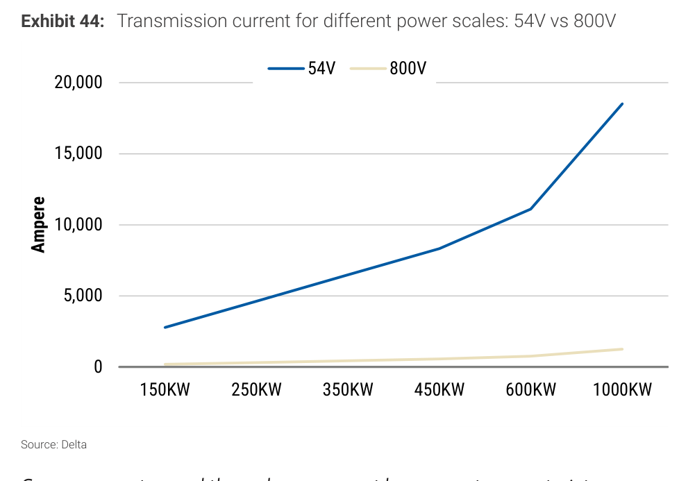

### 解讀摘要
相同功率下，54V 系統所需電流為 800V 系統的 14.8 倍（P = I×V，I₅₄ = P/54、I₈₀₀ = P/800，比值 = 800/54 ≈ 14.8）。1MW 負載下 54V 需要 ~18,500A，配電匯流排需要直徑極大的銅導體；800V 僅需 ~1,250A，標準 1250A 匯流排可應付。隨機架 TDP 突破 100KW+，54V 的電流在物理上不可行（銅體積/熱損/電壓降），800VDC 是唯一可行解。

### 表格
| 功率 | 54V 所需電流 | 800V 所需電流 | 差異倍數 |
|---|---|---|---|
| 150KW | ~2,800A | ~190A | ~14.7x |
| 450KW | ~8,300A | ~560A | ~14.8x |
| 1,000KW | ~18,500A | ~1,250A | ~14.8x |

---

## Exhibit 45｜Not enough room for power devices on the traditional AI server rack

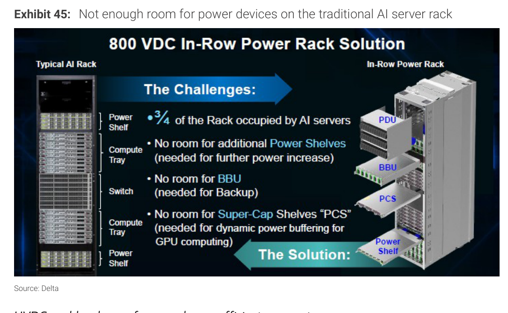

### 解讀摘要
傳統 AI 機架問題：3/4 空間被 AI 伺服器佔用，剩餘空間不足以同時容納額外電源架（功率提升必需）、BBU（備援必需）、超電容架 PCS（動態功率緩衝必需）。800VDC 機架外置電源架（In-Row Power Rack）解決此問題：PDU、BBU、PCS、電源架全部移至外置機架，AI 計算機架 100% 用於算力，整體電源密度可提升數倍。

---

## Exhibit 48｜Phase I - 800VDC power rack

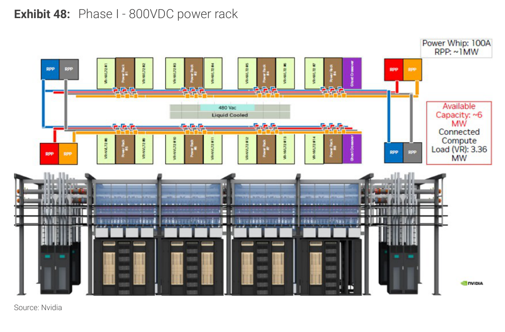

### 解讀摘要
Phase I 架構（Q3 2026 就緒）：480VAC 液冷進入，透過 Ghost Crossover 連接多個 VR NVL72 計算機架和 Power Rack，Power Whip 100A、RPP ~1MW；整體設計可用容量 ~6MW，連接算力負載（VR）3.36MW。這是「原地升級」的過渡方案——沿用 480VAC 進線，在機架層加裝 800VDC 整流，不需更換整個設施供電基礎設施。

---

## Exhibit 49｜Phase II - 800VDC power center

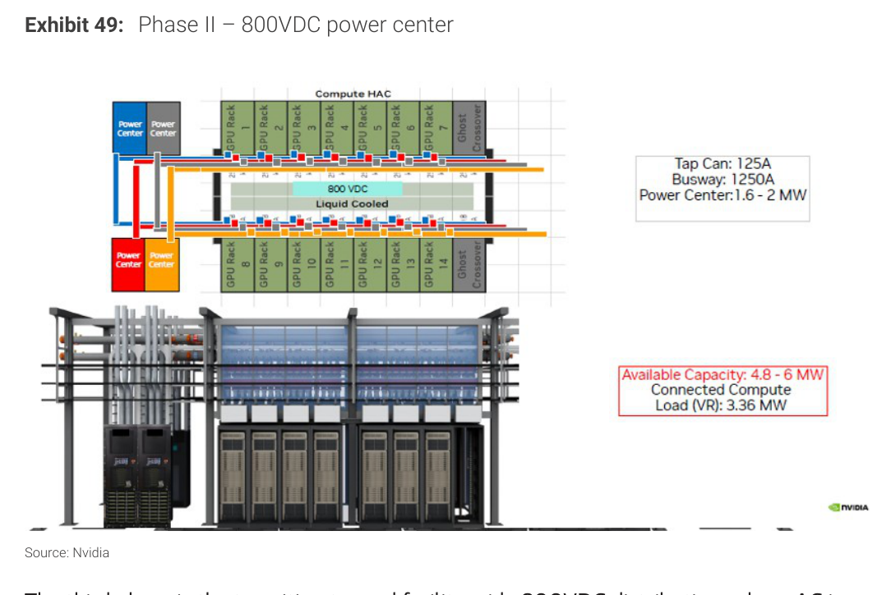

### 解讀摘要
Phase II（Q2 2027）：Power Center 規格 1.6-2MW，採 800VDC 匯流，Tap Can 125A、Busway 1250A，14 個 GPU 機架（VR NVL72）組成 Compute HAC；可用容量 4.8-6MW，連接算力負載 3.36MW。Phase II 相比 Phase I 的關鍵差異是 Power Center 以 800VDC 直接分配，省去 AC 進線的轉換損耗，且功率密度更高（1.6-2MW vs ~1MW per unit）。

---

## Exhibit 50｜Phase III - power block

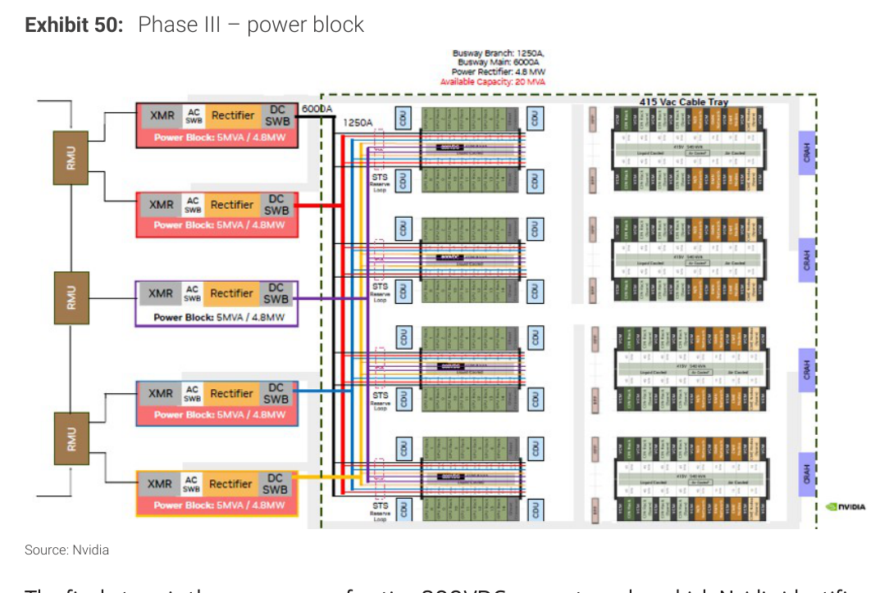

### 解讀摘要
Phase III（Q1 2028）：每個 Power Block 5MVA/4.8MW（Busway Main 6000A、Branch 1250A），5 個 Power Block 組成一個 ~20MVA 容量的 HAC 群組；每個 Block 對接 CDU 和 IT 機架（液冷+風冷）。這是真正「設施級」800VDC 方案——整個資料中心白空間統一 800VDC 供電，SST 可在此架構下接入，成為 2029+ GW 級設施的基礎。

---

## Exhibit 51｜800VDC native server racks

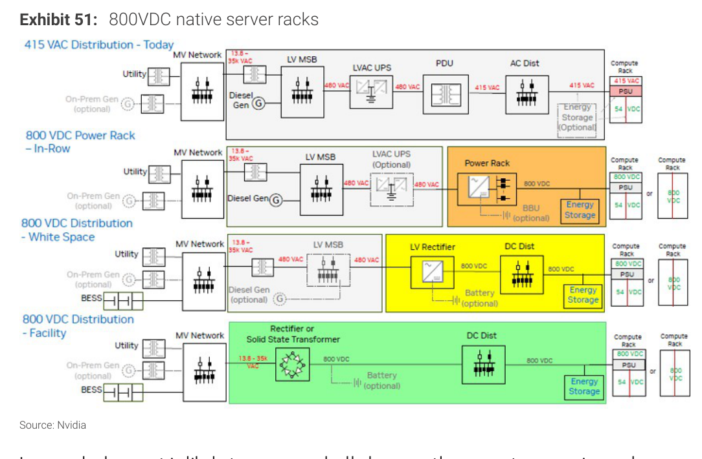

### 解讀摘要
架構演進全圖：① 傳統 415VAC（今日）→ ② 800VDC Power Rack In-Row（过渡）→ ③ 800VDC White Space（設施層分配）→ ④ 800VDC Facility（Rectifier/SST 入口）。右側算力機架可接受 800VDC 或 54VDC 輸出（依 PSU 設計），代表在 Rubin 世代後，機架 PSU 的角色可能從 AC→DC 轉換縮減為 DC→DC 調壓，技術要求再次升級。

---

## Exhibit 56｜Solid state vs. traditional transformers

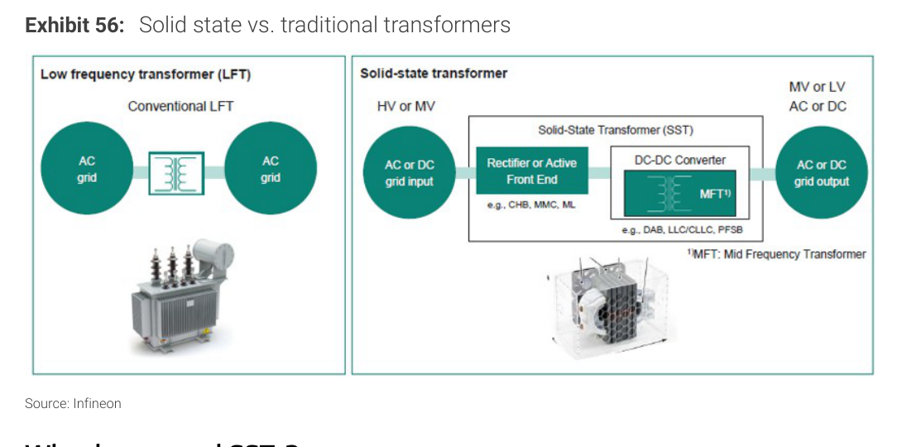

### 解讀摘要
傳統 LFT（低頻變壓器）：AC 網格 → 磁芯線圈 → AC 輸出（被動、單向、只能 AC-AC）；SST（固態變壓器）：AC/DC 輸入 → 整流/主動前端（CHB、MMC 等）→ 中頻變壓器（MFT，DAB/LLC/CLLC 拓撲）→ DC-DC 轉換 → AC/DC 輸出（主動、雙向、AC 和 DC 都能輸入/輸出）。SST 的雙向和 AC/DC 靈活性使它成為 DC 微電網的理想入口。

---

## Exhibit 59｜SST from Delta

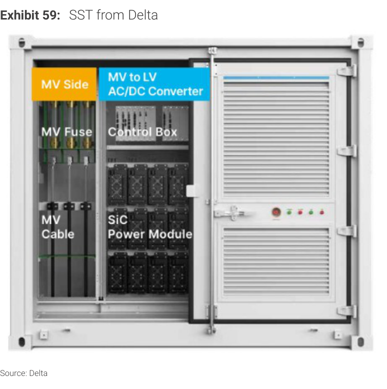

### 解讀摘要
Delta 的 SST 產品：MV 側輸入（MV Fuse + MV Cable），內建 Control Box 和 SiC Power Module（碳化矽功率模組）陣列，輸出端為 MV to LV AC/DC Converter。SiC 的使用是高效率和緊湊體積的關鍵，Delta 在 SiC 功率模組有自主供應能力（透過子公司），使 SST 業務的毛利率有支撐。

---

## Exhibit 60｜SST from Eaton

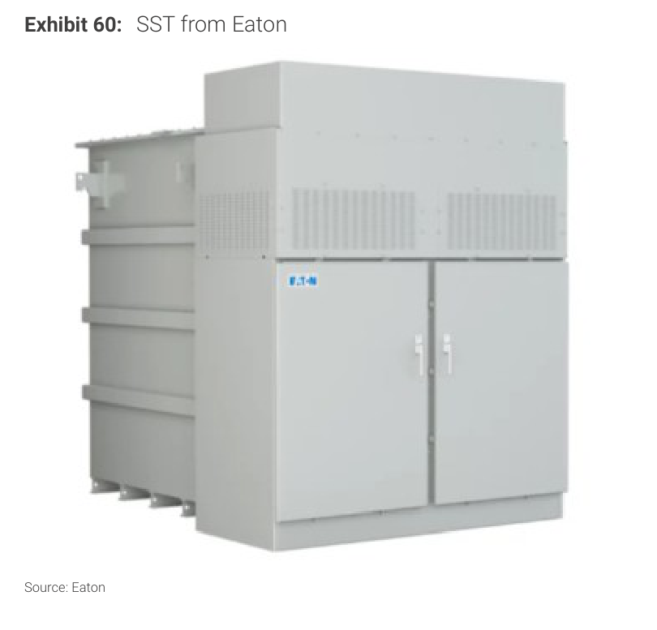

### 解讀摘要
Eaton 的 SST 產品（EV-SST 或類似型號）為大型箱型機櫃設計，體積明顯比 Delta 方案更大，暗示 Delta 在 SST 產品緊湊化方面具有優勢。Eaton 是傳統電力設備強廠（超電容循環壽命 >100 萬次的規格即來自 Eaton），但在 SiC 整合和緊湊化設計上可能不如 Delta。

---

## Exhibit 62｜Fuel cell offering - Delta

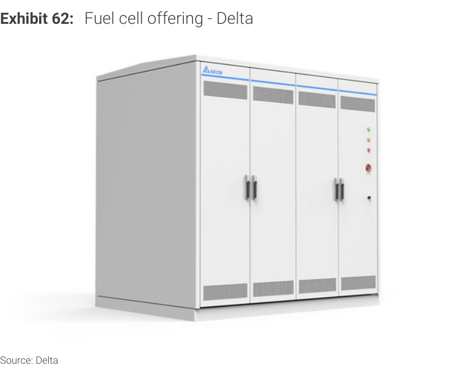

### 解讀摘要
Delta 的燃料電池系統為模組化機架式設計，多個模組並排組成整體系統，與 IT 機房/資料中心的基礎設施風格接近，便於就地部署和擴展。Delta 在燃料電池領域的佈局主要以 SOFC 為核心，利用其在電力電子（PCS、變頻器）方面的既有能力降低系統整合成本。

---

## Exhibit 63｜Fuel cell offering - Bloom Energy

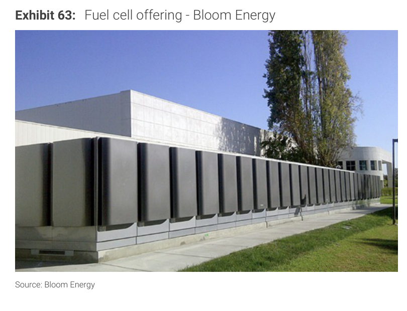

### 解讀摘要
Bloom Energy 的 Energy Server 為大型室外安裝型（行排式金屬箱體），適合超大規模業者在廠房外圍建設大規模分散電力。Bloom 是美國最具代表性的 SOFC 廠商，微軟、谷歌、AT&T 等都是客戶；Delta 在台灣及亞洲市場與 Bloom 的直接競爭不大，但在超大規模業者全球採購中形成間接競爭。

---

## Exhibit 74｜Delta's global footprint

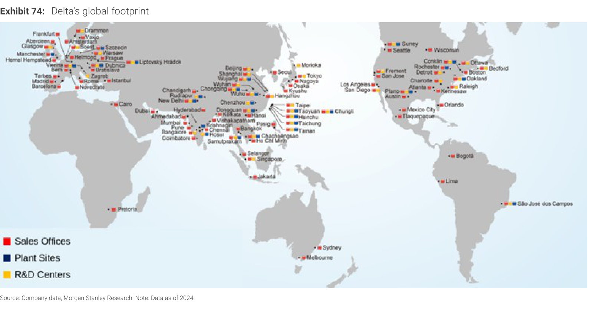

### 解讀摘要
Delta 在全球設有廣泛的銷售辦公室（紅）、製造廠址（藍）和研發中心（黃），台灣/中國/印度為製造重心，歐洲（德/荷/捷/斯洛伐克）和北美（德州/北卡/密西根）有研發和製造節點。這種分散製造能力是 AI 客戶要求「非中國製造」時 Delta 優於純台廠對手的關鍵，也有助於規避關稅風險。

---

## Exhibit 75｜Delta: Revenue CAGR, 2025-28e

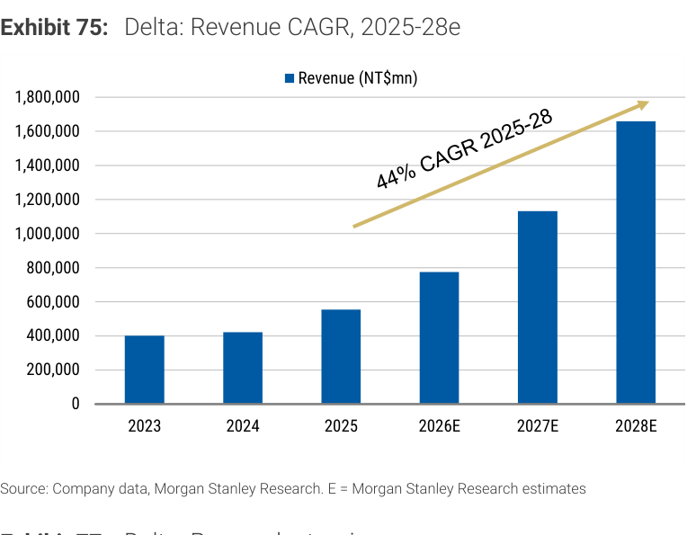

### 解讀摘要
MS 預估 Delta 2025-2028 營收 44% CAGR（NT\$540bn → NT\$1,650bn，單位 NT\$mn 累加至 bn 量級），成長完全由電力電子（Power Electronics）和基礎設施（Infrastructure）業務驅動，而非復甦舊業務。44% CAGR 在傳統電源業者中屬罕見，基礎是 AI 資料中心 PSU/BBU/SST 的 TAM 擴張。

### 表格（NT\$mn）
| 年份 | 營收估算 |
|---|---|
| 2023 | ~400,000 |
| 2024 | ~425,000 |
| 2025 | ~540,000 |
| 2026E | ~780,000 |
| 2027E | ~1,100,000 |
| 2028E | ~1,650,000 |

---

## Exhibit 76｜Delta: Annual revenue growth

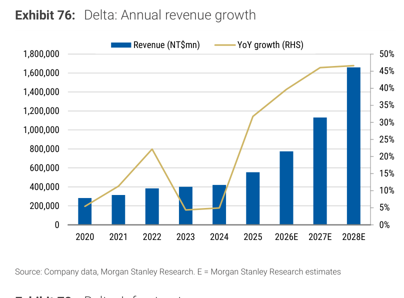

### 解讀摘要
Delta 2022-2024 年 YoY 成長幾乎停滯（0-5%），2025 年起 YoY 重啟至 ~32%、2026E ~44%、2027E ~45%，形成典型的 S 曲線加速段。重啟點（2025）對應 AI 伺服器機架 TDP 突破門檻、客戶開始大規模採購 BBU/HVDC 組件的時間點。

---

## Exhibit 77｜Delta: Power electronics revenue

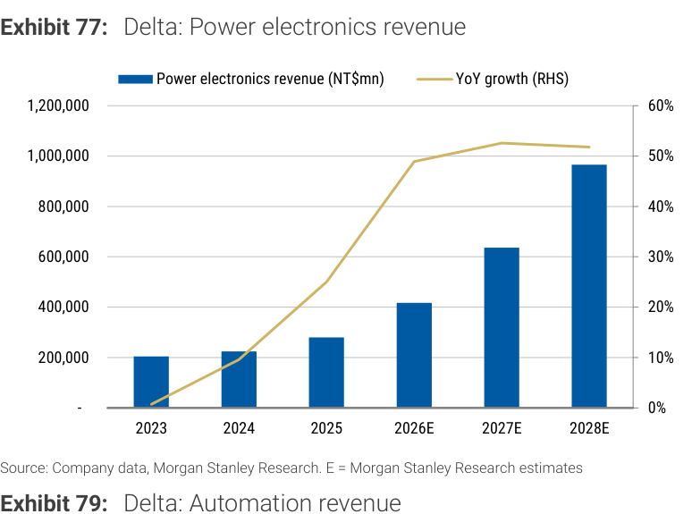

### 解讀摘要
Delta 電力電子業務（PSU、BBU、CBU、SST 等）從 2023 年約 NT\$200bn 擴展至 2028E 約 NT\$960bn，CAGR 約 37%；YoY 成長率從 2025 年起加速，預估 2026E/2027E/2028E YoY 各約 50%/52%/50%。電力電子是 Delta 最大且成長最快的業務，2028E 將佔集團總收入約 58%。

---

## Exhibit 78｜Delta: Infrastructure revenue

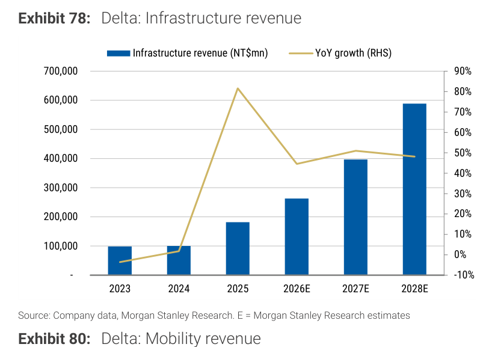

### 解讀摘要
Delta 基礎設施業務（IDC 相關熱管理、UPS、工業電源等）2023 約 NT\$100bn，2025 年 YoY 約 80%（基礎設施 IDC 需求爆發），2026-2028E 年均 40-50% YoY，2028E 達 ~NT\$590bn。基礎設施業務是成長第二引擎，也反映 Delta「電源＋散熱一體化」布局的擴張。

---

## Exhibit 79｜Delta: Automation revenue

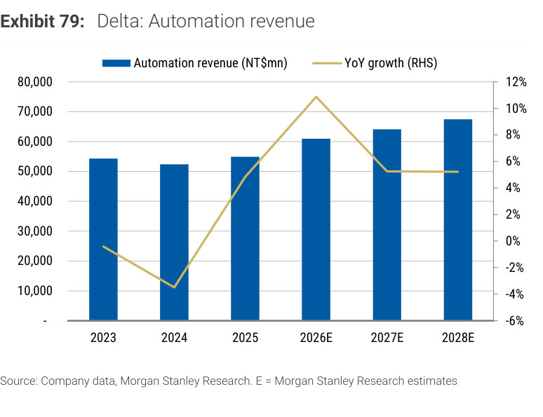

### 解讀摘要
Delta 自動化業務（工業自動化、機器人等）約 NT\$55-67bn，YoY 成長溫和（5-10%），佔集團比重持續下降（2028E 約 4%）。此業務不是 AI 主題的受益項，但提供穩定的現金流基礎，且技術積累有助於 Delta 在工廠自動化和智慧電網管理系統方面的整合能力。

---

## Exhibit 80｜Delta: Mobility revenue

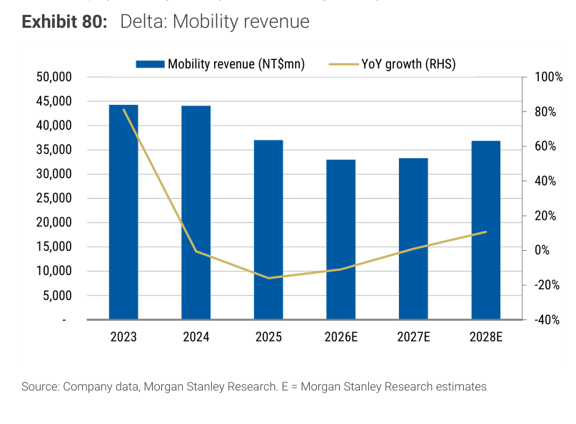

### 解讀摘要
Delta 移動解決方案業務（EV 充電、車用電子等）2023-2026E 呈下滑趨勢（NT\$44bn → NT\$33bn），主因全球 EV 充電基礎設施投資放緩；2027-2028E 微幅回升至 NT\$37bn。移動業務在 Delta 整體佔比已跌至 ~2%，不影響 AI 電源主線，但若 EV 充電市場反轉向好，可作為額外上行來源。

---

## 跨 Exhibit 彙整表

### 彙整 1｜機架世代 × 功率需求 × 部署架構對應

| 世代 | 機架 TDP | PSU/PSU 密度 | 建議 800VDC 架構 | 就緒時間 |
|---|---|---|---|---|
| Hopper | ~40KW | ~3.2KW/PSU | 傳統 480VAC | 今日 |
| GB200 NVL72 | ~120KW | ~3.2KW+ | 過渡：Power Rack In-Row | 2025-2026 |
| GB300 NVL72 | ~140KW | ~5.6KW/PSU | Phase I（660KW Power Rack） | Q3 2026 |
| VR200 NVL72 | 200-330KW | ~18.3KW（Rubin） | Phase II（1.6-2MW Power Center） | Q2 2027 |
| VR300 NVL72 | >300KW | >18.3KW（預估） | Phase III（4.8MW+ Power Block） | Q1 2028 |

> **彙整洞察**：Rubin 世代是分水嶺——PSU 密度跳升至 18.3KW（Blackwell 的 3.3x），同時機架 TDP 進入 200KW+，使傳統 480VAC 在物理上不可行。Phase I-III 部署時程恰好與 GB300→VR200→VR300 的量產時間點吻合，非巧合。

---

## 相關個股清單

| 類別 | 公司 | Ticker | 評等 | 備註 |
|---|---|---|---|---|
| 主要覆蓋（承接） | Delta Electronics | 2308.TW | OW | PT NT\$2,500（↓ from NT\$2,700），30x 2027/2028E P/E；63% EPS CAGR 2025-28 |
| 主要覆蓋（承接） | Lite-On Technology | 2301.TW | EW | PT NT\$315（↑ from NT\$176），17x 2027/2028E P/E；HVDC 進度落後 |
| 供應商/競爭者（提及） | Panasonic Holdings | 6752.JP | — | BBU 電芯/模組供應；FY3/27 HVDC BBU 量產 |
| 技術夥伴（提及） | Infineon | IFX.DE | — | SiC、SST 合作夥伴；2030 SST 市場 >US\$1bn 估算來源 |
| 競爭者（提及） | Bloom Energy | BE.US | — | SOFC 燃料電池，Delta 在亞洲市場的間接競爭者 |
| 技術來源（提及） | Eaton | ETN.US | — | CBU 超電容（>100 萬次循環）；SST 競爭者 |
