# MS｜Rubin Rack BOM、零件 Content 與 ODM 附加價值分析

**券商**：Morgan Stanley Taiwan Limited  
**分析師**：Howard Kao、Sharon Shih、Irene Yen  
**日期**：2026-05-20  
**主題**：Greater China Technology Hardware — AI Server 供應鏈  
**評級**：Industry View In-Line  
<button type="button" onclick="fetch('https://ti-lei.github.io/foreign-reports/static/downloads/產業/MS_20260520_Rubin-rack-BOM分析.md').then(r=>r.text()).then(t=>{let a=document.createElement('a');a.href='data:text/plain;charset=utf-8,'+encodeURIComponent(t);a.download='MS_20260520_Rubin-rack-BOM分析.md';a.click()})">⬇ 下載 MD</button>

---

## MS 完整投資邏輯鏈

| 論點層次 | Exhibit | 內容 |
|---|---|---|
| 基本面：content 增加 | Exhibit 3、10 | Rack ASP +95%，ODM value-add +38% |
| 基本面：量的成長 | Exhibit 11、12 | GB300 季度頂峰 24.9K，Rubin 接棒 |
| 估值：不貴 | Exhibit 13 | CY27e 11x，接近歷史均值 11.4x |
| 股價：落後市場 | Exhibit 15 | YTD +7% vs TAIEX +41%，落後 34pp |
| **結論** | 報告封面 | **買 ODM，Top Pick Wiwynn** |

> **整份報告最大邏輯缺口**：Exhibit 12 顯示 GB300 在 2H26 明顯衰退，但報告從未給出 Rubin 在 2H26 的季度出貨量預測。「Rubin 接棒」的故事在量化層面是懸空的，投資人需要從其他管道取得這個數字。

---

## 報告核心觀點

| 主題              | MS 觀點                         | 市場共識        | 是否 Contra-Consensus |
| --------------- | ----------------------------- | ----------- | ------------------- |
| Rubin rack ASP  | US\$7.8M（ODM 口徑）              | —           | —                   |
| ODM value-added | Rubin vs GB300 **+35-40%**    | 預期因「標準化」而下滑 | **是**               |
| PCB content     | **+233%**                     | —           | —                   |
| MLCC content    | **+182%**                     | —           | —                   |
| ABF content     | **+82%**                      | —           | —                   |
| ODM 估值          | 13 CY27e P/E，仍具吸引力           | —           | —                   |
| ODM 股價          | YTD +7% vs TAIEX +41%，落後 34pp | —           | —                   |

**ODM 偏好排序**：Wiwynn（Top Pick）> Wistron > Quanta > Hon Hai  
**零件偏好**：Delta、AVC、Unimicron、ZDT、FIT

---

## Exhibit 1｜GB200 / GB300 / VR200 BOM 結構比較（%）

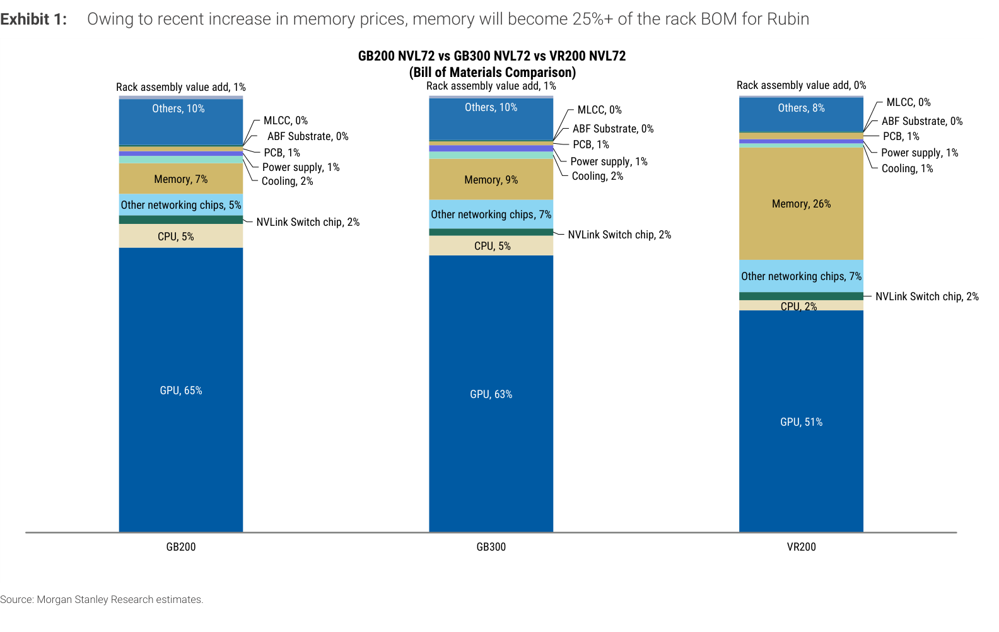

### 解讀摘要
Rubin（VR200）的 rack BOM 結構發生質變。Memory 從 GB200 的 7% 暴增至 VR200 的 26%，擠壓了 GPU 的佔比（65% → 51%）。這不是 GPU 變便宜，而是 Memory BOM 絕對金額大幅膨脹後的結構性稀釋效果，使整個比例重新洗牌。

> **原文補充**：MS 在 Exhibit 1 之前明確說明增量主因：*"increased memory content and significantly higher pricing"*（SOCAMM 用量增加＋漲價雙重驅動）。Exhibit 標題 caption 亦標注：*"Owing to recent increase in memory prices, memory will become 25%+ of the rack BOM for Rubin。"*

### 表格

| 零件類別 | GB200 | GB300 | VR200 | GB200→VR200 |
|---|---|---|---|---|
| GPU | 65% | 63% | 51% | ▼ -14pp |
| CPU | 5% | 5% | 2% | ▼ -3pp |
| NVLink Switch chip | 2% | 2% | 2% | — |
| Other networking chips | 5% | 7% | 7% | ▲ +2pp |
| **Memory** | **7%** | **9%** | **26%** | **▲ +19pp** |
| Cooling | 2% | 2% | 1% | ▼ -1pp |
| Power supply | 1% | 1% | 1% | — |
| PCB | 1% | 1% | 1% | — |
| ABF Substrate | 0% | 0% | 0% | — |
| MLCC | 0% | 0% | 0% | — |
| Others | 10% | 10% | 8% | ▼ -2pp |
| Rack assembly value add | 1% | 1% | 0% | ▼ -1pp |

> **注意**：百分比會誤導人，因為 rack ASP 從 \$3.3M → \$7.8M。需配合 Exhibit 3 的絕對金額才能看真正的 content growth。

---

## Exhibit 2｜Nvidia NVL72 Rack ASP 演進

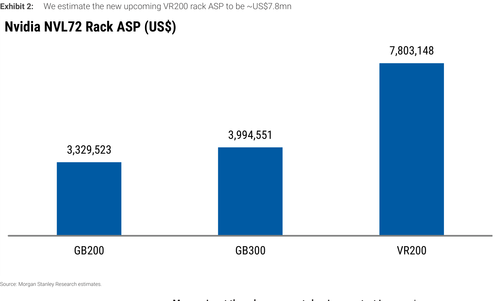

### 解讀摘要
Rubin rack ASP 幾乎是 GB300 的 2 倍（\$3.3M → \$7.8M）。GB200→GB300 只漲 20%（正常世代升級），但 GB300→VR200 漲幅達 95%，是整個 AI server content growth 故事的總基準。

> **原文補充**：MS 說明 ASP 暴增主因為 SOCAMM 漲價＋用量增加（*"increased memory content and significantly higher pricing"*）。此 ASP 為 ODM 向 hyperscaler（雲端客戶）收取的估算值；從 OEM 購買則加上品牌溢價後更高（*"the pricing from the OEMs will be even higher, after including brand profit and other charges"*）。另：Memory 不是唯一有 content increase 的零件，PCB（+233%）、MLCC（+182%）、ABF substrate（+82%）、Power supply（+32%）、Cooling（+12%）均有增長，rack assembly value-add 也預估 +30%（受設計複雜度提升驅動）。

### 表格

| 指標             | GB200      | GB300      | VR200      |
| -------------- | ---------- | ---------- | ---------- |
| Rack ASP (US$) | \$3,329,523 | \$3,994,551 | \$7,803,148 |
| 世代漲幅           | —          | +20%       | **+95%**   |
| 累計 vs GB200    | —          | +20%       | **+134%**  |

### 配合 Exhibit 1 的複合解讀

| | GB200 | GB300 | VR200 |
|---|---|---|---|
| Rack ASP | \$3.3M | \$4.0M | \$7.8M |
| Memory 佔比 | 7% | 9% | 26% |
| Memory 絕對金額（估算） | \$233K | \$359K | **\$2.0M** |

> Memory 絕對金額從 GB200 到 VR200 漲了約 **8.6 倍**，比例圖完全看不出這個量級的變化。

---

## Exhibit 3｜VR200 NVL72 完整 BOM（絕對金額）

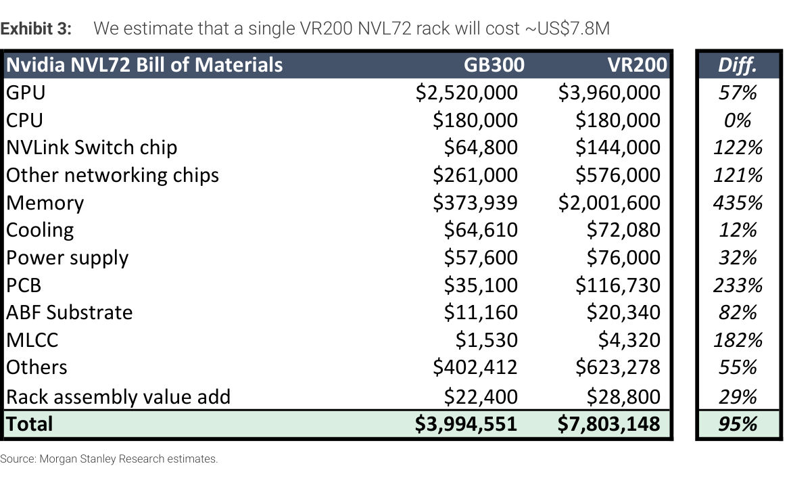

### 解讀摘要
全報告最重要的 Exhibit。Memory 漲幅 +435%，單一零件類別貢獻了 rack ASP 增量的 42%。MS 覆蓋下游零件漲幅排序：PCB（+233%）> MLCC（+182%）> ABF（+82%）> Power（+32%）> Cooling（+12%）。

### 表格

| 零件類別                    | GB300 (US$)    | VR200 (US$)    | 增幅        | VR200 BOM 佔比 | MS 覆蓋股        |
| ----------------------- | -------------- | -------------- | --------- | ------------ | ------------- |
| GPU                     | \$2,520,000     | \$3,960,000     | +57%      | 51%          | —             |
| **Memory**              | \$373,939       | \$2,001,600     | **+435%** | 26%          | —             |
| Other networking chips  | \$261,000       | \$576,000       | +121%     | 7%           | —             |
| NVLink Switch chip      | \$64,800        | \$144,000       | +122%     | 2%           | —             |
| CPU                     | \$180,000       | \$180,000       | 0%        | 2%           | —             |
| Others                  | \$402,412       | \$623,278       | +55%      | 8%           | —             |
| **Cooling**             | \$64,610        | \$72,080        | **+12%**  | 1%           | AVC、Delta     |
| **Power supply**        | \$57,600        | \$76,000        | **+32%**  | 1%           | Delta         |
| **PCB**                 | \$35,100        | \$116,730       | **+233%** | 1%           | Unimicron、ZDT |
| **ABF Substrate**       | \$11,160        | \$20,340        | **+82%**  | 0%           | —             |
| **MLCC**                | \$1,530         | \$4,320         | **+182%** | 0%           | Yageo         |
| Rack assembly value add | \$22,400        | \$28,800        | +29%      | 0%           | ODMs          |
| **Total**               | **\$3,994,551** | **\$7,803,148** | **+95%**  | 100%         |               |

### 研究備註

| 觀察 | 含義 |
|---|---|
| Memory +435% 但佔比 26% | SOCAMM 若由 hyperscaler 自採，rack ASP 降至 \$6.7M，ODM GM 反升至 2.2% |
| PCB 雖只佔 1% | 絕對金額 \$35K → \$117K，對 Unimicron/ZDT 是直接 revenue driver |
| MLCC 佔比看起來微小 | +182% 漲幅解釋了 ODM 為何瘋狂囤積 MLCC 庫存 |

---

## Exhibit 4｜VR200 PCB Content 細項拆解

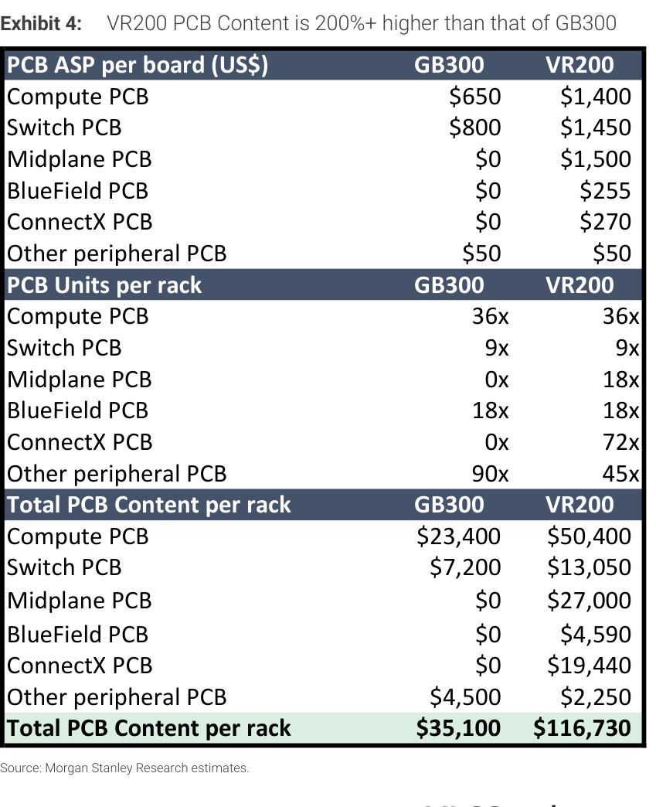

### 解讀摘要
PCB +233% 的成長來自三個獨立驅動力疊加：ASP 升級、全新模組引入（Midplane、ConnectX 在 GB300 完全不存在）、單位數量變化。

> **原文補充**：ASP 升級的技術細節——Compute PCB 層數 22L→26L（HDI→標準多層）、CCL grade M7→M8；Switch tray PCB 24L→32L；新增 Midplane PCB 為 44L。此外 Compute board 尺寸也略大於 Blackwell。這些規格升級是 ASP 漲幅的設計面依據，不是純定價決定。

### 表格

| PCB 類別 | GB300 單價 | VR200 單價 | 單價漲幅 | GB300 數量 | VR200 數量 | 數量變化 | GB300 小計 | VR200 小計 | 增幅 |
|---|---|---|---|---|---|---|---|---|---|
| Compute PCB | \$650 | \$1,400 | +115% | 36 | 36 | — | \$23,400 | \$50,400 | +115% |
| Switch PCB | \$800 | \$1,450 | +81% | 9 | 9 | — | \$7,200 | \$13,050 | +81% |
| **Midplane PCB** | \$0 | **\$1,500** | 新增 | 0 | **18** | 新增 | \$0 | **\$27,000** | 新增 |
| BlueField PCB | \$0 | \$255 | 新增 | 18 | 18 | — | \$0 | \$4,590 | 新增 |
| **ConnectX PCB** | \$0 | **\$270** | 新增 | 0 | **72** | 新增 | \$0 | **\$19,440** | 新增 |
| Other peripheral PCB | \$50 | \$50 | 0% | 90 | 45 | -50% | \$4,500 | \$2,250 | -50% |
| **Total** | | | | | | | **\$35,100** | **\$116,730** | **+233%** |

### 增量貢獻拆解

| 成長來源 | 貢獻金額 | 佔總增量 |
|---|---|---|
| 現有板子 ASP 提升（Compute + Switch） | +\$33,150 | 40% |
| **全新模組（Midplane + BlueField + ConnectX）** | **+\$51,030** | **62%** |
| Other peripheral 減少 | -\$2,250 | -2% |
| **淨增量** | **+\$81,630** | **100%** |

> **關鍵洞察**：PCB 增量中 62% 來自全新模組（\$51,030/\$81,630）。需求是純增量，不是搶既有市占，對 Unimicron/ZDT 是更可預測的訂單成長。計算：新模組 = \$27,000（Midplane）+ \$4,590（BlueField）+ \$19,440（ConnectX）= \$51,030。
>
> **洞察（配合 Exhibit 5、6）**：BlueField DPU 在 GB300 已有 18 units 且有 ABF substrate 成本（\$540，見 Exhibit 6），並非新模組；但 Exhibit 5 的 MLCC 卻標示 GB300 為 0 units「新增」。三張 Exhibit 對 GB300 BlueField 的口徑自相矛盾，MS 原文未解釋。最可能的解讀：GB300 的 BlueField PCB 與 MLCC 成本包在模組採購價內未拆出，VR200 才獨立計算——「全新模組」的說法僅對 Midplane 和 ConnectX 完全成立，BlueField 是成本重分類而非純增量。

---

## Exhibit 5｜VR200 MLCC Content 細項拆解

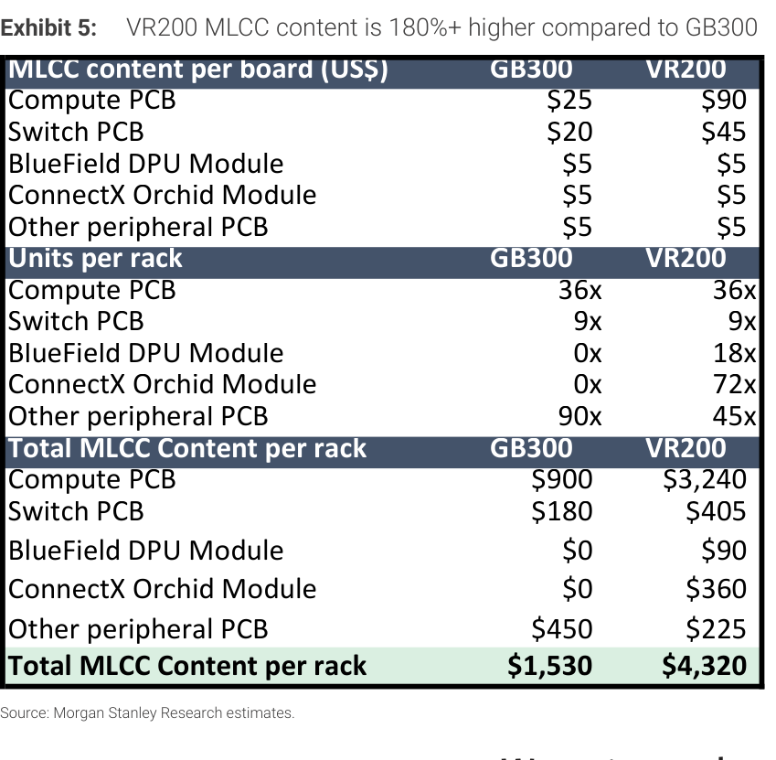

### 解讀摘要
MLCC +182% 的驅動結構與 PCB 截然不同。PCB 增量靠新模組（62%），但 MLCC 增量主要來自**既有板子的密度提升**（Computing board 單板 MLCC \$25 → \$90，漲 3.6x）。需求集中在核心運算板設計升級，難以被替代。

> **原文補充**：MS 指出此 MLCC 增量可解釋為何高端 AI server MLCC 需求如此強勁，以及為何各 ODM 積極囤積庫存以備 Rubin 2H26 量產（*"causing all the ODMs to aggressively trying to secure and build as much inventory as possible, ahead of the Rubin rack ramp from 2H26 on wards"*）。

### 表格

| MLCC 類別 | GB300 單價 | VR200 單價 | 單價漲幅 | GB300 數量 | VR200 數量 | 數量變化 | GB300 小計 | VR200 小計 | 增幅 |
|---|---|---|---|---|---|---|---|---|---|
| **Compute PCB** | \$25 | **\$90** | **+260%** | 36 | 36 | — | \$900 | **\$3,240** | +260% |
| Switch PCB | \$20 | \$45 | +125% | 9 | 9 | — | \$180 | \$405 | +125% |
| BlueField DPU Module | \$5 | \$5 | 0% | 0 | 18 | 新增 | \$0 | \$90 | 新增 |
| ConnectX Orchid Module | \$5 | \$5 | 0% | 0 | 72 | 新增 | \$0 | \$360 | 新增 |
| Other peripheral PCB | \$5 | \$5 | 0% | 90 | 45 | -50% | \$450 | \$225 | -50% |
| **Total** | | | | | | | **\$1,530** | **\$4,320** | **+182%** |

### 增量貢獻拆解

| 成長來源 | 貢獻金額 | 佔總增量 |
|---|---|---|
| **既有板子 ASP 提升（Compute + Switch）** | **+\$2,565** | **92%** |
| 全新模組（BlueField + ConnectX） | +\$450 | 16% |
| Other peripheral 減少 | -\$225 | -8% |
| **淨增量** | **+\$2,790** | **100%** |

---

## Exhibit 6｜VR200 ABF Substrate Content 細項拆解

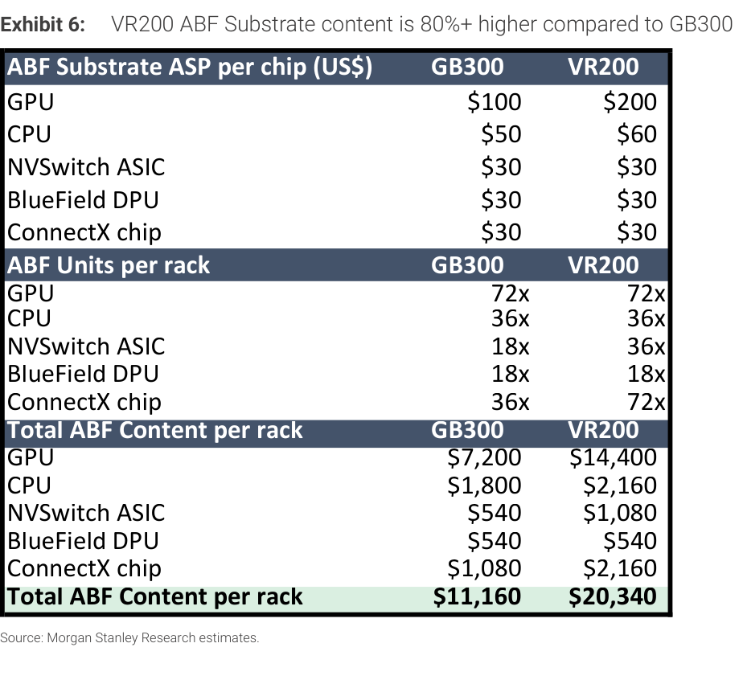

### 解讀摘要
ABF +82% 由兩種機制驅動：GPU substrate ASP 倍增（\$100→\$200）與 NVSwitch/ConnectX 用量翻倍。增量高度集中在 GPU substrate 定價（+\$7,200，佔 78%），是整個 ABF 估算的最大單一假設風險點。

> **原文補充**：GPU substrate \$100→\$200 的估算來自 MS 半導體分析師 Shoji Sato 的跨部門數字（*"According to Morgan Stanley analyst Shoji Sato, the Rubin GPU ABF substrate ASP will rise to ~US\$200 per chip"*）。此數字有明確來源，可獨立向 ABF 廠商或 substrate 分析師交叉核查。

### 表格

| ABF 類別 | GB300 單價 | VR200 單價 | 單價漲幅 | GB300 數量 | VR200 數量 | 數量變化 | GB300 小計 | VR200 小計 | 增幅 |
|---|---|---|---|---|---|---|---|---|---|
| **GPU** | \$100 | **\$200** | **+100%** | 72 | 72 | — | \$7,200 | **\$14,400** | +100% |
| CPU | \$50 | \$60 | +20% | 36 | 36 | — | \$1,800 | \$2,160 | +20% |
| NVSwitch ASIC | \$30 | \$30 | 0% | 18 | **36** | +100% | \$540 | \$1,080 | +100% |
| BlueField DPU | \$30 | \$30 | 0% | 18 | 18 | — | \$540 | \$540 | 0% |
| ConnectX chip | \$30 | \$30 | 0% | 36 | **72** | +100% | \$1,080 | \$2,160 | +100% |
| **Total** | | | | | | | **\$11,160** | **\$20,340** | **+82%** |

### 增量貢獻拆解

| 成長來源 | 貢獻金額 | 佔總增量 |
|---|---|---|
| **GPU substrate ASP 倍增** | **+\$7,200** | **78%** |
| ConnectX 用量翻倍 | +\$1,080 | 12% |
| NVSwitch 用量翻倍 | +\$540 | 6% |
| CPU substrate ASP 小升 | +\$360 | 4% |
| **淨增量** | **+\$9,180** | **100%** |

> **值得驗證**：ABF 增量的 78% 押注在 GPU substrate \$100→\$200 這個單一假設。若此數字有誤差，整個 ABF content +82% 的估算會大幅偏離，是報告 ABF 部分最大的單一假設風險。

---

## 三零件增量結構總比較

| 零件 | 主要驅動力 | 主驅動佔比 | 投資含義 |
|---|---|---|---|
| PCB | 全新模組導入 | 62% | 需求可預測，跟架構設計走 |
| MLCC | 既有板密度提升 | 92% | 結構性漲價，難被替代 |
| ABF | GPU substrate 定價 | 78% | 高度依賴 Nvidia 對 GPU substrate 的定價決策 |

---

## Exhibit 7｜AI Server Power 升級路線圖

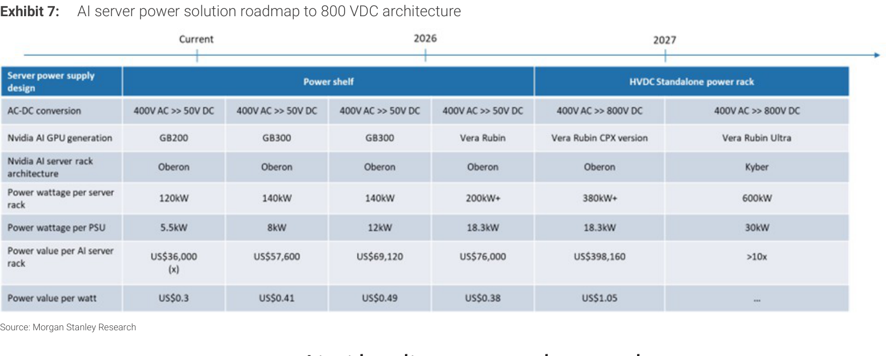

### 解讀摘要
Power 的故事分兩段：標準 Vera Rubin 只是正常升級（+32%），但進入 HVDC 架構後（Vera Rubin CPX 起），每 rack 的 power value 從 \$76K 暴增到 \$398K，單次跳升 5.2 倍。這是 Delta 最重要的 catalyst，但 HVDC 導入時程是關鍵不確定因素。

> **原文補充**：MS supply chain checks 顯示一家美國 CSP 已在 Vera Rubin 平台採用 HVDC standalone power rack；Delta 正與至少三家美國 CSP 洽談 ASIC power rack 專案，initial rollout 預期 2H26 開始（*"initial rollout expected starting 2H26"*）。Rubin Ultra 的 800V DC 全面採用預計 2H27（*"scheduled for 2H27"*）。

### 表格

| 指標 | 當前 (GB200) | GB300 v1 | GB300 v2 | Vera Rubin | Vera Rubin CPX | Vera Rubin Ultra |
|---|---|---|---|---|---|---|
| 電源架構 | Power shelf | Power shelf | Power shelf | Power shelf | **HVDC Standalone** | **HVDC Standalone** |
| AC-DC 轉換 | 400V→50V DC | 400V→50V DC | 400V→50V DC | 400V→50V DC | **400V→800V DC** | **400V→800V DC** |
| Nvidia GPU | GB200 | GB300 | GB300 | Vera Rubin | Vera Rubin CPX | Vera Rubin Ultra |
| 每 rack 功耗 | 120kW | 140kW | 140kW | 200kW+ | 380kW+ | **600kW** |
| 每 PSU 功率 | 5.5kW | 8kW | 12kW | 18.3kW | 18.3kW | **30kW** |
| **Power value/rack** | \$36,000 | \$57,600 | \$69,120 | **\$76,000** | **\$398,160** | **>10x** |
| Power value/watt | \$0.30/W | \$0.41/W | \$0.49/W | \$0.38/W | **\$1.05/W** | — |

### Delta 情境分析

| 情境 | Power content/rack | 對 Delta 的意義 |
|---|---|---|
| 標準 Vera Rubin 主導 | \$76,000 | 溫和成長，符合 Exhibit 3 的 +32% |
| HVDC 加速滲透（CPX） | \$398,160 | 對 Delta 是非線性跳升（+424%） |
| Vera Rubin Ultra（2H27） | >10 vs 標準 | 潛在最大受益，但時間較遠 |

> **洞察**：Power value per watt 在標準 Vera Rubin 反而從 \$0.49 下降到 \$0.38，代表 Exhibit 3 的 +32% 純粹是功耗增加帶動，不是定價能力提升。真正的定價能力提升要等到 HVDC（\$1.05/W = \$0.49/W 的 2.1 倍）。
>
> **值得驗證**：報告提到一家美國 CSP 已採用 HVDC，Delta 在與三家美國 CSP 洽談。HVDC 滲透率是 Delta 估值最大變數，報告沒有給出滲透率假設。

---

## Exhibit 8｜Vera Rubin 液冷組件 Content 細項

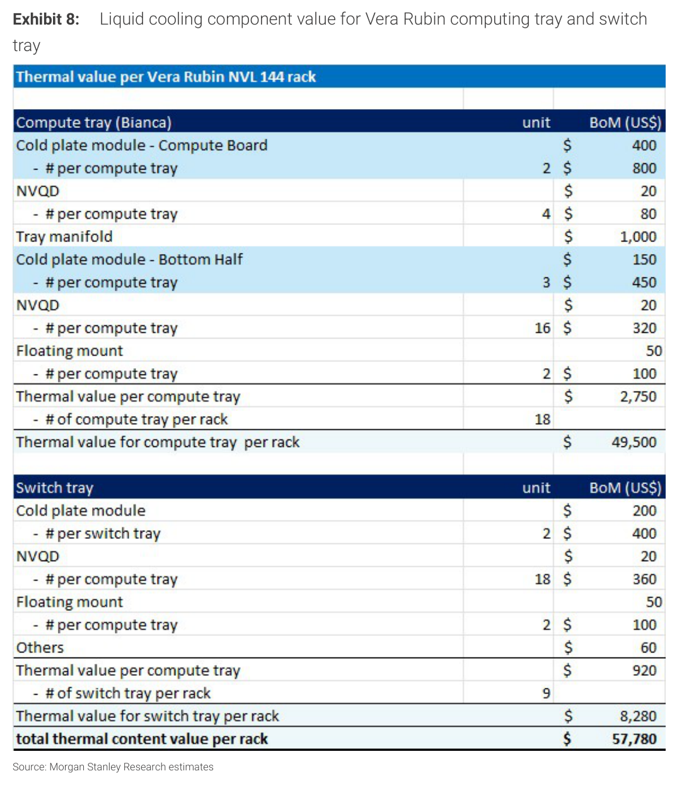

### 解讀摘要
全報告唯一做到零件級別拆解的 Exhibit，把 \$57,780 的 in-tray 液冷拆到每個 tray 的每個組件。Compute tray 佔絕大多數，Tray manifold 是單一最大項目。

**注意**：Exhibit 標題寫「NVL 144 rack」，但表格顯示 18 compute trays，與報告全文採用的 NVL72 規格一致（NVL144 為 NVL72 的 2 倍，應有 36 trays）。推測為報告標題標錯。

> **原文補充**：Vera Rubin rack 為 **fanless 全液冷設計**，無風扇模組，所有散熱完全由液冷承擔。MS 文字段落說明 tray manifold 為 Rubin 新增設計，對比 GB300 是純增量。另：computing board 的 **gold plating 設計變更「尚未完全確認」**（supply chain check 時仍在確認中），此細節若有變化可能影響 cooling 組件的具體規格與成本。

### Compute Tray（Bianca）

| 組件                                 | 單價         | 數量/tray | 小計/tray     |
| ---------------------------------- | ---------- | ------- | ----------- |
| Cold plate module - Compute Board  | \$400       | 2      | \$800        |
| NVQD（Compute Board）                | \$20        | 4      | \$80         |
| **Tray manifold**                  | **\$1,000** | **1**  | **\$1,000**  |
| Cold plate module - Bottom Half    | \$150       | 3      | \$450        |
| NVQD（Bottom Half）                  | \$20        | 16     | \$320        |
| Floating mount                     | \$50        | 2      | \$100        |
| **Thermal value per compute tray** |            |         | **\$2,750**  |
| **×18 compute trays per rack**     |            |         | **\$49,500** |

### Switch Tray

| 組件 | 單價 | 數量/tray | 小計/tray |
|---|---|---|---|
| Cold plate module | \$200 | 2 | \$400 |
| NVQD | \$20 | 18 | \$360 |
| Floating mount | \$50 | 2 | \$100 |
| Others | — | — | \$60 |
| **Thermal value per switch tray** | | | **\$920** |
| **×9 switch trays per rack** | | | **\$8,280** |

### 合計

| 項目 | 金額 | 佔 in-tray 比重 |
|---|---|---|
| Compute tray | \$49,500 | **86%** |
| Switch tray | \$8,280 | 14% |
| **Total thermal (in-tray)** | **\$57,780** | 100% |

> **洞察**：Tray manifold 單項（\$1,000/tray × 18 trays = \$18,000）佔 in-tray cooling 的 31%，是整個液冷系統最關鍵的單一組件，也是 AVC 的核心產品。

---

## Exhibit 9｜VR200 vs GB300 完整 Cooling Content

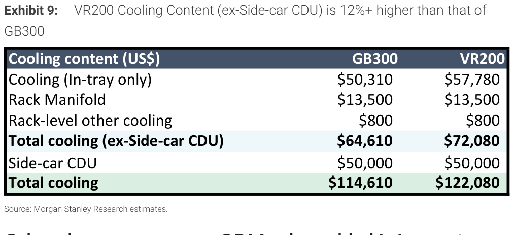

### 解讀摘要
報告標題說 Cooling +12%，但排除了 Side-car CDU。若納入 CDU，整體 Cooling 成長只有 +6.5%。所有增量 100% 來自 in-tray，Rack Manifold 和 CDU 完全沒有成長。

### 表格

| Cooling 項目 | GB300 | VR200 | 增幅 | VR200 佔比 |
|---|---|---|---|---|
| **Cooling（In-tray only）** | \$50,310 | \$57,780 | **+15%** | 47% |
| Rack Manifold | \$13,500 | \$13,500 | 0% | 11% |
| Rack-level other cooling | \$800 | \$800 | 0% | 1% |
| **Total cooling（ex-CDU）** | **\$64,610** | **\$72,080** | **+12%** | 59% |
| Side-car CDU | \$50,000 | \$50,000 | 0% | 41% |
| **Total cooling（含 CDU）** | **\$114,610** | **\$122,080** | **+6.5%** | 100% |

> **洞察**：Side-car CDU \$50,000 是最大單一冷卻項目（佔 41%），但完全沒有成長。CDU 廠商在 Rubin 世代的 content growth 故事需要另外找依據，不在這份報告裡。
>
> **注意**：Exhibit 3 的 Cooling \$72,080 對應這裡的「ex-CDU」數字，代表 BOM 分析已排除 CDU，使用 Exhibit 3 數字評估 Cooling 廠商需留意這個口徑。

---

## Exhibit 10｜ODM Value-Added 細項拆解

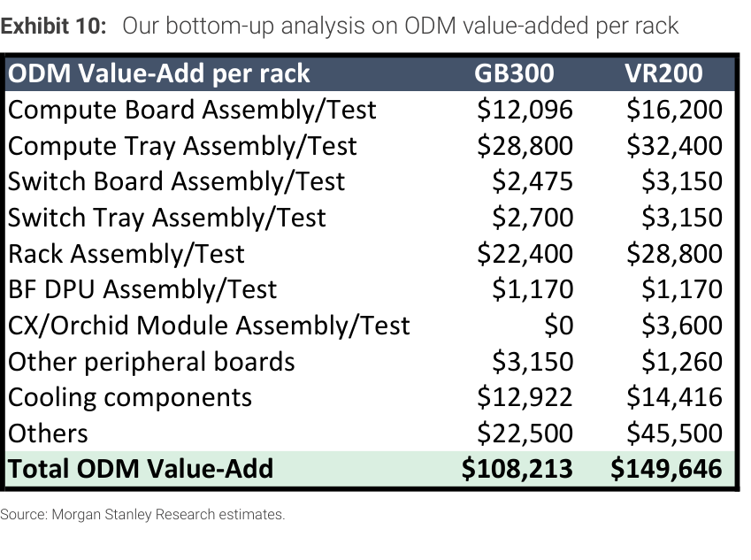

### 解讀摘要
ODM value-added +38%，但增量的 **55% 來自「Others」黑盒子**（\$22,500 → \$45,500，+102%），是最大貢獻項也是最不透明的項目。

> **原文補充**：MS 明確定性此為 contra-consensus 觀點：市場預期 Rubin computing tray「標準化」會使 ODM value-added 下滑，MS 認為增加的複雜度與新模組組裝測試抵消了此效果（*"the market expects ODM value-added to decline for Rubin, owing to the standardization of the computing tray"*）。MS 亦坦承 Others 黑盒子未來可能有更多未被捕捉的項目（*"there could also be other components within the rack that the ODMs may be able to provide, something that is not captured in our analysis here"*）。

### 表格

| ODM Value-Add 項目 | GB300 | VR200 | 增幅 | 增量金額 | 佔總增量 |
|---|---|---|---|---|---|
| **Others** | \$22,500 | **\$45,500** | **+102%** | **+\$23,000** | **55.5%** |
| Rack Assembly/Test | \$22,400 | \$28,800 | +29% | +\$6,400 | 15.4% |
| Compute Board Assembly/Test | \$12,096 | \$16,200 | +34% | +\$4,104 | 9.9% |
| Compute Tray Assembly/Test | \$28,800 | \$32,400 | +13% | +\$3,600 | 8.7% |
| CX/Orchid Module Assembly/Test | \$0 | \$3,600 | 新增 | +\$3,600 | 8.7% |
| Cooling components | \$12,922 | \$14,416 | +12% | +\$1,494 | 3.6% |
| Switch Board Assembly/Test | \$2,475 | \$3,150 | +27% | +\$675 | 1.6% |
| Switch Tray Assembly/Test | \$2,700 | \$3,150 | +17% | +\$450 | 1.1% |
| BF DPU Assembly/Test | \$1,170 | \$1,170 | 0% | \$0 | 0% |
| Other peripheral boards | \$3,150 | \$1,260 | -60% | -\$1,890 | -4.6% |
| **Total ODM Value-Add** | **\$108,213** | **\$149,646** | **+38%** | **+\$41,433** | **100%** |

### ODM GM 含義

| 指標 | GB300 | VR200 | 變化 |
|---|---|---|---|
| ODM Value-Add | \$108,213 | \$149,646 | +38% |
| Rack ASP | \$3,994,551 | \$7,803,148 | +95% |
| **隱含 ODM GM** | **2.71%** | **1.92%** | **-79 bps** |
| 絕對金額 | — | — | **+\$41,433/rack** |

| 情境 | Rack ASP | ODM GM |
|---|---|---|
| 基本情境（Nvidia 買 SOCAMM） | \$7,803,148 | 1.92% |
| SOCAMM 自採情境 | \$6,700,000 | **2.2%** |

> **洞察一**：把 ODM value-add 增量分「可量化」vs「不可量化」：可量化的 Assembly/Test 明細合計增量 +\$15,724（38%），Others 增量 +\$23,000（55%）。MS 也坦承 Others 可能還有更多，但目前是最難獨立驗證的項目。
>
> **洞察二（contra-consensus 的脆弱點）**：若將 Others 移除，可量化 ODM value-add 增量只有 +\$18,433（+17%），而非 +38%。Others 的具體內容是驗證這份報告核心論點的關鍵問題。
>
> **投資框架**：ODM GM 從 2.71% 降至 1.92% 看起來是壞事，但絕對金額從 \$108K 增加到 \$150K。以台灣 ODM 的規模，**margin % 下滑但 dollar profit 上升才是正確的評估框架**。

---

## Exhibit 11｜GB200/300 月度 Rack 產量（Jan 2025 – Apr 2026）

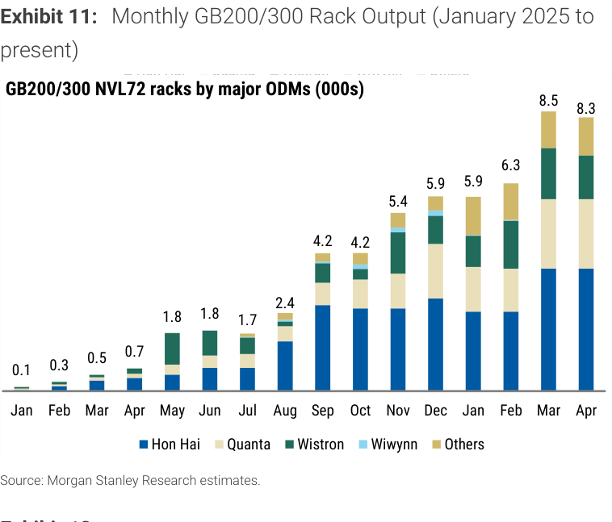

### 解讀摘要
月產量從 Jan 2025 的 0.1K 爬升到 Mar 2026 的 8.5K，16 個月內成長 83 倍。Mar→Apr 出現微幅下滑（8.5K → 8.3K），高原期跡象開始浮現。

### 表格

| 月份       | 月產量（千個） | MoM   | 備註        |
| -------- | --------- | ----- | --------- |
| 2025 Jan | 0.1       | —     | 量產開始      |
| 2025 Feb | 0.3       | +200% |           |
| 2025 Mar | 0.5       | +67%  |           |
| 2025 Apr | 0.7       | +40%  |           |
| 2025 May | 1.8       | +157% | 第一次加速     |
| 2025 Jun | 1.8       | 0%    | 第一次停滯     |
| 2025 Jul | 1.7       | -6%   | 第一次月減     |
| 2025 Aug | 2.4       | +41%  |           |
| 2025 Sep | 4.2       | +75%  | 第二次加速     |
| 2025 Oct | 4.2       | 0%    | 第二次停滯     |
| 2025 Nov | 5.4       | +29%  |           |
| 2025 Dec | 5.9       | +9%   |           |
| 2026 Jan | 5.9       | 0%    | 第三次停滯     |
| 2026 Feb | 6.3       | +7%   |           |
| 2026 Mar | 8.5       | +35%  | **歷史高點**  |
| 2026 Apr | 8.3       | -2%   | **高原期訊號** |

> **洞察**：成長過程出現三次「停滯月」（Jun、Oct 2025、Jan 2026），每次停滯後伴隨更大幅加速，呈現**階梯式爬升**，暗示產量受批次訂單節奏影響，而非產能限制。

---

## Exhibit 12｜GB200/300 季度 Rack 產量預測（1Q25–4Q26e）

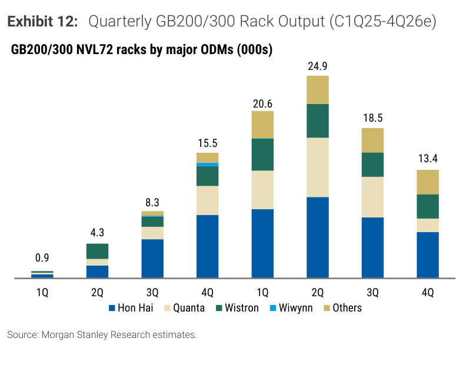

### 解讀摘要
GB200/300 季度產量在 2Q26 達頂峰 24.9K，之後開始下滑。2H26 的衰退是 Rubin 接棒前的轉換空窗期，3Q26 和 4Q26 各下滑約 -26%/-28% QoQ。

### 表格

| 季度 | 季產量（千個） | QoQ | 性質 |
|---|---|---|---|
| 1Q25 | 0.9 | — | 量產初期 |
| 2Q25 | 4.3 | +378% | 快速爬坡 |
| 3Q25 | 8.3 | +93% | |
| 4Q25 | 15.5 | +87% | |
| 1Q26 | 20.6 | +33% | 成長趨緩 |
| **2Q26** | **24.9** | **+21%** | **季度頂峰** |
| 3Q26e | 18.5 | **-26%** | Rubin 轉換空窗 |
| 4Q26e | 13.4 | **-28%** | 持續下滑 |

### 與 Exhibit 11 交叉驗證

| 季度 | 月度加總 | 季度數字 | 吻合 |
|---|---|---|---|
| 1Q25 | 0.1+0.3+0.5 = 0.9K | 0.9K | ✓ |
| 2Q25 | 0.7+1.8+1.8 = 4.3K | 4.3K | ✓ |
| 3Q25 | 1.7+2.4+4.2 = 8.3K | 8.3K | ✓ |
| 4Q25 | 4.2+5.4+5.9 = 15.5K | 15.5K | ✓ |
| 1Q26 | 5.9+6.3+8.5 = 20.7K | 20.6K | ✓（小數點誤差） |
| 2Q26 | 8.3+?+? = 24.9K | 24.9K | May/Jun 各隱含 ≈8.3K |

### 關鍵數字推導

**累計出貨量：**

| 年度 | 季度加總 | 累計 |
|---|---|---|
| 2025 全年 | 0.9+4.3+8.3+15.5 = **29.0K** | 29.0K |
| 2026 全年 | 20.6+24.9+18.5+13.4 = **77.4K** | 106.4K |

**ODM 絕對金額推算（以 GB300 ASP \$108K/rack）：**

| 季度 | rack 數量 | ODM value-add 合計（全體 ODM） |
|---|---|---|
| 2Q26（頂峰） | 24,900 | **\$2.69B** |
| 3Q26e | 18,500 | **\$2.00B** |
| 4Q26e | 13,400 | **\$1.45B** |
| 2H26 合計 | 31,900 | **\$3.45B** |

> **最大資訊缺口**：2H26 的 GB200/300 產量（31.9K）比 2Q26 單季少 -7K racks，換算 ODM value-add 減少 ~\$756M。這個缺口需要 Rubin 在 2H26 填補，但**報告對 Rubin 的季度出貨量完全沒有給出預測數字**，這是整份報告最大的懸空問題。

### 2H26 投資情境

| 情境 | 2H26 GB300 衰退 | Rubin 補位速度 | 對 ODM 影響 |
|---|---|---|---|
| 樂觀 | -31% | 快速接棒，Gap 很小 | 股價提前反映 Rubin 成長 |
| 基本 | -31% | 2H26 下半段才明顯 | 短期承壓，4Q26 回升 |
| 悲觀 | -31% | 慢，2027 才規模量產 | 業績真空期可能持續 2-3 季 |

---

## Exhibit 13｜台灣 ODM 歷史本益比

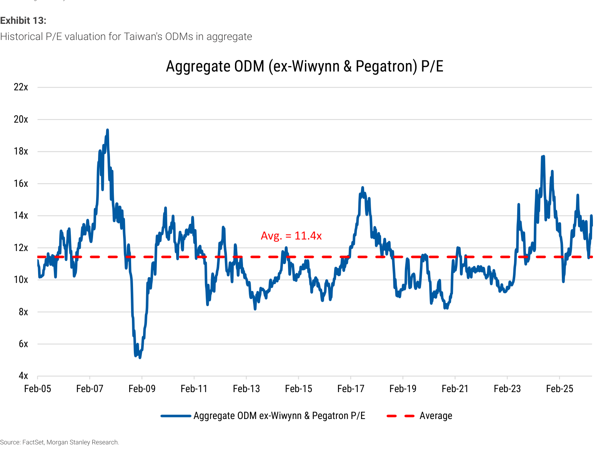

### 解讀摘要
20 年歷史平均 P/E 11.4x（ex-Wiwynn & Pegatron）是報告估值的錨點。目前 ODM 整體約在 ~13x CY27e P/E，高於歷史均值約 14%。

### 表格

| 指標 | 數值 |
|---|---|
| 歷史平均 P/E（20 年，ex-Wiwynn & Pegatron） | **11.4x** |
| 當前估值（CY27e，報告引用） | **13x** |
| 相對溢價 | **+14%** |
| 觀察期高點 | 20 |
| 觀察期低點 | 5 |

### 個股 CY27e P/E vs 歷史均值

| 公司 | CY27e P/E | vs 均值 11.4 | MS 評等 | ODM 偏好 |
|---|---|---|---|---|
| **Wistron** | **7.5x** | **-34%（折價最大）** | OW | 2nd |
| Wiwynn | 10.9 | -4% | OW | **1st** |
| Quanta | 10.4 | -9% | OW | 3rd |
| Hon Hai | 12.5 | +10% | OW | 4th |
| Pegatron | 10.0 | -12% | EW | — |
| Compal | 12.7 | +11% | UW | — |

> **洞察一**：估值最便宜的是 Wistron（-34%），但 MS Top Pick 是 Wiwynn。MS 的選股邏輯是「upside to price target 最大」，不是「估值最便宜」，兩個框架會導出不同結論。
>
> **洞察二**：Exhibit 13 刻意 ex-Wiwynn，加入 Wiwynn 後整體 P/E 會被拉高，使「便宜」論點更難成立。口徑選擇對自己最有利，投資人需留意。
>
> **值得驗證**：20 年歷史均值 11.4 包含 AI 時代之前的低成長期。若 ODM 進入結構性更高成長，歷史均值作為估值錨點可能本身就低估了合理本益比。

---

## Exhibit 14｜各 ODM AI 營收佔比（CY25 vs CY26e）

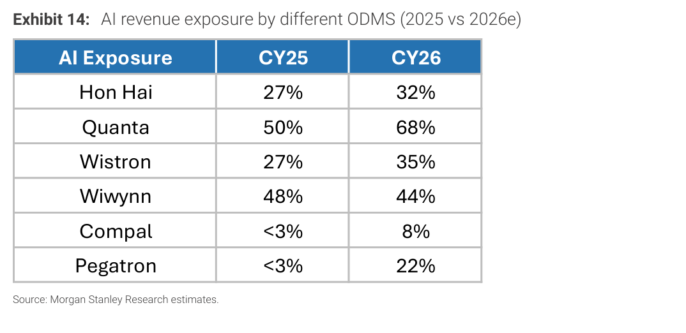

### 表格

| 公司 | CY25 AI 佔比 | CY26 AI 佔比 | 變化 | MS 評等 | MS 偏好 |
|---|---|---|---|---|---|
| Quanta | 50% | **68%** | +18pp | OW | 3rd |
| **Wiwynn** | **48%** | **44%** | **-4pp** | OW | **1st** |
| Pegatron | <3% | **22%** | **+19pp** | EW | — |
| Wistron | 27% | 35% | +8pp | OW | 2nd |
| Hon Hai | 27% | 32% | +5pp | OW | 4th |
| Compal | <3% | 8% | +5pp | UW | — |

> **洞察一（Wiwynn 悖論）**：Wiwynn AI 佔比下滑 (-4pp)，唯一合理解釋是總營收（分母）成長速度快於 AI 業務本身。用 % 指標評估 Wiwynn 的 AI 曝險會得出錯誤結論。
>
> **洞察二（AI 佔比 vs 選股排序的矛盾）**：AI 佔比最高的 Quanta（68%）排名第 3，AI 佔比第 2 的 Wiwynn 才是 Top Pick。MS 的選股邏輯不是「誰 AI 佔比最高」。
>
> **洞察三（競爭格局）**：Pegatron（<3%→22%）和 Compal（<3%→8%）的大幅提升代表後進者加速進入 AI server 市場。需追蹤這是新增量（TAM 擴張）還是搶既有 ODM 份額。

---

## Exhibit 15｜ODM vs TAIEX YTD 表現

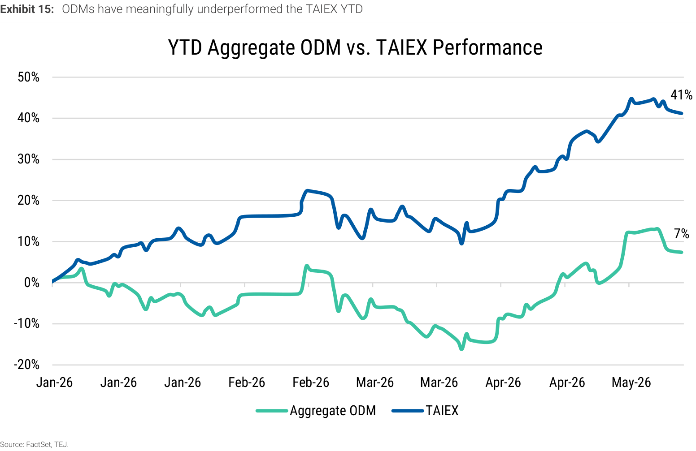

### 表格

| 指標 | 數值 | 期間 |
|---|---|---|
| Aggregate ODM YTD 報酬 | **+7%** | Jan–May 2026 |
| TAIEX YTD 報酬 | **+41%** | Jan–May 2026 |
| **落後幅度** | **-34pp** | |

---

## 相關個股清單

| 類別 | 公司 | Ticker | MS 評等 | 備註 |
|---|---|---|---|---|
| ODM（首選） | [[6669_緯穎_外資報告整理\|緯穎]] | 6669.TW | OW | Top Pick |
| ODM | [[3231_緯創_外資報告整理\|緯創]] | 3231.TW | OW | 估值最便宜 |
| ODM | [[2382_廣達_外資報告整理\|廣達]] | 2382.TW | OW | AI 佔比最高 |
| ODM | [[2317_鴻海_外資報告整理\|鴻海]] | 2317.TW | OW | |
| PCB | 欣興 | 3037.TW | OW | |
| PCB | 臻鼎（ZDT） | 4958.TW | OW | |
| 電源 | 台達電 | 2308.TW | OW | HVDC 關鍵受益 |
| 散熱 | [[3017_奇鋐_外資報告整理\|奇鋐（AVC）]] | 3017.TW | OW | Tray manifold |
| MLCC | [[2327_國巨_外資報告整理\|國巨]] | 2327.TW | OW | |
| ODM | FIT Hon Teng | 6088.HK | OW | |
