# MS｜Taiwan Computex 預覽：NVIDIA Vera CPU 與 Rubin GPU 為焦點

**券商**：Morgan Stanley Taiwan Limited / Asia Limited  
**分析師**：Charlie Chan、Daniel Yen CFA、Daisy Dai CFA、Tiffany Yeh、Lucas Wang、Ethan Jia、Henry Zhao  
**日期**：2026-05-27  
**主題**：Computex（6/2-5）前瞻：Rubin/Vera rack 設計、TSMC CoWoS 擴張至 200kwpm、AllRing PT 上調  
**評級**：N/A（主題報告）  
<button type="button" onclick="fetch('https://ti-lei.github.io/foreign-reports/static/downloads/產業/MS_20260527_Computex-Preview.md').then(r=>r.text()).then(t=>{let a=document.createElement('a');a.href='data:text/plain;charset=utf-8,'+encodeURIComponent(t);a.download='MS_20260527_Computex-Preview.md';a.click()})">⬇ 下載 MD</button>

---

## MS 完整投資邏輯鏈

| 論點層次 | Exhibit | 內容 |
|---|---|---|
| 需求信號明確 | 9、10 | 2026 AI CoWoS 需求 1,479k 晶圓，HBM 需求 32.3bn GB，wafer TAM \$27bn |
| 供給上行修正 | 1、2 | TSMC CoWoS 2027 從 170→200kwpm（+18%）；SoIC 微降 45→40kwpm（暫緩） |
| 新品項支撐 | 封面 | Vera CPU（1.5mn 台 standalone；\$20bn TAM）+ Rubin R200 進入量產；Rubin Ultra 延至 HBM4e |
| AllRing 受益最直接 | 13、21 | 2027E 收入 NT\$14.4bn（+73%）；CPO 佔比快速爬升至 21%；EPS 上修 +14-24% |
| 估值支撐 | 24 | PT NT\$1,580（RI 模型，CoE 8%，中期成長 16%），40x 2027E P/E |
| **結論** | 封面 | **TSMC/KYEC/ASE/AllRing/Winway 繼續 OW；UMC 因 TSMC Fab15A 滿載而受益（OW）** |

> **報告最大邏輯缺口**：Vera CPU 的 1.5mn 單位假設完全依賴供應鏈 capacity 推算，尚無 end-customer 承諾公開；若 hyperscaler 延遲採購或需求不如預期，CoWoS-R 容量將轉回 GPU，Vera CPU 供應鏈受益不確定。

---

## 報告核心觀點

| 主題 | MS 觀點 | 市場共識 | 是否 Contra-Consensus |
|---|---|---|---|
| TSMC CoWoS 2027 | 200kwpm（前估 170kwpm） | 市場預期 160-170kwpm | **是：再次超預期** |
| SoIC 2027 | 40kwpm（前估 45kwpm，輕微延後） | 45-50kwpm | 小幅下修，非結構性改變 |
| Rubin TDP | 已達 1.8kW，透過系統協作可達 2.3kW | 市場擔憂無法達 2.3kW | 正面，解除疑慮 |
| Rubin Ultra（2027） | 2-die 而非 4-die（良率考量），HBM4e 需新光罩 | 4-die 疑慮 | 確認 2-die，延後 4-die |
| Vera CPU 機會 | \$20bn TAM，1.5mn 單位，MSFT/Meta/CoreWeave/Oracle | 市場早期 | **Contra：規模超市場預期** |

**偏好排序（AI 供應鏈）**：TSMC > AllRing > ASE/KYEC/Winway > UMC（受 TSMC Fab15A 滿載受益）  
**個股觀點**：AllRing（6187）PT NT\$1,280 → NT\$1,580

---

## Exhibit 1｜全球 CoWoS 總產能（TSMC vs 非 TSMC）

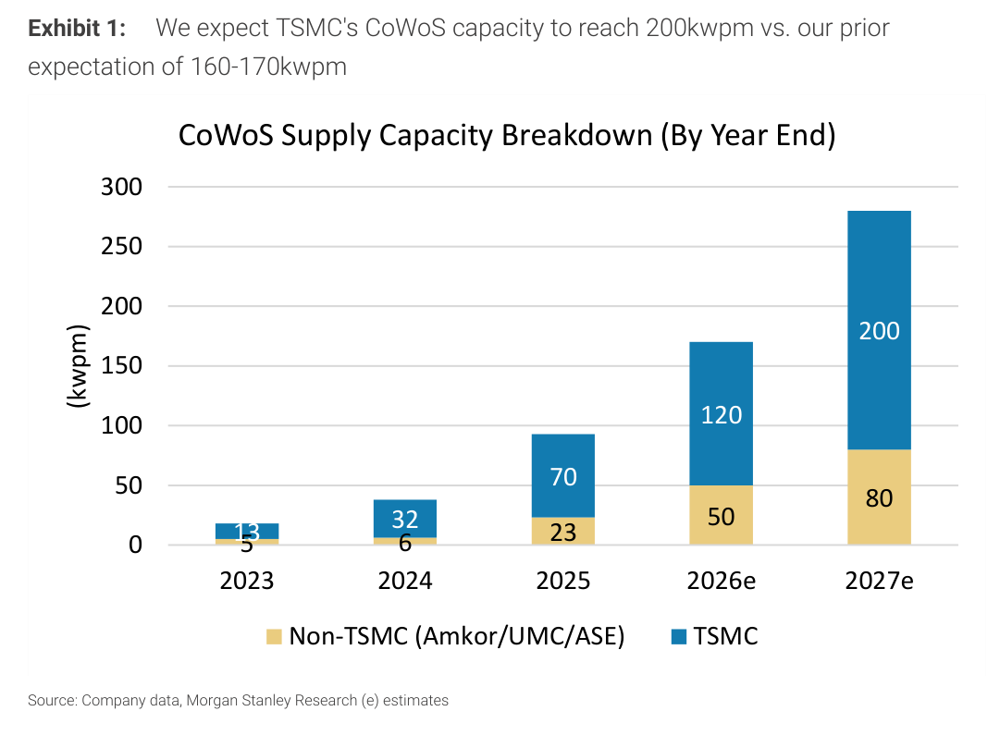

### 解讀摘要
TSMC 在 AP7 新增 CoWoS 產能（將 Fab 15A 28/22nm 空間轉換為 55nm interposer），2027 TSMC CoWoS 達 200kwpm（+18% vs 之前 170kwpm 預估），帶動全球 CoWoS 合計升至 280kwpm。這次上修是 MS 自 2025 年以來多次上修中最大的一次，反映 Vera CPU 和 Rubin GPU 的並行需求比預期更龐大。

### 表格（kwpm，年底）

| 年份 | TSMC | 非 TSMC（Amkor/UMC/ASE） | 合計 |
|---|---|---|---|
| 2023 | 13 | 5 | 18 |
| 2024 | 32 | 6 | 38 |
| 2025 | 70 | 23 | 93 |
| 2026e | 120 | 50 | 170 |
| 2027e | **200** | 80 | **280** |

> **洞察一**：TSMC CoWoS 2023-2027 CAGR 達 98%——在半導體設備史上幾乎找不到同等規模的新興製程四年翻 15x 的案例。這個增速比 DRAM 或 NAND 任何已知擴產週期都更陡峭，且需求側（AI GPU/CPU）能見度更高。

---

## Exhibit 2｜TSMC SoIC 產能 vs 生產（2023-2028e）

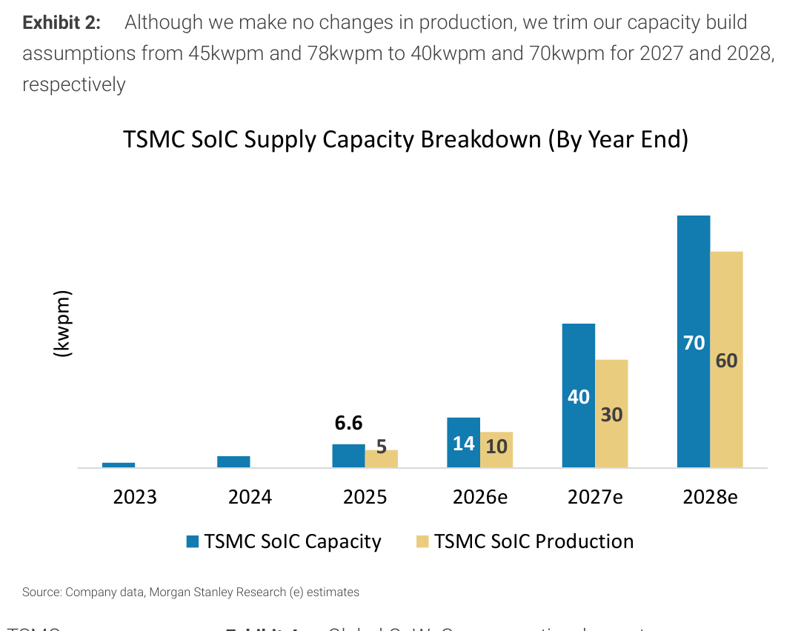

### 解讀摘要
SoIC 產能 2027 從 45→40kwpm（-11%），原因是 TSMC 優先把 AP7 資源分配給 CoWoS，SoIC 延後約三個季度。但生產量（30kwpm 2027、60kwpm 2028）不變，意味著 SoIC 需求不受影響，僅設備交期稍延。對 AllRing（唯一 WoW dispenser 供應商）短期影響有限，長期仍為核心成長驅動。

### 表格（kwpm）

| 年份 | SoIC 產能（年底） | SoIC 生產 |
|---|---|---|
| 2023 | 1.5 | 1.5 |
| 2024 | 3.3 | 3.3 |
| 2025 | 6.6 | 6.6 |
| 2026e | 14 | 14 |
| 2027e | **40**（前 45） | **30** |
| 2028e | **70**（前 78） | **60** |

---

## Exhibit 4-5｜CoWoS 需求：按客戶分拆及 YoY 成長

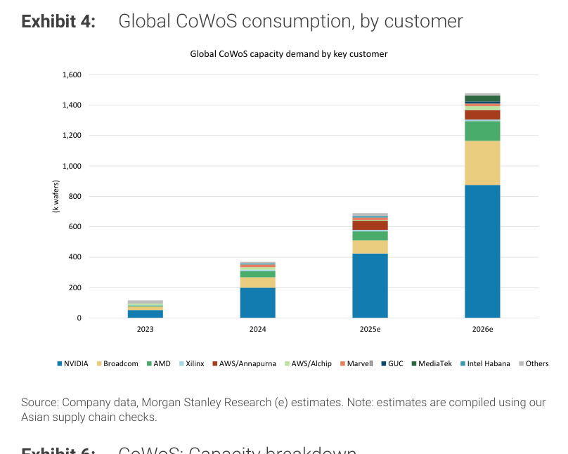

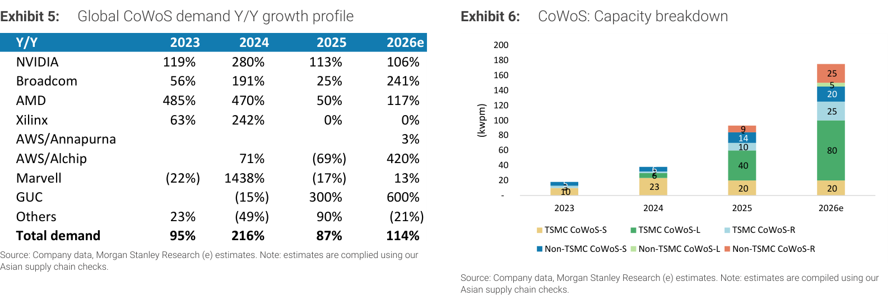

### 解讀摘要
2026 全球 CoWoS 消耗 1,479k 晶圓，NVIDIA 佔大宗（B300+Rubin+Vera = 800k wafers，54%）。Broadcom 2026 YoY +241%（TPU v8 Sunfish + 自家 ASIC），成長速度超越 NVIDIA（+106%）。Google/AWS ASIC 份額持續上升，逐漸形成多元化需求基礎，降低單一客戶（NVIDIA）風險。

### Exhibit 5 YoY 成長表

| 客戶 | 2023 | 2024 | 2025 | 2026e |
|---|---|---|---|---|
| NVIDIA | +119% | +280% | +113% | +106% |
| Broadcom | +56% | +191% | +25% | **+241%** |
| AMD | +485% | +470% | +50% | +117% |
| AWS/Alchip | — | +71% | -69% | +420% |
| Total demand | +95% | **+216%** | +87% | +114% |

> **洞察二**：Broadcom 2026 YoY +241% 是本年度 CoWoS 最快成長客戶（快於 NVIDIA），背後是 Google TPU v8 Sunfish（AVGO 設計）+ Broadcom 自有 ASIC 組合。這強化了「ASIC 分食 GPU 市場」的論述，CoWoS 需求來源多元化是有利訊號（去除集中風險）。

---

## Exhibit 6｜CoWoS 細項產能拆解（CoWoS-S/L/R × TSMC/非 TSMC）

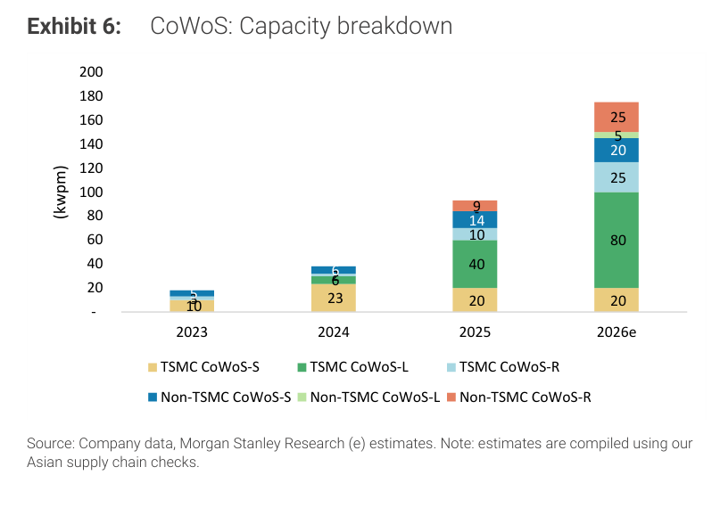

### 解讀摘要
CoWoS-R（Remote copper pillar，先進 interposer）是此次主要新增產能類型，主要用於 Vera CPU 和 Rubin GPU。CoWoS-S（Silicon interposer）仍是最大量，為 B300 / H200 等既有 GPU 產品的主力。非 TSMC 廠（Amkor/UMC/ASE）快速承接較低規格的 CoWoS-S/L 需求，TSMC 集中投資高端 CoWoS-R。

---

## Exhibit 7｜CoWoS 結構圖（Chip on wafer on substrate）

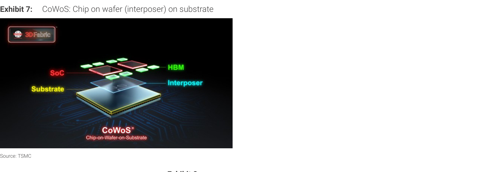

（TSMC 提供的 CoWoS 結構示意圖，來源 TSMC）

---

## Exhibit 8｜TSMC 先進封裝廠規劃

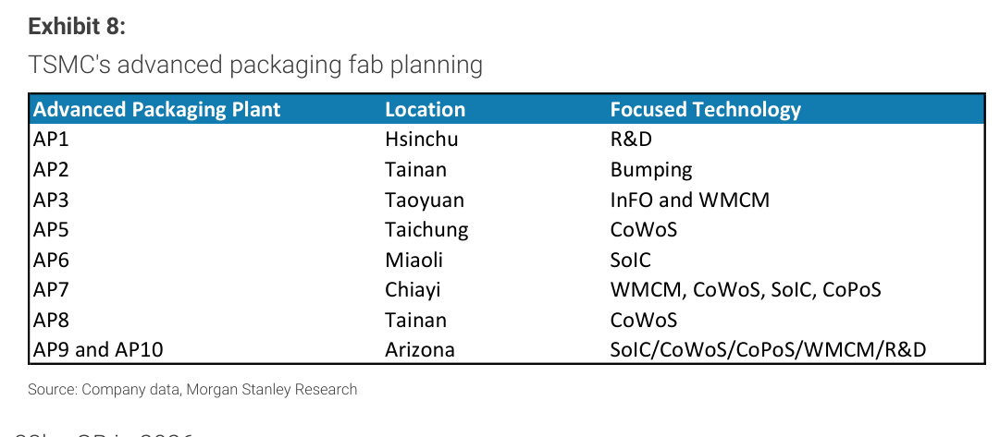

### 表格

| 廠別 | 地點 | 主要技術 |
|---|---|---|
| AP1 | 新竹 | R&D |
| AP2 | 台南 | Bumping |
| AP3 | 桃園 | InFO, WMCM |
| AP5 | 台中 | CoWoS |
| AP6 | 苗栗 | SoIC |
| AP7 | 嘉義 | WMCM, CoWoS, SoIC, CoPoS |
| AP8 | 台南 | CoWoS |
| AP9/AP10 | 亞利桑那 | SoIC/CoWoS/CoPoS/WMCM/R&D |

> **洞察三**：AP7（嘉義）是本次 CoWoS 擴產的核心廠，同時承載 CoWoS + SoIC + CoPoS，是 TSMC 最具戰略意義的先進封裝設施——也是 AllRing 最重要的設備需求來源。AP9/AP10 亞利桑那的 SoIC 建設對美國供應鏈有重要含義。

---

## Exhibit 9｜AI HBM 消耗量：2026 年合計 32.3bn GB

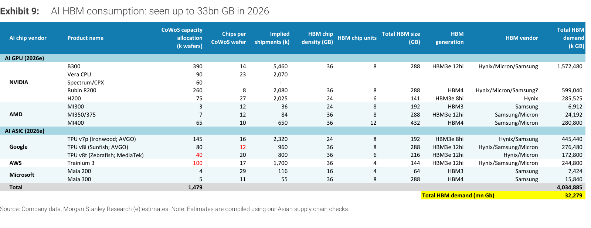

### 解讀摘要
2026 年 AI 晶片共消耗 32,279mn Gb（≈ 32.3bn GB）HBM，比 2025 年大幅增加。NVIDIA B300 單品就貢獻 1,572,480k GB（占總量 39%），Rubin R200 貢獻 599,040k GB（15%）；Google TPU 合計貢獻約 895,000k GB（22%）。HBM 供應商（Hynix 為主，Micron/Samsung 次之）面臨空前的需求壓力，尤其 HBM4 世代（Rubin/MI400/Maia 300）全面轉向。

### 表格（2026e）

| 客戶 | 產品 | CoWoS (k晶圓) | HBM 世代 | 總 HBM 需求 (k GB) |
|---|---|---|---|---|
| **NVIDIA** | B300 | 390 | HBM3e 12hi | 1,572,480 |
| | Vera CPU | 90 | — | — |
| | Rubin R200 | 260 | **HBM4** | 599,040 |
| | H200 | 75 | HBM3e 8hi | 285,525 |
| **AMD** | MI400 | 65 | **HBM4** | 280,800 |
| **Google** | TPU v7p（Ironwood/AVGO） | 145 | HBM3e 8hi | 445,440 |
| | TPU v8i（Sunfish/AVGO） | 80 | HBM3e 12hi | 276,480 |
| | TPU v8t（Zebrafish/MediaTek） | 40 | HBM3e 12hi | 172,800 |
| **AWS** | Trainium 3 | 100 | HBM3e 12hi | 244,800 |
| **Microsoft** | Maia 200/300 | 9 | HBM3/HBM4 | 23,264 |
| **Total** | | **1,479** | | **32,279mn Gb** |

> **洞察四**：HBM4 需求（Rubin + MI400 + Maia 300）合計約 900,000k GB（880k + 280k），佔總量約 28%，全部在 2026 年初啟——這意味著 Hynix/Micron 的 HBM4 量產時程決定了 Rubin 能否如期出貨，是整個 AI 供應鏈的關鍵路徑。

---

## Exhibit 10｜AI Wafer TAM：2026 年 US\$27bn

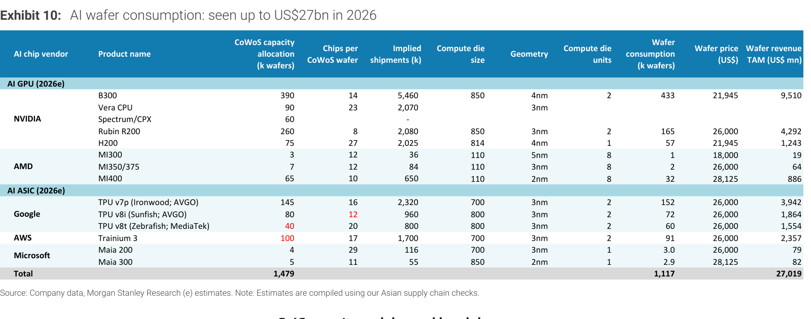

### 解讀摘要
2026 年 AI 晶片的 wafer revenue TAM 達 US\$27bn，由 NVIDIA B300 主導（\$9.5bn，35%），其次 Rubin R200（\$4.3bn，16%）和 Google TPU 合計（\$7.4bn，27%）。晶圓消耗量 1,117k wafers，均價約 \$24k（3nm 26k、4nm 22k、2nm 28k），3nm 晶圓是主力（TPU Sunfish/Trainium 3/Rubin R200 等）。

### 表格（2026e）

| 客戶 | 產品 | CoWoS (k晶圓) | 晶圓消耗 (k晶圓) | 單價（US\$） | 晶圓 TAM (US\$ mn) |
|---|---|---|---|---|---|
| **NVIDIA** | B300 | 390 | 433 | 21,945 | 9,510 |
| | Rubin R200 | 260 | 165 | 26,000 | 4,292 |
| | H200 | 75 | 57 | 21,945 | 1,243 |
| **Google** | TPU v7p（Ironwood） | 145 | 152 | 26,000 | 3,942 |
| | TPU v8i（Sunfish） | 80 | 72 | 26,000 | 1,864 |
| | TPU v8t（Zebrafish） | 40 | 60 | 26,000 | 1,554 |
| **AWS** | Trainium 3 | 100 | 91 | 26,000 | 2,357 |
| **AMD** | MI400 | 65 | 32 | 28,125 | 886 |
| **Total** | | **1,479** | **1,117** | | **27,019** |

> **洞察五（配合 Exhibit 9）**：B300 佔 CoWoS 需求 390k wafers（26% 份額）但帶來 \$9.5bn 晶圓 TAM（35%），因為 B300 使用面積最大的 4nm die（850mm²）。Vera CPU（3nm，90k wafers）的 wafer revenue 未單獨列出，MS 視其為「attached to B300/Rubin ecosystem」，但每顆 CPU 含 2,070k shipments × 3nm wafer price = 重要隱性 TAM。

---

## Exhibit 11-12｜TSMC SoIC 需求拆解（2026e/2027e）

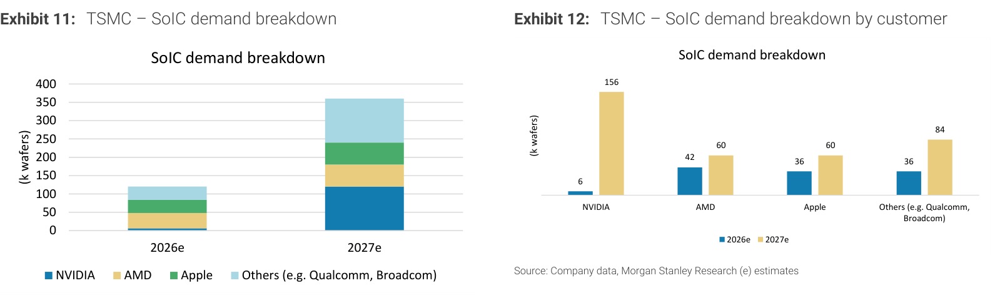

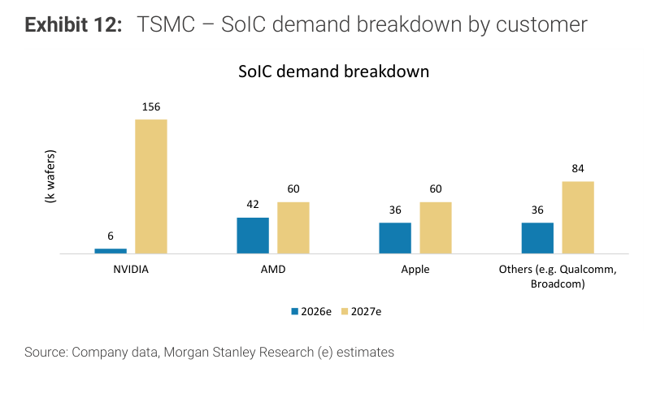

### 解讀摘要
2027 年 SoIC 需求量 324k wafers（NVIDIA 120k + AMD 60k + Apple 60k + Others 84k），較 2026 年 120k 暴增 170%。NVIDIA 的 SoIC 需求 2026 僅 6k（CPO COUPE + 試量產），2027 跳升至 120k（20x），成為最大驅動力。Broadcom/Qualcomm 仍在設計和試製階段，尚未確認量產，是 2027 估計的不確定項。

### 表格（k wafers）

| 客戶 | 2026e | 2027e |
|---|---|---|
| NVIDIA | 6 | 120 |
| AMD | 42 | 60 |
| Apple | 36 | 60 |
| Others（Qualcomm/Broadcom等） | 36 | 84 |
| **Total** | **120** | **324** |

> **值得驗證**：NVIDIA SoIC 2027 的 120k wafer 假設，其中包含 CPO 的 COUPE 需求以及可能的 Feynman GPU「1-2GB SRAM stacked on each die」需求。若 Feynman 採 GPU-to-GPU 直接 stacking（而非 SRAM stacking），SoIC 需求形態會改變，可能影響 AllRing 的 WoW dispenser 用量。

---

## Exhibit 13｜AllRing 收入 Bottom-up 分析

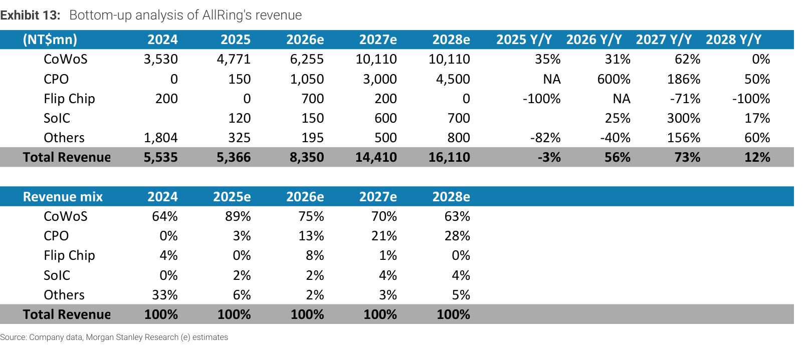

### 解讀摘要
AllRing 的 2027 收入預測 NT\$14.4bn（+73%），主要驅動是 CoWoS +62%（TSMC 200kwpm 帶動設備需求）和 CPO +186%（NVIDIA FAU 光耦合設備進入量產）。CPO 業務佔比快速從 2026 年 13% 升至 2027 年 21%，成為第二大業務線；SoIC 2027 +300% 但絕對金額仍小（4% 佔比）。

### 表格（NT\$ mn）

| 業務線 | 2024 | 2025 | 2026e | 2027e | 2028e | 2027 YoY |
|---|---|---|---|---|---|---|
| CoWoS | 3,530 | 4,771 | 6,255 | 10,110 | 10,110 | **+62%** |
| CPO | 0 | 150 | 1,050 | 3,000 | 4,500 | +186% |
| SoIC | — | 120 | 150 | 600 | 700 | +300% |
| Others | 1,804 | 325 | 195 | 500 | 800 | +156% |
| **Total** | **5,535** | **5,366** | **8,350** | **14,410** | **16,110** | **+73%** |

### 增量貢獻拆解（2026e NT\$8,350mn → 2027e NT\$14,410mn，增量 NT\$6,060mn）

| 成長來源 | 貢獻（NT\$ mn） | 佔總增量 |
|---|---|---|
| CoWoS（TSMC 200kwpm 帶動） | +3,855 | 64% |
| CPO（NVIDIA FAU + dispensing） | +1,950 | 32% |
| SoIC（WoW dispenser，量產加速） | +450 | 7% |
| Others | +305 | 5% |
| **淨增量** | **+6,060** | **100%** |

計算過程：10,110-6,255=+3,855（CoWoS），3,000-1,050=+1,950（CPO），600-150=+450（SoIC），500-195=+305（Others）

> **洞察六**：CoWoS 佔增量 64%，但 2028 年 CoWoS YoY 成長跌至 0%（收入持平於 NT\$10.1bn），代表 AllRing 的長期成長接力棒必須由 CPO（+50% in 2028）和 SoIC（+17%）接棒。這個業務結構轉型是否能順利執行，是 AllRing 2028+ 估值的核心假設。

---

## Exhibit 14｜AllRing 在各封裝製程的設備清單

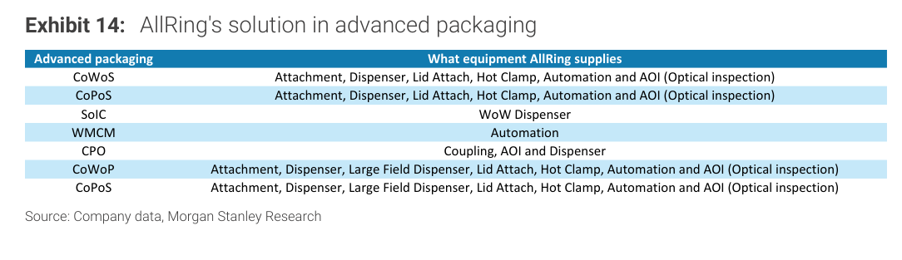

### 表格

| 製程 | AllRing 提供設備 |
|---|---|
| CoWoS | Attachment, Dispenser, Lid Attach, Hot Clamp, Automation, AOI |
| CoPoS | Attachment, Dispenser, Lid Attach, Hot Clamp, Automation, AOI |
| SoIC | WoW Dispenser（唯一供應商） |
| WMCM | Automation |
| CPO | Coupling, AOI, Dispenser |
| CoWoP | Attachment, Dispenser, Large Field Dispenser, Lid Attach, Hot Clamp, Automation, AOI |

> **洞察七**：AllRing 在 CoWoS 提供整線設備（從接合到光學檢測），在 SoIC 是唯一的 WoW dispenser。這種「壟斷關鍵製程 + 廣覆蓋其他製程」的組合，使 AllRing 在先進封裝 capex 循環中的份額穩定性遠高於其他設備商。

---

## Exhibit 17｜TSMC AI 相關收入：2024-29 CAGR 達 60%

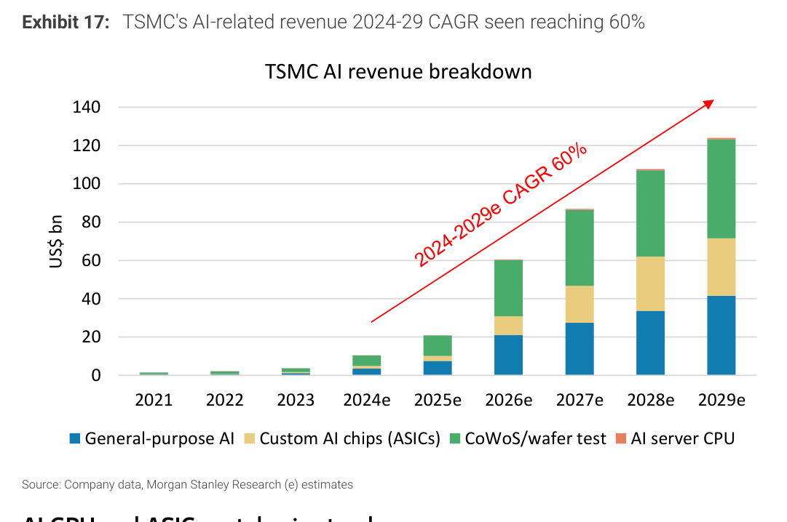

### 解讀摘要
MS 預測 TSMC AI 相關收入（GPU+ASIC+CoWoS+AI Server CPU）從 2024 年約 \$15-20bn 成長至 2029 年超過 \$120bn，CAGR 約 60%。其中 Custom AI chips（ASICs）的絕對成長量最大，AI Server CPU（Vera）是新增加的類別。AI 佔 TSMC 總收入比重將從 2024 約 15% 提升至 2029 可能超過 50%。

---

## Exhibit 18-20｜AI GPU/ASIC 租賃定價追蹤

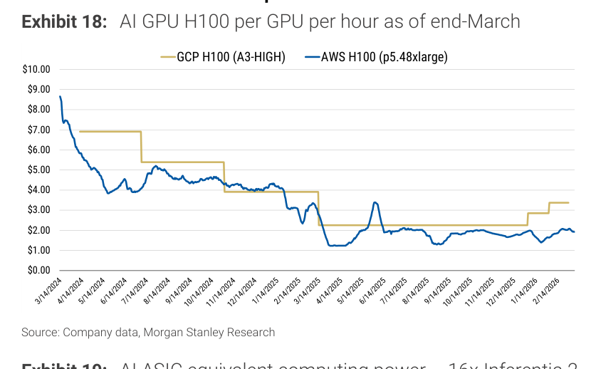

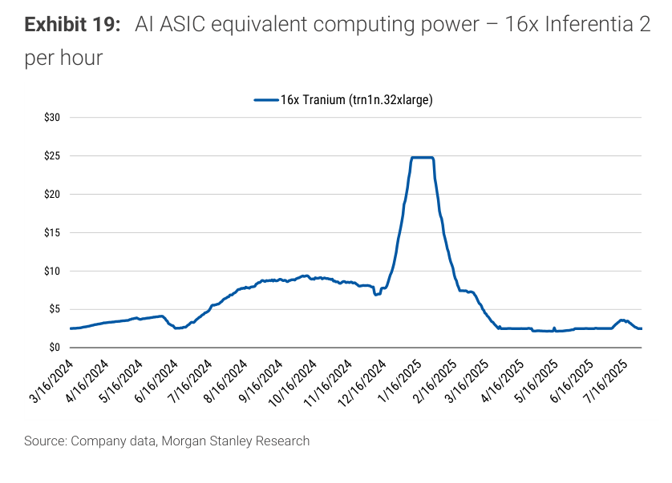

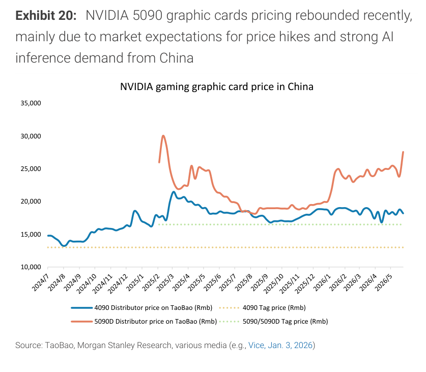

### 解讀摘要
H100 GPU 雲端租賃價格（GCP/AWS）已從高點回落，反映供給增加；但 NVIDIA 5090 在中國 TaoBao 的溢價持續（因 AI inference 需求 + 市場預期漲價），5090D 二手價維持在 NT$20,000+ 區間。GPU 租賃定價的穩定表明 AI 基礎設施需求未見顯著過熱或崩跌。

---

## Exhibit 21｜AllRing 估計修正

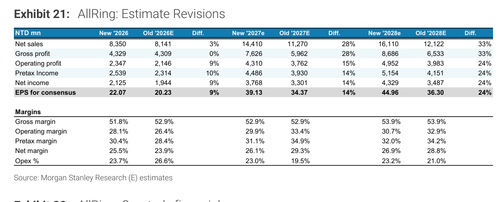

### 表格（NT\$ mn）

| 指標 | 2026 新 | 2026 舊 | Diff | 2027 新 | 2027 舊 | Diff | 2028 新 | 2028 舊 | Diff |
|---|---|---|---|---|---|---|---|---|---|
| Net sales | 8,350 | 8,141 | +3% | 14,410 | 11,270 | **+28%** | 16,110 | 12,122 | **+33%** |
| Operating profit | 2,347 | 2,146 | +9% | 4,310 | 3,762 | +15% | 4,952 | 3,983 | +24% |
| EPS（NT\$） | 22.07 | 20.23 | **+9%** | 39.13 | 34.37 | **+14%** | 44.96 | 36.30 | **+24%** |
| Gross margin | 51.8% | 52.9% | -1.1ppt | 52.9% | 52.9% | — | 53.9% | 53.9% | — |
| Operating margin | 28.1% | 26.4% | +1.7ppt | 29.9% | 33.4% | -3.5ppt | 30.7% | 32.9% | -2.2ppt |

> **洞察八**：2027E operating margin 微降（33.4%→29.9%），因 R&D 投入加速（AI server 新技術）；但 net margin 仍在 26%+ 水平，主要因 non-operating income 改善。銷售量驅動（+28% revenue）遮蓋了 margin 小幅壓縮，EPS 仍上修 +14%。

---

## Exhibit 24｜AllRing NTM P/E 歷史

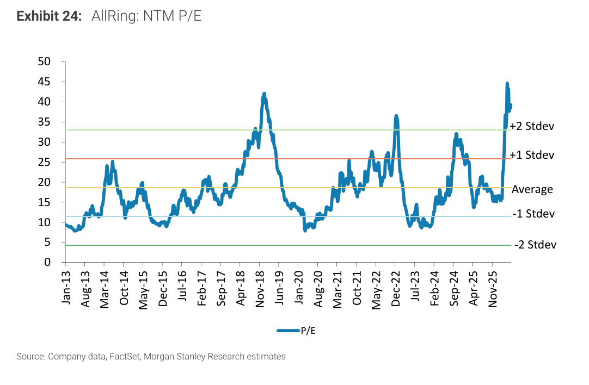

### 解讀摘要
AllRing 歷史 NTM P/E 呈現 5-40x 寬廣範圍，MS 的 PT NT\$1,580 隱含 2027E P/E 約 40x（接近歷史 +2STD 上緣），與 SoIC peer 相當，低於 CPO peers。MS 認為此溢價合理，因為 AllRing 的業務組合正在轉型（CoWoS → CPO + SoIC），估值需反映轉型的長期潛力。

---

## 跨 Exhibit 彙整表

### 彙整 1｜CoWoS 供需平衡（來源：Exhibit 1、9）

| 指標 | 2025 | 2026e | 2027e |
|---|---|---|---|
| 總 CoWoS 產能（kwpm，年底） | 93 | 170 | 280 |
| AI CoWoS 需求（k晶圓/月，換算） | — | 123（=1,479k/12個月） | — |
| TSMC CoWoS 產能（kwpm） | 70 | 120 | 200 |
| 利用率（粗估 2026）| — | 73%（=123/170） | — |

> **彙整洞察**：2026 年 CoWoS 利用率約 73%，供需尚未過緊；但 2026 年底新需求（Vera CPU + Rubin R200 量產）加入後，2027 上半年可能出現短暫緊張——這是 AllRing 設備交期的最佳窗口。

---

## 相關個股清單

| 類別 | 公司 | Ticker | 評等 | 備註 |
|---|---|---|---|---|
| 直接受益（PT 上調） | AllRing Tech | 6187.TWO | OW | PT NT\$1,580（前 NT\$1,280）；CPO 13%→21%（2027）；EPS +14-24% |
| 核心供應鏈 | TSMC | 2330.TW | OW | CoWoS 200kwpm；AI 收入 CAGR 60% |
| 測試 | KYEC | 2325.TW | OW | Rubin 測試主力 |
| 封裝 | ASE Technology | 3711.TW | OW | CoWoS 非 TSMC 需求受益 |
| 封裝（量測） | Hon Precision | — | OW | Rubin/Vera 供應鏈 |
| 測試座 | Winway | 6515.TWO | OW | Rubin/Vera socket 供應商 |
| 間接受益 | UMC | 2303.TW | OW | TSMC Fab 15A 滿載後 Sony 28/22nm ISP 訂單溢出 |
| ASIC 設計服務 | Alchip | 3661.TWO | OW | Google TPU v8t（Zebrafish）主要設計廠 |
| ASIC 設計服務 | GUC | 3443.TWO | OW | CoWoS 需求持續成長 |
| CPO | FOCI Fiber | — | 正面 | CPO FAU 光耦合供應商 |
| CPO | Himax | HIMX.US | 正面 | CPO 受益 |
