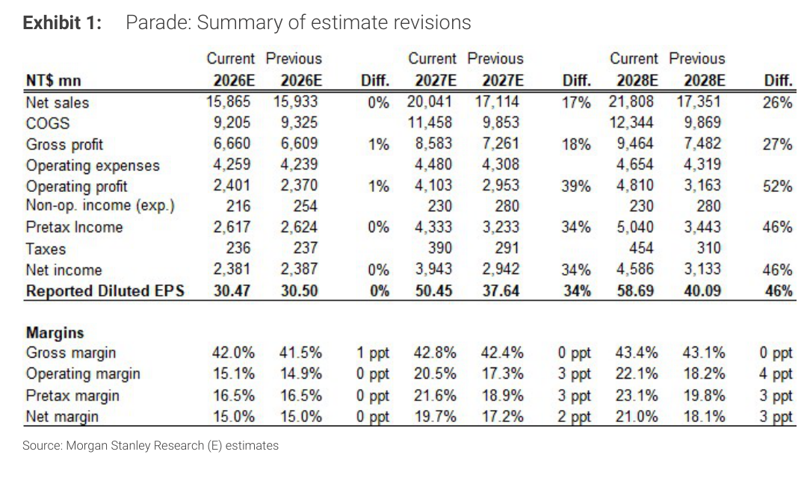
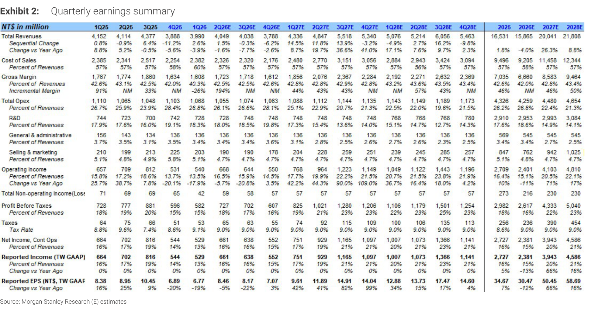
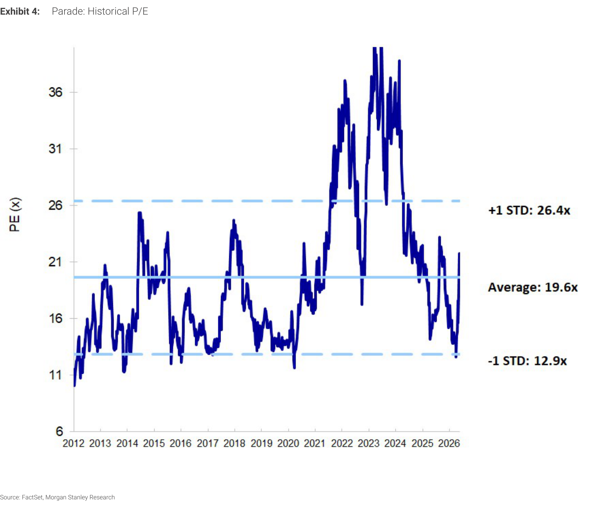
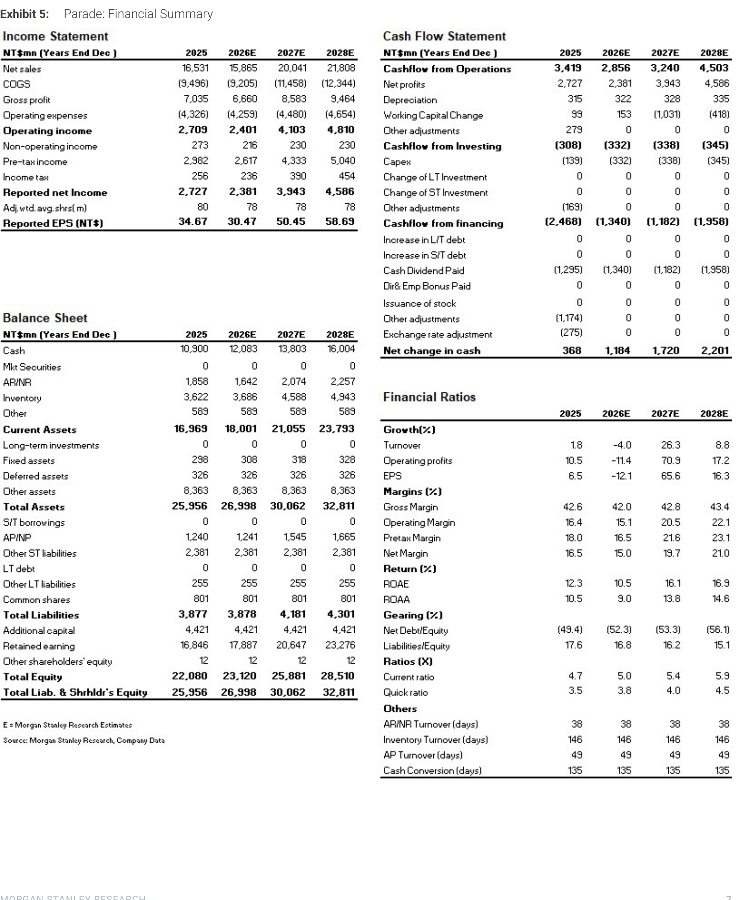

# MS｜PC Semis：需要新成長驅動力，升評 Parade 至 OW

**券商**：Morgan Stanley Taiwan Limited / Asia Limited  
**分析師**：Daniel Yen CFA、Charlie Chan、Daisy Dai CFA、Tiffany Yeh  
**日期**：2026-05-27  
**主題**：PC Semis 整體承壓，NB 優於 DT；Parade（4966）EW → OW，PT NT\$530 → NT\$1,000，因 chipset 份額轉移  
**評級**：Industry View Attractive  
<button type="button" onclick="fetch('https://ti-lei.github.io/foreign-reports/static/downloads/產業/MS_20260527_PC-Semis.md').then(r=>r.text()).then(t=>{let a=document.createElement('a');a.href='data:text/plain;charset=utf-8,'+encodeURIComponent(t);a.download='MS_20260527_PC-Semis.md';a.click()})">⬇ 下載 MD</button>

---

## MS 完整投資邏輯鏈

| 論點層次 | Exhibit | 內容 |
|---|---|---|
| 產業瓶頸確認 | 封面 | DT PC semis 持續承壓（記憶體漲價衝擊 ASMedia），NB semis 2H26 好於預期（Apple 訂單）；各公司 2H 能見度偏低 |
| 份額轉移信號 | 封面 | ASMedia → Parade 的 chipset 份額轉移趨勢明確，Parade 在功耗表現有明顯優勢，成為新成長驅動 |
| 估值修正 | 1、4 | Parade 2027/28E EPS 上修 +34%/+46%；MS 估計高於共識 16%/17%；目前 26x 2026E P/E 接近歷史 +1STD（26.4x） |
| 催化劑 | 封面 | Apple MacBook/iPad/iMac 出貨 + spec 升級（eDP T-Con）；next-gen server 高速介面擴展 |
| **結論** | 封面 | **Parade 升 OW，PT NT\$1,000（33x 2026E P/E），upside 63%；ASMedia EPS 低於共識 22%/30%** |

> **報告最大邏輯缺口**：Parade chipset 的份額增量尚無具體客戶承諾公開；若 CPU 供給不足造成 2027 NB 市場萎縮，高速介面擴充預估面臨下行風險。

---

## 報告核心觀點

| 主題 | MS 觀點 | 市場共識 | 是否 Contra-Consensus |
|---|---|---|---|
| PC semis 整體 | 承壓；NB > DT | 相同 | 否 |
| Parade 評等 | OW，PT NT\$1,000 | EW（71%）；PT NT\$520-611 | **是：升評+89% PT 上修** |
| Parade 2027E EPS | NT\$50.45（高於共識 16%） | NT\$37-43（估） | **是** |
| ASMedia | 謹慎；EPS 低於共識 22-30% | 偏保守 | 方向一致，幅度更負面 |

**偏好排序**：Parade（4966）> Novatek（DDI NB 仍正成長） > ASMedia（承壓）  
**個股重點**：Parade 報告聚焦，全部 5 個 Exhibit 均為 4966 財務數據

---

## Exhibit 1｜Parade 估計修正摘要

### 解讀摘要
MS 對 Parade 的 EPS 估計大幅上修，動力來自 chipset 市場份額增量假設的入帳——這是 Sep 2025 報告以來首次明確將份額轉移列入數字。2026E 上修幅度較小（EPS +3% 左右），但 2027-28E 上修幅度達 34-46%，反映 chipset 業務規模化需要 12-24 個月。MS 估計高於共識 16/17%，意味著市場仍在等待更多份額轉移的確認信號。

### 表格（NT\$ mn，e = MS Research 估計）

| 指標 | 2026E（現） | 2026E（前） | Diff | 2027E（現） | 2027E（前） | Diff | 2028E（現） | 2028E（前） | Diff |
|---|---|---|---|---|---|---|---|---|---|
| Net sales | 17,865 | 15,933 | +12% | 20,041 | 17,114 | +17% | 21,809 | 17,581 | +24% |
| Net income | — | — | — | 3,943 | 2,942 | **+34%** | 4,586 | 3,133 | **+46%** |
| Reported EPS (NT\$) | 30.47 | — | — | 50.45 | 37.18 | **+36%** | 58.69（估） | — | — |
| Gross margin | 43% | 43% | — | 45% | 43% | +2ppt | 43% | 39% | +4ppt |
| Operating margin | 14% | 15% | -1ppt | 20% | 17% | +3ppt | 22% | 18% | +4ppt |

*Exhibit 1 為 XObject 表格，部分數值從圖片讀取估算

> **洞察一**：2027/28E 毛利率上修 2-4ppt，表示 MS 認為 chipset 業務毛利高於現有 T-Con/Driver IC 組合——若 chipset GM% 接近高速介面的 50%+，整體混合毛利率有更大上行空間。

---

## Exhibit 2｜Parade 季度財報摘要

### 解讀摘要
季度資料顯示 Parade 在 2025 全年 EPS 達到 NT\$34.07，2026 下滑至 NT\$30.47（受 DT PC semis 及記憶體漲價拖累），2027 大幅反彈至 NT\$50.45。毛利率軌跡顯示 2026 為谷底（~42%），2027 回升至 ~45%，驅動力為高毛利的高速介面及 chipset 業務佔比提升。

### 關鍵年度數據

| 指標 | 2025A | 2026E | 2027E | 2028E |
|---|---|---|---|---|
| Total Revenue (NT\$ mn) | 16,531 | 17,865 | 20,041 | 21,809 |
| YoY | — | +8% | +12% | +9% |
| Gross Margin | ~42% | ~43% | ~45% | ~43% |
| EPS (NT\$)（Reported） | 34.07 | 30.47 | 50.45 | ~58-59 |
| YoY EPS | — | -11% | **+66%** | +17% |

*Exhibit 2 為 XObject 表格，數值從圖片讀取

> **洞察二**：2026 EPS 較 2025 下滑 11%，但 2027 反彈 +66%——這種 V 型復甦形態（配合份額轉移預期）通常是高市場分歧的切入點，市場共識估計保守（2027E ~NT\$37-43）意味著有顯著的 estimate revision 機會。

---

## Exhibit 4｜Parade 歷史 P/E

### 解讀摘要
Parade 目前 P/E 約 26x（基於 2026E EPS NT\$30.47），接近歷史 +1 個標準差（26.4x），高於歷史平均 19.6x。MS 的論點是：chipset 業務為新的結構性成長驅動，justifies 維持 +1STD 的估值，而非均值回歸。PT NT\$1,000 = 33x 2026E P/E，高於歷史 +1STD，但 MS 認為此溢價合理。

### 歷史估值區間

| 指標 | 數值 |
|---|---|
| 歷史平均 P/E（2012-2026） | 19.6x |
| +1 標準差 | 26.4x |
| -1 標準差 | 12.9x |
| 目前 P/E（2026E） | 26x |
| MS PT 隱含 P/E（2026E） | 33x |
| Bull case P/E | 53x |

> **值得驗證**：MS PT 33x 高於歷史 +1STD（26.4x），建立在 chipset 業務轉型假設上。若 2027H1 沒有具體 chipset 份額轉移數據，市場很難接受高於 +1STD 的估值，股價可能維持在 NT\$800-900（26-30x 區間）而非 NT\$1,000+。

---

## Exhibit 3｜Parade RI 估值模型

（略——標準估值模型，關鍵假設：cost of equity 9.8%，中期成長率 11.9%，永續成長 4%，payout ratio 50%）

---

## Exhibit 5｜Parade 財務摘要

### 關鍵業務拆解（NT\$ mn）

| 業務線 | 2025A | 2026E | 2027E | 2028E | 方向 |
|---|---|---|---|---|---|
| T-Con（eDP/TCON） | 6,396 | 5,539 | 5,792 | 5,440 | 弱→微復甦 |
| 高速介面（High-speed IF） | 7,662 | 8,176 | 9,266 | 10,657 | 持續成長 |
| Driver IC | 1,980 | 1,290 | 1,066 | 745 | 持續下滑 |
| Touch IC | 546 | 860 | 817 | 731 | 微增後回落 |

> **洞察三（配合 Exhibit 1）**：高速介面業務從 2025 NT\$7,662mn 成長至 2028 NT\$10,657mn（+39%），且 chipset 業務將在此基礎上疊加。T-Con 持續衰退而 Driver IC 加速萎縮，Parade 的長期成長故事已完全轉移到高速介面＋chipset，而非傳統 PC 顯示相關業務。

---

## 相關個股清單

| 類別 | 公司 | Ticker | 評等 | 備註 |
|---|---|---|---|---|
| 升評 | Parade Technologies | 4966.TWO | OW（升） | PT NT\$1,000（33x 2026E P/E）；2027E EPS +34%，高於共識 16% |
| 謹慎 | ASMedia | 未明確覆蓋 | — | 承受 Parade 份額轉移壓力；EPS 低於共識 22-30% |
| 觀察 | Realtek | — | — | 2Q26 QoQ +10% 潛力；customer pull-in 持續 |
| 觀察 | Novatek | — | — | NB DDI 2Q26 +21% QoQ 中位數指引 |
| 觀察 | Elan | — | — | 2Q26 低個位數 YoY 成長 |

> **備註**：此報告核心為 Parade（4966）個股升評，產業分析為背景鋪陳，建議附加摘要至 [[4966_譜瑞]]（外資報告整理卡）
