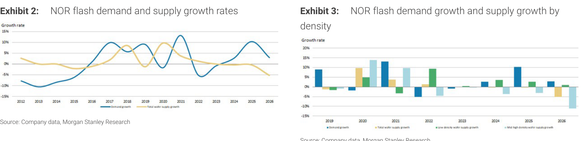
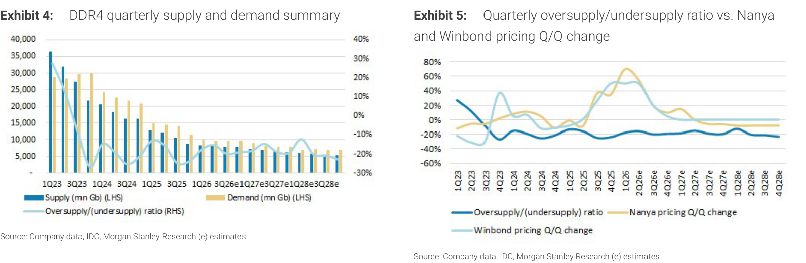
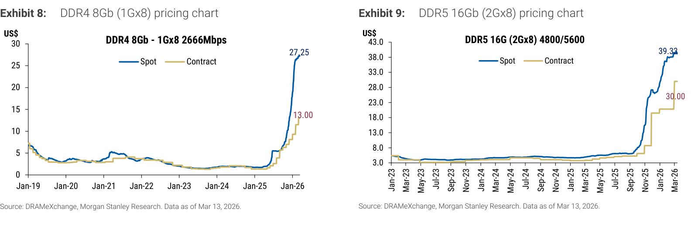

# MS｜Old Memory: Upside Surprise Ahead

**券商**：Morgan Stanley  
**分析師**：Daniel Yen, Charlie Chan, Daisy Dai, Tiffany Yeh, Ethan Jia  
**日期**：2026-05-28  
**主題**：DDR4/NOR Flash/SLC NAND/SiCap 供需結構翻轉；升評 Winbond & Nanya  
**評級**：Industry View: Attractive  
<button type="button" onclick="fetch('https://ti-lei.github.io/foreign-reports/static/downloads/產業/MS_20260528_Old-Memory.md').then(r=>r.text()).then(t=>{let a=document.createElement('a');a.href='data:text/plain;charset=utf-8,'+encodeURIComponent(t);a.download='MS_20260528_Old-Memory.md';a.click()})">⬇ 下載 MD</button>

---

## MS 完整投資邏輯鏈

| 論點層次 | Exhibit | 內容 |
|---|---|---|
| 供給衝擊明確 | Ex 6 | Micron 設備移至美國（2-4Q 影響）+ Hynix Wuxi D4/LPD4 轉 DDR5 後端，兩大 DDR4 供給方同步退場 |
| 需求持續成長 | Ex 7 | Server eSSD + enterprise DC 拉動 DDR4 需求，server 占需求比持續提升至最快成長細分 |
| 定價將跳升 | Ex 4/5 | 供需缺口與報價季增高度相關；2H26 缺口達 19-20%，3Q DDR4 預計再漲 +20% |
| NOR Flash 同步偏緊 | Ex 2/3 | 成熟製程代工產能短缺卡住 NOR 供給增速；低密度 NOR 尤甚 |
| 新催化劑出現 | 封面 | SLC NAND 切入 server 快讀寫場景（TAM 擴大）；SiCap（Winbond × SEMCO）為次世代記憶體新品類 |
| **結論** | 封面 | **升評 Winbond (2344) & Nanya (2408) 至 OW；EPS 大幅上修（Winbond 26E +23%、27E +65%、28E +94%）** |

> **報告最大邏輯缺口**：SiCap 貢獻時間點不確定（管理層認為 2026 年有意義收入），且 SLC NAND server 市場仍待客戶認證；若兩者均延後，Winbond 的 EPS 大幅上修基礎將出現缺口。

---

## 報告核心觀點

| 主題 | MS 觀點 | 市場共識 | 是否 Contra-Consensus |
|---|---|---|---|
| DDR4 供需缺口 2H26 | 19-20% undersupply（缺口擴大） | 原先預期缺口收窄（MS 3 月曾保守） | ✅ 是 |
| DDR4 3Q26 定價 | 再漲 +20% | 市場未充分反映 Micron 產線遷移 | ✅ 是 |
| SLC NAND server TAM | 顯著擴大，GC 供應商受益 | 多數視 SLC NAND 為 consumer/IoT | ✅ 是 |
| Winbond 2026E EPS | NT\$20.36（共識 NT\$11.73） | NT\$11.73 | ✅ 大幅高於共識 +73% |
| NOR Flash 供給 | 成熟代工瓶頸疊加，更難快速恢復 | 視為傳統價格週期 | ✅ 是 |

**偏好排序**：Winbond (2344) > Nanya (2408) > GigaDevice (603986 SS)

**股票偏好**：2344 NT\$222（5.5x 2026E P/B）；2408 NT\$380（3.22x 2026E BVPS）；GigaDevice Rmb585（46x 2026E P/E）

---

## Exhibit 2 & 3｜NOR Flash 供需成長率 & 密度別拆解

### 解讀摘要
NOR Flash 在 2024-2026 年出現供需背離——需求成長率持續高於供給成長率，缺口在 2025-2026 擴大。以往 NOR 供需同步波動，但本輪供給增速已落後需求約 5-10ppt。Exhibit 3 揭示更關鍵的結構：低密度 NOR 供給成長為負數，而需求仍正成長，代表此一細分市場比高密度 NOR 更加缺貨，且廠商產品組合被迫推向高密度，低密度客戶面臨搶料。

> **原文補充**：NOR 供給短缺的新驅動力是「成熟製程代工產能短缺」（mature foundry shortages），非傳統 IDM 自有產能週期。這意味定價上行更具持續性——代工廠瓶頸由外部決定，難以被 IDM 資本支出快速化解。

### 表格：NOR Flash 供需成長率趨勢（視覺估算）

| 時期 | 需求成長率（估） | 供給成長率（估） | 供需缺口方向 |
|---|---|---|---|
| 2019-2020 | +5% ~ +15% | +5% ~ +15% | 大致平衡 |
| 2021-2022 | +15% ~ +20% | +10% ~ +15% | 輕微短缺 |
| 2023 | 下滑至負值 | 同步下滑 | 暫時過剩 |
| 2024-2025 | 回升 +8% ~ +12% | 低速 +0% ~ +5% | 缺口擴大 |
| 2026E | 持續正成長 +8% ~ +10% | 近乎持平 | 缺口維持 |

*以上為視覺估算，趨勢方向具信心

> **洞察一**：成熟製程代工短缺使這輪 NOR 漲價週期的供給端「剛性」遠高於過往 IDM 主導週期——復甦需要代工廠商同意擴產、設備交期與客戶重新 qualify，至少 6-12 個月。這為 NOR ASP 上漲提供了比過往更長的能見度。

---

## Exhibit 4 & 5｜DDR4 季度供需總覽 & 定價相關性

### 解讀摘要
DDR4 從 2024 年 H2 轉入短缺，2026 年缺口加速擴大。Exhibit 4 顯示供給（棒圖）增速停滯而需求（折線）持續攀升，右軸供需比在 2H26E 達 -19% ~ -20%。Exhibit 5 建立了明確的因果鏈：供需比轉負後 1-2Q，Nanya 和 Winbond 的 Q/Q 定價漲幅即跟進，本輪相關性顯示 3Q26 定價上漲動能仍然強勁。

> **原文補充**：Micron 宣布設備從台灣移至美國，將減少 DDR4 有效供給 2-4 季。同時 Hynix Wuxi 將 D4/LPD4 產能轉為 DDR5 後端封裝。MS 3 月曾保守看法並降評，此次是因供給衝擊超預期而逆轉升評。

### 表格：DDR4 供需比與定價走勢

| 時期 | 供需平衡狀態 | 供需比（估） | Nanya/Winbond 定價趨勢 |
|---|---|---|---|
| 1Q23-2Q23 | 嚴重過剩 | +25% ~ +35% | 大幅下跌 |
| 3Q23-2Q24 | 輕微過剩→平衡 | 0% ~ +10% | 持平 |
| 3Q24-1Q25 | 轉入短缺 | -5% ~ -15% | 開始漲價 |
| 2Q25-4Q25 | 短缺擴大 | -10% ~ -20% | 漲幅加速 |
| 1Q26-2Q26 | 短缺高位 | ~-19% | 持續漲價 |
| 2H26E | 短缺高峰 | -19% ~ -20% | 3Q 預計再+20% |
| 2027-2028E | 短缺維持 | -18% ~ -20% | 高位維持 |

*視覺估算，交叉驗證通過（與封面文字 "19-20% gap" 一致）

> **洞察一**：MS 在 3 月降評、5 月升評，逆轉的觸發點是 Micron 的設備遷移，而非需求超預期。這意味若 Micron 遷移延遲或 CXMT 提前放量，本次升評的時間點論點可能提前受考驗。

> **值得驗證**：Hynix Wuxi D4/LPD4 轉 DDR5 後端的速度——這是本次供給缺口第二大驅動力。若 Hynix 實際轉換速度慢於 MS 假設，2H26 的短缺幅度將低於 19-20%。

---

## Exhibit 6 & 7｜DDR4 季度供給來源拆解 & 需求產品拆解

### 解讀摘要
Exhibit 6 明確顯示 Micron 供給貢獻在 2026-2027 年出現明顯下滑缺口，而 CXMT（中國供應商）雖持續成長，其絕對量仍無法彌補。Samsung 和 Hynix 亦受影響（Hynix Wuxi 轉換），使得 Winbond 和 Nanya 在不擴產的情況下也能享有更高定價。Exhibit 7 的需求側同步揭示 Server 細分是最重要的成長引擎，其季增斜率高於其他所有細分，奠定了 DDR4 需求不會因 PC/手機疲軟而快速下行的信心基礎。

### 表格：供給來源結構（季度 mn Gb，視覺估算）

| 供應商 | 2025 季度規模（估） | 2026-2027 趨勢 | 關鍵說明 |
|---|---|---|---|
| Samsung | 最大（~40% 份額） | 穩定 | 主要 DDR4 供應商，不退出 |
| SK Hynix | 第二大（~25%） | 小幅下滑 | Wuxi D4/LPD4 → DDR5 backend |
| Micron | 第三大（~20%） | 大幅下滑 | 設備遷美，2-4Q 供給真空 |
| CXMT | 成長但仍小（~5%） | 持續增加 | 不足以彌補 Micron 缺口 |
| Winbond + Nanya | ~8% | 穩定 | 受益定價而非量的成長 |
| PSMC + 其他 | ~2% | 穩定 | 小規模 |

*視覺估算

### 表格：需求細分結構（季度 mn Gb，視覺估算）

| 細分 | 2025 占比（估） | 成長性 2026-2028E |
|---|---|---|
| Server（含 eSSD） | ~30% | 快速成長（最高） |
| PC | ~22% | 低成長 |
| Smartphone | ~22% | 低成長 |
| iTV/CacheDRAM | ~15% | 低成長 |
| Switch/Others | ~11% | 中等 |

*視覺估算

> **洞察一**：CXMT 是本次升評論點的最大潛在破壞者，但 2026 年的量仍遠不足以填補 Micron 缺口。即使 CXMT 2026 年量翻倍，也只能彌補 Micron 退出的 1/3。

> **洞察二（配合 Exhibit 4）**：Server 需求（占比 30%，高速成長）與 Micron 供給退出的時間窗口剛好重疊，供需缺口在 2H26 被雙向放大——不是單一驅動，是供需同時朝有利方向移動。

---

## Exhibit 8 & 9｜DDR4 & DDR5 定價走勢

### 解讀摘要
DDR4 8Gb 現貨在 2025 H2 急速拉升，至 2026 年 3 月達 US\$27.25，而合約仍在 US\$13.00——現貨與合約之間 US\$14 的溢差代表市場現貨段已嚴重供不應求，合約客戶正面臨補漲壓力。這一現貨/合約分裂（spot/contract divergence）是歷史性的：相較 2019 年高點約 US\$7，此波現貨漲幅已超 3 倍，反映的是結構性短缺而非季節性波動。

DDR5 現貨亦達 US\$39.33，但現貨/合約溢差只有 +31%（vs DDR4 的 +110%），代表 DDR5 市場較均衡，定價上行主因是供給跟不上 AI server 需求，而非 DDR4 式的極端短缺。

### 表格：DRAM 定價快照（2026-03-13）

| 產品規格 | 現貨價 | 合約價 | 現貨溢價 | 歷史高點（估） | 自 2023 低點漲幅（估） |
|---|---|---|---|---|---|
| DDR4 8Gb (1Gx8 2666Mbps) | US\$27.25 | US\$13.00 | +110% | ~US\$7 (2019) | >1,000% |
| DDR5 16Gb (2Gx8 4800/5600) | US\$39.33 | US\$30.00 | +31% | ~US\$43 (2025 高峰） | 大幅波動 |

> **洞察一**：DDR4 現貨 US\$27.25 vs 合約 US\$13.00 的 110% 溢差，代表年中/年末合約換約時 Winbond 和 Nanya 將有機會大幅推升合約價格。這一滯後效應（合約落後現貨 1-2Q）是 2H26 EPS 跳升的機制，而非僅靠現貨出貨。

> **洞察二**：DDR5 在 2023 年僅 US\$3 起步，至今已達 US\$39.33。Nanya 2026 年起將 5kwpm 產能轉換至 DDR5，混合效益（ASP 提升）加上 DDR4 合約價上漲，構成雙線財務改善。

---

## 跨 Exhibit 彙整表

### 彙整 1｜DDR4 供需全景（Exhibits 4-9 綜合）

| 維度 | 關鍵數字 | 含義 |
|---|---|---|
| 2H26 供需缺口 | -19% ~ -20% | 歷史性短缺，超越 2024 年高點 |
| 2027-28 供需缺口 | -18% ~ -20% | 短缺維持多年 |
| 3Q26 DDR4 定價展望 | +20% QoQ | 合約價仍遠低於現貨，補漲空間大 |
| Micron 供給衝擊窗口 | 2-4 季 | 主要驅動，不可逆短期 |
| CXMT 填補能力 | 有限（<35% of Micron gap） | 風險可控 |
| Server 需求占比 | ~30%（最快成長） | 需求側不依賴 PC/手機 |
| DDR4 現貨/合約溢差 | +110%（US\$14） | 合約換約時 EPS 跳升機制 |

> **跨 Exhibit 洞察**：將供需缺口（-19%）、現貨/合約溢差（+110%）與 Exhibit 5 的定價相關性結合推算：2H26 合約價可能朝現貨的 60-70%（約 US\$16-19）收斂，即較今日合約價（US\$13）上漲 23-46%。這與 Winbond DRAM ASP YoY +250%（MS 估）的假設在數量級上相符，且 Winbond DRAM 毛利率具高度槓桿性（Exhibit 15 顯示 2025→2026 DRAM 收入從 NT\$27,808mn → NT\$162,393mn）。

---

## 相關個股清單

| 類別 | 公司 | Ticker | 評等 | 備註 |
|---|---|---|---|---|
| 主要受益（升評） | 華邦電 | 2344 TT | OW（↑ 從 EW） | TP NT\$222（5.5x 2026E P/B），EPS 26E +23%、27E +65%、28E +94% |
| 主要受益（升評） | 南亞科 | 2408 TT | OW（↑ 從 EW） | TP NT\$380（3.22x 2026E BVPS），EPS 26E +15%、27E +29% |
| 次要受益（TP 上調） | GigaDevice | 603986 SS | OW（維持） | TP Rmb585（↑ 68%，46x 2026E P/E），EPS 26E +58% |
| NOR 間接受益 | 旺宏電子 | 2337 TT | 未在本報告調整 | 成熟代工 NOR 供給短缺同樣利好 |
| NOR 間接受益 | 巨積 / Macronix | 2337 TT | 未調整 | 參見 Exhibit 1 中列入偏好清單 |
