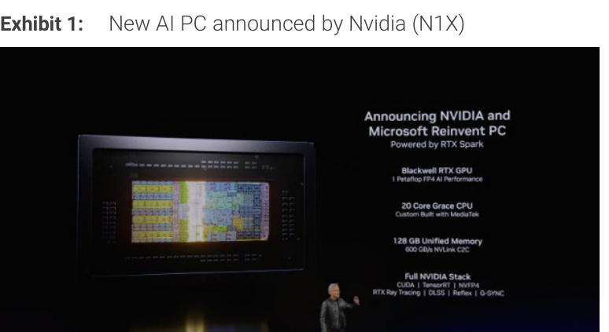
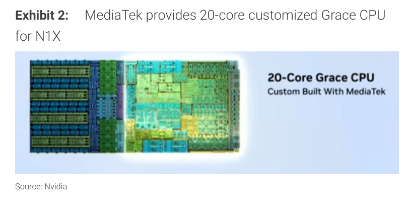
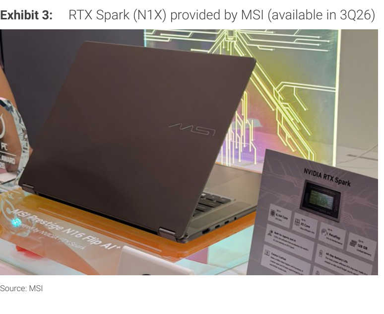
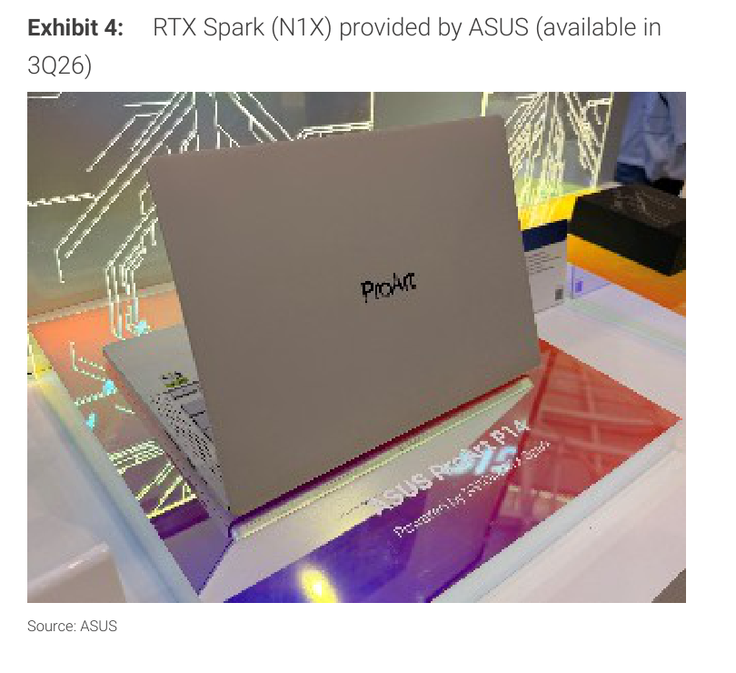
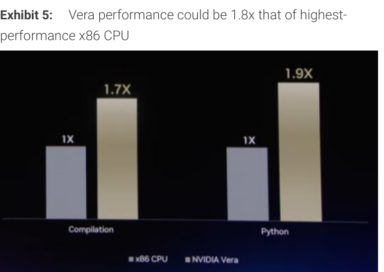
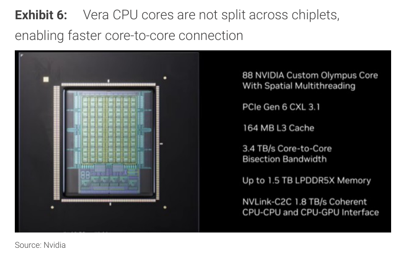

# MS｜Key Computex Takeaways：Agentic AI、TSMC 產能與 MediaTek AI PC

**券商**：Morgan Stanley  
**分析師**：Charlie Chan、Daniel Yen CFA、Daisy Dai CFA、Tiffany Yeh、Lucas Wang、Ethan Jia  
**日期**：2026-06-02  
**主題**：Computex Day 1 現場筆記：Agentic AI、Vera CPU 產能確認與 RTX Sparks 量化  
**評級**：Attractive（Greater China Technology Semiconductors）  
<a href="/dl?g=產業&b=MS&d=20260602&h=Key-Computex-Takeaways">📎 下載 PDF</a>

---

## MS 完整投資邏輯鏈

| 論點層次 | Exhibit | 內容 |
|---|---|---|
| 需求信號明確 | 封面 | Nvidia、Arm、Qualcomm 三家 Computex 主題演講一致聚焦 Arm-based server CPU，Agentic AI 邊緣算力趨勢確立 |
| 產能瓶頸解除 | 封面 | Nvidia 確認 2027 年 TSMC 產能充足，可支撐強勁成長；即使供給擴張，2027 需求仍預期超過供給 |
| 新品量化可見 | Exhibit 5、封面 | Vera CPU 供應鏈備貨 250–400 萬顆；RTX Sparks（N1X）估 2026 出貨 500–800 萬顆，貢獻 MediaTek EPS 5–10% |
| 供應鏈受益排序清晰 | Exhibit 6 | 台灣半導體橫跨 GPU/CPU/CPO/AI PC 四條新品線，TSMC、KYEC、ASE、Aspeed、MediaTek、聯電等各有定位 |
| **結論** | 報告封面 | **維持 Greater China Semis Attractive；Vera CPU/RTX Sparks 形成 2026–27 年量價雙輪驅動** |

> **報告最大邏輯缺口**：Vera CPU US\$20bn 收入假設的具體時程（2026 還是 2027）未明確；250–400 萬顆量與此金額隱含 ASP 達 US\$5,000–8,000，是否已計入記憶體未說明。

---

## 報告核心觀點

| 主題 | MS 觀點 | 市場共識 | 是否 Contra-Consensus |
|---|---|---|---|
| TSMC 2027 產能 | 充足，需求仍超供給 | 市場擔憂 Nvidia 之外客戶搶產能 | 是：Nvidia 明確表示已確保分配 |
| RTX Sparks 量 | 2026 出貨 500–800 萬顆，貢獻 MediaTek EPS 5–10% | 市場尚在摸索 N1X 量產時程 | 是：MS 早在 9 個月前已預測並設定具體 ASP/royalty 假設 |
| Vera CPU 進度 | 已入台積電 fab，無明顯延誤 | Rubin/Vera 時程存疑 | 是：確認進度符合預期 |
| CPO vs 銅纜 | Nvidia 僅在必要時採用 CPO，優先銅纜 | 市場預期 CPO 快速滲透 | 是：短期銅纜優先，CPO 時程更長 |

**偏好排序**：GPU（TSMC、ASE、KYEC、AllRing） > CPU（KYEC、Aspeed） > AI PC（MediaTek、Macronix） > CPO（長期）

---

## Exhibit 1｜New AI PC announced by Nvidia (N1X)

### 解讀摘要

RTX Sparks（N1X）是 Nvidia 首次以 AI PC SoC 形式切入 Windows on Arm 市場，聯合 Nvidia（Blackwell RTX GPU）與 MediaTek（20-core Grace CPU）的設計分工意味著兩者互相鎖定、共享量產命運。128 GB Unified Memory 透過 600 GB/s NVLink-C2C 連接 CPU 與 GPU，是一體機架構下記憶體頻寬大幅優於傳統 x86 離散方案的關鍵。

### 規格摘要

| 項目 | 規格 |
|---|---|
| GPU | Blackwell RTX（1 Petaflop FP4） |
| CPU | 20-Core Grace（MediaTek 定製） |
| Unified Memory | 128 GB |
| 記憶體頻寬 | 600 GB/s（NVLink-C2C） |
| 軟體棧 | CUDA / TensorRT / NVFP4 / RTX Ray Tracing / DLSS / Reflex / G-Sync |

> **洞察一**：128 GB Unified Memory 是整機唯一的記憶體池，代表 NOR Flash（Macronix）等外部快閃儲存需求實際上是互補而非替代關係——AI 模型權重在統一記憶體，開機碼與韌體仍走 NOR Flash，這也是 Macronix 受益的機制。

---

## Exhibit 2｜MediaTek 提供 20-core Grace CPU for N1X

### 解讀摘要

N1X 的 Grace CPU 由 MediaTek 定製，而非 Nvidia 自製，這代表 MediaTek 取得的不是晶片代工利潤，而是完整的 SoC 設計與 IP 授權費用（MS 估每顆 royalty 約 US\$40）。此 die shot 顯示這是一顆設計複雜度較高的多核 CPU，而非 MediaTek 既有手機 AP 的改裝版本。

> **原文補充**：MS 在 9 個月前即已預測 Nvidia/MediaTek WoA AI PC，並指出發布時程從 CES 延至 Computex（6 月），以配合 Microsoft 新 AI Windows 系統在 2H26 的推出節奏。

---

## Exhibit 3｜RTX Spark (N1X) — MSI 版（3Q26 上市）

### 解讀摘要

MSI 是首批推出 RTX Sparks 機型的 OEM 之一，3Q26 上市確認量產時程已定。MS 預估全年 N1X/N1 出貨 500–800 萬顆，MSI 等品牌在 Computex 現場展示的具體機型佐證了這一供應鏈備貨節奏並不超前。

---

## Exhibit 4｜RTX Spark (N1X) — ASUS 版（3Q26 上市）

### 解讀摘要

ASUS 同樣在 Computex 現場展示 RTX Sparks 機型，3Q26 上市。主流 OEM（MSI、ASUS）同步入場代表 N1X 並非單一品牌特殊合作，而是一個真正走向量產的平台。

---

## Exhibit 5｜Vera 效能達 x86 最高規格的 1.8x

### 解讀摘要

Vera CPU 在 Compilation 達 x86 的 1.7x、Python 達 1.9x（平均約 1.8x），Nvidia 依此主張可對 Vera 訂定顯著溢價。考慮到伺服器 CPU 的 TCO 採購邏輯（效能/瓦特與效能/核心），若此效能數字可由客戶獨立驗證，則 Vera 的定價空間是真實的——但目前數字來源為 Nvidia 官方 Computex 簡報，有選擇性呈現風險。

### 效能對比

| 指標 | x86 CPU | NVIDIA Vera | 倍數 |
|---|---|---|---|
| Compilation | 1x（基準） | 1.7x | 1.7x |
| Python | 1x（基準） | 1.9x | 1.9x |

> **值得驗證**：此效能數字來自 Nvidia Computex 簡報，測試場景選擇性不明。若在通用伺服器工作負載下 Vera 優勢縮減至 1.2–1.3x，則 US\$5,000+ 的隱含 ASP 溢價將難以說服保守型企業採購。

> **洞察二**：Vera 的效能溢價讓 Nvidia 得以主張不只是 GPU 廠商，而是要切入 US\$30bn+ 的伺服器 CPU 市場（目前由 Intel/AMD 主導）。即使奪取 10% 市占，Vera 本身即可成為一條獨立的收入線，與 GPU 互補而非取代。

---

## Exhibit 6｜Vera CPU 核心不跨 chiplet 分拆，實現更快 core-to-core 連接

### 解讀摘要

Vera 使用 88 個 Olympus core 的單晶片設計（而非跨 chiplet 分拆），3.4 TB/s 的 Core-to-Core 頻寬解決了 Intel Xeon / AMD EPYC 在多 chiplet 架構下的 NUMA latency 問題。這在 AI 推論中特別重要，因為 token 生成需要高頻率的 KV-cache 存取。供應鏈受益者以 KYEC（測試）和 TSMC（先進製程）為主。

### Vera CPU 規格

| 規格項目 | 值 |
|---|---|
| 核心 | 88 NVIDIA Custom Olympus Core（Spatial Multithreading） |
| PCIe / CXL | Gen 6 CXL 3.1 |
| L3 Cache | 164 MB |
| Core-to-Core 頻寬 | 3.4 TB/s Bisection Bandwidth |
| 記憶體 | 最高 1.5 TB LPDDR5X |
| CPU-GPU 介面 | NVLink-C2C 1.8 TB/s（Coherent CPU-CPU and CPU-GPU） |

> **洞察三（配合 Exhibit 5）**：單晶片 88-core 設計 + 3.4 TB/s core-to-core 頻寬，意味著測試難度遠高於現有 x86。KYEC 是 MS 點名的 Vera CPU 測試廠，此規格複雜度支撐其 ASP 提升論點。

---

## 大中華半導體供應鏈對照表

| 產品線 | 台灣供應商 | 角色 |
|---|---|---|
| Nvidia AI GPU | TSMC | 晶圓代工 |
| Nvidia AI GPU | ASE | 封裝 |
| Nvidia AI GPU | KYEC | 測試 |
| Nvidia AI GPU | AllRing | 設備 |
| CPO 光學模組 | FOCI | FAU |
| CPO 光學模組 | Himax | WLO |
| CPO 光學模組 | ASE | 光學插入測試 |
| CPO 光學模組 | Hon Precision（7769） | 光學插入工具 |
| Vera CPU | KYEC | 測試（含 Google CPU） |
| Vera CPU | Aspeed（5274） | 伺服器 BMC |
| WoA AI PC | MediaTek（2454） | N1X / N1 SoC |
| WoA AI PC | Macronix（2337） | NOR Flash |

---

## 相關個股清單

| 類別 | 公司 | Ticker | 評等 | 備註 |
|---|---|---|---|---|
| Foundry | 台積電 | 2330 | OW | Vera + Rubin 主要代工方 |
| Packaging | 日月光 | 3711 | OW | GPU 封裝 + CPO 光學測試 |
| Testing | 京元電 | 2449 | OW | Vera CPU + Google CPU 測試 |
| Equipment | AllRing | — | — | AI GPU 設備 |
| BMC | 信驊 | 5274 | OW | Vera 伺服器 BMC |
| AI PC SoC | 聯發科 | 2454 | OW | N1X/N1，估 5–10% EPS 貢獻 |
| NOR Flash | 旺宏 | 2337 | EW | AI PC NOR Flash |
| CPO | FOCI | — | — | FAU 元件 |
| CPO | 奇景 | — | — | WLO 元件 |
| CPO | 鴻勁 | 7769 | OW | 光學插入工具 |
