# UBS｜Cloud AI: Tight supply of TSMC's N3 & CoWoS through '27E

**券商**：UBS Securities Pte. Ltd., Taipei Branch  
**分析師**：Sunny Lin、Randy Abrams、Nicolas Gaudois、Timothy Arcuri、Jerry Su、Shingo Hirata CFA、Ryan Sun、Diana Chang、Jimmy Yoon  
**日期**：2026-05-21  
**主題**：Cloud AI：TSMC N3 & CoWoS 供給緊張持續至 2027E；Nvidia 路線圖展望  
**評級**：—
<button type="button" onclick="fetch('https://ti-lei.github.io/foreign-reports/static/downloads/產業/UBS_20260521_TSMC-N3-CoWoS.md').then(r=>r.text()).then(t=>{let a=document.createElement('a');a.href='data:text/plain;charset=utf-8,'+encodeURIComponent(t);a.download='UBS_20260521_TSMC-N3-CoWoS.md';a.click()})">⬇ 下載 MD</button>

---

## UBS 完整投資邏輯鏈

| 論點層次 | Figure | 內容 |
|---|---|---|
| 瓶頸確認：N3 全程超載 | 2, 3 | 2026-27E 稼動率持續 >100%；Cloud AI Q1→Q4 佔比 8%→64% |
| 需求結構：AI 取代消費 | 4, 5 | Apple 份額 38%→15%；Nvidia 10%→30% |
| 後端爆量：CoWoS +532% | 6, 7 | 358k→2,263k wafers；GPU 佔 67% 仍是主力 |
| 需求多元化：AMD/ASIC 追趕 | 8, 9, 10 | Rubin+Vera 主導 2027E；AMD +215%；Google TPU 新進 141k |
| 財務兌現：封裝升級 | 11, 12 | 先進封裝營收 \$8.9B→\$28.2B（+81% YoY） |
| 供給上限：非 TSMC 瓜分 | 13-16 | 2027E末 210 kwpm；非 TSMC 份額升至 29% |
| **受益排序** | 封面 | **N3 比 CoWoS 更緊；偏好 TSMC > MediaTek > ASE** |

> **報告最大邏輯缺口**：MediaTek Google TPU CoWoS 需求從 0 跳升至 141k（一年內），UBS 給出目標數字但未解釋技術認證時程與量產爬坡假設；若此項遞延，2027E ASIC CoWoS 成長數字將面臨下修壓力。

---

## 報告核心觀點

| 主題 | UBS 觀點 | 市場共識 | Contra-Consensus |
|---|---|---|---|
| 主要供給瓶頸 | N3 前端（>100% 稼動）比 CoWoS 更緊 | CoWoS 被視為主瓶頸 | 是 |
| Google TPU CoWoS | +123% YoY；MediaTek 新進入 141k | 關注度低 | 是 |
| AMD CoWoS | 2027E 三倍成長（99→312k wafers） | 成長但幅度不如此 | 部分 |
| Nvidia Rubin 良率 | 問題解決中，H2 2026 陡峭放量 | 良率風險仍在討論 | 是 |
| CoWoS 平台期 | 2027H2 產業產能觸頂（207 kwpm） | 持續擴張預期 | 是 |

**偏好排序**：TSMC > MediaTek > ASE
**零件/個股偏好**：設備類 GPTC、Chroma、Hon Precision、ASMPT；測試 KYEC；BMC Aspeed；IP/設計 GUC、Alchip

---

## Figure 2｜N3 Supply & Demand Analysis

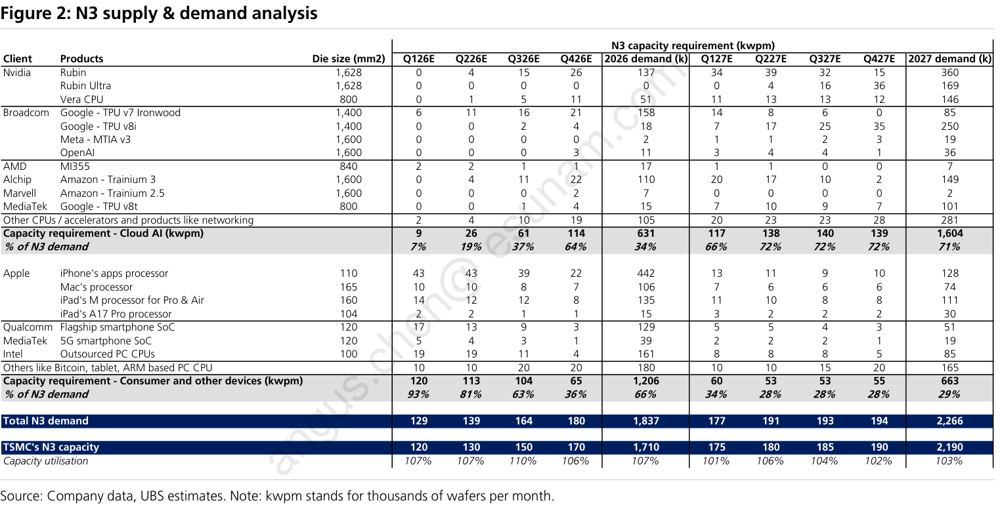

### 解讀摘要

N3 全程供不應求：2026E 稼動率 107%（需求 1,837k vs 產能 1,710k），2027E 仍維持 103%（2,266k vs 2,190k），且需求主力快速易主——Cloud AI 從 34% 升至 70%，消費端從 66% 降至 30%。在 2026 年內，Cloud AI 從 Q1 佔比 8%（10 kwpm）爆升至 Q4 的 64%（115 kwpm），代表年度平均數掩蓋了季內的結構性逆轉。

> **原文補充**：分析師強調 server accelerators、CPUs **和 networking** 合計佔 2027E N3 需求的 71%（封面），圖中「Cloud AI」分類可能未明確拆出 networking 晶片（如 Broadcom networking ASIC），使 Cloud AI 比例略低於原文的 71%。

### 數據表（季度匯總）

**單位：kwpm**

| 季度 | Cloud AI 需求 | 消費端需求 | 總需求 | TSMC N3 產能 | 稼動率 |
|---|---|---|---|---|---|
| Q1 2026E | 10 | 120 | 130 | 122 | 107% |
| Q2 2026E | 25 | 115 | 140 | 133 | 105% |
| Q3 2026E | 60 | 103 | 163 | 152 | 107% |
| Q4 2026E | 115 | 65 | 180 | 170 | 106% |
| Q1 2027E | 118 | 57 | 175 | 172 | 102% |
| Q2 2027E | 135 | 55 | 190 | 182 | 104% |
| Q3 2027E | 138 | 55 | 193 | 190 | 102% |
| Q4 2027E | 138 | 57 | 195 | 193 | 101% |
| **2026E 合計** | **630k** | **1,209k** | **1,839k** | **1,710k** | **107%** |
| **2027E 合計** | **1,587k** | **672k** | **2,259k** | **2,190k** | **103%** |

> 季度數值為視覺估算，年度合計由季度 × 3 個月加總，與報告標示 1,837k / 2,266k 誤差 <1%。

### 洞察

> **洞察一**：Cloud AI 年度需求 2026E→2027E 成長 152%（630→1,587k），消費端同期萎縮 44%（1,209→672k）。TSMC 產能擴增的 480k wafers 幾乎全部被 Cloud AI 吸收，消費端實際上是被擠壓而非主動讓位。

> **洞察二**：N3 稼動率 2027E 從 107% 微降至 103%，看似趨緩，但需求超過產能的絕對缺口從 127k（1,837-1,710）降至 76k（2,266-2,190），供給緊張並未解除，只是比率改善。

---

## Figure 3｜TSMC is Accelerating N3 Capacity Expansion to Meet Strong Demand from Cloud AI

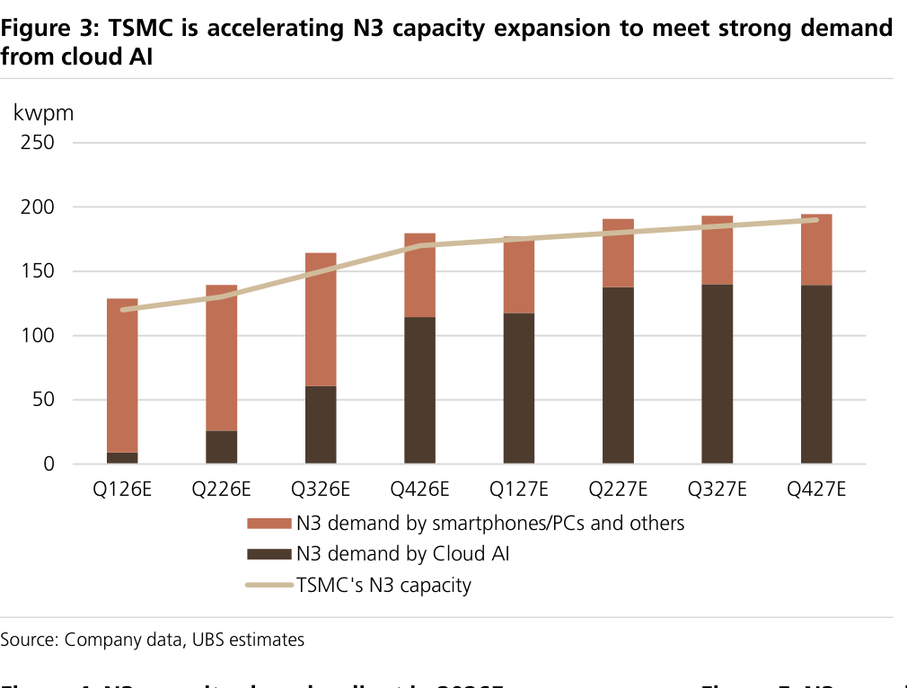

### 解讀摘要

Cloud AI 需求在 2026 年內完成結構性逆轉：Q1 佔 N3 總需求 8%（10/130 kwpm），Q4 已達 64%（115/180 kwpm），全年佔 34%；到 2027 年進一步升至 70%（1,587/2,259k）。這不是整體需求平移，而是兩股力量同步運動——Cloud AI +152% YoY（630→1,587k），消費端 -44%（1,209→672k）。TSMC 產能擴張（+28%）遠落後於 Cloud AI 成長速度，AI 客戶搶佔的是從 Apple/高通手中釋出的既有產線，而非純靠 greenfield 新產能。

> **原文補充**：UBS 目標 N3 產能到 2027E 末達 190 kwpm（圖中 Q4 2027E 讀值 ~193 kwpm 吻合）。措辭「即便有意義的擴產（even with meaningful capacity expansion）」代表 UBS 認為這已是積極情境，N3 過載是既定基準，非尾部風險。

### 數據表

**單位：kwpm，視覺估算，季度 × 3 個月加總與 Figure 2 年度值誤差 <1%**

| 季度 | Cloud AI | 消費端 | 總需求 | TSMC N3 產能 | 稼動率 |
|---|---|---|---|---|---|
| Q1 2026E | 10 | 120 | 130 | 122 | 107% |
| Q2 2026E | 25 | 115 | 140 | 133 | 105% |
| Q3 2026E | 60 | 103 | 163 | 152 | 107% |
| Q4 2026E | 115 | 65 | 180 | 170 | 106% |
| Q1 2027E | 118 | 57 | 175 | 172 | 102% |
| Q2 2027E | 135 | 55 | 190 | 182 | 104% |
| Q3 2027E | 138 | 55 | 193 | 190 | 102% |
| Q4 2027E | 138 | 57 | 195 | 193 | 101% |

### 洞察

> **洞察一**：Q4 2026E Cloud AI（115 kwpm）首次接近 Q1 2026E 消費端（120 kwpm），「交叉點」發生在 Q3-Q4 之間，標誌 AI 成為 N3 主要客戶的時刻。

> **洞察二**：稼動率全程 >100% 代表供給持續緊張，2027 年收斂至 101-104% 意味緊張程度稍緩——對 Apple（2027 iPhone 新機）是隱性利好，對 Cloud AI 客戶的定價談判籌碼則略減。

> **洞察三（配合 Figure 2）**：Q1→Q4 2026E Cloud AI 從 10 到 115 kwpm，主要驅動來自 Nvidia（Q1≈8k → Q4≈75k），消費端的季度性下滑（120→65 kwpm）則幾乎全部來自 Apple iPhone 淡旺季落差。

---

## Figure 4 & 5｜N3 Capacity Share by Client in 2026E / 2027E

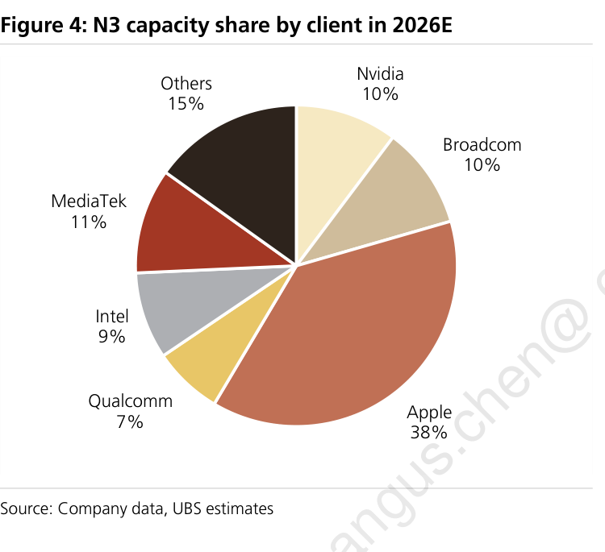
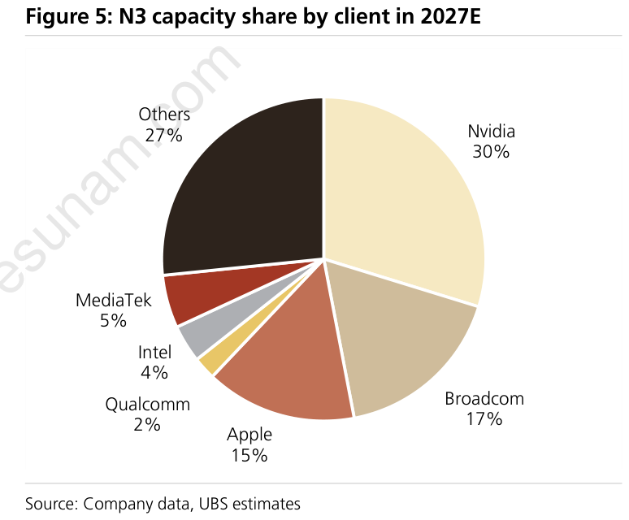

### 解讀摘要

兩張圖揭示 N3 客戶結構的大換血：Apple 從 38%（650k wafers）跌至 15%（329k），絕對量腰斬 -49%——這不是 iPhone 週期下滑，而是 N3 被 Cloud AI 加速瓜分的結構性擠壓。Nvidia 從 10% 躍升至 30%（171→657k，+284%），成為 2027E 最大單一客戶；「Others」從 15% 升至 27%（257→591k，+130%），代表 AWS Trainium、Alchip 等 ASIC 進入 N3 製程。

> **原文補充**：封面提到 Cloud AI + networking 佔 2027E N3 需求 71%；Figure 5 的 Nvidia+Broadcom+Others = 74%，差距 3% 可能因 Figure 5 的 Others 含部分非 AI networking 晶片，或餅圖以產能佔比而非需求佔比計算所致。

### 數據表

**單位：k wafers/yr，由佔比 × 年度產能（2026E 1,710k；2027E 2,190k）推算**

| 客戶 | 2026E 佔比 | 2026E | 2027E 佔比 | 2027E | YoY |
|---|---|---|---|---|---|
| **Apple** | 38% | 650 | 15% | 329 | -321k（-49%） |
| **Nvidia** | 10% | 171 | 30% | 657 | +486k（+284%） |
| **Broadcom** | 10% | 171 | 17% | 372 | +201k（+118%） |
| **Others** | 15% | 257 | 27% | 591 | +334k（+130%） |
| **MediaTek** | 11% | 188 | 5% | 110 | -78k（-41%） |
| **Intel** | 9% | 154 | 4% | 88 | -66k（-43%） |
| **Qualcomm** | 7% | 120 | 2% | 44 | -76k（-63%） |
| **合計** | 100% | **1,710k** | 100% | **2,190k** | +480k（+28%） |

### 洞察

> **洞察一**：Apple N3 絕對量從 650k 跌至 329k（-49%），是主動減少採購（或轉向 N2），而非只是被稀釋。對 TSMC 而言，這釋放的 321k wafer 空間正好讓 AI 客戶填補，不需純 greenfield 擴產。

> **洞察二**：Cloud AI 三組合（Nvidia + Broadcom + Others）從 35% → 74%，絕對量從 598k → 1,620k（+171% YoY）。Others 的 +334k 超過 Nvidia +486k 的 69%，暗示 ASIC 訂單增量在 2027E 可能成為市場低估的變數。

---

## Figure 6｜Total CoWoS Interposer Wafer Demand

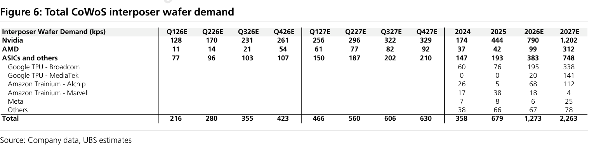

### 解讀摘要

CoWoS 需求以穩定的複利速度成長：358k（2024）→ 679k（+90%）→ 1,273k（+87%）→ 2,263k（+78%）。Nvidia 仍是主力（2026E 佔 62%），但 ASIC 成長速度持續超越——Google TPU 雙供應商策略（Broadcom 195k + MediaTek 20k = 215k → Broadcom 338k + MediaTek 141k = 479k，+123% YoY）成為最大的 ASIC 增量來源。Amazon Trainium 出現供應商替換信號：Marvell 從 38k 崩跌至 4k，Alchip 從 5k 上升至 112k。

> **原文補充**：UBS 明確指出 Google TPU CoWoS 需求 2027E 成長 123% YoY（215→479k ✓）。原文稱 AMD CoWoS「三倍成長」，驅動力為「MI450 和 Venice CPU」；注意原文使用 MI450，而 Figure 9 顯示 MI400，可能為同一產品線的不同命名階段。

### 數據表

**單位：kps（千片）**

| 客戶 | Q1 26E | Q2 26E | Q3 26E | Q4 26E | Q1 27E | Q2 27E | Q3 27E | Q4 27E | 2024 | 2025 | 2026E | 2027E |
|---|---|---|---|---|---|---|---|---|---|---|---|---|
| **Nvidia** | 128 | 170 | 231 | 261 | 256 | 296 | 322 | 329 | 174 | 444 | 790 | 1,202 |
| **AMD** | 11 | 14 | 21 | 54 | 61 | 77 | 82 | 92 | 37 | 42 | 99 | 312 |
| **ASICs & others** | 77 | 96 | 103 | 107 | 150 | 187 | 202 | 210 | 147 | 193 | 383 | 748 |
| 　Google TPU - Broadcom | — | — | — | — | — | — | — | — | 60 | 76 | 195 | 338 |
| 　Google TPU - MediaTek | — | — | — | — | — | — | — | — | 0 | 0 | 20 | 141 |
| 　Amazon Trainium - Alchip | — | — | — | — | — | — | — | — | 26 | 5 | 68 | 112 |
| 　Amazon Trainium - Marvell | — | — | — | — | — | — | — | — | 17 | 38 | 18 | 4 |
| 　Meta | — | — | — | — | — | — | — | — | 7 | 8 | 6 | 25 |
| 　Others | — | — | — | — | — | — | — | — | 38 | 66 | 67 | 78 |
| **Total** | **216** | **280** | **355** | **423** | **466** | **560** | **606** | **630** | **358** | **679** | **1,273** | **2,263** |

### 洞察

> **洞察一**：Amazon Trainium 供應商替換已接近完成——Marvell 從 2025 年頂峰 38k 跌至 2027E 4k（-89%），Alchip 從 5k 升至 112k（+2,140%）。兩者合計維持 Amazon Trainium 訂單規模但業務完全轉移，這是報告中難得一見的具名供應商替換數據。

> **洞察二**：Google TPU 2027E 合計 479k（Broadcom 338k + MediaTek 141k），成為僅次於 Nvidia 的第二大 CoWoS 需求來源（479 vs AMD 312k）。MediaTek 的 141k 是 2026 年才出現的純增量，是一條全新的高 ASP 收入曲線。

---

## Figure 7｜Breakdown of CoWoS Demand

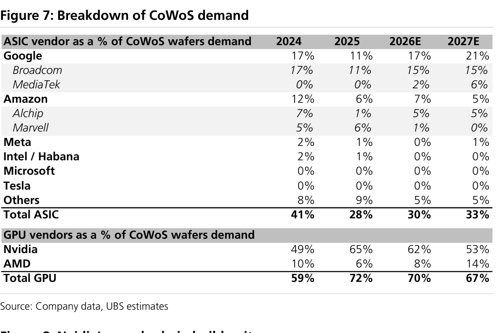

### 解讀摘要

Nvidia 的 CoWoS 份額在 2025 年達到 65% 高峰（H100 超級週期），此後逐年回落至 53%（2027E）——但這是份額下滑，絕對量仍大幅成長（Figure 6：790→1,202k）。ASIC 份額從 2025 年低谷 28% 回升至 33%（2027E），主要驅動力是 Google 雙供應商策略（Broadcom 維持 15%，MediaTek 從 0 升至 6%），Google 2027E 整體達 21%，是 ASIC 單一最大 CoWoS 買家。

### 數據表

**ASIC vendor as a % of CoWoS wafers demand**

| 客戶 | 2024 | 2025 | 2026E | 2027E |
|---|---|---|---|---|
| **Google** | 17% | 11% | 17% | 21% |
| 　Broadcom | 17% | 11% | 15% | 15% |
| 　MediaTek | 0% | 0% | 2% | 6% |
| **Amazon** | 12% | 6% | 7% | 5% |
| 　Alchip | 7% | 1% | 5% | 5% |
| 　Marvell | 5% | 6% | 1% | 0% |
| **Meta** | 2% | 1% | 0% | 1% |
| **Intel / Habana** | 2% | 1% | 0% | 0% |
| **Microsoft** | 0% | 0% | 0% | 0% |
| **Tesla** | 0% | 0% | 0% | 0% |
| **Others** | 8% | 9% | 5% | 5% |
| **Total ASIC** | **41%** | **28%** | **30%** | **33%** |

**GPU vendor as a % of CoWoS wafers demand**

| 客戶 | 2024 | 2025 | 2026E | 2027E |
|---|---|---|---|---|
| **Nvidia** | 49% | 65% | 62% | 53% |
| **AMD** | 10% | 6% | 8% | 14% |
| **Total GPU** | **59%** | **72%** | **70%** | **67%** |

### 洞察

> **洞察一**：Amazon CoWoS 份額從 2024 年 12% 跌至 2027E 5%，內部 Marvell 從 6%（2025）歸零，Alchip 維持 5%——是供應商替換而非業務萎縮。對 Marvell 是具名客戶流失，對 Alchip 是保單而非成長。

> **洞察二**：2025 年是 ASIC CoWoS 份額最弱的一年（28%），恰逢 Nvidia H100 出貨高峰。GPU 超級週期壓縮 ASIC 相對地位的規律，在 Google TPU v8i + AWS Trainium 3 同步放量的 2027E 開始逆轉。

> **洞察三（配合 Figure 6）**：Figure 7 的 Microsoft/Tesla 佔比 0%，但 Figure 6 Others 仍有 67k（2026E）→ 78k（2027E），暗示這些訂單分散在多個未具名專案，成長的廣泛性比集中度更有意義。

---

## Figure 8｜Nvidia's Supply Chain Build Units

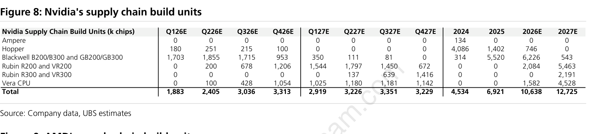

### 解讀摘要

2026 年是 Blackwell 的出貨頂峰（6,226k，佔全年 58.5%），同時 Rubin R200/VR200 從 Q2 啟動爬坡（200→678→1,206k），全年累積 2,084k（佔 19.6%）。到 2027 年架構組成幾乎完全翻轉：Blackwell 從 58.5% 跌至 4.3%（543k），Rubin R200+R300+Vera CPU 合計佔 95.7%（12,182k）——總量僅成長 20%（10,638→12,725k），但主力產品在兩年內幾乎完全替換。Vera CPU 是過去從未出現在 Nvidia 供應鏈中的新類別，2026E 貢獻 1,582k（14.9%），2027E 達 4,528k（35.6%），是純增量需求。

> **原文補充**：UBS 本次上修 Nvidia CoWoS 需求 11%，原因：(1) Blackwell build 從 5.5m 上修至 6.2m；(2) Vera CPU 上修至 1.6m，驅動力是 agentic AI 帶動的獨立 CPU 需求（stand-alone，非僅作為 GPU 配套）。Rubin 良率問題被投資人廣泛討論，UBS 認為問題解決中，H2 2026 將陡峭放量至 2.1m 顆（Figure 8 Rubin R200 2026E = 2,084k ✓）。UBS 預估 2026 年 Nvidia AI GPU（不含 Vera CPU）合計約 9m 顆（10,638k - 1,582k = 9,056k ≈ 9m）。

### 數據表

**單位：k chips**

| 產品 | Q1 26E | Q2 26E | Q3 26E | Q4 26E | Q1 27E | Q2 27E | Q3 27E | Q4 27E | 2024 | 2025 | 2026E | 2027E |
|---|---|---|---|---|---|---|---|---|---|---|---|---|
| Ampere | 0 | 0 | 0 | 0 | 0 | 0 | 0 | 0 | 134 | 0 | 0 | 0 |
| Hopper | 180 | 251 | 215 | 100 | 0 | 0 | 0 | 0 | 4,086 | 1,402 | 746 | 0 |
| Blackwell B200/B300 & GB200/GB300 | 1,703 | 1,855 | 1,715 | 953 | 350 | 111 | 81 | 0 | 314 | 5,520 | 6,226 | 543 |
| Rubin R200 & VR200 | 0 | 200 | 678 | 1,206 | 1,544 | 1,797 | 1,450 | 672 | 0 | 0 | 2,084 | 5,463 |
| Rubin R300 & VR300 | 0 | 0 | 0 | 0 | 0 | 137 | 639 | 1,416 | 0 | 0 | 0 | 2,191 |
| Vera CPU | 0 | 100 | 428 | 1,054 | 1,025 | 1,180 | 1,181 | 1,142 | 0 | 0 | 1,582 | 4,528 |
| **Total** | **1,883** | **2,405** | **3,036** | **3,313** | **2,919** | **3,226** | **3,351** | **3,229** | **4,534** | **6,921** | **10,638** | **12,725** |

### 洞察

> **洞察一**：Q1 2027E 出現季度環比下滑（3,313→2,919k），是 Blackwell 收尾（350k 清尾單）而 Rubin 尚未全速的過渡缺口。這個供應鏈低谷對下游組裝廠是一個可預期的短期壓力窗口。

> **洞察二**：Vera CPU 的 2027E 規模（4,528k）幾乎與 Rubin R200（5,463k）並駕齊驅，代表每套 Rubin NVL rack 的 CPU 需求與 GPU 高度對應。過去估算 Nvidia CoWoS 時不含 CPU，未來必須納入計算。

> **洞察三（配合 Figure 6）**：Figure 6 Nvidia CoWoS interposer 2026E→2027E +52%，Figure 8 build units 同期 +20%（10,638→12,725k），差距暗示 Rubin/Vera 每顆晶片消耗的 CoWoS 面積比 Blackwell 更大，單位 CoWoS 用量提升約 26%（1.52/1.20 - 1）。

---

## Figure 9｜AMD's Supply Chain Build Units

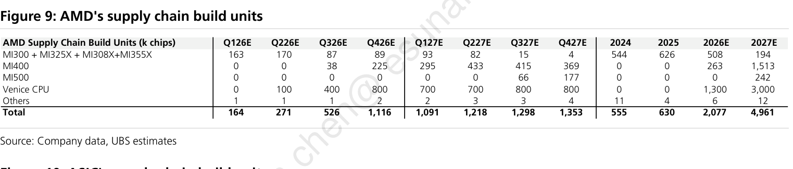

### 解讀摘要

AMD 的 build units 從 2025 年的 630k 跳升至 2026E 的 2,077k（+230% YoY），再到 2027E 的 4,961k（+139% YoY），成長速度遠超 Nvidia（同期 +54%、+20%），但出發點仍不及 Nvidia 的 1/3。2026E 以 Venice CPU 為主（1,300k，62.6%），GPU 僅 MI400 263k（12.7%）加上 MI300 尾單 508k（24.5%）；到 2027E，Venice CPU 維持主體地位（3,000k，60.5%），MI400 三倍跳至 1,513k（30.5%），MI500 在 Q3 出現（全年 242k，4.9%）。Q4 2026E 是 AMD 供應鏈放量拐點，單季從 526k 跳至 1,116k（+112%），驅動力是 Venice CPU 與 MI400 同步啟動。

> **原文補充**：封面原文稱「MI450 ramp-up」，但 Figure 9 表格標示為「MI400」。MI450 可能是 MI400 系列的最終量產命名，兩者指向同一產品線。

### 數據表

**單位：k chips**

| 產品 | Q1 26E | Q2 26E | Q3 26E | Q4 26E | Q1 27E | Q2 27E | Q3 27E | Q4 27E | 2024 | 2025 | 2026E | 2027E |
|---|---|---|---|---|---|---|---|---|---|---|---|---|
| MI300 + MI325X + MI308X + MI355X | 163 | 170 | 87 | 89 | 93 | 82 | 15 | 4 | 544 | 626 | 508 | 194 |
| MI400 | 0 | 0 | 38 | 225 | 295 | 433 | 415 | 369 | 0 | 0 | 263 | 1,513 |
| MI500 | 0 | 0 | 0 | 0 | 0 | 0 | 66 | 177 | 0 | 0 | 0 | 242 |
| Venice CPU | 0 | 100 | 400 | 800 | 700 | 700 | 800 | 800 | 0 | 0 | 1,300 | 3,000 |
| Others | 1 | 1 | 1 | 2 | 2 | 3 | 3 | 4 | 11 | 4 | 6 | 12 |
| **Total** | **164** | **271** | **526** | **1,116** | **1,091** | **1,218** | **1,298** | **1,353** | **555** | **630** | **2,077** | **4,961** |

### 洞察

> **洞察一**：Venice CPU 在兩年內都是 AMD 最大單一品項（2026E 62.6%、2027E 60.5%），但對照 Figure 6 AMD CoWoS wafer 需求（2026E 99k、2027E 312k）遠小於 GPU chip count（263k、1,513k），顯示 Venice CPU 不走 CoWoS 封裝，不應納入 CoWoS 需求估算。

> **洞察二（配合 Figure 8）**：AMD 2027E 總量 4,961k 約為 Nvidia 12,725k 的 39%，但 CoWoS interposer 需求（AMD 312k vs Nvidia 1,202k = 26%）——AMD 的 chip-to-CoWoS 轉換率低於 Nvidia，意味 AMD GPU 平均消耗的 CoWoS 面積相對較小，或有更高比例的 chip 不走 CoWoS 封裝。

---

## Figure 10｜ASIC's Supply Chain Build Units

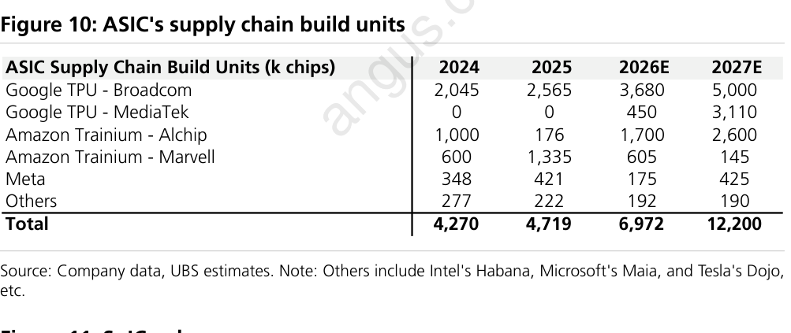

### 解讀摘要

ASIC 總 build units 從 4,719k（2025）跳升至 6,972k（2026E，+48% YoY），再至 12,200k（2027E，+75% YoY），後者加速的主要動力是 Google TPU MediaTek 從 450k 暴增至 3,110k（+591%，從無到貢獻 25% 的 ASIC 總量），以及 Alchip 從 1,700k 升至 2,600k（+53%）。Google 雙供應商在 chip 層面最為明顯——Broadcom（5,000k）與 MediaTek（3,110k）2027E 合計 8,110k，佔 ASIC 總量 66%，Google 確立最大 ASIC 買家地位。Marvell 快速退出：Amazon Trainium chip build 從 1,335k（2025）→ 605k → 145k，對應 Alchip 持續放量。

### 數據表

**單位：k chips**

| 客戶 | 2024 | 2025 | 2026E | 2027E |
|---|---|---|---|---|
| Google TPU - Broadcom | 2,045 | 2,565 | 3,680 | 5,000 |
| Google TPU - MediaTek | 0 | 0 | 450 | 3,110 |
| Amazon Trainium - Alchip | 1,000 | 176 | 1,700 | 2,600 |
| Amazon Trainium - Marvell | 600 | 1,335 | 605 | 145 |
| Meta | 348 | 421 | 175 | 425 |
| Others | 277 | 222 | 192 | 190 |
| **Total** | **4,270** | **4,719** | **6,972** | **12,200** |

> 列項加總（2026E: 6,802k；2027E: 11,470k）與報告總計不符，差距應為各行捨入所致，以報告總計為準。Others 含 Intel Habana、Microsoft Maia、Tesla Dojo 等。

### 洞察

> **洞察一**：MediaTek 對 Google TPU 的意義超過市場認知。2027E 3,110k chip，若以 Figure 6 CoWoS 比例換算（MediaTek TPU 佔 Google CoWoS 的 6/21 = 29%，對應 141k interposers），chip-to-interposer 比約 22:1，暗示每片 CoWoS interposer 封裝多顆 TPU die，與 Google TPU 多晶片設計一致（依據 Google 公開架構資料）。

> **洞察二（配合 Figure 7）**：Figure 7 ASIC CoWoS 份額從 28%（2025）回升至 33%（2027E），Figure 10 ASIC chip units 同期從 4,719k 升至 12,200k（+159%）。chip 成長遠快於 CoWoS 份額回升，意味大量 ASIC chip 不走 CoWoS，或 CoWoS interposer 產能是 ASIC 擴張的瓶頸。

---

## Figure 11｜SoIC Volume

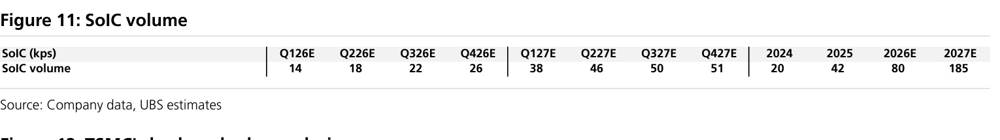

### 解讀摘要

SoIC 年度成長率加速：2024→2025 +110%（20→42k）、2025→2026E +90%（42→80k）、2026E→2027E +131%（80→185k）。季度軌跡呈兩種節奏：2026 年內每季穩定增加約 4kps（14→18→22→26），屬平穩爬坡；2027 Q1 一口氣跳升至 38k（+46%），顯示有新客戶或新產品在年初拉動需求台階式上升，之後 Q2-Q4 再線性增加至 51k 高點。

> **原文補充**：UBS 揭露 Nvidia 次世代 Feynman（2028E）封裝架構：計劃使用 TSMC SoIC 將兩顆 GPU die 堆疊在另兩顆 GPU die 上（兩組 GPU stack），在單一 CoWoS package 內實現 4-GPU-die 封裝，將大幅拉高 SoIC wafer 需求強度。若 TSMC CoPoS 2028 年量產，封裝設計可能再度調整。Nvidia 在評估 TSMC SoIC 的同時也考慮 Intel EMIB-T 方案，但目前路線圖仍高度綁定 TSMC 技術。

### 數據表

**單位：kps**

| | Q1 26E | Q2 26E | Q3 26E | Q4 26E | Q1 27E | Q2 27E | Q3 27E | Q4 27E | 2024 | 2025 | 2026E | 2027E |
|---|---|---|---|---|---|---|---|---|---|---|---|---|
| **SoIC volume** | 14 | 18 | 22 | 26 | 38 | 46 | 50 | 51 | 20 | 42 | 80 | 185 |

### 洞察

> **洞察一**：2027E 的 185k 是 2025 年 42k 的 4.4 倍，但 SoIC 客戶組成報告未揭露。SoIC 成長時間線與 Rubin/MI400 架構上市高度吻合——若 SoIC 主要用於下一代 AI GPU 封裝，2027E 的跳升即是 Rubin 量產放量的封裝層信號。此推論使用了報告以外的架構知識（TSMC SoIC 適用場景），供參考。

> **洞察二（配合 Figure 6）**：CoWoS interposer 2027E 為 2,263k，SoIC 為 185k，比例約 12:1。SoIC 仍是小眾但快速成長的封裝技術，滲透率從 2025 年 42/679 = 6.2% 升至 2027E 185/2,263 = 8.2%。Feynman 4-die 架構若 2028E 量產，滲透率可能出現跳升。

---

## Figure 12｜TSMC's Back-end Sales Analysis

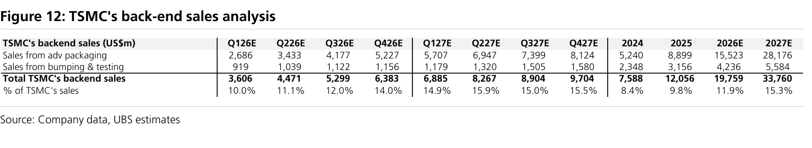

### 解讀摘要

TSMC 先進封裝營收連續三年加速成長：+70%（2024→2025）、+74%（→2026E）、+81%（→2027E），到 2027E 達 \$28.2B，是 2025 年整個後端業務（\$12.1B）的 2.3 倍。先進封裝在後端營收中的佔比從 69%（2024）升至 83%（2027E），反映 CoWoS 和 SoIC 的 ASP 遠高於傳統 bumping，帶動業務組合升級。後端整體佔 TSMC 總營收從 8.4%（2024）升至 15.3%（2027E），TSMC 向「晶圓代工 + 封裝一體化」的財務轉型已可量化。

> **原文補充**：UBS 預測 Nvidia CoWoS 需求 2027E 成長 52% 至 1,202k wafers（Figure 6 ✓），是 Figure 12 先進封裝成長的主要驅動力。本次報告對 2026E Nvidia CoWoS 需求上修 11%，是本期先進封裝預測調升的背景。

### 數據表

**單位：US$m**

| | Q1 26E | Q2 26E | Q3 26E | Q4 26E | Q1 27E | Q2 27E | Q3 27E | Q4 27E | 2024 | 2025 | 2026E | 2027E |
|---|---|---|---|---|---|---|---|---|---|---|---|---|
| 先進封裝 | 2,686 | 3,433 | 4,177 | 5,227 | 5,707 | 6,947 | 7,399 | 8,124 | 5,240 | 8,899 | 15,523 | 28,176 |
| Bumping & testing | 919 | 1,039 | 1,122 | 1,156 | 1,179 | 1,320 | 1,505 | 1,580 | 2,348 | 3,156 | 4,236 | 5,584 |
| **Total backend** | **3,606** | **4,471** | **5,299** | **6,383** | **6,885** | **8,267** | **8,904** | **9,704** | **7,588** | **12,056** | **19,759** | **33,760** |
| 佔 TSMC 總營收 | 10.0% | 11.1% | 12.0% | 14.0% | 14.9% | 15.9% | 15.0% | 15.5% | 8.4% | 9.8% | 11.9% | 15.3% |

### 洞察

> **洞察一**：反推 TSMC 隱含總營收——2026E 後端 \$19.8B 佔 11.9% → 總收入約 \$166B；2027E \$33.8B 佔 15.3% → 約 \$221B。這是 UBS 對 TSMC 的整體營收假設，2026E 較 2024 實際值（~\$89B）近乎翻倍，成立前提是 AI 晶片需求持續高速兌現。

> **洞察二**：Bumping & testing 年成長率穩定在 32-34%，後端整體毛利率的改善主要來自業務組合向高 ASP 先進封裝的移轉（mix effect），而非 bumping 本身提價。

> **洞察三（配合 Figure 6）**：Figure 6 CoWoS interposer wafer 2026E→2027E +78%，Figure 12 先進封裝營收 +81% 幾乎同步，顯示先進封裝的成長主要由**量**驅動，CoWoS 單位 ASP 並無明顯抬升，定價能力仍待確認。

---

## Figure 13｜Industry CoWoS Capacity

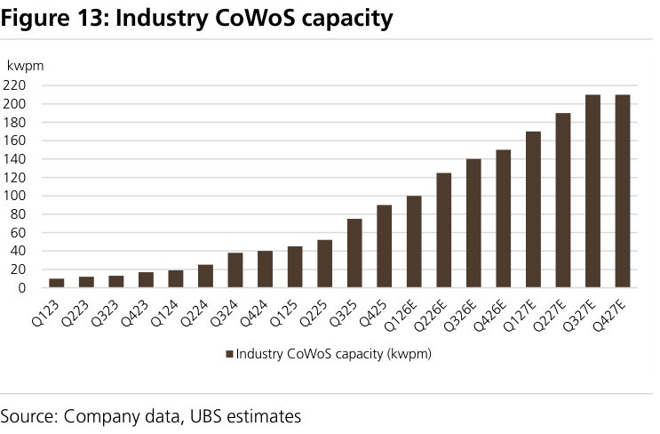

### 解讀摘要

產業 CoWoS 產能從 Q1 2023 的 10 kwpm 成長至 Q4 2027E 的 207 kwpm，五年擴張約 20 倍，且擴張節奏有三個明顯加速段：Q3 2024（38k，環比 +46%）、Q3 2025（73k，環比 +38%）、Q2 2026E（125k，環比 +25%）。2027H2 的軌跡趨於平台——Q3 與 Q4 2027E 均約 207 kwpm，意味本輪擴產周期在 2027 年中觸及上限，未來需求成長必須依靠良率提升或 dies/wafer 提升來消化。

> **原文補充**：UBS 指出產業 CoWoS 產能從「2026E 末 150 kwpm → 2027E 末 210 kwpm」（圖中 Q4 2026E ≈ 150、Q4 2027E ≈ 207，吻合）。

### 數據表

**單位：kwpm，視覺估算**

| 季度 | 產業 CoWoS 產能 | 季度 | 產業 CoWoS 產能 |
|---|---|---|---|
| Q1 2023 | 10 | Q1 2026E | 100 |
| Q2 2023 | 12 | Q2 2026E | 125 |
| Q3 2023 | 13 | Q3 2026E | 140 |
| Q4 2023 | 16 | Q4 2026E | 150 |
| Q1 2024 | 18 | Q1 2027E | 170 |
| Q2 2024 | 26 | Q2 2027E | 190 |
| Q3 2024 | 38 | Q3 2027E | 207 |
| Q4 2024 | 40 | Q4 2027E | 207 |
| Q1 2025 | 47 | | |
| Q2 2025 | 53 | | |
| Q3 2025 | 73 | | |
| Q4 2025 | 90 | | |

### 洞察

> **洞察一**：Q3 2024（38k）是第一個加速拐點，對應 Nvidia H100 CoWoS-L 大規模出貨時期（依據 Nvidia 公開供應鏈時間線）。不到兩年內產能從 13k 擴到 90k（+590%），顯示供應鏈對超級週期的快速動員能力。

> **洞察二**：2027H2 產能平台（207 kwpm）若維持，2028 年若 AI 需求繼續成長，CoWoS 供給缺口將重新出現——這是本輪投資周期的產能上限信號。

> **洞察三（配合 Figure 14）**：此圖為全產業；Q4 2027E 平台期中，TSMC 已達 150 kwpm 上限，後續邊際增量全部來自非 TSMC（ASE/Amkor）。

---

## Figure 14｜TSMC vs. Non-TSMC CoWoS Capacity

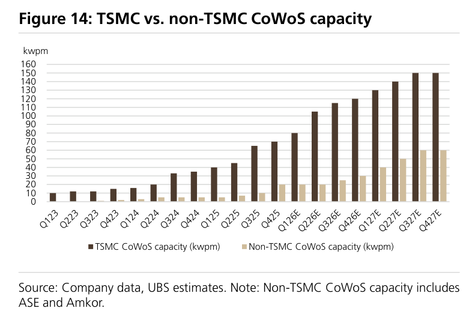

### 解讀摘要

TSMC CoWoS 市佔從 2023 年近 100% 逐步下滑至 2027E 末的 71%，但這是絕對量大幅擴張下的相對稀釋，TSMC 自身產能從 10 kwpm 成長至 150 kwpm（+15 倍），並非輸掉既有訂單。非 TSMC（ASE + Amkor）年均值從 2026E 約 22.5 kwpm 成長至 2027E 約 52.5 kwpm（+133%），遠高於 TSMC 同期的 +36%（105→142.5 kwpm）。Q4 2025 非 TSMC 從 7 突然跳升至 20 kwpm（+186%），對應 ASE 宣布大規模 CoWoS 產能投資的時間點（依據 ASE 公開法說資料）。

> **原文補充**：UBS 明確目標「TSMC/OSATs 達 150/60 kwpm」——與 Figure 14 Q4 2027E 讀值（TSMC 150、non-TSMC 60）完全吻合。

### 數據表

**單位：kwpm，視覺估算，與 Figure 13 加總交叉驗證通過（誤差 <3%）**

| 季度 | TSMC | Non-TSMC | 合計 | TSMC 佔比 |
|---|---|---|---|---|
| Q1 2023 | 10 | 0 | 10 | 100% |
| Q4 2023 | 15 | 2 | 17 | 88% |
| Q4 2024 | 35 | 5 | 40 | 88% |
| Q4 2025 | 70 | 20 | 90 | 78% |
| Q1 2026E | 80 | 20 | 100 | 80% |
| Q2 2026E | 105 | 20 | 125 | 84% |
| Q3 2026E | 115 | 22 | 137 | 84% |
| Q4 2026E | 120 | 28 | 148 | 81% |
| Q1 2027E | 130 | 40 | 170 | 76% |
| Q2 2027E | 140 | 50 | 190 | 74% |
| Q3 2027E | 150 | 60 | 210 | 71% |
| Q4 2027E | 150 | 60 | 210 | 71% |

> 非 TSMC 包含 ASE 與 Amkor。

### 洞察

> **洞察一**：非 TSMC 成長（+133% YoY）遠超 TSMC（+36%），但服務不同客戶層——TSMC CoWoS 主要服務 Nvidia/AMD 旗艦 GPU，非 TSMC 主要承接較低階或成本敏感型需求。市佔下滑是市場分層，而非技術競爭失利。

> **洞察二（配合 Figure 13）**：2027H2 產業整體觸及平台（207 kwpm），TSMC 已達 150 kwpm 上限，後續邊際增量全部來自非 TSMC。若 2028 年需求繼續成長，非 TSMC 的擴張速度決定供需缺口是否重現。

---

## Figure 15｜Industry CoWoS Capacity vs. Nvidia's Volume

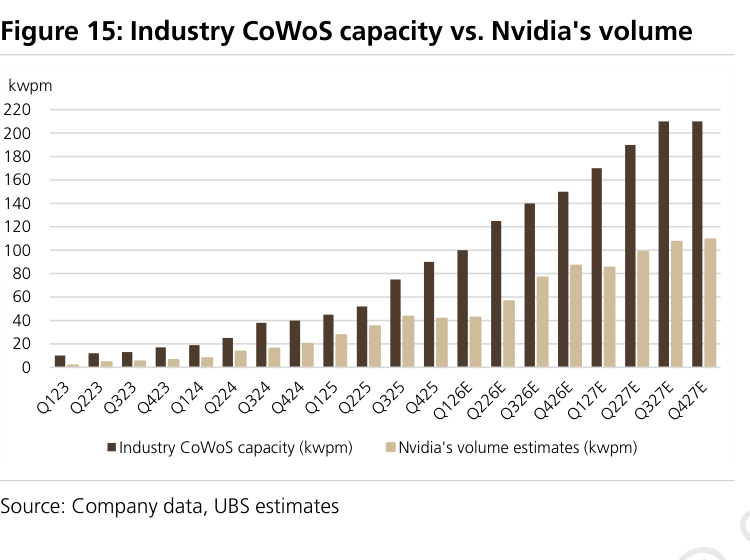

### 解讀摘要

Nvidia CoWoS 需求從 Q1 2026E 的 43 kwpm 成長至 Q4 2027E 的 110 kwpm（+156%），但產業產能同步從 100 擴張至 207 kwpm（+107%），Nvidia 佔產業產能比例維持在 43-58% 區間窄幅波動，並未出現單一客戶壟斷。Q2 2025 的 72% 是歷史高點，對應 H100 CoWoS-L 需求集中爆發時期；此後隨 ASE/Amkor 加入擴產，Nvidia 佔比回落並穩定在 50-58%，市場走向更健康的多客戶結構。

### 數據表

**單位：kwpm。2026-2027E Nvidia 由 Figure 6 季度值 ÷ 3 推算；歷史值為視覺估算**

| 季度 | 產業 CoWoS 產能 | Nvidia 需求 | Nvidia 佔產能比 |
|---|---|---|---|
| Q4 2025 | 90 | 48 | 53% |
| Q1 2026E | 100 | 43 | 43% |
| Q2 2026E | 125 | 57 | 46% |
| Q3 2026E | 140 | 77 | 55% |
| Q4 2026E | 150 | 87 | 58% |
| Q1 2027E | 170 | 85 | 50% |
| Q2 2027E | 190 | 99 | 52% |
| Q3 2027E | 207 | 107 | 52% |
| Q4 2027E | 207 | 110 | 53% |

### 洞察

> **洞察一**：Q2 2025 Nvidia 佔 72% 是整段歷史的極端時刻（H100 超級週期）。此後 Nvidia 佔比持續下降，不是因為 Nvidia 需求減少（實際從 38 成長至 110 kwpm），而是產業產能擴張更快——對 AMD、ASIC 等客戶是利好，搶不到 CoWoS 的窗口正在縮短。

> **洞察二（配合 Figure 7）**：Figure 7 顯示 Nvidia 佔 CoWoS 需求 62%（2026E），Figure 15 顯示 Nvidia 佔產業產能 43-58%。需求佔比 > 產能佔比，意味 CoWoS 整體利用率低於 100%，產業有一定緩衝空間，與 N3 前端 107% 過載形成對比。

---

## Figure 16｜CoWoS Demand from Major Customers

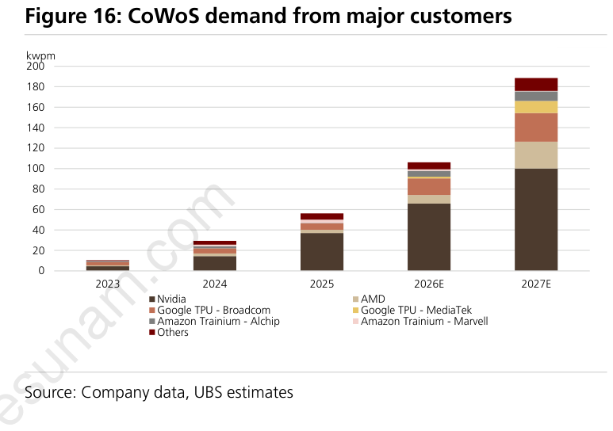

### 解讀摘要

CoWoS 需求從 2023 年的 11 kwpm 成長至 2027E 的 188.6 kwpm，四年間成長 17 倍，且增速並未放緩。2027E 的成長動能由三股力量並行驅動：Nvidia（65.8→100.2 kwpm，+52%）提供基礎量，AMD（8.3→26.0 kwpm，+215%）提供最快的成長率，而 Google 合計（18.0→40.0 kwpm，+122%）的絕對增量（+22 kwpm）超過 AMD（+17.7 kwpm），成為僅次於 Nvidia 的第二大增量來源。

### 數據表

**單位：kwpm（年度平均）。數值由 Figure 6 年度 kps ÷ 12 推算，2023 為視覺估算**

| 客戶 | 2023 | 2024 | 2025 | 2026E | 2027E |
|---|---|---|---|---|---|
| **Nvidia** | 8 | 37.0 | 37.0 | 65.8 | 100.2 |
| **AMD** | 1 | 3.1 | 3.5 | 8.3 | 26.0 |
| **Google TPU - Broadcom** | 3 | 5.0 | 6.3 | 16.3 | 28.2 |
| **Google TPU - MediaTek** | 0 | 0 | 0 | 1.7 | 11.8 |
| **Amazon Trainium - Alchip** | 1 | 2.2 | 0.4 | 5.7 | 9.3 |
| **Amazon Trainium - Marvell** | 1 | 1.4 | 3.2 | 1.5 | 0.3 |
| **Meta + Others** | 2 | 3.8 | 6.2 | 6.1 | 8.6 |
| **合計** | 11 | 29.8 | 56.6 | 106.1 | 188.6 |

### 洞察

> **洞察一**：2027E Google TPU 總需求（Broadcom 28.2 + MediaTek 11.8 = 40.0 kwpm）超越 AMD（26.0 kwpm），Google 是市場低估的 CoWoS 第二大客戶。MediaTek 的 11.8 kwpm 幾乎全部是 2026 年後才出現的純增量，對 MediaTek 是一條全新的高 ASP 收入曲線。

> **洞察二（配合 Figure 7）**：Amazon Trainium Marvell 在 Figure 16 幾乎消失（0.3 kwpm），但 Amazon 整體 CoWoS 需求（Alchip 9.3 kwpm）仍在成長。供應商替換已量化完成：Alchip 接收了 Marvell 的訂單並繼續放量，對 Alchip 是確定性高的成長動能，對 Marvell 是一個已具名的業務損失。

---

## 跨 Figure 彙整表

### 彙整一｜AI 晶片 Build Units（k chips）— Figure 8 + 9 + 10

| 供應商 | 2024 | 2025 | 2026E | 2027E | 26→27E |
|---|---|---|---|---|---|
| **Nvidia** | 4,534 | 6,921 | 10,638 | 12,725 | +20% |
| **AMD** | 555 | 630 | 2,077 | 4,961 | +139% |
| **ASIC 合計** | 4,270 | 4,719 | 6,972 | 12,200 | +75% |
| 　Google TPU - Broadcom | 2,045 | 2,565 | 3,680 | 5,000 | +36% |
| 　Google TPU - MediaTek | 0 | 0 | 450 | 3,110 | +591% |
| 　Amazon - Alchip | 1,000 | 176 | 1,700 | 2,600 | +53% |
| 　Amazon - Marvell | 600 | 1,335 | 605 | 145 | -76% |
| 　Meta | 348 | 421 | 175 | 425 | +143% |
| 　Others | 277 | 222 | 192 | 190 | -1% |
| **Total** | **9,359** | **12,270** | **19,687** | **29,886** | **+52%** |

> 2026E→2027E AI 晶片總量 +52%，但 Nvidia 僅 +20%——成長動能正在從 Nvidia 分散至 AMD（+139%）與 ASIC（+75%）。MediaTek Google TPU 是最大的增量變數（+591%），同時也是報告中假設最薄弱的一項。

---

### 彙整二｜CoWoS 供需平衡（kwpm）— Figure 6 + 13

Figure 6 季度值 ÷ 3 轉換 kwpm，對照 Figure 13 同季產能：

| 季度 | 需求 kwpm | 產能 kwpm | 利用率 |
|---|---|---|---|
| Q1 2026E | 72 | 100 | 72% |
| Q2 2026E | 93 | 125 | 75% |
| Q3 2026E | 118 | 140 | 84% |
| Q4 2026E | 141 | 150 | 94% |
| Q1 2027E | 155 | 170 | 91% |
| Q2 2027E | 187 | 190 | 98% |
| Q3 2027E | 202 | 207 | 98% |
| Q4 2027E | **210** | **207** | **101%** |

> 「N3 比 CoWoS 更緊」在時間維度上更精確的表述：2026 年 N3 更緊（107% vs CoWoS 72-94%）；2027H2 兩者均告緊張（N3 101-104%，CoWoS ~101%）。

---

## 相關個股清單

| 類別 | 公司 | Ticker | 評等 | 備註 |
|---|---|---|---|---|
| 晶圓代工 | [[2330_台積電_外資報告整理\|TSMC]] | 2330 TW / TSM US | 買入（Top Pick） | 最大 AI 晶圓代工受益者 |
| IC 設計 | MediaTek | 2454 TW | 買入（Top Pick） | Google TPU 設計服務 |
| 先進封裝 | ASE Technology | 3711 TW / ASX US | 買入（Top Pick） | CoWoS 產能擴張，OSAT 受益 |
| 封裝設備 | GPTC | 6227 TW | 買入 | 先進封裝設備 |
| 測試設備 | Chroma | 2360 TW | 買入 | 封裝測試設備 |
| 精密機械 | Hon Precision | — | 買入 | 先進封裝設備 |
| 封裝設備 | ASMPT | 0522 HK | 買入 | 封裝測試設備 |
| 測試服務 | KYEC | 2449 TW | 買入 | Final test 強勁佈局 |
| BMC/伺服器 | Aspeed | 5274 TW | 買入 | BMC 強勁展望 |
| IP/設計 | GUC | 6488 TW | 買入 | Google CPU 上行潛力 |
| ASIC 設計 | [[3661_世芯_外資報告整理\|Alchip]] | 3661 TW | 買入 | Amazon Trainium3 & 4 機會 |
